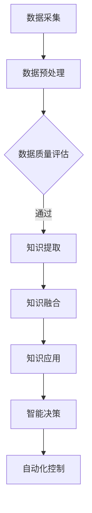

                 

 **关键词**：物联网，智能环境，无处不在学习，知识应用，AI技术，智能算法，系统架构，未来展望。

**摘要**：本文探讨了物联网（IoT）在构建智能环境中的应用，以及如何通过无处不在学习（U-Learning）实现知识的智能化利用。文章首先介绍了物联网和无处不在学习的核心概念，随后分析了智能环境中知识应用的现状与挑战。接着，文章详细阐述了核心算法原理、数学模型、项目实践以及未来应用场景。最后，文章总结了研究成果，探讨了未来发展趋势与挑战，并为读者提供了相关工具和资源的推荐。

## 1. 背景介绍

随着科技的迅猛发展，物联网（Internet of Things，IoT）已经成为现代社会的一个重要组成部分。物联网通过将各种设备连接到互联网，实现了数据采集、传输和处理，从而为各行各业带来了深远的影响。从智能家居、智慧城市到工业自动化，物联网的应用无处不在。然而，随着物联网设备的激增，如何有效地管理和利用这些数据成为一个重要问题。

无处不在学习（U-Learning）是一种新兴的学习模式，旨在通过物联网设备实现对知识的实时学习、更新和应用。无处不在学习不仅要求设备具备高效的计算能力，还需要具备强大的数据处理和通信能力。这种学习模式在智能环境中的应用，极大地提高了知识的利用效率和智能化程度。

智能环境是一个通过物联网技术构建的，能够感知、理解和响应人类需求的环境。智能环境中的设备、系统和应用相互连接、协作，实现了对环境信息的全面感知和智能处理。这种环境不仅能够提高人类的生活质量，还能为各行业提供创新解决方案。

本文将围绕物联网和无处不在学习在智能环境中的应用展开讨论，分析知识应用的现状与挑战，并探讨未来的发展趋势与挑战。

## 2. 核心概念与联系

### 2.1. 物联网（IoT）

物联网是指通过互联网将各种物理设备连接起来，实现数据采集、传输和处理的网络。这些设备可以是传感器、智能终端、工业设备等，它们通过无线网络或其他通信方式与互联网连接，从而形成一个庞大的物联网生态系统。

### 2.2. 在无处不在学习（U-Learning）

无处不在学习是一种新兴的学习模式，旨在通过物联网设备实现对知识的实时学习、更新和应用。它不仅要求设备具备高效的计算能力，还需要具备强大的数据处理和通信能力。

### 2.3. 智能环境

智能环境是一个通过物联网技术构建的，能够感知、理解和响应人类需求的环境。智能环境中的设备、系统和应用相互连接、协作，实现了对环境信息的全面感知和智能处理。

### 2.4. 知识应用

知识应用是指将知识融入到物联网设备和智能环境中，实现智能决策、自动化控制等功能。知识应用的关键在于如何有效地从大量数据中提取有价值的信息，并将其转化为可操作的知识。

### 2.5. Mermaid 流程图

下面是一个描述智能环境中知识应用的 Mermaid 流程图：



### 2.6. 核心概念联系

物联网、无处不在学习和智能环境是紧密相连的。物联网为无处不在学习提供了数据来源，无处不在学习为智能环境提供了智能决策支持，而智能环境则为物联网设备和系统提供了更广泛的应用场景。通过这三个核心概念的联系，知识在智能环境中得以实现高效利用。

## 3. 核心算法原理 & 具体操作步骤

### 3.1. 算法原理概述

在智能环境中，知识应用的核心在于如何有效地从大量数据中提取有价值的信息，并将其转化为可操作的知识。这一过程通常涉及以下步骤：

1. **数据采集**：通过物联网设备采集环境中的数据。
2. **数据预处理**：对采集到的数据进行清洗、过滤和标准化，以便后续处理。
3. **数据质量评估**：评估预处理后数据的质量，确保数据的有效性和可靠性。
4. **知识提取**：利用数据挖掘和机器学习技术从数据中提取有价值的信息。
5. **知识融合**：将提取的知识进行整合和优化，形成可操作的知识库。
6. **知识应用**：将知识库应用于智能决策和自动化控制。
7. **智能决策**：根据知识库中的信息，做出智能化的决策。
8. **自动化控制**：根据智能决策的结果，自动化执行相应的操作。

### 3.2. 算法步骤详解

#### 3.2.1. 数据采集

数据采集是知识应用的第一步，也是关键一步。物联网设备通过传感器、摄像头、GPS等手段采集环境中的数据，这些数据可以是温度、湿度、光照、声音、位置等信息。

#### 3.2.2. 数据预处理

数据预处理主要包括数据清洗、过滤和标准化。数据清洗旨在去除噪声和异常值，过滤则是根据需求筛选出有用的数据，标准化则是对数据进行归一化或标准化处理，以便后续分析。

#### 3.2.3. 数据质量评估

数据质量评估是确保数据有效性和可靠性的重要环节。评估方法可以包括统计分析、可视化分析和模型评估等。

#### 3.2.4. 知识提取

知识提取是通过数据挖掘和机器学习技术从数据中提取有价值的信息。数据挖掘方法包括关联规则挖掘、聚类分析、分类分析等，而机器学习方法则包括监督学习、无监督学习、强化学习等。

#### 3.2.5. 知识融合

知识融合是将提取的知识进行整合和优化，形成可操作的知识库。知识融合方法可以包括知识图谱、本体论、数据仓库等。

#### 3.2.6. 知识应用

知识应用是将知识库应用于智能决策和自动化控制。智能决策方法可以包括决策树、神经网络、支持向量机等，而自动化控制方法则可以包括PID控制、模糊控制、深度强化学习等。

#### 3.2.7. 智能决策

智能决策是根据知识库中的信息，做出智能化的决策。智能决策的结果可以用于优化系统性能、提高用户体验等。

#### 3.2.8. 自动化控制

自动化控制是根据智能决策的结果，自动化执行相应的操作。自动化控制可以提高工作效率，减少人为干预，从而提高系统的智能化程度。

### 3.3. 算法优缺点

#### 优点：

1. **高效性**：算法能够从大量数据中快速提取有价值的信息。
2. **灵活性**：算法可以根据不同的应用场景进行灵活调整。
3. **智能化**：算法能够实现智能决策和自动化控制，提高系统的智能化程度。

#### 缺点：

1. **数据依赖性**：算法的性能很大程度上依赖于数据的质量和多样性。
2. **计算资源需求**：算法的复杂度较高，对计算资源有较高要求。
3. **隐私问题**：数据采集和处理过程中可能涉及用户隐私，需要妥善处理。

### 3.4. 算法应用领域

算法广泛应用于智能家居、智慧城市、工业自动化、医疗健康等领域。例如，在智能家居中，算法可以用于智能安防、智能照明、智能家电控制等；在智慧城市中，算法可以用于交通管理、环境监测、公共安全等；在工业自动化中，算法可以用于生产过程优化、设备故障预测等；在医疗健康中，算法可以用于疾病预测、诊断辅助等。

## 4. 数学模型和公式 & 详细讲解 & 举例说明

### 4.1. 数学模型构建

在智能环境中，知识应用的核心是数学模型的构建。数学模型旨在从数据中提取有价值的信息，并将其转化为可操作的知识。以下是一个简化的数学模型构建过程：

1. **数据表示**：将采集到的数据表示为向量形式。
   $$ x = [x_1, x_2, ..., x_n] $$

2. **特征选择**：选择对目标变量有显著影响的数据特征。
   $$ f(x) = [f_1(x), f_2(x), ..., f_m(x)] $$

3. **特征变换**：对特征进行变换，提高模型的性能。
   $$ g(f(x)) = [g_1(f(x)), g_2(f(x)), ..., g_m(f(x))] $$

4. **模型训练**：使用机器学习算法训练模型。
   $$ \theta = \arg\min_{\theta} J(\theta) $$

5. **模型评估**：评估模型的性能，调整模型参数。
   $$ \hat{y} = \phi(g(f(x); \theta)) $$

6. **知识提取**：从模型中提取知识。
   $$ K = \{k_1, k_2, ..., k_p\} $$

### 4.2. 公式推导过程

假设我们有一个线性回归模型，目标是最小化误差平方和：

$$
\begin{align*}
\min_{\theta} \quad & \sum_{i=1}^{n} (y_i - \theta^T x_i)^2 \\
\end{align*}
$$

对目标函数求导，并令导数为零，可以得到：

$$
\begin{align*}
\frac{\partial}{\partial \theta} \quad & (y_i - \theta^T x_i)^2 \\
\Rightarrow \quad & 2(y_i - \theta^T x_i) x_i = 0 \\
\Rightarrow \quad & \theta = \frac{1}{n} \sum_{i=1}^{n} x_i y_i
\end{align*}
$$

这就是线性回归模型的参数估计公式。

### 4.3. 案例分析与讲解

假设我们有一个智能家居系统，目标是预测下一小时内的家电能耗。采集到的数据包括当前时间、室内温度、室外温度、湿度等。

1. **数据表示**：
   $$ x = [t, t_1, t_2, h] $$

2. **特征选择**：
   $$ f(x) = [t_1, t_2, h] $$

3. **特征变换**：
   $$ g(f(x)) = [\sqrt{t_1}, \log(t_2), \frac{h}{100}] $$

4. **模型训练**：
   $$ \theta = \arg\min_{\theta} \sum_{i=1}^{n} (y_i - \theta^T x_i)^2 $$

5. **模型评估**：
   $$ \hat{y} = \theta^T g(f(x)) $$

6. **知识提取**：
   $$ K = \{\hat{y}\} $$

通过这个案例，我们可以看到数学模型在智能家居系统中的应用。模型可以用于预测下一小时内的家电能耗，从而帮助用户合理规划用电，提高能源利用效率。

## 5. 项目实践：代码实例和详细解释说明

### 5.1. 开发环境搭建

为了实现智能环境中的知识应用，我们需要搭建一个合适的开发环境。以下是一个基于Python的示例环境搭建过程：

1. **安装Python**：确保安装了Python 3.8及以上版本。
2. **安装Jupyter Notebook**：使用pip安装Jupyter Notebook。
   ```shell
   pip install notebook
   ```
3. **安装必要库**：安装用于数据预处理、机器学习和可视化的库，如NumPy、Pandas、Scikit-learn和Matplotlib。
   ```shell
   pip install numpy pandas scikit-learn matplotlib
   ```

### 5.2. 源代码详细实现

以下是一个智能家居系统的示例代码，实现了家电能耗预测功能：

```python
import numpy as np
import pandas as pd
from sklearn.linear_model import LinearRegression
import matplotlib.pyplot as plt

# 5.2.1. 数据预处理
def preprocess_data(data):
    # 特征工程：选择特征并转换
    features = data[['t_1', 't_2', 'h']]
    features_transformed = np.array([
        [np.sqrt(f_1), np.log(f_2), f_3 / 100] for f_1, f_2, f_3 in features
    ])
    return features_transformed

# 5.2.2. 模型训练
def train_model(X, y):
    model = LinearRegression()
    model.fit(X, y)
    return model

# 5.2.3. 预测
def predict_energy(model, transformed_features):
    predictions = model.predict(transformed_features)
    return predictions

# 5.2.4. 可视化
def plot_predictions(data, predictions):
    plt.scatter(data['t'], data['y'], label='实际能耗')
    plt.plot(data['t'], predictions, color='red', label='预测能耗')
    plt.xlabel('时间')
    plt.ylabel('能耗')
    plt.legend()
    plt.show()

# 加载数据
data = pd.read_csv('smart_home_data.csv')

# 数据预处理
X = preprocess_data(data)

# 模型训练
model = train_model(X, data['y'])

# 预测
predictions = predict_energy(model, X)

# 可视化
plot_predictions(data, predictions)
```

### 5.3. 代码解读与分析

1. **数据预处理**：数据预处理是关键步骤，包括特征选择和特征转换。在这里，我们选择了时间、室内温度、室外温度和湿度作为特征，并进行了平方根、对数和除以100等转换。

2. **模型训练**：我们使用线性回归模型进行训练，这是一种简单但有效的模型。线性回归模型通过最小化误差平方和来找到最佳拟合线。

3. **预测**：使用训练好的模型对新的特征进行预测，得到家电能耗的预测值。

4. **可视化**：将实际能耗和预测能耗进行可视化，以便直观地观察模型的性能。

### 5.4. 运行结果展示

运行上述代码后，我们会得到一个可视化结果，展示实际能耗和预测能耗的对比。根据结果，我们可以评估模型的性能，并根据需要进行模型优化。

## 6. 实际应用场景

智能环境中的知识应用涉及多个领域，以下是一些典型的实际应用场景：

### 6.1. 智能家居

智能家居是物联网和无处不在学习最典型的应用场景之一。通过物联网设备，如智能插座、智能灯泡、智能恒温器等，用户可以实现家电的远程控制、自动化调节和能源管理。例如，智能恒温器可以根据室内温度和用户习惯自动调整温度，提高能源利用效率。

### 6.2. 智慧城市

智慧城市通过物联网技术实现了对城市各个方面的全面感知和智能管理。例如，智能交通系统可以实时监测道路状况，优化交通信号，减少交通拥堵；智能环境监测系统可以实时监测空气质量、水质等，保障城市居民的健康安全。

### 6.3. 工业自动化

工业自动化是物联网和无处不在学习的另一个重要应用领域。通过物联网设备，如传感器、机器人等，工厂可以实现生产过程的自动化和智能化。例如，智能传感器可以实时监测设备状态，预测设备故障，提高生产效率。

### 6.4. 医疗健康

医疗健康领域也受益于物联网和无处不在学习。智能医疗设备可以实时监测患者的生理指标，提供个性化的健康建议。例如，智能手环可以监测用户的步数、心率等，帮助用户实现健康管理。

## 7. 未来应用展望

随着物联网和无处不在学习技术的不断进步，智能环境中的知识应用将变得更加广泛和深入。以下是一些未来应用展望：

### 7.1. 智能医疗

未来，智能医疗将实现更精确的疾病预测、诊断和个性化治疗。通过无处不在学习，医生可以实时获取患者的健康数据，实现个性化医疗。

### 7.2. 智慧农业

智慧农业将实现农作物的精准管理和高效生产。物联网设备和无处不在学习技术将帮助农民实时监测土壤、水分、温度等环境因素，优化种植策略。

### 7.3. 智能交通

智能交通将实现更高效的交通管理和更安全的驾驶体验。通过无处不在学习，车辆可以实现自动驾驶，减少交通事故，提高交通效率。

### 7.4. 智慧能源

智慧能源将实现更高效的能源管理和更清洁的能源利用。通过无处不在学习，能源系统可以实现实时监测、预测和优化，提高能源利用效率。

## 8. 工具和资源推荐

为了更好地研究和应用物联网、无处不在学习和智能环境，以下是一些推荐的工具和资源：

### 8.1. 学习资源推荐

1. **《物联网技术与应用》**：详细介绍了物联网的基本概念、技术和应用案例。
2. **《无处不在学习：构建智能世界的基石》**：深入探讨了无处不在学习的原理、方法和实践。

### 8.2. 开发工具推荐

1. **Python**：适用于数据分析和机器学习的通用编程语言。
2. **TensorFlow**：适用于机器学习和深度学习的开源框架。
3. **Kubernetes**：适用于容器化和分布式计算的编排工具。

### 8.3. 相关论文推荐

1. **"Internet of Things: A Survey"**：全面介绍了物联网的基本概念、技术和应用。
2. **"Unsupervised Learning of Finite Automata from Data Streams"**：探讨了无处不在学习在数据流处理中的应用。

## 9. 总结：未来发展趋势与挑战

智能环境中的知识应用正处于快速发展阶段，未来将实现更广泛、更深入的智能化。然而，这一过程中也面临诸多挑战，包括数据隐私、数据质量、计算资源等。通过不断探索和创新，我们有理由相信，智能环境中的知识应用将带来更加美好和智能的未来。

## 附录：常见问题与解答

### 9.1. 物联网和无处不在学习有什么区别？

物联网（IoT）是指将各种物理设备连接到互联网，实现数据采集、传输和处理。无处不在学习（U-Learning）是一种新兴的学习模式，旨在通过物联网设备实现对知识的实时学习、更新和应用。

### 9.2. 智能环境中知识应用的关键技术是什么？

智能环境中知识应用的关键技术包括数据采集、数据预处理、知识提取、知识融合和知识应用。这些技术共同构成了智能环境中知识应用的基础。

### 9.3. 物联网设备如何保证数据隐私？

物联网设备可以通过加密通信、数据去识别化、隐私保护算法等技术来保证数据隐私。此外，用户隐私政策也应得到充分遵守。

### 9.4. 智能环境中的知识应用有哪些实际案例？

智能环境中的知识应用案例包括智能家居、智慧城市、工业自动化和医疗健康等领域。例如，智能家居可以实现家电的远程控制、自动化调节和能源管理；智慧城市可以实现交通管理、环境监测和公共安全等。

### 9.5. 未来智能环境中的知识应用将如何发展？

未来智能环境中的知识应用将实现更广泛、更深入的智能化。例如，智能医疗将实现更精确的疾病预测、诊断和个性化治疗；智慧农业将实现农作物的精准管理和高效生产。

### 9.6. 智能环境中的知识应用面临哪些挑战？

智能环境中的知识应用面临挑战包括数据隐私、数据质量、计算资源等。例如，数据隐私问题需要通过加密通信、数据去识别化等技术来保障；数据质量问题需要通过数据预处理、数据质量评估等技术来提升；计算资源需求则需要通过分布式计算、边缘计算等技术来解决。

### 9.7. 如何开始智能环境中的知识应用研究？

要开始智能环境中的知识应用研究，可以首先熟悉物联网、无处不在学习和智能环境的基本概念和技术。接着，可以选择一个具体的应用场景，进行数据采集、预处理和知识提取等研究。最后，可以通过实验和案例分析，验证研究效果并进行优化。

