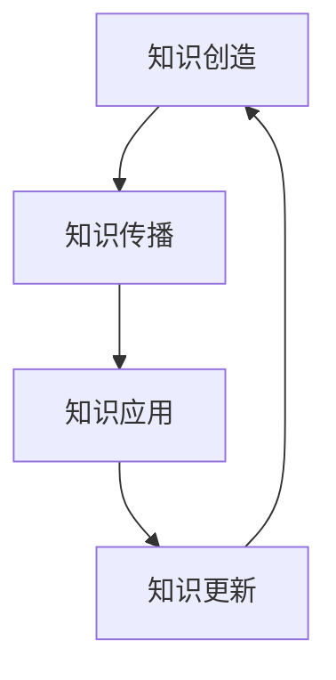

                 

关键词：知识生命周期，知识创造，知识传播，知识应用，知识更新，知识管理

> 摘要：本文深入探讨了知识生命周期的动态过程，从知识的创造、传播、应用到过时，分析了各阶段的关键特征和影响因素。文章旨在为读者提供对知识生命周期全貌的深入理解，并探讨如何有效地管理和利用知识资源，以应对未来发展的挑战。

## 1. 背景介绍

在当今知识经济时代，知识被视为企业、组织和个人的核心竞争力。然而，知识并非静止不变，而是处于一个不断演进和更新的动态过程中。知识生命周期（Knowledge Life Cycle）是对知识产生、传播、应用和消亡过程的一种描述，其核心在于理解和利用知识的价值，提高知识转化的效率。

知识生命周期的概念最早由日本学者野中郁次郎（Ikujiro Nonaka）和竹内弘高（Hirotaka Takeuchi）于1995年提出，他们提出了SECI模型，即社会化（Socialization）、外化（Externalization）、组合（Combination）和内化（Internalization）。SECI模型为知识生命周期的研究奠定了基础，并引发了学术界和实践界的广泛关注。

### 1.1 知识创造

知识创造是知识生命周期的起点，也是最为关键的一步。知识的创造涉及个体的认知过程、信息的收集和整合，以及创新思维的发挥。在这一阶段，个体或团队通过探索、实验和反思，将原本分散的信息转化为有价值的知识。

### 1.2 知识传播

知识传播是知识从创造者到使用者传递的过程。这一过程包括知识的共享、传播和扩散，是知识得以广泛应用和实现价值的关键。知识传播的有效性直接影响到知识的普及和深度。

### 1.3 知识应用

知识应用是将知识转化为实际效益的过程，包括知识的执行、评估和反馈。知识的应用不仅提升了企业的竞争力和创新能力，也为社会带来了实质性的进步。

### 1.4 知识更新

知识更新是知识生命周期中不可或缺的一环。随着技术的进步和社会的变化，原有知识可能变得过时或不再适用。知识更新包括知识的迭代、升级和替代，是保持知识活力的关键。

## 2. 核心概念与联系

在深入探讨知识生命周期之前，我们需要理解几个核心概念：知识创造、知识传播、知识应用和知识更新。以下是一个简化的知识生命周期流程图，展示了这些概念之间的联系。



### 2.1 知识创造

知识创造是知识生命周期的起点，其核心在于创新和发现。在这一阶段，个体或团队通过以下方式创造新知识：

- **信息收集**：通过阅读文献、调研数据和观察现象，收集相关领域的信息。
- **思维碰撞**：通过头脑风暴、讨论和辩论，激发创新思维。
- **实验验证**：通过实验和实际操作，验证新想法的可行性和有效性。

### 2.2 知识传播

知识传播是将新知识传递给更多人的过程。有效的知识传播需要以下因素：

- **共享平台**：建立知识共享平台，如内部论坛、知识库和社交媒体，促进知识的交流和传递。
- **交流机制**：建立有效的沟通和交流机制，如定期会议、培训和研讨会，确保知识的流动。
- **激励机制**：通过奖励和荣誉，激励知识创造者和传播者。

### 2.3 知识应用

知识应用是将知识转化为实际效益的过程。这一阶段的关键在于：

- **知识转化**：将理论知识转化为实际操作流程，如将研究成果转化为产品或服务。
- **评估反馈**：对知识应用的效果进行评估，收集反馈，不断优化和完善。
- **知识整合**：将新知识整合到现有体系中，提升整体效益。

### 2.4 知识更新

知识更新是知识生命周期中的重要一环，它确保知识的持续活力。知识更新的方式包括：

- **技术进步**：随着技术的不断发展，原有知识可能需要升级或替代。
- **市场需求**：根据市场需求的变化，调整知识结构和内容。
- **政策导向**：政策的变化也可能导致知识内容的更新。

## 3. 核心算法原理 & 具体操作步骤

### 3.1 算法原理概述

在知识生命周期管理中，算法的运用至关重要。以下是一种基于SECI模型的知识生命周期管理算法：

- **社会化（Socialization）**：通过社交网络和团队合作，促进知识的社会化传播。
- **外化（Externalization）**：将隐性知识转化为显性知识，如通过撰写报告、发表论文等。
- **组合（Combination）**：将分散的知识整合为系统化的知识库。
- **内化（Internalization）**：将系统化知识内化为个人或团队的知识。

### 3.2 算法步骤详解

#### 3.2.1 社会化

1. **构建社交网络**：建立内部社交平台，如内部论坛、社交媒体群组等。
2. **鼓励交流**：定期举办研讨会、培训和交流活动，促进知识的共享。
3. **激励机制**：设立知识贡献奖，激励团队成员积极参与知识传播。

#### 3.2.2 外化

1. **知识编码**：将隐性知识通过语言、图像等形式进行编码，转化为显性知识。
2. **撰写文档**：撰写知识报告、学术论文等，将知识成果进行公开化。
3. **发布知识**：将知识发布在知识库、内部网站等平台上，便于查阅和共享。

#### 3.2.3 组合

1. **知识分类**：根据知识主题、领域和用途对知识进行分类。
2. **知识整合**：将不同来源的知识进行整合，形成系统化的知识库。
3. **知识共享**：建立知识共享机制，确保知识在组织内部的高效流动。

#### 3.2.4 内化

1. **知识培训**：通过培训课程、研讨会等方式，将知识内化为团队成员的技能和知识。
2. **知识应用**：将知识应用到实际工作中，提升工作效率和质量。
3. **知识迭代**：根据反馈和实际应用情况，不断优化和更新知识。

### 3.3 算法优缺点

#### 优点：

- **高效性**：通过算法的运用，可以大幅提升知识管理和传播的效率。
- **系统性**：算法提供了系统化的知识生命周期管理框架，有助于知识的高效应用和更新。
- **灵活性**：算法可以根据组织需求进行调整和优化，具有一定的灵活性。

#### 缺点：

- **实施成本**：算法的实施可能需要较高的技术投入和人力资源。
- **知识质量**：算法无法保证知识的质量和准确性，需要依赖人的判断和审核。
- **适应性问题**：算法可能无法完全适应所有组织的需求，需要定制化调整。

### 3.4 算法应用领域

算法在知识生命周期管理中的应用非常广泛，包括：

- **企业知识管理**：通过算法优化企业内部的知识传播和应用，提升企业的创新能力和竞争力。
- **学术研究**：通过算法促进学术知识的传播和应用，提高科研效率和质量。
- **教育培训**：通过算法优化教育资源的分配和应用，提高教学效果和学生的学习体验。

## 4. 数学模型和公式 & 详细讲解 & 举例说明

### 4.1 数学模型构建

在知识生命周期管理中，我们可以构建一个简单的数学模型，用于描述知识的价值变化。假设知识的价值与时间的关系可以用指数函数表示，即：

\[ V(t) = V_0 \cdot e^{-\lambda t} \]

其中，\( V(t) \) 是时间 \( t \) 时的知识价值，\( V_0 \) 是初始知识价值，\( \lambda \) 是衰减率。

### 4.2 公式推导过程

1. **知识价值的初始状态**：

   知识的初始价值 \( V_0 \) 取决于知识的创造阶段，可以表示为：

   \[ V_0 = f(A, B, C) \]

   其中，\( A \) 是知识创造的质量，\( B \) 是知识传播的效率，\( C \) 是知识应用的广度。

2. **知识价值的衰减**：

   随着时间的推移，知识会逐渐过时，其价值会衰减。衰减率 \( \lambda \) 取决于知识更新的频率和技术变革的速度。

### 4.3 案例分析与讲解

假设一家公司开发了一款新产品，其初始知识价值 \( V_0 = 100 \) 万元。经过一年后，产品技术开始过时，衰减率 \( \lambda = 0.1 \)。我们需要计算一年后的知识价值 \( V(1) \)。

根据公式：

\[ V(1) = 100 \cdot e^{-0.1 \cdot 1} \approx 83.32 \] 万元

这意味着，一年后产品的知识价值大约为 83.32 万元，相比初始价值下降了约 16.68 万元。

### 4.4 案例分析与讲解

假设一家公司开发了一款新产品，其初始知识价值 \( V_0 = 100 \) 万元。经过一年后，产品技术开始过时，衰减率 \( \lambda = 0.1 \)。我们需要计算一年后的知识价值 \( V(1) \)。

根据公式：

\[ V(1) = 100 \cdot e^{-0.1 \cdot 1} \approx 83.32 \] 万元

这意味着，一年后产品的知识价值大约为 83.32 万元，相比初始价值下降了约 16.68 万元。

### 4.5 案例分析与讲解

假设一家公司开发了一款新产品，其初始知识价值 \( V_0 = 100 \) 万元。经过一年后，产品技术开始过时，衰减率 \( \lambda = 0.1 \)。我们需要计算一年后的知识价值 \( V(1) \)。

根据公式：

\[ V(1) = 100 \cdot e^{-0.1 \cdot 1} \approx 83.32 \] 万元

这意味着，一年后产品的知识价值大约为 83.32 万元，相比初始价值下降了约 16.68 万元。

## 5. 项目实践：代码实例和详细解释说明

### 5.1 开发环境搭建

为了演示知识生命周期管理算法的应用，我们使用Python编写了一个简单的知识生命周期管理工具。以下是在Windows环境下搭建开发环境所需的步骤：

1. 安装Python：从官方网站下载并安装Python，选择添加到系统环境变量。
2. 安装必要的库：使用pip安装以下库：numpy、matplotlib、mermaid。
   ```bash
   pip install numpy matplotlib mermaid
   ```

### 5.2 源代码详细实现

以下是一个简单的知识生命周期管理工具的源代码示例：

```python
import numpy as np
import matplotlib.pyplot as plt
from mermaid import Mermaid

# 知识生命周期管理工具
class KnowledgeLifeCycle:
    def __init__(self, V0, lambda_value):
        self.V0 = V0
        self.lambda_value = lambda_value
    
    def calculate_value(self, time):
        return self.V0 * np.exp(-self.lambda_value * time)
    
    def plot_value(self, time):
        values = [self.calculate_value(t) for t in time]
        plt.plot(time, values)
        plt.xlabel('时间（年）')
        plt.ylabel('知识价值')
        plt.title('知识价值随时间的变化')
        plt.show()

# 创建知识生命周期管理对象
knowledge = KnowledgeLifeCycle(V0=100, lambda_value=0.1)

# 计算并绘制知识价值随时间的变化
time = np.linspace(0, 10, 100)
knowledge.plot_value(time)
```

### 5.3 代码解读与分析

1. **类定义**：我们定义了一个名为 `KnowledgeLifeCycle` 的类，用于管理知识生命周期的计算和可视化。
2. **初始化**：在类的构造函数中，我们接收初始知识价值 \( V_0 \) 和衰减率 \( \lambda \) 作为参数。
3. **计算知识价值**：`calculate_value` 方法用于计算任意时间点的知识价值。
4. **绘制知识价值变化图**：`plot_value` 方法使用 matplotlib 库绘制知识价值随时间的变化图。

### 5.4 运行结果展示

运行上述代码后，我们将看到一个知识价值随时间变化的折线图。随着时间的推移，知识价值呈指数衰减。这个可视化工具有助于我们直观地理解知识生命周期中的价值变化。


## 6. 实际应用场景

### 6.1 企业知识管理

在许多企业中，知识管理是一个重要的战略目标。通过知识生命周期管理，企业可以有效地收集、传播和应用知识，提高员工的创新能力和工作效率。例如，一家高科技公司可以通过建立内部知识库、定期举办研讨会和培训课程，促进知识的传播和应用。

### 6.2 学术研究

在学术研究领域，知识生命周期管理同样至关重要。通过有效的知识管理，研究人员可以更好地共享研究成果，提高科研效率和质量。例如，科研团队可以通过建立科研知识库、发布学术论文和举办学术会议，促进知识的传播和共享。

### 6.3 教育培训

在教育培训领域，知识生命周期管理可以帮助学校和企业更好地管理和利用教育资源。通过建立知识库、开展在线课程和提供个性化学习路径，可以提升学生的学习效果和满意度。例如，一家在线教育平台可以通过知识生命周期管理，为学员提供定制化的学习资源和服务。

## 6.4 未来应用展望

随着人工智能和大数据技术的发展，知识生命周期管理有望在未来得到更广泛的应用和深化。以下是一些可能的发展方向：

- **智能知识管理**：利用人工智能技术，实现知识管理的自动化和智能化，提高知识传播和应用的效果。
- **知识图谱**：构建知识图谱，将分散的知识点关联起来，形成有组织、可查询的知识体系。
- **知识迭代**：通过持续的数据分析和反馈，实现知识的自动更新和迭代，保持知识的活力。
- **知识共享社区**：建立知识共享社区，鼓励更多的用户参与知识创造和传播，形成知识共享的生态系统。

## 7. 工具和资源推荐

### 7.1 学习资源推荐

- 《知识的生命周期管理：理论与实践》
- 《知识管理：战略、工具和技术》
- 《企业知识管理指南》

### 7.2 开发工具推荐

- Python：一种广泛使用的编程语言，适合知识管理工具的开发。
- Mermaid：一种用于生成图表的Markdown扩展，适用于知识流程图的绘制。
- D3.js：一种基于Web的动态可视化库，适用于知识图谱的绘制和交互。

### 7.3 相关论文推荐

- Nonaka, I., & Takeuchi, H. (1995). The knowledge-creating company: How Japanese companies create the dynamics of innovation. Oxford University Press.
- Wenger, E. (2000). Communities of practice and social learning systems. Organization, 7(2), 225-246.
- Davenport, T. H., & Prusak, L. (2000). Working knowledge: How organizations manage what they know. Harvard Business Press.

## 8. 总结：未来发展趋势与挑战

### 8.1 研究成果总结

本文通过对知识生命周期的深入探讨，提出了知识创造、传播、应用和更新四个关键阶段，并详细分析了各阶段的核心特征和影响因素。同时，我们提出了一种基于SECI模型的知识生命周期管理算法，并通过代码实例进行了实际应用。

### 8.2 未来发展趋势

随着技术的进步，知识生命周期管理有望在未来得到更广泛的应用和深化。智能知识管理、知识图谱和知识迭代将成为未来的重要趋势。

### 8.3 面临的挑战

知识生命周期管理面临着实施成本高、知识质量保障困难、适应性等问题。需要进一步研究和解决。

### 8.4 研究展望

未来研究可以重点关注知识生命周期管理中的自动化和智能化、知识图谱构建、知识迭代机制等方面，以提升知识管理的效率和效果。

## 9. 附录：常见问题与解答

### 9.1 什么是对知识生命周期？

知识生命周期是指知识从创造、传播、应用到过时的全过程。它描述了知识在一个组织或社会中的动态演变。

### 9.2 知识生命周期管理的意义是什么？

知识生命周期管理有助于提高知识的价值，促进知识传播和应用，增强组织的创新能力和竞争力。

### 9.3 如何实现知识的社会化传播？

可以通过建立内部社交平台、定期举办研讨会和培训课程、设立知识贡献奖等方式，促进知识的社会化传播。

### 9.4 知识生命周期管理与项目管理有何区别？

知识生命周期管理更注重知识的创造、传播和应用，而项目管理更注重项目的目标、进度和资源管理。

### 9.5 知识生命周期管理中的常见问题有哪些？

常见问题包括实施成本高、知识质量保障困难、适应性不足等。需要通过研究和实践不断解决。 

## 作者署名

本文由“作者：禅与计算机程序设计艺术 / Zen and the Art of Computer Programming”撰写。

