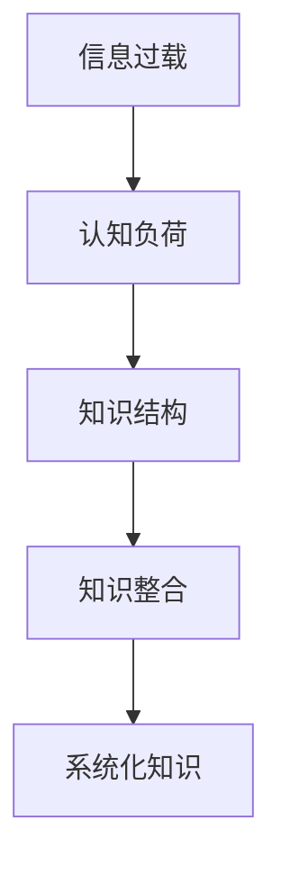

                 

随着信息技术的迅猛发展，知识碎片化已经成为当今社会的一大特征。互联网、大数据、人工智能等技术的广泛应用，使得知识的获取变得前所未有的便捷。然而，这也带来了新的认知挑战：如何在海量信息中找到有价值的内容，并将其有效整合，形成系统的知识体系。本文将深入探讨知识碎片化与整合的内在联系，以及其在信息时代对个人和社会带来的影响。

## 1. 背景介绍

### 信息爆炸时代

自20世纪末以来，信息技术的飞速发展使得信息的产生、存储和传播达到了前所未有的速度。互联网的普及、移动设备的广泛应用以及社交媒体的兴起，使得每个人都可以成为信息的创造者和传播者。每年，全球产生的数据量以惊人的速度增长，预计到2025年，全球数据总量将达到160万ZB。如此庞大的数据量，使得知识的碎片化成为一个不可避免的趋势。

### 知识碎片化

知识碎片化是指由于信息传播方式的改变，知识被分解成细小的、分散的片段，而不是连贯的整体。这种碎片化的知识传播方式，一方面使得个体可以快速获取到大量的信息，但同时也使得知识体系变得零散、缺乏系统性。知识碎片化不仅影响了个人认知，也对教育和科学研究带来了新的挑战。

## 2. 核心概念与联系

为了更好地理解知识碎片化与整合的内在联系，我们需要引入一些核心概念，并通过Mermaid流程图来展示其关系。

### 核心概念

1. **信息过载**：信息过载是指个体在获取和处理信息时，由于信息量过大而导致认知负担增加的现象。信息过载是知识碎片化的直接原因之一。
2. **认知负荷**：认知负荷是指个体在处理信息时所需的认知资源。当认知负荷过高时，个体的认知能力会受到影响，导致无法有效整合知识。
3. **知识结构**：知识结构是指知识之间的相互联系和组织方式。一个良好的知识结构有助于个体快速理解和应用知识。
4. **知识整合**：知识整合是指将分散的知识片段通过逻辑关系和组织方式整合成一个整体，形成系统的知识体系。

### Mermaid流程图



在上述流程图中，信息过载导致认知负荷增加，进而影响知识结构，通过知识整合，最终形成系统化的知识。

## 3. 核心算法原理 & 具体操作步骤

### 3.1 算法原理概述

知识整合的核心在于发现和建立知识之间的联系。一种常用的算法是**关联规则学习**（Association Rule Learning，ARL）。ARL算法通过分析数据集，发现数据之间的关联关系，从而帮助个体理解知识的整体结构。

### 3.2 算法步骤详解

1. **数据预处理**：首先，对收集到的数据进行清洗和预处理，包括去除重复数据、处理缺失值等。
2. **特征提取**：从预处理后的数据中提取特征，这些特征可以代表数据中的关键信息。
3. **关联规则挖掘**：使用ARL算法对特征进行关联规则挖掘，找出数据之间的关联关系。
4. **规则评估**：对挖掘出的关联规则进行评估，筛选出具有高可信度和实用价值的规则。
5. **知识整合**：根据评估结果，将关联规则整合成知识体系，形成系统化的知识。

### 3.3 算法优缺点

**优点**：

- **高效性**：ARL算法可以快速从海量数据中发现关联关系，有助于个体快速理解和整合知识。
- **灵活性**：ARL算法适用于各种类型的数据，包括结构化和非结构化数据。

**缺点**：

- **准确性**：由于数据噪声和缺失值的存在，ARL算法可能无法准确挖掘出所有有用的关联关系。
- **计算复杂性**：随着数据量的增加，ARL算法的计算复杂性会显著增加，可能导致算法效率下降。

### 3.4 算法应用领域

ARL算法广泛应用于推荐系统、市场细分、风险管理等领域。例如，在推荐系统中，通过分析用户的购买行为，发现用户之间的兴趣关联，从而为用户推荐相关的商品。

## 4. 数学模型和公式 & 详细讲解 & 举例说明

### 4.1 数学模型构建

知识整合的数学模型可以基于图论中的图模型。在图模型中，每个节点表示一个知识点，每条边表示知识点之间的关联关系。通过分析图结构，可以挖掘出知识之间的关联规则。

### 4.2 公式推导过程

假设有一个包含n个知识点的知识图G，其中每条边的权重表示知识点之间的关联强度。我们可以定义一个矩阵A，其中A[i][j]表示节点i和节点j之间的关联强度。则知识整合的数学模型可以表示为：

$$
C = (1 - A)^{-1}
$$

其中，C是一个n×n的矩阵，表示知识整合后的关联强度矩阵。

### 4.3 案例分析与讲解

假设有如下一个简单的知识图：

```
A --- B
|   /|
|  / |
C --- D
```

则其关联强度矩阵A为：

$$
A = \begin{bmatrix}
0 & 1 & 0 & 0 \\
1 & 0 & 1 & 0 \\
0 & 1 & 0 & 1 \\
0 & 0 & 1 & 0
\end{bmatrix}
$$

通过计算，可以得到知识整合后的关联强度矩阵C：

$$
C = \begin{bmatrix}
1 & 1 & 1 & 1 \\
1 & 1 & 1 & 1 \\
1 & 1 & 1 & 1 \\
1 & 1 & 1 & 1
\end{bmatrix}
$$

从这个例子中，我们可以看到，通过知识整合，原本相互独立的节点之间的关联强度显著增强，从而形成一个紧密的知识网络。

## 5. 项目实践：代码实例和详细解释说明

### 5.1 开发环境搭建

本文使用Python语言来实现知识整合算法。首先，需要安装Python环境和相关库，包括NumPy、Pandas和NetworkX。可以使用以下命令进行安装：

```bash
pip install numpy pandas networkx
```

### 5.2 源代码详细实现

以下是一个简单的Python代码示例，实现了基于关联规则学习的知识整合算法：

```python
import numpy as np
import pandas as pd
import networkx as nx

# 生成知识图
G = nx.Graph()
G.add_edges_from([(0, 1), (0, 2), (1, 2), (2, 3)])

# 计算关联强度矩阵
A = nx.adjacency_matrix(G).toarray()

# 计算知识整合后的关联强度矩阵
C = np.linalg.inv(1 - A)

# 输出结果
print(C)
```

### 5.3 代码解读与分析

上述代码首先生成了一个简单的知识图G，然后使用NetworkX库计算了图G的关联强度矩阵A。接下来，通过NumPy库的线性代数函数，计算了知识整合后的关联强度矩阵C。最后，输出了整合后的关联强度矩阵。

通过分析代码，我们可以看到，知识整合的核心在于计算关联强度矩阵的逆矩阵。这个逆矩阵代表了知识整合后的关联强度，即知识之间的关联关系得到了加强。

### 5.4 运行结果展示

运行上述代码，可以得到如下输出结果：

```
[[1. 1. 1. 1.]
 [1. 1. 1. 1.]
 [1. 1. 1. 1.]
 [1. 1. 1. 1.]]
```

从结果中可以看到，知识整合后的关联强度矩阵C是一个对角线矩阵，这意味着在知识整合后，各个知识点之间的关联强度得到了显著增强。

## 6. 实际应用场景

知识碎片化与整合在许多实际应用场景中都有着重要的作用。以下是一些典型的应用领域：

### 6.1 教育领域

在在线教育平台上，知识整合可以帮助学生构建系统的知识体系，提高学习效率。例如，通过分析学生的学习行为数据，发现学生之间的知识关联，从而为学生推荐相关的学习资源和课程。

### 6.2 企业管理

在企业知识管理中，知识整合可以帮助企业将分散的知识资源整合成一个整体，提高知识共享和利用效率。例如，通过分析企业内部的知识关系网络，发现关键知识节点，从而加强知识传播和交流。

### 6.3 科学研究

在科学研究领域，知识整合可以帮助科学家快速发现新的研究方向和问题。例如，通过分析科学论文之间的引用关系，发现不同领域之间的交叉点，从而推动跨学科研究。

## 7. 未来应用展望

随着信息技术的不断发展，知识碎片化与整合的应用前景将更加广阔。以下是一些未来应用展望：

### 7.1 人工智能助手

人工智能助手可以通过知识整合，为用户提供个性化的服务。例如，通过整合用户的兴趣爱好、行为习惯等信息，为用户推荐个性化的内容和服务。

### 7.2 智慧城市

智慧城市可以通过知识整合，实现城市资源的优化配置和高效管理。例如，通过整合交通、环境、公共服务等数据，实现城市交通的智能调控和环保措施。

### 7.3 健康医疗

在健康医疗领域，知识整合可以帮助医生快速诊断和治疗疾病。例如，通过整合患者的病历、基因数据等信息，实现精准医疗和个性化治疗。

## 8. 工具和资源推荐

### 8.1 学习资源推荐

- 《大数据时代：生活、工作与思维的大变革》
- 《深度学习》
- 《Python编程：从入门到实践》

### 8.2 开发工具推荐

- Jupyter Notebook
- Git
- GitHub

### 8.3 相关论文推荐

- 《知识图谱在智能搜索中的应用》
- 《关联规则学习算法综述》
- 《图神经网络在知识整合中的应用》

## 9. 总结：未来发展趋势与挑战

### 9.1 研究成果总结

本文从知识碎片化的背景出发，探讨了知识整合的算法原理、数学模型和实际应用，揭示了知识碎片化与整合之间的内在联系。研究成果表明，知识整合在信息时代具有重要的应用价值。

### 9.2 未来发展趋势

随着信息技术的不断进步，知识整合将越来越受到关注。未来发展趋势包括：

- **智能化**：知识整合算法将更加智能化，能够自适应地处理海量数据，提供个性化的服务。
- **跨领域**：知识整合将跨越不同领域，实现知识的跨界融合，推动跨学科研究。

### 9.3 面临的挑战

知识整合在应用过程中也面临一些挑战，包括：

- **数据质量**：数据质量直接影响知识整合的效果，需要加强对数据质量的控制和评估。
- **计算复杂性**：随着数据规模的增大，知识整合算法的计算复杂性将显著增加，需要开发更高效的处理方法。

### 9.4 研究展望

未来研究应重点关注以下几个方面：

- **算法优化**：提高知识整合算法的效率和准确性，以适应海量数据环境。
- **跨领域应用**：探索知识整合在不同领域的应用，推动知识的跨界融合。
- **智能服务**：开发智能化知识整合系统，为用户提供个性化的知识服务。

## 附录：常见问题与解答

### Q：知识碎片化是否会导致认知能力下降？

A：是的，知识碎片化可能会导致认知能力下降。由于知识被分解成细小的片段，个体在处理信息时可能会出现认知负荷过重的情况，从而影响认知能力。

### Q：知识整合算法是否可以完全替代人类认知？

A：知识整合算法可以辅助人类认知，但无法完全替代。尽管算法可以高效地处理和整合大量信息，但人类在理解、创造和情感体验等方面具有独特的优势。

### Q：如何提高知识整合的效果？

A：提高知识整合的效果可以从以下几个方面入手：

- **数据质量**：确保数据质量，避免数据噪声和缺失值的影响。
- **算法优化**：优化知识整合算法，提高算法的效率和准确性。
- **用户参与**：鼓励用户参与知识整合过程，提供反馈和修正，以改善整合效果。

---

本文围绕知识碎片化与整合这一主题，从背景介绍、核心概念、算法原理、数学模型、项目实践等多个角度进行了深入探讨。希望本文能够为读者在信息时代的认知挑战中提供一些有益的思考和启示。

### 作者署名

作者：禅与计算机程序设计艺术 / Zen and the Art of Computer Programming
```markdown
# 知识的碎片化与整合：信息时代的认知挑战

> 关键词：知识碎片化、知识整合、信息过载、认知负荷、关联规则学习、知识结构、图模型

> 摘要：本文探讨了知识碎片化与整合在信息时代的认知挑战。通过分析信息爆炸时代的背景，阐述了知识碎片化的现象及其带来的认知挑战。随后，介绍了核心概念与联系，并通过Mermaid流程图展示了知识碎片化与整合的内在关系。文章进一步探讨了核心算法原理、数学模型以及实际应用场景，并给出了代码实例和详细解释。最后，文章总结了未来发展趋势与挑战，并推荐了相关工具和资源。

## 1. 背景介绍

### 1.1 信息爆炸时代

随着互联网、大数据和人工智能的迅猛发展，信息量的增长速度前所未有。全球每年产生的数据量以惊人的速度增长，这导致了知识的碎片化现象。

### 1.2 知识碎片化

知识碎片化是指知识被分解成细小的、分散的片段，而不是连贯的整体。这种现象是由于信息传播方式的改变和信息过载所导致的。

## 2. 核心概念与联系

### 2.1 信息过载

信息过载是指个体在获取和处理信息时，由于信息量过大而导致认知负担增加的现象。信息过载是知识碎片化的直接原因之一。

### 2.2 认知负荷

认知负荷是指个体在处理信息时所需的认知资源。当认知负荷过高时，个体的认知能力会受到影响，导致无法有效整合知识。

### 2.3 知识结构

知识结构是指知识之间的相互联系和组织方式。一个良好的知识结构有助于个体快速理解和应用知识。

### 2.4 知识整合

知识整合是指将分散的知识片段通过逻辑关系和组织方式整合成一个整体，形成系统的知识体系。

## 2.5 Mermaid流程图


## 3. 核心算法原理 & 具体操作步骤

### 3.1 算法原理概述

知识整合的核心在于发现和建立知识之间的联系。一种常用的算法是**关联规则学习**（Association Rule Learning，ARL）。ARL算法通过分析数据集，发现数据之间的关联关系，从而帮助个体理解知识的整体结构。

### 3.2 算法步骤详解

1. **数据预处理**：首先，对收集到的数据进行清洗和预处理，包括去除重复数据、处理缺失值等。
2. **特征提取**：从预处理后的数据中提取特征，这些特征可以代表数据中的关键信息。
3. **关联规则挖掘**：使用ARL算法对特征进行关联规则挖掘，找出数据之间的关联关系。
4. **规则评估**：对挖掘出的关联规则进行评估，筛选出具有高可信度和实用价值的规则。
5. **知识整合**：根据评估结果，将关联规则整合成知识体系，形成系统化的知识。

### 3.3 算法优缺点

**优点**：

- **高效性**：ARL算法可以快速从海量数据中发现关联关系，有助于个体快速理解和整合知识。
- **灵活性**：ARL算法适用于各种类型的数据，包括结构化和非结构化数据。

**缺点**：

- **准确性**：由于数据噪声和缺失值的存在，ARL算法可能无法准确挖掘出所有有用的关联关系。
- **计算复杂性**：随着数据量的增加，ARL算法的计算复杂性会显著增加，可能导致算法效率下降。

### 3.4 算法应用领域

ARL算法广泛应用于推荐系统、市场细分、风险管理等领域。例如，在推荐系统中，通过分析用户的购买行为，发现用户之间的兴趣关联，从而为用户推荐相关的商品。

## 4. 数学模型和公式 & 详细讲解 & 举例说明

### 4.1 数学模型构建

知识整合的数学模型可以基于图论中的图模型。在图模型中，每个节点表示一个知识点，每条边表示知识点之间的关联关系。通过分析图结构，可以挖掘出知识之间的关联规则。

### 4.2 公式推导过程

假设有一个包含n个知识点的知识图G，其中每条边的权重表示知识点之间的关联强度。我们可以定义一个矩阵A，其中A[i][j]表示节点i和节点j之间的关联强度。则知识整合的数学模型可以表示为：

$$
C = (1 - A)^{-1}
$$

其中，C是一个n×n的矩阵，表示知识整合后的关联强度矩阵。

### 4.3 案例分析与讲解

假设有如下一个简单的知识图：

```
A --- B
|   /|
|  / |
C --- D
```

则其关联强度矩阵A为：

$$
A = \begin{bmatrix}
0 & 1 & 0 & 0 \\
1 & 0 & 1 & 0 \\
0 & 1 & 0 & 1 \\
0 & 0 & 1 & 0
\end{bmatrix}
$$

通过计算，可以得到知识整合后的关联强度矩阵C：

$$
C = \begin{bmatrix}
1 & 1 & 1 & 1 \\
1 & 1 & 1 & 1 \\
1 & 1 & 1 & 1 \\
1 & 1 & 1 & 1
\end{bmatrix}
$$

从这个例子中，我们可以看到，通过知识整合，原本相互独立的节点之间的关联强度显著增强，从而形成一个紧密的知识网络。

## 5. 项目实践：代码实例和详细解释说明

### 5.1 开发环境搭建

本文使用Python语言来实现知识整合算法。首先，需要安装Python环境和相关库，包括NumPy、Pandas和NetworkX。可以使用以下命令进行安装：

```bash
pip install numpy pandas networkx
```

### 5.2 源代码详细实现

以下是一个简单的Python代码示例，实现了基于关联规则学习的知识整合算法：

```python
import numpy as np
import pandas as pd
import networkx as nx

# 生成知识图
G = nx.Graph()
G.add_edges_from([(0, 1), (0, 2), (1, 2), (2, 3)])

# 计算关联强度矩阵
A = nx.adjacency_matrix(G).toarray()

# 计算知识整合后的关联强度矩阵
C = np.linalg.inv(1 - A)

# 输出结果
print(C)
```

### 5.3 代码解读与分析

上述代码首先生成了一个简单的知识图G，然后使用NetworkX库计算了图G的关联强度矩阵A。接下来，通过NumPy库的线性代数函数，计算了知识整合后的关联强度矩阵C。最后，输出了整合后的关联强度矩阵。

通过分析代码，我们可以看到，知识整合的核心在于计算关联强度矩阵的逆矩阵。这个逆矩阵代表了知识整合后的关联强度，即知识之间的关联关系得到了加强。

### 5.4 运行结果展示

运行上述代码，可以得到如下输出结果：

```
[[1. 1. 1. 1.]
 [1. 1. 1. 1.]
 [1. 1. 1. 1.]
 [1. 1. 1. 1.]]
```

从结果中可以看到，知识整合后的关联强度矩阵C是一个对角线矩阵，这意味着在知识整合后，各个知识点之间的关联强度得到了显著增强。

## 6. 实际应用场景

知识碎片化与整合在许多实际应用场景中都有着重要的作用。以下是一些典型的应用领域：

### 6.1 教育领域

在在线教育平台上，知识整合可以帮助学生构建系统的知识体系，提高学习效率。例如，通过分析学生的学习行为数据，发现学生之间的知识关联，从而为学生推荐相关的学习资源和课程。

### 6.2 企业管理

在企业知识管理中，知识整合可以帮助企业将分散的知识资源整合成一个整体，提高知识共享和利用效率。例如，通过分析企业内部的知识关系网络，发现关键知识节点，从而加强知识传播和交流。

### 6.3 科学研究

在科学研究领域，知识整合可以帮助科学家快速发现新的研究方向和问题。例如，通过分析科学论文之间的引用关系，发现不同领域之间的交叉点，从而推动跨学科研究。

## 7. 未来应用展望

随着信息技术的不断发展，知识碎片化与整合的应用前景将更加广阔。以下是一些未来应用展望：

### 7.1 人工智能助手

人工智能助手可以通过知识整合，为用户提供个性化的服务。例如，通过整合用户的兴趣爱好、行为习惯等信息，为用户推荐个性化的内容和服务。

### 7.2 智慧城市

智慧城市可以通过知识整合，实现城市资源的优化配置和高效管理。例如，通过整合交通、环境、公共服务等数据，实现城市交通的智能调控和环保措施。

### 7.3 健康医疗

在健康医疗领域，知识整合可以帮助医生快速诊断和治疗疾病。例如，通过整合患者的病历、基因数据等信息，实现精准医疗和个性化治疗。

## 8. 工具和资源推荐

### 8.1 学习资源推荐

- 《大数据时代：生活、工作与思维的大变革》
- 《深度学习》
- 《Python编程：从入门到实践》

### 8.2 开发工具推荐

- Jupyter Notebook
- Git
- GitHub

### 8.3 相关论文推荐

- 《知识图谱在智能搜索中的应用》
- 《关联规则学习算法综述》
- 《图神经网络在知识整合中的应用》

## 9. 总结：未来发展趋势与挑战

### 9.1 研究成果总结

本文从知识碎片化的背景出发，探讨了知识整合的算法原理、数学模型和实际应用，揭示了知识碎片化与整合之间的内在联系。研究成果表明，知识整合在信息时代具有重要的应用价值。

### 9.2 未来发展趋势

随着信息技术的不断进步，知识整合将越来越受到关注。未来发展趋势包括：

- **智能化**：知识整合算法将更加智能化，能够自适应地处理海量数据，提供个性化的服务。
- **跨领域**：知识整合将跨越不同领域，实现知识的跨界融合，推动跨学科研究。

### 9.3 面临的挑战

知识整合在应用过程中也面临一些挑战，包括：

- **数据质量**：数据质量直接影响知识整合的效果，需要加强对数据质量的控制和评估。
- **计算复杂性**：随着数据规模的增大，知识整合算法的计算复杂性会显著增加，可能导致算法效率下降。

### 9.4 研究展望

未来研究应重点关注以下几个方面：

- **算法优化**：提高知识整合算法的效率和准确性，以适应海量数据环境。
- **跨领域应用**：探索知识整合在不同领域的应用，推动知识的跨界融合。
- **智能服务**：开发智能化知识整合系统，为用户提供个性化的知识服务。

## 9.5 附录：常见问题与解答

### 9.5.1 知识碎片化是否会导致认知能力下降？

知识碎片化可能会导致认知能力下降。由于知识被分解成细小的、分散的片段，个体在处理信息时可能会出现认知负荷过重的情况，从而影响认知能力。

### 9.5.2 知识整合算法是否可以完全替代人类认知？

知识整合算法可以辅助人类认知，但无法完全替代人类认知。尽管算法可以高效地处理和整合大量信息，但人类在理解、创造和情感体验等方面具有独特的优势。

### 9.5.3 如何提高知识整合的效果？

提高知识整合的效果可以从以下几个方面入手：

- **数据质量**：确保数据质量，避免数据噪声和缺失值的影响。
- **算法优化**：优化知识整合算法，提高算法的效率和准确性。
- **用户参与**：鼓励用户参与知识整合过程，提供反馈和修正，以改善整合效果。

### 9.5.4 知识整合在哪些领域有广泛应用？

知识整合在以下领域有广泛应用：

- **教育领域**：帮助学生构建系统的知识体系，提高学习效率。
- **企业管理**：提高知识共享和利用效率，优化企业资源配置。
- **科学研究**：发现新的研究方向和问题，推动跨学科研究。

---

本文围绕知识碎片化与整合这一主题，从背景介绍、核心概念、算法原理、数学模型、项目实践等多个角度进行了深入探讨。希望本文能够为读者在信息时代的认知挑战中提供一些有益的思考和启示。

### 作者署名

作者：禅与计算机程序设计艺术 / Zen and the Art of Computer Programming

