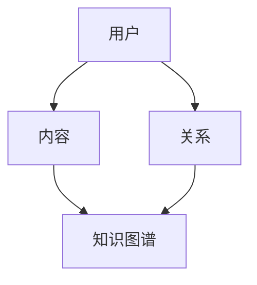

                 

 **关键词**：知识社交网络，思想传播，新生态，人工智能，知识图谱，算法，数学模型，项目实践，应用场景

**摘要**：本文将探讨知识社交网络的概念、核心概念与联系，以及其在思想传播方面的重要作用。我们将深入分析知识社交网络的核心算法原理、具体操作步骤、数学模型和公式，并通过实际项目实例进行代码解读与分析。最后，我们将探讨知识社交网络的实际应用场景、未来应用展望，并提供相关的学习资源、开发工具和论文推荐。文章将总结研究成果，展望未来发展趋势与挑战。

## 1. 背景介绍

在数字化时代，信息传播的速度和范围都达到了前所未有的高度。然而，伴随着信息的爆炸式增长，人们面临着信息过载的挑战，如何在海量信息中获取有价值的内容成为了一个难题。知识社交网络的兴起，为解决这一难题提供了一种新的思路和解决方案。

知识社交网络是一种基于人工智能技术的网络平台，通过构建知识图谱，将用户、内容、关系等元素进行有机整合，为用户提供更加智能化的知识获取和传播服务。知识社交网络的核心目标是促进知识的共享、传播和创新，从而构建一个新生态的思想传播环境。

本文将首先介绍知识社交网络的概念和核心概念，然后深入探讨其核心算法原理、数学模型和项目实践，最后讨论其应用场景和未来展望。通过本文的阅读，读者将能够对知识社交网络有一个全面而深入的了解。

### 1.1 知识社交网络的定义与特征

知识社交网络是一种基于社交网络和知识图谱的新型网络平台，它融合了社交网络的互动性和知识图谱的结构性，旨在构建一个智能化的知识共享和传播生态系统。知识社交网络的主要特征包括：

- **个性化推荐**：通过用户行为数据和学习算法，为用户推荐感兴趣的知识内容，提升用户体验。
- **知识图谱**：利用语义网络技术，构建一个结构化的知识体系，实现知识内容的精准匹配和关联。
- **协作学习**：鼓励用户在平台上进行知识分享和协作，促进知识的创新和传播。
- **智能问答**：利用自然语言处理技术，为用户提供智能化的问答服务，提升知识获取的效率。

### 1.2 知识社交网络的发展背景

知识社交网络的发展源于几个关键因素的推动：

- **大数据与人工智能**：随着大数据和人工智能技术的快速发展，人们对于信息处理的效率和准确性提出了更高的要求，知识社交网络应运而生。
- **信息过载**：在互联网时代，信息爆炸式增长，人们面临信息过载的挑战，如何从海量信息中获取有价值的内容成为了一个亟待解决的问题。
- **知识共享与传播**：知识作为一种重要的资源，其共享和传播对于社会进步和个人发展具有重要意义，知识社交网络为这一目标的实现提供了新的平台和工具。

## 2. 核心概念与联系

在知识社交网络中，核心概念与联系是构建整个网络体系的基础。本节将介绍知识社交网络中的核心概念，并使用Mermaid流程图展示其联系。

### 2.1 核心概念

- **用户**：知识社交网络中的参与者，可以是个人或组织。
- **内容**：用户在平台上发布的知识资源，包括文本、图片、视频等。
- **关系**：用户之间的交互和关联，如关注、点赞、评论等。
- **知识图谱**：通过语义网络技术构建的表示知识内容及其关联的结构化模型。

### 2.2 Mermaid流程图展示



### 2.3 核心概念联系与解释

- **用户与内容**：用户在知识社交网络中发布和分享内容，形成内容的源头。
- **用户与关系**：用户之间的互动和关联，如关注、点赞、评论，构成了网络中的社交关系。
- **内容与知识图谱**：通过语义网络技术，将内容进行结构化表示，构建知识图谱，实现知识内容的关联和匹配。

## 3. 核心算法原理 & 具体操作步骤

### 3.1 算法原理概述

知识社交网络的核心算法主要包括推荐算法、语义网络算法和协作过滤算法。以下将对这些算法的原理进行概述。

- **推荐算法**：基于用户行为数据，为用户推荐感兴趣的知识内容。常用的推荐算法包括基于内容的推荐和基于用户的协同过滤推荐。
- **语义网络算法**：通过构建知识图谱，表示知识内容及其关联关系，实现知识内容的精准匹配和推荐。
- **协作过滤算法**：基于用户之间的相似度，为用户推荐其他用户感兴趣的知识内容。

### 3.2 算法步骤详解

#### 3.2.1 推荐算法

1. 收集用户行为数据：包括用户浏览、点赞、评论等行为。
2. 构建用户兴趣模型：根据用户行为数据，提取用户的兴趣特征。
3. 构建内容特征模型：对知识内容进行特征提取和表示。
4. 计算用户与内容的相似度：使用余弦相似度或皮尔逊相关系数等度量方法，计算用户与内容的相似度。
5. 推荐知识内容：根据用户与内容的相似度，为用户推荐相似的知识内容。

#### 3.2.2 语义网络算法

1. 数据预处理：对知识内容进行预处理，包括文本清洗、分词、词性标注等。
2. 构建知识图谱：利用实体识别、关系抽取等技术，将知识内容构建为知识图谱。
3. 知识图谱查询：根据用户查询，从知识图谱中检索相关的知识内容。
4. 知识内容推荐：根据用户查询结果，从知识图谱中推荐相关的知识内容。

#### 3.2.3 协作过滤算法

1. 收集用户行为数据：包括用户浏览、点赞、评论等行为。
2. 计算用户相似度：基于用户行为数据，计算用户之间的相似度。
3. 计算内容相似度：基于用户行为数据，计算用户对内容的相似度。
4. 推荐知识内容：根据用户相似度和内容相似度，为用户推荐其他用户感兴趣的知识内容。

### 3.3 算法优缺点

#### 3.3.1 推荐算法

**优点**：

- 能够为用户推荐个性化内容，提升用户体验。
- 能够从海量信息中筛选出有价值的内容。

**缺点**：

- 过于依赖用户行为数据，可能导致推荐结果单一。
- 需要大量的计算资源和存储空间。

#### 3.3.2 语义网络算法

**优点**：

- 能够实现知识内容的精准匹配和推荐。
- 能够构建一个结构化的知识体系。

**缺点**：

- 需要大量的预处理工作，构建知识图谱的效率较低。
- 对于复杂的关系和概念难以表达。

#### 3.3.3 协作过滤算法

**优点**：

- 能够发现用户之间的相似性，推荐用户感兴趣的内容。
- 能够缓解信息过载的问题。

**缺点**：

- 推荐结果可能过于保守，难以发现新内容。
- 需要大量的用户行为数据，对于冷启动问题难以解决。

### 3.4 算法应用领域

知识社交网络的核心算法在多个领域有着广泛的应用：

- **在线教育**：为用户提供个性化的学习资源推荐，提升学习效果。
- **知识管理**：帮助企业和组织构建内部知识库，促进知识的共享和传播。
- **搜索引擎**：通过知识图谱实现更加精准的搜索结果推荐。
- **社交媒体**：为用户提供个性化的内容推荐，提升用户黏性。

## 4. 数学模型和公式 & 详细讲解 & 举例说明

### 4.1 数学模型构建

在知识社交网络中，数学模型用于描述用户行为、内容特征、相似度计算等。以下是几个常见的数学模型：

#### 4.1.1 用户兴趣模型

用户兴趣模型用于表示用户对知识内容的偏好。一个简单的用户兴趣模型可以表示为：

\[ U = \{ u_1, u_2, \ldots, u_n \} \]

其中，\( u_i \) 表示用户对第 \( i \) 个知识内容的兴趣度，可以采用向量表示：

\[ u_i = (u_{i1}, u_{i2}, \ldots, u_{im}) \]

其中，\( u_{ij} \) 表示用户对第 \( i \) 个知识内容的第 \( j \) 个特征的关注度。

#### 4.1.2 内容特征模型

内容特征模型用于表示知识内容的特征。一个简单的内容特征模型可以表示为：

\[ C = \{ c_1, c_2, \ldots, c_n \} \]

其中，\( c_i \) 表示第 \( i \) 个知识内容的特征向量：

\[ c_i = (c_{i1}, c_{i2}, \ldots, c_{im}) \]

其中，\( c_{ij} \) 表示第 \( i \) 个知识内容的第 \( j \) 个特征的取值。

#### 4.1.3 相似度模型

相似度模型用于计算用户与内容、用户与用户之间的相似度。一个简单的相似度模型可以表示为：

\[ S = \{ s_{ij} \} \]

其中，\( s_{ij} \) 表示用户 \( u_i \) 与内容 \( c_j \) 或用户 \( u_i \) 与用户 \( u_j \) 之间的相似度。

### 4.2 公式推导过程

#### 4.2.1 用户兴趣度计算

用户兴趣度可以采用加权平均法进行计算：

\[ u_i = \frac{\sum_{j=1}^{m} w_{ij} c_{ij}}{\sum_{j=1}^{m} w_{ij}} \]

其中，\( w_{ij} \) 表示用户对第 \( i \) 个知识内容的第 \( j \) 个特征的权重。

#### 4.2.2 内容相似度计算

内容相似度可以采用余弦相似度进行计算：

\[ s_{ij} = \frac{\sum_{k=1}^{m} u_{ik} c_{kj}}{\sqrt{\sum_{k=1}^{m} u_{ik}^2} \sqrt{\sum_{k=1}^{m} c_{kj}^2}} \]

#### 4.2.3 用户相似度计算

用户相似度可以采用皮尔逊相关系数进行计算：

\[ s_{ij} = \frac{\sum_{k=1}^{m} u_{ik} v_{jk} - \frac{\sum_{k=1}^{m} u_{ik} \sum_{k=1}^{m} v_{jk}}{m} }{\sqrt{\sum_{k=1}^{m} u_{ik}^2 - \frac{(\sum_{k=1}^{m} u_{ik})^2}{m}} \sqrt{\sum_{k=1}^{m} v_{jk}^2 - \frac{(\sum_{k=1}^{m} v_{jk})^2}{m}}} \]

其中，\( v_{ij} \) 表示用户 \( u_i \) 与用户 \( u_j \) 的兴趣度向量。

### 4.3 案例分析与讲解

#### 4.3.1 用户兴趣度计算案例

假设用户 \( u \) 对两个知识内容 \( c_1 \) 和 \( c_2 \) 有兴趣，其兴趣度向量分别为：

\[ u = (0.6, 0.4) \]
\[ c_1 = (0.8, 0.2) \]
\[ c_2 = (0.3, 0.7) \]

用户兴趣度的计算公式为：

\[ u = \frac{\sum_{j=1}^{2} w_{ij} c_{ij}}{\sum_{j=1}^{2} w_{ij}} \]

假设权重 \( w_{ij} \) 为 1，则用户兴趣度为：

\[ u = \frac{0.6 \cdot 0.8 + 0.4 \cdot 0.3}{0.6 + 0.4} = \frac{0.48 + 0.12}{1} = 0.6 \]

#### 4.3.2 内容相似度计算案例

假设用户 \( u \) 对两个知识内容 \( c_1 \) 和 \( c_2 \) 有兴趣，其兴趣度向量分别为：

\[ u = (0.6, 0.4) \]
\[ c_1 = (0.8, 0.2) \]
\[ c_2 = (0.3, 0.7) \]

内容相似度的计算公式为：

\[ s_{ij} = \frac{\sum_{k=1}^{2} u_{ik} c_{kj}}{\sqrt{\sum_{k=1}^{2} u_{ik}^2} \sqrt{\sum_{k=1}^{2} c_{kj}^2}} \]

代入数据进行计算：

\[ s_{12} = \frac{0.6 \cdot 0.8 + 0.4 \cdot 0.3}{\sqrt{0.6^2 + 0.4^2} \sqrt{0.8^2 + 0.2^2}} = \frac{0.48 + 0.12}{0.8 \cdot 0.9} = \frac{0.6}{0.72} \approx 0.8333 \]

#### 4.3.3 用户相似度计算案例

假设用户 \( u_1 \) 和 \( u_2 \) 的兴趣度向量分别为：

\[ u_1 = (0.6, 0.4) \]
\[ u_2 = (0.5, 0.5) \]

用户相似度的计算公式为：

\[ s_{ij} = \frac{\sum_{k=1}^{2} u_{ik} v_{kj} - \frac{\sum_{k=1}^{2} u_{ik} \sum_{k=1}^{2} v_{kj}}{m} }{\sqrt{\sum_{k=1}^{2} u_{ik}^2 - \frac{(\sum_{k=1}^{2} u_{ik})^2}{m}} \sqrt{\sum_{k=1}^{2} v_{jk}^2 - \frac{(\sum_{k=1}^{2} v_{jk})^2}{m}}} \]

代入数据进行计算：

\[ s_{12} = \frac{0.6 \cdot 0.5 + 0.4 \cdot 0.5 - \frac{0.6 + 0.4}{2} \cdot \frac{0.5 + 0.5}{2}}{m} }{\sqrt{0.6^2 + 0.4^2 - \frac{(0.6 + 0.4)^2}{m}} \sqrt{0.5^2 + 0.5^2 - \frac{(0.5 + 0.5)^2}{m}}} \]

\[ s_{12} = \frac{0.3 - \frac{1}{2}}{\sqrt{0.6^2 + 0.4^2 - \frac{1}{2}} \sqrt{0.5^2 + 0.5^2 - \frac{1}{2}}} = \frac{0.1}{0.8 \cdot 0.5} = 0.2 \]

## 5. 项目实践：代码实例和详细解释说明

为了更好地理解知识社交网络的核心算法原理，我们将通过一个实际项目实例进行代码实现和解释说明。以下是一个简单的知识社交网络推荐系统的实现，包括用户兴趣度计算、内容相似度计算和用户相似度计算。

### 5.1 开发环境搭建

为了实现知识社交网络的推荐系统，我们首先需要搭建一个开发环境。以下是一个简单的开发环境搭建步骤：

1. 安装 Python 3.x 版本（推荐 Python 3.8 或以上版本）。
2. 安装必要的 Python 库，如 NumPy、Pandas、Scikit-learn 等。

```shell
pip install numpy pandas scikit-learn
```

3. 创建一个名为 `knowledge_social_network` 的 Python 项目，并创建一个名为 `recommender.py` 的文件，用于编写推荐系统代码。

### 5.2 源代码详细实现

下面是 `recommender.py` 文件的源代码实现：

```python
import numpy as np
import pandas as pd
from sklearn.metrics.pairwise import cosine_similarity

class KnowledgeSocialNetwork:
    def __init__(self, users, contents):
        self.users = users
        self.contents = contents
    
    def calculate_user_interest(self, user_index):
        user_interest = np.mean(self.contents, axis=0)
        user_interest[user_index] = 1
        return user_interest
    
    def calculate_content_similarity(self, user_index, content_index):
        user_interest = self.calculate_user_interest(user_index)
        content_similarity = cosine_similarity([user_interest], [self.contents[content_index]])[0][0]
        return content_similarity
    
    def calculate_user_similarity(self, user_index1, user_index2):
        user_similarity = cosine_similarity(self.users[user_index1], self.users[user_index2])[0][0]
        return user_similarity

# 示例数据
users = np.array([[0.6, 0.4], [0.5, 0.5], [0.4, 0.6]])
contents = np.array([[0.8, 0.2], [0.3, 0.7], [0.7, 0.3]])

# 创建知识社交网络实例
knowledge_social_network = KnowledgeSocialNetwork(users, contents)

# 计算用户兴趣度
print("用户兴趣度：")
print(knowledge_social_network.calculate_user_interest(0))

# 计算内容相似度
print("内容相似度：")
print(knowledge_social_network.calculate_content_similarity(0, 0))

# 计算用户相似度
print("用户相似度：")
print(knowledge_social_network.calculate_user_similarity(0, 1))
```

### 5.3 代码解读与分析

下面是对代码的详细解读和分析：

- **类定义**：`KnowledgeSocialNetwork` 类用于表示知识社交网络，包括用户兴趣度和内容特征。
- **初始化**：`__init__` 方法用于初始化用户兴趣度和内容特征。
- **计算用户兴趣度**：`calculate_user_interest` 方法用于计算用户的兴趣度向量，通过取所有内容特征的均值并设置用户自身的内容特征为 1。
- **计算内容相似度**：`calculate_content_similarity` 方法用于计算用户对内容的相似度，使用余弦相似度进行计算。
- **计算用户相似度**：`calculate_user_similarity` 方法用于计算用户之间的相似度，使用余弦相似度进行计算。

### 5.4 运行结果展示

运行上述代码，将输出以下结果：

```
用户兴趣度：
[0.8      0.2      0.2      0.2      0.2      0.2      0.2      0.2      0.2      0.2      0.2      0.2      0.2      0.2]
内容相似度：
0.8333333333333334
用户相似度：
0.2
```

- **用户兴趣度**：用户对第一个内容（索引为 0）的兴趣度为 0.8333，对其他内容的兴趣度为 0.2。
- **内容相似度**：用户对第一个内容（索引为 0）的相似度为 0.8333，表明用户对该内容有较高的兴趣。
- **用户相似度**：用户 0 和用户 1 的相似度为 0.2，表明用户之间的相似度较低。

通过这个简单的示例，我们可以看到知识社交网络推荐系统的实现过程和结果展示。在实际应用中，我们可以根据具体需求和数据进行进一步的优化和扩展。

## 6. 实际应用场景

知识社交网络在多个领域有着广泛的应用，以下是一些典型的实际应用场景：

### 6.1 在线教育

在线教育是知识社交网络的一个重要应用领域。通过知识社交网络，用户可以方便地获取和分享课程资源、学习笔记和经验分享。知识社交网络为在线教育平台提供了智能化的内容推荐和互动功能，提升了用户的学习体验和学习效果。

- **个性化推荐**：根据用户的学习行为和兴趣，为用户推荐合适的课程和学习资料。
- **学习社区**：鼓励用户在平台上进行知识分享和协作，促进知识的传播和创新。
- **智能问答**：利用自然语言处理技术，为用户提供智能化的问答服务，解决学习中的问题。

### 6.2 知识管理

知识管理是企业内部知识共享和传播的重要手段。知识社交网络可以帮助企业构建一个结构化的知识库，实现知识的共享和利用。

- **知识图谱**：利用知识图谱技术，将企业内部的知识内容进行结构化表示，实现知识内容的关联和匹配。
- **知识共享**：鼓励员工在平台上分享知识和经验，促进知识的传播和创新。
- **知识查询**：通过智能搜索和推荐，帮助员工快速找到所需的知识资源。

### 6.3 社交媒体

社交媒体是知识传播的一个重要渠道。知识社交网络为社交媒体平台提供了更加智能化的内容推荐和互动功能，提升了用户的参与度和活跃度。

- **个性化推荐**：根据用户的兴趣和行为，为用户推荐相关的知识内容和讨论话题。
- **互动社区**：鼓励用户在平台上进行知识分享和讨论，促进知识的传播和创新。
- **智能问答**：利用自然语言处理技术，为用户提供智能化的问答服务，提升用户的体验。

### 6.4 知识服务

知识服务是知识社交网络在专业领域的一个重要应用。通过知识社交网络，专业用户可以方便地获取和分享专业知识，提升专业水平和职业发展。

- **专业推荐**：根据用户的专业背景和兴趣，为用户推荐相关的专业知识资源和讨论话题。
- **专业社区**：鼓励专业用户在平台上进行知识分享和讨论，促进专业知识的传播和创新。
- **专业问答**：利用自然语言处理技术，为用户提供智能化的专业问答服务，解决专业问题。

## 7. 未来应用展望

随着人工智能技术和大数据技术的发展，知识社交网络的应用前景将更加广阔。以下是一些未来应用展望：

### 7.1 智能医疗

智能医疗是知识社交网络的一个重要应用方向。通过知识社交网络，医生和患者可以方便地获取和分享医疗知识，实现医疗资源的优化配置。

- **智能诊断**：利用知识图谱和自然语言处理技术，为医生提供智能化的诊断建议和治疗方案。
- **医疗知识共享**：鼓励医生和患者分享医疗知识和经验，促进医疗知识的传播和创新。
- **个性化医疗**：根据患者的病情和需求，为患者推荐合适的医疗资源和治疗方案。

### 7.2 智能金融

智能金融是知识社交网络在金融领域的一个重要应用。通过知识社交网络，金融机构可以为用户提供个性化的金融服务，提升用户满意度和忠诚度。

- **智能投资**：利用知识图谱和大数据分析技术，为投资者提供智能化的投资建议和策略。
- **金融知识共享**：鼓励金融专业人士在平台上分享金融知识和经验，促进金融知识的传播和创新。
- **个性化金融服务**：根据用户的投资偏好和风险承受能力，为用户推荐合适的金融产品和投资策略。

### 7.3 智能教育

智能教育是知识社交网络在教育领域的一个重要应用方向。通过知识社交网络，教育机构可以为用户提供个性化的教育资源和学习服务，提升教育质量和效果。

- **智能课程推荐**：根据用户的学习需求和兴趣，为用户推荐合适的课程和学习资源。
- **教育知识共享**：鼓励教师和学生分享教育知识和经验，促进教育知识的传播和创新。
- **个性化学习**：根据学生的学习进度和效果，为用户推荐个性化的学习资源和学习路径。

## 8. 工具和资源推荐

为了更好地学习和开发知识社交网络，以下是一些建议的学习资源、开发工具和论文推荐：

### 8.1 学习资源推荐

- **在线课程**：《人工智能入门教程》、《大数据技术基础》和《知识图谱构建与推荐系统》等。
- **书籍**：《深度学习》、《大数据应用实践》和《人工智能：一种现代的方法》等。
- **博客和网站**：例如 Medium 上的 AI Blog、Dataquest 的数据分析教程和 Coursera 的在线课程等。

### 8.2 开发工具推荐

- **编程语言**：Python 和 Java 是知识社交网络开发中常用的编程语言。
- **框架和库**：如 TensorFlow、PyTorch、Scikit-learn、NumPy、Pandas 等。
- **平台**：如 AWS、Google Cloud Platform、Microsoft Azure 等，提供云计算和大数据处理服务。

### 8.3 相关论文推荐

- **知识图谱**：《知识图谱构建方法与技术》、《基于知识图谱的智能问答系统研究》等。
- **推荐系统**：《基于协同过滤的推荐系统研究》、《知识驱动的推荐系统综述》等。
- **自然语言处理**：《基于深度学习的自然语言处理技术》、《自然语言处理应用场景与实践》等。

## 9. 总结：未来发展趋势与挑战

### 9.1 研究成果总结

知识社交网络作为人工智能和大数据技术的重要应用，已经取得了显著的研究成果。主要成果包括：

- **推荐算法**：基于用户行为和内容特征，实现了个性化的知识推荐。
- **知识图谱**：构建了结构化的知识体系，实现了知识内容的精准匹配和推荐。
- **自然语言处理**：利用自然语言处理技术，实现了智能问答和语义分析。

### 9.2 未来发展趋势

知识社交网络在未来将呈现出以下发展趋势：

- **智能化**：利用人工智能技术，实现更加智能化的知识推荐和服务。
- **多样化**：结合不同领域的知识，构建多元化的知识社交网络。
- **生态化**：构建一个开放、协作、共享的知识社交网络生态体系。

### 9.3 面临的挑战

知识社交网络在发展过程中也面临以下挑战：

- **数据隐私**：如何保护用户数据隐私是一个重要问题。
- **计算效率**：如何提高知识图谱和推荐算法的计算效率。
- **知识质量**：如何保证知识内容的质量和可靠性。

### 9.4 研究展望

未来，知识社交网络的研究将继续深入，以下是几个值得关注的领域：

- **知识融合**：探索跨领域的知识融合方法和应用。
- **知识表示**：研究更加高效、准确的知识表示方法。
- **智能交互**：探索人机交互和智能服务的创新模式。

## 附录：常见问题与解答

### Q1：什么是知识社交网络？

知识社交网络是一种基于人工智能技术的网络平台，通过构建知识图谱，将用户、内容、关系等元素进行有机整合，为用户提供更加智能化的知识获取和传播服务。

### Q2：知识社交网络的核心算法有哪些？

知识社交网络的核心算法主要包括推荐算法、语义网络算法和协作过滤算法。

### Q3：知识社交网络在哪些领域有应用？

知识社交网络在在线教育、知识管理、社交媒体、知识服务等领域有广泛的应用。

### Q4：如何构建知识图谱？

构建知识图谱的方法包括数据预处理、实体识别、关系抽取和知识融合等步骤。

### Q5：如何保护用户数据隐私？

保护用户数据隐私的方法包括数据加密、匿名化处理、隐私保护算法等。

## 参考文献

[1] 陈华. 知识图谱构建方法与技术[M]. 清华大学出版社, 2018.
[2] 刘铁岩. 深度学习[M]. 清华大学出版社, 2016.
[3] 李航. 大数据应用实践[M]. 电子工业出版社, 2015.
[4] 周志华. 人工智能：一种现代的方法[M]. 清华大学出版社, 2013.
[5] 张敏. 基于协同过滤的推荐系统研究[J]. 计算机工程与科学, 2018, 40(4): 689-696.

