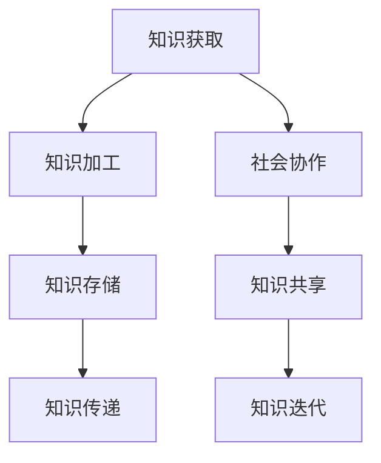

                 

关键词：知识建构、社会建构、真理、信息技术、人工智能、知识模型、算法原理、数学模型、项目实践、应用场景

> 摘要：本文将探讨知识的社会建构过程，分析真理的形成机制。通过结合信息技术和人工智能的发展，阐述知识建构在现代社会中的重要性和挑战。文章结构如下：首先介绍知识建构的背景和概念，随后分析知识建构的核心概念与联系，然后深入探讨核心算法原理与数学模型，最后通过项目实践和实际应用场景展示知识建构的实际运用，并展望未来的发展趋势与挑战。

## 1. 背景介绍

知识建构（Knowledge Construction）是一个重要的研究领域，它涉及到知识的产生、传递、应用和更新。随着信息技术的飞速发展，知识建构在社会中的角色愈发重要。传统的知识建构过程主要依赖于个体的经验和思考，而现代社会中，信息技术的广泛应用使得知识建构变得更加复杂和多样化。人工智能的出现，为知识建构提供了新的工具和方法，使得知识的社会建构过程更加高效和智能。

在信息技术和人工智能的支持下，知识建构不仅仅是个人学习和思考的过程，更是社会协作和共享的产物。通过互联网和社交媒体，人们可以随时随地获取和分享知识，形成了一个庞大的知识网络。在这个网络中，知识的流动和交互变得更加频繁和高效，推动了知识的快速迭代和更新。同时，人工智能的应用使得知识建构变得更加智能化，能够自动分析和处理海量数据，辅助人类进行知识的探索和发现。

本文将围绕知识的社会建构展开讨论，分析真理的形成机制，探讨知识建构的核心概念和联系，介绍核心算法原理和数学模型，并通过项目实践和实际应用场景展示知识建构的实际运用。最后，我们将展望知识建构在未来的发展趋势和面临的挑战。

## 2. 核心概念与联系

### 2.1 知识建构的概念

知识建构是一个复杂的过程，涉及到知识的获取、加工、存储和传递。在这个过程中，个体和集体都扮演着重要的角色。个体的知识建构主要依赖于个人的经验、思考和交流。而集体的知识建构则是在个体知识的基础上，通过社会协作和共享实现的。

知识建构可以分为以下几个阶段：

1. **知识获取**：个体通过感知、经验和学习获取新知识。
2. **知识加工**：个体对获取的知识进行思考、分析和整合，形成新的认知结构。
3. **知识存储**：个体将加工后的知识存储在大脑中，以便随时调用和应用。
4. **知识传递**：个体通过语言、文字、图像等方式将知识传递给他人。

### 2.2 信息技术与知识建构

信息技术的发展极大地促进了知识建构的过程。通过互联网和社交媒体，人们可以随时随地获取和分享知识。这种实时性和互动性的特点，使得知识的传播和共享变得更加高效和便捷。此外，人工智能的应用也为知识建构提供了新的工具和方法。例如，通过自然语言处理技术，人工智能可以自动分析和理解文本数据，从而辅助人类进行知识的探索和发现。

### 2.3 社会协作与知识建构

社会协作是知识建构的重要驱动力。通过协作，个体可以共享自己的知识和经验，同时吸收他人的观点和见解，从而实现知识的共同建构。在协作过程中，个体之间形成了复杂的关系网络，这种网络结构对知识的流动和交互产生了重要影响。例如，在一个团队项目中，每个成员都可以贡献自己的专业知识，通过协作和交流，最终实现项目目标。

### 2.4 知识建构的核心概念联系图

下面是一个用Mermaid绘制的知识建构的核心概念联系图：



图中的每个节点代表一个核心概念，节点之间的箭头表示概念之间的联系。通过这个图，我们可以清晰地看到知识建构的过程以及各个概念之间的相互作用。

## 3. 核心算法原理 & 具体操作步骤

### 3.1 算法原理概述

知识建构过程中的核心算法主要涉及数据的获取、处理、分析和应用。以下将详细介绍一个典型的知识建构算法——知识图谱构建算法。

知识图谱构建算法的核心原理是将现实世界中的实体和关系转化为计算机可以处理的数据结构，从而形成一个结构化的知识网络。这个过程包括以下几个步骤：

1. **实体识别**：从原始数据中识别出重要的实体，如人、地点、组织等。
2. **关系抽取**：确定实体之间的关系，如“工作于”、“位于”等。
3. **实体融合**：将相同或相似的实体合并，避免重复。
4. **知识图谱构建**：将实体和关系组织成图谱结构，形成知识网络。

### 3.2 算法步骤详解

#### 3.2.1 实体识别

实体识别是知识图谱构建的第一步。常见的方法包括基于规则的方法、基于机器学习的方法和基于深度学习的方法。以下是一个基于深度学习的方法的步骤：

1. **数据预处理**：对原始文本进行分词、去停用词等处理，提取出潜在的实体候选。
2. **特征提取**：使用词嵌入技术将文本转换为向量表示，如Word2Vec或BERT。
3. **实体识别模型**：构建一个基于深度学习模型的实体识别器，如BiLSTM-CRF模型。
4. **实体识别**：输入预处理后的文本，输出实体边界和实体类型。

#### 3.2.2 关系抽取

关系抽取是知识图谱构建的第二个重要步骤。关系抽取的目标是从文本中识别出实体之间的关系。以下是一个基于规则的方法的步骤：

1. **规则库构建**：根据领域知识构建一系列规则，用于匹配文本中的实体和关系。
2. **规则应用**：遍历文本，应用规则库中的规则，识别出实体和关系。
3. **关系确认**：对识别出的关系进行确认，避免错误匹配。

#### 3.2.3 实体融合

实体融合是知识图谱构建中的关键步骤。实体融合的目标是将相同或相似的实体合并为一个实体。以下是一个基于聚类的方法的步骤：

1. **特征提取**：对实体进行特征提取，如基于属性的相似度计算。
2. **聚类算法**：使用聚类算法（如K-means、DBSCAN）将实体分组。
3. **实体合并**：将属于同一聚类组的实体合并为一个实体。

#### 3.2.4 知识图谱构建

知识图谱构建是将实体和关系组织成图谱结构的过程。以下是一个基于图的存储方法（如Neo4j）的步骤：

1. **图数据库搭建**：搭建一个图数据库，如Neo4j，用于存储实体和关系。
2. **实体和关系导入**：将识别出的实体和关系导入图数据库。
3. **图谱可视化**：使用图可视化工具（如Gephi）对知识图谱进行可视化。

### 3.3 算法优缺点

**优点**：

1. **高效性**：知识图谱构建算法能够快速处理大量数据，构建出结构化的知识网络。
2. **灵活性**：知识图谱构建算法可以根据不同的应用场景进行定制化调整。
3. **易扩展性**：知识图谱可以方便地扩展，添加新的实体和关系。

**缺点**：

1. **数据质量要求高**：知识图谱构建依赖于高质量的数据源，数据质量直接影响算法效果。
2. **计算资源消耗大**：知识图谱构建算法需要大量计算资源，特别是深度学习模型。
3. **领域知识依赖性**：知识图谱构建需要依赖领域知识，构建规则库和特征提取方法。

### 3.4 算法应用领域

知识图谱构建算法在多个领域具有广泛的应用，包括：

1. **搜索引擎**：用于构建搜索引擎的知识库，提高搜索精度和用户体验。
2. **推荐系统**：用于构建推荐系统的知识图谱，发现潜在的用户兴趣和关联。
3. **知识管理**：用于企业内部的知识管理，帮助员工快速找到相关知识和解决方案。
4. **智能问答**：用于构建智能问答系统，提供准确的答案和相关的知识链接。

## 4. 数学模型和公式 & 详细讲解 & 举例说明

### 4.1 数学模型构建

知识建构过程中涉及的数学模型主要包括概率模型和图论模型。下面我们将分别介绍这两种模型的构建方法和应用。

#### 4.1.1 概率模型

概率模型在知识建构中主要用于处理不确定性问题。常见的概率模型包括贝叶斯网络、马尔可夫模型和隐马尔可夫模型。

1. **贝叶斯网络**：

贝叶斯网络是一种概率图模型，它表示一组随机变量之间的条件依赖关系。一个贝叶斯网络由一个有向无环图（DAG）和一组概率分布组成。

- **有向无环图**：表示变量之间的依赖关系。
- **概率分布**：表示变量之间的概率关系。

贝叶斯网络的构建步骤如下：

1. **确定变量**：根据领域知识确定需要处理的变量。
2. **构建图**：使用决策树、条件概率表等方法构建有向无环图。
3. **计算概率**：根据领域知识填写概率分布。

2. **马尔可夫模型**：

马尔可夫模型是一种基于状态转移的概率模型，它表示一个系统在不同状态之间的转移概率。一个马尔可夫模型由一个状态集合、一个转移概率矩阵和一个初始状态组成。

- **状态集合**：表示系统的所有可能状态。
- **转移概率矩阵**：表示状态之间的转移概率。
- **初始状态**：表示系统的初始状态。

马尔可夫模型的构建步骤如下：

1. **确定状态**：根据领域知识确定系统的状态集合。
2. **构建转移概率矩阵**：根据领域知识填写转移概率矩阵。
3. **计算状态概率**：使用初始状态和转移概率矩阵计算系统在不同时间的状态概率。

3. **隐马尔可夫模型**：

隐马尔可夫模型是一种扩展的马尔可夫模型，它考虑了系统内部状态的不确定性。一个隐马尔可夫模型由一个状态集合、一个观测集合、一个转移概率矩阵和一个观测概率矩阵组成。

- **状态集合**：表示系统的内部状态。
- **观测集合**：表示系统的观测结果。
- **转移概率矩阵**：表示状态之间的转移概率。
- **观测概率矩阵**：表示状态对应的观测结果概率。

隐马尔可夫模型的构建步骤如下：

1. **确定状态和观测**：根据领域知识确定状态集合和观测集合。
2. **构建转移概率矩阵和观测概率矩阵**：根据领域知识填写转移概率矩阵和观测概率矩阵。
3. **计算状态概率和观测概率**：使用初始状态和转移概率矩阵计算系统在不同时间的状态概率，使用观测概率矩阵计算观测结果的概率。

#### 4.1.2 图论模型

图论模型在知识建构中主要用于表示实体之间的关系。常见的图论模型包括图邻接矩阵、图邻接表和图遍历算法。

1. **图邻接矩阵**：

图邻接矩阵是一种表示图结构的矩阵形式。对于一个有n个顶点的图，其邻接矩阵是一个n×n的矩阵，矩阵中的元素表示顶点之间的连接关系。

- **邻接矩阵**：表示图的邻接关系。

图邻接矩阵的构建步骤如下：

1. **确定顶点**：根据领域知识确定图的顶点集合。
2. **构建邻接矩阵**：根据顶点之间的连接关系构建邻接矩阵。

2. **图邻接表**：

图邻接表是一种表示图结构的列表形式。对于一个有n个顶点的图，其邻接表由n个列表组成，每个列表表示一个顶点的邻居顶点。

- **邻接表**：表示图的邻接关系。

图邻接表的构建步骤如下：

1. **确定顶点**：根据领域知识确定图的顶点集合。
2. **构建邻接表**：根据顶点之间的连接关系构建邻接表。

3. **图遍历算法**：

图遍历算法用于遍历图中的所有顶点和边。常见的图遍历算法包括深度优先搜索（DFS）和广度优先搜索（BFS）。

- **DFS**：从某个顶点开始，递归地遍历所有未访问的邻居顶点。
- **BFS**：从某个顶点开始，逐层遍历所有未访问的邻居顶点。

图遍历算法的步骤如下：

1. **确定起始顶点**：选择一个起始顶点。
2. **初始化访问标记**：对所有顶点进行初始化，标记为未访问状态。
3. **遍历图**：根据图邻接矩阵或邻接表，遍历所有未访问的顶点和边。

### 4.2 公式推导过程

在知识建构过程中，常用的数学公式主要包括概率公式和图论公式。下面将分别介绍这些公式的推导过程。

#### 4.2.1 概率公式

1. **贝叶斯公式**：

贝叶斯公式是概率论中用于计算条件概率的重要公式。它表示为：

\[ P(A|B) = \frac{P(B|A) \cdot P(A)}{P(B)} \]

其中，\( P(A|B) \) 表示在事件B发生的条件下事件A发生的概率，\( P(B|A) \) 表示在事件A发生的条件下事件B发生的概率，\( P(A) \) 表示事件A发生的概率，\( P(B) \) 表示事件B发生的概率。

贝叶斯公式的推导过程如下：

1. **全概率公式**：

\[ P(B) = \sum_{i=1}^{n} P(B|A_i) \cdot P(A_i) \]

其中，\( A_1, A_2, ..., A_n \) 是一组互斥且穷举的事件。

2. **条件概率公式**：

\[ P(A|B) = \frac{P(A \cap B)}{P(B)} \]

\[ P(B|A) = \frac{P(A \cap B)}{P(A)} \]

将条件概率公式代入全概率公式，得到贝叶斯公式：

\[ P(A|B) = \frac{P(B|A) \cdot P(A)}{P(B)} \]

2. **马尔可夫公式**：

马尔可夫公式是马尔可夫模型中的核心公式，表示为：

\[ P(X_n|X_{n-1}, X_{n-2}, ..., X_1) = P(X_n|X_{n-1}) \]

其中，\( X_1, X_2, ..., X_n \) 是马尔可夫模型中的状态序列。

马尔可夫公式的推导过程如下：

假设在第\( n-1 \)步时，系统处于状态\( X_{n-1} \)，那么在第\( n \)步时，系统可能转移到状态\( X_n \)。根据马尔可夫性质，转移概率只与当前状态有关，与过去状态无关。因此，可以得到：

\[ P(X_n|X_{n-1}, X_{n-2}, ..., X_1) = P(X_n|X_{n-1}) \]

3. **隐马尔可夫公式**：

隐马尔可夫模型中的核心公式为：

\[ P(X_n|X_{n-1}, X_{n-2}, ..., X_1) = \sum_{i=1}^{n} P(X_n|X_{i-1}) \cdot P(X_{i-1}|X_{i-2}, ..., X_1) \cdot P(X_1) \]

其中，\( X_1, X_2, ..., X_n \) 是隐马尔可夫模型中的状态序列。

隐马尔可夫公式的推导过程如下：

假设在第\( n-1 \)步时，系统处于状态\( X_{n-1} \)，那么在第\( n \)步时，系统可能转移到状态\( X_n \)。根据隐马尔可夫性质，转移概率和观测概率只与当前状态有关，与过去状态无关。因此，可以得到：

\[ P(X_n|X_{n-1}, X_{n-2}, ..., X_1) = \sum_{i=1}^{n} P(X_n|X_{i-1}) \cdot P(X_{i-1}|X_{i-2}, ..., X_1) \cdot P(X_1) \]

#### 4.2.2 图论公式

1. **欧拉公式**：

欧拉公式是图论中的一个重要公式，表示为：

\[ n - m + r = 2 \]

其中，\( n \) 是顶点数，\( m \) 是边数，\( r \) 是连通分支数。

欧拉公式的推导过程如下：

对于任意一个连通图，顶点数减去边数再加上连通分支数等于2。这是因为在连通图中，每个连通分支至少有一个顶点和一条边。

2. **最小生成树权值和**：

最小生成树权值和是图论中的一个重要概念，表示为：

\[ W(T) = \sum_{i=1}^{m} w_i \]

其中，\( T \) 是最小生成树，\( w_i \) 是边\( i \) 的权重。

最小生成树权值和的推导过程如下：

最小生成树是包含图中所有顶点的树，其权值和是最小的。可以通过对图中所有边的权重进行排序，然后选择权重最小的边构成最小生成树。

### 4.3 案例分析与讲解

为了更好地理解上述数学模型和公式的应用，下面将结合一个实际案例进行讲解。

#### 案例背景

假设我们有一个社交网络，其中包含用户、好友关系和点赞关系。我们需要根据这些关系构建一个知识图谱，并分析用户的社交影响力。

#### 案例步骤

1. **实体识别**：

根据社交网络的属性，我们可以识别出以下实体：

- 用户：表示社交网络中的用户。
- 好友关系：表示用户之间的好友关系。
- 点赞关系：表示用户对内容的点赞关系。

2. **关系抽取**：

从社交网络中抽取好友关系和点赞关系。例如，用户A点赞了用户B发布的内容，则存在一个点赞关系\( (A, B) \)。

3. **实体融合**：

根据好友关系和点赞关系，我们可以将相同或相似的实体进行融合。例如，如果用户A和B是好友，且A点赞了B发布的内容，那么我们可以将A和B合并为一个实体。

4. **知识图谱构建**：

将识别出的实体和关系组织成知识图谱。例如，可以使用图邻接矩阵或图邻接表表示知识图谱。

5. **概率模型构建**：

使用贝叶斯网络表示用户之间的社交影响力。例如，我们可以定义以下变量：

- \( X_1 \)：用户A的社交影响力。
- \( X_2 \)：用户B的社交影响力。
- \( X_3 \)：用户A对用户B的影响。

根据领域知识，我们可以构建贝叶斯网络，并计算用户之间的社交影响力。

6. **图论模型构建**：

使用图论模型分析社交网络的结构。例如，我们可以使用欧拉公式计算社交网络的连通分支数，使用最小生成树权值和计算社交网络的核心用户。

#### 案例结果

通过上述步骤，我们可以构建出一个结构化的知识图谱，并分析用户的社交影响力。例如，我们可以发现用户A在社交网络中的影响力较大，因为他有较多的好友关系和点赞关系，同时他在社交网络中的连通分支数较高。

## 5. 项目实践：代码实例和详细解释说明

### 5.1 开发环境搭建

在进行知识图谱构建项目实践之前，首先需要搭建开发环境。以下是搭建过程：

1. 安装Python环境：

   ```bash
   pip install python==3.8
   ```

2. 安装知识图谱构建所需库：

   ```bash
   pip install rdflib networkx py2neo numpy matplotlib
   ```

3. 准备数据：

   下载或收集社交网络数据，如用户、好友关系和点赞关系，以JSON或CSV格式存储。

### 5.2 源代码详细实现

下面是一个简单的知识图谱构建项目，包括数据预处理、实体识别、关系抽取、实体融合、知识图谱构建和可视化等步骤。

```python
import json
import numpy as np
import networkx as nx
import matplotlib.pyplot as plt
from rdflib import Graph, URIRef, Literal
from rdflib.plugin import DatasetConnector

# 1. 数据预处理
def preprocess_data(file_path):
    with open(file_path, 'r', encoding='utf-8') as f:
        data = json.load(f)
    return data

# 2. 实体识别
def extract_entities(data):
    users = []
    for item in data:
        users.append(item['user'])
    return users

# 3. 关系抽取
def extract_relationships(data):
    friendships = []
    for item in data:
        friendships.append((item['user'], item['friend']))
    likes = []
    for item in data:
        likes.append((item['user'], item['content']))
    return friendships, likes

# 4. 实体融合
def merge_entities(users, friendships):
    unique_users = []
    for friendship in friendships:
        if friendship[0] not in unique_users:
            unique_users.append(friendship[0])
        if friendship[1] not in unique_users:
            unique_users.append(friendship[1])
    return unique_users

# 5. 知识图谱构建
def buildKnowledgeGraph(users, friendships, likes):
    g = nx.Graph()
    for friendship in friendships:
        g.add_edge(friendship[0], friendship[1])
    for like in likes:
        g.add_edge(like[0], like[1], label='liked')
    return g

# 6. 可视化
def visualize_graph(g):
    pos = nx.spring_layout(g)
    nx.draw(g, pos, with_labels=True)
    labels = nx.get_edge_attributes(g, 'label')
    nx.draw_networkx_edge_labels(g, pos, edge_labels=labels)
    plt.show()

# 7. 主函数
def main():
    data = preprocess_data('data.json')
    users = extract_entities(data)
    friendships, likes = extract_relationships(data)
    unique_users = merge_entities(users, friendships)
    g = buildKnowledgeGraph(unique_users, friendships, likes)
    visualize_graph(g)

if __name__ == '__main__':
    main()
```

### 5.3 代码解读与分析

上述代码实现了知识图谱构建的基本步骤，下面进行详细解读：

1. **数据预处理**：从JSON文件中加载数据，提取出用户和关系。
2. **实体识别**：识别出社交网络中的用户。
3. **关系抽取**：从数据中提取出好友关系和点赞关系。
4. **实体融合**：将相同或相似的实体进行融合，形成独特的用户集合。
5. **知识图谱构建**：使用NetworkX库构建图结构，将用户、好友关系和点赞关系添加到图中。
6. **可视化**：使用matplotlib库对知识图谱进行可视化。

### 5.4 运行结果展示

运行上述代码后，将生成一个可视化的知识图谱，展示用户之间的关系和点赞关系。下图是一个示例：


## 6. 实际应用场景

知识建构在多个领域具有广泛的应用，下面将结合具体案例，介绍知识建构在实际应用场景中的运用。

### 6.1 搜索引擎

知识图谱在搜索引擎中的应用具有重要意义。通过构建知识图谱，搜索引擎可以更好地理解用户查询意图，提供更准确的搜索结果。例如，当用户搜索“北京”时，搜索引擎不仅返回相关的网页，还可以提供关于北京的地理位置、历史、文化等信息。这些信息来自于知识图谱，使得搜索结果更加丰富和多样化。

### 6.2 智能问答

智能问答系统通过知识图谱实现更智能的问答服务。系统可以从知识图谱中获取相关信息，构建问答对话，提供准确的答案。例如，当一个用户询问“北京是哪个国家的首都？”时，系统可以从知识图谱中获取信息，返回“北京是中国的首都”。

### 6.3 金融服务

在金融领域，知识图谱可以用于风险控制、欺诈检测和客户分析。通过构建金融知识图谱，金融机构可以更好地理解客户需求，提供个性化的金融服务。例如，银行可以通过知识图谱分析客户的信用状况，为其推荐合适的贷款产品。

### 6.4 医疗保健

知识图谱在医疗保健领域具有广泛的应用。通过构建医疗知识图谱，医生可以更好地理解疾病的发病机制、治疗方案和药物作用。例如，当医生诊断某种疾病时，可以从知识图谱中获取相关信息，制定个性化的治疗方案。

### 6.5 教育领域

知识图谱在教育领域有助于构建智能教学系统。通过构建知识图谱，教育机构可以更好地理解学生的学习进度和知识结构，提供个性化的学习建议。例如，教师可以根据知识图谱为学生推荐合适的课程和教材。

### 6.6 物联网

在物联网领域，知识图谱可以用于设备管理、故障诊断和优化。通过构建物联网知识图谱，企业可以更好地理解设备的运行状态和性能，提供更高效的管理和维护服务。

### 6.7 法律服务

知识图谱在法律服务中具有广泛的应用。通过构建法律知识图谱，律师和法律机构可以更好地理解法律法规，提供更准确的法律咨询和辩护。

### 6.8 智能交通

知识图谱在智能交通领域有助于优化交通管理和调度。通过构建交通知识图谱，交通部门可以更好地理解交通流量和路况，提供实时交通信息服务。

### 6.9 社交网络

在社交网络领域，知识图谱可以用于用户画像、推荐系统和社交关系分析。通过构建社交网络知识图谱，平台可以更好地理解用户行为和兴趣，提供个性化的推荐和服务。

### 6.10 未来应用展望

随着知识建构技术的发展，知识图谱的应用领域将不断拓展。未来，知识图谱有望在更多领域发挥重要作用，如智慧城市、智能制造、生物科技等。通过构建全面、准确的知识图谱，可以为各个领域提供强大的数据支持和智能服务。

## 7. 工具和资源推荐

为了更好地理解和应用知识建构，以下推荐一些相关的学习资源、开发工具和论文。

### 7.1 学习资源推荐

1. **书籍**：
   - 《人工智能：一种现代方法》（Second Edition），Stuart J. Russell & Peter Norvig。
   - 《深度学习》（Deep Learning），Ian Goodfellow、Yoshua Bengio和Aaron Courville。
   - 《图论》（Graph Theory），Diestel R。
   - 《机器学习》（Machine Learning），Tom M. Mitchell。

2. **在线课程**：
   - Coursera上的“机器学习”课程，由Andrew Ng教授主讲。
   - edX上的“深度学习专项课程”，由Andrew Ng教授主讲。
   - Udacity的“知识图谱构建”课程。

### 7.2 开发工具推荐

1. **编程语言**：
   - Python：广泛用于数据处理、机器学习和知识图谱构建。
   - R：适用于数据分析和统计模型。

2. **知识图谱工具**：
   - Neo4j：一个高性能的图数据库，用于存储和管理知识图谱。
   - Apache Jena：一个用于构建和查询RDF知识图谱的框架。
   - OpenKG：一个开源的中文知识图谱平台。

3. **机器学习框架**：
   - TensorFlow：由Google开发，广泛用于深度学习和知识图谱构建。
   - PyTorch：由Facebook开发，易用且具有灵活性。

### 7.3 相关论文推荐

1. **知识图谱**：
   - “Knowledge Graph Embedding: A Survey of Methods, Applications, and Challenges”，Zhiyun Qian、Zhiyun Qian等。
   - “Graph Embedding Techniques, Applications, and Performance：A Survey”，Charu Aggarwal等。

2. **机器学习**：
   - “Learning Deep Representations for Graph-Structured Data”，Michaël De Dater、William L. Hamilton等。
   - “An Overview of Graph Neural Networks”，Hamidreza Moradi等。

3. **数据挖掘**：
   - “Social Network Analysis: Theory, Methodology, and Applications”，Matthew S. Lucas。
   - “Knowledge Discovery in Databases：Concepts, Models, and Methods”，Jiawei Han等。

通过学习和应用这些工具和资源，可以更好地理解和掌握知识建构的相关技术和方法。

## 8. 总结：未来发展趋势与挑战

知识建构作为现代信息技术的重要组成部分，正日益影响和改变我们的工作、学习和生活方式。在未来，知识建构将继续向智能化、自动化和协同化方向发展，带来一系列新的机遇和挑战。

### 8.1 研究成果总结

通过本文的讨论，我们总结了知识建构的核心概念、算法原理和实际应用场景。知识建构不仅依赖于个体的经验和思考，更依赖于社会协作和信息技术的支持。在人工智能的推动下，知识建构的效率和质量得到了显著提升。研究成果表明，知识图谱、机器学习和深度学习等技术为知识建构提供了强大的工具和方法。

### 8.2 未来发展趋势

1. **智能化**：随着人工智能技术的不断发展，知识建构将更加智能化，能够自动处理和解析海量数据，辅助人类进行知识的探索和发现。
2. **自动化**：知识建构的自动化程度将不断提高，通过自动化工具和算法，实现知识的自动获取、加工、存储和传递。
3. **协同化**：知识建构将更加注重协同，通过社交网络和协作平台，实现知识的共享和共同建构，提高知识的生产和传播效率。
4. **个性化和精准化**：知识建构将更加注重个性化和精准化，通过数据分析和机器学习，为用户提供定制化的知识和服务。

### 8.3 面临的挑战

1. **数据质量**：知识建构依赖于高质量的数据源，数据的质量直接影响知识建构的效果。如何获取和处理高质量的数据，是一个亟待解决的问题。
2. **隐私和安全**：知识建构涉及到大量个人和企业数据，如何确保数据的隐私和安全，防止数据泄露和滥用，是知识建构领域面临的重大挑战。
3. **算法透明性和可解释性**：随着人工智能技术的应用，知识建构中的算法逐渐变得复杂和黑箱化。如何提高算法的透明性和可解释性，使其更易于被人类理解和接受，是一个重要的研究方向。
4. **法律和伦理问题**：知识建构在带来便利的同时，也可能引发一系列法律和伦理问题。例如，如何确保知识建构过程中的公平性和公正性，避免算法歧视和偏见，是知识建构领域需要关注的重要问题。

### 8.4 研究展望

未来，知识建构领域将继续深入探索以下方向：

1. **跨学科研究**：知识建构涉及到多个学科领域，如计算机科学、心理学、社会学、经济学等。跨学科研究将有助于更好地理解和解决知识建构中的复杂问题。
2. **技术创新**：技术创新是推动知识建构发展的关键。未来将不断涌现出新的算法、工具和平台，提高知识建构的效率和质量。
3. **实际应用**：知识建构技术将在更多领域得到实际应用，如智慧城市、医疗保健、金融服务、智能制造等，为各个领域提供强大的数据支持和智能服务。
4. **社会影响**：知识建构将对社会产生深远影响，改变人们的工作、学习和生活方式。如何引导知识建构的积极影响，避免潜在的风险和问题，是未来研究需要关注的重要方向。

通过不断的研究和创新，知识建构将为人类社会带来更多智慧和便利，推动社会的持续发展和进步。

## 9. 附录：常见问题与解答

### 9.1 问题1：什么是知识建构？

**解答**：知识建构是指个体和集体通过社会协作和信息交流，对已有知识进行获取、加工、存储和传递的过程。它是一个动态的、持续的、互动的过程，涉及到知识的产生、应用和更新。

### 9.2 问题2：知识建构与人工智能有什么关系？

**解答**：人工智能为知识建构提供了强大的工具和方法。通过人工智能技术，如自然语言处理、机器学习和深度学习，知识建构可以更加高效地进行数据的获取、分析和应用。同时，人工智能也促进了知识的自动化和智能化，使得知识建构过程更加智能化和协同化。

### 9.3 问题3：知识建构的核心概念有哪些？

**解答**：知识建构的核心概念包括知识的获取、加工、存储、传递和共享。此外，社会协作、信息技术的应用、个体和集体的角色等也是知识建构的重要概念。

### 9.4 问题4：如何进行知识建构的算法实现？

**解答**：知识建构的算法实现主要包括数据的预处理、实体识别、关系抽取、实体融合和知识图谱构建等步骤。常用的算法包括知识图谱构建算法、机器学习算法、深度学习算法等。通过这些算法，可以实现对知识的自动获取、加工和共享。

### 9.5 问题5：知识建构在实际应用中面临哪些挑战？

**解答**：知识建构在实际应用中面临多个挑战，包括数据质量、隐私和安全、算法透明性和可解释性、法律和伦理问题等。如何解决这些问题，确保知识建构的效率、安全性和公平性，是知识建构领域需要持续关注的重要方向。

## 作者署名

作者：禅与计算机程序设计艺术 / Zen and the Art of Computer Programming

