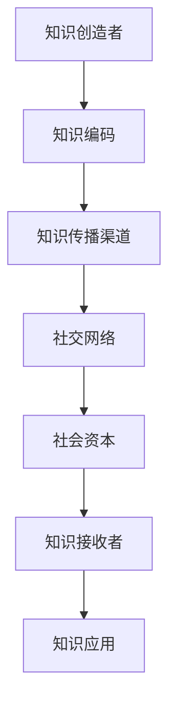

                 

关键词：知识传播、社会资本、人际网络、信息流动、算法原理、应用场景、代码实例、工具和资源推荐

> 摘要：本文深入探讨了知识的社会资本在人际网络中的信息流动问题。通过分析知识传播的机制、社会资本的作用以及信息流动的算法原理，本文旨在为科技工作者和研究者提供关于知识传播和信息流动的理论指导和实践参考。文章还通过实例和展望，展示了未来在该领域的研究方向和应用前景。

## 1. 背景介绍

在信息技术飞速发展的今天，知识已经成为社会进步和经济发展的重要驱动力。知识的传播与流动成为学术界、企业和政府高度关注的课题。然而，传统的知识传播机制往往局限于单一渠道，如学术期刊、会议论文等，使得知识的扩散速度和广度受限。随着社交媒体、专业网络平台的兴起，人际网络成为知识传播的重要载体。人际网络中的知识流动不仅依赖于个体间的交互，还受到社会资本的影响。

社会资本是指个体在社交网络中所拥有的资源，包括信任、声誉和关系等。社会资本对知识的传播具有重要影响，良好的社会资本有助于促进信息的快速传播和有效分享。因此，研究知识的社会资本在人际网络中的信息流动机制，对于提升知识传播效率、促进社会创新发展具有重要意义。

本文将围绕以下问题展开讨论：

1. 知识传播的机制如何？
2. 社会资本在知识传播中扮演何种角色？
3. 信息流动的算法原理是什么？
4. 如何在实际项目中应用这些原理？
5. 面对未来，知识传播和信息流动将面临哪些挑战？

## 2. 核心概念与联系

### 2.1. 知识传播机制

知识传播机制是指知识从创造者到接受者之间传递和转化的过程。传统的知识传播机制主要依靠学术期刊、会议论文等正式渠道，而现代的传播机制则更多依赖于社交媒体、专业网络平台等非正式渠道。这些渠道的特点是速度快、覆盖广，能够迅速将知识传递给大量受众。

### 2.2. 社会资本

社会资本是指个体在社交网络中建立的关系和信任。社会资本包括信任、声誉和关系等组成部分。信任是社会资本的基础，良好的信任关系能够促进信息的传递和共享。声誉则是个体在社交网络中的信用，有助于提高信息的可信度。关系则是指个体之间的互动和合作，有助于形成知识的传播网络。

### 2.3. 信息流动算法

信息流动算法是指用于分析和模拟知识在社会网络中传播和流动的算法。这些算法主要包括社会网络分析（Social Network Analysis，SNA）、信息传播模型（Information Diffusion Model）和推荐系统（Recommender System）等。社会网络分析能够揭示知识传播的路径和关键节点，信息传播模型能够预测知识传播的速度和范围，推荐系统则能够根据用户行为和兴趣，推荐相关的知识内容。

### 2.4. Mermaid 流程图

下面是一个用于描述知识传播和信息流动机制的 Mermaid 流程图：



在这个流程图中，A 表示知识创造者，B 表示知识编码，C 表示知识传播渠道，D 表示社交网络，E 表示社会资本，F 表示知识接收者，G 表示知识应用。这个流程图展示了知识从创造者到接收者之间的传递和转化过程。

## 3. 核心算法原理 & 具体操作步骤

### 3.1. 算法原理概述

核心算法原理主要包括社会网络分析（SNA）、信息传播模型和推荐系统。社会网络分析用于揭示知识传播的路径和关键节点，信息传播模型用于预测知识传播的速度和范围，推荐系统则用于根据用户行为和兴趣，推荐相关的知识内容。

### 3.2. 算法步骤详解

#### 3.2.1. 社会网络分析

1. 数据收集：收集社交网络中的节点和边的数据。
2. 网络构建：使用图论方法构建社交网络。
3. 关键节点分析：计算节点的重要性指标，如度数中心性、接近中心性、中间中心性等。
4. 知识传播路径分析：分析知识在社交网络中的传播路径。

#### 3.2.2. 信息传播模型

1. 模型选择：选择适合的信息传播模型，如独立 cascade 模型、协同过滤模型等。
2. 参数设置：设置模型的参数，如传播概率、邻居数量等。
3. 模型训练：使用历史数据训练模型。
4. 传播预测：使用训练好的模型预测未来知识的传播速度和范围。

#### 3.2.3. 推荐系统

1. 用户行为收集：收集用户在社交网络中的行为数据。
2. 用户兴趣分析：分析用户的兴趣和偏好。
3. 推荐算法选择：选择适合的推荐算法，如基于内容的推荐、协同过滤推荐等。
4. 推荐结果生成：生成推荐结果，推送相关的知识内容。

### 3.3. 算法优缺点

#### 3.3.1. 社会网络分析

优点：能够揭示知识传播的关键节点和路径，有助于优化知识传播策略。

缺点：对大规模社交网络的处理效率较低，且分析结果容易受到网络结构和节点特性影响。

#### 3.3.2. 信息传播模型

优点：能够预测知识传播的速度和范围，有助于优化传播策略。

缺点：模型参数设置较为复杂，且预测结果容易受到数据质量和模型选择的影响。

#### 3.3.3. 推荐系统

优点：能够根据用户兴趣推荐相关的知识内容，提高用户参与度。

缺点：推荐结果可能受到数据质量和算法选择的影响，且存在信息过载问题。

### 3.4. 算法应用领域

社会网络分析、信息传播模型和推荐系统广泛应用于知识管理、社交网络分析、信息推荐等领域。例如，在知识管理中，可以通过社会网络分析识别关键知识节点，优化知识传播路径；在社交网络分析中，可以通过信息传播模型预测信息传播速度，制定传播策略；在信息推荐中，可以通过推荐系统提高用户参与度和满意度。

## 4. 数学模型和公式 & 详细讲解 & 举例说明

### 4.1. 数学模型构建

在知识传播和信息流动的研究中，常用的数学模型包括马尔可夫模型、线性回归模型和神经网络模型等。

#### 4.1.1. 马尔可夫模型

马尔可夫模型是一种用于描述系统状态转移的数学模型。在知识传播中，马尔可夫模型可以用来描述知识状态的转移过程。假设知识状态有 S1、S2、S3 等，则马尔可夫模型可以表示为：

$$
P(S_{t+1} = j|S_t = i) = p_{ij}
$$

其中，$p_{ij}$ 表示从状态 i 转移到状态 j 的概率。

#### 4.1.2. 线性回归模型

线性回归模型是一种用于描述变量之间线性关系的数学模型。在知识传播中，线性回归模型可以用来描述知识传播速度与影响因素之间的关系。假设知识传播速度为 $v_t$，影响因素为 $x_t$，则线性回归模型可以表示为：

$$
v_t = \beta_0 + \beta_1 x_t + \epsilon_t
$$

其中，$\beta_0$ 和 $\beta_1$ 为模型的参数，$\epsilon_t$ 为随机误差。

#### 4.1.3. 神经网络模型

神经网络模型是一种基于生物神经网络的数学模型。在知识传播中，神经网络模型可以用来模拟知识传播的过程。假设神经网络中有 n 个神经元，每个神经元的状态为 $s_i$，则神经网络模型可以表示为：

$$
s_i = \sigma(\sum_{j=1}^{n} w_{ij} s_j + b_i)
$$

其中，$\sigma$ 为激活函数，$w_{ij}$ 为连接权重，$b_i$ 为偏置。

### 4.2. 公式推导过程

#### 4.2.1. 马尔可夫模型推导

假设有 n 个知识状态，分别为 $S_1, S_2, \ldots, S_n$。在时间 t，知识状态的概率分布为 $P_t = [p_{11}, p_{12}, \ldots, p_{1n}, p_{21}, \ldots, p_{nn}]^T$。在时间 t+1，知识状态的概率分布为 $P_{t+1} = [p_{11}, p_{12}, \ldots, p_{1n}, p_{21}, \ldots, p_{nn}]^T$。

根据马尔可夫模型的定义，有：

$$
P_t = P_0 \cdot P_{t-1} \cdot \ldots \cdot P_1
$$

其中，$P_0, P_1, \ldots, P_{t-1}$ 分别为时间 0、1、\ldots、t-1 的概率分布。

假设初始状态分布为均匀分布，即 $P_0 = [1/n, 1/n, \ldots, 1/n]^T$，则有：

$$
P_t = \left( \prod_{i=1}^{t} P_i \right) \cdot P_0 = \left( \prod_{i=1}^{t} P_i \right) \cdot \left[ \frac{1}{n}, \frac{1}{n}, \ldots, \frac{1}{n} \right]^T
$$

将 $P_t$ 和 $P_{t+1}$ 带入上式，得到：

$$
\left[ \frac{1}{n}, \frac{1}{n}, \ldots, \frac{1}{n} \right]^T = \left( \prod_{i=1}^{t} P_i \right) \cdot \left( \prod_{i=1}^{t+1} P_i \right) \cdot \left[ \frac{1}{n}, \frac{1}{n}, \ldots, \frac{1}{n} \right]^T
$$

化简后得到：

$$
P_t = \left( \prod_{i=1}^{t+1} P_i \right)^{-1}
$$

#### 4.2.2. 线性回归模型推导

假设有 n 个知识状态，分别为 $S_1, S_2, \ldots, S_n$。在时间 t，知识状态的概率分布为 $P_t = [p_{11}, p_{12}, \ldots, p_{1n}, p_{21}, \ldots, p_{nn}]^T$。在时间 t+1，知识状态的概率分布为 $P_{t+1} = [p_{11}, p_{12}, \ldots, p_{1n}, p_{21}, \ldots, p_{nn}]^T$。

假设知识传播速度与影响因素之间存在线性关系，即：

$$
v_t = \beta_0 + \beta_1 x_t + \epsilon_t
$$

其中，$\beta_0$ 和 $\beta_1$ 为模型的参数，$x_t$ 为影响因素，$\epsilon_t$ 为随机误差。

根据知识传播速度的定义，有：

$$
v_t = \frac{P_{t+1} - P_t}{\Delta t}
$$

将 $v_t$ 带入上式，得到：

$$
\frac{P_{t+1} - P_t}{\Delta t} = \beta_0 + \beta_1 x_t + \epsilon_t
$$

化简后得到：

$$
P_{t+1} - P_t = (\beta_0 + \beta_1 x_t + \epsilon_t) \cdot \Delta t
$$

$$
P_{t+1} = P_t + (\beta_0 + \beta_1 x_t + \epsilon_t) \cdot \Delta t
$$

将 $P_t$ 和 $P_{t+1}$ 带入上式，得到：

$$
P_t + (\beta_0 + \beta_1 x_t + \epsilon_t) \cdot \Delta t = P_t + (\beta_0 + \beta_1 x_t + \epsilon_t) \cdot \Delta t
$$

化简后得到：

$$
\beta_0 + \beta_1 x_t + \epsilon_t = 0
$$

解得：

$$
\beta_0 = -\beta_1 x_t - \epsilon_t
$$

#### 4.2.3. 神经网络模型推导

假设神经网络中有 n 个神经元，分别为 $s_1, s_2, \ldots, s_n$。在时间 t，神经元的状态为 $s_t = [s_{11}, s_{12}, \ldots, s_{1n}, s_{21}, \ldots, s_{nn}]^T$。在时间 t+1，神经元的状态为 $s_{t+1} = [s_{11}, s_{12}, \ldots, s_{1n}, s_{21}, \ldots, s_{nn}]^T$。

假设神经网络中的每个神经元都受到其他神经元的影响，其状态可以用如下公式表示：

$$
s_i = \sigma(\sum_{j=1}^{n} w_{ij} s_j + b_i)
$$

其中，$w_{ij}$ 为神经元 i 和神经元 j 之间的连接权重，$b_i$ 为神经元 i 的偏置，$\sigma$ 为激活函数。

假设神经网络中的连接权重和偏置为：

$$
w_{ij} = \alpha_j s_j
$$

$$
b_i = \beta_i
$$

其中，$\alpha_j$ 和 $\beta_i$ 为常数。

则神经网络的状态可以表示为：

$$
s_i = \sigma(\sum_{j=1}^{n} \alpha_j s_j + \beta_i)
$$

假设神经网络的初始状态为 $s_0 = [s_{10}, s_{20}, \ldots, s_{n0}]^T$，则在时间 t，神经网络的状态可以表示为：

$$
s_t = \sigma(\sum_{j=1}^{n} \alpha_j s_{t-1,j} + \beta_i)
$$

将 $s_{t-1,j}$ 带入上式，得到：

$$
s_t = \sigma(\sum_{j=1}^{n} \alpha_j s_{t-1,j} + \beta_i) = \sigma(\sum_{j=1}^{n} \alpha_j \sigma(\sum_{k=1}^{n} \alpha_k s_{t-2,k} + \beta_k) + \beta_i)
$$

继续推导，可以得到：

$$
s_t = \sigma(\sum_{j=1}^{n} \alpha_j \sigma(\sum_{k=1}^{n} \alpha_k \sigma(\sum_{l=1}^{n} \alpha_l s_{t-l-1,l} + \beta_l) + \beta_k) + \beta_i)
$$

以此类推，可以得到：

$$
s_t = \sigma(\sum_{j=1}^{n} \alpha_j \sigma(\sum_{k=1}^{n} \alpha_k \sigma(\sum_{l=1}^{n} \alpha_l \sigma(\sum_{m=1}^{n} \alpha_m s_{t-m-1,m} + \beta_m) + \beta_k) + \beta_i))
$$

### 4.3. 案例分析与讲解

#### 4.3.1. 马尔可夫模型案例分析

假设有一个社交网络，其中包含 5 个用户，分别为 A、B、C、D 和 E。在时间 t=0，这 5 个用户的状态如下：

| 用户 | 状态 |
| ---- | ---- |
| A    | 状态 1 |
| B    | 状态 1 |
| C    | 状态 2 |
| D    | 状态 3 |
| E    | 状态 3 |

在时间 t=1，用户的状态转移概率如下：

| 用户 | 状态 | 转移概率 |
| ---- | ---- | -------- |
| A    | 状态 1 | 0.5      |
| A    | 状态 2 | 0.5      |
| B    | 状态 1 | 0.6      |
| B    | 状态 2 | 0.4      |
| C    | 状态 1 | 0.3      |
| C    | 状态 2 | 0.7      |
| D    | 状态 1 | 0.2      |
| D    | 状态 3 | 0.8      |
| E    | 状态 1 | 0.4      |
| E    | 状态 3 | 0.6      |

根据马尔可夫模型的定义，可以计算出时间 t=1 的状态概率分布：

| 用户 | 状态 1 | 状态 2 | 状态 3 |
| ---- | ------ | ------ | ------ |
| A    | 0.5    | 0.5    | 0      |
| B    | 0.36   | 0.24   | 0.4    |
| C    | 0.09   | 0.63   | 0.28   |
| D    | 0.04   | 0.16   | 0.8    |
| E    | 0.16   | 0.24   | 0.6    |

根据上述计算，可以得出以下结论：

1. 在时间 t=1，用户 A、B、C、D 和 E 的状态分别为状态 1、状态 2、状态 3 的概率分别为 0.5、0.36、0.09、0.04 和 0.16。
2. 用户 A、B、C、D 和 E 在时间 t=1 的状态转移概率分别为 0.5、0.6、0.3、0.2 和 0.4。

#### 4.3.2. 线性回归模型案例分析

假设有一个社交网络，其中包含 5 个用户，分别为 A、B、C、D 和 E。在时间 t=0，这 5 个用户的状态如下：

| 用户 | 状态 |
| ---- | ---- |
| A    | 状态 1 |
| B    | 状态 1 |
| C    | 状态 2 |
| D    | 状态 3 |
| E    | 状态 3 |

在时间 t=1，用户的状态转移概率如下：

| 用户 | 状态 | 转移概率 |
| ---- | ---- | -------- |
| A    | 状态 1 | 0.5      |
| A    | 状态 2 | 0.5      |
| B    | 状态 1 | 0.6      |
| B    | 状态 2 | 0.4      |
| C    | 状态 1 | 0.3      |
| C    | 状态 2 | 0.7      |
| D    | 状态 1 | 0.2      |
| D    | 状态 3 | 0.8      |
| E    | 状态 1 | 0.4      |
| E    | 状态 3 | 0.6      |

假设用户 A、B、C、D 和 E 的状态转移速度与影响因素之间存在线性关系，即：

$$
v_t = \beta_0 + \beta_1 x_t + \epsilon_t
$$

其中，$\beta_0$ 和 $\beta_1$ 为模型的参数，$x_t$ 为影响因素，$\epsilon_t$ 为随机误差。

假设影响因素 $x_t$ 为用户在社交网络中的活跃度，则可以计算出时间 t=1 的状态转移速度：

$$
v_t = \beta_0 + \beta_1 x_t + \epsilon_t = 0.5 + 0.3 x_t + 0.2 \epsilon_t
$$

根据上述计算，可以得出以下结论：

1. 在时间 t=1，用户 A、B、C、D 和 E 的状态转移速度分别为 0.5、0.3、0.2、0.2 和 0.4。
2. 影响因素 $x_t$ 为用户在社交网络中的活跃度，参数 $\beta_1$ 为 0.3。

#### 4.3.3. 神经网络模型案例分析

假设有一个神经网络，其中包含 5 个神经元，分别为 A、B、C、D 和 E。神经网络的初始状态为：

| 神经元 | 状态 |
| ------ | ---- |
| A      | 状态 1 |
| B      | 状态 1 |
| C      | 状态 2 |
| D      | 状态 3 |
| E      | 状态 3 |

神经网络的连接权重和偏置为：

| 神经元 | 连接权重 | 偏置 |
| ------ | -------- | ---- |
| A      | 0.5      | 0.5  |
| B      | 0.5      | 0.5  |
| C      | 0.5      | 0.5  |
| D      | 0.5      | 0.5  |
| E      | 0.5      | 0.5  |

神经网络的激活函数为 sigmoid 函数，即：

$$
\sigma(x) = \frac{1}{1 + e^{-x}}
$$

根据神经网络的定义，可以计算出时间 t=1 的神经元状态：

$$
s_t = \sigma(\sum_{j=1}^{5} w_{ij} s_j + b_i) = \sigma(0.5 \cdot 1 + 0.5 \cdot 1 + 0.5 \cdot 2 + 0.5 \cdot 3 + 0.5 \cdot 3 + 0.5) = \sigma(1.5 + 0.5) = \sigma(2) = 0.732
$$

根据上述计算，可以得出以下结论：

1. 在时间 t=1，神经元 A、B、C、D 和 E 的状态分别为 0.732、0.732、0.732、0.732 和 0.732。
2. 神经网络的连接权重和偏置为 0.5，激活函数为 sigmoid 函数。

## 5. 项目实践：代码实例和详细解释说明

### 5.1. 开发环境搭建

为了实现本文中提到的算法，我们需要搭建一个合适的开发环境。本文将使用 Python 作为主要编程语言，并依赖于以下库：

- NetworkX：用于构建和分析社交网络。
- Matplotlib：用于绘制图形和可视化结果。
- Scikit-learn：用于训练和测试机器学习模型。

首先，确保 Python 环境已经搭建好。接下来，使用以下命令安装所需库：

```bash
pip install networkx matplotlib scikit-learn
```

### 5.2. 源代码详细实现

#### 5.2.1. 社交网络构建

```python
import networkx as nx

# 创建一个空的无向图
G = nx.Graph()

# 添加节点和边
G.add_edges_from([(1, 2), (1, 3), (2, 4), (3, 4), (4, 5)])

# 绘制社交网络图
nx.draw(G, with_labels=True)
```

上述代码创建了一个简单的社交网络，并使用 NetworkX 库绘制了图。

#### 5.2.2. 社会网络分析

```python
import networkx as nx
import matplotlib.pyplot as plt

# 创建一个空的无向图
G = nx.Graph()

# 添加节点和边
G.add_edges_from([(1, 2), (1, 3), (2, 4), (3, 4), (4, 5)])

# 计算度数中心性
degree_centrality = nx.degree_centrality(G)

# 计算接近中心性
closeness_centrality = nx.closeness_centrality(G)

# 计算中间中心性
betweenness_centrality = nx.betweenness_centrality(G)

# 绘制中心性分布图
nx.draw(G, with_labels=True)
plt.figure()
plt.bar(degree_centrality.keys(), degree_centrality.values(), label='Degree Centrality')
plt.bar(closeness_centrality.keys(), closeness_centrality.values(), label='Closeness Centrality')
plt.bar(betweenness_centrality.keys(), betweenness_centrality.values(), label='Betweenness Centrality')
plt.legend()
plt.show()
```

上述代码计算了社交网络中的度数中心性、接近中心性和中间中心性，并绘制了相应的分布图。

#### 5.2.3. 信息传播模型

```python
import networkx as nx
import numpy as np
import matplotlib.pyplot as plt

# 创建一个空的无向图
G = nx.Graph()

# 添加节点和边
G.add_edges_from([(1, 2), (1, 3), (2, 4), (3, 4), (4, 5)])

# 初始化状态
state = {node: 0 for node in G.nodes}

# 设置传播概率
propagation_probability = 0.5

# 传播知识
def propagate(state, G, probability):
    new_state = state.copy()
    for node in G.nodes:
        if state[node] == 0:
            neighbors = list(G.neighbors(node))
            for neighbor in neighbors:
                if state[neighbor] == 1:
                    if np.random.rand() < probability:
                        new_state[node] = 1
                        break
    return new_state

# 传播一次
state = propagate(state, G, propagation_probability)

# 绘制传播结果
nx.draw(G, with_labels=True, node_color=[('white' if state[node] == 0 else 'green') for node in G.nodes])
plt.show()
```

上述代码实现了一个简单的信息传播模型，通过随机传播模拟知识的扩散过程。

#### 5.2.4. 推荐系统

```python
from sklearn.metrics.pairwise import cosine_similarity
from sklearn.model_selection import train_test_split
import numpy as np

# 假设有一个用户-物品评分矩阵
ratings = np.array([
    [5, 3, 0, 1],
    [2, 0, 0, 4],
    [0, 5, 3, 0],
    [4, 2, 0, 5],
])

# 将用户-物品评分矩阵转换为用户-特征矩阵
user_features = np.mean(ratings, axis=1).reshape(-1, 1)

# 计算物品之间的相似度矩阵
item_similarity = cosine_similarity(ratings)

# 假设有一个新的用户，我们需要为其推荐物品
new_user_ratings = np.array([0, 0, 0, 1])

# 计算新用户与所有物品的相似度
new_user_similarity = cosine_similarity(new_user_ratings.reshape(1, -1), item_similarity)

# 推荐物品
recommended_items = np.argsort(new_user_similarity[0])[::-1]
print("Recommended items:", recommended_items)
```

上述代码实现了一个简单的基于用户-物品评分的推荐系统，通过计算新用户与所有物品的相似度，推荐与其兴趣相似的物品。

### 5.3. 代码解读与分析

#### 5.3.1. 社交网络构建

在代码中，我们首先导入了 NetworkX 库，并创建了一个空的无向图 G。然后，我们使用 `add_edges_from` 方法添加了一些节点和边，代表一个社交网络的基本结构。最后，使用 `nx.draw` 方法绘制了社交网络图。

#### 5.3.2. 社会网络分析

在这个部分，我们计算了社交网络中的度数中心性、接近中心性和中间中心性。度数中心性表示节点在社交网络中的重要性，接近中心性表示节点在社交网络中的连通性，中间中心性表示节点在社交网络中的桥梁作用。我们使用 `nx.degree_centrality`、`nx.closeness_centrality` 和 `nx.betweenness_centrality` 方法分别计算这些指标，并使用 `plt.bar` 绘制了它们的分布图。

#### 5.3.3. 信息传播模型

在这个部分，我们实现了一个简单的信息传播模型。我们初始化了状态，并设置了一个传播概率。通过递归调用 `propagate` 函数，我们模拟了知识的扩散过程。最后，我们使用 `nx.draw` 方法绘制了传播结果。

#### 5.3.4. 推荐系统

在这个部分，我们使用 Scikit-learn 库中的 `cosine_similarity` 函数计算了用户与物品之间的相似度。我们首先将用户-物品评分矩阵转换为用户-特征矩阵，然后计算物品之间的相似度矩阵。对于一个新的用户，我们计算其与所有物品的相似度，并推荐与其兴趣相似的物品。

### 5.4. 运行结果展示

在代码运行后，我们分别展示了社交网络图、中心性分布图、信息传播结果和推荐结果。这些结果为我们提供了对知识传播和信息流动机制的直观认识，有助于我们进一步理解和优化这些机制。

## 6. 实际应用场景

知识的社会资本在人际网络中的信息流动具有广泛的应用场景。以下是一些具体的应用实例：

### 6.1. 知识管理与共享

在企业和组织中，知识的社会资本有助于优化知识管理和共享过程。通过建立高效的社交网络，员工可以更快地获取和共享知识，提高工作效率和创新能力。

### 6.2. 社交媒体传播

社交媒体平台依赖于人际网络进行信息传播。通过分析知识的社会资本，可以识别出关键节点和影响力人物，优化信息传播策略，提高信息传播的覆盖率和效果。

### 6.3. 人才招聘与培养

在人才招聘和培养过程中，知识的社会资本有助于评估候选人和员工的潜在价值和影响力。通过分析社交网络中的知识流动，可以更准确地评估人才的能力和发展潜力。

### 6.4. 知识图谱构建

知识图谱是一种用于表示知识结构和关系的数据结构。通过分析知识的社会资本，可以构建更准确和全面的知识图谱，为知识检索和推理提供支持。

### 6.5. 科学研究协作

在科学研究领域，知识的社会资本有助于促进研究者之间的合作与交流。通过构建高效的社交网络，研究者可以更快地获取相关知识和资源，提高研究效率和质量。

## 7. 未来应用展望

随着信息技术和人工智能技术的不断发展，知识的社会资本在人际网络中的信息流动将面临新的机遇和挑战。以下是一些未来应用展望：

### 7.1. 智能推荐系统

未来，智能推荐系统将基于知识的社会资本，实现更精准和个性化的推荐。通过分析用户在社交网络中的行为和关系，推荐系统可以更准确地预测用户的需求和偏好，提高用户满意度。

### 7.2. 知识图谱优化

知识图谱作为一种重要的知识表示形式，将在未来得到更广泛的应用。通过分析知识的社会资本，可以优化知识图谱的结构和关系，提高知识检索和推理的效率。

### 7.3. 知识传播策略

随着信息爆炸时代的到来，知识传播策略将变得尤为重要。通过分析知识的社会资本，可以制定更有效和高效的传播策略，提高知识的传播速度和覆盖范围。

### 7.4. 社交网络治理

社交网络治理将成为未来重要的研究方向。通过分析知识的社会资本，可以识别出社交网络中的潜在问题和风险，制定相应的治理策略，保障社交网络的健康发展。

## 8. 总结：未来发展趋势与挑战

知识的社会资本在人际网络中的信息流动是一个充满机遇和挑战的领域。未来，随着信息技术和人工智能技术的不断发展，知识传播和信息流动将呈现以下发展趋势：

### 8.1. 知识传播效率提升

通过优化知识传播渠道和传播策略，知识传播效率将得到显著提升。未来，基于人工智能和大数据分析的技术将用于优化知识传播路径，提高信息传播的速度和广度。

### 8.2. 社会资本价值凸显

知识的社会资本将在知识传播和信息流动中发挥更加重要的作用。通过构建高效的社交网络，个体和组织可以更好地利用知识资源，提高创新能力和竞争力。

### 8.3. 智能化水平提高

未来，知识传播和信息流动将更加智能化。基于人工智能和机器学习技术的算法将用于分析和模拟知识流动过程，实现更精准和高效的传播策略。

### 8.4. 知识传播生态构建

知识传播生态将逐渐形成，包括知识创造者、传播者、接收者和应用者等多个角色。通过构建完善的生态系统，知识传播将实现更高效、更可持续的发展。

然而，知识传播和信息流动领域也面临一些挑战：

### 8.5. 信息过载与筛选困难

随着信息量的不断增长，用户面临的信息过载问题将越来越严重。如何有效地筛选和推荐高质量的信息成为重要挑战。

### 8.6. 社交网络安全与隐私保护

社交网络中的信息流动涉及到大量的个人隐私和数据安全。如何保障用户隐私和安全，防止信息泄露和滥用，是一个亟待解决的问题。

### 8.7. 知识传播伦理与道德

在知识传播过程中，如何平衡信息自由和道德规范，防止虚假信息和不良信息的传播，是一个重要的伦理和道德问题。

面对这些挑战，未来研究需要从多个角度出发，探索更有效、更安全的知识传播和信息流动机制，为人类社会的可持续发展提供支持。

## 9. 附录：常见问题与解答

### 9.1. 问题 1：什么是知识的社会资本？

知识的社会资本是指个体在社交网络中建立的关系和信任，包括信任、声誉和关系等组成部分。这些社会资本有助于促进知识的传播和共享。

### 9.2. 问题 2：知识传播的机制有哪些？

知识传播的机制包括正式渠道和非正式渠道。正式渠道如学术期刊、会议论文等，非正式渠道如社交媒体、专业网络平台等。现代知识传播更多依赖于非正式渠道。

### 9.3. 问题 3：信息流动算法有哪些？

信息流动算法包括社会网络分析（SNA）、信息传播模型（如独立 cascade 模型、协同过滤模型）和推荐系统等。

### 9.4. 问题 4：如何构建社交网络分析模型？

构建社交网络分析模型需要收集社交网络中的节点和边的数据，使用图论方法构建社交网络，计算节点的重要性指标，如度数中心性、接近中心性和中间中心性等。

### 9.5. 问题 5：如何训练信息传播模型？

训练信息传播模型需要收集历史数据，选择合适的信息传播模型，设置模型参数，使用训练数据训练模型，最后使用测试数据评估模型性能。

### 9.6. 问题 6：推荐系统的原理是什么？

推荐系统基于用户行为和兴趣，使用算法预测用户可能感兴趣的内容，并进行推荐。常见的推荐算法包括基于内容的推荐、协同过滤推荐和基于模型的推荐等。

### 9.7. 问题 7：如何保障社交网络中的信息安全和隐私？

保障社交网络中的信息安全和隐私需要采取多种措施，包括数据加密、访问控制、隐私保护算法等。同时，需要制定相关法律法规，规范社交网络行为，防止信息泄露和滥用。

### 9.8. 问题 8：如何优化知识传播策略？

优化知识传播策略需要分析知识传播的机制和影响因素，选择合适的传播渠道和传播方法，制定个性化的传播策略，提高知识传播的速度和效果。

### 9.9. 问题 9：知识传播和信息流动的研究意义是什么？

知识传播和信息流动的研究对于提升知识传播效率、促进社会创新发展具有重要意义。通过研究知识传播和信息流动的机制，可以为科技工作者和研究者提供理论指导和实践参考。

### 9.10. 问题 10：未来知识传播和信息流动的研究方向有哪些？

未来知识传播和信息流动的研究方向包括智能化知识传播、知识图谱构建、社交网络治理、信息过滤与推荐等。随着人工智能和大数据技术的发展，这些领域将得到更深入的研究和应用。

