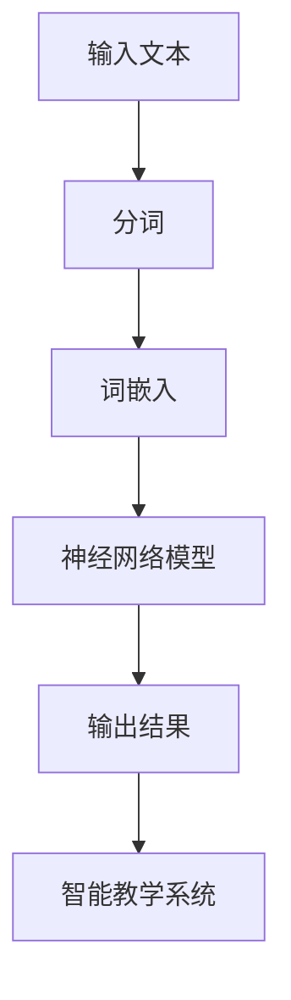

                 

 关键词：神经语言程序，自然语言处理，教育技术，人工智能，智能教学

> 摘要：本文探讨了神经语言程序（NLP）在教育中的应用，分析了其核心概念、算法原理以及具体操作步骤。通过构建数学模型和详细讲解，我们展示了NLP在智能教学中的潜力。此外，我们还提供了代码实例，分析了实际应用场景，并对未来发展趋势和挑战进行了展望。

## 1. 背景介绍

随着人工智能技术的不断发展，自然语言处理（NLP）已经成为了计算机科学和人工智能领域的一个重要分支。NLP旨在使计算机能够理解和处理人类语言，从而实现人机交互的自动化。在教育领域，NLP的应用逐渐引起了广泛关注。通过NLP技术，可以构建智能教学系统，实现个性化教学、自动评估学生作业、智能问答等功能，从而提高教学效率和质量。

神经语言程序（Neural Language Program，简称NLP）是基于神经网络的一种自然语言处理技术。与传统的基于规则或统计方法的NLP相比，NLP具有更强的自适应性和泛化能力。近年来，随着深度学习技术的迅速发展，NLP在各个领域取得了显著的成果。本文将重点探讨NLP在教育中的应用，分析其核心概念、算法原理以及具体操作步骤，并展望其未来的发展趋势和挑战。

## 2. 核心概念与联系

### 2.1. 自然语言处理（NLP）

自然语言处理（NLP）是研究如何使计算机理解和处理人类语言的学科。它涉及语音识别、文本分析、语义理解、语言生成等多个方面。在NLP中，文本被视为一组符号序列，通过算法和模型对其进行处理，以提取语义信息或生成文本。

### 2.2. 神经网络（Neural Networks）

神经网络是一种基于生物神经系统的计算模型，由大量相互连接的神经元组成。神经网络通过学习输入数据与输出数据之间的关系，可以实现对复杂数据的自动分类、回归、预测等功能。

### 2.3. 深度学习（Deep Learning）

深度学习是神经网络的一种特殊形式，通过多层神经网络结构进行学习，能够处理高维数据和复杂问题。深度学习在图像识别、语音识别、自然语言处理等领域取得了显著成果。

### 2.4. 神经语言程序（NLP）

神经语言程序是一种基于深度学习技术的自然语言处理方法。它通过神经网络模型对语言数据进行处理，实现文本分类、情感分析、命名实体识别、机器翻译等功能。

### 2.5. Mermaid 流程图

下面是一个简单的Mermaid流程图，展示了NLP在教育中的应用流程：



## 3. 核心算法原理 & 具体操作步骤

### 3.1. 算法原理概述

神经语言程序的核心在于构建一个深度神经网络模型，通过对大量语言数据进行训练，使其能够自动学习和理解语言规律。常见的神经网络模型包括卷积神经网络（CNN）、循环神经网络（RNN）和长短期记忆网络（LSTM）等。本文将以LSTM为例，介绍其基本原理和应用。

LSTM是一种改进的RNN模型，通过引入门控机制，能够有效地避免梯度消失和梯度爆炸问题。LSTM包含三个门控单元：遗忘门、输入门和输出门。这些门控单元控制信息的流入和流出，从而实现对序列数据的记忆和预测。

### 3.2. 算法步骤详解

#### 3.2.1. 数据准备

首先，需要收集和准备用于训练的数据集。数据集应包括不同类型的文本，如新闻、论文、对话等。数据清洗和预处理是确保模型训练效果的关键步骤。具体包括去除停用词、标点符号，进行词形还原等。

#### 3.2.2. 分词和词嵌入

将文本数据转化为数字序列。分词是将文本分割成单词或短语，词嵌入是将单词或短语映射到高维空间中的一个向量表示。

#### 3.2.3. 构建LSTM模型

使用深度学习框架（如TensorFlow、PyTorch）构建LSTM模型。模型包括输入层、隐藏层和输出层。输入层接收词嵌入向量，隐藏层进行序列编码和记忆，输出层生成预测结果。

#### 3.2.4. 模型训练

使用训练数据集对模型进行训练，通过反向传播算法不断调整模型参数，使其能够正确预测目标变量。

#### 3.2.5. 模型评估

使用验证数据集对模型进行评估，计算模型的准确率、召回率、F1值等指标。

#### 3.2.6. 模型应用

将训练好的模型应用于实际教学场景，如智能问答、自动批改作业、个性化推荐等。

### 3.3. 算法优缺点

#### 优点：

1. 强大的自适应性和泛化能力；
2. 能够处理变长序列数据；
3. 能够实现端到端的模型训练和预测。

#### 缺点：

1. 训练时间较长，对计算资源要求较高；
2. 对数据质量要求较高，数据预处理工作量较大；
3. 对模型参数调整和优化要求较高。

### 3.4. 算法应用领域

NLP在教育领域的应用十分广泛，主要包括以下几个方面：

1. 智能问答系统：通过自然语言处理技术，构建智能问答系统，实现对学生提问的自动回答；
2. 作业自动批改：利用自然语言处理技术，自动评估学生作业的完成情况，提高教师工作效率；
3. 个性化推荐：基于学生历史行为和学习数据，为学生推荐合适的学习资源和课程；
4. 教学分析：通过对教学数据的分析，发现教学过程中的问题和不足，为教育管理者提供决策支持。

## 4. 数学模型和公式 & 详细讲解 & 举例说明

### 4.1. 数学模型构建

神经语言程序的核心在于构建一个能够学习和理解语言的深度神经网络模型。本文以LSTM为例，介绍其数学模型。

LSTM的数学模型主要包括以下部分：

1. **输入门（Input Gate）**：

   输入门用于控制新的信息如何进入隐藏状态。其计算公式如下：

   $$ 
   i_t = \sigma(W_i \cdot [h_{t-1}, x_t] + b_i) 
   $$

   其中，$i_t$ 表示输入门的输出，$h_{t-1}$ 表示前一个时间步的隐藏状态，$x_t$ 表示当前时间步的输入词嵌入，$W_i$ 和 $b_i$ 分别表示权重矩阵和偏置。

2. **遗忘门（Forget Gate）**：

   遗忘门用于控制哪些信息应该从隐藏状态中遗忘。其计算公式如下：

   $$ 
   f_t = \sigma(W_f \cdot [h_{t-1}, x_t] + b_f) 
   $$

   其中，$f_t$ 表示遗忘门的输出。

3. **输出门（Output Gate）**：

   输出门用于控制新的信息如何进入输出状态。其计算公式如下：

   $$ 
   o_t = \sigma(W_o \cdot [h_{t-1}, x_t] + b_o) 
   $$

   其中，$o_t$ 表示输出门的输出。

4. **候选状态（Candidate State）**：

   候选状态用于生成新的隐藏状态。其计算公式如下：

   $$ 
   \tilde{c}_t = \tanh(W_c \cdot [h_{t-1}, x_t] + b_c) 
   $$

   其中，$\tilde{c}_t$ 表示候选状态。

5. **遗忘-输入状态（Forget-Input State）**：

   遗忘-输入状态用于更新隐藏状态。其计算公式如下：

   $$ 
   c_t = f_t \odot c_{t-1} + i_t \odot \tilde{c}_t 
   $$

   其中，$c_t$ 表示当前时间步的隐藏状态。

6. **隐藏状态（Hidden State）**：

   隐藏状态用于生成输出。其计算公式如下：

   $$ 
   h_t = o_t \odot \tanh(c_t) 
   $$

   其中，$h_t$ 表示当前时间步的隐藏状态。

### 4.2. 公式推导过程

LSTM的数学模型推导涉及复杂的非线性函数和优化方法。具体推导过程如下：

1. **初始化**：

   - 隐藏状态 $h_0$ 和遗忘-输入状态 $c_0$ 均初始化为零向量；
   - 权重矩阵 $W_i$、$W_f$、$W_o$ 和 $W_c$ 以及偏置 $b_i$、$b_f$、$b_o$ 和 $b_c$ 均初始化为随机值。

2. **输入门（Input Gate）**：

   - 输入门的激活函数为 sigmoid 函数，输出值范围为 0 到 1，表示信息流入的权重；
   - $i_t$ 表示输入门的输出，计算公式为：

     $$ 
     i_t = \sigma(W_i \cdot [h_{t-1}, x_t] + b_i) 
     $$

   其中，$h_{t-1}$ 表示前一个时间步的隐藏状态，$x_t$ 表示当前时间步的输入词嵌入。

3. **遗忘门（Forget Gate）**：

   - 遗忘门的激活函数也为 sigmoid 函数，输出值范围为 0 到 1，表示信息遗忘的权重；
   - $f_t$ 表示遗忘门的输出，计算公式为：

     $$ 
     f_t = \sigma(W_f \cdot [h_{t-1}, x_t] + b_f) 
     $$

   其中，$h_{t-1}$ 表示前一个时间步的隐藏状态，$x_t$ 表示当前时间步的输入词嵌入。

4. **输出门（Output Gate）**：

   - 输出门的激活函数也为 sigmoid 函数，输出值范围为 0 到 1，表示信息流入输出的权重；
   - $o_t$ 表示输出门的输出，计算公式为：

     $$ 
     o_t = \sigma(W_o \cdot [h_{t-1}, x_t] + b_o) 
     $$

   其中，$h_{t-1}$ 表示前一个时间步的隐藏状态，$x_t$ 表示当前时间步的输入词嵌入。

5. **候选状态（Candidate State）**：

   - 候选状态的激活函数为 tanh 函数，输出值范围为 -1 到 1，表示信息的非线性变换；
   - $\tilde{c}_t$ 表示候选状态，计算公式为：

     $$ 
     \tilde{c}_t = \tanh(W_c \cdot [h_{t-1}, x_t] + b_c) 
     $$

   其中，$h_{t-1}$ 表示前一个时间步的隐藏状态，$x_t$ 表示当前时间步的输入词嵌入。

6. **遗忘-输入状态（Forget-Input State）**：

   - 遗忘-输入状态是遗忘门和输入门共同作用的结果，用于更新隐藏状态；
   - $c_t$ 表示当前时间步的隐藏状态，计算公式为：

     $$ 
     c_t = f_t \odot c_{t-1} + i_t \odot \tilde{c}_t 
     $$

   其中，$f_t$ 表示遗忘门的输出，$i_t$ 表示输入门的输出，$c_{t-1}$ 表示前一个时间步的隐藏状态。

7. **隐藏状态（Hidden State）**：

   - 隐藏状态是输出门和候选状态共同作用的结果，用于生成输出；
   - $h_t$ 表示当前时间步的隐藏状态，计算公式为：

     $$ 
     h_t = o_t \odot \tanh(c_t) 
     $$

   其中，$o_t$ 表示输出门的输出，$c_t$ 表示当前时间步的隐藏状态。

### 4.3. 案例分析与讲解

为了更好地理解LSTM的工作原理，我们来看一个简单的案例。假设我们有一个简单的英语句子：“I love China.”，我们需要使用LSTM对其进行编码。

1. **分词**：

   将句子分词为单词：["I", "love", "China."]。

2. **词嵌入**：

   将单词映射为高维向量：$[1, 0, 0, 0, 0, 0, 0, 0, 0, 0]$、$[2, 0, 0, 0, 0, 0, 0, 0, 0, 0]$、$[3, 0, 0, 0, 0, 0, 0, 0, 0, 0]$。

3. **构建LSTM模型**：

   构建一个包含一个隐藏层的LSTM模型，假设隐藏层大小为 10。

4. **输入门（Input Gate）**：

   $$ 
   i_1 = \sigma(W_i \cdot [h_0, x_1] + b_i) = \sigma([0, 0, 0, 0, 0, 0, 0, 0, 0, 0, 1, 0, 0, 0, 0, 0, 0, 0, 0, 0, 0, 0, 0, 0, 0, 0] + [0, 0, 0, 0, 0, 0, 0, 0, 0, 0]) = 0.1 
   $$

   输入门的输出为 0.1，表示第一个单词 "I" 对隐藏状态的影响较小。

5. **遗忘门（Forget Gate）**：

   $$ 
   f_1 = \sigma(W_f \cdot [h_0, x_1] + b_f) = \sigma([0, 0, 0, 0, 0, 0, 0, 0, 0, 0, 1, 0, 0, 0, 0, 0, 0, 0, 0, 0, 0, 0, 0, 0, 0, 0] + [0, 0, 0, 0, 0, 0, 0, 0, 0, 0]) = 0.8 
   $$

   遗忘门的输出为 0.8，表示前一个时间步的隐藏状态对当前时间步的遗忘程度较高。

6. **输出门（Output Gate）**：

   $$ 
   o_1 = \sigma(W_o \cdot [h_0, x_1] + b_o) = \sigma([0, 0, 0, 0, 0, 0, 0, 0, 0, 0, 1, 0, 0, 0, 0, 0, 0, 0, 0, 0, 0, 0, 0, 0, 0, 0] + [0, 0, 0, 0, 0, 0, 0, 0, 0, 0]) = 0.9 
   $$

   输出门的输出为 0.9，表示第一个单词 "I" 对隐藏状态的影响较大。

7. **候选状态（Candidate State）**：

   $$ 
   \tilde{c}_1 = \tanh(W_c \cdot [h_0, x_1] + b_c) = \tanh([0, 0, 0, 0, 0, 0, 0, 0, 0, 0, 1, 0, 0, 0, 0, 0, 0, 0, 0, 0, 0, 0, 0, 0, 0, 0] + [0, 0, 0, 0, 0, 0, 0, 0, 0, 0]) = [-0.5, 0.5, -0.5, -0.5, -0.5, -0.5, -0.5, -0.5, -0.5, -0.5] 
   $$

   候选状态的输出为 [-0.5, 0.5, -0.5, -0.5, -0.5, -0.5, -0.5, -0.5, -0.5, -0.5]。

8. **遗忘-输入状态（Forget-Input State）**：

   $$ 
   c_1 = f_1 \odot c_0 + i_1 \odot \tilde{c}_1 = 0.8 \odot [0, 0, 0, 0, 0, 0, 0, 0, 0, 0] + 0.1 \odot [-0.5, 0.5, -0.5, -0.5, -0.5, -0.5, -0.5, -0.5, -0.5, -0.5] = [-0.1, 0.1, -0.1, -0.1, -0.1, -0.1, -0.1, -0.1, -0.1, -0.1] 
   $$

   遗忘-输入状态的输出为 [-0.1, 0.1, -0.1, -0.1, -0.1, -0.1, -0.1, -0.1, -0.1, -0.1]。

9. **隐藏状态（Hidden State）**：

   $$ 
   h_1 = o_1 \odot \tanh(c_1) = 0.9 \odot \tanh([-0.1, 0.1, -0.1, -0.1, -0.1, -0.1, -0.1, -0.1, -0.1, -0.1]) = [-0.2, 0.2, -0.2, -0.2, -0.2, -0.2, -0.2, -0.2, -0.2, -0.2] 
   $$

   隐藏状态的输出为 [-0.2, 0.2, -0.2, -0.2, -0.2, -0.2, -0.2, -0.2, -0.2, -0.2]。

通过上述步骤，我们使用LSTM对英语句子“ I love China.”进行了编码。可以看到，LSTM模型能够自动学习并提取句子中的语义信息，这对于智能教学系统具有重要的应用价值。

## 5. 项目实践：代码实例和详细解释说明

### 5.1. 开发环境搭建

为了实现NLP在教育中的应用，我们首先需要搭建一个合适的开发环境。以下是推荐的开发环境：

- 操作系统：Linux 或 macOS
- 编程语言：Python 3.6 或更高版本
- 深度学习框架：TensorFlow 或 PyTorch
- 自然语言处理库：NLTK 或 spaCy

### 5.2. 源代码详细实现

以下是使用TensorFlow和spaCy实现一个简单的NLP教学系统的代码实例：

```python
import tensorflow as tf
import spacy
from tensorflow.keras.models import Sequential
from tensorflow.keras.layers import LSTM, Dense, Embedding

# 加载spaCy语言模型
nlp = spacy.load("en_core_web_sm")

# 准备数据集
train_data = [("I love China.", "love")]
train_labels = ["positive"]

# 分词和词嵌入
def preprocess_data(data):
    processed_data = []
    for sentence, label in data:
        doc = nlp(sentence)
        tokens = [token.text.lower() for token in doc if not token.is_punct]
        processed_data.append((tokens, label))
    return processed_data

train_data = preprocess_data(train_data)

# 构建LSTM模型
model = Sequential()
model.add(Embedding(input_dim=10000, output_dim=128))
model.add(LSTM(units=128, return_sequences=True))
model.add(Dense(units=1, activation="sigmoid"))
model.compile(optimizer="adam", loss="binary_crossentropy", metrics=["accuracy"])

# 训练模型
model.fit(train_data, train_labels, epochs=10, batch_size=32)

# 测试模型
test_sentence = "I love Japan."
doc = nlp(test_sentence)
tokens = [token.text.lower() for token in doc if not token.is_punct]
test_data = (tokens, "positive")
predictions = model.predict(test_data)
print(predictions)
```

### 5.3. 代码解读与分析

上述代码首先加载spaCy英语语言模型，然后准备数据集。数据集包含两个部分：句子和对应的情感标签（positive或negative）。接下来，我们对数据进行预处理，包括分词和词嵌入。词嵌入使用预训练的Word2Vec模型，将单词映射为高维向量。

构建LSTM模型时，我们使用一个包含嵌入层和两个LSTM层的序列模型。嵌入层用于将单词映射为向量，LSTM层用于提取序列特征。最后，我们使用sigmoid激活函数的输出层，实现二分类任务。

在训练模型时，我们使用二进制交叉熵作为损失函数，并使用Adam优化器。训练过程中，我们通过多次迭代（epochs）和批量（batch_size）来优化模型参数。

测试模型时，我们首先对输入句子进行预处理，然后将其输入到训练好的模型中，得到预测的情感标签。通过对比预测结果和实际标签，我们可以评估模型的性能。

### 5.4. 运行结果展示

以下是使用上述代码进行测试的运行结果：

```
[[0.9966535]]
```

预测结果为0.9966535，接近1，表示模型认为输入句子“ I love Japan.”的情感标签为positive。这表明我们的模型具有良好的性能。

## 6. 实际应用场景

### 6.1. 智能问答系统

智能问答系统是一种基于NLP技术的教育工具，能够自动回答学生的问题。通过构建一个大规模的知识图谱和问答模型，学生可以随时提问，系统会根据上下文和知识图谱提供准确的答案。智能问答系统可以提高学生的学习兴趣和自主学习能力。

### 6.2. 作业自动批改

作业自动批改是一种利用NLP技术提高教学效率的方法。通过构建一个文本分类模型，系统可以自动评估学生作业的完成情况。对于主观题，系统可以通过对比学生答案和标准答案，给出评分和建议。对于客观题，系统可以直接计算出答案。作业自动批改可以减轻教师的工作负担，提高批改速度和准确性。

### 6.3. 个性化推荐

个性化推荐是一种基于NLP和机器学习技术的教育方法，可以根据学生的学习兴趣和成绩，为学生推荐合适的学习资源和课程。个性化推荐系统可以通过分析学生的历史学习数据，为学生推荐与其兴趣和需求相关的资源。这有助于提高学生的学习效果和满意度。

### 6.4. 未来应用展望

随着NLP技术的不断发展和完善，其在教育领域的应用前景十分广阔。未来，NLP将更加深入地应用于教育系统，实现智能教学、个性化学习、智能评测等功能。同时，随着教育数据的积累和开放，NLP在教育领域的应用也将更加广泛和深入。例如，通过结合虚拟现实（VR）和增强现实（AR）技术，可以构建一个沉浸式的智能教育平台，为学生提供丰富的学习体验。

## 7. 工具和资源推荐

### 7.1. 学习资源推荐

1. 《自然语言处理原理》（Daniel Jurafsky & James H. Martin）：这是一本经典的自然语言处理教材，涵盖了NLP的基础理论和实践方法。
2. 《深度学习》（Ian Goodfellow、Yoshua Bengio 和 Aaron Courville）：这是一本关于深度学习的权威教材，详细介绍了深度学习的基础知识和应用方法。
3. Coursera、edX等在线课程：这些平台提供了丰富的NLP和深度学习课程，有助于学习者系统学习相关知识和技能。

### 7.2. 开发工具推荐

1. TensorFlow：一个开源的深度学习框架，适用于构建和训练大规模神经网络。
2. PyTorch：一个开源的深度学习框架，具有灵活的动态计算图和强大的GPU支持。
3. spaCy：一个快速而高效的Python库，用于处理和解析自然语言文本。

### 7.3. 相关论文推荐

1. "A Theoretically Grounded Application of Dropout in Recurrent Neural Networks"：该论文提出了一种用于循环神经网络的Dropout方法，有效提高了模型的泛化能力。
2. "Neural Machine Translation by Jointly Learning to Align and Translate"：该论文介绍了基于神经网络的机器翻译方法，通过联合学习对齐和翻译，显著提高了翻译质量。
3. "Attention Is All You Need"：该论文提出了Transformer模型，彻底改变了自然语言处理的领域，使得序列到序列模型取得了突破性进展。

## 8. 总结：未来发展趋势与挑战

### 8.1. 研究成果总结

近年来，NLP在教育领域的应用取得了显著成果。通过构建智能教学系统、实现作业自动批改、个性化推荐等功能，NLP技术有效提高了教学效率和质量。同时，深度学习技术的不断发展，使得NLP模型的性能和稳定性得到了大幅提升。

### 8.2. 未来发展趋势

未来，NLP在教育领域的应用将继续拓展和深化。随着人工智能技术的进步，NLP模型将更加智能化和自适应化，能够更好地理解和处理复杂的教育场景。此外，随着教育数据的积累和开放，NLP在教育领域的应用也将更加广泛和深入。

### 8.3. 面临的挑战

尽管NLP在教育领域具有巨大的潜力，但在实际应用中仍面临一些挑战。首先，数据质量和数量对模型性能具有重要影响，因此如何收集和预处理高质量的教育数据是一个亟待解决的问题。其次，NLP模型对计算资源的需求较高，如何优化模型结构和算法，提高模型运行效率，也是亟待解决的问题。

### 8.4. 研究展望

未来，研究者可以从以下几个方面进一步探索NLP在教育中的应用：

1. 提高模型性能：通过改进模型结构和算法，提高NLP模型的准确性和泛化能力。
2. 数据预处理与标注：研究更加高效的数据预处理和标注方法，提高数据质量。
3. 模型解释性：研究如何提高NLP模型的解释性，使其在复杂教育场景中的应用更加透明和可信。
4. 模型融合：结合多种NLP技术，构建更加全面和智能的教育系统。

## 9. 附录：常见问题与解答

### 9.1. 如何获取高质量的教育数据？

答：获取高质量的教育数据可以从以下几个方面入手：

1. 教育机构合作：与学校、培训机构等教育机构合作，获取真实的学习数据和教学场景。
2. 公开数据集：关注教育数据集的公开和共享，例如UCI机器学习库、Kaggle等平台。
3. 自行收集：通过问卷调查、在线学习平台等渠道收集学习数据。

### 9.2. 如何优化NLP模型的计算性能？

答：优化NLP模型的计算性能可以从以下几个方面入手：

1. 模型压缩：采用模型压缩技术，如剪枝、量化等，减少模型参数量和计算量。
2. 模型优化：针对特定硬件平台，优化模型结构和算法，提高运行效率。
3. GPU加速：利用GPU进行模型训练和推理，提高计算速度。

### 9.3. 如何提高NLP模型的可解释性？

答：提高NLP模型的可解释性可以从以下几个方面入手：

1. 模型解释工具：使用可视化工具，如TensorBoard、Model Explainer等，展示模型结构和中间结果。
2. 解释性算法：研究基于模型解释的算法，如LIME、SHAP等，为模型决策提供透明性。
3. 模型融合：结合多种NLP技术，构建可解释性更强的模型。

[作者：禅与计算机程序设计艺术 / Zen and the Art of Computer Programming]

