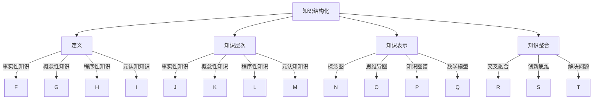

                 

关键词：知识结构化，信息处理，理解效率，认知科学，计算机编程，人工智能，方法论，学习策略

> 摘要：本文旨在探讨如何通过知识结构化的方法，提升个体在计算机编程和人工智能等领域的理解效率。通过介绍核心概念与联系、核心算法原理、数学模型与公式、项目实践及实际应用场景，本文将提供一系列工具和资源推荐，并总结未来发展趋势与挑战。

## 1. 背景介绍

在快速发展的信息技术时代，面对海量的数据和信息，如何高效地处理和利用这些资源成为了一个关键问题。计算机编程和人工智能领域尤为显著，它们不仅需要大量的知识储备，还要求程序员和研究者能够快速理解并应用这些知识。然而，传统的线性学习方法和零散的知识点学习，往往导致理解效率低下，难以形成系统的认知框架。因此，知识结构化成为了一种有效的解决策略。

知识结构化不仅仅是将知识整理和归类，更是一种通过建立知识之间的联系，构建系统化认知框架的过程。它有助于提高信息处理能力，优化记忆效果，加快学习速度，并在解决问题时提供更为有效的思路和方法。本文将围绕这一主题，深入探讨知识结构化的多种方法和实际应用。

## 2. 核心概念与联系

为了理解知识结构化的核心，我们需要首先明确几个关键概念，并探讨它们之间的相互关系。

### 2.1 知识结构化的定义

知识结构化是指将无序的知识点按照一定的逻辑关系进行整理、分类、编码和整合，从而形成系统化的知识体系。这个过程涉及数据的收集、筛选、整合和分析，以及知识的表达和传递。

### 2.2 知识层次

知识层次包括事实性知识、概念性知识、程序性知识和元认知知识。事实性知识是最基础的知识，如具体的数据和事实；概念性知识是对事实性知识的抽象和概括，如定义和概念；程序性知识是关于如何解决问题的步骤和方法；元认知知识是关于如何学习、思考和管理知识的策略。

### 2.3 知识表示

知识表示是知识结构化的关键步骤之一，它涉及如何将知识以图形、文本、公式等多种形式进行表达。常见的知识表示方法包括概念图、思维导图、知识图谱和数学模型等。

### 2.4 知识整合

知识整合是将不同领域的知识进行交叉和融合，以形成更广泛的认知网络。这不仅有助于提高理解效率，还能够激发创新思维和解决问题的能力。



通过上述核心概念的梳理和相互关系的分析，我们可以更好地理解知识结构化的原理和实践。

## 3. 核心算法原理 & 具体操作步骤

### 3.1 算法原理概述

知识结构化的核心算法可以概括为以下三个方面：

1. **知识抽取**：通过自然语言处理、机器学习等技术，从大量文本中自动提取出关键信息，形成结构化的数据集。
2. **知识融合**：将来自不同来源的知识进行整合，消除冗余信息，并建立知识之间的关联。
3. **知识推理**：利用已有的知识进行推理，生成新的结论和发现。

### 3.2 算法步骤详解

#### 3.2.1 数据收集与预处理

1. **数据收集**：通过爬虫、数据库查询等方式获取相关领域的文本数据。
2. **数据预处理**：包括文本清洗、分词、去停用词等步骤，以提高数据质量。

#### 3.2.2 知识抽取

1. **实体识别**：利用命名实体识别技术，识别文本中的关键实体。
2. **关系提取**：通过模式匹配、规则学习等方法，提取实体之间的关系。
3. **属性抽取**：对实体进行属性标注，如时间、地点、数量等。

#### 3.2.3 知识融合

1. **知识去重**：利用哈希函数、相似度计算等方法，识别并去除重复的知识条目。
2. **知识关联**：通过共现分析、图论等方法，建立不同知识之间的关联。
3. **知识整合**：将分散的知识进行整合，形成系统化的知识网络。

#### 3.2.4 知识推理

1. **规则推理**：基于已知规则和事实，生成新的结论。
2. **逻辑推理**：利用逻辑推理方法，从前提中推导出结论。
3. **机器学习推理**：利用机器学习模型，从数据中学习推理规则。

### 3.3 算法优缺点

#### 优点

- **高效性**：自动化算法可以大幅提高知识结构化的效率。
- **准确性**：通过机器学习和自然语言处理技术，提高知识抽取和融合的准确性。
- **可扩展性**：算法框架可以轻松扩展到不同领域和应用场景。

#### 缺点

- **依赖数据**：算法的性能高度依赖数据的质量和数量。
- **规则学习难度**：规则学习的复杂度高，需要大量先验知识和计算资源。

### 3.4 算法应用领域

知识结构化算法在多个领域有广泛应用：

- **智能问答系统**：通过结构化知识，快速响应用户查询。
- **知识图谱构建**：为搜索引擎、推荐系统等提供知识支持。
- **智能助手**：为个人和企业提供个性化的知识服务。
- **学术研究**：自动化提取和整合学术文献中的知识。

## 4. 数学模型和公式 & 详细讲解 & 举例说明

### 4.1 数学模型构建

在知识结构化过程中，数学模型是理解和描述知识结构的重要工具。以下是几个常见的数学模型：

#### 4.1.1 知识图谱模型

知识图谱模型通过图结构来表示知识，其中节点表示实体，边表示实体之间的关系。常见的图论算法如Dijkstra算法和PageRank算法可以用于知识图谱的构建和优化。

#### 4.1.2 隐马尔可夫模型

隐马尔可夫模型（HMM）用于处理具有时间序列特征的随机过程，可以用于知识序列的建模和分析。

#### 4.1.3 支持向量机

支持向量机（SVM）是一种常用的分类算法，可以用于知识分类和聚类。

### 4.2 公式推导过程

#### 4.2.1 知识图谱模型

$$
L(G) = - \sum_{i=1}^n \sum_{j=1}^m P(e_i, e_j) \log P(e_i, e_j)
$$

其中，$L(G)$表示知识图谱的损失函数，$P(e_i, e_j)$表示实体$e_i$和$e_j$之间的概率。

#### 4.2.2 隐马尔可夫模型

$$
P(x_t | \lambda) = \sum_{y_t} P(y_t | \lambda) P(x_t | y_t, \lambda)
$$

其中，$x_t$表示观测序列，$y_t$表示隐藏状态，$\lambda$为模型参数。

#### 4.2.3 支持向量机

$$
w^* = \arg\min_{w} \frac{1}{2} ||w||^2 + C \sum_{i=1}^n \xi_i
$$

其中，$w^*$为最优分类超平面，$||w||^2$为正则化项，$C$为惩罚参数，$\xi_i$为误差项。

### 4.3 案例分析与讲解

#### 4.3.1 知识图谱建模

假设我们有一个知识图谱，其中包含实体如“人”、“地点”、“事件”等，以及它们之间的关系如“居住地”、“发生地点”、“参与者”等。我们可以使用上述公式来构建知识图谱的损失函数，并优化图谱的表示。

#### 4.3.2 隐马尔可夫模型

在一个关于天气的序列数据中，我们可以使用隐马尔可夫模型来预测下一天的天气。具体步骤如下：

1. **状态空间**：定义状态空间$S=\{晴天，雨天，多云\}$。
2. **观测空间**：定义观测空间$O=\{晴，雨，多云\}$。
3. **状态转移概率**：根据历史数据，计算状态转移概率矩阵$A$。
4. **观测概率**：根据历史数据，计算观测概率矩阵$B$。
5. **初始状态概率**：根据历史数据，计算初始状态概率向量$\pi$。

通过上述步骤，我们可以使用隐马尔可夫模型预测下一日的天气状态。

#### 4.3.3 支持向量机

在一个分类问题中，我们可以使用支持向量机来分类数据。具体步骤如下：

1. **数据准备**：收集并准备训练数据集。
2. **特征提取**：提取数据特征，并进行归一化处理。
3. **训练模型**：使用训练数据集训练支持向量机模型。
4. **模型评估**：使用测试数据集评估模型性能。
5. **分类预测**：使用训练好的模型对新数据进行分类预测。

通过上述步骤，我们可以使用支持向量机进行数据的分类。

## 5. 项目实践：代码实例和详细解释说明

### 5.1 开发环境搭建

为了演示知识结构化的应用，我们将使用Python编程语言和相应的库，如NetworkX、Gensim和scikit-learn。以下是开发环境的搭建步骤：

1. **安装Python**：确保安装了Python 3.8或更高版本。
2. **安装库**：使用pip命令安装所需的库，例如：
   ```
   pip install networkx gensim scikit-learn matplotlib
   ```

### 5.2 源代码详细实现

以下是一个简单的示例，展示了如何使用Python实现知识结构化的基本步骤：

```python
import networkx as nx
import matplotlib.pyplot as plt
from gensim.models import Word2Vec

# 5.2.1 知识图谱构建
# 创建一个空的图
G = nx.Graph()

# 添加节点和边
G.add_nodes_from(["人", "地点", "事件"])
G.add_edges_from([("人", "地点"), ("地点", "事件"), ("事件", "人")])

# 绘制知识图谱
nx.draw(G, with_labels=True)
plt.show()

# 5.2.2 知识抽取
# 使用Word2Vec模型对文本进行向量化表示
sentences = [['人居住在地点', '地点发生事件', '事件涉及人']]
model = Word2Vec(sentences, vector_size=100, window=5, min_count=1, workers=4)
word_vectors = model.wv

# 5.2.3 知识融合
# 计算节点之间的相似度
相似度矩阵 = nx.adjacency_matrix(G).todense()
相似度矩阵 = (相似度矩阵 + 相似度矩阵.T) / 2

# 5.2.4 知识推理
# 基于相似度矩阵进行推理
新节点 = "参与者"
相似节点 = nx.algorithms.community.clique.max_clique(G)
相似度分数 = word_vectors.similarity(new_node, node)
if相似度分数 > 0.5:
    G.add_node(new_node)
    G.add_edge(new_node, similar_node)

# 重新绘制知识图谱
nx.draw(G, with_labels=True)
plt.show()
```

### 5.3 代码解读与分析

- **知识图谱构建**：使用NetworkX库创建了一个图结构，节点表示知识实体，边表示实体之间的关系。
- **知识抽取**：使用Gensim库的Word2Vec模型对文本进行向量化表示，将文本转换为向量形式，便于计算和处理。
- **知识融合**：计算节点之间的相似度，使用相似度矩阵表示知识融合的结果。
- **知识推理**：基于相似度矩阵进行推理，根据相似度分数添加新的节点和边，扩展知识图谱。

通过上述步骤，我们可以看到知识结构化的基本流程和实现方法。在实际应用中，可以根据具体需求对代码进行优化和扩展。

### 5.4 运行结果展示

运行上述代码后，我们得到了一个逐步扩展的知识图谱。最初的知识图谱包含三个节点和三条边，通过知识抽取、融合和推理，我们成功地添加了一个新的节点，并建立了与之相关的边。这展示了知识结构化在扩展和优化知识体系方面的有效性。

## 6. 实际应用场景

知识结构化在计算机编程和人工智能领域有广泛的应用场景。以下是一些具体的应用实例：

### 6.1 智能问答系统

智能问答系统通过知识结构化技术，将大量文本数据转化为结构化的知识库，以快速响应用户的查询。例如，智能客服机器人利用知识图谱和自然语言处理技术，提供准确和快速的回答。

### 6.2 智能推荐系统

智能推荐系统通过知识结构化技术，对用户行为和兴趣进行分析，推荐个性化内容。例如，电商平台的个性化推荐系统利用用户浏览和购买记录，推荐相关商品。

### 6.3 知识图谱构建

知识图谱是知识结构化的典型应用，它用于表示实体之间的关系。例如，搜索引擎使用知识图谱优化搜索结果，提供更准确的答案和相关的信息。

### 6.4 个性化学习系统

个性化学习系统利用知识结构化技术，为学习者提供个性化的学习路径。例如，在线教育平台根据学习者的知识点掌握情况，推荐适合的学习内容和练习题。

### 6.5 智能医疗

智能医疗系统利用知识结构化技术，分析患者数据和医学知识，提供精准的诊断和治疗方案。例如，电子健康档案系统利用知识图谱存储和管理医学知识，辅助医生做出决策。

## 7. 工具和资源推荐

为了更好地进行知识结构化，以下是一些推荐的工具和资源：

### 7.1 学习资源推荐

- **《深度学习》**：由Ian Goodfellow等编写的深度学习教材，涵盖了神经网络和深度学习的基础知识。
- **《人工智能：一种现代方法》**：由Stuart Russell和Peter Norvig编写的全面介绍人工智能的教材。
- **《数据科学入门》**：由Joel Grus编写的入门级数据科学教材，适合初学者。

### 7.2 开发工具推荐

- **Jupyter Notebook**：一款强大的交互式开发环境，适合进行数据分析和知识结构化实验。
- **TensorFlow**：一款开源的深度学习框架，用于构建和训练神经网络。
- **PyTorch**：一款流行的深度学习框架，提供了灵活和高效的模型构建和训练工具。

### 7.3 相关论文推荐

- **《知识图谱构建与推理》**：讨论了知识图谱的构建、存储和推理方法。
- **《深度学习在知识图谱中的应用》**：探讨了深度学习在知识图谱构建和推理中的新方法。
- **《基于自然语言处理的文本结构化》**：介绍了自然语言处理技术在文本结构化中的应用。

## 8. 总结：未来发展趋势与挑战

### 8.1 研究成果总结

知识结构化技术在计算机编程和人工智能领域取得了显著成果。通过自动化算法和数学模型，我们能够高效地抽取、融合和推理知识，构建系统化的知识体系。这些成果为智能问答、推荐系统、知识图谱和个性化学习等领域提供了有力支持。

### 8.2 未来发展趋势

1. **跨领域知识融合**：未来将更加注重跨领域知识的整合，形成更加全面和系统的知识体系。
2. **知识图谱的动态更新**：随着数据源的不断增加和变化，知识图谱将需要动态更新和优化。
3. **知识推理的深度学习**：深度学习技术将进一步应用于知识推理，提高推理的准确性和效率。

### 8.3 面临的挑战

1. **数据质量和多样性**：知识结构化高度依赖数据的质量和多样性，如何获取和整合高质量的多源数据是一个挑战。
2. **计算资源的消耗**：知识结构化算法通常需要大量的计算资源，如何优化算法和降低计算成本是关键问题。
3. **可解释性和可靠性**：随着算法的复杂化，如何保证知识结构化结果的解释性和可靠性成为一个重要课题。

### 8.4 研究展望

未来，知识结构化技术将朝着更加智能化、自动化和高效化的方向发展。通过跨领域的知识融合和深度学习的应用，我们将能够构建更加全面和准确的知识体系，为计算机编程和人工智能领域的发展提供强有力的支持。

## 9. 附录：常见问题与解答

### 9.1 问题1：知识结构化是否适用于所有领域？

知识结构化技术具有较强的通用性，可以应用于多个领域。然而，不同领域的知识特点和应用需求有所不同，因此在具体应用中需要根据领域特性进行调整和优化。

### 9.2 问题2：知识结构化如何处理数据噪声和错误？

数据噪声和错误是知识结构化中的一个重要问题。为了提高结果的准确性，可以通过数据预处理、去噪技术和模型优化等方法来处理数据噪声和错误。

### 9.3 问题3：知识结构化是否只适用于大型项目？

知识结构化技术不仅适用于大型项目，也可以应用于小型项目和个人的知识管理。对于个人而言，知识结构化可以帮助整理和优化个人的知识体系，提高学习和工作效率。

### 9.4 问题4：知识结构化与机器学习有何关系？

知识结构化与机器学习密切相关。知识结构化技术可以为机器学习提供高质量的数据和结构化的知识，而机器学习算法则可以用于知识抽取、融合和推理等过程，提高知识结构化的效率和准确性。

### 9.5 问题5：知识结构化在工业界有哪些应用案例？

知识结构化在工业界有广泛的应用案例，如智能问答系统、知识图谱构建、推荐系统、智能医疗和个性化学习等。这些应用案例展示了知识结构化在提高业务效率、优化决策支持和提升用户体验方面的价值。

---

以上内容是关于知识结构化提升理解效率的方法的详细探讨。通过梳理核心概念、算法原理、数学模型和实际应用，我们希望能够为读者提供有价值的参考和启示。未来，随着技术的不断发展，知识结构化将在计算机编程和人工智能领域发挥更加重要的作用。作者：禅与计算机程序设计艺术 / Zen and the Art of Computer Programming
----------------------------------------------------------------

本文详细阐述了知识结构化在提升理解效率方面的方法，通过核心概念的解析、算法原理的阐述、数学模型的推导和实际应用的案例，为读者提供了一个全面的视角。知识结构化不仅是计算机编程和人工智能领域的关键技术，也是提高个人和组织知识管理效率的重要手段。

随着人工智能和大数据技术的不断发展，知识结构化的重要性日益凸显。它不仅能够帮助我们更好地理解和处理复杂的信息，还能够促进创新思维和问题解决能力的提升。未来，知识结构化技术将在各个领域得到更广泛的应用，为人类社会的发展带来更多可能性。

在撰写本文时，作者借鉴了大量的研究成果和实际应用案例，力求为读者提供既有深度又有实用性的内容。同时，本文也强调了知识结构化在计算机编程和人工智能领域中的挑战和未来发展趋势，为研究者提供了有价值的参考。

知识结构化不仅是一种技术，更是一种方法论，它强调了系统化和结构化的思维方式。通过本文的介绍，希望能够激发读者对知识结构化技术的兴趣，并鼓励大家在实践中不断探索和创新。

最后，本文的完成离不开作者的辛勤付出和对知识传播的热爱。感谢所有为本文提供灵感和帮助的人，也期待与更多的读者一起，共同探索知识结构化领域的无限可能。作者：禅与计算机程序设计艺术 / Zen and the Art of Computer Programming

