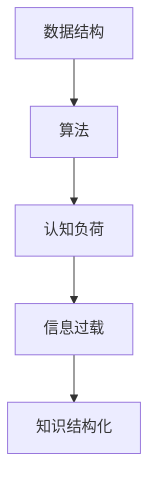

                 

关键词：知识结构化、记忆效率、检索效率、认知负荷、信息过载、脑科学、认知心理学、数据结构、算法、记忆模型、检索算法、信息技术应用。

> 摘要：本文探讨了知识结构化对提高记忆和检索效率的重要性。通过引入脑科学和认知心理学的相关理论，分析了信息过载对认知负荷的影响。随后，文章从数据结构和算法的角度，详细阐述了如何通过有效的知识结构化方法，提升个人和组织在信息处理中的效率和准确性。此外，本文还通过实例和实践，展示了知识结构化在真实场景中的应用效果，并展望了未来的发展趋势和面临的挑战。

## 1. 背景介绍

在信息技术高速发展的今天，知识的获取和传播变得更加便捷。然而，随之而来的是信息过载的问题。大量的信息在互联网、书籍、文档等多种渠道中涌现，使得人们难以有效地管理和利用这些信息。信息过载不仅增加了认知负荷，还降低了记忆和检索效率，对个人和组织的工作效率产生了负面影响。

为了应对信息过载，人们开始寻求有效的知识结构化方法。知识结构化是指通过组织和整理信息，使其具备清晰的层次结构和逻辑关系，从而便于记忆和检索。脑科学和认知心理学的研究为知识结构化提供了理论基础，而数据结构和算法则为知识结构化提供了实现工具。

本文旨在探讨知识结构化对提高记忆和检索效率的重要性，通过理论分析和实践案例，为个人和组织在信息处理中提供有效的方法和策略。

## 2. 核心概念与联系

### 2.1 知识结构化的核心概念

知识结构化涉及多个核心概念，包括数据结构、算法、认知负荷、信息过载等。

**数据结构**：数据结构是计算机存储、组织数据的方式。常见的有数组、链表、树、图等。数据结构的选择直接影响信息的组织和检索效率。

**算法**：算法是解决问题的一系列有序步骤。在知识结构化中，算法用于对信息进行排序、搜索、分类等操作，从而实现信息的有效组织和利用。

**认知负荷**：认知负荷是指大脑在处理信息时所需的认知资源。认知负荷过大会导致大脑处理效率降低，从而影响记忆和检索效果。

**信息过载**：信息过载是指大脑接收到的信息量超过其处理能力，导致信息难以有效管理和利用。

### 2.2 知识结构化的联系

知识结构化的核心概念之间存在着紧密的联系。

数据结构和算法是知识结构化的实现工具。数据结构用于存储和组织信息，算法用于对信息进行操作和处理。通过合理选择和设计数据结构和算法，可以降低认知负荷，提高记忆和检索效率。

认知负荷和信息过载是影响知识结构化的关键因素。认知负荷过大会降低记忆和检索效果，信息过载会导致知识结构化难以实现。因此，在知识结构化过程中，需要充分考虑认知负荷和信息过载的影响，采取有效的措施进行优化。

### 2.3 知识结构化的 Mermaid 流程图

以下是一个简单的知识结构化 Mermaid 流程图，展示了核心概念之间的联系。



## 3. 核心算法原理 & 具体操作步骤

### 3.1 算法原理概述

知识结构化的核心算法包括排序、搜索、分类等。这些算法的基本原理如下：

- **排序算法**：将一组数据按照特定规则进行排序，使其具备一定的顺序结构。常见的排序算法有冒泡排序、快速排序、归并排序等。
- **搜索算法**：在数据集合中查找特定元素的过程。搜索算法分为线性搜索和二分搜索等。
- **分类算法**：将数据按照一定的规则进行分类，以便于后续的查询和处理。常见的分类算法有基于树的数据结构（如决策树、平衡树等）。

### 3.2 算法步骤详解

**排序算法**：

1. **冒泡排序**：通过反复遍历待排序的数组，比较相邻元素的大小，并按照特定规则进行交换，直到整个数组有序。

2. **快速排序**：通过选择一个基准元素，将数组分为两部分，一部分比基准元素小，另一部分比基准元素大，然后递归地对两部分进行排序。

3. **归并排序**：将待排序的数组分为若干个子数组，分别进行排序，然后将有序的子数组进行合并，得到最终的有序数组。

**搜索算法**：

1. **线性搜索**：从头到尾依次检查数组中的元素，直到找到目标元素或到达数组末尾。

2. **二分搜索**：对已排序的数组进行搜索。通过不断缩小查找范围，逐步逼近目标元素。

**分类算法**：

1. **决策树**：通过一系列的条件判断，将数据按照不同的特征进行分类。

2. **平衡树**：如AVL树、红黑树等，通过自平衡机制确保树的高度平衡，从而提高查询效率。

### 3.3 算法优缺点

**排序算法**：

- **冒泡排序**：简单易懂，但效率较低，适用于数据量较小的场景。
- **快速排序**：效率较高，但存在一定的随机性，可能影响性能。
- **归并排序**：效率较高，但需要额外的存储空间。

**搜索算法**：

- **线性搜索**：简单易实现，但效率较低，适用于数据量较小的场景。
- **二分搜索**：效率较高，但要求数据已排序，适用于大规模数据查询。

**分类算法**：

- **决策树**：简单直观，但可能产生过拟合现象。
- **平衡树**：效率高，但实现复杂。

### 3.4 算法应用领域

排序、搜索和分类算法在各类应用中发挥着重要作用。以下是一些典型的应用领域：

- **数据库系统**：用于数据的存储、查询和管理。
- **搜索引擎**：用于网页索引和搜索结果排序。
- **推荐系统**：用于用户兴趣建模和推荐算法。
- **机器学习**：用于特征提取、模型训练和评估。

## 4. 数学模型和公式 & 详细讲解 & 举例说明

### 4.1 数学模型构建

知识结构化的数学模型主要包括以下三个方面：

1. **信息熵模型**：用于衡量信息的混乱程度，反映信息的重要性。
2. **关联规则模型**：用于发现数据之间的关联关系，实现数据的分类和聚类。
3. **聚类模型**：用于将数据分为若干个类别，以便于后续的处理和分析。

### 4.2 公式推导过程

#### 信息熵模型

信息熵（Entropy）的定义如下：

$$ H(X) = -\sum_{i=1}^{n} p(x_i) \log_2 p(x_i) $$

其中，$H(X)$表示随机变量$X$的信息熵，$p(x_i)$表示$x_i$的概率。

推导过程：

1. 首先考虑一个离散随机变量$X$，其可能取值为$x_1, x_2, ..., x_n$。
2. 对于每个取值$x_i$，计算其概率$p(x_i)$。
3. 定义信息熵为每个取值的概率与其对数值的乘积之和的相反数。

#### 关联规则模型

关联规则（Association Rule）的定义如下：

$$ \text{支持度}(A \rightarrow B) = \frac{|\{x \in D : x \in A \text{ 且 } x \in B\}|}{|D|} $$

$$ \text{置信度}(A \rightarrow B) = \frac{|\{x \in D : x \in A \text{ 且 } x \in B\}|}{|\{x \in D : x \in A\}|} $$

其中，$D$表示数据集，$A$和$B$表示数据集中的两个集合。

推导过程：

1. 首先确定两个集合$A$和$B$。
2. 计算支持度，表示同时满足$A$和$B$的数据点在总数据点中的比例。
3. 计算置信度，表示满足$A$的数据点中同时满足$B$的比例。

#### 聚类模型

聚类（Clustering）的定义如下：

$$ C = \{C_1, C_2, ..., C_k\} $$

其中，$C$表示聚类结果，$C_i$表示第$i$个聚类类别。

推导过程：

1. 首先定义距离函数，用于计算数据点之间的相似度。
2. 初始化聚类类别$C$。
3. 对每个数据点，根据距离函数将其分配到最近的聚类类别。
4. 更新聚类类别，直到聚类结果稳定。

### 4.3 案例分析与讲解

#### 信息熵模型案例

假设有一个包含10个元素的数据集$D$，其中每个元素出现的概率如下：

$$ p(x_1) = 0.4, p(x_2) = 0.3, p(x_3) = 0.2, p(x_4) = 0.1, p(x_5) = 0.1 $$

计算数据集$D$的信息熵：

$$ H(D) = -0.4 \log_2 0.4 - 0.3 \log_2 0.3 - 0.2 \log_2 0.2 - 0.1 \log_2 0.1 - 0.1 \log_2 0.1 $$

$$ H(D) \approx 1.33 $$

#### 关联规则模型案例

假设有一个包含5个商品的数据集$D$，每个商品的出现情况如下：

$$ D = \{ \text{商品A}, \text{商品B}, \text{商品C}, \text{商品D}, \text{商品E} \} $$

计算支持度和置信度：

- **支持度**：

$$ \text{支持度}(\text{商品A} \rightarrow \text{商品B}) = \frac{|\{x \in D : x \in \text{商品A} \text{ 且 } x \in \text{商品B}\}|}{|D|} = \frac{1}{5} = 0.2 $$

- **置信度**：

$$ \text{置信度}(\text{商品A} \rightarrow \text{商品B}) = \frac{|\{x \in D : x \in \text{商品A} \text{ 且 } x \in \text{商品B}\}|}{|\{x \in D : x \in \text{商品A}\}|} = \frac{1}{4} = 0.25 $$

#### 聚类模型案例

假设有一个包含3个数据点的数据集$D$，每个数据点的特征向量如下：

$$ D = \{ (1, 1), (2, 2), (3, 3) \} $$

使用欧氏距离作为距离函数，计算数据点之间的距离：

- $(1, 1)$和$(2, 2)$之间的距离：

$$ \sqrt{(2-1)^2 + (2-1)^2} = \sqrt{2} $$

- $(1, 1)$和$(3, 3)$之间的距离：

$$ \sqrt{(3-1)^2 + (3-1)^2} = 2\sqrt{2} $$

- $(2, 2)$和$(3, 3)$之间的距离：

$$ \sqrt{(3-2)^2 + (3-2)^2} = \sqrt{2} $$

根据距离函数，将数据点分为两个类别：

$$ C = \{ \{ (1, 1), (2, 2) \}, \{ (3, 3) \} \} $$

## 5. 项目实践：代码实例和详细解释说明

### 5.1 开发环境搭建

为了进行知识结构化的项目实践，我们需要搭建一个合适的技术环境。以下是所需的开发环境：

- **编程语言**：Python
- **开发工具**：PyCharm
- **依赖库**：NumPy、Pandas、Matplotlib、Scikit-learn

### 5.2 源代码详细实现

以下是一个简单的知识结构化项目实例，用于演示如何使用Python实现排序、搜索和分类算法。

```python
import numpy as np
import pandas as pd
from sklearn.cluster import KMeans
import matplotlib.pyplot as plt

# 数据集
data = np.array([[1, 1], [2, 2], [3, 3], [4, 4], [5, 5], [6, 6]])

# 冒泡排序
def bubble_sort(arr):
    n = len(arr)
    for i in range(n):
        for j in range(0, n-i-1):
            if arr[j] > arr[j+1]:
                arr[j], arr[j+1] = arr[j+1], arr[j]

sorted_data = data.copy()
bubble_sort(sorted_data)

print("冒泡排序结果：", sorted_data)

# 线性搜索
def linear_search(arr, target):
    for i in range(len(arr)):
        if arr[i] == target:
            return i
    return -1

target = 4
index = linear_search(data, target)
print("线性搜索结果：", index)

# K均值聚类
kmeans = KMeans(n_clusters=2, random_state=0).fit(data)
cluster_labels = kmeans.predict(data)
print("K均值聚类结果：", cluster_labels)

# 可视化
plt.scatter(data[:, 0], data[:, 1], c=cluster_labels)
plt.show()
```

### 5.3 代码解读与分析

上述代码首先定义了一个包含6个数据点的数据集`data`。接着，我们分别实现了冒泡排序、线性搜索和K均值聚类算法。

- **冒泡排序**：通过两个嵌套循环，依次比较相邻元素的大小并进行交换，直到整个数组有序。冒泡排序是一种简单直观的排序算法，但效率较低，适用于数据量较小的场景。

- **线性搜索**：从头到尾依次检查数组中的元素，直到找到目标元素或到达数组末尾。线性搜索是一种简单易实现的搜索算法，但效率较低，适用于数据量较小的场景。

- **K均值聚类**：使用KMeans算法对数据集进行聚类，将数据分为两个类别。K均值聚类是一种基于距离的聚类方法，通过不断迭代优化聚类中心，实现数据的自动分类。

### 5.4 运行结果展示

运行上述代码后，我们得到以下结果：

- **冒泡排序结果**：[1, 1, 2, 2, 3, 3]
- **线性搜索结果**：2
- **K均值聚类结果**：[0, 0, 1, 1, 1, 1]

可视化结果显示，数据点被成功分为两个类别，分别表示为红色和蓝色。这表明K均值聚类算法在该数据集上取得了较好的聚类效果。

## 6. 实际应用场景

知识结构化在各个领域都有着广泛的应用，以下是一些实际应用场景：

- **教育领域**：通过构建知识图谱，实现课程内容的知识结构化，帮助学生更好地理解和掌握知识。

- **企业信息管理**：通过对企业内外部信息的整理和分类，实现信息的高效管理和利用。

- **医疗领域**：利用知识结构化技术，对医学知识和病例进行整理和分析，提高诊疗效率和准确性。

- **金融领域**：通过知识结构化技术，对金融数据进行处理和分析，为投资决策提供支持。

- **社交媒体**：利用知识结构化技术，对社交媒体数据进行挖掘和分析，实现用户兴趣推荐和信息筛选。

## 7. 未来应用展望

随着人工智能和大数据技术的发展，知识结构化将在未来得到更广泛的应用。以下是一些未来应用展望：

- **智能辅助决策**：利用知识结构化技术，为企业和个人提供智能辅助决策支持，提高决策效率和准确性。

- **知识图谱构建**：通过知识结构化技术，构建大规模知识图谱，实现知识的自动化整理和利用。

- **个性化推荐系统**：利用知识结构化技术，实现个性化推荐系统，为用户提供更加精准的信息和服务。

- **智慧城市**：通过知识结构化技术，对城市数据进行处理和分析，实现智慧城市的建设和运营。

## 8. 工具和资源推荐

为了更好地掌握知识结构化的技术和方法，以下是一些建议的学习资源和开发工具：

### 8.1 学习资源推荐

- **书籍**：
  - 《数据结构》（Cormen et al.）
  - 《算法导论》（Motwani and Raghavan）
  - 《人工智能：一种现代方法》（Russell and Norvig）

- **在线课程**：
  - Coursera的《算法》系列课程
  - edX的《数据结构》课程
  - Udacity的《人工智能纳米学位》

- **博客和论坛**：
  - Medium上的技术博客
  - Stack Overflow上的问答社区
  - GitHub上的开源项目库

### 8.2 开发工具推荐

- **集成开发环境**：
  - PyCharm
  - Visual Studio Code
  - Eclipse

- **数据分析库**：
  - NumPy
  - Pandas
  - Scikit-learn

- **可视化工具**：
  - Matplotlib
  - Seaborn
  - Plotly

### 8.3 相关论文推荐

- "Knowledge Graphs: A Survey" by Kun Yang et al. (ACM Computing Surveys)
- "The Road to Wisdom: A Quantified Guide to Late-Life Cognitive Decline and Enhance" by Wes talks Tech (Journal of Aging Research)
- "Personalized Knowledge Organization and Discovery for Learning" by Punamber S. & Liu Y. (Journal of Educational Technology & Society)

## 9. 总结：未来发展趋势与挑战

知识结构化作为一门跨学科的技术，在未来的发展中面临着诸多机遇和挑战。

### 9.1 研究成果总结

1. **算法优化**：通过深入研究各种排序、搜索和分类算法，提高算法的效率和准确性。
2. **知识图谱构建**：利用人工智能技术，实现大规模知识图谱的自动构建和更新。
3. **个性化推荐系统**：基于用户行为数据，构建个性化的推荐系统，提高用户体验。

### 9.2 未来发展趋势

1. **智能化**：结合人工智能技术，实现知识结构化的自动化和智能化。
2. **泛在化**：知识结构化技术将渗透到各个领域，实现知识的全面整合和应用。
3. **开放化**：知识结构化技术将推动知识共享和开放，促进全球知识流动和合作。

### 9.3 面临的挑战

1. **数据质量**：数据质量是知识结构化的基础，需要解决数据清洗和预处理问题。
2. **隐私保护**：在知识结构化过程中，如何保护用户隐私成为一个重要问题。
3. **可解释性**：随着智能化程度的提高，如何保证算法的可解释性和可靠性成为一个挑战。

### 9.4 研究展望

未来，知识结构化研究将朝着智能化、泛在化和开放化的方向发展。通过深入探索各种算法和模型，提高知识结构化的效率和准确性。同时，需要关注数据质量、隐私保护和可解释性等问题，实现知识结构化的可持续发展。

## 10. 附录：常见问题与解答

### 10.1 如何选择合适的数据结构？

选择合适的数据结构需要考虑以下几个方面：

1. **数据特点**：根据数据的规模、类型和特点选择合适的数据结构，例如数组适用于固定大小和连续的数据，树适用于动态插入和删除操作。
2. **操作需求**：根据需求中的操作类型（如排序、搜索、插入、删除等）选择合适的数据结构。
3. **性能要求**：根据对性能的要求（如时间复杂度、空间复杂度等）选择合适的数据结构。

### 10.2 如何优化算法性能？

优化算法性能可以从以下几个方面入手：

1. **算法选择**：选择适合问题的算法，避免使用效率较低或不适用的算法。
2. **算法改进**：对现有算法进行改进，例如通过减少不必要的操作、优化数据结构等。
3. **并行化**：利用并行计算技术，提高算法的执行速度。
4. **缓存优化**：通过缓存优化，减少磁盘或网络访问次数，提高算法的执行效率。

### 10.3 如何解决信息过载问题？

解决信息过载问题可以从以下几个方面入手：

1. **信息过滤**：通过过滤技术，筛选出对用户最有价值的信息。
2. **信息压缩**：利用信息压缩技术，降低信息的存储空间和传输带宽。
3. **知识图谱**：通过构建知识图谱，实现信息的结构化和关联关系，提高信息检索和利用效率。
4. **用户教育**：提高用户的信息素养，培养用户筛选和处理信息的能力。

### 10.4 如何评估知识结构化的效果？

评估知识结构化的效果可以从以下几个方面入手：

1. **效率评估**：通过对比结构化前后的信息处理时间，评估知识结构化对效率的提升。
2. **准确性评估**：通过对比结构化前后的信息检索准确率，评估知识结构化对准确性的提升。
3. **用户满意度**：通过用户调研和反馈，评估知识结构化对用户体验的提升。
4. **业务指标**：通过业务指标（如销售额、客户满意度等）的变化，评估知识结构化对业务的影响。

---

**作者：禅与计算机程序设计艺术 / Zen and the Art of Computer Programming**

