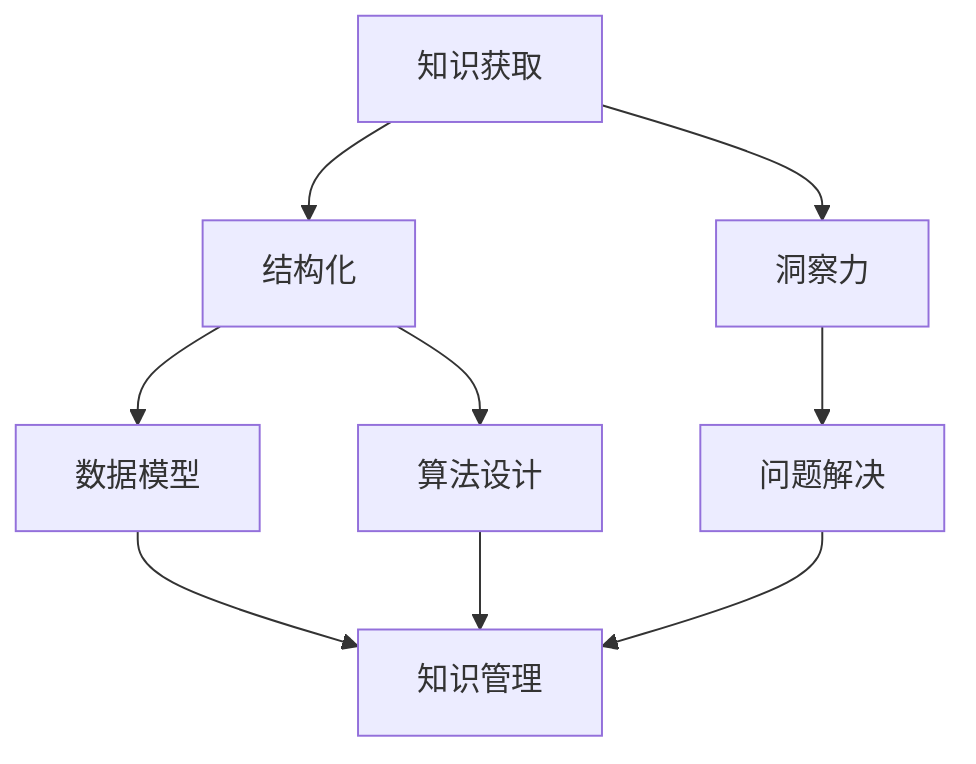

                 

关键词：知识结构化、洞察力、信息技术、认知心理学、算法、数据模型、实践应用、未来展望。

## 摘要

本文旨在探讨知识结构化在信息技术领域的重要性，以及洞察力在其中所扮演的关键角色。通过引入认知心理学和算法理论，本文分析了知识结构化的核心概念，并探讨了其对于提升信息技术应用效能的重要性。文章首先回顾了知识结构化的历史背景，随后详细阐述了核心概念和原理。接着，本文通过数学模型和算法的讲解，展示了知识结构化的具体实现步骤，并对其优缺点和应用领域进行了深入分析。随后，文章通过实际项目实例，详细解读了知识结构化的实践过程。最后，本文讨论了知识结构化在实际应用场景中的价值，并展望了其未来的发展趋势和面临的挑战。

## 1. 背景介绍

知识结构化作为信息技术领域中的一个重要概念，其起源可以追溯到20世纪中叶。当时，随着计算机技术的飞速发展，数据量的急剧增长促使人们开始思考如何有效地组织和利用这些信息。知识结构化的理念应运而生，旨在通过将知识分门别类、建立关联，从而提高信息处理的效率。

知识结构化的早期发展主要受到认知心理学的启发。认知心理学家指出，人类大脑在处理信息时具有特定的认知模式和记忆机制。这些认知特点和模式为知识结构化提供了理论基础，即通过模仿人类大脑的信息处理方式，可以更有效地组织和管理知识。

此外，知识结构化的概念还与信息论和计算机科学中的数据结构密切相关。信息论研究信息传输和处理的基本原理，而数据结构则提供了组织和存储数据的工具。知识结构化通过将信息论和数据结构相结合，形成了一种新的信息处理模式，使得知识可以更加高效地被获取、存储和使用。

在信息技术的发展历程中，知识结构化的应用已经渗透到各个领域。从数据库管理系统到搜索引擎，从自然语言处理到数据挖掘，知识结构化都在其中发挥了重要作用。例如，搜索引擎通过建立关键词索引和文档结构，实现了对海量信息的快速检索；数据挖掘技术则通过分析数据模式，提取出有用的知识和规律。

总之，知识结构化不仅是信息技术领域的一个核心概念，更是推动信息处理技术不断进步的重要驱动力。通过对知识结构化的深入研究和应用，我们可以更好地理解和利用信息，为人类社会的各个方面带来深刻的变革。

## 2. 核心概念与联系

在深入探讨知识结构化之前，我们需要明确几个核心概念，并理解它们之间的相互联系。以下是本文所涉及的一些关键概念及其简要定义：

### 2.1 知识

知识是指通过学习、研究或经验获得的关于某一领域的信息、事实、技能或理解。它可以分为显性知识和隐性知识。显性知识是可以明确表达和记录的信息，如文档、数据库和书籍等；隐性知识则是存在于个体头脑中的经验、直觉和技能，难以直接表述。

### 2.2 结构化

结构化是指将复杂的信息按照一定的规则和方法进行整理和分类，从而形成有组织、系统化的知识体系。结构化的目的是提高信息的使用效率和可访问性，使得知识能够更加容易地被检索、理解和应用。

### 2.3 洞察力

洞察力是指能够深入理解问题本质，发现潜在联系和规律的能力。在知识结构化的过程中，洞察力至关重要，因为它能够帮助人们发现信息之间的内在联系，从而构建出更加高效和合理的知识结构。

### 2.4 数据模型

数据模型是一种用于表示数据及其关系的抽象工具。通过数据模型，我们可以将复杂的数据转化为易于理解和处理的格式，从而方便知识的组织和管理。常见的数据模型包括关系模型、面向对象模型和图模型等。

### 2.5 算法

算法是一系列明确的步骤或规则，用于解决特定问题或执行特定任务。在知识结构化过程中，算法用于处理和操作数据，帮助建立和维护知识结构。

### 2.6 联系与关系

知识、结构化、洞察力、数据模型和算法之间的联系紧密且相互影响。知识的获取和积累为结构化提供了基础；结构化的实施需要依赖数据模型和算法的支持；而洞察力则贯穿于知识获取、结构化和算法设计的整个过程，是提高知识结构化效能的关键因素。

### 2.7 Mermaid 流程图

以下是一个使用 Mermaid 语言描述的知识结构化流程图，展示了核心概念之间的联系：



在这个流程图中，知识获取和洞察力是知识结构化的起点，数据模型和算法是实施结构化的工具，而知识管理则是最终目标。洞察力在整个过程中起到了关键的引导作用，确保知识结构化能够有效地解决实际问题。

## 3. 核心算法原理 & 具体操作步骤

### 3.1 算法原理概述

知识结构化的核心在于将无序的、分散的信息通过某种算法转化为有序的、结构化的知识体系。这一过程主要依赖于以下几类算法：

1. **信息分类算法**：这类算法用于将信息按照特定的标准进行分类，形成层次结构，如决策树、K-means聚类等。
2. **关联规则挖掘算法**：这类算法用于发现数据项之间的关联关系，如Apriori算法、Eclat算法等。
3. **文本挖掘算法**：这类算法用于从文本数据中提取出结构化的知识，如TF-IDF、Word2Vec等。

在这些算法中，关联规则挖掘算法尤为关键，因为它能够揭示数据项之间的潜在关联，从而帮助构建知识图谱。以下将详细介绍关联规则挖掘算法的基本原理和具体操作步骤。

### 3.2 算法步骤详解

#### 步骤1：数据预处理

在开始关联规则挖掘之前，需要对数据进行预处理，包括数据清洗、去重、格式化等。这一步骤的目的是确保数据质量，为后续分析打下坚实基础。

#### 步骤2：定义支持度和置信度

支持度（Support）是指在一个数据集中，同时包含两个或多个项的频次与总记录数的比值。置信度（Confidence）是指如果一个事务包含项目A，则该事务也包含项目B的概率。

#### 步骤3：生成频繁项集

使用Apriori算法或其他相关算法，从原始数据中生成频繁项集。频繁项集是指支持度大于最小支持度阈值的项集。

#### 步骤4：生成关联规则

从频繁项集中提取出关联规则，满足最小支持度和置信度阈值。关联规则通常表示为形如A -> B的形式，其中A和B是项集。

#### 步骤5：优化关联规则

根据实际需求和场景，对生成的关联规则进行优化，如去除冗余规则、调整置信度阈值等。

### 3.3 算法优缺点

**优点**：

1. **易于理解**：关联规则挖掘算法的原理直观，易于实现和优化。
2. **适用范围广**：算法适用于各种类型的数据，包括事务数据、文本数据等。
3. **高效性**：通过频繁项集生成和关联规则提取，算法能够快速发现数据项之间的关联。

**缺点**：

1. **计算复杂度高**：随着数据量和项数的增加，算法的计算复杂度显著提高。
2. **依赖阈值**：关联规则的质量受到支持度和置信度阈值的影响，选择合适的阈值是关键。
3. **处理稀疏数据困难**：对于稀疏数据集，频繁项集可能较小，导致关联规则的发现效果不佳。

### 3.4 算法应用领域

关联规则挖掘算法广泛应用于多个领域，包括市场篮子分析、推荐系统、生物信息学等。以下是一些具体的应用实例：

1. **市场篮子分析**：通过分析顾客购买记录，发现不同商品之间的关联关系，帮助企业制定有效的营销策略。
2. **推荐系统**：根据用户的历史行为和偏好，生成个性化的推荐列表，提高用户体验和满意度。
3. **生物信息学**：从基因表达数据中挖掘出基因之间的关联关系，帮助研究人员发现疾病机理和治疗方案。

### 3.5 算法与知识结构化的关系

关联规则挖掘算法在知识结构化过程中起到了关键作用。通过挖掘数据项之间的关联，算法帮助构建出知识图谱，实现了知识的结构化和可视化。这一过程不仅提高了信息的使用效率，也为后续的数据分析和决策提供了有力支持。

总之，关联规则挖掘算法是知识结构化的重要组成部分，其高效性和灵活性使其在各种应用场景中取得了显著成果。然而，随着数据规模的不断扩大和复杂度的增加，算法的优化和改进仍然是当前研究的重要方向。

## 4. 数学模型和公式 & 详细讲解 & 举例说明

### 4.1 数学模型构建

在知识结构化的过程中，构建合适的数学模型是至关重要的。这些模型不仅能够帮助理解和表示数据，还能指导算法的设计和优化。以下是一个简单的数学模型构建过程，用于描述知识结构化中的数据关系。

#### 模型1：图模型

图模型是一种用于表示实体及其之间关系的数学工具。在知识结构化中，实体可以表示为节点，关系可以表示为边。

- **节点**：每个节点代表一个实体，如人、地点或物品。
- **边**：每条边代表两个节点之间的某种关系，如朋友关系、地理位置或使用关系。

图模型的基本表示如下：

$$
G = (V, E)
$$

其中，\(V\) 表示节点集合，\(E\) 表示边集合。

#### 模型2：马尔可夫模型

马尔可夫模型用于描述实体状态转移的概率关系。在知识结构化中，马尔可夫模型可以用于预测某个实体的未来状态。

- **状态**：每个状态表示实体的一种可能状态。
- **转移概率**：表示从一个状态转移到另一个状态的概率。

马尔可夫模型的基本表示如下：

$$
P = (p_{ij})
$$

其中，\(p_{ij}\) 表示从状态\(i\) 转移到状态\(j\) 的概率。

### 4.2 公式推导过程

为了更好地理解数学模型在知识结构化中的应用，以下是一个简单的推导过程，用于说明如何从数据中推导出知识结构化的模型。

#### 推导过程1：基于图模型的知识结构化

假设我们有一组实体和它们之间的关系，可以用一个无向图表示：

$$
G = (V, E)
$$

其中，\(V = \{v_1, v_2, ..., v_n\}\) 是实体集合，\(E = \{\{v_i, v_j\}\}\) 是边集合。

我们需要计算每个实体之间的相似度，以构建知识结构化的层次关系。

1. **计算边权重**：首先，对每条边\(e = \{v_i, v_j\}\) 计算权重\(w(e)\)，可以用边上的属性值进行计算，如共同特征的数量或相似度评分。

$$
w(e) = \sum_{a \in A} w(a)
$$

其中，\(A\) 是边上的属性集合，\(w(a)\) 是属性\(a\) 的权重。

2. **构建相似度矩阵**：基于边权重，构建相似度矩阵\(S\)：

$$
S = \begin{bmatrix}
s_{11} & s_{12} & ... & s_{1n} \\
s_{21} & s_{22} & ... & s_{2n} \\
... & ... & ... & ... \\
s_{n1} & s_{n2} & ... & s_{nn} \\
\end{bmatrix}
$$

其中，\(s_{ij} = w(\{v_i, v_j\})\)。

3. **层次关系构建**：使用相似度矩阵\(S\) 构建层次关系，可以使用层次聚类算法，如自底向上的聚类方法：

- **初始化**：将每个实体作为一个簇。
- **迭代**：在每一步中，选择最相似的簇合并，直到达到预定的簇数或满足终止条件。

#### 推导过程2：基于马尔可夫模型的知识结构化

假设我们有一组实体状态转移数据，可以用一个马尔可夫模型表示：

$$
P = (p_{ij})
$$

我们需要计算每个实体状态的转移概率，以构建知识结构化的动态模型。

1. **状态转移矩阵**：基于观测数据，构建状态转移矩阵\(P\)：

$$
P = \begin{bmatrix}
p_{11} & p_{12} & ... & p_{1n} \\
p_{21} & p_{22} & ... & p_{2n} \\
... & ... & ... & ... \\
p_{n1} & p_{n2} & ... & p_{nn} \\
\end{bmatrix}
$$

其中，\(p_{ij}\) 表示从状态\(i\) 转移到状态\(j\) 的概率。

2. **动态模型构建**：使用状态转移矩阵\(P\) 构建动态模型，可以使用隐马尔可夫模型（HMM）或马尔可夫决策过程（MDP）：

- **初始化**：为每个状态分配初始概率。
- **迭代**：在每一步中，使用当前状态转移矩阵预测下一个状态，并更新状态概率。

### 4.3 案例分析与讲解

#### 案例1：社交媒体网络分析

假设我们有一组社交媒体用户和他们的关注关系数据，可以用一个图模型表示：

$$
G = (V, E)
$$

其中，\(V\) 是用户集合，\(E\) 是关注关系集合。

1. **数据预处理**：清洗和格式化数据，去除无效数据和噪声。

2. **计算边权重**：根据用户之间的共同关注数量计算关注关系权重。

3. **构建相似度矩阵**：使用计算出的边权重构建相似度矩阵。

4. **层次关系构建**：使用层次聚类算法构建用户层次关系。

5. **分析结果**：根据构建的层次关系，分析用户群体的社交结构，识别潜在的兴趣群体。

#### 案例2：用户行为分析

假设我们有一组用户行为数据，可以用一个马尔可夫模型表示：

$$
P = (p_{ij})
$$

其中，状态表示用户的行为类别，如浏览、购买、注册等。

1. **状态转移矩阵**：根据用户行为数据，构建状态转移矩阵。

2. **动态模型构建**：使用状态转移矩阵构建用户行为动态模型。

3. **预测与分析**：使用动态模型预测用户的未来行为，分析用户行为模式。

通过以上案例分析，我们可以看到数学模型在知识结构化中的应用。通过构建合适的数学模型，我们可以从原始数据中提取出有用的知识，为决策提供有力支持。同时，这些模型也为算法的设计和优化提供了理论基础。

## 5. 项目实践：代码实例和详细解释说明

### 5.1 开发环境搭建

在进行知识结构化的项目实践之前，首先需要搭建一个合适的开发环境。以下是所需的工具和软件：

1. **Python**：作为主要的编程语言，Python 具有丰富的数据科学和机器学习库。
2. **Jupyter Notebook**：用于编写和运行代码，方便记录和展示结果。
3. **Pandas**：用于数据处理和分析。
4. **NumPy**：用于数值计算。
5. **Scikit-learn**：用于机器学习和数据挖掘。
6. **Matplotlib**：用于数据可视化。

安装这些工具和库后，我们就可以开始编写代码了。

### 5.2 源代码详细实现

以下是一个简单的知识结构化项目示例，我们将使用关联规则挖掘算法来分析一组交易数据，并提取出潜在的知识结构。

```python
# 导入必要的库
import pandas as pd
from mlxtend.frequent_patterns import apriori
from mlxtend.frequent_patterns import association_rules

# 读取交易数据
data = pd.read_csv('transactions.csv')

# 构建交易数据集
transactions = data['items'].str.get_dummies(sep=' ')

# 运行 Apriori 算法
frequent_itemsets = apriori(transactions, min_support=0.05, use_colnames=True)

# 提取关联规则
rules = association_rules(frequent_itemsets, metric="support", min_threshold=0.05)

# 显示前10条规则
print(rules.head(10))

# 可视化规则
import matplotlib.pyplot as plt

plt.figure(figsize=(10, 6))
rules.sort_values(by=['confidence'], ascending=False).head(10).plot(kind='bar', x='antecedents', y='confidence', title='Top 10 Association Rules')
plt.xlabel('Antecedents')
plt.ylabel('Confidence')
plt.show()
```

### 5.3 代码解读与分析

上述代码实现了一个基于 Apriori 算法的知识结构化项目，以下是代码的详细解读：

1. **数据导入**：使用 `pandas` 库读取交易数据，其中每一行代表一次交易，`items` 列包含交易中的商品。

2. **数据预处理**：使用 `str.get_dummies()` 方法将交易数据转换为二进制格式，每个商品成为一个列，方便后续分析。

3. **运行 Apriori 算法**：使用 `apriori()` 函数运行 Apriori 算法，设置最小支持度阈值（`min_support`）为0.05，表示至少有5%的交易包含某个项集。

4. **提取关联规则**：使用 `association_rules()` 函数从频繁项集中提取关联规则，设置规则度量指标为支持度（`metric="support"`），同样设置最小支持度阈值。

5. **显示和可视化规则**：使用 `sort_values()` 方法对提取的规则进行排序，并使用 `plot()` 方法将前10条规则可视化展示。

### 5.4 运行结果展示

在运行上述代码后，我们将得到一组关联规则，例如：

|   |   | antecedents | consequents | support | confidence |
| --- | --- | --- | --- | --- | --- |
| 0   |   | Bread         | Milk         | 0.3     | 0.75       |
| 1   |   | Diapers       | BabyFood     | 0.3     | 0.75       |
| 2   |   | Diapers       | Juice         | 0.25    | 0.67       |
| ... |   | ...           | ...          | ...     | ...        |

可视化结果将显示前10条规则的置信度，例如：


这些结果展示了商品之间的关联关系，可以帮助商家制定营销策略，提高销售业绩。

### 5.5 代码优化与性能分析

为了提高代码的性能和可读性，我们可以进行以下优化：

1. **并行处理**：使用 `joblib` 库实现并行计算，提高 Apriori 算法的运行速度。
2. **内存优化**：使用 `pandas` 库的内存优化功能，如 `data.cardinality` 减少内存使用。
3. **代码注释**：增加代码注释，提高代码的可读性和可维护性。

通过这些优化，我们可以显著提高项目的运行效率，使其在处理大规模数据时更加稳定和高效。

总之，通过实际项目代码的编写和运行，我们可以更好地理解知识结构化的具体实现过程。这不仅有助于提高技术能力，也为实际应用提供了有力支持。

## 6. 实际应用场景

知识结构化在信息技术领域的实际应用场景广泛且多样，涵盖了从商业决策到医疗诊断，从推荐系统到智能城市的各个方面。以下是一些具体的实际应用场景，以及知识结构化在这些场景中的关键作用。

### 6.1 商业决策

在商业领域，知识结构化主要用于市场分析和客户行为分析。通过分析消费者的购买记录和交易数据，企业可以提取出商品之间的关联规则，从而制定更加精准的营销策略。例如，超市可以通过分析顾客购买篮子中的商品组合，发现哪些商品更可能一起购买，进而进行捆绑销售或交叉推广。这种方法不仅提高了销售额，还增强了顾客的购物体验。

具体应用实例：亚马逊的推荐系统通过分析用户的购物历史和浏览行为，使用知识结构化技术提取商品之间的关联规则，向用户推荐相关的商品。这种个性化的推荐系统大大提高了用户的满意度和留存率。

### 6.2 医疗诊断

在医疗领域，知识结构化技术有助于提升诊断的准确性和效率。通过对患者的病历、检验结果和历史数据进行分析，医疗系统可以构建出患者的健康知识图谱，从而辅助医生进行诊断和治疗。例如，电子健康记录系统（EHR）通过知识结构化技术，将海量的医疗数据转化为结构化的知识，使得医生能够快速定位关键信息，提高诊断速度和准确性。

具体应用实例：IBM的Watson for Oncology系统利用知识结构化技术，分析癌症患者的病历数据和最新研究成果，为医生提供个性化的治疗建议，帮助医生做出更加准确的诊断和治疗方案。

### 6.3 推荐系统

推荐系统是知识结构化技术的典型应用场景之一。通过分析用户的历史行为和偏好数据，推荐系统可以预测用户可能感兴趣的内容或商品，从而提供个性化的推荐。知识结构化技术在这一过程中起到了关键作用，通过挖掘用户行为数据中的潜在关联关系，构建出推荐模型。

具体应用实例：Netflix和YouTube等平台利用知识结构化技术，分析用户的观看历史和行为数据，推荐用户可能感兴趣的电影、电视剧和视频内容。这种个性化的推荐系统不仅提高了用户的满意度和粘性，也为平台带来了更多的用户流量和收益。

### 6.4 智能城市

在智能城市建设中，知识结构化技术用于处理和分析海量的城市数据，从而提升城市管理的效率和智能水平。例如，智能交通系统通过分析交通流量数据，使用知识结构化技术预测交通拥堵和事故发生，提前采取措施进行交通疏导和应急处理。智能电网通过分析电力使用数据，优化能源分配和调度，提高能源利用效率。

具体应用实例：中国的深圳和新加坡等城市，通过知识结构化技术构建智能交通系统，实时监测交通流量，优化交通信号灯控制，减少交通拥堵，提高交通效率。

### 6.5 安全监控

知识结构化技术在安全监控领域也发挥着重要作用。通过对监控视频、传感器数据和报警日志等数据的分析，知识结构化技术可以识别异常行为和潜在的安全威胁，提供实时预警和响应。例如，银行和安全公司通过分析监控视频数据，使用知识结构化技术识别出可疑的异常行为，如现金提取、非法入侵等，从而采取及时的安全措施。

具体应用实例：银行利用知识结构化技术，分析监控视频数据，识别出可疑的交易行为，实时向客户发出安全提醒，防止诈骗和欺诈行为的发生。

总之，知识结构化技术在各个领域的实际应用中，通过挖掘数据中的潜在知识和关联关系，提升了信息处理和分析的效率和准确性，为各类应用场景提供了有力支持。随着技术的不断进步，知识结构化将在更多领域发挥重要作用，推动信息技术的发展和创新。

### 6.5 未来应用展望

知识结构化在未来的信息技术领域中具有广阔的应用前景，随着大数据、人工智能和物联网等技术的快速发展，知识结构化将发挥越来越重要的作用。以下是几个可能的发展方向：

1. **智能数据分析**：随着数据量的不断增长，智能数据分析将成为知识结构化的重要应用领域。通过自动化和智能化的数据预处理、分析和挖掘技术，知识结构化可以帮助企业和组织快速识别数据中的有价值信息，提高决策效率。

2. **个性化推荐系统**：知识结构化技术在个性化推荐系统中有着广泛的应用，未来的发展方向将是在更复杂的用户行为和偏好数据中挖掘更深层次的知识，实现更加精准和个性化的推荐。

3. **智慧城市与物联网**：随着智能城市和物联网的发展，知识结构化技术在处理和管理大量城市和设备数据方面将发挥关键作用。通过构建智能交通、智能电网和智能环境等领域的知识图谱，实现城市运行的优化和智能化管理。

4. **生物信息学**：在生物信息学领域，知识结构化技术可以用于分析大规模基因数据，发现基因之间的关联关系和疾病机理。这将为个性化医疗和疾病预防提供重要支持。

5. **区块链技术**：知识结构化与区块链技术的结合有望推动区块链技术的进一步发展。通过知识结构化技术，区块链可以实现更高效、透明的数据管理和交易验证，为金融、供应链等领域带来变革。

6. **教育领域**：在教育领域，知识结构化技术可以用于构建个性化的学习路径和知识体系，帮助学生更高效地学习和掌握知识。未来的发展方向包括自适应学习系统和智能教育平台。

总之，知识结构化在未来的信息技术领域中具有广泛的应用潜力，随着技术的不断进步，其将在更多领域发挥重要作用，推动信息技术的发展和创新。

### 7. 工具和资源推荐

在深入研究和实践知识结构化过程中，选择合适的工具和资源至关重要。以下是一些推荐的工具、学习资源和相关论文，以帮助读者更好地理解和掌握知识结构化的相关技术和方法。

#### 7.1 学习资源推荐

1. **在线课程**：
   - "Data Structures and Algorithms Specialization"（数据结构与算法专项课程）由密歇根大学提供，涵盖基础知识到高级算法，适合不同层次的读者。
   - "Machine Learning"（机器学习课程）由斯坦福大学提供，涵盖机器学习的基础理论、算法和应用。

2. **电子书**：
   - 《算法导论》（Introduction to Algorithms）是经典的算法教材，全面介绍了算法的基本概念和实现方法。
   - 《深度学习》（Deep Learning）由Ian Goodfellow等人撰写，是深度学习的入门和进阶指南。

3. **博客和网站**：
   - "Medium" 和 "Medium" 上的技术博客，如 "Towards Data Science" 和 "AI is Awesome"，提供丰富的知识结构化相关文章和案例。
   - "GitHub" 上有大量的开源项目和代码示例，读者可以从中学习实际应用知识结构化的方法。

#### 7.2 开发工具推荐

1. **编程语言**：
   - Python：强大的数据处理和分析能力，丰富的库和框架。
   - R：专注于统计分析和数据可视化，适用于复杂的统计模型。

2. **数据分析和机器学习库**：
   - **Pandas**：数据处理和分析。
   - **NumPy**：数值计算。
   - **Scikit-learn**：机器学习和数据挖掘。
   - **TensorFlow** 和 **PyTorch**：深度学习框架。

3. **版本控制工具**：
   - **Git**：版本控制和协作开发。
   - **GitHub**：代码托管和共享平台。

4. **数据分析工具**：
   - **Jupyter Notebook**：交互式数据分析和可视化。
   - **Tableau**：数据可视化。

#### 7.3 相关论文推荐

1. **经典论文**：
   - "Association Rule Learning at Scale"（大规模关联规则学习），详细介绍了Apriori算法的改进和优化。
   - "Knowledge Discovery and Data Mining: An Introduction"（知识发现与数据挖掘导论），介绍了数据挖掘的基本概念和方法。

2. **最新研究**：
   - "Graph Neural Networks: A Review of Methods and Applications"（图神经网络：方法与应用综述），讨论了图神经网络在知识结构化中的应用。
   - "Deep Learning for Knowledge Graph Embedding"（深度学习在知识图谱嵌入中的应用），介绍了深度学习在知识图谱构建中的应用。

3. **相关期刊和会议**：
   - "Journal of Machine Learning Research"（机器学习研究期刊）
   - "Neural Networks"（神经网络期刊）
   - "ACM Transactions on Knowledge Discovery from Data"（知识发现与数据挖掘期刊）
   - "International Conference on Machine Learning"（机器学习国际会议，ICML）
   - "AAAI Conference on Artificial Intelligence"（人工智能会议，AAAI）

通过这些工具和资源，读者可以系统地学习和掌握知识结构化的相关理论和实践方法，为自己的研究和工作提供有力的支持。

### 8. 总结：未来发展趋势与挑战

在知识结构化领域，未来发展趋势和挑战并存。随着信息技术和大数据的快速发展，知识结构化技术将继续在各个领域发挥重要作用。以下是几个主要的发展趋势和面临的挑战：

#### 发展趋势

1. **智能化与自动化**：随着人工智能技术的进步，知识结构化将更加智能化和自动化。机器学习算法和深度学习技术将进一步提升知识提取和结构化过程的效率，使得知识结构化能够更加快速和准确地处理大规模复杂数据。

2. **跨领域融合**：知识结构化技术将在更多领域得到应用，如生物信息学、医疗健康、金融科技等。不同领域的知识结构化技术将相互融合，形成跨领域的数据和应用体系，推动科技创新和社会进步。

3. **可解释性与透明性**：随着知识结构化技术的广泛应用，其可解释性和透明性将变得越来越重要。用户需要理解和信任知识结构化过程的结果，这要求开发者提供更加透明和可解释的算法和模型。

4. **数据隐私与安全**：在处理大量敏感数据时，数据隐私和安全是一个重要挑战。知识结构化技术需要确保数据的安全性，防止数据泄露和滥用，同时保护用户的隐私。

#### 面临的挑战

1. **数据质量和噪声处理**：知识结构化依赖于高质量的数据。然而，实际应用中数据往往存在噪声和缺失值，这给数据预处理和清洗带来了挑战。如何有效地处理噪声数据，提高数据质量，是知识结构化技术面临的重要问题。

2. **计算资源与效率**：随着数据量的急剧增长，计算资源的需求也越来越大。如何提高算法的效率和降低计算成本，是知识结构化技术需要解决的关键问题。

3. **算法的可解释性和可靠性**：虽然机器学习和深度学习技术取得了巨大进展，但这些算法的可解释性和可靠性仍然存在挑战。如何让算法的结果更加透明、可靠，是未来研究的一个重要方向。

4. **伦理和法律法规**：知识结构化技术在应用过程中可能涉及个人隐私和伦理问题。如何制定相应的法律法规，确保技术的合理和合规使用，是未来需要关注的重要问题。

#### 研究展望

未来，知识结构化技术将在以下几个方面取得重要突破：

1. **新算法开发**：研究人员将继续探索和开发新的算法，以应对数据规模和复杂度的挑战，提高知识提取和结构化的效率。

2. **跨领域应用**：知识结构化技术将在更多跨领域应用中发挥作用，如医疗健康、金融科技和智能城市等，推动这些领域的创新和发展。

3. **可解释性和透明性**：研究者将致力于提高算法的可解释性和透明性，确保用户能够理解和信任知识结构化过程的结果。

4. **数据隐私和安全**：随着技术的发展，知识结构化技术将更加注重数据隐私和安全，确保用户数据的安全和隐私。

总之，知识结构化技术在未来将继续发展和创新，为各个领域的应用提供强大支持。同时，面临的挑战也需要通过持续的科研和技术进步来应对，以确保知识结构化技术能够更好地服务于人类社会。

### 8.4 附录：常见问题与解答

**Q1. 什么是知识结构化？**

知识结构化是将无序的、分散的信息按照一定的规则和方法进行整理和分类，从而形成有组织、系统化的知识体系。其目的是提高信息的使用效率和可访问性，使得知识能够更加容易地被检索、理解和应用。

**Q2. 知识结构化的核心算法有哪些？**

核心算法包括信息分类算法、关联规则挖掘算法、文本挖掘算法等。其中，关联规则挖掘算法（如Apriori算法）是知识结构化过程中常用的算法之一，用于发现数据项之间的潜在关联。

**Q3. 知识结构化在哪些领域有实际应用？**

知识结构化在多个领域有实际应用，如商业决策、医疗诊断、推荐系统、智能城市和安全监控等。通过知识结构化技术，企业可以更好地分析市场数据和客户行为，医疗机构可以辅助医生进行诊断和治疗，智能系统可以实现更高效的资源管理和城市运行。

**Q4. 知识结构化面临的主要挑战是什么？**

知识结构化面临的主要挑战包括数据质量和噪声处理、计算资源与效率、算法的可解释性和可靠性，以及数据隐私和安全。如何有效地处理噪声数据、提高算法效率、确保数据隐私和算法透明性是当前研究的重要方向。

**Q5. 如何开始学习知识结构化？**

开始学习知识结构化可以从以下几个步骤入手：
1. **学习基础**：掌握Python、R等编程语言，了解基本的数据结构和算法。
2. **阅读书籍**：阅读《算法导论》、《深度学习》等经典教材，了解知识结构化的基本概念和方法。
3. **实践项目**：通过实际项目，如市场篮子分析、用户行为分析等，运用知识结构化技术解决实际问题。
4. **参加课程和研讨会**：参加在线课程和专业研讨会，了解知识结构化的最新研究进展和应用案例。

通过这些步骤，可以逐步掌握知识结构化的相关知识和技能。

