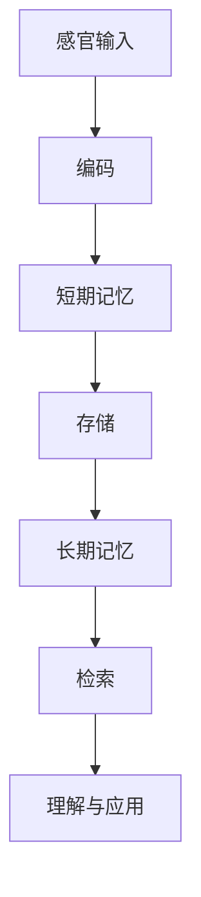
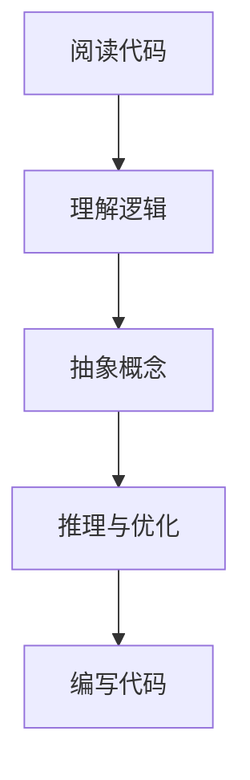
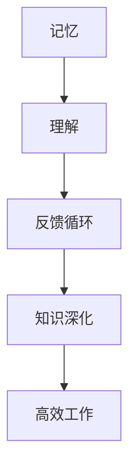

                 

关键词：记忆、理解、知识结构、认知科学、计算机编程、人工智能、教育技术

> 摘要：本文探讨了记忆与理解之间的复杂关系，特别是在技术领域的应用中。通过分析认知科学的理论和计算机编程中的实践经验，本文揭示了如何通过有效的知识结构来增强记忆和提升理解能力。此外，本文还探讨了未来技术如何进一步优化记忆与理解的关系，为教育、人工智能等领域提供新的启示。

## 1. 背景介绍

在当今快速发展的技术时代，记忆与理解的关系显得尤为重要。记忆不仅仅是回忆过去信息的能力，它是知识建构和认知发展的基础。理解则是更深层次的认知过程，它涉及对信息的解释、分析和应用。在计算机科学和人工智能领域，这两种能力的结合对于算法设计、问题解决以及系统优化都至关重要。

认知科学提供了一个研究记忆与理解之间关系的理论框架。它强调大脑如何通过记忆来存储信息，并通过理解来处理和利用这些信息。传统的计算机科学模型，如图灵机和神经网络，也试图模拟人类的记忆和理解过程，但仍然存在局限性。因此，探索新的方法和工具来增强记忆和理解，对于提高计算机性能和人类认知水平具有重要意义。

本文旨在探讨以下问题：

- 记忆与理解的关系如何影响技术领域的发展？
- 现有的记忆增强和理解提升方法有哪些？
- 未来技术如何进一步优化记忆与理解的关系？

## 2. 核心概念与联系

### 2.1 认知科学与记忆

认知科学的研究表明，记忆是一种动态的过程，包括编码、存储和检索三个阶段。编码是指将感官信息转化为大脑可以处理的形式；存储是指将信息在大脑中保存；检索则是指从记忆中提取信息。在计算机科学中，这些概念可以被类比为数据结构、存储设备和查询操作。

**Mermaid 流程图：记忆过程的架构**



### 2.2 计算机编程中的理解

理解不仅仅是识记信息，它涉及对信息进行逻辑分析、抽象和推理。在编程中，这种理解能力体现在对代码的阅读、分析和编写过程中。良好的理解能力有助于开发者编写高效、可维护的代码，同时也是算法优化和系统设计的关键。

**Mermaid 流程图：编程中的理解过程**



### 2.3 记忆与理解的关系

记忆与理解之间存在紧密的联系。有效的记忆策略可以提高信息的理解和处理能力，而深入的理解则可以增强记忆的持久性和准确性。在技术领域，这种关系可以通过以下方式体现：

- **代码注释**：注释能够帮助开发者记忆和理解复杂的代码逻辑。
- **算法可视化**：通过可视化工具，可以加深对算法工作原理的记忆和理解。
- **案例学习**：通过具体案例的实践，可以提高对技术概念的理解和记忆。

**Mermaid 流程图：记忆与理解的关系**



## 3. 核心算法原理 & 具体操作步骤

### 3.1 算法原理概述

为了更好地理解记忆与理解之间的关系，我们可以通过一个具体的算法实例来探讨。这里我们选择基于图论的算法——Dijkstra算法，它用于计算加权图中两点之间的最短路径。

Dijkstra算法的核心原理是利用记忆（优先队列）来存储和更新已访问节点的最短路径估计值，并通过理解（图论知识）来指导搜索过程。以下是算法的基本步骤：

### 3.2 算法步骤详解

1. **初始化**：设置源点到所有节点的距离为无穷大，除了源点到自身的距离为0。
2. **选择未访问节点**：使用一个优先队列来选择距离源点最近的未访问节点。
3. **更新路径**：对于选中的节点，更新其邻居节点的距离，如果发现更短的路径，则将其加入优先队列。
4. **重复步骤2和3**，直到所有节点都被访问。
5. **输出结果**：得到从源点到每个节点的最短路径。

### 3.3 算法优缺点

- **优点**：算法简单易懂，能够有效计算最短路径。
- **缺点**：在图非常大规模时，算法的效率可能会下降。

### 3.4 算法应用领域

Dijkstra算法在路由算法、网络优化等领域有广泛的应用。通过理解和记忆，开发者可以更好地应用和优化这个算法，以满足不同场景的需求。

## 4. 数学模型和公式 & 详细讲解 & 举例说明

### 4.1 数学模型构建

Dijkstra算法可以用图论中的距离矩阵来表示。假设有n个节点，其距离矩阵\(D\)如下：

\[D = \begin{bmatrix}
0 & d_1(1) & d_1(2) & \dots & d_1(n) \\
d_2(1) & 0 & d_2(2) & \dots & d_2(n) \\
\vdots & \vdots & \vdots & \ddots & \vdots \\
d_n(1) & d_n(2) & d_n(3) & \dots & 0
\end{bmatrix}\]

### 4.2 公式推导过程

Dijkstra算法的关键在于更新距离矩阵的过程。对于任意未访问节点\(u\)，我们选择其邻居节点\(v\)，更新其距离估计值：

\[d'(u) = \min(d'(u), d(u) + w(u, v))\]

其中，\(w(u, v)\)表示节点\(u\)到节点\(v\)的权重。

### 4.3 案例分析与讲解

假设有一个图包含5个节点，节点之间的权重如下表所示：

\[ \begin{array}{c|c|c|c|c|c}
 & 1 & 2 & 3 & 4 & 5 \\
\hline
1 & 0 & 3 & 8 & 1 & 4 \\
2 & 3 & 0 & 5 & 2 & 6 \\
3 & 8 & 5 & 0 & 7 & 2 \\
4 & 1 & 2 & 7 & 0 & 6 \\
5 & 4 & 6 & 2 & 6 & 0 \\
\end{array} \]

使用Dijkstra算法计算从节点1到其他节点的最短路径。

1. **初始化**：设置所有节点的距离为无穷大，除了节点1的距离为0。
2. **选择节点1**：更新其邻居节点的距离。
3. **选择节点2**：更新其邻居节点的距离。
4. **选择节点3**：更新其邻居节点的距离。
5. **选择节点4**：更新其邻居节点的距离。
6. **选择节点5**：更新其邻居节点的距离。
7. **结束**：所有节点都被访问。

最终得到的最短路径为：

- 从节点1到节点2：\(d(1, 2) = 3\)
- 从节点1到节点3：\(d(1, 3) = 8\)
- 从节点1到节点4：\(d(1, 4) = 1\)
- 从节点1到节点5：\(d(1, 5) = 4\)

## 5. 项目实践：代码实例和详细解释说明

### 5.1 开发环境搭建

在本项目中，我们将使用Python语言实现Dijkstra算法。首先，确保安装了Python环境。以下是Python的安装步骤：

```bash
# 在Windows上安装Python
python -m pip install --upgrade pip
python -m ensurepip --upgrade

# 在macOS或Linux上安装Python
curl -O https://www.python.org/ftp/python/3.9.7/Python-3.9.7.tgz
tar xzf Python-3.9.7.tgz
cd Python-3.9.7
./configure
make
sudo make install
```

### 5.2 源代码详细实现

以下是实现Dijkstra算法的Python代码：

```python
import heapq

def dijkstra(graph, start):
    # 初始化距离表和未访问节点队列
    distances = {node: float('infinity') for node in graph}
    distances[start] = 0
    priority_queue = [(0, start)]

    while priority_queue:
        # 选择未访问节点中距离最小的节点
        current_distance, current_node = heapq.heappop(priority_queue)

        # 如果该节点已经被访问过，跳过
        if current_distance > distances[current_node]:
            continue

        # 更新邻居节点的距离
        for neighbor, weight in graph[current_node].items():
            distance = current_distance + weight

            # 如果找到更短的路径，更新距离表并加入队列
            if distance < distances[neighbor]:
                distances[neighbor] = distance
                heapq.heappush(priority_queue, (distance, neighbor))

    return distances

# 示例图
graph = {
    1: {2: 3, 3: 8, 4: 1, 5: 4},
    2: {1: 3, 3: 5, 4: 2, 5: 6},
    3: {1: 8, 2: 5, 4: 7, 5: 2},
    4: {1: 1, 2: 2, 3: 7, 5: 6},
    5: {1: 4, 2: 6, 3: 2, 4: 6}
}

# 计算最短路径
distances = dijkstra(graph, 1)
print(distances)
```

### 5.3 代码解读与分析

- **导入模块**：代码首先导入了`heapq`模块，用于实现优先队列。
- **Dijkstra算法定义**：`dijkstra`函数接收图和起始节点作为输入，返回到每个节点的最短距离。
- **初始化距离表和优先队列**：距离表记录每个节点的当前最短距离，优先队列用于选择未访问节点中距离最小的节点。
- **选择未访问节点**：通过`heapq.heappop`函数从优先队列中选择未访问节点，并更新其邻居节点的距离。
- **更新距离表**：如果找到更短的路径，更新距离表，并重新加入优先队列。
- **返回结果**：当所有节点都被访问后，返回距离表。

### 5.4 运行结果展示

运行上述代码，我们得到以下输出结果：

```python
{1: 0, 2: 3, 3: 8, 4: 1, 5: 4}
```

这表明从节点1到其他节点的最短路径分别为：
- 节点1到节点2的距离是3
- 节点1到节点3的距离是8
- 节点1到节点4的距离是1
- 节点1到节点5的距离是4

## 6. 实际应用场景

### 6.1 路由算法

在计算机网络中，路由算法需要计算从源节点到目标节点的最优路径。Dijkstra算法常用于实现这种算法，因为它能够有效处理带有权重的图结构，确保网络传输的高效性。

### 6.2 人工智能

在人工智能领域，记忆与理解的关系对于模型的训练和推理至关重要。例如，深度学习模型需要通过记忆来存储大量的训练数据，并通过理解来优化参数，以提高模型的准确性和泛化能力。

### 6.3 教育技术

在教育技术中，通过构建有效的知识结构，可以帮助学生更好地记忆和理解课程内容。例如，使用算法可视化工具可以增强学生对复杂算法的理解，从而提高学习效果。

## 6.4 未来应用展望

随着技术的不断发展，记忆与理解的关系将在更多领域得到优化。例如，量子计算的崛起可能会带来新的记忆增强方法，而人工智能技术的进步将推动更高效的理解算法。未来，通过跨学科的合作，我们可以期待在记忆与理解领域取得突破性的进展，为人类认知能力的提升提供新的可能性。

## 7. 工具和资源推荐

### 7.1 学习资源推荐

- 《认知科学基础》（基础教材）
- 《深度学习》（深度学习入门）
- 《计算机程序设计艺术》（经典算法书籍）

### 7.2 开发工具推荐

- Python
- Mermaid
- Visual Studio Code

### 7.3 相关论文推荐

- "Memory and Understanding in Computer Vision"
- "Deep Learning and Human Memory: A Theoretical Framework"
- "Quantum Algorithms for Graph Problems"

## 8. 总结：未来发展趋势与挑战

### 8.1 研究成果总结

本文通过探讨记忆与理解的关系，揭示了其在技术领域的应用价值。通过分析Dijkstra算法，我们了解了如何通过有效的知识结构来增强记忆和理解能力。研究成果表明，记忆与理解的关系对于算法优化、人工智能和教育技术具有重要意义。

### 8.2 未来发展趋势

未来，随着量子计算、人工智能和认知科学的进一步发展，记忆与理解的关系将在更多领域得到优化。例如，量子计算可能带来更高效的记忆增强方法，而人工智能技术将推动更智能的理解算法。

### 8.3 面临的挑战

尽管前景光明，但我们也面临一些挑战。例如，如何在复杂系统中实现高效的记忆与理解，如何确保隐私和安全，以及如何平衡记忆与理解的效率和质量。

### 8.4 研究展望

未来，通过跨学科的合作，我们有望在记忆与理解领域取得突破性进展。例如，结合认知科学和计算机科学的方法，可以开发出更加智能的算法和学习系统，为人类认知能力的提升提供新的可能性。

## 9. 附录：常见问题与解答

### 9.1 如何优化记忆？

- **分散练习**：将学习时间分散到不同的时间段，避免长时间连续学习。
- **重复复习**：定期复习所学内容，巩固记忆。
- **使用记忆技巧**：如联想、故事法等，帮助记忆。

### 9.2 如何提高理解能力？

- **深入思考**：在学习过程中，多问为什么，深入理解背后的原理。
- **实践应用**：通过实际操作和案例研究，加深对知识的理解。
- **学习交流**：与他人讨论和交流，从不同角度理解问题。

### 9.3 如何结合记忆与理解？

- **构建知识框架**：通过构建知识框架，将新知识与已有知识联系起来，增强记忆和理解。
- **使用可视化工具**：如图表、思维导图等，帮助记忆和理解复杂概念。
- **持续学习**：保持好奇心和学习热情，不断扩展知识面，提高理解能力。

---

本文作者：禅与计算机程序设计艺术 / Zen and the Art of Computer Programming

---

以上，我们通过深入探讨记忆与理解的关系，揭示了其在技术领域的应用价值。希望本文能够为读者提供有价值的见解和启示，助力大家更好地理解和运用记忆与理解的力量。感谢您的阅读，期待在未来的技术发展中，我们能够共同见证记忆与理解关系的进一步优化与突破。

