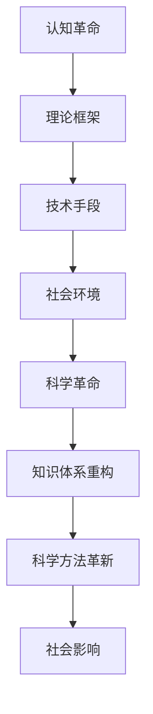

                 

 关键词：知识范式转移、科学革命、认知革命、信息技术、人工智能、范式理论

<|assistant|> 摘要：本文旨在探讨知识范式转移在科学革命中的核心作用。通过分析知识范式转移的机制和影响，本文揭示了信息技术和人工智能如何推动科学革命，并展望了未来的发展趋势与挑战。文章结构如下：

## 1. 背景介绍
### 1.1 知识范式转移的概念
### 1.2 科学革命的概述
### 1.3 信息技术与人工智能的发展

## 2. 核心概念与联系
### 2.1 知识范式转移的原理
### 2.2 科学革命的架构
### 2.3 Mermaid流程图

## 3. 核心算法原理 & 具体操作步骤
### 3.1 算法原理概述
### 3.2 算法步骤详解
### 3.3 算法优缺点
### 3.4 算法应用领域

## 4. 数学模型和公式 & 详细讲解 & 举例说明
### 4.1 数学模型构建
### 4.2 公式推导过程
### 4.3 案例分析与讲解

## 5. 项目实践：代码实例和详细解释说明
### 5.1 开发环境搭建
### 5.2 源代码详细实现
### 5.3 代码解读与分析
### 5.4 运行结果展示

## 6. 实际应用场景
### 6.1 当前应用状况
### 6.2 未来发展趋势
### 6.3 应用案例解析

## 7. 工具和资源推荐
### 7.1 学习资源推荐
### 7.2 开发工具推荐
### 7.3 相关论文推荐

## 8. 总结：未来发展趋势与挑战
### 8.1 研究成果总结
### 8.2 未来发展趋势
### 8.3 面临的挑战
### 8.4 研究展望

## 9. 附录：常见问题与解答

---

## 1. 背景介绍

### 1.1 知识范式转移的概念

知识范式转移是指知识体系从一种范式向另一种范式的转变，这种转变往往伴随着新的认知方式、思维方式、技术手段的引入。在科学发展的历史上，知识范式转移是推动科学革命的关键因素。

知识范式转移的四个核心要素包括：

1. **认知要素**：新的认知方式和认知工具。
2. **理论要素**：新的理论框架和概念体系。
3. **技术要素**：新的技术手段和应用工具。
4. **社会要素**：知识传播和接受的社会环境。

### 1.2 科学革命的概述

科学革命是指科学范式发生根本性变化的过程，通常表现为一系列新理论的提出、旧理论的淘汰以及科学方法的发展。科学革命往往带来重大的技术进步和社会变革，推动人类文明的发展。

科学革命的主要特征包括：

1. **理论突破**：新理论的提出，往往是对旧理论的革命性否定。
2. **方法创新**：新的实验方法和观测手段的出现，使科学研究更加精确和可靠。
3. **知识扩展**：科学知识的深度和广度得到显著扩展。
4. **社会影响**：科学革命对人类社会的生产、生活方式产生深远影响。

### 1.3 信息技术与人工智能的发展

信息技术和人工智能是当代科技发展的两大核心驱动力，它们的发展对知识范式转移产生了深远影响。

1. **信息技术的发展**：

   信息技术的发展为知识的存储、处理、传播提供了新的手段。互联网的普及、云计算的兴起、大数据技术的应用，使得知识获取和利用更加高效。

2. **人工智能的发展**：

   人工智能的发展带来了新的认知工具和理论框架。机器学习、深度学习等技术的应用，使得计算机能够模拟人类智能，处理复杂的问题。

## 2. 核心概念与联系

### 2.1 知识范式转移的原理

知识范式转移的原理可以从以下几个方面进行分析：

1. **认知革命**：认知革命是指人类认知方式的根本性变化。例如，从直觉思维向逻辑思维的转变，从经验认知向理论认知的转变。

2. **理论框架**：理论框架是知识范式转移的核心。新的理论框架能够解释旧理论无法解释的现象，并指导新的研究方向。

3. **技术手段**：技术手段是知识范式转移的重要推动力。例如，显微镜、望远镜等观测工具的出现，使得科学研究进入微观和宏观领域。

4. **社会环境**：社会环境是知识范式转移的外部条件。社会需求、文化背景、教育体制等都会影响知识范式的转移。

### 2.2 科学革命的架构

科学革命的架构可以从以下几个方面进行分析：

1. **起点**：科学革命的起点通常是理论上的疑问和挑战，或者是技术上的突破。

2. **发展**：科学革命的发展阶段包括新理论的提出、旧理论的淘汰、新方法的推广。

3. **高潮**：科学革命的高潮通常表现为科学理论的突破和技术手段的创新。

4. **结果**：科学革命的结果包括知识体系的重构、科学方法的革新、社会影响的深远。

### 2.3 Mermaid流程图

下面是一个简化的Mermaid流程图，描述了知识范式转移的过程：

---

在下一节中，我们将详细讨论核心算法原理与具体操作步骤。敬请期待。

