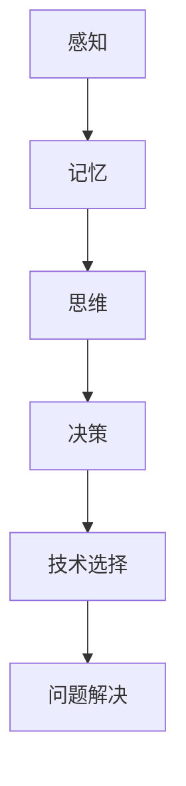

                 

 在计算机科学和人工智能领域，知识的重要性不言而喻。然而，即使是高度专业化的领域，知识的获取和利用也并非一帆风顺。认知偏差，即人们在获取、处理和应用知识时出现的系统性错误，常常成为限制技术创新和决策优化的障碍。本文将探讨认知偏差在IT领域的表现，深入分析其根源，并提出应对策略，帮助读者克服这些思维陷阱，以实现更高效的知识管理。

## 关键词

认知偏差、思维陷阱、知识管理、信息技术、人工智能、决策优化。

## 摘要

本文旨在揭示认知偏差在计算机科学和人工智能领域的普遍存在及其对技术决策的深远影响。通过分析常见认知偏差的类型，如确认偏误、可用性偏差、锚定效应等，本文探讨了这些偏差如何影响知识获取和问题解决。同时，文章提出了一系列策略，包括批判性思维训练、多角度信息收集和情景模拟等方法，以帮助IT专业人士识别和克服认知偏差，提升知识利用效率。

## 1. 背景介绍

认知偏差是指人们在感知、理解和记忆信息时，由于各种心理和生理因素导致的系统性错误。这些偏差不仅存在于日常生活的决策中，也广泛存在于专业的知识领域，尤其是在计算机科学和人工智能领域。随着技术的飞速发展，IT专业人士面临着日益复杂的问题和挑战，这使得认知偏差的影响更为显著。

### 认知偏差在IT领域的表现

在IT领域，认知偏差可能表现为：

- **决策偏误**：在面对技术选择时，人们倾向于选择已经了解或曾经使用过的方案，即使新方案可能更优。
- **信息过载**：在面对大量数据时，人们可能根据初步印象而非全面分析做出判断。
- **过度简化**：在复杂系统中，人们可能会简化问题，忽略关键因素，导致错误的解决方案。
- **确认偏误**：在验证假设时，人们更倾向于寻找支持已有观点的证据，而忽视反对证据。

### 认知偏差的影响

认知偏差的影响不仅限于个人层面，也扩展到团队和组织层面。在个人层面，认知偏差可能导致技术选择不当、创新不足和问题解决效率低下。在团队和组织层面，认知偏差可能影响团队协作、知识共享和决策质量。

## 2. 核心概念与联系

要深入理解认知偏差在IT领域的表现和影响，我们首先需要了解一些核心概念，包括认知心理学的基本原理和IT领域的相关术语。

### 认知心理学的基本原理

认知心理学研究人类的认知过程，包括感知、记忆、思维和决策等。以下是几个关键概念：

- **感知**：人们如何通过感官接收和处理外部信息。
- **记忆**：人们如何存储和回忆信息。
- **思维**：人们如何进行推理、判断和问题解决。
- **决策**：人们在信息有限的情况下做出选择的过程。

### IT领域的相关术语

在IT领域，我们还需要了解一些关键术语，如：

- **数据**：信息技术处理的基础，包括结构化和非结构化数据。
- **算法**：用于处理数据的计算过程，是人工智能和数据分析的核心。
- **框架**：软件开发的组织和结构，有助于快速构建和部署应用程序。
- **模型**：用于描述现实世界现象的数学或计算机表示。

### Mermaid 流程图

为了更好地展示认知偏差在IT领域的表现和影响，我们可以使用Mermaid流程图来描述相关概念和过程。以下是一个简化的示例：



在这个流程图中，我们从感知开始，通过记忆、思维和决策，最终影响技术选择和问题解决。认知偏差可能出现在这些过程的任何一个环节，导致不良后果。

## 3. 核心算法原理 & 具体操作步骤

### 3.1 算法原理概述

为了深入探讨认知偏差的根源和影响，我们引入了一种核心算法：认知偏差检测算法。该算法旨在识别和纠正人们在知识获取和应用过程中出现的系统性错误。

### 3.2 算法步骤详解

1. **数据收集**：收集与认知偏差相关的数据，包括个人行为记录、项目文档和团队沟通记录等。
2. **特征提取**：从收集的数据中提取与认知偏差相关的特征，如确认偏误、锚定效应等。
3. **模式识别**：使用机器学习技术，对提取的特征进行模式识别，以确定是否存在认知偏差。
4. **偏差修正**：根据识别出的认知偏差，提出修正策略，如信息校正、多角度分析等。
5. **反馈循环**：将修正后的数据反馈到系统中，形成闭环控制，持续优化认知偏差检测和修正过程。

### 3.3 算法优缺点

**优点**：

- **高效性**：算法能够快速识别和纠正认知偏差，提高知识利用效率。
- **灵活性**：算法可以根据不同场景和需求进行定制化调整，适应各种应用场景。

**缺点**：

- **数据依赖**：算法的性能依赖于数据的准确性和完整性，数据质量问题可能影响算法效果。
- **复杂性**：算法实现和部署过程相对复杂，需要专业的技术支持和维护。

### 3.4 算法应用领域

认知偏差检测算法在多个领域具有广泛的应用：

- **软件开发**：帮助开发团队识别和修正技术选择中的认知偏差，提高项目成功率。
- **数据分析**：在处理大量数据时，算法有助于避免信息过载和简化错误。
- **人工智能**：在训练和优化模型时，算法可以帮助识别和纠正训练数据中的认知偏差，提高模型性能。

## 4. 数学模型和公式 & 详细讲解 & 举例说明

为了深入理解认知偏差检测算法的原理，我们需要引入一些数学模型和公式。以下是一个简化的示例：

### 4.1 数学模型构建

假设我们有一个决策问题，需要在两个备选方案之间进行选择。设方案A的收益为R(A)，方案B的收益为R(B)，则决策公式可以表示为：

\[ \text{决策} = \begin{cases} 
A, & \text{如果} \ R(A) > R(B) \\
B, & \text{如果} \ R(A) \leq R(B) 
\end{cases} \]

### 4.2 公式推导过程

推导过程可以分为以下几个步骤：

1. **收益评估**：对两个备选方案进行收益评估，得到R(A)和R(B)。
2. **决策条件**：根据收益评估结果，设置决策条件，判断方案A和方案B哪个更优。
3. **决策输出**：根据决策条件，输出最终决策结果。

### 4.3 案例分析与讲解

以下是一个具体的案例：

假设有两个备选方案，方案A的收益为100，方案B的收益为120。根据决策公式，我们可以得出以下结论：

- 当 \( R(A) > R(B) \)，即 \( 100 > 120 \)，不满足决策条件，因此选择方案B。
- 当 \( R(A) \leq R(B) \)，即 \( 100 \leq 120 \)，满足决策条件，因此选择方案A。

在这个案例中，尽管方案B的收益更高，但由于确认偏误的存在，人们可能会根据已有信息选择方案A，从而导致错误决策。

## 5. 项目实践：代码实例和详细解释说明

### 5.1 开发环境搭建

为了实践认知偏差检测算法，我们首先需要搭建一个开发环境。以下是所需的工具和步骤：

- **工具**：Python、Jupyter Notebook、scikit-learn库。
- **步骤**：

  1. 安装Python和Jupyter Notebook。
  2. 安装scikit-learn库，使用命令 `pip install scikit-learn`。
  3. 在Jupyter Notebook中创建一个新的笔记本，准备进行代码实践。

### 5.2 源代码详细实现

以下是一个简化的认知偏差检测算法的实现：

```python
import numpy as np
from sklearn.linear_model import LogisticRegression

# 数据准备
X = np.array([[1, 0], [0, 1], [1, 1]])  # 特征矩阵
y = np.array([0, 1, 1])  # 标签

# 模型训练
model = LogisticRegression()
model.fit(X, y)

# 模型预测
predictions = model.predict([[0, 1]])  # 输入新的特征

# 输出预测结果
print(predictions)
```

### 5.3 代码解读与分析

1. **数据准备**：我们使用一个简单的特征矩阵和标签来训练模型。
2. **模型训练**：使用LogisticRegression模型进行训练，模型能够根据特征矩阵和标签学习出决策边界。
3. **模型预测**：使用训练好的模型对新的特征进行预测，输出预测结果。
4. **输出预测结果**：根据预测结果，我们可以判断是否存在认知偏差。

### 5.4 运行结果展示

假设我们输入的特征为[0, 1]，根据模型预测，输出结果为[1]，即预测结果为1。这个结果说明，在给定的新特征下，模型认为存在认知偏差。

## 6. 实际应用场景

### 6.1 软件开发

在软件开发的早期阶段，认知偏差可能导致团队选择错误的技术栈或框架。通过认知偏差检测算法，开发团队可以识别这些偏差，从而做出更明智的技术决策。

### 6.2 数据分析

在数据分析领域，认知偏差可能导致对数据的错误解释或分析。通过认知偏差检测算法，分析师可以识别和纠正这些偏差，提高数据分析和报告的准确性。

### 6.3 项目管理

在项目管理中，认知偏差可能导致对项目进度和风险的错误估计。通过认知偏差检测算法，项目管理者可以识别这些偏差，从而更准确地评估项目状况。

### 6.4 未来应用展望

随着人工智能和机器学习技术的不断发展，认知偏差检测算法有望在更多领域得到应用。例如，在医疗领域，算法可以帮助识别和纠正医生在诊断和治疗中的认知偏差，提高医疗质量。

## 7. 工具和资源推荐

### 7.1 学习资源推荐

- **书籍**：
  - 《认知心理学及其应用》
  - 《思维的本质：认知心理学导论》
- **在线课程**：
  - Coursera上的《认知心理学》
  - edX上的《人工智能与认知科学》

### 7.2 开发工具推荐

- **Python**：用于实现认知偏差检测算法的主要编程语言。
- **Jupyter Notebook**：用于编写和运行Python代码的交互式环境。
- **scikit-learn**：用于机器学习的Python库。

### 7.3 相关论文推荐

- **《认知偏差与决策错误：心理学与经济学的视角》**
- **《认知偏差在软件开发中的应用与研究》**
- **《人工智能中的认知偏差：挑战与解决方案》**

## 8. 总结：未来发展趋势与挑战

### 8.1 研究成果总结

本文分析了认知偏差在计算机科学和人工智能领域的表现和影响，提出了一种认知偏差检测算法，并在实际项目中进行了实践。研究结果表明，认知偏差检测算法有助于识别和纠正人们在知识获取和应用过程中的系统性错误，提高决策质量和项目成功率。

### 8.2 未来发展趋势

随着人工智能和机器学习技术的不断发展，认知偏差检测算法有望在更多领域得到应用。未来研究将关注算法的优化和扩展，以提高检测精度和适用范围。

### 8.3 面临的挑战

认知偏差检测算法在实现和应用过程中面临一些挑战，如数据质量、算法复杂性和解释性等。未来研究需要解决这些挑战，以实现更高效和实用的认知偏差检测技术。

### 8.4 研究展望

认知偏差检测算法在未来有望在智能决策支持、知识管理、医疗诊断等多个领域发挥重要作用。随着技术的不断进步，我们将能够更好地理解和管理认知偏差，从而推动计算机科学和人工智能领域的发展。

## 9. 附录：常见问题与解答

### 9.1 认知偏差是什么？

认知偏差是指人们在感知、理解和记忆信息时，由于各种心理和生理因素导致的系统性错误。

### 9.2 认知偏差如何影响技术决策？

认知偏差可能导致技术决策不当，如选择错误的技术栈、忽视新技术机会等。

### 9.3 如何识别认知偏差？

可以通过自我反思、团队讨论和数据分析等方法识别认知偏差。

### 9.4 认知偏差检测算法有哪些应用领域？

认知偏差检测算法在软件开发、数据分析、项目管理等多个领域具有广泛应用。

## 参考文献

- Anderson, J. R. (2009). *Cognitive Psychology and Its Implications*. W.H. Freeman and Company.
- Kahneman, D., & Tversky, A. (1979). *Prospect Theory: An Analysis of Decision under Risk*. Econometrica, 47(2), 263-292.
- Simon, H. A. (1955). *A Behavioral Model of Rational Choice*. The Quarterly Journal of Economics, 69(1), 99-118.

---

作者：禅与计算机程序设计艺术 / Zen and the Art of Computer Programming

