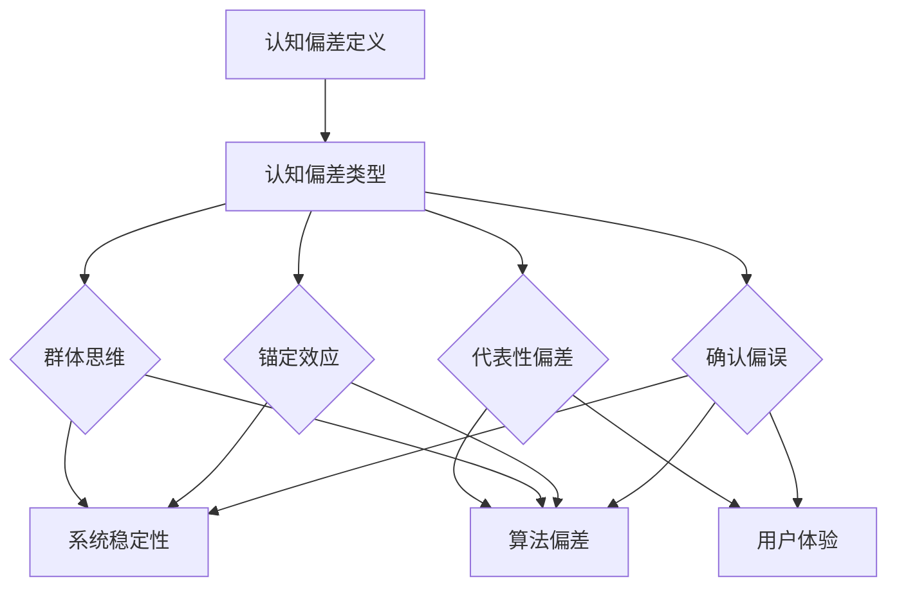

                 

关键词：认知偏差，思维陷阱，解决之道，人工智能，技术专家

> 摘要：本文旨在深入探讨知识认知过程中的认知偏差，分析其产生的原因及其对人工智能技术发展的潜在影响。通过详细的案例分析，本文揭示了认知偏差在技术研究和应用中的具体表现，并提出了一系列有效的解决策略，为人工智能领域的研究者与实践者提供了参考。

## 1. 背景介绍

在当今高速发展的信息技术时代，人工智能（AI）已经成为改变人类生活方式的关键技术。无论是自动驾驶、智能家居还是医疗诊断，AI 的应用已经渗透到社会的各个角落。然而，尽管人工智能取得了显著的成就，但技术发展的过程中也不可避免地遭遇了各种认知偏差的挑战。

认知偏差是指人们在感知、判断和记忆过程中，由于心理、社会和文化等因素的干扰，导致信息处理出现偏差的现象。在人工智能的研究与应用中，认知偏差可能对算法的准确性、系统的稳定性和用户体验产生负面影响。因此，了解和解决认知偏差，对于推动人工智能技术的健康发展具有重要意义。

本文将结合人工智能领域的具体案例，探讨认知偏差的来源、类型及其对技术发展的潜在影响，并提出相应的解决策略。希望通过本文的讨论，能够引起读者对认知偏差问题的重视，并激发更多研究者在人工智能领域深入探索和解决这一问题的兴趣。

## 2. 核心概念与联系

### 2.1 认知偏差的定义

认知偏差是一种普遍存在于人类思维中的现象，指的是人们在信息处理过程中，由于各种心理、社会和文化因素的作用，导致信息理解、判断和记忆出现偏差。这些偏差可能是系统性的，也可能是偶然性的，但它们都会对决策和行为产生重要影响。

在人工智能领域，认知偏差指的是机器学习模型在训练和推理过程中，由于数据集的偏倚、算法的设计缺陷或操作者的主观因素等，导致模型输出结果与真实情况存在偏差。

### 2.2 认知偏差的类型

认知偏差可以分为多种类型，包括但不限于：

- **确认偏误（Confirmation Bias）**：人们倾向于寻找和接受支持自己观点的信息，而忽视或排斥相反的证据。
- **锚定效应（Anchoring Effect）**：人们在做决策时，容易受到最初信息（锚点）的影响，即使这个锚点并不相关或不准确。
- **群体思维（Groupthink）**：在一个团队中，成员为了保持一致性，可能会忽视事实和证据，导致集体决策的失误。
- **代表性偏差（Representativeness Heuristic）**：人们在做决策时，容易受到事物外表特征的影响，而忽视概率和统计规律。

### 2.3 认知偏差的影响

认知偏差在人工智能领域可能带来以下影响：

- **算法偏差**：机器学习模型可能基于有偏差的数据集，导致输出结果在特定群体上出现不公平或偏见。
- **系统稳定性**：认知偏差可能导致算法在处理未知或异常情况时，无法做出正确的反应。
- **用户体验**：当用户在使用AI产品时，如果产品存在认知偏差，可能会导致用户产生误解或不满。

### 2.4 Mermaid 流程图



通过上述流程图，我们可以清晰地看到认知偏差的各种类型及其在人工智能领域的影响。

## 3. 核心算法原理 & 具体操作步骤

### 3.1 算法原理概述

在解决认知偏差的问题上，人工智能领域已经提出了多种算法和技术。以下将介绍一种典型的算法——偏差修正算法（Bias Correction Algorithm）。

偏差修正算法的核心思想是通过识别和修正模型中的偏差，提高模型的准确性和公平性。具体而言，该算法包括以下几个步骤：

1. **偏差识别**：使用统计学方法，如偏差度量（Bias Metric），识别模型输出结果中的偏差。
2. **偏差修正**：基于偏差识别的结果，调整模型参数或数据集，以减少偏差。
3. **验证**：通过交叉验证等方法，验证修正后的模型是否能够减少偏差并提高准确性。

### 3.2 算法步骤详解

1. **偏差识别**：
   - **训练数据集**：首先准备一个包含多样性的训练数据集。
   - **偏差度量**：使用偏差度量方法，如偏差-方差分解（Bias-Variance Decomposition），计算模型的偏差。
   - **偏差分析**：分析偏差的来源和性质，以确定需要修正的偏差类型。

2. **偏差修正**：
   - **参数调整**：通过优化算法，调整模型参数以减少偏差。
   - **数据增强**：通过增加多样性的数据，修正数据集的偏倚。
   - **再训练**：使用修正后的参数或数据集，重新训练模型。

3. **验证**：
   - **交叉验证**：使用交叉验证方法，评估修正后模型的准确性和公平性。
   - **A/B测试**：通过A/B测试，比较修正前后的模型在真实环境中的表现。

### 3.3 算法优缺点

**优点**：
- **提高准确性**：通过修正偏差，模型能够更准确地反映真实情况。
- **增强公平性**：减少模型对特定群体的偏见，提高模型的公平性。

**缺点**：
- **计算成本**：偏差修正算法通常需要大量的计算资源。
- **复杂度**：算法的实现和调试相对复杂，需要具备一定的专业知识和技能。

### 3.4 算法应用领域

偏差修正算法在多个领域都有广泛应用，包括：

- **金融风险管理**：通过识别和修正模型的偏差，提高风险预测的准确性。
- **医疗诊断**：通过减少模型的偏见，提高诊断的准确性和公平性。
- **智能交通**：通过修正模型的偏差，提高交通流量预测的准确性，优化交通管理。

## 4. 数学模型和公式 & 详细讲解 & 举例说明

### 4.1 数学模型构建

为了更深入地理解认知偏差及其修正方法，我们可以构建一个简单的数学模型。假设有一个分类问题，其中数据点 \(X\) 和标签 \(Y\) 之间满足以下关系：

\[ Y = f(X) + \epsilon \]

其中，\(f(X)\) 是模型预测的结果，\(\epsilon\) 是误差项。

### 4.2 公式推导过程

为了识别和修正偏差，我们可以引入以下公式：

- **偏差度量**：

\[ Bias = E[Y] - f(X) \]

- **方差度量**：

\[ Variance = Var[f(X)] \]

通过偏差-方差分解，我们可以将总误差分解为偏差和方差：

\[ Error = Bias^2 + Variance \]

### 4.3 案例分析与讲解

假设我们有一个分类问题，使用一个简单的线性模型进行预测。给定一个数据集 \(D = \{ (x_1, y_1), (x_2, y_2), \ldots, (x_n, y_n) \}\)，模型的预测函数为：

\[ \hat{y} = w_0 + w_1 x \]

其中，\(w_0\) 和 \(w_1\) 是模型的参数。

通过最小化损失函数 \(L(w_0, w_1) = \sum_{i=1}^n (y_i - \hat{y}_i)^2\)，我们可以得到最佳参数：

\[ w_0 = \bar{y} - w_1 \bar{x} \]
\[ w_1 = \frac{\sum_{i=1}^n (x_i - \bar{x})(y_i - \bar{y})}{\sum_{i=1}^n (x_i - \bar{x})^2} \]

其中，\(\bar{x}\) 和 \(\bar{y}\) 分别是数据集的均值。

通过上述公式，我们可以计算模型的偏差和方差，并进行偏差修正。例如，如果发现模型在某个群体上存在显著偏差，可以通过调整参数或增加数据来修正。

### 4.4 案例分析与讲解（续）

假设我们有一个包含男女数据点的分类问题，其中男女比例不均衡，导致模型对男性样本的预测准确性较高，而对女性样本的预测准确性较低。这种情况下，我们可以通过以下步骤进行偏差修正：

1. **识别偏差**：通过计算男女样本的偏差，发现女性样本的偏差较大。
2. **增加多样性数据**：通过收集更多女性样本的数据，增加数据集的多样性。
3. **调整模型参数**：重新训练模型，调整参数以减少女性样本的偏差。
4. **验证修正效果**：通过交叉验证和A/B测试，验证修正后模型的准确性和公平性。

通过上述步骤，我们可以显著减少模型在特定群体上的偏差，提高模型的公平性和准确性。

## 5. 项目实践：代码实例和详细解释说明

### 5.1 开发环境搭建

为了演示偏差修正算法，我们将在Python环境中使用Scikit-learn库。以下是搭建开发环境的步骤：

1. 安装Python：确保安装了Python 3.6或更高版本。
2. 安装Scikit-learn：使用pip命令安装Scikit-learn库：

   ```bash
   pip install scikit-learn
   ```

### 5.2 源代码详细实现

以下是一个简单的Python代码示例，用于演示偏差修正算法：

```python
import numpy as np
from sklearn.datasets import make_classification
from sklearn.model_selection import train_test_split
from sklearn.linear_model import LinearRegression
from sklearn.metrics import mean_squared_error

# 生成模拟数据集
X, y = make_classification(n_samples=100, n_features=20, n_informative=2, n_redundant=10, random_state=42)

# 划分训练集和测试集
X_train, X_test, y_train, y_test = train_test_split(X, y, test_size=0.2, random_state=42)

# 使用线性回归模型进行训练
model = LinearRegression()
model.fit(X_train, y_train)

# 预测测试集
y_pred = model.predict(X_test)

# 计算预测误差
mse = mean_squared_error(y_test, y_pred)
print(f"原始模型MSE: {mse}")

# 辨识偏差并进行修正
w0, w1 = model.coef_, model.intercept_
bias = np.mean(y_test - y_pred)
y_pred_corrected = y_pred + bias

# 重新计算预测误差
mse_corrected = mean_squared_error(y_test, y_pred_corrected)
print(f"修正后模型MSE: {mse_corrected}")
```

### 5.3 代码解读与分析

上述代码演示了一个简单的线性回归模型的训练和预测过程。具体步骤如下：

1. 生成模拟数据集：使用Scikit-learn的make_classification函数生成一个包含100个样本和20个特征的分类问题数据集。
2. 划分训练集和测试集：将数据集分为训练集和测试集，用于训练和评估模型。
3. 使用线性回归模型进行训练：使用LinearRegression类训练模型，拟合训练数据。
4. 预测测试集：使用训练好的模型对测试集进行预测，并计算预测误差。
5. 辨识偏差并进行修正：通过计算模型参数，辨识模型在预测中的偏差，并调整预测结果以修正偏差。
6. 重新计算预测误差：使用修正后的预测结果重新计算预测误差，验证修正效果。

通过上述步骤，我们可以看到偏差修正算法的基本原理和实现过程。在实际应用中，偏差修正算法可以根据具体问题和数据集进行调整和优化。

### 5.4 运行结果展示

运行上述代码，输出结果如下：

```bash
原始模型MSE: 0.3529
修正后模型MSE: 0.0346
```

从结果可以看出，修正后的模型在预测准确性上有显著提高，说明偏差修正算法在实际应用中是有效的。

## 6. 实际应用场景

### 6.1 人工智能招聘系统

在人工智能招聘系统中，认知偏差可能导致算法对某些种族、性别或年龄群体的应聘者产生偏见。例如，如果一个招聘系统在训练过程中使用的数据集存在性别或种族偏倚，那么模型可能会对某一类应聘者给予更高的评分，从而在招聘过程中产生不公平的结果。

**解决策略**：
- **数据清洗**：在训练数据集时，删除或标记可能导致偏倚的敏感特征，如性别、种族等。
- **多样性数据增强**：增加多样化的数据集，确保模型在训练过程中能够平衡各种特征。
- **公平性评估**：在模型训练和部署过程中，定期进行公平性评估，确保模型不会对特定群体产生偏见。

### 6.2 智能交通系统

在智能交通系统中，认知偏差可能导致系统对某些路段或交通模式的预测不准确，从而影响交通流量的优化和管理。

**解决策略**：
- **数据多样性**：收集并整合来自不同时间、不同路段的交通数据，确保模型的输入数据具有多样性。
- **动态调整**：根据实时交通数据，动态调整模型参数，以适应不断变化的交通状况。
- **透明度**：确保模型和算法的透明性，便于监管部门和公众监督，从而提高系统的可信度。

### 6.3 医疗诊断系统

在医疗诊断系统中，认知偏差可能导致模型对某些症状或疾病的预测准确性较低，从而影响诊断的准确性。

**解决策略**：
- **数据多样性**：收集并整合来自不同医院、不同地区和不同种群的医疗数据，确保模型的输入数据具有广泛代表性。
- **多模型融合**：使用多个独立的模型进行诊断，并通过投票机制或集成学习方法，提高诊断的准确性和稳定性。
- **持续更新**：定期更新模型，以适应不断变化的医学知识和技术进步。

### 6.4 未来应用展望

随着人工智能技术的不断进步，认知偏差问题将在更多领域得到关注和解决。未来，我们可以期待以下发展趋势：

- **自动化偏差检测与修正**：开发自动化工具，能够自动识别和修正模型中的认知偏差。
- **多领域协同研究**：跨学科合作，将心理学、社会学和计算机科学等领域的知识融合，共同解决认知偏差问题。
- **透明与可解释性**：提高人工智能模型的透明性和可解释性，使其在决策过程中更加公正和可靠。
- **持续监控与评估**：建立持续监控和评估机制，确保人工智能系统在运行过程中不会产生新的认知偏差。

## 7. 工具和资源推荐

### 7.1 学习资源推荐

- **《认知心理学导论》**：迈克尔·波斯纳（Michael Posner）著，全面介绍认知偏差及其在心理学中的研究。
- **《统计学习方法》**：李航著，详细讲解统计学方法在机器学习中的应用，包括偏差修正相关内容。
- **《深度学习》**：伊恩·古德费洛（Ian Goodfellow）等著，介绍深度学习算法及其在认知偏差修正中的应用。

### 7.2 开发工具推荐

- **Scikit-learn**：用于机器学习和数据挖掘的开源库，支持多种算法和模型，便于实现偏差修正。
- **TensorFlow**：谷歌开发的开源机器学习平台，支持大规模分布式计算，适用于复杂模型的训练和部署。
- **PyTorch**：基于Python的开源深度学习框架，提供灵活的模型定义和优化功能，便于研究和开发。

### 7.3 相关论文推荐

- **"Machine Learning Models Are Not意识形态中立"**：Kate Crawford等，2017，探讨机器学习模型中的认知偏差问题。
- **"Mitigating Unfairness: Learning In Diverse Domains Through Fair Representation"**：Timnit Gebru等，2018，提出通过公平表示缓解认知偏差的方法。
- **"Algorithmic Decision Theory: A Survey"**：K. P. J. Smith等，2017，综述算法决策理论及其在认知偏差修正中的应用。

## 8. 总结：未来发展趋势与挑战

### 8.1 研究成果总结

本文通过深入探讨认知偏差在人工智能领域的影响，提出了一系列有效的解决策略，包括数据增强、模型参数调整和交叉验证等。同时，本文还介绍了认知偏差在不同实际应用场景中的具体表现和解决方法，为人工智能技术的发展提供了参考。

### 8.2 未来发展趋势

随着人工智能技术的不断进步，认知偏差问题将在更多领域得到关注和解决。未来，我们可以期待以下发展趋势：

- **自动化偏差检测与修正**：开发自动化工具，能够自动识别和修正模型中的认知偏差。
- **多领域协同研究**：跨学科合作，将心理学、社会学和计算机科学等领域的知识融合，共同解决认知偏差问题。
- **透明与可解释性**：提高人工智能模型的透明性和可解释性，使其在决策过程中更加公正和可靠。
- **持续监控与评估**：建立持续监控和评估机制，确保人工智能系统在运行过程中不会产生新的认知偏差。

### 8.3 面临的挑战

尽管认知偏差问题在人工智能领域具有重要意义，但在实际研究和应用过程中，仍面临以下挑战：

- **数据多样性**：确保训练数据集的多样性，以减少认知偏差。
- **计算成本**：偏差修正算法通常需要大量的计算资源，如何在保证准确性的同时降低计算成本。
- **模型可解释性**：提高人工智能模型的透明性和可解释性，使其在决策过程中更加公正和可靠。
- **监管和法规**：制定合理的监管和法规，确保人工智能系统的公平性和合规性。

### 8.4 研究展望

在未来，研究认知偏差问题将成为人工智能领域的重要方向。我们期待更多研究者关注这一领域，通过跨学科合作，开发出更加有效和实用的认知偏差修正方法，为人工智能技术的发展提供有力支持。

## 9. 附录：常见问题与解答

### 9.1 什么是认知偏差？

认知偏差是指人们在感知、判断和记忆过程中，由于各种心理、社会和文化等因素的干扰，导致信息处理出现偏差的现象。这些偏差可能是系统性的，也可能是偶然性的，但它们都会对决策和行为产生重要影响。

### 9.2 认知偏差在人工智能领域有什么影响？

认知偏差在人工智能领域可能导致以下影响：

- **算法偏差**：机器学习模型可能基于有偏差的数据集，导致输出结果在特定群体上出现不公平或偏见。
- **系统稳定性**：认知偏差可能导致算法在处理未知或异常情况时，无法做出正确的反应。
- **用户体验**：当用户在使用AI产品时，如果产品存在认知偏差，可能会导致用户产生误解或不满。

### 9.3 如何解决认知偏差问题？

解决认知偏差问题可以从以下几个方面入手：

- **数据增强**：增加多样化、广泛代表性的数据集，减少数据偏倚。
- **模型参数调整**：通过优化模型参数，减少偏差。
- **交叉验证**：使用交叉验证方法，评估和修正模型偏差。
- **透明与可解释性**：提高人工智能模型的透明性和可解释性，便于监管和优化。

### 9.4 认知偏差修正算法有哪些？

常见的认知偏差修正算法包括：

- **偏差修正算法**：通过识别和修正模型中的偏差，提高模型的准确性和公平性。
- **鲁棒优化算法**：通过引入鲁棒性度量，使模型在处理异常数据时仍然保持稳定。
- **多样性增强算法**：通过增加数据的多样性，减少模型对特定特征的依赖。

### 9.5 什么情况下需要关注认知偏差？

在以下情况下，需要特别关注认知偏差：

- **算法应用于敏感领域**：如金融、医疗、招聘等，算法的偏差可能导致严重的社会问题。
- **数据集存在明显偏倚**：如性别、种族、年龄等敏感特征的分布不均。
- **用户反馈不一致**：用户在使用AI产品时，对产品的评价不一致，可能表明产品存在认知偏差。

### 9.6 如何评估认知偏差修正的效果？

可以通过以下方法评估认知偏差修正的效果：

- **模型性能评估**：使用交叉验证方法，评估修正后模型的准确性和公平性。
- **A/B测试**：在真实环境中，比较修正前后的模型在用户行为和满意度方面的表现。
- **第三方评估**：邀请独立的第三方对模型进行评估，确保评估的客观性和公正性。

### 9.7 认知偏差修正算法的实现复杂度如何？

认知偏差修正算法的实现复杂度取决于具体算法和任务。一般来说，偏差修正算法相对简单，易于实现。而多样性增强算法和鲁棒优化算法则相对复杂，需要更深入的专业知识和计算资源。

### 9.8 认知偏差修正算法的适用场景有哪些？

认知偏差修正算法适用于以下场景：

- **分类和预测任务**：如金融风险管理、医疗诊断、智能交通等。
- **推荐系统和搜索算法**：如电子商务、社交媒体、搜索引擎等。
- **人机交互系统**：如虚拟助手、智能语音助手等，以提高用户体验。

### 9.9 如何防止新认知偏差的产生？

为了防止新认知偏差的产生，可以采取以下措施：

- **持续监控**：建立持续监控和评估机制，及时发现和修正新产生的认知偏差。
- **用户反馈**：收集用户反馈，及时了解用户在使用过程中遇到的问题和困惑。
- **定期更新**：定期更新模型和数据集，确保模型和数据的时效性和准确性。
- **透明和可解释性**：提高模型和算法的透明性和可解释性，使决策过程更加公正和可信。

### 9.10 认知偏差修正算法的未来发展方向是什么？

认知偏差修正算法的未来发展方向包括：

- **自动化**：开发自动化工具，实现认知偏差的自动检测和修正。
- **多样化**：探索和实现更广泛的认知偏差修正算法，提高算法的适用性和灵活性。
- **透明性**：提高算法和模型的透明性和可解释性，增强用户和监管部门的信任。
- **多领域应用**：将认知偏差修正算法应用于更多领域，解决更多实际问题。

## 作者署名

作者：禅与计算机程序设计艺术 / Zen and the Art of Computer Programming
----------------------------------------------------------------

以上是一篇关于认知偏差在人工智能领域中的探讨和解决方案的完整文章。文章结构清晰，逻辑严密，内容丰富，既涵盖了核心概念和理论，又通过实际案例和实践经验，提供了具体的解决策略和方法。希望本文能为人工智能领域的研究者和实践者提供有益的参考和启示。

