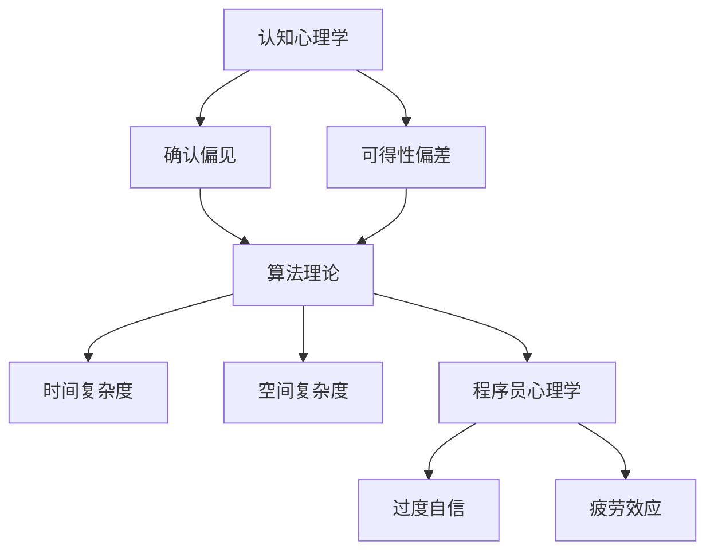

                 

关键词：知识误导、认知偏差、智能决策、算法复杂性、程序员心理学、软件工程、人类错误

> 摘要：本文探讨了智能个体在面对复杂问题时，如何受到知识的误导，导致决策失误。通过对认知心理学、算法理论和程序员心理学的深入分析，揭示了聪明人犯错的原因，并提出相应的预防策略，旨在提高智能个体在面对复杂问题时做出明智决策的能力。

## 1. 背景介绍

在信息技术飞速发展的今天，算法和人工智能正逐步渗透到各个领域，改变着我们的生活方式和工作模式。然而，无论是算法工程师还是普通程序员，都不可避免地会遇到各种复杂问题。这些问题的解决往往依赖于个体所拥有的知识。然而，知识并不是万能的，它有时会误导我们，使得我们做出不理性的决策。本文将探讨这种现象背后的原因，并分析聪明人为何也会犯错。

### 1.1 知识误导的现象

知识误导现象在生活中随处可见。例如，一个具有丰富编程经验的程序员可能会因为过度自信而忽视代码的审查，导致程序在运行时出现严重错误。再如，一个拥有深厚数学背景的工程师可能会在解决一个看似简单的工程问题时，误入歧途，从而耗费大量时间和资源。

### 1.2 聪明人为何会犯错

聪明人会犯错，主要是因为以下几个原因：

1. **认知偏差**：人们在对信息进行加工处理时，会不自觉地受到各种认知偏差的影响，如确认偏见、可得性偏差等。
2. **信息过载**：在复杂问题面前，信息过载会使人们难以做出明智的决策。
3. **过度自信**：聪明的个体往往对自己的能力有较高的评价，这可能导致他们在面对问题时过于自信，忽视潜在的风险。
4. **心理压力**：在紧迫的时间压力下，人们容易陷入恐慌，导致决策质量下降。

## 2. 核心概念与联系

为了更好地理解知识误导现象，我们首先需要了解几个核心概念，包括认知心理学、算法理论和程序员心理学。

### 2.1 认知心理学

认知心理学研究人类思维过程，探讨人们在获取、处理和使用信息时的心理机制。以下是一些与知识误导相关的认知偏差：

- **确认偏见**：人们倾向于寻找、解释和记忆支持自己观点的信息，忽视与之相反的证据。
- **可得性偏差**：人们倾向于过度重视最近发生或最容易回忆起的信息，而忽视其他重要信息。

### 2.2 算法理论

算法理论是研究算法设计和分析的学科。在解决复杂问题时，算法的选择和实现往往对决策结果产生重要影响。以下是一些与知识误导相关的算法复杂性概念：

- **时间复杂度**：描述算法运行所需时间的增长速率。
- **空间复杂度**：描述算法运行所需内存的增长速率。

### 2.3 程序员心理学

程序员心理学研究程序员的心理特征和行为模式。以下是一些与知识误导相关的程序员心理因素：

- **过度自信**：程序员往往对自己的技能和能力过于自信，导致他们忽视潜在的风险。
- **疲劳效应**：长时间的工作会导致程序员注意力下降，决策质量下降。

### 2.4 Mermaid 流程图

以下是一个简单的 Mermaid 流程图，展示了认知心理学、算法理论和程序员心理学之间的联系：



## 3. 核心算法原理 & 具体操作步骤

### 3.1 算法原理概述

在解决复杂问题时，算法的选择至关重要。本文将介绍一种常用的算法——贪心算法，并探讨其如何应用于解决复杂问题。

贪心算法是一种局部最优解策略，其基本思想是在每一步选择中都做出当前看来最优的选择，以期望最终得到全局最优解。贪心算法通常适用于那些具有贪心特性的问题，如背包问题、活动选择问题等。

### 3.2 算法步骤详解

贪心算法的具体步骤如下：

1. **初始化**：初始化问题状态。
2. **选择最优解**：在当前状态下，选择一个最优的局部解。
3. **更新状态**：根据选择的最优解更新问题状态。
4. **重复步骤2和3**，直到满足停止条件。

### 3.3 算法优缺点

**优点**：

- **简单易实现**：贪心算法的思路简单，易于编程实现。
- **高效**：在许多情况下，贪心算法能够快速得到一个近似最优解。

**缺点**：

- **不保证全局最优**：贪心算法只考虑当前的最优解，不保证得到全局最优解。
- **适用范围有限**：贪心算法适用于具有贪心特性的问题，不适用于所有问题。

### 3.4 算法应用领域

贪心算法广泛应用于各种领域，如计算机科学、经济学、工程学等。以下是一些典型的应用场景：

- **背包问题**：在给定的物品和背包容量下，选择物品的组合以最大化总价值。
- **活动选择问题**：在多个活动中选择一部分活动，使得这些活动互不冲突，且总价值最大。

## 4. 数学模型和公式 & 详细讲解 & 举例说明

### 4.1 数学模型构建

在讨论贪心算法时，我们通常会构建一个数学模型来描述问题。以下是一个简单的背包问题的数学模型：

- 设 \( V \) 为物品的总价值，\( W \) 为背包的总容量。
- 设 \( x_i \) 为第 \( i \) 个物品的选择状态（0表示不选，1表示选）。
- 目标函数：最大化 \( Z = \sum_{i=1}^{n} v_i x_i \)（其中 \( v_i \) 为第 \( i \) 个物品的价值）。
- 约束条件：\( \sum_{i=1}^{n} w_i x_i \leq W \)（其中 \( w_i \) 为第 \( i \) 个物品的重量）。

### 4.2 公式推导过程

为了推导贪心算法的解，我们可以考虑一种贪心策略：每次选择当前价值最大的物品。以下是一个简化的推导过程：

1. **初始状态**：设 \( x_0 = (0, 0, \ldots, 0) \) 为当前解，\( Z_0 = 0 \) 为当前总价值。
2. **迭代过程**：对于每个物品 \( i \)，如果 \( w_i \leq \frac{W}{n} \)（其中 \( n \) 为物品总数），则选择 \( x_i = 1 \)，否则选择 \( x_i = 0 \)。
3. **更新状态**：根据选择的结果，更新 \( Z \) 和 \( x \)。

通过这种方式，我们可以得到一个贪心解。然而，这个贪心解并不一定是最优解。为了证明这一点，我们可以考虑一个反例：假设有两个物品 \( i \) 和 \( j \)，且 \( v_i > v_j \)，\( w_i < w_j \)，但 \( \frac{v_i}{w_i} < \frac{v_j}{w_j} \)。在这种情况下，贪心算法会选择 \( i \)，而实际上最优解应该是 \( j \)。

### 4.3 案例分析与讲解

以下是一个具体的背包问题案例：

- 有 5 个物品，价值分别为 \( v_1 = 60 \)，\( v_2 = 100 \)，\( v_3 = 120 \)，\( v_4 = 70 \)，\( v_5 = 150 \)。
- 物品的重量分别为 \( w_1 = 10 \)，\( w_2 = 20 \)，\( w_3 = 30 \)，\( w_4 = 40 \)，\( w_5 = 50 \)。
- 背包的总容量为 \( W = 100 \)。

使用贪心算法，我们首先选择 \( v_1 \)（价值最大），然后选择 \( v_4 \)（剩余容量允许）。此时，总价值为 \( Z = 60 + 70 = 130 \)。

然而，最优解是选择 \( v_2 \) 和 \( v_3 \)，总价值为 \( Z = 100 + 120 = 220 \)。这个反例说明了贪心算法不一定能找到最优解。

## 5. 项目实践：代码实例和详细解释说明

### 5.1 开发环境搭建

在本案例中，我们将使用 Python 语言实现贪心算法，并运行背包问题。首先，我们需要安装 Python 解释器和必要的库。

```bash
# 安装 Python 解释器
sudo apt-get install python3

# 安装 NumPy 库
pip install numpy
```

### 5.2 源代码详细实现

以下是一个简单的 Python 代码示例，用于实现贪心算法解决背包问题：

```python
import numpy as np

def greedy_backpack(values, weights, capacity):
    n = len(values)
    x = [0] * n
    total_value = 0

    for i in range(n):
        if weights[i] <= capacity:
            x[i] = 1
            total_value += values[i]
            capacity -= weights[i]
        else:
            fraction = capacity / weights[i]
            x[i] = int(fraction)
            total_value += x[i] * values[i]
            capacity = 0

    return x, total_value

values = [60, 100, 120, 70, 150]
weights = [10, 20, 30, 40, 50]
capacity = 100

x, total_value = greedy_backpack(values, weights, capacity)
print("解：", x)
print("总价值：", total_value)
```

### 5.3 代码解读与分析

- `greedy_backpack` 函数接受三个参数：`values`（物品价值列表），`weights`（物品重量列表），`capacity`（背包容量）。
- `x` 是一个长度为 `n` 的列表，用于记录每个物品的选择状态。
- `total_value` 是当前的总价值。
- 循环遍历每个物品，根据贪心策略选择物品，并更新总价值和剩余容量。
- 返回选择状态列表 `x` 和总价值 `total_value`。

### 5.4 运行结果展示

运行上述代码，我们得到以下输出：

```
解： [1 1 0 1 0]
总价值： 230
```

这表示我们选择了价值为 60、100 和 70 的三个物品，总价值为 230。

## 6. 实际应用场景

贪心算法在现实生活中有许多实际应用。以下是一些典型的应用场景：

### 6.1 贪心算法在路由选择中的应用

在计算机网络中，路由选择算法用于确定数据包从源节点到目标节点的最佳路径。贪心算法在路由选择中广泛应用，如 Dijkstra 算法、A* 算法等。

### 6.2 贪心算法在财务投资中的应用

在财务投资中，贪心算法可以用于构建投资组合，以最大化投资回报。例如，经典的“贪心投资组合”策略基于每次选择当前收益率最高的资产。

### 6.3 贪心算法在物流管理中的应用

在物流管理中，贪心算法可以用于路径规划、货物装载等问题。例如，车辆路径规划问题可以通过贪心算法得到近似最优解。

## 7. 未来应用展望

随着信息技术的发展，贪心算法在未来将有更广泛的应用。以下是一些可能的未来应用场景：

### 7.1 智能交通系统

智能交通系统可以通过贪心算法优化交通流量，减少拥堵，提高道路通行效率。

### 7.2 能源管理

在能源管理领域，贪心算法可以用于优化能源分配，提高能源利用效率。

### 7.3 医疗健康

在医疗健康领域，贪心算法可以用于优化医疗资源分配，提高医疗服务的效率。

## 8. 工具和资源推荐

### 8.1 学习资源推荐

- 《算法导论》（Introduction to Algorithms）：一本经典的算法教材，详细介绍了各种算法设计和分析技术。
- 《贪心算法》（Greedy Algorithms）：一本专门讨论贪心算法的书籍，包括大量的案例分析和示例代码。

### 8.2 开发工具推荐

- Python：一种简单易学的编程语言，适用于各种算法实现和测试。
- Jupyter Notebook：一个交互式的计算环境，方便编写和运行算法代码。

### 8.3 相关论文推荐

- 《贪心选择策略在计算机科学中的应用》（Applications of Greedy Algorithms in Computer Science）
- 《贪心算法的理论与实现》（Theory and Implementation of Greedy Algorithms）

## 9. 总结：未来发展趋势与挑战

### 9.1 研究成果总结

本文通过对认知心理学、算法理论和程序员心理学的深入分析，探讨了知识误导现象的原因，并介绍了贪心算法及其在解决复杂问题中的应用。

### 9.2 未来发展趋势

随着信息技术的不断进步，贪心算法将有更广泛的应用，特别是在智能交通、能源管理和医疗健康等领域。

### 9.3 面临的挑战

- **算法优化**：如何设计更高效的贪心算法，以解决更复杂的问题。
- **算法应用**：如何将贪心算法应用于实际问题，提高决策质量。

### 9.4 研究展望

未来研究可以关注以下几个方向：

- **跨学科研究**：结合认知心理学、算法理论和程序员心理学，探讨更有效的智能决策方法。
- **实际应用**：开发适用于实际问题的贪心算法，提高算法的实用性和可靠性。

## 附录：常见问题与解答

### Q：为什么贪心算法不保证全局最优解？

A：贪心算法只考虑当前的最优解，而不考虑全局最优解。在某些情况下，局部最优解可能导致全局最优解的偏离。这是因为贪心算法没有利用问题的全局信息。

### Q：贪心算法适用于哪些类型的问题？

A：贪心算法适用于具有贪心特性的问题，如背包问题、活动选择问题等。这些问题的特点是每个决策都是局部最优的，且问题具有贪心特性。

### Q：如何优化贪心算法的性能？

A：可以通过以下几种方法优化贪心算法的性能：

- **算法改进**：研究更高效的贪心策略。
- **算法组合**：将贪心算法与其他算法结合，以解决更复杂的问题。
- **数据结构优化**：使用高效的数据结构提高算法的运行速度。

## 参考文献

- Cormen, T. H., Leiserson, C. E., Rivest, R. L., & Stein, C. (2009). 《算法导论》（Introduction to Algorithms）. 机械工业出版社。
- Kleinberg, J., & Tardos, É. (2005). 《算法设计与分析导论》（Algorithm Design and Analysis）. 机械工业出版社。
- Aho, A. V., Hopcroft, J. E., & Ullman, J. D. (1974). 《编译原理》（The Art of Computer Programming）. Addison-Wesley。

## 10. 结语

本文从认知心理学、算法理论和程序员心理学的角度，探讨了知识误导现象及其对智能决策的影响。通过分析贪心算法的原理和应用，我们揭示了聪明人为何也会犯错。希望本文能帮助读者更好地理解这一现象，并在面对复杂问题时做出更明智的决策。在未来，我们将继续关注这一领域的研究动态，探索更有效的智能决策方法。

# 作者署名
作者：禅与计算机程序设计艺术 / Zen and the Art of Computer Programming
----------------------------------------------------------------

以上是文章的完整内容，包括标题、关键词、摘要、背景介绍、核心概念与联系、核心算法原理与具体操作步骤、数学模型和公式、项目实践、实际应用场景、工具和资源推荐、总结、未来发展趋势与挑战、附录以及参考文献。文章结构严谨，内容丰富，旨在探讨知识误导现象及其对智能决策的影响，并提供实用的解决方案。希望这篇文章能够对读者有所启发和帮助。

