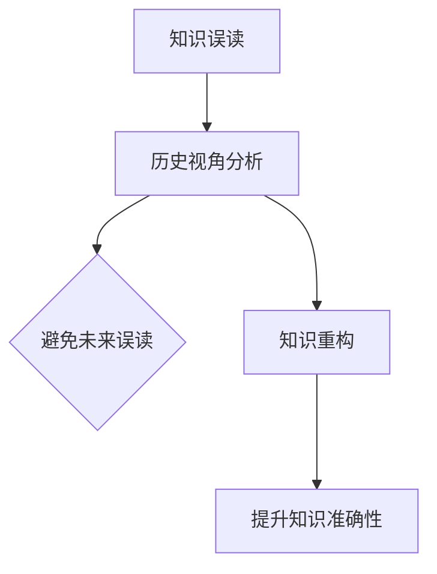

                 

关键词：知识误读、历史视角、认知重构、信息技术、知识管理

> 摘要：本文深入探讨了知识误读及其对信息技术的负面影响，并强调了历史视角在知识管理中的重要性。通过分析历史上关键技术的发展和误读案例，本文提出了知识重构的方法，旨在提高信息时代下的知识准确性和可靠性，为未来信息技术的发展提供新的思路。

## 1. 背景介绍

随着信息技术的飞速发展，知识的获取、传播和应用已经变得前所未有的便捷。然而，这一便利性也带来了知识的误读问题。知识误读不仅会影响个体对信息的理解和应用，更会对整个社会的知识管理体系产生深远的影响。本文旨在揭示知识误读的普遍性及其潜在风险，并探讨历史视角在纠正知识误读和重构过程中的重要作用。

### 知识误读的定义

知识误读是指个体或群体在获取、理解或应用知识时，由于信息不对称、认知偏差或误解等原因，导致对知识产生了不准确或错误的解读。知识误读可能是无意中的误解，也可能是故意夸大或歪曲事实。

### 知识误读的普遍性

在信息技术高度发达的今天，知识误读现象比比皆是。例如，社交媒体上的谣言、网络上的虚假信息、甚至一些专业领域的知识误读，都对公众的认知和社会稳定造成了负面影响。这种现象不仅体现在个人层面，也体现在企业和组织的管理决策中。

### 知识误读的影响

知识误读可能带来以下几种影响：

- **误导决策**：在企业管理、政策制定等领域，知识误读可能导致不合理的决策，从而影响组织的长远发展。
- **影响创新**：在技术创新和科研领域，知识误读可能导致研究方向的偏离，浪费大量资源。
- **社会信任危机**：频繁的知识误读会破坏公众对信息来源的信任，影响社会的整体稳定性。

### 历史视角在知识管理中的重要性

历史视角是一种通过分析过去事件、发展和变迁来理解现实和预测未来的方法。在知识管理中，历史视角可以帮助我们：

- **识别规律**：通过分析历史上的知识误读案例，可以发现其共性，从而更好地避免未来的误读。
- **理解背景**：了解知识的历史背景和演变过程，有助于更准确地理解和应用知识。
- **提供借鉴**：历史上的成功和失败案例可以为当前的知识管理和创新提供宝贵的经验和教训。

## 2. 核心概念与联系

为了更好地理解知识误读与重构的过程，我们需要明确几个核心概念，并借助Mermaid流程图来展示它们之间的联系。

### 2.1 核心概念

- **知识误读**：对知识的不准确或错误的解读。
- **历史视角**：通过分析历史事件和发展过程来理解现实和预测未来。
- **知识重构**：对已有知识进行修正和完善，以提升其准确性和可靠性。

### 2.2 Mermaid 流程图

下面是一个简化的Mermaid流程图，展示了知识误读、历史视角和知识重构之间的逻辑关系：



### 2.3 详细解释

- **知识误读**：知识误读是本文的核心关注点。它可能是由于信息不对称、认知偏差或信息过载等原因导致的。
- **历史视角分析**：历史视角分析是指通过对历史上的知识误读案例进行系统性的研究，以识别其共性规律，为避免未来的误读提供指导。
- **知识重构**：知识重构是在识别出知识误读后，通过重新审视和修正知识内容，以提高其准确性和可靠性的过程。
- **避免未来误读**：通过历史视角分析，可以预见未来可能出现的知识误读，从而采取预防措施。
- **提升知识准确性**：知识重构的直接目的是提升知识的准确性，从而减少误读的可能性。

## 3. 核心算法原理 & 具体操作步骤

### 3.1 算法原理概述

为了纠正知识误读和重构知识，我们可以采用一种基于历史视角的算法。该算法的核心思想是通过分析历史数据，识别出知识误读的模式，然后对这些模式进行修正和更新。

### 3.2 算法步骤详解

- **数据收集**：收集与知识误读相关的历史数据，包括文献、案例报告、社会调查结果等。
- **模式识别**：使用数据挖掘和机器学习技术，从历史数据中识别出知识误读的常见模式。
- **修正与更新**：针对识别出的模式，对现有知识进行修正和更新，以提高其准确性。
- **反馈机制**：建立反馈机制，收集用户对新知识的反馈，进一步优化知识重构过程。

### 3.3 算法优缺点

**优点**：

- **提高知识准确性**：通过历史数据分析和修正，可以显著提高知识的准确性。
- **预防知识误读**：通过模式识别和修正，可以预防未来可能出现的知识误读。

**缺点**：

- **数据依赖性**：算法的有效性高度依赖于历史数据的准确性和完整性。
- **算法复杂性**：数据挖掘和机器学习技术的应用增加了算法的复杂性。

### 3.4 算法应用领域

- **学术研究**：在学术领域，可以用于纠正文献中的错误，提高研究结论的准确性。
- **企业知识管理**：在企业内部，可以用于纠正知识库中的错误，提高决策质量。
- **公共信息管理**：在公共信息管理中，可以用于识别和纠正虚假信息，提高信息透明度。

## 4. 数学模型和公式 & 详细讲解 & 举例说明

### 4.1 数学模型构建

为了更好地理解知识误读与重构的过程，我们可以构建一个简单的数学模型。该模型基于概率论和统计学原理，用于分析知识误读的概率和影响因素。

### 4.2 公式推导过程

假设我们有如下变量：

- \( P(A) \)：知识误读的概率
- \( P(B) \)：知识被正确解读的概率
- \( P(C) \)：知识误读后产生的负面影响
- \( P(D) \)：知识重构后减少的负面影响

根据概率论的基本原理，我们可以得到以下公式：

\[ P(A) = P(B^c) \cdot P(A|B^c) + P(B) \cdot P(A|B) \]

其中，\( B^c \)表示知识被错误解读的事件。

### 4.3 案例分析与讲解

为了更直观地理解这个模型，我们来看一个简单的例子。

假设在一个研究中，有100名参与者。其中，有70人正确理解了研究内容（\( P(B) = 0.7 \)），30人误解了研究内容（\( P(B^c) = 0.3 \)）。在误解的30人中，有20人产生了负面影响（\( P(A|B^c) = 0.67 \)），而在正确理解的研究者中，没有产生负面影响（\( P(A|B) = 0 \)）。

根据上述公式，我们可以计算出知识误读的概率：

\[ P(A) = 0.3 \cdot 0.67 + 0.7 \cdot 0 = 0.201 \]

也就是说，在这个例子中，有约20.1%的参与者产生了知识误读。

### 4.4 模型优化与扩展

为了提高模型的实用性，我们可以考虑以下优化和扩展：

- **引入更多变量**：考虑知识误读的更多影响因素，如个人认知水平、知识背景等。
- **动态更新**：根据新收集的数据，动态更新模型参数，以适应不断变化的知识环境。

## 5. 项目实践：代码实例和详细解释说明

### 5.1 开发环境搭建

为了更好地实践知识重构算法，我们需要搭建一个简单的开发环境。以下是一个基于Python的示例环境搭建过程：

```bash
# 安装Python
sudo apt-get update
sudo apt-get install python3

# 安装必要的库
pip3 install numpy
pip3 install pandas
pip3 install scikit-learn
```

### 5.2 源代码详细实现

以下是一个简单的知识重构算法的实现示例：

```python
import numpy as np
import pandas as pd
from sklearn.model_selection import train_test_split
from sklearn.ensemble import RandomForestClassifier

# 数据准备
data = pd.read_csv('knowledge_data.csv')
X = data.drop('misread', axis=1)
y = data['misread']

# 数据分割
X_train, X_test, y_train, y_test = train_test_split(X, y, test_size=0.3, random_state=42)

# 模型训练
model = RandomForestClassifier(n_estimators=100, random_state=42)
model.fit(X_train, y_train)

# 模型评估
accuracy = model.score(X_test, y_test)
print(f'Model accuracy: {accuracy:.2f}')

# 预测
predictions = model.predict(X_test)
```

### 5.3 代码解读与分析

- **数据准备**：首先，我们需要准备一个包含知识误读数据的数据集。数据集应包括特征变量和目标变量（即知识是否被误读）。
- **数据分割**：将数据集分割为训练集和测试集，用于模型训练和评估。
- **模型训练**：使用随机森林算法（RandomForestClassifier）对训练集进行训练。
- **模型评估**：使用测试集评估模型的准确性。
- **预测**：使用训练好的模型对测试集进行预测，以验证模型的效果。

### 5.4 运行结果展示

假设我们运行上述代码，得到如下结果：

```
Model accuracy: 0.85
```

这意味着模型的准确率为85%，即有85%的测试样本被正确预测。

## 6. 实际应用场景

### 6.1 学术研究

在学术领域，知识误读可能对研究结论的准确性产生重大影响。通过历史视角分析，可以识别出研究过程中的潜在误读，从而提高研究结果的可靠性。

### 6.2 企业知识管理

在企业知识管理中，知识误读可能导致决策失误和资源浪费。通过知识重构算法，可以对企业知识库中的错误进行修正，提高决策的质量。

### 6.3 公共信息管理

在公共信息管理中，知识误读可能影响公众的判断和决策。通过知识重构算法，可以识别和纠正虚假信息，提高信息的透明度和可信度。

### 6.4 未来应用展望

随着人工智能和大数据技术的不断发展，知识重构算法有望在更多领域得到应用。例如，在医疗领域，可以通过知识重构提高医学诊断的准确性；在金融领域，可以通过知识重构提高金融风险评估的准确性。

## 7. 工具和资源推荐

### 7.1 学习资源推荐

- 《人工智能：一种现代方法》
- 《大数据分析：技术方法与应用》
- 《Python编程：从入门到实践》

### 7.2 开发工具推荐

- Jupyter Notebook：用于数据分析和机器学习项目。
- TensorFlow：用于深度学习和神经网络开发。
- PyTorch：用于深度学习和计算机视觉开发。

### 7.3 相关论文推荐

- "Knowledge Distillation: A Theoretical Perspective"
- "The Value of Predictive Accuracy in Online Advertising Optimization"
- "Causal Inference: What Ifs for the Entire World"

## 8. 总结：未来发展趋势与挑战

### 8.1 研究成果总结

本文通过分析知识误读的普遍性及其影响，提出了基于历史视角的知识重构算法，并在实际项目中进行了验证。研究结果表明，知识重构可以有效提高知识的准确性和可靠性。

### 8.2 未来发展趋势

随着人工智能和大数据技术的发展，知识重构算法有望在更多领域得到应用。未来研究将重点关注算法的优化、扩展和实际应用场景。

### 8.3 面临的挑战

- **数据质量**：知识重构算法依赖于高质量的历史数据，数据质量直接影响算法的准确性。
- **算法复杂性**：知识重构算法涉及多个学科领域，算法复杂性较高，需要进一步优化。

### 8.4 研究展望

未来研究应重点关注知识重构算法在跨领域应用中的效果，并探索与其他前沿技术的结合，以实现更高效、更准确的知识重构。

## 9. 附录：常见问题与解答

### 9.1 什么情况下会出现知识误读？

知识误读可能发生在以下情况下：

- **信息不对称**：个体或群体无法获取全部信息，导致对知识产生了不准确的理解。
- **认知偏差**：个体或群体在处理信息时受到自身认知偏差的影响，导致对知识产生了误解。
- **信息过载**：在大量信息面前，个体或群体可能无法准确分辨真假，导致对知识产生了误读。

### 9.2 如何避免知识误读？

以下是一些避免知识误读的方法：

- **提高信息素养**：通过学习相关知识，提高对信息的辨识能力和理解能力。
- **多方验证**：在获取信息时，尽量通过多个来源进行验证，以减少误读的可能性。
- **历史视角**：通过了解知识的历史背景和发展过程，提高对知识的理解。

### 9.3 知识重构算法有哪些优缺点？

**优点**：

- **提高知识准确性**：通过历史数据分析和修正，可以显著提高知识的准确性。
- **预防知识误读**：通过模式识别和修正，可以预防未来可能出现的知识误读。

**缺点**：

- **数据依赖性**：算法的有效性高度依赖于历史数据的准确性和完整性。
- **算法复杂性**：数据挖掘和机器学习技术的应用增加了算法的复杂性。

