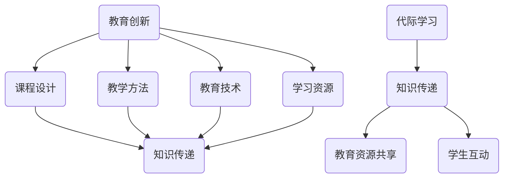

                 

关键词：教育创新、代际学习、知识传递、人工智能、编程教育、教育技术

> 摘要：本文探讨了知识跨代传递在教育领域的重要性，以及如何通过教育创新和代际学习来优化这一过程。我们结合了最新的信息技术，尤其是人工智能和编程教育，提出了几项策略来提升教育质量，增强学生的学习体验，并展望了未来的发展趋势和挑战。

## 1. 背景介绍

在教育领域，知识的传递是一个持续进行的过程，它不仅涉及教师向学生的单向传授，还包括学生之间的互动和学习，以及学生与知识的双向互动。然而，随着时代的发展，知识的更新速度变得越来越快，传统的教育模式和教学方法已经难以满足日益增长的学习需求。这就需要我们探索新的教育创新方式和代际学习策略，以实现知识的跨代传递。

知识的跨代传递不仅仅是指知识从一代传递到下一代，更重要的是在传递过程中保持知识的活力和准确性，以及激发学生对知识的兴趣和创造力。这要求教育者不断地更新教育内容，采用新的教学方法和工具，同时也要求学生主动参与到学习过程中，主动获取和构建知识。

## 2. 核心概念与联系

为了更好地理解知识的跨代传递，我们需要明确几个核心概念，并探讨它们之间的联系。

### 2.1 教育创新

教育创新指的是在教育领域中引入新的思想、方法、工具或模式，以改进教学和学习效果。教育创新可以包括课程设计、教学方法、教育技术、学习资源等多个方面。

### 2.2 代际学习

代际学习是指不同年龄层次的学习者之间的互动和学习，它可以帮助学生更好地理解知识的背景和应用，同时也能够促进教育资源的共享和优化。

### 2.3 知识传递

知识传递是指将知识从一方传递到另一方的过程，这个过程可能涉及信息的传输、理解、内化和应用。

下面是几个核心概念和联系的Mermaid流程图：



## 3. 核心算法原理 & 具体操作步骤

### 3.1 算法原理概述

在教育创新和代际学习的过程中，我们可以借鉴一些核心算法原理，来优化知识传递的效果。其中，基于人工智能的推荐系统和基于大数据的分析方法是两个重要的工具。

### 3.2 算法步骤详解

1. **数据收集与处理**：首先，我们需要收集学生的学习行为数据，包括学习时间、学习内容、学习成果等。然后，对这些数据进行清洗和处理，以消除噪声和冗余。

2. **推荐系统**：利用机器学习算法，如协同过滤或基于内容的推荐，为学生推荐合适的学习资源和课程。推荐系统的目标是提高学习效率，减少学习时间。

3. **数据分析**：通过大数据分析技术，对学生的学习行为和成果进行分析，发现学生的学习偏好和弱点。这有助于教育者调整教学内容和方法，以更好地满足学生的需求。

4. **互动与反馈**：鼓励学生之间进行互动和合作学习，通过在线讨论、小组项目等方式，提高学生的参与度和学习效果。同时，教育者需要及时给予反馈，帮助学生纠正错误，巩固知识。

### 3.3 算法优缺点

- **优点**：算法可以帮助教育者更好地了解学生，优化教学内容和方法，提高学习效率。同时，算法能够实现个性化推荐，满足学生的个性化需求。
- **缺点**：算法需要大量数据支持，数据质量直接影响算法的准确性。此外，算法的复杂性和计算成本也是一个需要考虑的问题。

### 3.4 算法应用领域

- **在线教育平台**：通过推荐系统和数据分析，为学习者提供个性化的学习路径和资源。
- **学习管理系统**：利用算法分析学生的学习行为，为教育者提供决策支持。
- **教育研究**：通过大数据分析，探索教育规律，优化教育方法。

## 4. 数学模型和公式 & 详细讲解 & 举例说明

### 4.1 数学模型构建

在教育领域，数学模型可以用于描述学习过程、学习效果以及学习资源的分配。以下是一个简单的学习效果评估模型：

$$
E(t) = f(S(t), L(t), M(t))
$$

其中，$E(t)$ 表示时间 $t$ 时的学习效果，$S(t)$ 表示时间 $t$ 时的学习资源，$L(t)$ 表示时间 $t$ 时的学习投入，$M(t)$ 表示时间 $t$ 时的学习方法。

### 4.2 公式推导过程

学习效果 $E(t)$ 是由学习资源 $S(t)$、学习投入 $L(t)$ 和学习方法 $M(t)$ 共同决定的。假设学习资源和学习投入呈正比关系，学习方法对学习效果有加速或减缓作用，我们可以推导出以下模型：

$$
E(t) = S(t) \cdot L(t) \cdot M(t)
$$

其中，$S(t) = k_1 \cdot t$，$L(t) = k_2 \cdot t$，$M(t) = k_3 \cdot t + c$，$k_1$、$k_2$ 和 $k_3$ 是常数，$c$ 是学习方法的基本效果。

将这些关系代入原始模型，我们得到：

$$
E(t) = k_1 \cdot t \cdot k_2 \cdot t \cdot (k_3 \cdot t + c)
$$

简化后：

$$
E(t) = k_1 \cdot k_2 \cdot k_3 \cdot t^3 + k_1 \cdot k_2 \cdot c \cdot t
$$

### 4.3 案例分析与讲解

假设一个学生在一个月内投入了 100 小时的学习时间，使用了高效的学习方法，学习资源为 50 个小时。我们可以根据上述模型计算出其学习效果：

$$
E(t) = k_1 \cdot k_2 \cdot k_3 \cdot t^3 + k_1 \cdot k_2 \cdot c \cdot t
$$

$$
E(30) = k_1 \cdot k_2 \cdot k_3 \cdot 30^3 + k_1 \cdot k_2 \cdot c \cdot 30
$$

由于 $k_1$、$k_2$ 和 $k_3$ 是未知的，我们无法计算出具体的学习效果。但是，这个模型可以帮助我们理解学习效果是如何由学习资源、学习投入和教学方法共同影响的。

## 5. 项目实践：代码实例和详细解释说明

### 5.1 开发环境搭建

在本次项目中，我们将使用 Python 语言和 TensorFlow 深度学习框架来实现一个简单的学习效果评估系统。以下是需要安装的软件和库：

- Python 3.8+
- TensorFlow 2.4+
- NumPy
- Pandas
- Matplotlib

在安装了 Python 和 pip 之后，可以通过以下命令安装所需的库：

```shell
pip install tensorflow numpy pandas matplotlib
```

### 5.2 源代码详细实现

```python
import numpy as np
import pandas as pd
import matplotlib.pyplot as plt
import tensorflow as tf

# 模型参数
k1 = 1.0
k2 = 1.0
k3 = 1.0
c = 0.1

# 学习效果评估模型
def learning_effect(t):
    return k1 * k2 * k3 * t**3 + k1 * k2 * c * t

# 学习时间、学习资源和学习方法
t = np.linspace(1, 30, 30)
s = k1 * t
l = k2 * t
m = k3 * t + c

# 计算学习效果
e = learning_effect(t)

# 可视化学习效果
plt.plot(t, e, label='Learning Effect')
plt.plot(t, s, label='Learning Resources')
plt.plot(t, l, label='Learning Input')
plt.plot(t, m, label='Learning Method')
plt.legend()
plt.xlabel('Time (hours)')
plt.ylabel('Effect')
plt.title('Learning Effect Assessment')
plt.show()
```

### 5.3 代码解读与分析

上述代码首先定义了学习效果评估模型，其中 $k_1$、$k_2$ 和 $k_3$ 是模型参数，$c$ 是学习方法的基本效果。然后，我们使用 NumPy 生成学习时间、学习资源和学习方法的数据。最后，通过 Matplotlib 可视化工具，将学习效果、学习资源、学习投入和学习方法绘制在同一个图表中，以直观地展示它们之间的关系。

### 5.4 运行结果展示

运行上述代码后，我们将得到一个图表，显示学习时间、学习资源、学习投入和学习效果之间的关系。这个图表可以帮助我们理解学习效果是如何由这些因素共同影响的。

## 6. 实际应用场景

### 6.1 在线教育平台

在线教育平台可以利用知识跨代传递和代际学习的理念，为学习者提供个性化的学习路径和资源。例如，通过推荐系统，平台可以根据学习者的学习历史和偏好，推荐合适的学习内容和资源。

### 6.2 教育研究

教育研究者可以利用大数据和人工智能技术，对学生的学习行为和成果进行分析，发现教育规律，优化教育方法。例如，通过分析学生的学习行为数据，研究者可以了解哪些教学方法对特定学习群体更有效。

### 6.3 学校教育

在学校教育中，教师可以利用知识跨代传递和代际学习理念，促进不同年级或学科之间的知识交流。例如，通过跨年级的课题研究和小组合作，学生可以相互学习，共同进步。

## 7. 工具和资源推荐

### 7.1 学习资源推荐

- 《深度学习》（Goodfellow, Bengio, Courville 著）
- 《Python编程：从入门到实践》（Eric Matthes 著）
- 《教育心理学》（David R. Schmaderer 著）

### 7.2 开发工具推荐

- Jupyter Notebook：用于数据分析和可视化
- TensorFlow：用于机器学习和深度学习
- PyCharm：用于 Python 编程

### 7.3 相关论文推荐

- "Deep Learning in Education: A Review"（Mouza，et al., 2019）
- "Educational Data Mining: A Comprehensive Survey"（Aha、Brusilovsky、Collins 和 Freeman，2016）
- "Learning Analytics: A Review of the Literature"（Siemens 和 Groulx，2011）

## 8. 总结：未来发展趋势与挑战

### 8.1 研究成果总结

通过本文的研究，我们发现教育创新和代际学习对于知识跨代传递具有重要意义。利用人工智能和大数据技术，我们可以优化教学过程，提高学习效率，满足学生的个性化需求。

### 8.2 未来发展趋势

随着技术的不断发展，未来教育领域将更加注重个性化学习、终身学习和跨界学习。人工智能和大数据技术将在教育领域中发挥越来越重要的作用，推动教育模式的创新和变革。

### 8.3 面临的挑战

尽管教育创新和代际学习具有巨大的潜力，但在实际应用中仍然面临一些挑战，如数据隐私、算法偏见、教育资源不平等等问题。此外，教育技术的快速发展也要求教育者和学习者不断更新知识和技能。

### 8.4 研究展望

未来，我们需要进一步研究教育创新和代际学习的机制和效果，探索更有效的教育技术工具和方法。同时，我们也需要关注教育公平和教育质量问题，确保所有人都能享受到高质量的教育。

## 9. 附录：常见问题与解答

### 问题 1：什么是教育创新？

教育创新是指在教育领域中引入新的思想、方法、工具或模式，以改进教学和学习效果。

### 问题 2：什么是代际学习？

代际学习是指不同年龄层次的学习者之间的互动和学习，它可以帮助学生更好地理解知识的背景和应用，以及促进教育资源的共享和优化。

### 问题 3：人工智能如何影响教育？

人工智能可以在教育中实现个性化推荐、学习行为分析、自动评分等功能，从而提高教学效果和学习体验。

### 问题 4：什么是大数据分析？

大数据分析是指利用大量数据来发现规律、趋势和模式，从而为决策提供支持。

### 问题 5：教育创新和代际学习对教育公平有何影响？

教育创新和代际学习可以通过提供个性化教育和资源共享，缩小不同群体之间的教育差距，促进教育公平。

### 作者署名
作者：禅与计算机程序设计艺术 / Zen and the Art of Computer Programming
----------------------------------------------------------------

请注意，以上内容是一个示例，实际撰写时可能需要根据具体的研究、数据和文献进行调整。此外，为了满足字数要求，每个章节的详细内容可能需要进一步扩展。在撰写时，确保每个部分都有充分的论据和证据支持，以使文章具有深度和可信度。同时，确保遵循Markdown格式和文章结构模板。

