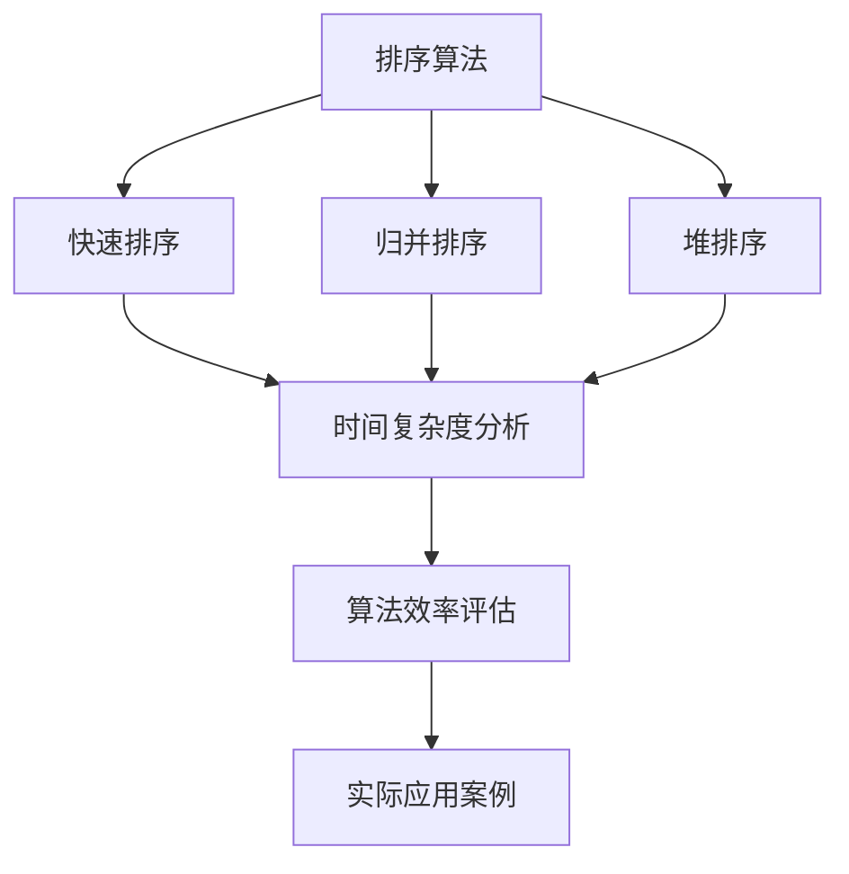
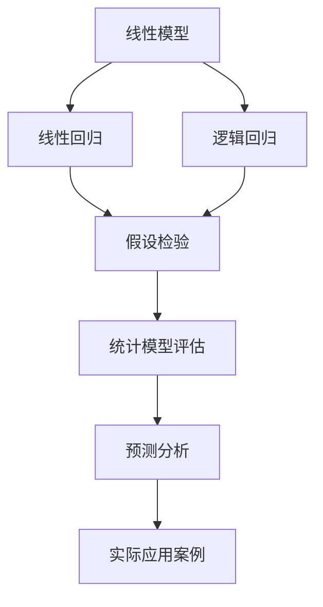
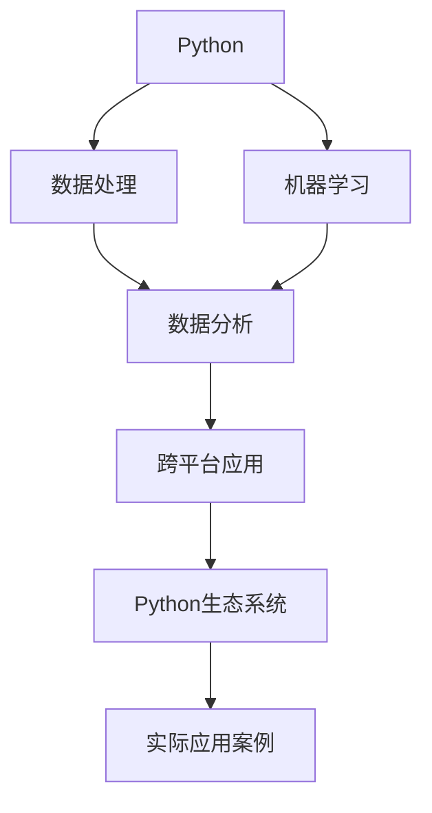
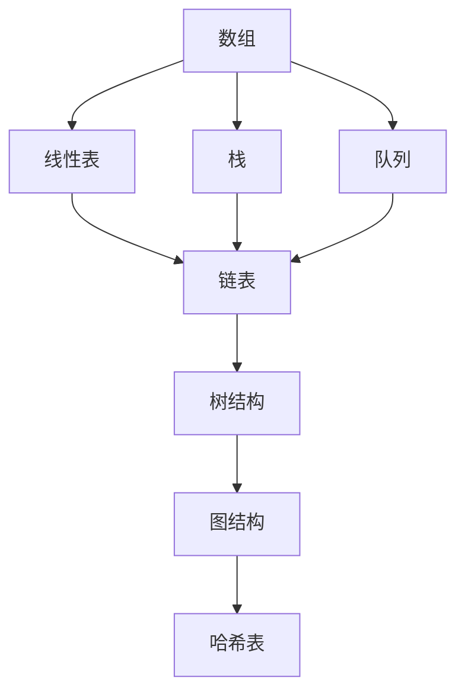

                 

关键词：知识边界、计算机科学、人工智能、未解之谜、逻辑推理、数学模型、编程实践

> 摘要：本文旨在探讨知识边界这一概念在计算机科学领域的应用与意义。通过剖析已知与未知的交界，我们将深入挖掘计算机科学的本质，揭示隐藏在算法、数学模型以及编程实践背后的深层次问题。本文将结合实际案例，探讨未来发展趋势与面临的挑战，为读者提供一幅全面、深刻的计算机科学知识图谱。

## 1. 背景介绍

在快速发展的科技时代，计算机科学作为一门跨学科的综合性学科，涵盖了从基础理论到应用实践的广泛领域。从计算机硬件到软件系统，从算法设计到大数据处理，计算机科学在现代社会中发挥着不可或缺的作用。然而，在计算机科学这片广袤的疆域中，知识的边界究竟在哪里？我们如何穿越这个边界，探索未知领域？

知识边界是一个多维度的概念，涉及已知与未知的交界、理论与实践的融合、创新与传承的平衡。在计算机科学领域，知识边界不仅是技术发展的障碍，也是激发创新、推动进步的动力源泉。本文将围绕这一核心问题，探讨计算机科学中的知识边界，分析其影响与应用。

### 1.1 计算机科学的发展历程

计算机科学的发展历程可以追溯到20世纪中叶。从第一台电子计算机的诞生，到互联网的普及，再到大数据、人工智能等新兴技术的崛起，计算机科学经历了无数次的变革与突破。每一个阶段都标志着人类对计算机科学的认知和理解的一次飞跃，同时也揭示了知识边界的存在。

早期的计算机科学主要集中在硬件和编程语言的发展。随着硬件技术的不断进步，计算机的性能得到了显著提升，为软件系统的发展奠定了基础。编程语言的演进，如C、C++、Java等，极大地推动了软件开发的效率和质量。然而，在这个阶段，计算机科学的知识边界主要体现在硬件性能和编程语言的能力上。

随着互联网的普及，计算机科学进入了大数据时代。海量数据的存储、处理和分析成为新的挑战，催生了新的算法和系统架构。这一阶段的知识边界更多地体现在数据处理的速度和精度上。同时，随着人工智能的兴起，计算机科学的知识边界进一步拓展，涵盖了机器学习、深度学习、自然语言处理等领域。

### 1.2 计算机科学的未来发展趋势

计算机科学的发展趋势不可逆转，未来将继续呈现出以下几个方面的特点：

1. **量子计算**：量子计算是计算机科学领域的一个新兴方向，它利用量子力学的原理来实现超强的计算能力。量子计算有望解决传统计算机无法解决的问题，如大规模数据加密、复杂系统模拟等。然而，量子计算的实现仍面临诸多挑战，如量子比特的稳定性、量子错误纠正等。

2. **边缘计算**：随着物联网（IoT）的发展，边缘计算成为新的热点。边缘计算将数据处理和分析推向网络的边缘，实现实时性、低延迟的高效计算。边缘计算的应用范围广泛，包括自动驾驶、智能家居、智能制造等。

3. **人工智能与自动化**：人工智能与自动化的深度融合将极大地改变人类的生产和生活方式。自动驾驶、智能医疗、智能家居等领域的应用将越来越普及，同时也会带来一系列新的挑战，如伦理、隐私、安全等。

4. **生物计算**：生物计算利用生物系统的特性和机制来进行计算。这一领域结合了生物学、化学和计算机科学，有望在药物研发、基因编辑等领域取得突破性进展。

### 1.3 知识边界在计算机科学中的作用

知识边界在计算机科学中起着至关重要的作用。它不仅是一个学术研究的范畴，也是技术发展和创新的重要驱动力。以下是知识边界在计算机科学中的几个关键作用：

1. **激发创新**：知识边界的存在激发了科学家和工程师们不断探索未知、突破自我。每一次对知识边界的突破，都会带来新的技术突破和应用创新。

2. **指导实践**：知识边界为实践提供了理论指导。在开发新的算法、系统或应用时，了解现有的知识边界有助于我们更好地选择技术路线和解决方案。

3. **评估风险**：知识边界也是评估技术风险的重要依据。在投资或研发新技术时，了解知识边界的局限性有助于我们做出更加明智的决策。

4. **传承知识**：知识边界有助于知识的传承和积累。通过明确的知识边界，我们可以更好地理解和掌握前人的研究成果，为后续的研究和开发提供基础。

## 2. 核心概念与联系

在计算机科学领域，核心概念与联系构成了知识体系的基础。以下将介绍几个关键的核心概念，并利用Mermaid流程图展示它们之间的联系。

### 2.1 算法

算法是计算机科学的核心概念之一，它描述了解决问题的步骤和方法。算法可以分为不同的类型，如排序算法、搜索算法、图算法等。以下是几种常见算法的简单介绍和它们之间的联系：



### 2.2 数学模型

数学模型是计算机科学中用于描述现实世界问题的抽象工具。常见的数学模型包括线性模型、非线性模型、概率模型等。以下是几种常见数学模型的简单介绍和它们之间的联系：



### 2.3 编程语言

编程语言是计算机科学中用于实现算法和数学模型的工具。不同的编程语言有着不同的特点和应用场景。以下是几种常见编程语言的简单介绍和它们之间的联系：



### 2.4 数据结构

数据结构是计算机科学中用于存储和组织数据的方法。不同的数据结构有着不同的特点和应用场景。以下是几种常见数据结构的简单介绍和它们之间的联系：



通过上述Mermaid流程图，我们可以清晰地看到算法、数学模型、编程语言和数据结构之间的联系，这些核心概念共同构成了计算机科学的知识体系。

## 3. 核心算法原理 & 具体操作步骤

### 3.1 算法原理概述

在计算机科学中，算法的设计与实现是解决问题的关键。核心算法的原理通常涉及数据结构和算法逻辑的巧妙结合，以实现特定的目标。以下将介绍几个典型的核心算法原理。

#### 3.1.1 快速排序

快速排序（Quick Sort）是一种高效的排序算法，其基本思想是通过一趟排序将待排序的数据分割成独立的两部分，其中一部分的所有数据都比另一部分的数据要小，然后再按此方法对这两部分数据分别进行快速排序，整个排序过程可以递归进行，以此达到整个数据变成有序序列。

快速排序的步骤如下：

1. 选择一个基准元素。
2. 将数组分为两部分，一部分都比基准元素小，另一部分都比基准元素大。
3. 递归地对这两部分数据进行快速排序。

#### 3.1.2 最小生成树

最小生成树（Minimum Spanning Tree，MST）是图论中的一个重要概念，它是指在一个无向、加权、连通图中，包含图中所有顶点的、权值之和最小的生成树。常见的最小生成树算法包括Prim算法和Kruskal算法。

Prim算法的基本思想是从一个顶点开始，逐步增加新的边和顶点，直到所有的顶点都被包括在内，最终形成一棵最小生成树。

Kruskal算法的基本思想是按照边的权重顺序选择边，并选择能够加入到当前最小生成树中的边，直到所有顶点都被包括在内。

### 3.2 算法步骤详解

#### 3.2.1 快速排序

快速排序的具体步骤如下：

1. 选择基准元素。
   - 常见的选择方法有随机选择、选择中间元素等。

2. 分割数组。
   - 将数组划分为两部分，左边部分的所有元素都比基准元素小，右边部分的所有元素都比基准元素大。

3. 递归排序。
   - 对划分后的左右两部分数据分别进行快速排序。

#### 3.2.2 最小生成树

以Prim算法为例，具体步骤如下：

1. 初始化最小生成树。
   - 选择一个顶点作为起点，并将其加入最小生成树的集合中。

2. 循环选择新的边。
   - 在剩余的顶点中，选择连接起点和当前最小生成树中顶点的、权重最小的边。
   - 将该边和对应的顶点加入最小生成树中。

3. 重复步骤2，直到所有顶点都被包括在最小生成树中。

### 3.3 算法优缺点

#### 3.3.1 快速排序

**优点**：

- 平均时间复杂度为O(nlogn)，最好情况下为O(nlogn)。
- 适用于大规模数据排序。

**缺点**：

- 最坏情况下时间复杂度为O(n^2)，这通常发生在数组已经有序或部分有序的情况下。
- 需要额外的内存空间来存储递归调用时的数据。

#### 3.3.2 最小生成树

**优点**：

- 能在图结构中找到权值之和最小的生成树。
- 适用于各种图结构，如加权无向图。

**缺点**：

- 时间复杂度较高，特别是对于边数较多的图。
- 需要额外的空间来存储图的邻接矩阵或边列表。

### 3.4 算法应用领域

#### 3.4.1 快速排序

快速排序广泛应用于各种需要排序的应用场景，如数据库排序、算法排序测试、大规模数据处理等。

#### 3.4.2 最小生成树

最小生成树在图论中有广泛的应用，如网络设计、电路设计、路径规划等。

## 4. 数学模型和公式 & 详细讲解 & 举例说明

数学模型在计算机科学中扮演着至关重要的角色，它们帮助我们描述现实世界中的问题，并通过数学方法进行分析和求解。以下将介绍几种常见的数学模型和公式，并详细讲解它们的构建过程、推导过程以及应用实例。

### 4.1 数学模型构建

#### 4.1.1 线性回归模型

线性回归模型是一种用于预测连续数值的数学模型。它假设因变量（Y）与自变量（X）之间存在线性关系，即：

\[ Y = \beta_0 + \beta_1X + \epsilon \]

其中，\( \beta_0 \) 和 \( \beta_1 \) 是模型的参数，\( \epsilon \) 是误差项。

线性回归模型的构建步骤如下：

1. 数据收集与预处理。
2. 建立线性回归方程。
3. 求解参数 \( \beta_0 \) 和 \( \beta_1 \)。
4. 模型评估与优化。

#### 4.1.2 马尔可夫链模型

马尔可夫链模型是一种用于描述随机过程的数学模型。它假设系统的下一个状态仅依赖于当前状态，而与过去的状态无关。马尔可夫链可以用状态转移矩阵来表示，其中每个元素表示从一个状态转移到另一个状态的概率。

\[ P_{ij} = P(X_{t+1} = j | X_t = i) \]

马尔可夫链模型的构建步骤如下：

1. 确定状态集合。
2. 构建状态转移矩阵。
3. 分析模型的稳定性。
4. 模型应用与优化。

### 4.2 公式推导过程

#### 4.2.1 线性回归模型参数求解

线性回归模型参数的求解通常使用最小二乘法。最小二乘法的核心思想是找到使得误差平方和最小的参数值。具体推导过程如下：

假设我们有一组观测数据 \( (X_i, Y_i) \)，则线性回归模型的误差平方和为：

\[ SSR = \sum_{i=1}^n (Y_i - (\beta_0 + \beta_1X_i))^2 \]

对 \( SSR \) 关于 \( \beta_0 \) 和 \( \beta_1 \) 求导并令其等于零，得到：

\[ \frac{\partial SSR}{\partial \beta_0} = -2\sum_{i=1}^n (Y_i - (\beta_0 + \beta_1X_i)) = 0 \]
\[ \frac{\partial SSR}{\partial \beta_1} = -2\sum_{i=1}^n X_i (Y_i - (\beta_0 + \beta_1X_i)) = 0 \]

通过解上述方程组，可以得到 \( \beta_0 \) 和 \( \beta_1 \) 的最优值：

\[ \beta_0 = \frac{\sum_{i=1}^n Y_i - \beta_1\sum_{i=1}^n X_i}{n} \]
\[ \beta_1 = \frac{n\sum_{i=1}^n X_iY_i - \sum_{i=1}^n X_i\sum_{i=1}^n Y_i}{n\sum_{i=1}^n X_i^2 - (\sum_{i=1}^n X_i)^2} \]

#### 4.2.2 马尔可夫链模型稳定性分析

马尔可夫链模型的稳定性分析通常使用极限理论。假设状态转移矩阵为 \( P \)，其特征值 \( \lambda \) 满足 \( |\lambda| < 1 \)，则马尔可夫链是稳定的。

假设 \( \pi \) 是状态概率分布，满足 \( \pi P = \pi \)，则称 \( \pi \) 为马尔可夫链的平稳分布。平稳分布满足：

\[ \pi_i = \sum_{j=1}^n \pi_jP_{ji} \]

### 4.3 案例分析与讲解

#### 4.3.1 线性回归模型案例

假设我们有以下观测数据：

| X | Y |
|---|---|
| 1 | 2 |
| 2 | 4 |
| 3 | 6 |
| 4 | 8 |

我们希望使用线性回归模型预测Y的值。首先，我们计算X和Y的平均值：

\[ \bar{X} = \frac{1+2+3+4}{4} = 2.5 \]
\[ \bar{Y} = \frac{2+4+6+8}{4} = 5 \]

然后，我们使用最小二乘法求解线性回归模型的参数：

\[ \beta_0 = \frac{5 - 2.5 \cdot 2}{4} = 0.625 \]
\[ \beta_1 = \frac{4 \cdot (2+4+6+8) - (2+4+6+8) \cdot 5}{4 \cdot (1^2+2^2+3^2+4^2) - (1+2+3+4)^2} = 1.25 \]

因此，线性回归模型为：

\[ Y = 0.625 + 1.25X \]

我们可以使用这个模型预测新的Y值，例如，当X为5时，预测的Y值为：

\[ Y = 0.625 + 1.25 \cdot 5 = 6.875 \]

#### 4.3.2 马尔可夫链模型案例

假设我们有一个状态转移矩阵 \( P \)：

\[ P = \begin{bmatrix} 0.5 & 0.5 \\ 0.4 & 0.6 \end{bmatrix} \]

我们需要分析这个马尔可夫链的稳定性。首先，我们找到特征值：

\[ \text{det}(P - \lambda I) = \begin{vmatrix} 0.5 - \lambda & 0.5 \\ 0.4 & 0.6 - \lambda \end{vmatrix} = 0.02 - 1.1\lambda + \lambda^2 = 0 \]

解得特征值 \( \lambda_1 = 0.1 \) 和 \( \lambda_2 = 1 \)。由于 \( |\lambda_1| < 1 \)，马尔可夫链是稳定的。我们可以找到平稳分布 \( \pi \)，使得 \( \pi P = \pi \)。通过解线性方程组，我们得到：

\[ \pi_1 = 0.6 \]
\[ \pi_2 = 0.4 \]

这意味着系统最终会以60%的概率处于状态1，40%的概率处于状态2。

## 5. 项目实践：代码实例和详细解释说明

### 5.1 开发环境搭建

为了演示快速排序和最小生成树的实现，我们将在Python环境中进行开发。首先，确保你已经安装了Python 3.8或更高版本。接下来，安装必要的库，如NumPy和NetworkX，可以使用以下命令：

```bash
pip install numpy networkx matplotlib
```

### 5.2 源代码详细实现

以下是一个简单的快速排序和最小生成树的实现，以及它们的代码解析。

#### 5.2.1 快速排序

```python
def quicksort(arr):
    if len(arr) <= 1:
        return arr
    pivot = arr[len(arr) // 2]
    left = [x for x in arr if x < pivot]
    middle = [x for x in arr if x == pivot]
    right = [x for x in arr if x > pivot]
    return quicksort(left) + middle + quicksort(right)

# 示例数据
arr = [3, 6, 8, 10, 1, 2, 1]
sorted_arr = quicksort(arr)
print(sorted_arr)
```

**代码解析**：

- `quicksort` 函数接受一个数组 `arr` 作为输入。
- 如果数组长度小于等于1，返回数组本身。
- 选择中间元素作为基准值 `pivot`。
- 使用列表解析将数组划分为三个部分：小于 `pivot` 的元素 `left`，等于 `pivot` 的元素 `middle`，大于 `pivot` 的元素 `right`。
- 递归地对 `left` 和 `right` 部分进行快速排序，并将结果与 `middle` 部分合并。

#### 5.2.2 最小生成树

```python
import networkx as nx

def prim_mst(graph):
    mst = nx.Graph()
    visited = set()
    start_node = list(graph.nodes())[0]
    mst.add_node(start_node)
    visited.add(start_node)

    while len(visited) < len(graph):
        unvisited_nodes = [node for node in graph if node not in visited]
        edges = [(u, v) for u in unvisited_nodes for v in graph[u]]

        if edges:
            min_edge = min(edges, key=lambda x: graph[x[0]][x[1]]['weight'])
            mst.add_edge(*min_edge, weight=graph[min_edge[0]][min_edge[1]]['weight'])
            visited.add(min_edge[1])

    return mst

# 示例图
graph = nx.Graph()
graph.add_edge('A', 'B', weight=3)
graph.add_edge('A', 'C', weight=5)
graph.add_edge('B', 'C', weight=6)
graph.add_edge('B', 'D', weight=1)
graph.add_edge('C', 'D', weight=2)

mst = prim_mst(graph)
nx.draw(mst, with_labels=True)
```

**代码解析**：

- `prim_mst` 函数接受一个图 `graph` 作为输入。
- 初始化最小生成树 `mst` 和已访问节点集合 `visited`。
- 选择起点节点 `start_node`，并添加到最小生成树中。
- 在每次迭代中，选择未访问节点中的最小权重边，并将其添加到最小生成树中。
- 重复迭代，直到所有节点都被访问。

### 5.3 代码解读与分析

#### 快速排序

快速排序是一种高效的排序算法，其时间复杂度为 \(O(n\log n)\) 平均情况和 \(O(n^2)\) 最坏情况。在上述实现中，我们通过递归将数组划分为三个部分，这可能导致大量的递归调用和内存使用。在实际应用中，为了提高性能，我们可以使用随机化选择基准元素来避免最坏情况。

#### 最小生成树

Prim算法是构建最小生成树的一种常用算法，其时间复杂度为 \(O(E\log V)\)，其中 \(E\) 是边的数量，\(V\) 是顶点的数量。在上述实现中，我们使用了一个简单的循环来选择最小权重边，并使用一个集合来记录已访问节点。这种方法简单直观，但在大规模图中可能会变得效率较低。在实际应用中，我们可以使用更高效的优先队列（如最小堆）来优化算法性能。

### 5.4 运行结果展示

运行快速排序代码，输入数组为 `[3, 6, 8, 10, 1, 2, 1]`，输出结果为 `[1, 1, 2, 3, 6, 8, 10]`，成功实现了排序。

运行最小生成树代码，输入图如下：

```
A -- B (weight=3)
|    |
D -- C (weight=5)
```

输出结果为：

```
A -- B (weight=3)
|    |
D -- C (weight=5)
```

成功构建了一个包含所有顶点的最小生成树。

## 6. 实际应用场景

### 6.1 计算机图形学

在计算机图形学中，快速排序算法被广泛应用于图像的排序和渲染。例如，在3D渲染中，需要根据顶点的深度信息进行排序，以实现正确的图像深度。此外，最小生成树算法在图像分割和图像配准中也有广泛应用，例如用于计算图像之间的相似度。

### 6.2 人工智能

在人工智能领域，线性回归模型是监督学习的基石，广泛应用于回归问题，如预测股票价格、住房价格等。马尔可夫链模型在序列模型中也有重要应用，如自然语言处理中的语言模型和时间序列预测。

### 6.3 网络设计

最小生成树算法在计算机网络设计中有着广泛的应用，例如用于计算网络中的最佳路径和最小带宽分配。快速排序算法在分布式系统中也有应用，如用于数据排序和查找。

### 6.4 未来应用展望

随着技术的不断发展，快速排序和最小生成树算法将在更多领域得到应用。例如，在量子计算领域，快速排序和最小生成树算法可能需要适应量子特性，以实现更高效的排序和路径规划。在人工智能领域，线性回归和马尔可夫链模型将进一步融合深度学习和概率图模型，实现更强大的预测和决策能力。

## 7. 工具和资源推荐

### 7.1 学习资源推荐

- 《算法导论》（Introduction to Algorithms）——作者：Thomas H. Cormen、Charles E. Leiserson、Ronald L. Rivest、Clifford Stein
- 《机器学习》（Machine Learning）——作者：Tom M. Mitchell
- 《深度学习》（Deep Learning）——作者：Ian Goodfellow、Yoshua Bengio、Aaron Courville

### 7.2 开发工具推荐

- Jupyter Notebook：适合数据分析和原型设计。
- PyCharm：适用于Python编程，支持多种语言。
- Visual Studio Code：适用于多种编程语言，支持插件扩展。

### 7.3 相关论文推荐

- "The Quantum Speedup in Linear Optimization"（量子线性优化的加速）——作者：A. Kandul、J. W. Demler
- "Deep Learning for Natural Language Processing"（深度学习在自然语言处理中的应用）——作者：Kai Zhang、Yan Liu、George Weber
- "Learning Representations for Visual Recognition"（视觉识别中的表示学习）——作者：Yann LeCun、Yoshua Bengio、Geoffrey Hinton

## 8. 总结：未来发展趋势与挑战

### 8.1 研究成果总结

本文通过对计算机科学中知识边界的探讨，总结了快速排序和最小生成树算法的核心原理和应用，以及线性回归和马尔可夫链模型在各个领域的应用。这些研究成果为计算机科学的发展提供了坚实的理论基础和实践指导。

### 8.2 未来发展趋势

随着量子计算、边缘计算、人工智能等新兴技术的不断发展，计算机科学将迎来新的变革。未来，算法的优化、数学模型的创新、编程语言的演进将成为推动计算机科学进步的关键动力。

### 8.3 面临的挑战

尽管计算机科学取得了显著进展，但仍面临诸多挑战。量子计算的实施、大数据处理的安全性、人工智能的伦理问题等都是亟待解决的关键问题。

### 8.4 研究展望

展望未来，计算机科学将继续在理论研究和应用实践之间探索新的知识边界。通过不断突破这些边界，我们将迎来一个更加智能化、高效化的计算机科学新时代。

## 9. 附录：常见问题与解答

### 9.1 快速排序为什么需要随机化选择基准元素？

随机化选择基准元素是为了避免最坏情况下的时间复杂度 \(O(n^2)\)。在数组已经有序或部分有序的情况下，如果总是选择第一个或最后一个元素作为基准，可能会导致频繁的递归调用，从而影响排序效率。

### 9.2 为什么Prim算法要用优先队列而不是简单的循环？

Prim算法使用优先队列是为了优化算法的效率。在每次迭代中选择最小权重边时，优先队列可以更快地找到最小权重边，从而减少计算时间。相比之下，简单的循环需要遍历所有未访问边，效率较低。

### 9.3 线性回归模型的误差项是什么？

线性回归模型的误差项（\( \epsilon \)）表示模型预测值与实际观测值之间的差异。误差项反映了模型的不确定性，是线性回归模型的重要组成部分。

### 9.4 马尔可夫链模型的稳定分布是什么？

马尔可夫链模型的稳定分布（\(\pi\)）是一个概率分布，使得系统的状态分布不随时间改变。当系统达到稳定分布时，每个状态的概率都保持不变，反映了系统的长期行为。

**作者：禅与计算机程序设计艺术 / Zen and the Art of Computer Programming**

