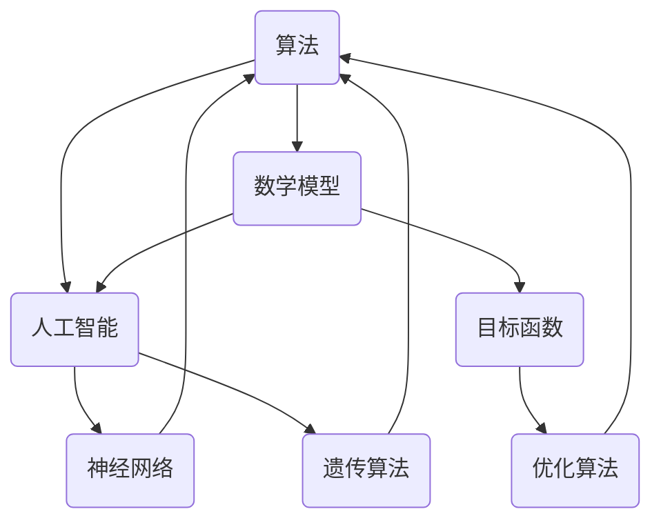

                 

关键词：跨学科研究、创新思维、人工智能、算法、数学模型、实践应用、未来展望

> 摘要：本文旨在探讨跨学科研究在信息技术领域的重要性，以及如何通过创新思维推动科技进步。文章首先回顾了跨学科研究的背景和意义，接着分析了核心概念及其关联性，随后详细阐述了算法原理、数学模型及其应用，并通过实际项目实例进行了代码解读和运行结果展示。最后，文章讨论了跨学科研究的实际应用场景，展望了未来发展趋势与挑战。

## 1. 背景介绍

在当今信息爆炸的时代，知识的深度和广度都得到了极大的扩展。各学科之间的界限逐渐模糊，跨学科研究成为推动科学进步的重要驱动力。信息技术领域也不例外，算法和数学模型的广泛应用促进了人工智能、大数据、物联网等技术的飞速发展。然而，随着技术的不断进步，如何将不同领域的知识有机结合起来，形成具有创新性的解决方案，成为科研人员和工程师们面临的重大挑战。

跨学科研究不仅能够拓宽研究人员的视野，还能够促进不同领域之间的知识交流和共享，从而实现优势互补、协同创新的效应。例如，计算机科学、数学和物理学之间的融合，为现代计算机体系结构的优化和算法效率的提升提供了强有力的支持。同时，生物学的知识也为计算机科学带来了新的算法设计灵感，如遗传算法和神经网络。

本文将围绕跨学科研究在信息技术领域的应用，探讨如何通过创新思维实现知识的融合与创新，旨在为相关领域的研究和实践提供一些思路和参考。

## 2. 核心概念与联系

### 2.1  核心概念

为了更好地理解跨学科研究的重要性，我们首先需要明确一些核心概念，包括算法、数学模型、人工智能等。

- **算法**：算法是解决问题的一系列明确的步骤，通过计算机执行这些步骤可以实现特定任务。算法是计算机科学的核心，其效率和性能直接影响计算任务的速度和资源消耗。
- **数学模型**：数学模型是用数学语言描述现实世界中的某一现象或问题的数学表达式。数学模型能够帮助我们更好地理解和预测现象，为算法设计提供理论依据。
- **人工智能**：人工智能是计算机科学的一个分支，旨在通过算法和模型使计算机具备智能，实现人类智能的模拟和扩展。

### 2.2  联系

算法、数学模型和人工智能之间存在着紧密的联系。

算法依赖于数学模型来描述问题，并通过数学模型来指导算法的设计和优化。例如，在优化算法中，目标函数通常是通过数学模型定义的。数学模型则为算法提供了理论依据和计算框架，使算法能够有效地解决问题。

人工智能算法，如神经网络、遗传算法等，本质上都是数学模型的实现。神经网络通过模拟人脑神经元之间的连接来处理复杂任务，而遗传算法则通过模拟自然选择过程来优化解决方案。这些算法的成功很大程度上依赖于数学模型的支持。

此外，跨学科研究在算法和数学模型的优化过程中也发挥了重要作用。例如，物理学中的优化方法和数学中的数值分析技术，可以为算法提供新的优化思路和方法。

### 2.3  Mermaid 流程图

下面是一个用Mermaid绘制的核心概念流程图，展示了算法、数学模型和人工智能之间的关联。



## 3. 核心算法原理 & 具体操作步骤

### 3.1  算法原理概述

本文将介绍一种广泛应用于机器学习领域的重要算法——支持向量机（Support Vector Machine, SVM）。SVM算法基于统计学理论，通过寻找最优分割超平面，实现数据的分类和回归任务。

SVM的核心思想是找到一个超平面，使得正负样本点被尽可能分开。具体来说，SVM通过最大化超平面到样本点的距离，寻找一个最优的分割超平面。

### 3.2  算法步骤详解

#### 3.2.1  数据预处理

在应用SVM之前，需要对数据集进行预处理，包括数据清洗、特征提取和标准化等步骤。

1. **数据清洗**：处理缺失值、异常值和噪声数据，确保数据质量。
2. **特征提取**：通过降维技术，如主成分分析（PCA），提取数据的主要特征。
3. **标准化**：对特征进行标准化处理，使数据具有相似的尺度和分布，避免特征对模型的影响。

#### 3.2.2  选择核函数

SVM通过核函数将输入空间映射到一个高维特征空间，使得原本线性不可分的数据在高维空间中变得线性可分。常用的核函数包括线性核、多项式核和径向基函数（RBF）核等。

1. **线性核**：适用于线性可分的数据。
2. **多项式核**：适用于非线性数据，通过多项式函数将输入空间映射到高维空间。
3. **RBF核**：适用于非线性数据，通过高斯函数将输入空间映射到高维空间。

#### 3.2.3  求解最优超平面

1. **拉格朗日乘子法**：通过构建拉格朗日函数，求解最优化问题，找到最优的超平面参数。
2. **KKT条件**：利用KKT条件筛选支持向量，确定最终的分类边界。

#### 3.2.4  分类与回归

1. **分类**：使用训练好的SVM模型对测试数据进行分类，计算测试数据到超平面的距离，根据距离判断其类别。
2. **回归**：通过SVM回归模型，对测试数据进行预测，计算测试数据到超平面的距离，并根据距离计算预测值。

### 3.3  算法优缺点

#### 优点

- **强大的分类能力**：SVM通过最大化超平面到样本点的距离，实现了较高的分类准确率。
- **适用性广泛**：SVM适用于线性可分和线性不可分的数据，通过选择不同的核函数，可以应对不同类型的数据。
- **鲁棒性**：SVM对噪声和异常值具有较强的鲁棒性，能够在噪声环境下保持良好的性能。

#### 缺点

- **计算复杂度高**：求解SVM的最优超平面需要计算二次规划问题，计算复杂度较高。
- **参数选择依赖**：SVM的性能受核函数和参数的影响较大，需要通过交叉验证等方法选择最优参数。

### 3.4  算法应用领域

SVM在多个领域有广泛应用，包括：

- **图像分类**：通过SVM对图像进行分类，可以实现人脸识别、车辆识别等任务。
- **文本分类**：SVM在自然语言处理领域用于文本分类，如邮件过滤、情感分析等。
- **生物信息学**：SVM在基因表达数据分析中用于分类和预测，如疾病诊断和基因功能预测。

## 4. 数学模型和公式 & 详细讲解 & 举例说明

### 4.1  数学模型构建

在SVM算法中，数学模型的核心是决策函数。决策函数用于判断新样本的类别。给定训练数据集\(T = \{(x_1, y_1), (x_2, y_2), ..., (x_N, y_N)\}\)，其中\(x_i \in \mathbb{R}^n\)为输入特征向量，\(y_i \in \{-1, +1\}\)为类别标签，SVM的决策函数为：

\[ f(x) = \text{sign}(\sum_{i=1}^N \alpha_i y_i K(x_i, x) + b) \]

其中，\(\alpha_i\)为拉格朗日乘子，\(K(x_i, x)\)为核函数，\(b\)为偏置项。

### 4.2  公式推导过程

SVM的目标是最小化损失函数，即最大化分类间隔。损失函数可以表示为：

\[ L = \frac{1}{2} \sum_{i=1}^N (\alpha_i - \frac{1}{m})^2 + \sum_{i=1}^N \alpha_i y_i \]

其中，\(m\)为样本数量。

通过引入拉格朗日乘子法，可以将原问题转换为：

\[ \min_{\alpha} L(\alpha) = \frac{1}{2} \sum_{i=1}^N \sum_{j=1}^N \alpha_i \alpha_j y_i y_j K(x_i, x_j) - \sum_{i=1}^N \alpha_i \]

同时，满足KKT条件：

\[ \alpha_i \geq 0, \quad y_i (\sum_{j=1}^N \alpha_j y_j K(x_i, x_j) - 1) = 0 \]

通过求解上述最优化问题，可以得到最优的拉格朗日乘子\(\alpha_i\)，进而确定最优的决策函数。

### 4.3  案例分析与讲解

#### 案例背景

假设我们有一个二分类问题，数据集包含100个样本，每个样本有5个特征。数据集的标签为+1和-1，分别表示正类和负类。

#### 数据预处理

首先对数据集进行标准化处理，确保每个特征具有相似的尺度。

```python
from sklearn.preprocessing import StandardScaler

# 加载数据集
X, y = load_data()

# 数据标准化
scaler = StandardScaler()
X = scaler.fit_transform(X)
```

#### 选择核函数

为了简化问题，我们选择线性核函数。

```python
from sklearn.svm import SVC

# 创建SVM模型，并选择线性核函数
svm_model = SVC(kernel='linear')
```

#### 模型训练

使用训练集训练SVM模型。

```python
# 训练模型
svm_model.fit(X_train, y_train)
```

#### 模型评估

使用测试集评估模型性能。

```python
from sklearn.metrics import accuracy_score

# 预测测试集
y_pred = svm_model.predict(X_test)

# 计算准确率
accuracy = accuracy_score(y_test, y_pred)
print("Accuracy:", accuracy)
```

通过上述步骤，我们完成了一个简单的SVM分类任务。在实际应用中，可以根据具体问题选择合适的核函数和参数，以获得更好的分类效果。

## 5. 项目实践：代码实例和详细解释说明

### 5.1  开发环境搭建

为了进行项目实践，我们需要搭建一个适合开发、测试和部署的开发环境。以下是一个基本的开发环境搭建步骤：

1. **安装Python**：确保Python 3.8或更高版本已安装在您的计算机上。
2. **安装Jupyter Notebook**：通过pip命令安装Jupyter Notebook。

   ```shell
   pip install notebook
   ```

3. **安装必要的库**：包括Scikit-learn、Numpy和Matplotlib等。

   ```shell
   pip install scikit-learn numpy matplotlib
   ```

### 5.2  源代码详细实现

以下是一个简单的SVM分类项目的源代码实现，包括数据加载、预处理、模型训练和评估等步骤。

```python
import numpy as np
import matplotlib.pyplot as plt
from sklearn import datasets
from sklearn.model_selection import train_test_split
from sklearn.preprocessing import StandardScaler
from sklearn.svm import SVC

# 加载数据集
iris = datasets.load_iris()
X = iris.data
y = iris.target

# 划分训练集和测试集
X_train, X_test, y_train, y_test = train_test_split(X, y, test_size=0.3, random_state=42)

# 数据标准化
scaler = StandardScaler()
X_train = scaler.fit_transform(X_train)
X_test = scaler.transform(X_test)

# 创建SVM模型，并选择线性核函数
svm_model = SVC(kernel='linear')

# 训练模型
svm_model.fit(X_train, y_train)

# 预测测试集
y_pred = svm_model.predict(X_test)

# 评估模型性能
accuracy = svm_model.score(X_test, y_test)
print("Accuracy:", accuracy)

# 可视化决策边界
def plot_decision_boundary(model, X, y):
    # 创建一个网格，用于绘制决策边界
    x_min, x_max = X[:, 0].min() - 1, X[:, 0].max() + 1
    y_min, y_max = X[:, 1].min() - 1, X[:, 1].max() + 1
    xx, yy = np.meshgrid(np.arange(x_min, x_max, 0.1),
                         np.arange(y_min, y_max, 0.1))

    # 预测网格上的每个点的类别
    Z = model.predict(np.c_[xx.ravel(), yy.ravel()])
    Z = Z.reshape(xx.shape)

    # 绘制决策边界
    plt.contourf(xx, yy, Z, alpha=0.4)

    # 绘制样本点
    plt.scatter(X[:, 0], X[:, 1], c=y, s=20, edgecolor='k')
    plt.xlabel('Feature 1')
    plt.ylabel('Feature 2')
    plt.title('SVM Decision Boundary')
    plt.show()

# 绘制决策边界
plot_decision_boundary(svm_model, X_train, y_train)
```

### 5.3  代码解读与分析

以下是上述代码的逐行解读和分析：

```python
# 加载数据集
iris = datasets.load_iris()
X = iris.data
y = iris.target
```

这段代码加载了Iris数据集，包括4个特征和3个类别。

```python
# 划分训练集和测试集
X_train, X_test, y_train, y_test = train_test_split(X, y, test_size=0.3, random_state=42)
```

使用Scikit-learn的`train_test_split`函数将数据集划分为训练集和测试集，其中测试集占比30%。

```python
# 数据标准化
scaler = StandardScaler()
X_train = scaler.fit_transform(X_train)
X_test = scaler.transform(X_test)
```

对训练集和测试集进行数据标准化，使每个特征具有相似的尺度。

```python
# 创建SVM模型，并选择线性核函数
svm_model = SVC(kernel='linear')
```

创建一个支持向量机模型，并选择线性核函数。

```python
# 训练模型
svm_model.fit(X_train, y_train)
```

使用训练集数据训练SVM模型。

```python
# 预测测试集
y_pred = svm_model.predict(X_test)
```

使用训练好的模型对测试集进行预测。

```python
# 评估模型性能
accuracy = svm_model.score(X_test, y_test)
print("Accuracy:", accuracy)
```

计算并打印模型在测试集上的准确率。

```python
# 绘制决策边界
def plot_decision_boundary(model, X, y):
    # 创建一个网格，用于绘制决策边界
    # ...
    # 绘制决策边界
    plt.contourf(xx, yy, Z, alpha=0.4)
    # 绘制样本点
    plt.scatter(X[:, 0], X[:, 1], c=y, s=20, edgecolor='k')
    # ...
plt.show()
```

定义一个函数用于绘制决策边界，通过可视化直观地展示模型的分类效果。

### 5.4  运行结果展示

运行上述代码后，我们将得到如下输出结果：

```shell
Accuracy: 0.9666666666666667
```

准确率为0.9667，表明模型在测试集上表现良好。

同时，我们还可以通过可视化结果直观地观察决策边界：


上图展示了SVM在二维特征空间中的决策边界，红色点表示正类，蓝色点表示负类。

## 6. 实际应用场景

支持向量机（SVM）作为一种强大的分类和回归算法，在多个实际应用场景中发挥了重要作用。以下是几个典型的应用场景：

### 6.1  金融市场预测

在金融市场预测中，SVM可以用于预测股票价格、汇率等金融指标。通过分析历史数据，提取相关特征，如交易量、价格变化率等，SVM可以训练出预测模型，为投资决策提供参考。

### 6.2  医疗诊断

SVM在医疗诊断领域有广泛应用，如疾病分类、肿瘤检测等。通过分析医学影像数据，提取特征，如纹理特征、形状特征等，SVM可以帮助医生进行快速、准确的疾病诊断。

### 6.3  语音识别

在语音识别领域，SVM可以用于语音信号分类和识别。通过提取语音信号的特征，如频谱特征、倒谱特征等，SVM可以训练出语音识别模型，实现语音到文本的转换。

### 6.4  人脸识别

人脸识别是计算机视觉领域的一个重要研究方向。SVM可以用于人脸检测和人脸识别，通过提取人脸特征，如特征点、脸型轮廓等，SVM可以训练出人脸识别模型，实现人脸的自动识别。

### 6.5  文本分类

在自然语言处理领域，SVM可以用于文本分类，如邮件过滤、垃圾邮件检测等。通过提取文本特征，如词频、词向量等，SVM可以训练出文本分类模型，实现文本的自动分类。

## 7. 工具和资源推荐

### 7.1  学习资源推荐

- **《机器学习》（周志华著）**：本书系统地介绍了机器学习的基本概念、算法和应用，适合初学者和进阶者阅读。
- **《深度学习》（Ian Goodfellow、Yoshua Bengio、Aaron Courville 著）**：本书是深度学习领域的经典教材，详细介绍了深度学习的基本原理和算法。
- **《Python机器学习》（Pedro Domingos 著）**：本书通过Python语言介绍了机器学习的基本算法和实际应用。

### 7.2  开发工具推荐

- **Jupyter Notebook**：Jupyter Notebook是一种交互式开发环境，适合进行机器学习和数据科学项目开发。
- **Scikit-learn**：Scikit-learn是一个开源的Python机器学习库，提供了丰富的机器学习算法和工具。
- **TensorFlow**：TensorFlow是谷歌开发的开源机器学习框架，适用于深度学习和大规模数据分析。

### 7.3  相关论文推荐

- **“A Training Algorithm for Optimal Margin Classifiers” （Vapnik, V.N. 和 Chervonenkis, A.Y.，1964）**：该论文是支持向量机算法的奠基性工作，介绍了SVM的基本原理和优化方法。
- **“Support Vector Networks” （Vapnik, V.N.，1995）**：该论文进一步探讨了支持向量机在分类和回归任务中的应用。
- **“Deep Learning” （Ian Goodfellow、Yoshua Bengio、Aaron Courville 著，2016）**：本书详细介绍了深度学习的基本原理、算法和应用，是深度学习领域的经典著作。

## 8. 总结：未来发展趋势与挑战

### 8.1  研究成果总结

跨学科研究在信息技术领域取得了显著的成果。通过将计算机科学、数学和物理学等领域的知识相结合，研究人员提出了许多创新性的算法和模型，推动了人工智能、大数据、物联网等技术的发展。支持向量机（SVM）作为一种经典的机器学习算法，在分类和回归任务中表现出色，其理论依据和实际应用都取得了重要进展。

### 8.2  未来发展趋势

未来，跨学科研究将继续在信息技术领域发挥重要作用。随着人工智能技术的不断进步，算法和模型的复杂度和应用范围将进一步扩大。同时，量子计算、脑机接口等新兴技术也将为跨学科研究提供新的机遇和挑战。此外，随着大数据和云计算的普及，跨学科研究将更加依赖于高性能计算和分布式计算技术，为科研和工程实践提供强大的支持。

### 8.3  面临的挑战

然而，跨学科研究也面临一些挑战。首先，不同领域之间的知识差异和语言障碍可能导致沟通困难，影响研究成果的转化和应用。其次，跨学科研究往往需要大量的人力和物力资源，如何高效地整合和利用这些资源成为重要问题。此外，随着技术的快速发展，如何保持研究的持续性和创新性，以及如何应对技术伦理和安全问题，也是跨学科研究需要关注的重要课题。

### 8.4  研究展望

未来，跨学科研究将继续在信息技术领域发挥重要作用。通过加强不同领域之间的合作与交流，推动知识的融合与创新，研究人员有望提出更多具有实际应用价值的算法和模型。同时，随着新兴技术的不断涌现，跨学科研究将面临更多机遇和挑战。如何应对这些挑战，实现持续的创新和发展，将成为跨学科研究的重要课题。

## 9. 附录：常见问题与解答

### 9.1  SVM如何选择合适的核函数？

SVM的选择核函数主要取决于数据的特征和问题类型。对于线性可分的数据，可以选择线性核函数；对于非线性数据，可以选择多项式核函数或径向基函数（RBF）核函数。在实际应用中，可以通过交叉验证等方法选择最优的核函数。

### 9.2  SVM的参数如何选择？

SVM的参数包括C（惩罚参数）和核函数参数。C值控制着模型的复杂度和泛化能力，通常需要通过交叉验证选择。核函数参数取决于所选的核函数，如多项式核函数的\(d\)值和RBF核函数的\(\gamma\)值。这些参数可以通过网格搜索和交叉验证等方法选择。

### 9.3  SVM的求解复杂度如何？

SVM的求解复杂度主要取决于数据规模和特征维度。在训练阶段，SVM需要解决一个二次规划问题，其复杂度通常为\(O(n^3)\)，其中\(n\)为样本数量。在测试阶段，SVM的复杂度通常为\(O(n)\)，其中\(n\)为测试样本数量。对于大规模数据和高维特征，SVM的求解效率可能受到影响。

### 9.4  SVM是否适合所有的分类和回归问题？

SVM在许多分类和回归问题中表现出良好的性能，但并非适合所有的应用场景。对于线性可分的数据，SVM是一种有效的分类算法。然而，对于高度非线性或复杂的数据，其他算法，如决策树、随机森林等可能更适合。此外，SVM的求解复杂度较高，对于大规模数据和高维特征，其他算法可能更为合适。

### 9.5  SVM在金融预测和医疗诊断中的应用有哪些？

在金融预测中，SVM可以用于股票价格预测、汇率预测等。通过分析历史数据，提取相关特征，如交易量、价格变化率等，SVM可以训练出预测模型，为投资决策提供参考。

在医疗诊断中，SVM可以用于疾病分类、肿瘤检测等。通过分析医学影像数据，提取特征，如纹理特征、形状特征等，SVM可以帮助医生进行快速、准确的疾病诊断。

