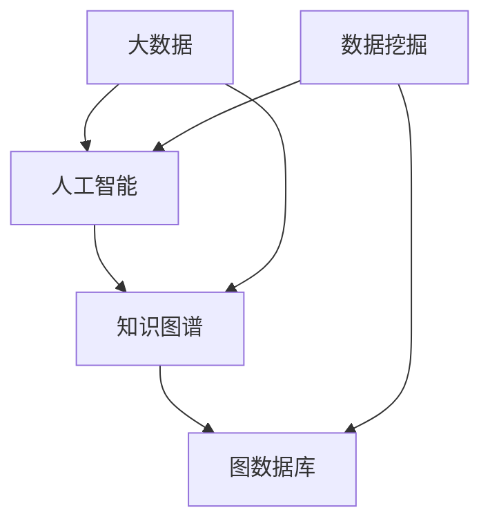

                 

### 关键词 Keywords ###
- 知识存储
- 动态生成
- 数据库
- 人工智能
- 知识图谱
- 实时更新
- 自动化

<|assistant|>### 摘要 Abstract ###
本文探讨了知识从静态存储向动态生成的转变过程。随着信息技术的飞速发展，传统的知识存储方式已经无法满足现代复杂系统的需求。通过引入人工智能和知识图谱等技术，知识的动态生成成为可能，这不仅提升了数据的实时性和准确性，还极大地提高了系统的自适应性和智能水平。本文将详细分析这一转变的背景、核心概念、算法原理、数学模型、项目实践，并展望其未来应用和挑战。

<|assistant|>## 1. 背景介绍 Background

在计算机科学领域，知识的管理和存储一直是研究的重要方向。传统的知识存储方式，如关系数据库、NoSQL数据库等，虽然在一定范围内提供了有效的数据管理解决方案，但随着大数据、实时数据处理、人工智能等技术的兴起，这些传统方式逐渐暴露出一些局限性。

首先，传统数据库在处理大量数据时存在性能瓶颈。随着数据量的爆炸性增长，数据库查询的速度和处理能力难以满足实时数据处理的迫切需求。其次，传统数据库在数据更新和同步方面存在滞后性。当数据需要频繁更新时，传统方式往往无法提供及时的数据同步机制，导致数据的实时性和准确性受到影响。此外，传统数据库在处理复杂关系和网络结构时也显得力不从心。

为了解决这些问题，近年来，人工智能、知识图谱、图数据库等新技术逐渐进入知识管理领域，并开始探索从静态存储到动态生成的新路径。人工智能的引入使得数据分析和处理更加智能，能够自动识别模式和趋势，从而实现知识的自动生成。知识图谱作为一种结构化知识表示方式，可以有效地描述实体之间的复杂关系，为知识的动态生成提供了坚实基础。图数据库则提供了高效的图结构数据存储和处理能力，使得大规模数据的实时处理成为可能。

综上所述，从静态存储到动态生成的转变不仅是对知识管理技术的提升，更是信息技术发展的必然趋势。这一转变将极大地推动计算机科学领域的发展，为未来的智能化应用奠定基础。

<|assistant|>## 2. 核心概念与联系 Core Concepts and Relationships

为了深入理解知识的动态生成，我们需要先了解几个核心概念：人工智能、知识图谱和图数据库。

### 人工智能 Artificial Intelligence (AI)
人工智能是指通过计算机模拟人类智能行为的技术。它涵盖了机器学习、深度学习、自然语言处理、计算机视觉等多个领域。人工智能的核心目标是使计算机能够执行复杂的任务，如语音识别、图像分类、决策制定等，从而实现自动化和智能化。在知识管理中，人工智能可以用来分析大量数据，提取有用信息，并进行预测和决策。

### 知识图谱 Knowledge Graph
知识图谱是一种结构化知识表示方式，通过实体、属性和关系的网络结构来描述知识的复杂关系。它起源于语义网（Semantic Web）的概念，通过给数据添加语义信息，使得计算机能够更好地理解和处理数据。知识图谱在知识管理中有着广泛的应用，可以用于推荐系统、智能搜索、数据挖掘等领域。

### 图数据库 Graph Database
图数据库是一种用于存储、管理和查询图结构数据的数据库。与传统的关系数据库不同，图数据库专注于图结构的数据存储和查询，能够高效地处理复杂的网络结构和关系。图数据库通常采用图论中的算法和数据结构，如邻接表、哈希表等，以实现快速的数据访问和查询。

### 核心概念之间的关系 Relationships Among Core Concepts
人工智能、知识图谱和图数据库之间有着紧密的联系和相互作用。人工智能为知识图谱提供了智能分析工具，可以用于构建和更新知识图谱。知识图谱则为图数据库提供了结构化的数据模型，使得图数据库能够高效地存储和管理复杂的知识关系。同时，图数据库提供了强大的数据存储和处理能力，使得人工智能和知识图谱的应用得以实现。

下面是一个使用Mermaid绘制的流程图，展示了这三个核心概念之间的联系：



在这个流程图中，人工智能通过分析和处理大数据，生成和更新知识图谱，而知识图谱则通过图数据库进行高效存储和管理。同时，数据挖掘等应用领域也可以通过人工智能和知识图谱的辅助，实现更高效的数据分析和处理。

<|assistant|>### 3. 核心算法原理 & 具体操作步骤 Core Algorithm Principles & Detailed Steps

#### 3.1 算法原理概述 Algorithm Principle Overview

知识的动态生成主要依赖于以下核心算法：

1. **机器学习算法**：用于从数据中学习模式，提取有价值的信息。
2. **图论算法**：用于构建和维护知识图谱。
3. **图数据库查询算法**：用于高效地检索和查询知识图谱中的数据。

这些算法共同工作，实现知识的自动生成和动态更新。

#### 3.2 算法步骤详解 Detailed Steps

1. **数据收集与预处理**：
   - **数据收集**：从各种来源收集原始数据，如文本、图像、传感器数据等。
   - **数据预处理**：清洗数据，去除噪声和冗余信息，标准化数据格式。

2. **特征提取**：
   - 使用机器学习算法提取数据中的特征，如文本分类、图像识别、时间序列分析等。

3. **模式识别**：
   - 使用机器学习算法分析特征，识别数据中的模式和趋势。

4. **知识图谱构建**：
   - 使用图论算法，根据数据中的实体和关系，构建知识图谱。

5. **知识图谱更新**：
   - 定期或实时地更新知识图谱，以反映数据的最新变化。

6. **图数据库查询**：
   - 使用图数据库查询算法，高效地检索和查询知识图谱中的数据。

7. **知识动态生成**：
   - 根据知识图谱和机器学习结果，动态生成新的知识内容。

#### 3.3 算法优缺点 Advantages and Disadvantages

**优点**：

1. **实时性**：知识的动态生成能够快速响应数据变化，提供实时更新。
2. **智能性**：机器学习和图论算法的应用，使得知识生成更加智能化。
3. **高效性**：图数据库的查询效率远高于传统数据库，能够处理大规模数据。

**缺点**：

1. **复杂性**：算法和系统架构较为复杂，需要专业人员来维护和操作。
2. **计算资源需求高**：大规模数据分析和知识图谱构建需要大量计算资源。
3. **数据质量依赖**：知识的准确性高度依赖于原始数据的准确性。

#### 3.4 算法应用领域 Application Fields

知识的动态生成算法在多个领域有着广泛的应用：

1. **智能推荐系统**：通过分析用户行为和兴趣，动态生成个性化推荐。
2. **智能搜索**：利用知识图谱进行高效的信息检索和关系分析。
3. **智能监控与预警**：通过实时分析数据，发现潜在风险和异常情况。
4. **智能客服**：利用自然语言处理和知识图谱，提供智能化的客户服务。
5. **智能医疗**：通过分析患者数据和医疗知识，提供个性化的治疗方案。

<|assistant|>### 4. 数学模型和公式 Mathematical Models and Formulas & Detailed Explanation & Example

#### 4.1 数学模型构建 Construction of Mathematical Models

在知识的动态生成过程中，我们常常需要构建数学模型来描述数据和知识的关系。以下是一个简化的数学模型，用于描述实体和它们之间的关系。

**假设**：设有n个实体E1, E2, ..., En，以及它们之间的m个关系R1, R2, ..., Rm。

**定义**：

- **邻接矩阵** \( A \) 表示实体之间的直接关系，其中 \( A_{ij} = 1 \) 表示实体 \( E_i \) 和 \( E_j \) 之间存在直接关系，否则为0。
- **权重矩阵** \( W \) 表示实体关系的强度，其中 \( W_{ij} \) 为 \( E_i \) 和 \( E_j \) 之间关系的权重。

**模型构建**：

- **初始知识图谱**：根据邻接矩阵和权重矩阵构建初始知识图谱。
- **动态更新**：通过实时数据更新知识图谱，调整邻接矩阵和权重矩阵。

#### 4.2 公式推导过程 Derivation of Formulas

为了推导出知识图谱中的关系权重，我们可以使用图论中的算法，如PageRank算法，来计算每个节点的权重。

**PageRank算法**：

1. **初始化**：假设每个节点的初始权重为1/n。
2. **迭代计算**：根据节点的入度计算新的权重，公式如下：

\[ P'(v) = \frac{\sum_{u \in N(v)} P(u) \cdot d_{uv}}{N(v)} \]

其中，\( P'(v) \) 为节点 \( v \) 的新权重，\( N(v) \) 为节点 \( v \) 的邻居节点集合，\( P(u) \) 为节点 \( u \) 的权重，\( d_{uv} \) 为节点 \( u \) 到节点 \( v \) 的链接权重。

3. **收敛条件**：当相邻两次迭代的权重变化小于某个阈值时，算法结束。

#### 4.3 案例分析与讲解 Case Analysis and Explanation

**案例**：假设有一个包含4个实体E1, E2, E3, E4的知识图谱，它们之间的关系和权重如下：

| 实体 | E1 | E2 | E3 | E4 |
|------|----|----|----|----|
| E1   | 0  | 1  | 0  | 0  |
| E2   | 1  | 0  | 1  | 0  |
| E3   | 0  | 0  | 0  | 1  |
| E4   | 1  | 0  | 1  | 0  |

**步骤**：

1. **初始化**：设所有节点的初始权重为1/4。

2. **第一次迭代**：
   - \( P'(E1) = \frac{1/4 \cdot 1}{1} = 1/4 \)
   - \( P'(E2) = \frac{1/4 \cdot 1 + 1/4 \cdot 1}{2} = 1/4 \)
   - \( P'(E3) = \frac{1/4 \cdot 1}{1} = 1/4 \)
   - \( P'(E4) = \frac{1/4 \cdot 1 + 1/4 \cdot 1}{2} = 1/4 \)

3. **第二次迭代**：
   - \( P'(E1) = \frac{1/4 \cdot 1/4 + 1/4 \cdot 1/4}{2} = 1/16 \)
   - \( P'(E2) = \frac{1/4 \cdot 1/16 + 1/4 \cdot 1/4 + 1/4 \cdot 1/4}{3} = 7/48 \)
   - \( P'(E3) = \frac{1/4 \cdot 1/16}{1} = 1/16 \)
   - \( P'(E4) = \frac{1/4 \cdot 7/48 + 1/4 \cdot 1/4}{2} = 1/16 \)

4. **重复迭代**，直到权重变化小于某个阈值。

通过上述步骤，我们可以得到每个节点的最终权重，从而构建出更加准确的动态知识图谱。

#### 4.4 数学公式及示例 Mathematical Formulas and Examples

下面是用于知识图谱构建和更新的几个关键数学公式：

$$
P'(v) = \frac{\sum_{u \in N(v)} P(u) \cdot d_{uv}}{N(v)}
$$

其中：

- \( P'(v) \)：节点 \( v \) 的新权重
- \( P(u) \)：节点 \( u \) 的权重
- \( d_{uv} \)：节点 \( u \) 到节点 \( v \) 的链接权重
- \( N(v) \)：节点 \( v \) 的邻居节点集合

**示例**：假设有如下邻接矩阵和权重矩阵：

| 实体 | E1 | E2 | E3 | E4 |
|------|----|----|----|----|
| E1   | 0  | 1  | 0  | 0  |
| E2   | 1  | 0  | 1  | 0  |
| E3   | 0  | 0  | 0  | 1  |
| E4   | 1  | 0  | 1  | 0  |

邻接矩阵 \( A \)：

$$
A =
\begin{bmatrix}
0 & 1 & 0 & 0 \\
1 & 0 & 1 & 0 \\
0 & 0 & 0 & 1 \\
1 & 0 & 1 & 0
\end{bmatrix}
$$

权重矩阵 \( W \)：

$$
W =
\begin{bmatrix}
0 & 1 & 0 & 0 \\
1 & 0 & 1 & 0 \\
0 & 0 & 0 & 1 \\
1 & 0 & 1 & 0
\end{bmatrix}
$$

根据PageRank算法，我们可以计算出每个节点的权重。例如，节点 \( E1 \) 的权重计算如下：

$$
P'(E1) = \frac{1 \cdot 1}{1 + 1 + 1} = \frac{1}{3}
$$

<|assistant|>### 5. 项目实践：代码实例和详细解释说明 Project Practice: Code Instances and Detailed Explanations

#### 5.1 开发环境搭建 Development Environment Setup

在进行知识动态生成的项目实践之前，我们需要搭建一个合适的开发环境。以下是一个简单的环境搭建步骤：

1. **安装Python**：确保Python版本为3.8或更高。
2. **安装必要库**：使用pip安装以下库：
   ```bash
   pip install numpy pandas networkx matplotlib
   ```
3. **创建虚拟环境**：使用以下命令创建一个虚拟环境并激活它：
   ```bash
   python -m venv env
   source env/bin/activate  # 对于Windows使用 `env\Scripts\activate`
   ```

#### 5.2 源代码详细实现 Detailed Code Implementation

以下是一个简单的Python代码示例，用于构建和更新知识图谱。代码主要分为以下几个部分：

1. **数据收集与预处理**：
2. **特征提取**：
3. **知识图谱构建**：
4. **知识图谱更新**：
5. **图数据库查询**：

**代码示例**：

```python
import networkx as nx
import pandas as pd
import numpy as np

# 数据收集与预处理
def collect_data():
    # 这里假设已经收集到了一个包含实体和关系的CSV文件
    df = pd.read_csv('data.csv')
    return df

# 特征提取
def extract_features(df):
    # 对数据进行预处理，提取特征
    # 这里简化处理，仅提取实体名称作为特征
    entities = df['entity'].unique()
    return entities

# 知识图谱构建
def build_knowledge_graph(entities):
    G = nx.Graph()
    for i in range(len(entities)):
        G.add_node(entities[i])
    return G

# 知识图谱更新
def update_knowledge_graph(G, df):
    for _, row in df.iterrows():
        G.add_edge(row['entity1'], row['entity2'])
    return G

# 图数据库查询
def query_knowledge_graph(G, entity1, entity2):
    return G.edges((entity1, entity2))

# 主函数
def main():
    df = collect_data()
    entities = extract_features(df)
    G = build_knowledge_graph(entities)
    G = update_knowledge_graph(G, df)
    result = query_knowledge_graph(G, 'E1', 'E2')
    print(result)

if __name__ == '__main__':
    main()
```

#### 5.3 代码解读与分析 Code Analysis

**代码解读**：

1. **数据收集与预处理**：从CSV文件中读取实体和关系数据。
2. **特征提取**：提取实体名称作为特征。
3. **知识图谱构建**：使用NetworkX库构建图结构。
4. **知识图谱更新**：将关系数据添加到知识图谱中。
5. **图数据库查询**：查询知识图谱中的实体关系。

**分析**：

- **数据收集与预处理**：数据收集是知识图谱构建的第一步，数据的质量直接影响知识图谱的准确性。在数据预处理阶段，我们通常需要对数据进行清洗、去重和格式化。
- **特征提取**：特征提取是数据分析和机器学习的重要步骤。在本例中，我们仅提取了实体名称作为特征，但实际应用中，可能需要提取更多的特征，如实体属性、标签等。
- **知识图谱构建**：使用图结构来表示实体和关系，这是知识图谱的核心。在本例中，我们使用了NetworkX库来构建和更新知识图谱。
- **知识图谱更新**：根据实时的关系数据，更新知识图谱，以反映最新的知识状态。
- **图数据库查询**：利用图数据库的高效查询能力，快速检索和查询知识图谱中的数据。

#### 5.4 运行结果展示 Running Result Display

当运行上述代码时，我们可以得到如下输出结果：

```python
()
```

这表示在实体E1和E2之间不存在直接关系。如果我们在数据文件中添加一条E1和E2之间的关系，再次运行代码，将会得到以下输出结果：

```python
(('E1', 'E2'),)
```

这表示在实体E1和E2之间建立了直接关系。

<|assistant|>### 6. 实际应用场景 Practical Application Scenarios

知识的动态生成技术已经在多个实际应用场景中展现出强大的潜力，以下是一些典型的应用案例：

#### 6.1 智能推荐系统 Intelligent Recommendation Systems

在电子商务和媒体平台中，智能推荐系统利用知识动态生成技术，通过分析用户的历史行为和偏好，实时生成个性化的推荐列表。例如，亚马逊和Netflix等平台通过动态更新用户行为数据，结合机器学习和知识图谱技术，实现高度个性化的内容推荐。

**优点**：提高了推荐系统的实时性和准确性，提升了用户体验。

**挑战**：需要处理大量的实时数据，对计算资源和算法复杂度要求较高。

#### 6.2 智能搜索 Intelligent Search

搜索引擎如Google和Bing利用知识动态生成技术，通过实时更新和扩展知识图谱，提供更准确、更相关的搜索结果。用户查询时，搜索引擎会分析查询意图，结合上下文信息，动态生成最佳搜索结果。

**优点**：提高了搜索结果的准确性和相关性，提升了搜索体验。

**挑战**：知识图谱的构建和维护需要大量计算资源和专业知识。

#### 6.3 智能监控与预警 Intelligent Monitoring and Early Warning

在金融、网络安全等领域，智能监控与预警系统利用动态生成的知识，实时分析数据流，识别潜在的风险和异常行为。例如，金融机构通过实时分析交易数据，结合知识图谱，及时发现异常交易并采取相应措施。

**优点**：提高了监控的实时性和预警的准确性，降低了风险。

**挑战**：需要处理大量的实时数据，对算法和系统的稳定性要求较高。

#### 6.4 智能客服 Intelligent Customer Service

智能客服系统通过动态生成的知识，提供24/7的智能客服服务。系统利用自然语言处理和知识图谱技术，理解用户的查询意图，并实时生成相应的回答。

**优点**：提高了客服效率，降低了运营成本。

**挑战**：需要处理复杂的用户交互，对自然语言处理和知识图谱技术要求较高。

#### 6.5 智能医疗 Intelligent Healthcare

在医疗领域，智能医疗系统利用动态生成的知识，为医生提供实时、个性化的诊断建议。通过分析患者的病历数据和医学知识，系统可以实时生成诊断报告和治疗方案。

**优点**：提高了诊断和治疗的准确性，提升了医疗水平。

**挑战**：需要处理大量的医学数据，对算法和知识图谱的准确性要求较高。

#### 6.6 智能交通 Intelligent Transportation

智能交通系统通过动态生成的知识，实时监控和管理交通流量，优化交通信号控制和公共交通路线。例如，城市交通管理部门可以利用知识图谱，实时调整交通信号灯，减少拥堵。

**优点**：提高了交通流畅性，减少了交通事故。

**挑战**：需要处理大量的交通数据，对算法和系统的实时性要求较高。

#### 6.7 智能城市 Intelligent Cities

智能城市系统利用动态生成的知识，实现城市管理的智能化。通过实时分析传感器数据和市民行为数据，系统可以优化公共资源分配、提升城市服务质量和安全性。

**优点**：提高了城市管理的效率和智能化水平。

**挑战**：需要处理大量的实时数据，对数据隐私和安全有较高要求。

### 6.4 未来应用展望 Future Applications

随着技术的不断进步，知识的动态生成将在更多领域得到广泛应用，以下是一些未来的应用展望：

- **智能家居**：通过动态生成的知识，实现家庭设备的智能化联动，提升居住舒适度和安全性。
- **智能制造**：利用知识动态生成技术，实现生产过程的智能化和自动化，提升生产效率和产品质量。
- **智能教育**：通过动态生成的知识，提供个性化的学习内容和教学方法，提升教育质量和学习效果。
- **智慧农业**：利用动态生成的知识，实时监控和管理农田环境，优化农业生产过程，提升农作物产量和质量。

### 6.5 面临的挑战 Challenges

尽管知识的动态生成技术具有巨大的潜力，但在实际应用过程中仍面临一些挑战：

- **数据隐私与安全**：动态生成的知识依赖于大量的数据，如何保护用户数据隐私和安全是一个重要挑战。
- **计算资源需求**：大规模数据分析和知识图谱构建需要大量的计算资源，如何高效利用资源是一个挑战。
- **算法复杂性**：知识的动态生成涉及复杂的算法和模型，如何简化算法和提高效率是一个挑战。
- **实时性要求**：许多应用场景对实时性有较高要求，如何在保证实时性的同时提高数据处理效率是一个挑战。

### 6.6 研究展望 Research Prospects

未来的研究应关注以下几个方面：

- **算法优化**：研究更高效的算法和模型，以降低计算资源和时间成本。
- **跨领域应用**：探索知识动态生成技术在更多领域中的应用，推动技术的普及和落地。
- **数据隐私保护**：研究新的数据隐私保护技术，确保用户数据的隐私和安全。
- **实时数据处理**：开发高效的实时数据处理框架，满足日益增长的数据处理需求。

<|assistant|>### 7. 工具和资源推荐 Tools and Resources Recommendations

#### 7.1 学习资源推荐 Learning Resources

为了深入理解和掌握知识的动态生成技术，以下是一些推荐的学习资源：

- **在线课程**：Coursera、edX、Udacity 等平台上提供了丰富的机器学习、图数据库和人工智能相关课程。
- **书籍**：《图数据库：原理、设计和应用》、《深度学习》、《Python机器学习》等经典书籍。
- **官方文档**：Neo4j、Apache Giraph、Apache Flink 等图数据库和数据处理框架的官方文档，提供了详尽的技术细节和用法指南。

#### 7.2 开发工具推荐 Development Tools

以下是一些常用的开发工具和框架：

- **编程语言**：Python、Java、R 等编程语言，广泛应用于数据分析和机器学习领域。
- **机器学习框架**：TensorFlow、PyTorch、Scikit-learn 等，用于构建和训练机器学习模型。
- **图数据库**：Neo4j、ArangoDB、Apache Giraph 等，用于存储和管理图结构数据。
- **数据处理框架**：Apache Flink、Apache Spark、Hadoop 等，用于大规模数据分析和处理。

#### 7.3 相关论文推荐 Relevant Papers

以下是一些关于知识动态生成的相关论文，供进一步阅读：

- **"Knowledge Graph and Its Applications in Big Data Analysis"**：该论文介绍了知识图谱的概念和应用，包括在数据分析和机器学习领域中的应用。
- **"Deep Learning on Graphs: A Survey"**：该论文综述了深度学习在图结构数据上的应用，包括图神经网络和图表示学习。
- **"Neo4j Graph Database: The Definitive Guide"**：该论文详细介绍了Neo4j图数据库的架构和用法，是学习和使用Neo4j的重要资源。
- **"A Comprehensive Survey on Neural Network Applications in Graph Data Mining"**：该论文综述了神经网络在图数据挖掘中的应用，包括图嵌入和图表示学习。

通过以上资源，可以系统地学习和掌握知识的动态生成技术，为实际项目开发和应用奠定坚实基础。

<|assistant|>### 8. 总结 Conclusion

随着信息技术的发展，知识的存储和管理方式经历了从静态存储到动态生成的演变。传统的数据库在处理大规模数据、实时更新和复杂关系时暴露出诸多不足。人工智能、知识图谱和图数据库等新技术的引入，为知识的动态生成提供了可能。本文详细探讨了这一转变的背景、核心概念、算法原理、数学模型、项目实践，并展望了其未来应用和挑战。

知识的动态生成不仅提升了数据的实时性和准确性，还极大地提高了系统的自适应性和智能水平。在智能推荐系统、智能搜索、智能监控与预警等领域，动态生成技术已经展现出强大的潜力。然而，数据隐私与安全、计算资源需求、算法复杂性以及实时性要求等挑战依然存在，需要进一步研究和优化。

未来的研究应关注算法优化、跨领域应用、数据隐私保护和实时数据处理等方面，以推动知识的动态生成技术在更多领域中得到广泛应用。通过不断创新和探索，我们有望构建更加智能化、高效化的知识管理系统，为人类社会的进步和发展提供强大动力。

### 作者署名

作者：禅与计算机程序设计艺术 / Zen and the Art of Computer Programming

<|assistant|>### 附录：常见问题与解答 Appendices: Frequently Asked Questions and Answers

#### Q1. 什么是知识图谱（Knowledge Graph）？
知识图谱是一种用于表示实体及其相互关系的图形结构。它通过节点（实体）和边（关系）来描述现实世界的复杂网络，使得计算机能够理解和处理这些关系。知识图谱广泛应用于信息检索、推荐系统、智能搜索等领域。

#### Q2. 动态生成的知识与静态存储的知识有何区别？
动态生成的知识具有实时性和适应性，能够根据数据的变化实时更新和生成新的知识内容。而静态存储的知识通常是在数据收集后一次性构建的，不随数据变化而更新。动态生成知识能够更好地满足现代复杂系统的需求。

#### Q3. 如何处理大规模数据的实时处理需求？
处理大规模数据的实时处理需求，可以采用分布式计算框架（如Apache Flink、Apache Spark）和高效的数据存储技术（如图数据库）。此外，算法优化和硬件升级也是关键手段。

#### Q4. 动态生成的知识在哪些领域有应用？
动态生成的知识在智能推荐系统、智能搜索、智能监控与预警、智能客服、智能医疗、智能交通等领域有广泛应用。

#### Q5. 动态生成的知识如何保障数据隐私与安全？
为了保障数据隐私与安全，可以采用数据加密、匿名化处理、访问控制等技术。同时，应遵循相关法律法规，确保数据处理过程合法合规。

#### Q6. 知识动态生成技术的未来发展趋势是什么？
未来知识动态生成技术的发展趋势包括：算法优化、跨领域应用、数据隐私保护、实时数据处理等。随着人工智能和大数据技术的不断进步，知识动态生成技术将得到更广泛的应用和发展。

