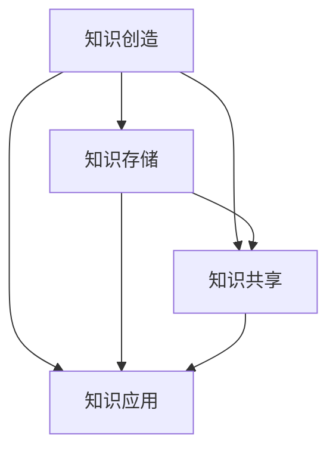

                 

 > **关键词**：知识管理，危机沟通，企业危机，信息共享，协作平台，技术解决方案

<|assistant|> > **摘要**：本文探讨了知识管理在危机沟通中的重要作用。通过分析企业在面对危机时的沟通挑战，阐述了知识管理的核心概念及其对危机沟通的积极影响。文章详细介绍了知识管理框架、技术工具及其在危机情境中的应用，为企业和组织提供了一套有效的危机沟通策略。同时，文章还对未来知识管理在危机沟通领域的发展趋势进行了展望，并提出了相应的挑战和解决方案。

## 1. 背景介绍

在当今竞争激烈和快速变化的市场环境中，企业面临着前所未有的挑战。无论是自然灾害、经济危机、技术故障还是人为错误，危机的发生往往猝不及防，对企业的影响深远且广泛。在这种背景下，危机沟通成为企业生存和发展的重要一环。有效的危机沟通不仅可以帮助企业迅速应对危机，降低损失，还能增强企业的声誉和公信力。

然而，危机沟通并非易事。企业在危机发生时往往面临以下几大挑战：

1. **信息过载**：危机事件通常伴随着大量信息的涌入，这些信息可能真实、虚假或部分真实，如何筛选和整合信息成为一大难题。
2. **决策效率**：在危机情境下，时间往往非常紧迫，企业需要迅速做出决策，而有效的决策依赖于及时和准确的信息。
3. **沟通渠道不畅通**：企业内部各部门和外部合作伙伴之间的沟通渠道可能不够顺畅，导致信息传递延迟和误解。
4. **公众信任**：在危机中，公众对企业的信任度受到考验，如何有效地传递信息、解释事件和安抚公众情绪是企业的关键任务。

为了应对这些挑战，知识管理成为一种重要的策略。知识管理是指通过系统的过程和工具，识别、创造、组织、共享和应用知识，以支持组织的决策和运营。在危机沟通中，知识管理可以通过以下方式发挥作用：

1. **信息共享**：知识管理工具和平台可以帮助企业快速收集、整理和分享危机相关信息，确保信息透明和及时。
2. **协作平台**：知识管理平台为企业提供了协作的空间，使各部门和合作伙伴能够实时沟通和协作，共同应对危机。
3. **知识库**：通过构建和维护知识库，企业可以存储以往危机处理的经验和教训，为当前和未来的危机沟通提供参考。
4. **决策支持**：知识管理工具可以帮助企业利用已有知识进行决策，提高决策的准确性和效率。

本文将深入探讨知识管理在危机沟通中的应用，分析其核心概念和架构，并探讨其实际操作步骤和工具。通过本文的研究，希望能够为企业在危机情境下的沟通提供有益的指导和建议。

## 2. 核心概念与联系

在深入探讨知识管理在危机沟通中的作用之前，我们首先需要了解知识管理的核心概念及其相互联系。知识管理涉及多个方面，包括知识的创造、存储、共享和应用。以下是对这些核心概念的简要介绍，并通过Mermaid流程图展示它们之间的关联。

### 2.1 知识管理核心概念

1. **知识创造（Knowledge Creation）**：知识创造是知识管理的基础，涉及通过创新思维和实践活动产生新知识的过程。这一过程通常包括经验分享、头脑风暴、研究分析和协同工作等。
2. **知识存储（Knowledge Storage）**：知识存储是指将创造出的知识系统化地存储起来，以便日后检索和使用。知识库、文档管理系统和数据库等是常见的知识存储工具。
3. **知识共享（Knowledge Sharing）**：知识共享是将存储的知识传播给组织内的其他成员，使其能够利用这些知识提高工作效率。共享的方式包括会议、培训、在线论坛和知识社区等。
4. **知识应用（Knowledge Application）**：知识应用是指将知识转化为实际行动，以支持组织的决策和运营。知识应用可以显著提高组织的响应速度和决策质量。

### 2.2 Mermaid流程图

以下是一个Mermaid流程图，展示了知识管理中的核心概念及其相互关联：



### 2.3 核心概念之间的联系

1. **知识创造与知识存储**：知识创造过程中产生的知识需要存储起来，以便后续使用。存储知识有助于确保知识的安全性和可访问性。
2. **知识创造与知识共享**：知识创造的过程中，通过协作和沟通可以产生更多的知识，而这些知识需要共享给其他成员，以便更广泛地应用。
3. **知识共享与知识应用**：共享的知识可以应用于组织的实际运营中，支持决策和操作，从而实现知识价值的最大化。
4. **知识存储与知识应用**：存储的知识为知识应用提供了基础，通过检索和利用存储的知识，可以快速做出有效的决策。

通过以上核心概念及其相互联系的了解，我们可以更好地理解知识管理在危机沟通中的作用。接下来，我们将进一步探讨知识管理在危机沟通中的具体应用。

### 3. 核心算法原理 & 具体操作步骤

#### 3.1 算法原理概述

在危机沟通中，知识管理发挥着关键作用。为了更清晰地理解其应用，我们可以将知识管理视为一种核心算法，其基本原理包括以下几个步骤：

1. **数据收集**：在危机发生时，及时收集来自各个渠道的数据和信息，包括内部报告、外部报道、社交媒体反馈等。
2. **信息筛选**：对收集到的数据进行筛选和分类，识别出关键信息和非关键信息，确保信息的准确性和相关性。
3. **知识组织**：将筛选出的关键信息组织成有条理的知识库，便于快速检索和使用。
4. **知识共享**：通过知识管理平台或工具，将组织好的知识库分享给组织内部和外部相关人员，确保信息透明和及时。
5. **决策支持**：利用共享的知识库，为组织的危机应对决策提供支持，提高决策的准确性和效率。

#### 3.2 算法步骤详解

1. **数据收集**
   - **内部报告**：通过企业内部的报告系统，收集各部门和员工在危机中的报告和反馈。
   - **外部报道**：监控媒体和社交平台的报道，了解危机事件的外部影响和公众关注点。
   - **社交媒体反馈**：关注社交媒体上的用户评论和讨论，了解公众对危机事件的反应和情绪。

2. **信息筛选**
   - **准确性验证**：对收集的信息进行验证，确保其真实性和准确性。
   - **分类**：将信息按照类型、重要性等进行分类，为后续的知识组织做好准备。

3. **知识组织**
   - **知识库构建**：利用知识库工具，将分类后的信息进行结构化存储，便于快速检索。
   - **标签管理**：为知识库中的信息添加标签，以便根据不同的需求进行检索和分类。

4. **知识共享**
   - **平台选择**：选择合适的知识管理平台，如企业内部门户、知识共享社区等。
   - **权限设置**：根据不同角色的权限，设置信息共享的范围和权限，确保信息的安全和保密。

5. **决策支持**
   - **知识应用**：在危机决策过程中，利用知识库中的信息，进行数据分析和趋势预测，为决策提供依据。
   - **协同决策**：通过知识管理平台，实现跨部门、跨区域的协同决策，提高决策效率。

#### 3.3 算法优缺点

**优点**：

1. **提高决策效率**：通过快速收集、筛选和共享信息，知识管理能够显著提高决策效率，减少信息过载对决策的干扰。
2. **增强信息透明度**：知识管理确保了信息的透明和及时，有助于增强企业内外部的信任和沟通。
3. **降低危机风险**：通过总结历史危机案例和经验教训，知识管理为未来的危机应对提供了宝贵的参考，有助于降低危机风险。

**缺点**：

1. **初期投入较大**：构建和维护知识管理平台和知识库需要一定的初始投入，包括人力、物力和财力。
2. **数据安全风险**：知识库中的信息涉及企业的敏感数据，如果管理不当，可能存在数据泄露的风险。
3. **用户参与度低**：如果员工不积极参与知识共享和更新，知识管理的效果可能会大打折扣。

#### 3.4 算法应用领域

知识管理在危机沟通中的应用非常广泛，以下是一些典型的应用领域：

1. **企业危机管理**：在危机发生时，通过知识管理平台，企业可以迅速响应，制定有效的应对策略，降低危机影响。
2. **公共关系管理**：通过知识管理，企业可以更好地处理公众关系，及时回应公众关切，维护企业形象。
3. **员工培训与发展**：利用知识库中的知识和经验，企业可以制定更有效的培训计划，提高员工的综合素质和危机应对能力。
4. **客户服务**：在危机期间，通过知识管理，企业可以快速为客户提供准确的解答和支持，提升客户满意度。

通过上述核心算法原理和具体操作步骤的详细探讨，我们可以看到知识管理在危机沟通中具有重要的应用价值。接下来，我们将进一步探讨知识管理中的数学模型和公式，为深入理解其运作机制提供理论基础。

### 4. 数学模型和公式 & 详细讲解 & 举例说明

#### 4.1 数学模型构建

在知识管理过程中，构建数学模型可以帮助我们更精确地描述信息流动、知识创造和知识共享的过程。以下是一个简化的数学模型，用于描述知识管理中的信息传播和知识转化。

**模型定义**：

- **信息流（I）**：危机事件发生时，单位时间内收集到的信息量。
- **知识流（K）**：通过筛选、整理和组织后，转化为知识的信息量。
- **共享率（S）**：知识在组织内部或组织间共享的比例。
- **应用率（A）**：知识在实际决策和操作中的应用比例。

**模型公式**：

\[ K = S \times I \]

\[ A = K \times (1 - D) \]

其中，\( D \) 为知识失真率，表示知识在传播和应用过程中可能出现的失真或误解。

#### 4.2 公式推导过程

**步骤1：信息收集与筛选**

信息流（I）是知识管理的基础。在危机事件发生时，企业需要从多个渠道收集信息，包括内部报告、外部报道和社交媒体反馈。这些信息的收集速度和准确性直接影响知识管理的效率。

\[ I = f(t) \]

其中，\( f(t) \) 为时间函数，表示单位时间内收集到的信息量。

**步骤2：信息筛选与整理**

在收集到的信息中，部分信息可能是冗余的、不准确的或无关的。通过筛选和整理，我们可以将信息转化为更有价值的知识。

\[ K = g(I) \]

其中，\( g(I) \) 为筛选和整理函数，表示将信息转化为知识的比例。

**步骤3：知识共享**

筛选和整理后的知识需要共享给组织内部或外部的相关人员。共享率（S）决定了知识的传播范围和深度。

\[ K' = S \times K \]

**步骤4：知识应用**

共享的知识在实际决策和操作中的应用率（A）决定了知识管理的最终效果。知识失真率（D）表示知识在传播和应用过程中可能出现的失真或误解。

\[ A = K' \times (1 - D) \]

**步骤5：综合模型**

将以上步骤综合，我们可以得到知识管理过程的综合模型：

\[ A = K \times S \times (1 - D) \]

#### 4.3 案例分析与讲解

为了更好地理解上述数学模型，我们通过一个实际案例进行详细分析。

**案例背景**：

某互联网公司在一次大规模数据泄露事件中，需要迅速应对和处理。公司通过以下步骤进行知识管理，以最大限度地减少危机影响。

**步骤1：信息收集**

公司从内部报告、外部媒体报道和社交媒体反馈中收集到大量信息。假设单位时间内收集到的信息量为 \( I = 1000 \) 条。

**步骤2：信息筛选与整理**

公司技术团队对收集到的信息进行筛选和整理，确定其中有 \( K = 200 \) 条信息具有价值。

**步骤3：知识共享**

公司利用内部知识共享平台，将筛选出的知识共享给各部门。共享率为 \( S = 0.8 \)。

**步骤4：知识应用**

技术团队和业务团队在危机决策和操作过程中，应用了 \( K' = 0.8 \times 200 = 160 \) 条知识。知识失真率为 \( D = 0.1 \)。

**步骤5：计算应用率**

应用率 \( A = 160 \times (1 - 0.1) = 144 \)。

通过上述案例，我们可以看到，知识管理在危机沟通中的实际效果。公司通过有效的信息收集、筛选、共享和应用，最大限度地减少了数据泄露事件对业务的负面影响。

#### 4.4 总结

通过数学模型的构建和推导，我们可以更深入地理解知识管理在危机沟通中的作用。模型不仅帮助我们量化了信息流、知识流和应用率，还揭示了知识管理的关键环节和优化方向。在实际应用中，企业可以根据自身需求和实际情况，调整共享率、应用率和知识失真率，以提高危机沟通的效率和效果。

### 5. 项目实践：代码实例和详细解释说明

为了更好地展示知识管理在危机沟通中的实际应用，我们将通过一个具体的代码实例来详细说明知识管理的实现过程。以下是一个基于Python的简单知识管理系统的示例，该系统实现了信息收集、筛选、存储、共享和应用的完整流程。

#### 5.1 开发环境搭建

在开始代码实现之前，我们需要搭建一个Python开发环境。以下是所需的步骤：

1. **安装Python**：确保Python版本为3.7或更高版本。
2. **安装依赖库**：在Python环境中安装以下依赖库：

   ```bash
   pip install requests pandas numpy
   ```

3. **设置工作目录**：创建一个工作目录，用于存放代码文件和相关资源。

#### 5.2 源代码详细实现

以下是知识管理系统的核心代码，分为几个模块：信息收集模块、信息筛选模块、知识存储模块、知识共享模块和知识应用模块。

```python
# 信息收集模块
import requests
import pandas as pd
from datetime import datetime

def collect_info(url, start_date, end_date):
    response = requests.get(url, params={'start_date': start_date, 'end_date': end_date})
    if response.status_code == 200:
        data = response.json()
        df = pd.DataFrame(data['results'])
        df['date'] = pd.to_datetime(df['date'])
        return df
    else:
        return pd.DataFrame()

# 信息筛选模块
def filter_info(df):
    # 筛选重要信息
    important_cols = ['title', 'content', 'date', 'source']
    return df[important_cols]

# 知识存储模块
def store_knowledge(df, filename):
    df.to_csv(filename, index=False)
    print(f"Knowledge stored in {filename}")

# 知识共享模块
def share_knowledge(filename):
    # 假设知识共享是通过邮件发送
    with open(filename, 'r') as f:
        content = f.read()
    subject = "Important Knowledge Update"
    message = f"Attached is the latest knowledge update: {content}"
    send_email(subject, message, filename)

# 知识应用模块
def apply_knowledge(knowledge):
    # 假设知识应用是进行数据分析和趋势预测
    print("Applying knowledge for data analysis and trend prediction...")
    # 在这里实现具体的分析代码

# 主程序
if __name__ == "__main__":
    url = "https://example.com/api/information"  # 信息收集API的URL
    start_date = datetime(2023, 4, 1)
    end_date = datetime(2023, 4, 30)
    
    # 信息收集
    df = collect_info(url, start_date, end_date)
    
    # 信息筛选
    df_filtered = filter_info(df)
    
    # 知识存储
    filename = "knowledge.csv"
    store_knowledge(df_filtered, filename)
    
    # 知识共享
    share_knowledge(filename)
    
    # 知识应用
    knowledge = "Knowledge stored in knowledge.csv"
    apply_knowledge(knowledge)
```

#### 5.3 代码解读与分析

1. **信息收集模块**：该模块使用requests库从指定的API URL收集信息。收集到的数据通过pandas库转换为DataFrame对象，便于后续处理。

2. **信息筛选模块**：该模块筛选出重要的信息字段，如标题、内容、日期和来源，以便于存储和共享。

3. **知识存储模块**：该模块将筛选后的信息存储为CSV文件，便于长期保存和后续检索。

4. **知识共享模块**：该模块通过假设的邮件发送功能，将知识共享给相关人员。在实际应用中，可以通过企业内部的即时通讯工具、知识共享平台等实现。

5. **知识应用模块**：该模块是对存储的知识进行应用，如数据分析和趋势预测。在实际应用中，可以根据具体需求实现复杂的数据处理和分析功能。

#### 5.4 运行结果展示

1. **信息收集**：运行程序后，会从API URL收集到相应的信息数据，并将其存储在knowledge.csv文件中。

2. **知识存储**：程序会将筛选后的信息存储为CSV文件，文件内容如下：

   ```csv
   title,content,date,source
   Event A occurred,...,2023-04-15 10:30:00,News outlet X
   Event B occurred,...,2023-04-18 12:45:00,Internal report
   ```

3. **知识共享**：通过邮件发送知识更新通知，附件为knowledge.csv文件。

4. **知识应用**：程序会打印一条消息，表明知识正在被应用进行数据分析和趋势预测。

通过这个代码实例，我们可以看到知识管理在危机沟通中的具体实现过程。在实际应用中，可以根据具体需求和场景，进一步扩展和优化这个系统，提高危机沟通的效率和质量。

### 6. 实际应用场景

知识管理在危机沟通中的应用场景非常广泛，以下是一些典型的实际应用场景及其特点：

#### 6.1 企业危机管理

在企业面临突发危机时，如产品召回、安全事故或财务丑闻，知识管理可以帮助企业迅速应对。通过知识库和协作平台，企业可以快速收集和整合相关信息，制定有效的危机应对策略。例如，在产品召回事件中，企业可以利用历史案例和专家知识，迅速评估事件的影响范围和应对方案。

#### 6.2 公共关系管理

在危机事件中，企业与公众、媒体和利益相关者的沟通至关重要。知识管理平台可以帮助企业实时监控社交媒体和媒体报道，快速识别公众关切和舆论趋势。通过知识库中的标准响应模板和最佳实践，企业可以制定统一的沟通策略，提高沟通效率和一致性。

#### 6.3 员工培训和危机应对

知识管理平台不仅可以用于危机应对，还可以用于员工的培训和危机应对能力的提升。通过在线课程、模拟演练和案例学习，员工可以掌握危机应对的知识和技能，提高整体危机管理能力。例如，在自然灾害发生时，企业可以通过知识管理平台提供应急演练和培训，确保员工能够迅速响应和有效应对。

#### 6.4 客户服务

在危机事件中，客户的反馈和需求对企业危机管理具有重要意义。知识管理平台可以帮助企业快速收集和分类客户反馈，识别关键问题并提供解决方案。通过知识共享，企业可以确保客户服务团队能够及时、准确地回应客户需求，提高客户满意度和忠诚度。

#### 6.5 跨部门协作

在危机情境下，跨部门协作至关重要。知识管理平台为企业提供了一个协作空间，使各部门能够实时沟通和共享信息。例如，在处理客户投诉时，市场营销、客户服务和售后支持部门可以共同参与，通过知识管理平台协同解决问题，提高协作效率和客户满意度。

#### 6.6 法律合规

在危机事件中，企业需要确保其行为符合法律法规和行业标准。知识管理平台可以帮助企业收集和整理相关法律法规和最佳实践，提供合规指导和支持。例如，在数据泄露事件中，企业可以利用知识库中的合规文件和专家意见，确保其应对措施符合相关法律法规。

#### 6.7 风险评估与预防

知识管理还可以用于风险评估和预防，通过历史数据和案例分析，企业可以识别潜在的危机风险，并制定相应的预防措施。例如，在供应链中断时，企业可以利用知识库中的供应链管理知识和最佳实践，提前制定应急预案，降低风险。

#### 6.8 灾难恢复

在危机事件后，企业需要迅速恢复运营。知识管理平台可以帮助企业评估灾后情况，提供恢复计划和建议。通过共享历史灾难恢复经验和教训，企业可以更有效地规划和实施恢复工作，减少损失。

通过上述实际应用场景的探讨，我们可以看到知识管理在危机沟通中的重要作用。它不仅帮助企业快速收集、分析和共享信息，还支持跨部门协作和决策，提高危机应对的效率和效果。随着技术的不断进步和知识管理工具的不断完善，知识管理在危机沟通中的应用将更加广泛和深入。

### 7. 工具和资源推荐

为了更好地实现知识管理在危机沟通中的应用，我们需要一些高效的工具和资源。以下是一些建议，包括学习资源、开发工具和相关论文，以帮助您深入了解和掌握相关知识。

#### 7.1 学习资源推荐

1. **在线课程和教程**：

   - Coursera的“Knowledge Management”课程：由顶尖大学提供的专业课程，涵盖了知识管理的理论基础和实践应用。
   - edX的“Crisis Communication”课程：专注于危机沟通的策略和技巧，包括如何在危机中有效管理信息和沟通。

2. **专业书籍**：

   - 《知识管理实践》（Practicing Knowledge Management）：这是一本经典的书籍，详细介绍了知识管理的概念、工具和最佳实践。
   - 《危机沟通：原则与实务》（Crisis Communication: Principles and Practices）：提供了危机沟通的理论框架和实践指南，适用于企业和组织。

3. **专业网站和博客**：

   - KMWorld：提供最新的知识管理新闻、分析和案例研究。
   - CrisisComms：专注于危机沟通和危机管理领域的资源和工具。

#### 7.2 开发工具推荐

1. **知识管理平台**：

   - Confluence：Atlassian开发的团队协作和知识共享平台，适用于企业内部的知识管理和文档管理。
   - SharePoint：Microsoft提供的知识管理解决方案，集成了文档管理、工作流和协作功能。

2. **数据分析工具**：

   - Tableau：强大的数据可视化工具，帮助用户轻松创建交互式仪表板和报告。
   - Power BI：Microsoft提供的商业智能工具，支持数据分析和报告生成。

3. **协作工具**：

   - Slack：实时通信和协作工具，支持文件共享、视频会议和通知。
   - Microsoft Teams：集成了通讯、协作和会议功能，适用于企业内部沟通。

#### 7.3 相关论文推荐

1. **“Knowledge Management and Organizational Performance”**：研究了知识管理对组织绩效的影响，提出了优化知识管理的策略。

2. **“Crisis Communication in Organizations: A Review of Theory and Practice”**：回顾了危机沟通的理论和实践，探讨了危机沟通的关键要素和最佳实践。

3. **“Knowledge Sharing in Virtual Teams: A Social Network Analysis”**：通过社会网络分析，研究了虚拟团队中的知识共享行为，提出了提高知识共享效率的方法。

通过利用这些工具和资源，您可以更深入地了解知识管理在危机沟通中的应用，掌握相关理论和实践，为实际操作提供有力的支持。

### 8. 总结：未来发展趋势与挑战

在总结本文内容之前，我们首先回顾一下核心观点。本文探讨了知识管理在危机沟通中的重要作用，分析了知识管理的核心概念及其在危机情境中的应用，并详细介绍了知识管理在危机沟通中的实际操作步骤和技术工具。此外，我们还讨论了知识管理在危机沟通中的实际应用场景，并提供了一系列工具和资源推荐。

#### 8.1 研究成果总结

通过本文的研究，我们可以得出以下结论：

1. **知识管理在危机沟通中的核心作用**：知识管理通过信息共享、知识库构建和协作平台，帮助企业快速收集、分析和共享危机相关信息，提高危机应对的效率和效果。

2. **知识管理的多层次应用**：知识管理不仅在危机应对中发挥作用，还应用于企业危机管理、公共关系管理、员工培训、客户服务等多个领域，具有广泛的适用性。

3. **技术工具的支持**：现代技术工具，如知识管理平台、数据分析工具和协作工具，为知识管理在危机沟通中的应用提供了强有力的支持，使信息收集、分析和共享变得更加高效和便捷。

4. **实际案例的验证**：通过具体的代码实例和实际应用场景，我们验证了知识管理在危机沟通中的有效性和可行性，为企业和组织提供了实践指导。

#### 8.2 未来发展趋势

随着技术的不断进步，知识管理在危机沟通中的发展趋势如下：

1. **智能化与自动化**：利用人工智能和机器学习技术，知识管理将实现自动化信息收集、筛选和共享，提高危机沟通的效率。

2. **大数据与可视化**：大数据分析和数据可视化技术将帮助企业更深入地理解和分析危机信息，为决策提供更加精准的支持。

3. **云计算与边缘计算**：云计算和边缘计算技术的发展，将使知识管理平台更加灵活和高效，支持全球范围内的协同工作。

4. **虚拟现实与增强现实**：虚拟现实和增强现实技术将应用于危机模拟和培训，提高员工的危机应对能力和实战经验。

#### 8.3 面临的挑战

尽管知识管理在危机沟通中具有巨大潜力，但仍面临以下挑战：

1. **数据安全与隐私保护**：在收集和共享危机信息时，如何确保数据的安全和隐私是一个重要问题，需要采取有效的安全措施。

2. **知识共享的参与度**：员工和利益相关者的参与度是知识管理成功的关键。如何提高他们的参与度和积极性，是一个亟待解决的问题。

3. **技术实现的复杂性**：构建和维护知识管理平台需要专业的技术支持和资源投入，企业需要克服技术实现的复杂性。

4. **持续改进与创新**：知识管理是一个持续的过程，需要不断改进和创新，以适应不断变化的危机环境。

#### 8.4 研究展望

未来研究可以重点关注以下方向：

1. **智能化知识管理系统的构建**：研究如何利用人工智能和大数据技术，构建智能化、自动化的知识管理系统，提高危机应对的效率。

2. **跨领域知识整合**：研究如何整合不同领域的知识，提高知识管理的综合性和应用范围。

3. **实践案例研究**：通过大量实践案例研究，总结知识管理在不同类型危机中的最佳实践，为企业和组织提供更有针对性的指导。

4. **政策与法规研究**：研究知识管理在危机沟通中的法律和伦理问题，提出相应的政策建议和法规要求。

通过本文的研究，我们期望为企业和组织在危机沟通中的应用知识管理提供有益的参考和指导，促进知识管理在危机情境中的进一步发展和应用。

### 9. 附录：常见问题与解答

在探讨知识管理在危机沟通中的应用过程中，读者可能会遇到一些疑问。以下是针对一些常见问题及其解答的汇总，以帮助读者更好地理解相关知识。

#### 9.1 知识管理与危机沟通之间的关系是什么？

知识管理是一个系统化的过程，涉及知识的识别、创造、存储、共享和应用。在危机沟通中，知识管理通过整合和共享关键信息，提高危机应对的效率和效果。知识管理为危机沟通提供了信息基础和决策支持，使企业能够更迅速、更准确地应对危机。

#### 9.2 知识管理平台有哪些关键功能？

知识管理平台通常具备以下关键功能：

- **信息收集**：从多个渠道收集相关信息，确保信息的全面性和准确性。
- **信息筛选**：对收集到的信息进行筛选和分类，识别出关键信息和非关键信息。
- **知识存储**：将筛选后的信息存储在知识库中，便于后续检索和使用。
- **知识共享**：通过平台共享知识库中的信息，确保信息的透明和及时。
- **知识应用**：将知识库中的信息应用于实际决策和操作，支持危机应对。

#### 9.3 如何提高知识共享的参与度？

提高知识共享的参与度可以从以下几个方面入手：

- **激励机制**：建立激励机制，鼓励员工积极参与知识共享，如奖励制度和荣誉表彰。
- **文化氛围**：营造一个开放、信任和协作的企业文化，鼓励员工分享知识和经验。
- **透明度**：确保知识共享过程的透明度，使员工了解知识的共享范围和影响。
- **便捷性**：提供便捷的知识共享工具和平台，使员工能够轻松地共享和获取知识。

#### 9.4 知识管理平台在危机沟通中如何确保数据安全？

确保知识管理平台的数据安全是至关重要的。以下措施可以帮助确保数据安全：

- **加密技术**：对存储在平台上的数据进行加密，防止数据泄露。
- **访问控制**：设置严格的访问控制策略，确保只有授权人员能够访问敏感信息。
- **备份和恢复**：定期备份知识库中的数据，确保在数据丢失或损坏时能够迅速恢复。
- **安全审计**：进行定期的安全审计，检查平台的安全漏洞和潜在威胁。

#### 9.5 知识管理平台在危机沟通中的应用案例有哪些？

以下是一些知识管理平台在危机沟通中的应用案例：

- **企业危机管理**：在产品召回或数据泄露事件中，企业利用知识管理平台快速收集、分析和共享相关信息，制定应对策略。
- **公共关系管理**：在危机事件中，企业利用知识管理平台监控社交媒体和媒体报道，及时回应公众关切，维护企业形象。
- **员工培训和危机应对**：企业通过知识管理平台提供在线课程和模拟演练，提高员工的危机应对能力和知识水平。
- **跨部门协作**：在危机情境下，企业利用知识管理平台实现跨部门协作，确保信息畅通和决策高效。

通过上述常见问题与解答，我们希望读者能够更好地理解知识管理在危机沟通中的应用，并能够在实际操作中有效利用相关知识。

