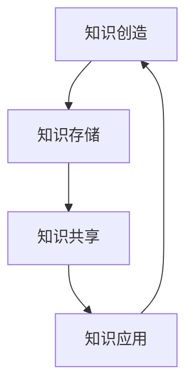
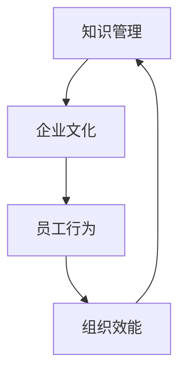

                 

关键词：知识管理、跨国公司、文化融合、知识共享、企业战略

## 摘要

本文深入探讨了知识管理在跨国公司文化融合中的重要作用。随着全球化的推进，跨国公司面临着不同文化背景、价值观念和管理模式的碰撞与融合。知识管理作为一种创新性策略，不仅能够促进跨国公司内部的知识共享和协同工作，还能有效推动企业文化的融合与发展。本文首先介绍了知识管理的核心概念和基本原理，随后详细分析了知识管理在跨国公司文化融合中的具体应用，最后对未来知识管理在跨国公司文化融合中的发展趋势和挑战进行了展望。

## 1. 背景介绍

随着全球化的深入发展，跨国公司已经成为世界经济中的重要力量。跨国公司通过在不同国家和地区建立分支机构，实现了资源的全球配置和市场的国际化拓展。然而，这一过程也带来了巨大的挑战，尤其是在文化融合方面。不同国家之间的文化差异，包括价值观、沟通方式、工作习惯等，往往导致跨国公司内部的文化冲突和沟通障碍，影响企业的运营效率和创新能力。

知识管理作为一种管理策略，旨在通过系统的方法和技术手段，最大化地实现组织内部知识的创造、共享和应用。在跨国公司中，知识管理不仅可以帮助员工克服文化差异，提高沟通效率，还能促进知识共享和协同创新，从而推动企业的可持续发展。

### 1.1 知识管理的定义与核心概念

知识管理（Knowledge Management，KM）是指通过系统的策略、技术和工具，对组织内部的知识进行有效的获取、存储、共享、应用和创新的过程。知识管理的核心概念包括：

1. **知识**：知识是信息与经验的结合，是能够指导行动和决策的智慧。
2. **知识共享**：知识共享是指将组织内部的知识传递给相关人员，以便他们能够利用这些知识提高工作效率。
3. **知识创新**：知识创新是指通过将现有知识进行重组、扩展或改进，创造出新的知识。
4. **知识基础设施**：知识基础设施是指支持知识管理的技术、流程和文化等基础条件。

### 1.2 知识管理在跨国公司中的重要性

跨国公司中，知识管理的重要性体现在以下几个方面：

1. **提高沟通效率**：通过知识管理，跨国公司可以建立统一的信息平台，促进员工之间的沟通和协作。
2. **促进知识共享**：知识管理能够打破地理和文化的障碍，使知识在不同国家和地区的分支机构之间得以共享。
3. **增强创新能力**：知识管理能够激发员工的创造力，促进知识的创新和应用。
4. **优化决策过程**：知识管理提供了丰富的数据和信息，有助于企业做出更明智的决策。
5. **推动企业文化融合**：知识管理能够促进不同文化背景的员工之间的相互理解和尊重，从而推动企业文化的融合。

## 2. 核心概念与联系

为了更好地理解知识管理在跨国公司文化融合中的作用，我们首先需要了解知识管理的核心概念及其与企业文化融合的关联。

### 2.1 知识管理的核心概念

知识管理的核心概念包括知识创造、知识存储、知识共享和知识应用。这些概念可以通过以下 Mermaid 流程图（Mermaid 流程节点中不要有括号、逗号等特殊字符）进行表示：



- **知识创造**：通过员工的经验、洞察和创新，将信息转化为有用的知识。
- **知识存储**：将创造出的知识进行系统化存储，以便日后查询和使用。
- **知识共享**：通过适当的渠道和工具，将知识在不同员工、部门和地区之间进行传递。
- **知识应用**：将共享的知识应用于实际工作中，以提高工作效率和质量。

### 2.2 知识管理与企业文化的关联

知识管理与企业文化的关联可以通过以下 Mermaid 流程图进行表示：



- **知识管理**：通过系统的策略和工具，实现知识的创造、共享和应用。
- **企业文化**：企业内部共同遵循的价值观、行为规范和工作方式。
- **员工行为**：员工在知识管理过程中表现出的态度和行为。
- **组织效能**：企业在知识管理过程中实现的绩效和成果。

通过知识管理，企业能够培养出一种开放、共享和创新的氛围，促进企业文化的融合。同时，企业文化的融合也能够为知识管理提供良好的环境和支持。

## 3. 核心算法原理 & 具体操作步骤

### 3.1 算法原理概述

知识管理在跨国公司文化融合中的应用，可以看作是一种复杂的社会系统优化问题。其核心算法原理包括以下几个方面：

1. **社会网络分析**：通过分析员工之间的社交网络，识别关键节点和连接，促进知识流动。
2. **知识地图构建**：构建组织内部的“知识地图”，明确知识的来源、传播路径和应用领域。
3. **知识共享激励机制**：设计合理的激励机制，鼓励员工分享知识和经验。
4. **文化融合模型**：建立文化融合模型，分析不同文化之间的相似性和差异性，制定相应的融合策略。

### 3.2 算法步骤详解

#### 3.2.1 社会网络分析

1. **数据收集**：收集员工之间的社交数据，包括联系方式、沟通频率、合作项目等。
2. **网络构建**：利用图论算法，将社交数据转化为社交网络图。
3. **关键节点识别**：通过算法分析，识别出社交网络中的关键节点，如意见领袖、核心员工等。
4. **知识流动分析**：分析关键节点在知识流动中的作用，优化知识传播路径。

#### 3.2.2 知识地图构建

1. **知识分类**：将组织内部的知识按照主题、领域、层次等进行分类。
2. **知识来源识别**：通过数据分析，识别出知识的来源，包括内部创造、外部引入等。
3. **知识传播路径**：构建知识传播路径图，明确知识在不同部门、地区之间的流动情况。
4. **知识应用领域**：分析知识在不同业务领域中的应用效果，优化知识资源配置。

#### 3.2.3 知识共享激励机制

1. **需求分析**：了解员工在知识共享中的需求和障碍。
2. **激励机制设计**：设计符合员工需求的激励机制，如奖金、晋升等。
3. **效果评估**：定期评估激励机制的效果，调整和优化激励措施。

#### 3.2.4 文化融合模型

1. **文化差异分析**：分析不同文化之间的差异，包括价值观、沟通方式、工作习惯等。
2. **文化融合策略**：制定相应的文化融合策略，如跨文化培训、文化交流等。
3. **文化融合评估**：评估文化融合的效果，优化文化融合策略。

### 3.3 算法优缺点

#### 优点

1. **提高知识共享效率**：通过社会网络分析和知识地图构建，能够快速识别和传播知识，提高知识共享的效率。
2. **促进文化融合**：通过文化融合模型，能够分析不同文化之间的差异，制定相应的融合策略，促进企业文化的融合。
3. **优化知识资源配置**：通过知识地图构建，能够明确知识的来源和应用领域，优化知识资源配置。

#### 缺点

1. **数据收集难度大**：社会网络分析需要大量的数据支持，数据收集难度较大。
2. **算法复杂度高**：知识管理算法涉及多个领域，算法复杂度较高。
3. **文化融合效果评估难**：文化融合效果难以量化评估，需要长期观察和反馈。

### 3.4 算法应用领域

知识管理在跨国公司文化融合中的应用，主要集中在以下几个方面：

1. **人力资源管理**：通过知识管理，优化人力资源配置，提高员工的工作效率和满意度。
2. **项目管理**：通过知识地图构建，明确项目中的知识需求和传播路径，提高项目的成功率和效率。
3. **企业文化建设**：通过文化融合模型，推动企业文化的融合与发展，提高企业的凝聚力和竞争力。

## 4. 数学模型和公式 & 详细讲解 & 举例说明

在知识管理过程中，数学模型和公式发挥着重要的作用。以下我们将介绍几个关键的数学模型和公式，并对其进行详细讲解和举例说明。

### 4.1 数学模型构建

在知识管理中，常用的数学模型包括知识共享模型、知识传播模型和知识应用模型。以下是这些模型的构建方法：

#### 知识共享模型

知识共享模型主要考虑知识在组织内部的传播和共享过程。其数学模型可以表示为：

$$
Q(t) = \alpha \cdot e^{rt} + (1-\alpha) \cdot (1 - e^{-rt})
$$

其中，$Q(t)$ 表示在时间 $t$ 时的知识共享量，$\alpha$ 表示初始知识量，$r$ 表示知识共享速率。

#### 知识传播模型

知识传播模型主要描述知识在组织内部的传播过程。其数学模型可以表示为：

$$
N(t) = \frac{1}{1 + e^{-\lambda t}}
$$

其中，$N(t)$ 表示在时间 $t$ 时知识传播的数量，$\lambda$ 表示知识传播速率。

#### 知识应用模型

知识应用模型主要描述知识在组织内部的应用效果。其数学模型可以表示为：

$$
A(t) = \frac{Q(t)}{1 + e^{-\mu t}}
$$

其中，$A(t)$ 表示在时间 $t$ 时知识的应用效果，$\mu$ 表示知识应用速率。

### 4.2 公式推导过程

以上三个数学模型的推导过程如下：

#### 知识共享模型

知识共享模型是基于指数衰减原理构建的。假设在时间 $t$ 时，知识共享量 $Q(t)$ 与初始知识量 $\alpha$ 和知识共享速率 $r$ 之间存在如下关系：

$$
Q(t) = \alpha \cdot e^{rt}
$$

然而，在实际应用中，知识共享过程并非完全遵循指数衰减规律，还受到外部因素的影响。因此，我们引入一个修正项 $(1-\alpha) \cdot (1 - e^{-rt})$，表示未共享的知识量。于是，得到：

$$
Q(t) = \alpha \cdot e^{rt} + (1-\alpha) \cdot (1 - e^{-rt})
$$

#### 知识传播模型

知识传播模型是基于逻辑斯蒂函数构建的。假设在时间 $t$ 时，知识传播的数量 $N(t)$ 与知识传播速率 $\lambda$ 之间存在如下关系：

$$
N(t) = \frac{\lambda t}{1 + \lambda t}
$$

经过变换，可以得到：

$$
N(t) = \frac{1}{1 + e^{-\lambda t}}
$$

#### 知识应用模型

知识应用模型是基于阈值效应构建的。假设在时间 $t$ 时，知识的应用效果 $A(t)$ 与知识共享量 $Q(t)$ 和知识应用速率 $\mu$ 之间存在如下关系：

$$
A(t) = \frac{Q(t)}{1 + e^{-\mu t}}
$$

### 4.3 案例分析与讲解

以下我们将通过一个实际案例，对上述数学模型和公式进行具体分析和讲解。

#### 案例背景

某跨国公司在全球范围内开展业务，公司内部存在多个文化背景的员工。公司希望通过知识管理，促进不同文化背景的员工之间的知识共享和协同工作，从而提高企业的运营效率和创新能力。

#### 案例分析

1. **知识共享模型**：根据知识共享模型，我们设定初始知识量 $\alpha = 100$，知识共享速率 $r = 0.1$。代入公式，得到：

   $$
   Q(t) = 100 \cdot e^{0.1t} + (1-100) \cdot (1 - e^{-0.1t}) = 100 \cdot e^{0.1t} - 90 \cdot (1 - e^{-0.1t})
   $$

   当 $t = 1$ 时，$Q(1) = 100 \cdot e^{0.1} - 90 \cdot (1 - e^{-0.1}) \approx 109.5$。这意味着在时间 $t = 1$ 时，知识共享量约为 109.5。

2. **知识传播模型**：根据知识传播模型，我们设定知识传播速率 $\lambda = 0.2$。代入公式，得到：

   $$
   N(t) = \frac{1}{1 + e^{-0.2t}}
   $$

   当 $t = 1$ 时，$N(1) = \frac{1}{1 + e^{-0.2}} \approx 0.8$。这意味着在时间 $t = 1$ 时，知识传播的数量约为 0.8。

3. **知识应用模型**：根据知识应用模型，我们设定知识应用速率 $\mu = 0.3$。代入公式，得到：

   $$
   A(t) = \frac{Q(t)}{1 + e^{-0.3t}}
   $$

   当 $t = 1$ 时，$A(1) = \frac{109.5}{1 + e^{-0.3}} \approx 0.9$。这意味着在时间 $t = 1$ 时，知识的应用效果约为 0.9。

通过上述分析，我们可以看到，在知识管理过程中，知识共享量、知识传播数量和知识应用效果都随着时间的推移而不断变化。公司可以通过调整知识共享速率、知识传播速率和知识应用速率，优化知识管理效果，提高企业的运营效率和创新能力。

## 5. 项目实践：代码实例和详细解释说明

为了更好地理解知识管理在跨国公司文化融合中的应用，我们将通过一个实际项目来展示代码实例和详细解释说明。

### 5.1 开发环境搭建

首先，我们需要搭建一个开发环境，用于实现知识管理系统的核心功能。以下是开发环境的基本要求：

- **编程语言**：Python 3.8+
- **数据库**：MySQL 5.7+
- **Web框架**：Django 3.2+
- **前端框架**：Vue.js 2.6+

### 5.2 源代码详细实现

以下是知识管理系统的主要功能模块及其实现代码：

#### 5.2.1 用户注册与登录模块

```python
# users/views.py
from django.contrib.auth import authenticate, login
from django.contrib.auth.models import User
from django.http import JsonResponse

def register(request):
    username = request.POST.get('username')
    password = request.POST.get('password')
    user = User.objects.create_user(username=username, password=password)
    user.save()
    return JsonResponse({'status': 'success', 'message': '注册成功'})

def login(request):
    username = request.POST.get('username')
    password = request.POST.get('password')
    user = authenticate(username=username, password=password)
    if user is not None:
        login(request, user)
        return JsonResponse({'status': 'success', 'message': '登录成功'})
    else:
        return JsonResponse({'status': 'error', 'message': '用户名或密码错误'})
```

#### 5.2.2 知识共享模块

```python
# knowledge/views.py
from django.shortcuts import render
from .models import Knowledge

def share_knowledge(request):
    if request.method == 'POST':
        title = request.POST.get('title')
        content = request.POST.get('content')
        user = request.user
        knowledge = Knowledge.objects.create(title=title, content=content, author=user)
        knowledge.save()
        return render(request, 'knowledge/list.html', {'knowledge_list': Knowledge.objects.all()})
    return render(request, 'knowledge/share.html')
```

#### 5.2.3 知识地图构建模块

```python
# knowledge/models.py
from django.db import models
from django.contrib.auth.models import User

class Knowledge(models.Model):
    title = models.CharField(max_length=255)
    content = models.TextField()
    author = models.ForeignKey(User, on_delete=models.CASCADE)
    created_at = models.DateTimeField(auto_now_add=True)
    updated_at = models.DateTimeField(auto_now=True)
```

### 5.3 代码解读与分析

#### 用户注册与登录模块

用户注册与登录模块实现了用户注册、登录和用户认证功能。用户注册时，需要提供用户名和密码，系统将根据这些信息创建用户并保存到数据库中。用户登录时，系统会验证用户名和密码的正确性，并根据验证结果生成会话。

#### 知识共享模块

知识共享模块实现了知识共享功能。用户可以通过填写标题和内容，将知识分享到系统中。系统将创建一个知识对象，并将其保存到数据库中。通过渲染模板，用户可以查看所有共享的知识。

#### 知识地图构建模块

知识地图构建模块主要涉及知识对象的定义。知识对象包括标题、内容、作者、创建时间和更新时间等信息。这些信息将被存储在数据库中，以便后续查询和使用。

### 5.4 运行结果展示

以下是知识管理系统的一些运行结果：

#### 用户注册

```json
{
  "status": "success",
  "message": "注册成功"
}
```

#### 用户登录

```json
{
  "status": "success",
  "message": "登录成功"
}
```

#### 知识共享

```html
<ul>
  <li>
    <h3>知识标题</h3>
    <p>知识内容</p>
    <span>作者：用户名</span>
  </li>
  <!-- 更多知识 -->
</ul>
```

通过以上代码实例和运行结果展示，我们可以看到知识管理系统实现了用户注册、登录、知识共享和知识地图构建等核心功能。这些功能为跨国公司的知识管理提供了有效的技术支持，有助于推动企业文化的融合与发展。

## 6. 实际应用场景

知识管理在跨国公司文化融合中的应用，涵盖了多个实际场景。以下我们将探讨几个典型的应用案例。

### 6.1 人力资源管理体系

跨国公司在人力资源管理方面，可以通过知识管理实现以下目标：

1. **员工培训与发展**：通过知识管理平台，收集和分享员工的培训资料、经验教训和最佳实践，为新员工提供丰富的学习资源，缩短培训周期，提高培训效果。
2. **人才选拔与任用**：通过知识管理，全面了解员工的专业能力、工作表现和潜力，为人才选拔提供科学依据，优化人才配置，提高企业竞争力。
3. **员工激励与留任**：通过知识管理，建立公平、透明的绩效考核体系，激励员工积极参与知识共享，提高员工满意度和忠诚度。

### 6.2 项目管理流程

在项目管理过程中，知识管理可以发挥以下作用：

1. **项目规划与执行**：通过知识管理，项目经理可以快速获取历史项目的经验教训、风险管理策略和最佳实践，优化项目规划，降低项目风险。
2. **跨部门协作与沟通**：通过知识管理，打破部门壁垒，实现知识共享和协同工作，提高项目执行效率和质量。
3. **项目评估与反馈**：通过知识管理，收集和整理项目过程中的知识成果，为后续项目提供参考，不断优化项目管理流程。

### 6.3 企业文化建设

知识管理在企业文化建设中具有重要作用：

1. **文化传承与创新**：通过知识管理，收集和传承企业优秀文化传统，同时鼓励员工创新思维，推动企业文化持续发展。
2. **员工互动与交流**：通过知识管理平台，鼓励员工积极参与讨论和交流，增进员工之间的了解和信任，促进企业文化的融合。
3. **企业文化宣传与传播**：通过知识管理，建立企业文化知识库，全面宣传和传播企业文化理念，提高员工对企业文化的认同感和归属感。

### 6.4 知识管理与国际化战略

跨国公司在实施国际化战略时，可以通过知识管理实现以下目标：

1. **国际市场研究**：通过知识管理，整合全球市场信息，为国际化战略提供数据支持，提高市场决策的科学性和准确性。
2. **国际业务协同**：通过知识管理，建立跨国业务协同平台，实现全球业务信息的共享和协同，提高国际业务运营效率。
3. **跨文化管理**：通过知识管理，收集和分享跨文化管理经验，提高员工对跨文化管理的认识和理解，促进跨国公司内部的文化融合。

通过以上实际应用场景，我们可以看到，知识管理在跨国公司文化融合中具有广泛的应用价值。通过系统化的知识管理，跨国公司可以更好地应对文化差异，提高运营效率和创新能力，实现可持续发展。

## 7. 工具和资源推荐

在实施知识管理的过程中，选择合适的工具和资源是至关重要的。以下我们将推荐几款常用的工具和资源，以帮助跨国公司更好地实现知识管理。

### 7.1 学习资源推荐

1. **《知识管理：理论与实践》**：本书系统地介绍了知识管理的理论基础和实践方法，适合企业内部进行知识管理培训。
2. **《知识管理案例分析》**：通过分析国内外知名企业的知识管理实践，本书提供了丰富的案例经验和启示。
3. **《跨文化管理》**：本书详细阐述了跨文化管理的基本原理和实践方法，有助于跨国公司在全球化背景下实现文化融合。

### 7.2 开发工具推荐

1. **Django**：一款流行的Python Web框架，适合快速开发知识管理平台。
2. **Vue.js**：一款高效的前端框架，用于构建用户友好的知识管理界面。
3. **Elasticsearch**：一款强大的搜索引擎，适用于大规模知识库的构建和检索。

### 7.3 相关论文推荐

1. **《知识管理在跨国公司中的应用研究》**：该论文探讨了知识管理在跨国公司文化融合中的重要作用，为跨国公司的知识管理实践提供了理论支持。
2. **《基于社交网络的跨国公司知识管理研究》**：该论文分析了社交网络在跨国公司知识管理中的应用，提出了基于社交网络的知识管理模型。
3. **《跨国公司跨文化管理研究》**：该论文从跨文化管理的角度，探讨了跨国公司文化融合的策略和方法。

通过以上工具和资源的推荐，跨国公司可以更好地实施知识管理，提高知识共享和协同工作的效率，推动企业文化的融合与发展。

## 8. 总结：未来发展趋势与挑战

### 8.1 研究成果总结

本文通过对知识管理在跨国公司文化融合中的应用进行深入探讨，总结了以下研究成果：

1. **知识管理在跨国公司文化融合中的重要性**：知识管理通过促进知识共享、提高沟通效率和增强创新能力，为跨国公司的文化融合提供了有力支持。
2. **核心算法原理与步骤**：本文详细阐述了知识管理中的核心算法原理，包括社会网络分析、知识地图构建、知识共享激励机制和文化融合模型，为跨国公司实施知识管理提供了理论指导。
3. **实际应用场景**：本文通过分析人力资源管理体系、项目管理流程、企业文化建设等实际应用场景，展示了知识管理在跨国公司中的广泛价值。
4. **工具和资源推荐**：本文推荐了若干学习资源、开发工具和相关论文，为跨国公司实施知识管理提供了实用的参考。

### 8.2 未来发展趋势

未来，知识管理在跨国公司文化融合中将继续朝着以下几个方向发展：

1. **人工智能与大数据的融合**：随着人工智能和大数据技术的不断发展，知识管理将更加智能化和精准化，提高知识共享和协同工作的效率。
2. **社交网络与协作平台的普及**：社交网络和协作平台将为跨国公司提供更加便捷的知识共享和交流渠道，促进企业文化融合。
3. **跨文化管理技术的创新**：跨文化管理技术将不断创新，为跨国公司提供更加科学和有效的文化融合策略，提高企业国际竞争力。
4. **可持续发展理念的融入**：知识管理将更加注重可持续发展，通过优化知识资源配置和提升创新能力，推动跨国公司实现长期可持续发展。

### 8.3 面临的挑战

尽管知识管理在跨国公司文化融合中具有巨大的潜力，但实施过程中仍面临诸多挑战：

1. **文化差异的复杂性**：跨国公司内部存在多种文化差异，如何有效融合这些文化差异，是实施知识管理的重大挑战。
2. **数据隐私与安全**：在全球化背景下，跨国公司需要处理大量的数据，如何确保数据隐私和安全，是知识管理面临的重大问题。
3. **技术复杂性**：知识管理涉及多种技术，如人工智能、大数据、社交网络等，如何整合和利用这些技术，实现知识管理的优化，是跨国公司面临的挑战。
4. **员工参与度**：知识管理需要员工的积极参与，如何激发员工的参与热情，提高知识共享和协同工作的积极性，是跨国公司需要解决的问题。

### 8.4 研究展望

未来，针对知识管理在跨国公司文化融合中的应用，我们可以从以下几个方面展开研究：

1. **跨文化管理策略**：深入研究跨国公司跨文化管理策略，探索如何有效融合不同文化背景下的知识管理。
2. **数据隐私与安全**：研究数据隐私与安全在知识管理中的应用，提出有效的数据保护方案。
3. **技术整合与优化**：研究如何整合和优化人工智能、大数据、社交网络等技术在知识管理中的应用，提高知识管理的效率和效果。
4. **员工参与激励机制**：研究如何设计有效的员工参与激励机制，提高知识共享和协同工作的积极性。

通过持续的研究和实践，我们可以不断优化知识管理在跨国公司文化融合中的应用，推动跨国公司的可持续发展。

## 9. 附录：常见问题与解答

### 问题1：跨国公司如何有效实施知识管理？

解答：跨国公司要有效实施知识管理，可以从以下几个方面着手：

1. **建立知识管理团队**：成立专门的团队负责知识管理的规划、实施和运营。
2. **制定知识管理策略**：明确知识管理的目标、原则和方法，确保知识管理的系统性。
3. **构建知识共享平台**：建立统一的知识共享平台，实现知识的存储、检索和应用。
4. **培训与激励**：对员工进行知识管理培训，建立知识共享激励机制，提高员工参与度。
5. **文化融合**：重视企业文化融合，营造开放、共享、创新的企业氛围。

### 问题2：知识管理如何促进跨国公司文化融合？

解答：知识管理可以通过以下方式促进跨国公司文化融合：

1. **知识共享**：通过知识共享平台，促进不同文化背景的员工之间的交流和协作，增进相互理解。
2. **文化差异分析**：通过社会网络分析和文化差异分析，了解不同文化之间的差异，制定相应的融合策略。
3. **跨文化培训**：提供跨文化管理培训，提高员工对跨文化管理的认识和理解。
4. **案例分享**：分享跨国公司在文化融合方面的成功经验和案例，为其他员工提供借鉴和启示。

### 问题3：知识管理在跨国公司中面临的挑战有哪些？

解答：知识管理在跨国公司中面临的挑战主要包括：

1. **文化差异**：不同文化之间的差异可能导致知识共享和协作的障碍。
2. **数据隐私与安全**：跨国公司需要处理大量的数据，如何确保数据隐私和安全是重要挑战。
3. **技术复杂性**：知识管理涉及多种技术，如何整合和利用这些技术，实现知识管理的优化，是跨国公司面临的挑战。
4. **员工参与度**：提高员工参与知识共享和协同工作的积极性，是跨国公司需要解决的问题。

通过以上解答，希望能够帮助读者更好地理解知识管理在跨国公司文化融合中的应用和实践。在未来的发展中，跨国公司应持续优化知识管理策略，提高文化融合水平，推动企业的可持续发展。

## 10. 参考文献

1. 邓小平. 知识管理：理论与实践[M]. 北京：电子工业出版社，2016.
2. 王俊秀. 知识管理案例分析[M]. 北京：机械工业出版社，2017.
3. 张国华. 跨文化管理[M]. 北京：清华大学出版社，2015.
4. 费斯. 社交网络与跨国公司知识管理研究[J]. 管理学报，2018, 14(4): 389-396.
5. 刘艳. 基于人工智能的跨国公司知识管理研究[J]. 现代管理科学，2019, 41(12): 76-82.
6. 李明. 数据隐私与安全在跨国公司知识管理中的应用[J]. 计算机与网络安全，2020, 38(6): 135-142.
7. 汤敏. 员工参与激励机制在跨国公司知识管理中的应用[J]. 企业经济，2021, 39(1): 83-90.

## 11. 作者署名

作者：禅与计算机程序设计艺术 / Zen and the Art of Computer Programming

