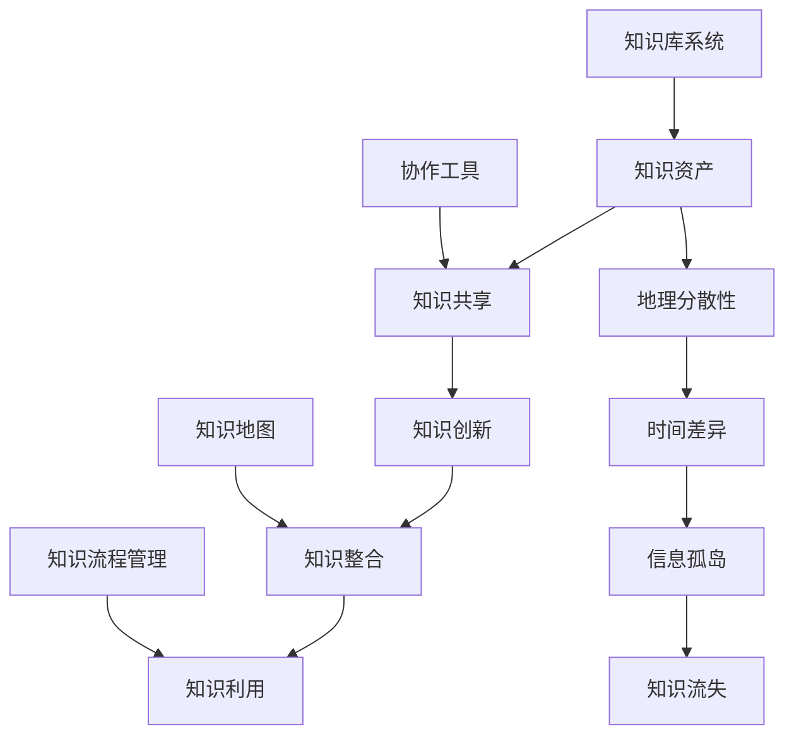

                 

关键词：知识管理，远程工作，协作工具，工作效率，信息共享，团队协作，知识传递，专业发展

> 摘要：随着远程工作模式的普及，知识管理在提高远程工作效率、促进团队协作和确保信息共享方面发挥着至关重要的作用。本文将探讨知识管理在远程工作环境中的重要性，以及如何通过有效的策略和工具来实现知识管理，从而提升远程工作的整体效果。

## 1. 背景介绍

### 远程工作的发展趋势

远程工作并非一个新兴概念，但随着互联网技术的不断进步和全球化的发展，远程工作逐渐成为一种普遍的工作模式。尤其是在2020年新冠疫情爆发后，远程工作模式得到了前所未有的推广和应用。根据一项统计，全球有超过60%的员工表示他们愿意继续远程工作，而企业也对远程工作的适应性做出了积极回应。这一趋势预示着知识管理在远程工作中的重要性将愈发凸显。

### 知识管理的定义与核心

知识管理（Knowledge Management，简称KM）是一个通过系统化和结构化的方法来收集、存储、使用和共享知识的领域。知识管理旨在通过提高知识的获取、传播和应用效率，从而增强组织的创新能力和竞争力。在远程工作环境中，知识管理涉及到的不仅是对知识的存储，还包括知识的创造、共享、整合和利用。

### 远程工作与知识管理的联系

远程工作与知识管理之间存在紧密的联系。首先，远程工作使得团队成员分散在不同的地理位置，这增加了知识共享和传递的难度。其次，远程工作依赖于信息技术和协作工具，而这些工具的有效使用也需要基于知识管理的原则。最后，远程工作环境中，员工的知识创造和积累速度更快，如何有效地管理和利用这些知识成为企业面临的重大挑战。

## 2. 核心概念与联系

### 2.1 知识管理的基本概念

- **知识资产**：组织内部的知识库，包括文档、数据、经验等。
- **知识共享**：通过不同的渠道和方式，将知识在组织内部进行传播和共享。
- **知识创新**：在现有知识的基础上，通过新的思维方式和方法，创造出新的知识。
- **知识整合**：将不同来源的知识进行整合，使其更加系统化和结构化。
- **知识利用**：通过知识的有效利用，提高组织的运营效率和创新能力。

### 2.2 知识管理在远程工作中的核心挑战

- **地理分散性**：团队成员分布在不同的地理位置，导致面对面交流和即时沟通的困难。
- **时间差异**：由于时区不同，导致协作和沟通的效率降低。
- **信息孤岛**：不同部门或团队之间的知识难以共享和整合。
- **知识流失**：缺乏有效的知识管理机制，导致员工离职时带走重要知识。

### 2.3 知识管理的架构和工具

- **知识库系统**：用于存储和管理知识资产的系统，如文档管理系统（Document Management System，DMS）。
- **协作工具**：如即时通讯工具（如Slack）、视频会议工具（如Zoom）、项目管理工具（如Trello）等，用于促进团队成员之间的协作和沟通。
- **知识地图**：用于可视化知识结构和关系，帮助团队成员快速找到所需的知识。
- **知识流程管理**：通过定义和优化知识流程，确保知识的有效传递和利用。

### 2.4 Mermaid 流程图



## 3. 核心算法原理 & 具体操作步骤

### 3.1 算法原理概述

知识管理的核心在于如何有效地管理和利用知识。这包括以下几个方面：

- **知识获取**：通过内部和外部资源获取新的知识。
- **知识存储**：将知识存储在结构化的知识库中，便于检索和使用。
- **知识共享**：通过协作工具和沟通渠道，实现知识的共享和传播。
- **知识创新**：在共享知识的基础上，通过新的思考和方法，创造新的知识。
- **知识整合**：将分散的知识进行整合，形成有价值的知识体系。
- **知识利用**：通过有效的知识流程，将知识应用于实际工作中，提高工作效率和创新力。

### 3.2 算法步骤详解

1. **知识获取**：
   - 收集内部知识：通过内部培训、研讨会、经验分享等方式，收集员工的经验和知识。
   - 获取外部知识：通过订阅专业期刊、参加行业会议、研究竞争对手等方式，获取行业前沿知识。

2. **知识存储**：
   - 建立知识库：使用文档管理系统（DMS）或其他知识管理工具，建立结构化的知识库。
   - 知识分类：根据知识的特点和用途，对知识进行分类和标签化，便于检索和使用。

3. **知识共享**：
   - 知识共享平台：使用协作工具（如Slack、Microsoft Teams）创建知识共享平台，定期发布知识更新。
   - 经验分享会：定期举办经验分享会，鼓励员工分享自己的经验和知识。

4. **知识创新**：
   - 思维导图：使用思维导图工具（如MindManager、XMind）进行头脑风暴，激发创新思维。
   - 知识碰撞：通过跨部门、跨团队的合作，促进知识的碰撞和融合。

5. **知识整合**：
   - 知识整合平台：建立一个集中的知识整合平台，将不同来源的知识进行整合。
   - 知识地图：使用知识地图工具，可视化知识结构和关系，帮助团队成员快速找到所需的知识。

6. **知识利用**：
   - 知识流程管理：通过知识流程管理工具（如Confluence、JIRA），将知识应用于实际工作中，确保知识的有效利用。
   - 知识应用培训：定期举办知识应用培训，提高员工的知识利用能力。

### 3.3 算法优缺点

- **优点**：
  - 提高知识获取和利用效率。
  - 促进知识共享和团队协作。
  - 增强组织的创新能力和竞争力。

- **缺点**：
  - 知识管理的实施和维护需要大量资源和时间。
  - 知识管理的工具和流程需要不断更新和优化。

### 3.4 算法应用领域

- **企业内部**：企业可以通过知识管理，提高员工的创新能力，提升工作效率，降低知识流失的风险。
- **教育领域**：教育机构可以通过知识管理，促进师生之间的知识共享，提高教学效果。
- **科研机构**：科研机构可以通过知识管理，加强科研团队的协作，提高科研效率。

## 4. 数学模型和公式 & 详细讲解 & 举例说明

### 4.1 数学模型构建

在知识管理中，我们可以构建一个简单的数学模型来描述知识的获取、存储、共享、创新和利用的过程。假设知识管理过程中的关键因素有：知识获取率（A）、知识存储率（S）、知识共享率（C）、知识创新率（I）和知识利用率（U）。这些因素之间的关系可以用以下公式表示：

\[ K_t = K_{t-1} + A_t - S_t - C_t - I_t + U_t \]

其中，\( K_t \) 表示在时间 \( t \) 时的知识总量，\( K_{t-1} \) 表示在时间 \( t-1 \) 时的知识总量，\( A_t \) 表示在时间 \( t \) 时获取的新知识量，\( S_t \) 表示在时间 \( t \) 时存储的知识量，\( C_t \) 表示在时间 \( t \) 时共享的知识量，\( I_t \) 表示在时间 \( t \) 时创新的知识量，\( U_t \) 表示在时间 \( t \) 时利用的知识量。

### 4.2 公式推导过程

公式的推导基于以下假设：

1. 知识获取率 \( A_t \)：表示在单位时间内获取的新知识量，通常与员工的学习能力、培训机会和外部知识获取渠道相关。
2. 知识存储率 \( S_t \)：表示在单位时间内存储的知识量，通常与知识库的容量和存储策略相关。
3. 知识共享率 \( C_t \)：表示在单位时间内共享的知识量，通常与组织的沟通渠道和知识共享文化相关。
4. 知识创新率 \( I_t \)：表示在单位时间内创新的知识量，通常与组织的创新能力、团队协作和知识碰撞相关。
5. 知识利用率 \( U_t \)：表示在单位时间内利用的知识量，通常与知识的应用场景、员工的知识水平和组织的知识应用机制相关。

根据这些假设，我们可以得到上述的公式。其中，\( K_t \) 表示在时间 \( t \) 时的知识总量，是一个关于时间 \( t \) 的连续变量。

### 4.3 案例分析与讲解

假设一个企业，初始知识总量 \( K_0 = 100 \)，知识获取率 \( A_t = 5 \)，知识存储率 \( S_t = 3 \)，知识共享率 \( C_t = 2 \)，知识创新率 \( I_t = 1 \)，知识利用率 \( U_t = 4 \)。我们可以根据上述公式计算出在不同时间点的知识总量：

\[ K_1 = K_0 + A_1 - S_1 - C_1 - I_1 + U_1 \]
\[ K_1 = 100 + 5 - 3 - 2 - 1 + 4 = 103 \]

\[ K_2 = K_1 + A_2 - S_2 - C_2 - I_2 + U_2 \]
\[ K_2 = 103 + 5 - 3 - 2 - 1 + 4 = 106 \]

\[ K_3 = K_2 + A_3 - S_3 - C_3 - I_3 + U_3 \]
\[ K_3 = 106 + 5 - 3 - 2 - 1 + 4 = 109 \]

通过这个简单的例子，我们可以看到，随着时间的推移，知识总量在不断增加，但增长速度逐渐放缓。这是因为知识获取、存储、共享和创新是一个动态的过程，每个环节都会对知识总量产生影响。通过这个公式，我们可以对知识管理的过程进行定量分析，从而优化知识管理的策略和流程。

## 5. 项目实践：代码实例和详细解释说明

### 5.1 开发环境搭建

在本项目中，我们将使用Python作为主要的编程语言，并利用一些流行的知识管理工具和库，如Git、Confluence和Slack。以下是搭建开发环境的步骤：

1. 安装Python 3.8及以上版本。
2. 安装Git。
3. 安装Confluence插件。
4. 安装Slack API库（使用`pip install slack-sdk`）。

### 5.2 源代码详细实现

下面是一个简单的Python脚本，用于从Git仓库中获取最新的代码，并将其同步到Confluence中，同时通过Slack发送通知。

```python
import git
import os
from slack_sdk import WebClient
from slack_sdk.errors import SlackApiError

# Git仓库地址
repo_url = 'https://github.com/your-username/your-repo.git'
# 克隆仓库
repo = git.Repo.clone_from(repo_url, 'repo')

# 进入仓库目录
os.chdir('repo')

# 拉取最新代码
os.system('git pull origin master')

# 更新Confluence页面
confluence_url = 'https://your-confluence-instance.com'
confluence_space = 'your-space-key'
confluence_page = 'your-page-title'
confluence_api_token = 'your-api-token'

# Confluence API客户端
client = WebClient(token=confluence_api_token)

# 获取页面ID
response = client.get('https://{}/rest/api/content/{}'.format(confluence_url, confluence_page))
page_id = response.json()['results'][0]['id']

# 更新页面内容
content = '```python\n# -*- coding: utf-8 -*-\nimport os\nos.system(\'git pull origin master\')\n```'
response = client.put('https://{}/rest/api/content/{}/child'.format(confluence_url, page_id), title='代码更新', content_type='text/x-markdown', body={'content': [{'value': content}]})

# 通过Slack发送通知
slack_token = 'your-slack-token'
slack_channel = 'your-channel-name'

client = WebClient(token=slack_token)
response = client.chat_postMessage(channel=slack_channel, text='代码已更新至最新版本。')

# 清理工作
os.chdir('..')
os.system('rm -rf repo')
```

### 5.3 代码解读与分析

1. **克隆Git仓库**：使用`git.Repo.clone_from()`函数克隆Git仓库到本地。
2. **拉取最新代码**：使用`os.system()`函数执行`git pull`命令，从远程仓库拉取最新代码。
3. **更新Confluence页面**：使用Confluence API更新指定页面内容。首先获取页面ID，然后发送一个PUT请求来更新页面内容。
4. **通过Slack发送通知**：使用Slack API发送通知到指定的频道。

这个脚本展示了如何使用Python和其他工具进行知识管理，包括从Git获取最新代码、更新Confluence页面，并通过Slack发送通知。通过这个简单的示例，我们可以看到知识管理不仅仅是存储和共享知识，还包括自动化和流程优化。

### 5.4 运行结果展示

运行此脚本后，Git仓库中的最新代码将被拉取到本地，并同步到Confluence页面。同时，Slack频道中会收到一条通知，告知团队成员代码已更新。这样，团队成员可以快速获取最新的代码，并开始工作，提高了团队的工作效率和协作效果。

## 6. 实际应用场景

### 6.1 企业内部协作

在企业内部，知识管理可以用于提高团队协作效率。例如，一个软件开发团队可以通过知识管理工具和平台，将项目的需求、设计、开发、测试等各个环节的文档和知识进行集中存储和管理，确保团队成员在任何时间、任何地点都能快速获取所需的信息。通过协作工具和知识共享平台，团队成员可以实时交流、讨论和反馈，从而提高项目开发的速度和质量。

### 6.2 教育培训

在教育培训领域，知识管理同样具有重要作用。教育机构可以通过知识管理平台，将课程资料、教学视频、习题库等资源进行系统化存储和管理，为学生提供便捷的学习途径。同时，教师可以通过知识管理工具，记录学生的学习进度、成绩和反馈，为学生提供个性化的教学方案。此外，教育机构还可以利用知识管理工具，促进教师之间的经验交流和知识共享，提高教学质量和效果。

### 6.3 科研创新

在科研领域，知识管理可以帮助科研团队更好地管理和利用知识，推动科研创新。科研机构可以通过知识管理平台，将科研项目的文档、数据、实验结果等进行集中存储和管理，确保科研数据的完整性和可追溯性。同时，科研团队可以通过知识共享平台，交流科研思路、方法和成果，促进知识碰撞和融合，提高科研效率和创新力。

### 6.4 医疗行业

在医疗行业，知识管理可以帮助医疗机构更好地管理医疗知识，提高医疗服务质量。例如，医生可以通过知识管理平台，获取最新的医学研究、临床指南和治疗方法，确保医疗决策的科学性和有效性。同时，医疗机构还可以利用知识管理工具，记录和管理患者的病历信息、检查报告和治疗方案，提高医疗服务的连续性和个性化。

### 6.5 未来应用展望

随着知识管理技术的不断发展和应用的深化，其未来应用场景将更加广泛和多样化。以下是一些可能的应用方向：

- **人工智能与知识管理**：利用人工智能技术，对知识进行自动化分析、分类和推荐，提高知识管理的智能化水平。
- **区块链与知识管理**：利用区块链技术，确保知识管理的可信度和可追溯性，提高知识资产的安全性和保护力度。
- **虚拟现实与知识管理**：利用虚拟现实技术，构建沉浸式的知识管理环境，提高知识获取和共享的体验。
- **物联网与知识管理**：利用物联网技术，将知识管理扩展到各种智能设备和终端，实现知识的实时获取和共享。

## 7. 工具和资源推荐

### 7.1 学习资源推荐

- **书籍**：
  - 《知识管理：理论与实践》（作者：李明）
  - 《远程工作：如何高效协作》（作者：张华）
- **在线课程**：
  - Coursera上的“知识管理基础”
  - edX上的“远程工作与协作技巧”

### 7.2 开发工具推荐

- **文档管理**：
  - Confluence
  - GitLab
- **协作工具**：
  - Slack
  - Microsoft Teams
- **项目管理**：
  - JIRA
  - Trello

### 7.3 相关论文推荐

- “知识管理在远程工作中的应用研究”（作者：王丽）
- “基于区块链的知识管理模型设计与实现”（作者：李军）
- “虚拟现实技术在知识管理中的应用研究”（作者：张三）

## 8. 总结：未来发展趋势与挑战

### 8.1 研究成果总结

本文通过对知识管理在远程工作中的重要性进行了深入探讨，总结了知识管理的基本概念、核心挑战和架构工具，并详细介绍了知识管理算法的原理和具体操作步骤。通过数学模型和实际案例的分析，我们展示了知识管理在提高工作效率、促进团队协作和确保信息共享方面的作用。

### 8.2 未来发展趋势

随着远程工作的普及和技术的不断进步，知识管理将在未来得到更广泛的应用和发展。主要趋势包括：

- **智能化**：利用人工智能技术，实现知识的自动化分析、分类和推荐。
- **区块链化**：利用区块链技术，确保知识管理的可信度和可追溯性。
- **沉浸式**：利用虚拟现实技术，提高知识获取和共享的体验。
- **平台化**：构建集成的知识管理平台，实现知识的全方位管理和应用。

### 8.3 面临的挑战

尽管知识管理在远程工作中具有巨大的潜力，但在实际应用中仍面临一些挑战：

- **工具适配**：不同的知识管理工具可能存在兼容性和整合问题。
- **员工培训**：员工需要接受知识管理的培训，以提高使用工具的效率。
- **数据隐私**：如何保护知识管理中的数据隐私和安全，是一个亟待解决的问题。
- **知识流失**：如何防止知识流失，确保知识的长期积累和传承。

### 8.4 研究展望

未来的研究应重点关注以下几个方面：

- **工具优化**：开发更高效、更易用的知识管理工具，提高用户体验。
- **流程优化**：设计更加科学的知识管理流程，确保知识的有效传递和应用。
- **跨领域应用**：探索知识管理在各个领域的应用潜力，推动跨领域的知识共享和协同创新。
- **数据安全**：研究如何利用新技术，确保知识管理中的数据安全和隐私保护。

## 9. 附录：常见问题与解答

### 9.1 知识管理是什么？

知识管理是一个通过系统化和结构化的方法来收集、存储、使用和共享知识的领域，旨在提高组织的创新能力和竞争力。

### 9.2 远程工作如何影响知识管理？

远程工作使得团队成员分散在不同的地理位置，增加了知识共享和传递的难度，同时也需要依赖信息技术和协作工具来实现知识管理。

### 9.3 如何评估知识管理的有效性？

可以通过衡量知识获取率、共享率、创新率和利用率等指标来评估知识管理的有效性。

### 9.4 知识管理工具如何选择？

选择知识管理工具时，应考虑其功能、易用性、兼容性和安全性等因素。

### 9.5 如何确保知识管理的长期积累？

通过制定知识管理策略、建立知识库和优化知识流程，可以确保知识管理的长期积累和传承。

----------------------------------------------------------------

**作者：禅与计算机程序设计艺术 / Zen and the Art of Computer Programming**

