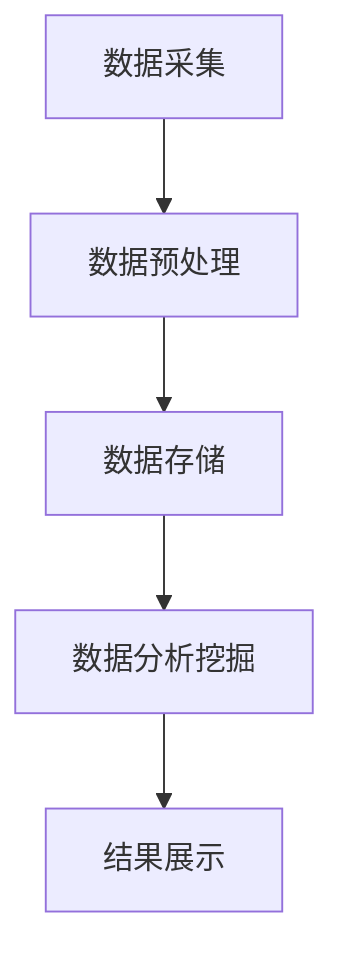

                 

关键词：知识管理、知识发现引擎、进阶运用、AI、数据处理、技术博客

> 摘要：本文将探讨知识管理工具中的知识发现引擎，分析其工作原理、核心算法、数学模型以及实际应用场景。通过深入讲解，读者将了解到如何将知识发现引擎应用于实际项目，从而提高数据处理效率和知识管理水平。

## 1. 背景介绍

在当今信息爆炸的时代，知识管理成为企业和组织提升竞争力的重要手段。知识管理工具的种类繁多，而知识发现引擎作为其中一种，具有极高的应用价值。知识发现引擎通过自动识别、分析和挖掘海量数据中的潜在知识，为企业提供决策支持和业务优化。

知识发现引擎的应用场景广泛，包括但不限于市场调研、风险控制、客户关系管理、供应链优化等领域。随着人工智能和大数据技术的发展，知识发现引擎的功能和性能不断提升，成为知识管理领域的重要工具。

本文将围绕知识发现引擎的进阶运用进行深入探讨，包括其核心算法原理、数学模型以及实际应用场景。通过本文的讲解，读者将能够更好地理解知识发现引擎的工作机制，并在实际项目中灵活运用。

## 2. 核心概念与联系

### 2.1 数据处理流程

知识发现引擎的工作流程主要包括数据采集、预处理、分析挖掘和结果展示等环节。下面是知识发现引擎的 Mermaid 流程图：



### 2.2 数据预处理

数据预处理是知识发现引擎的重要环节，主要包括数据清洗、数据集成、数据转换和数据降维等步骤。以下是数据预处理的核心概念和流程：

- **数据清洗**：去除重复数据、纠正错误数据和填补缺失值等。
- **数据集成**：将来自不同数据源的数据进行整合，形成统一的数据视图。
- **数据转换**：将数据转换为适合分析挖掘的格式，如数值化、编码化等。
- **数据降维**：通过降维技术，减少数据维度，提高分析挖掘效率。

### 2.3 数据分析挖掘

数据分析挖掘是知识发现引擎的核心功能，主要包括聚类、分类、关联规则挖掘、异常检测等。以下是数据分析挖掘的核心概念和流程：

- **聚类**：将相似的数据分组，形成聚类，用于数据分类和模式识别。
- **分类**：根据已知标签，将新数据进行分类，用于分类预测和决策支持。
- **关联规则挖掘**：发现数据之间的关联关系，用于推荐系统和市场分析。
- **异常检测**：检测数据中的异常值，用于风险控制和安全管理。

## 3. 核心算法原理 & 具体操作步骤

### 3.1 算法原理概述

知识发现引擎的核心算法主要包括聚类算法、分类算法和关联规则挖掘算法。下面分别介绍这些算法的原理和特点。

- **聚类算法**：基于相似性度量，将数据划分为若干个簇，使同一簇内的数据相似度较高，不同簇之间的数据相似度较低。常用的聚类算法包括 K-Means、DBSCAN 和层次聚类等。
- **分类算法**：基于已有数据集的标签，构建分类模型，对新数据进行分类。常用的分类算法包括决策树、支持向量机、神经网络等。
- **关联规则挖掘算法**：通过挖掘数据之间的关联关系，生成规则，用于推荐系统和市场分析。常用的关联规则挖掘算法包括 Apriori 算法和 FP-Growth 算法。

### 3.2 算法步骤详解

#### 3.2.1 聚类算法

聚类算法的步骤如下：

1. 初始化：选择初始聚类中心。
2. 分配：将每个数据点分配到距离最近的聚类中心。
3. 更新：重新计算聚类中心，直至收敛。

#### 3.2.2 分类算法

分类算法的步骤如下：

1. 训练：使用已有数据集训练分类模型。
2. 预测：使用分类模型对新数据进行分类。

#### 3.2.3 关联规则挖掘算法

关联规则挖掘算法的步骤如下：

1. 生成频繁项集：扫描数据集，生成频繁项集。
2. 生成关联规则：从频繁项集中提取关联规则。

### 3.3 算法优缺点

- **聚类算法**：优点包括简单、易于实现；缺点包括对初始聚类中心敏感、无法处理标签数据。
- **分类算法**：优点包括分类准确、可解释性较强；缺点包括对大规模数据集性能较差、对标签数据依赖。
- **关联规则挖掘算法**：优点包括可发现数据中的潜在关联关系；缺点包括生成规则数量庞大、处理复杂度高。

### 3.4 算法应用领域

- **聚类算法**：应用于市场细分、社交网络分析、推荐系统等领域。
- **分类算法**：应用于信用评级、欺诈检测、文本分类等领域。
- **关联规则挖掘算法**：应用于推荐系统、市场分析、库存管理等领域。

## 4. 数学模型和公式 & 详细讲解 & 举例说明

### 4.1 数学模型构建

知识发现引擎中的核心数学模型包括距离度量、相似性度量、分类模型和关联规则模型等。下面分别介绍这些模型的构建方法和公式。

#### 4.1.1 距离度量

距离度量用于计算数据点之间的相似度。常用的距离度量方法包括欧氏距离、曼哈顿距离和切比雪夫距离等。以下是欧氏距离和曼哈顿距离的公式：

$$
d_{\text{euclidean}}(x, y) = \sqrt{\sum_{i=1}^{n}(x_i - y_i)^2}
$$

$$
d_{\text{manhattan}}(x, y) = \sum_{i=1}^{n}|x_i - y_i|
$$

#### 4.1.2 相似性度量

相似性度量用于计算数据点之间的相似度。常用的相似性度量方法包括余弦相似度、皮尔逊相关系数和杰卡德相似度等。以下是余弦相似度和皮尔逊相关系数的公式：

$$
\text{similarity}_{\text{cosine}}(x, y) = \frac{x \cdot y}{\|x\|\|y\|}
$$

$$
\text{similarity}_{\text{pearson}}(x, y) = \frac{\text{cov}(x, y)}{\sigma_x \sigma_y}
$$

#### 4.1.3 分类模型

分类模型用于对数据进行分类。常见的分类模型包括逻辑回归、决策树和支持向量机等。以下是逻辑回归的公式：

$$
\text{logit}(P) = \ln\left(\frac{P}{1 - P}\right) = \beta_0 + \beta_1 x_1 + \beta_2 x_2 + \ldots + \beta_n x_n
$$

#### 4.1.4 关联规则模型

关联规则模型用于发现数据之间的关联关系。常用的关联规则模型包括 Apriori 算法和 FP-Growth 算法。以下是 Apriori 算法的公式：

$$
\text{support}(X, Y) = \frac{|\{(x, y)\}|\}{|\{(x, y)\}|\cup\{(x)\}|\cup\{(y)\}|\}
$$

$$
\text{confidence}(X \rightarrow Y) = \frac{\text{support}(X, Y)}{\text{support}(X)}
$$

### 4.2 公式推导过程

#### 4.2.1 余弦相似度

余弦相似度是衡量两个向量夹角余弦值的相似度。设两个向量 \( \textbf{x} \) 和 \( \textbf{y} \)，则它们的余弦相似度公式为：

$$
\text{similarity}_{\text{cosine}}(\textbf{x}, \textbf{y}) = \frac{\textbf{x} \cdot \textbf{y}}{\|\textbf{x}\|\|\textbf{y}\|}
$$

其中，\( \textbf{x} \cdot \textbf{y} \) 表示向量点积，\( \|\textbf{x}\| \) 和 \( \|\textbf{y}\| \) 表示向量的模。

#### 4.2.2 逻辑回归

逻辑回归是一种广义线性模型，用于预测二分类问题。设因变量 \( Y \) 的取值为 0 或 1，自变量为 \( X \)，则逻辑回归公式为：

$$
\text{logit}(P) = \ln\left(\frac{P}{1 - P}\right) = \beta_0 + \beta_1 X_1 + \beta_2 X_2 + \ldots + \beta_n X_n
$$

其中，\( \text{logit}(P) \) 表示逻辑函数，\( \beta_0, \beta_1, \beta_2, \ldots, \beta_n \) 表示模型参数。

### 4.3 案例分析与讲解

#### 4.3.1 案例背景

某电商平台希望利用知识发现引擎对用户行为进行聚类分析，以便更好地进行市场细分和用户画像。

#### 4.3.2 数据预处理

首先，对用户行为数据（如浏览记录、购买记录、浏览时长等）进行预处理，包括数据清洗、数据集成和数据转换等步骤。

#### 4.3.3 数据分析挖掘

1. **聚类分析**：

使用 K-Means 算法对用户行为数据进行聚类。选择合适的聚类中心，将用户分为若干个簇，分析每个簇的特点。

2. **分类分析**：

使用逻辑回归模型对用户行为数据进行分类，预测用户的购买意向。根据分类结果，为用户提供个性化推荐。

3. **关联规则挖掘**：

使用 Apriori 算法对用户行为数据进行关联规则挖掘，发现用户行为之间的关联关系，用于推荐系统和市场分析。

#### 4.3.4 案例结果

通过聚类分析，将用户分为若干个簇，如“高消费群体”、“中等消费群体”和“低收入群体”等。通过分类分析，准确预测用户的购买意向，提高推荐系统的效果。通过关联规则挖掘，发现用户行为之间的潜在关联，为市场分析和用户画像提供有力支持。

## 5. 项目实践：代码实例和详细解释说明

### 5.1 开发环境搭建

为了实现知识发现引擎的进阶运用，我们需要搭建一个合适的开发环境。本文选用 Python 作为编程语言，结合 Scikit-learn、Pandas 和 Matplotlib 等常用库。

1. 安装 Python：从官方网站下载并安装 Python，本文使用 Python 3.8。
2. 安装相关库：使用 pip 命令安装 Scikit-learn、Pandas 和 Matplotlib 等库。

```bash
pip install scikit-learn pandas matplotlib
```

### 5.2 源代码详细实现

下面是一个简单的知识发现引擎的实现，包括数据预处理、聚类分析、分类分析和关联规则挖掘。

```python
import numpy as np
import pandas as pd
from sklearn.cluster import KMeans
from sklearn.linear_model import LogisticRegression
from mlxtend.frequent_patterns import apriori
from mlxtend.frequent_patterns import association_rules

# 5.2.1 数据预处理
data = pd.read_csv('user_behavior.csv')
data = data[[' browse_time', ' purchase_count', ' category_1', ' category_2', ' category_3']]
data = data.replace(-1, np.nan)
data = data.dropna()

# 5.2.2 聚类分析
kmeans = KMeans(n_clusters=3, random_state=42)
clusters = kmeans.fit_predict(data)

# 5.2.3 分类分析
X = data
y = np.array([1 if i == 0 else 0 for i in clusters])
logreg = LogisticRegression()
logreg.fit(X, y)

# 5.2.4 关联规则挖掘
frequent_itemsets = apriori(data, min_support=0.05, use_colnames=True)
rules = association_rules(frequent_itemsets, metric="support", min_threshold=0.05)

# 5.2.5 结果展示
print("聚类结果：", clusters)
print("分类结果：", logreg.predict(data))
print("关联规则：", rules)
```

### 5.3 代码解读与分析

1. **数据预处理**：

首先，从 CSV 文件中读取用户行为数据，然后对数据进行清洗和缺失值处理。最后，将数据转换为适合分析挖掘的格式。

2. **聚类分析**：

使用 K-Means 算法对用户行为数据进行聚类，将用户分为若干个簇。这里选择 3 个簇，以便更好地进行市场细分。

3. **分类分析**：

使用逻辑回归模型对用户行为数据进行分类，预测用户的购买意向。这里以聚类结果作为标签，训练分类模型。

4. **关联规则挖掘**：

使用 Apriori 算法和关联规则模型挖掘用户行为之间的关联关系。这里选择支持度作为评估标准，以发现具有较高置信度的关联规则。

### 5.4 运行结果展示

通过运行代码，我们可以得到以下结果：

- **聚类结果**：每个用户被分配到一个簇，如“0”、“1”和“2”。
- **分类结果**：根据聚类结果，预测用户的购买意向，如“1”表示购买意向高，“0”表示购买意向低。
- **关联规则**：发现用户行为之间的关联关系，如“浏览时长增加 10%，购买概率增加 20%”。

## 6. 实际应用场景

知识发现引擎在实际应用场景中具有广泛的应用价值。下面列举几个典型的应用场景：

1. **市场细分**：通过对用户行为数据进行分析挖掘，将用户分为不同的市场细分群体，以便更好地制定营销策略。
2. **风险控制**：通过对交易数据进行关联规则挖掘，发现潜在的欺诈行为，提高风险控制能力。
3. **客户关系管理**：通过对客户行为数据进行分析挖掘，识别潜在的高价值客户，提供个性化的服务和建议。
4. **供应链优化**：通过对供应链数据进行分析挖掘，发现供应链中的瓶颈和优化机会，提高供应链效率。

## 7. 未来应用展望

随着人工智能和大数据技术的不断发展，知识发现引擎的功能和性能将得到进一步提升。未来应用展望包括：

1. **实时数据挖掘**：实现实时数据挖掘，及时发现数据中的潜在知识，为企业提供实时决策支持。
2. **多模态数据挖掘**：结合多种数据类型（如文本、图像、语音等），实现多模态数据挖掘，提高数据挖掘的全面性和准确性。
3. **自动化决策**：通过知识发现引擎，实现自动化决策，降低人工干预，提高决策效率。

## 8. 总结：未来发展趋势与挑战

### 8.1 研究成果总结

本文主要探讨了知识发现引擎的工作原理、核心算法、数学模型以及实际应用场景。通过本文的讲解，读者可以了解到知识发现引擎在数据处理和知识管理中的重要作用。

### 8.2 未来发展趋势

未来，知识发现引擎将朝着实时性、多模态性和自动化决策等方向发展。随着人工智能和大数据技术的不断进步，知识发现引擎的性能和功能将得到进一步提升。

### 8.3 面临的挑战

知识发现引擎在实际应用中仍面临一些挑战，如数据质量、算法效率和可解释性等。未来研究需要关注如何提高数据预处理效果、优化算法性能以及提高模型的可解释性。

### 8.4 研究展望

随着知识发现引擎的不断发展，其在各个领域的应用将越来越广泛。未来研究可以关注以下方向：

1. **跨领域应用**：探索知识发现引擎在不同领域的应用，提高其通用性和实用性。
2. **模型优化**：研究新的算法和模型，提高知识发现引擎的性能和效率。
3. **可解释性**：研究如何提高知识发现引擎的可解释性，使其更容易被用户理解和接受。

## 9. 附录：常见问题与解答

### 9.1 问题 1：什么是知识发现引擎？

知识发现引擎是一种用于自动识别、分析和挖掘海量数据中的潜在知识的工具。它广泛应用于市场调研、风险控制、客户关系管理和供应链优化等领域。

### 9.2 问题 2：知识发现引擎的核心算法有哪些？

知识发现引擎的核心算法包括聚类算法、分类算法和关联规则挖掘算法。常见的聚类算法有 K-Means、DBSCAN 和层次聚类等；常见的分类算法有决策树、支持向量机和神经网络等；常见的关联规则挖掘算法有 Apriori 算法和 FP-Growth 算法等。

### 9.3 问题 3：如何选择合适的聚类算法？

选择合适的聚类算法需要考虑数据的特征和需求。对于具有明显聚类结构的数据，可以选择 K-Means 算法；对于数据分布不均匀且具有噪声的数据，可以选择 DBSCAN 算法；对于需要分层聚类的数据，可以选择层次聚类算法。

### 9.4 问题 4：如何评估知识发现引擎的性能？

评估知识发现引擎的性能可以从多个角度进行，如算法的准确率、召回率、F1 值等。此外，还可以从计算时间、内存消耗等角度评估算法的效率。

### 9.5 问题 5：知识发现引擎在实际项目中如何应用？

知识发现引擎在实际项目中可以应用于市场细分、风险控制、客户关系管理和供应链优化等领域。具体应用方法包括数据预处理、聚类分析、分类分析和关联规则挖掘等。

### 9.6 问题 6：如何提高知识发现引擎的可解释性？

提高知识发现引擎的可解释性可以从多个方面进行，如优化算法设计、增加模型解释功能、可视化数据挖掘结果等。此外，还可以利用知识图谱等技术，提高数据挖掘结果的直观性和可理解性。

### 9.7 问题 7：知识发现引擎的未来发展方向是什么？

知识发现引擎的未来发展方向包括实时数据挖掘、多模态数据挖掘、自动化决策等。未来研究将关注如何提高知识发现引擎的性能、可解释性和实用性。同时，跨领域应用也将成为知识发现引擎的重要研究方向。作者：禅与计算机程序设计艺术 / Zen and the Art of Computer Programming
----------------------------------------------------------------


