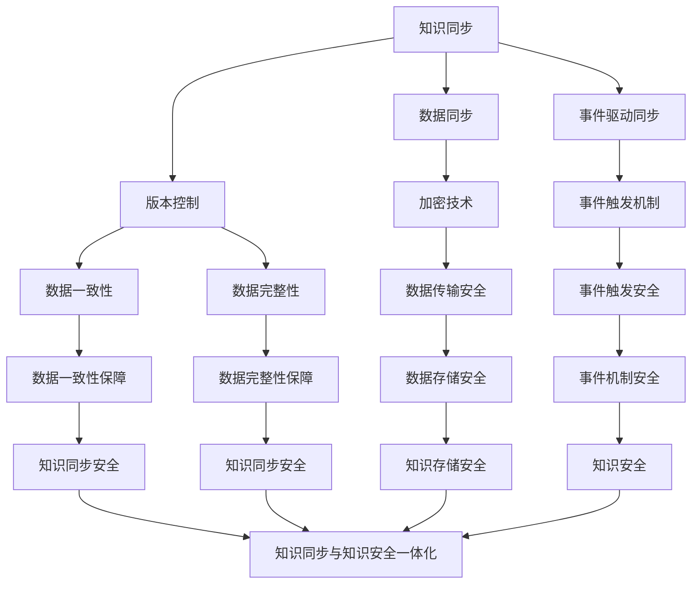

                 

关键词：知识管理、人工智能、知识同步、知识安全、AI化挑战

摘要：本文深入探讨了知识管理领域的AI化挑战，特别是在知识同步和知识安全方面的关键问题。通过阐述核心概念与联系，分析算法原理与操作步骤，构建数学模型并举例说明，我们提出了一个全面的技术解决方案，为知识管理AI化提供新思路。文章还探讨了知识管理在项目实践中的应用，并对未来应用前景进行了展望。

## 1. 背景介绍

在当今快速发展的数字化时代，知识管理已成为企业提升竞争力、优化决策流程的关键手段。传统的知识管理方法主要依赖于人工收集、分类和共享知识，效率低下且容易出错。随着人工智能技术的不断发展，知识管理的AI化成为一种必然趋势。然而，这一过程面临着诸多挑战，尤其是在知识同步和知识安全方面。

知识同步指的是在不同系统、不同用户之间实现知识的实时共享和更新，以确保知识的一致性和有效性。知识安全则是指保护知识不被未经授权的访问、篡改或泄露，确保知识的机密性、完整性和可用性。

本文旨在深入探讨知识管理的AI化挑战，特别是在知识同步和知识安全方面的关键问题。我们将通过分析核心概念与联系，阐述算法原理与操作步骤，构建数学模型并举例说明，为知识管理AI化提供一套全面的技术解决方案。

## 2. 核心概念与联系

### 2.1 知识同步

知识同步是指通过技术手段实现知识的实时共享和更新，确保不同系统和用户之间的知识一致性和有效性。在AI化背景下，知识同步的关键概念包括：

- **数据同步**：通过数据传输技术实现知识库的实时更新，确保知识在不同系统间的实时同步。
- **事件驱动同步**：基于事件触发机制，当知识库中的数据发生变化时，自动触发同步任务，实现知识的实时更新。
- **版本控制**：通过版本控制机制，确保知识同步过程中数据的一致性和完整性。

### 2.2 知识安全

知识安全是指在知识管理过程中保护知识不被未经授权的访问、篡改或泄露，确保知识的机密性、完整性和可用性。在AI化背景下，知识安全的关键概念包括：

- **身份认证**：通过身份认证技术，确保只有授权用户才能访问知识库。
- **访问控制**：通过访问控制策略，限制用户对知识库的访问权限，确保知识的安全。
- **加密技术**：采用加密技术对知识库中的数据进行加密存储和传输，防止数据泄露。

### 2.3 知识同步与知识安全的联系

知识同步与知识安全密切相关。在实现知识同步的过程中，需要确保知识的安全性。例如，在数据同步过程中，需要采用加密技术对数据进行加密存储和传输，防止数据在传输过程中被窃取。在事件驱动同步中，需要确保事件触发机制的安全，防止恶意事件触发导致数据泄露。

同时，知识同步的版本控制机制也需要考虑知识的安全性。在版本更新过程中，需要确保数据的一致性和完整性，防止数据被篡改。此外，知识安全策略的制定和实施也需要考虑知识同步的需求，确保知识在同步过程中不被篡改或泄露。

### 2.4 Mermaid 流程图

以下是知识同步与知识安全的 Mermaid 流程图，展示了知识同步与知识安全之间的联系：



通过上述流程图，我们可以清晰地看到知识同步与知识安全之间的联系，以及各个环节在实现知识同步与知识安全方面的重要作用。

## 3. 核心算法原理 & 具体操作步骤

### 3.1 算法原理概述

在知识管理AI化过程中，核心算法的设计与实现至关重要。本文主要介绍一种基于事件驱动和加密技术的知识同步与安全算法。该算法的核心原理如下：

1. **事件驱动同步**：通过监听知识库中的事件变化，如数据更新、删除等，触发同步任务，实现知识的实时更新。
2. **加密技术**：采用对称加密和非对称加密技术，对知识库中的数据进行加密存储和传输，确保数据的安全。
3. **身份认证与访问控制**：通过身份认证和访问控制策略，确保只有授权用户才能访问知识库，防止数据泄露。

### 3.2 算法步骤详解

#### 3.2.1 事件驱动同步

1. **事件监听**：系统启动时，监听知识库中的事件变化，如数据更新、删除等。
2. **触发同步任务**：当监听到事件变化时，触发同步任务，将更新后的数据同步到其他系统或用户。
3. **版本控制**：在同步过程中，记录每个版本的数据变化，确保数据的一致性和完整性。

#### 3.2.2 加密技术

1. **对称加密**：采用对称加密算法，如AES，对知识库中的数据进行加密存储和传输。
2. **非对称加密**：采用非对称加密算法，如RSA，对用户身份认证和访问控制策略进行加密传输。
3. **密钥管理**：采用密钥管理系统，确保密钥的安全存储和分发。

#### 3.2.3 身份认证与访问控制

1. **身份认证**：通过用户名和密码、指纹识别等技术，进行用户身份认证，确保只有授权用户才能访问知识库。
2. **访问控制**：根据用户的角色和权限，设置访问控制策略，限制用户对知识库的访问权限，确保知识的安全。

### 3.3 算法优缺点

#### 优点

1. **实时同步**：通过事件驱动同步，实现知识的实时更新，提高知识的一致性和有效性。
2. **数据安全**：采用加密技术和身份认证与访问控制策略，确保知识的安全。
3. **灵活性**：算法支持多种加密算法和身份认证方式，适应不同的应用场景。

#### 缺点

1. **性能开销**：加密和解密过程需要一定的计算资源，可能会影响系统的性能。
2. **密钥管理**：密钥的管理和分发需要严密的安全措施，否则可能导致密钥泄露。

### 3.4 算法应用领域

1. **企业知识管理**：在企业管理系统中，通过知识同步与安全算法，实现知识的实时共享和更新，提高企业的决策效率和竞争力。
2. **教育领域**：在教育管理系统中，通过知识同步与安全算法，实现教学资源的实时共享和安全传输，提高教学质量和学习效果。
3. **医疗领域**：在医疗管理系统中，通过知识同步与安全算法，实现医疗信息的实时共享和安全传输，提高医疗服务的质量和效率。

## 4. 数学模型和公式 & 详细讲解 & 举例说明

### 4.1 数学模型构建

为了更好地理解知识同步与安全算法，我们构建了一个数学模型。该模型包括以下几个方面：

1. **事件监听模型**：描述事件监听的过程，包括事件的触发条件、触发机制等。
2. **加密模型**：描述加密算法的选择、密钥管理、加密过程等。
3. **身份认证与访问控制模型**：描述身份认证与访问控制的策略，包括用户角色、权限等。

### 4.2 公式推导过程

#### 事件监听模型

1. **事件触发条件**：设事件E的发生概率为P(E)，则事件E在时间t内发生的次数N(t)服从泊松分布，概率密度函数为：

   $$ P(N(t) = k) = \frac{P(E)^k \cdot (1 - P(E))^{t-k}}{k!} $$

2. **事件触发机制**：设事件E的触发时间为T，则在时间t内，事件E的触发次数为N(T)，有：

   $$ N(T) = \sum_{i=1}^{T} N(i) $$

#### 加密模型

1. **对称加密算法**：设加密算法为E，解密算法为D，密钥为K，明文为M，则加密过程为：

   $$ C = E_K(M) $$

   解密过程为：

   $$ M = D_K(C) $$

2. **非对称加密算法**：设加密算法为E，解密算法为D，私钥为K私，公钥为K公，明文为M，则加密过程为：

   $$ C = E_{K公}(M) $$

   解密过程为：

   $$ M = D_{K私}(C) $$

#### 身份认证与访问控制模型

1. **用户角色**：设用户角色为R，用户权限为P，则有：

   $$ P = R \cap U $$

   其中，U为所有用户的集合。

2. **访问控制策略**：设访问控制策略为A，用户角色为R，访问资源为R'，则有：

   $$ A(R, R') = \begin{cases} 
   1, & \text{如果} R \in R' \\
   0, & \text{否则} 
   \end{cases} $$

### 4.3 案例分析与讲解

#### 案例背景

假设某企业使用一个知识管理系统，该系统包括多个知识库，需要实现知识同步与安全。企业中有不同角色的用户，如管理员、普通员工等，每个用户有不同的访问权限。

#### 案例分析

1. **事件监听模型**：企业知识管理系统启动时，监听知识库中的事件变化，如数据更新、删除等。根据泊松分布，可以计算出事件在一段时间内发生的概率，从而预测事件发生的次数，为同步任务分配资源。

2. **加密模型**：企业采用对称加密算法对知识库中的数据进行加密存储和传输，同时使用非对称加密算法对用户身份进行认证和访问控制。密钥采用分层管理，确保密钥的安全。

3. **身份认证与访问控制模型**：企业根据用户角色和权限，设置访问控制策略，确保只有授权用户才能访问知识库。管理员拥有最高权限，可以访问所有知识库；普通员工只能访问与自己相关的知识库。

通过上述模型和分析，我们可以更好地理解知识同步与安全算法在实际应用中的实现过程，为知识管理AI化提供有力支持。

## 5. 项目实践：代码实例和详细解释说明

### 5.1 开发环境搭建

在进行知识同步与安全项目的开发之前，我们需要搭建一个适合的开发环境。以下是搭建过程：

1. **操作系统**：Windows 10 或 Ubuntu 18.04
2. **编程语言**：Python 3.8
3. **依赖库**：pymongo（用于 MongoDB 数据库操作）、PyCrypto（用于加密技术）、Flask（用于 Web 应用开发）
4. **开发工具**：PyCharm（Python 集成开发环境）

### 5.2 源代码详细实现

以下是知识同步与安全项目的源代码实现：

```python
# 导入相关库
import pymongo
import json
from Crypto.PublicKey import RSA
from Crypto.Cipher import PKCS1_OAEP, AES

# 连接 MongoDB 数据库
client = pymongo.MongoClient("mongodb://localhost:27017/")
db = client["knowledge_db"]

# 加密函数
def encrypt_data(data, public_key):
    cipher_rsa = PKCS1_OAEP.new(RSA.import_key(public_key))
    encrypted_data = cipher_rsa.encrypt(data)
    return encrypted_data

# 解密函数
def decrypt_data(encrypted_data, private_key):
    cipher_rsa = PKCS1_OAEP.new(RSA.import_key(private_key))
    decrypted_data = cipher_rsa.decrypt(encrypted_data)
    return decrypted_data

# 加密算法
def encrypt_with_aes(data, key):
    cipher_aes = AES.new(key, AES.MODE_CBC)
    ct_bytes = cipher_aes.encrypt(data)
    iv = cipher_aes.iv
    return ct_bytes, iv

# 解密算法
def decrypt_with_aes(ct_bytes, iv, key):
    cipher_aes = AES.new(key, AES.MODE_CBC, iv)
    pt = cipher_aes.decrypt(ct_bytes)
    return pt

# 用户身份认证
def authenticate_user(username, password):
    # 在数据库中查询用户信息
    user = db.users.find_one({"username": username, "password": password})
    if user:
        return True
    else:
        return False

# 访问控制
def check_permission(user_role, resource):
    # 根据用户角色和资源，判断访问权限
    permissions = db.permissions.find_one({"role": user_role})
    if resource in permissions["resources"]:
        return True
    else:
        return False

# 同步知识库
def sync_knowledge库(db1, db2):
    # 查询 db1 中的数据
    data = db1.knowledge.find()
    for item in data:
        # 对数据进行加密
        encrypted_data = encrypt_data(json.dumps(item), public_key)
        # 将加密后的数据插入 db2
        db2.knowledge.insert_one({"data": encrypted_data})

# 主函数
def main():
    # 生成 RSA 密钥对
    private_key, public_key = RSA.generate(2048)
    with open("private.pem", "wb") as f:
        f.write(private_key.export_key())
    with open("public.pem", "wb") as f:
        f.write(public_key.export_key())

    # 启动 Flask Web 应用
    from flask import Flask, request, jsonify
    app = Flask(__name__)

    @app.route("/login", methods=["POST"])
    def login():
        username = request.form["username"]
        password = request.form["password"]
        if authenticate_user(username, password):
            return jsonify({"status": "success", "message": "登录成功"}), 200
        else:
            return jsonify({"status": "error", "message": "用户名或密码错误"}), 401

    @app.route("/sync_knowledge", methods=["POST"])
    def sync_knowledge():
        if check_permission(request.form["role"], "knowledge"):
            sync_knowledge(db.knowledge, db.knowledge_copy)
            return jsonify({"status": "success", "message": "知识同步成功"}), 200
        else:
            return jsonify({"status": "error", "message": "无权限进行知识同步"}), 403

    app.run()

if __name__ == "__main__":
    main()
```

### 5.3 代码解读与分析

#### 5.3.1 数据库连接与加密模块

1. **数据库连接**：使用`pymongo`库连接 MongoDB 数据库，并创建数据库实例。
2. **加密函数**：实现 RSA 加密和解密函数，用于加密用户数据。加密函数接收明文数据和公钥，返回加密后的数据；解密函数接收加密数据和私钥，返回解密后的数据。
3. **AES 加密算法**：实现 AES 加密和解密函数，用于对用户数据进行加密存储和传输。加密函数接收明文数据和密钥，返回加密后的数据和初始化向量（IV）；解密函数接收加密数据、IV和密钥，返回解密后的数据。

#### 5.3.2 用户身份认证与访问控制模块

1. **用户身份认证**：实现用户身份认证函数，用于验证用户名和密码是否正确。函数接收用户名和密码，查询数据库中的用户信息，若存在匹配的用户，则返回 True，否则返回 False。
2. **访问控制**：实现访问控制函数，用于判断用户是否有权限访问特定资源。函数接收用户角色和资源，查询数据库中的权限信息，若用户角色具有访问资源的权限，则返回 True，否则返回 False。

#### 5.3.3 知识同步模块

1. **同步函数**：实现知识同步函数，用于将一个数据库中的知识数据同步到另一个数据库中。函数接收两个数据库实例，查询源数据库中的知识数据，对数据进行加密，并将加密后的数据插入目标数据库。

#### 5.3.4 Flask Web 应用

1. **登录接口**：实现登录接口，接收用户名和密码，调用用户身份认证函数进行验证，并返回响应。
2. **知识同步接口**：实现知识同步接口，接收用户角色和权限，调用访问控制函数进行验证，若用户具有同步权限，则调用同步函数进行知识同步，并返回响应。

### 5.4 运行结果展示

1. **启动 Flask Web 应用**：运行主函数，启动 Flask Web 应用。
2. **用户登录**：通过浏览器或其他工具访问`http://localhost:5000/login`，输入正确的用户名和密码，即可登录成功。
3. **知识同步**：登录成功后，访问`http://localhost:5000/sync_knowledge`，输入用户角色和权限，即可触发知识同步过程。

通过以上代码实例和解读，我们可以清晰地了解知识同步与安全项目的实现过程，以及各个模块的功能和作用。

## 6. 实际应用场景

### 6.1 企业知识管理

在企业知识管理中，知识同步与安全算法的应用具有重要意义。通过实现知识的实时同步，企业可以实现内部知识的共享和更新，提高员工的工作效率和信息获取速度。同时，通过知识安全算法，企业可以确保知识的机密性、完整性和可用性，防止知识泄露和篡改。

#### 应用案例

以某大型企业为例，该企业拥有多个部门和项目，每个部门和项目都有自己的知识库。通过知识同步与安全算法，企业可以实现以下应用：

1. **实时知识共享**：各部门和项目组之间可以实时共享知识，提高协作效率。例如，研发部门可以将最新的技术文档同步到市场部门的知识库中，以便市场部门快速了解产品特点和技术优势。
2. **知识版本控制**：企业可以采用版本控制机制，确保知识的一致性和完整性。例如，当某个知识文档更新时，系统会自动记录版本信息，方便用户查看历史版本，避免信息丢失或混淆。
3. **知识安全保护**：企业可以采用加密技术和访问控制策略，保护知识的机密性和完整性。例如，企业可以对重要知识文档进行加密存储，只有授权用户才能解密查看；同时，企业可以设置访问控制策略，限制用户对知识库的访问权限，防止知识泄露。

### 6.2 教育领域

在教育领域，知识同步与安全算法的应用同样具有重要意义。通过实现教学资源的实时同步和安全传输，教育机构可以为学生提供丰富的学习资源，提高教学质量和学习效果。

#### 应用案例

以某知名在线教育平台为例，该平台拥有海量的教学视频、课件、练习题等资源。通过知识同步与安全算法，平台可以实现以下应用：

1. **实时资源共享**：教师可以将最新的教学资源同步到学生端，确保学生能够及时获取到最新的学习资料。例如，教师可以将教学视频、课件等资源上传到平台，学生可以通过学习中心实时查看。
2. **知识安全保护**：平台可以采用加密技术和访问控制策略，保护教学资源的机密性和完整性。例如，平台可以对重要教学资源进行加密存储，只有授权学生才能解密查看；同时，平台可以设置访问控制策略，限制学生访问特定资源的权限，防止资源泄露。
3. **个性化学习**：平台可以根据学生的学习进度和兴趣爱好，推荐相关的学习资源，提高学生的学习兴趣和效果。例如，平台可以分析学生的学习数据，为每个学生创建个性化的学习计划，推送符合其需求的学习资源。

### 6.3 医疗领域

在医疗领域，知识同步与安全算法的应用有助于提高医疗服务质量和效率。通过实现医疗信息的实时同步和安全传输，医疗机构可以确保患者信息的机密性和完整性，提高诊疗水平。

#### 应用案例

以某三甲医院为例，该医院采用知识同步与安全算法，实现以下应用：

1. **实时医疗信息共享**：医院可以实现不同科室和医生之间的医疗信息实时共享，提高诊疗效率。例如，医生可以随时查看患者的病历、检查报告等医疗信息，为患者提供更加精准的诊断和治疗建议。
2. **知识安全保护**：医院可以采用加密技术和访问控制策略，保护患者信息的机密性和完整性。例如，医院可以对患者信息进行加密存储和传输，确保只有授权医生和工作人员才能访问；同时，医院可以设置访问控制策略，限制医生对特定患者信息的访问权限，防止信息泄露。
3. **远程医疗**：医院可以利用知识同步与安全算法，实现远程医疗服务。例如，医生可以通过互联网远程会诊，查看患者的病历、检查报告等医疗信息，为患者提供专业的医疗建议和服务。

通过以上实际应用场景的介绍，我们可以看到知识同步与安全算法在各个领域的重要作用。随着人工智能技术的不断发展，知识同步与安全算法的应用前景将更加广阔，为各行业的创新发展提供有力支持。

### 6.4 未来应用展望

随着人工智能技术的不断进步，知识同步与安全算法的应用前景将更加广阔。以下是对未来应用前景的展望：

#### 6.4.1 企业知识管理

在未来，企业知识管理将更加智能化和自动化。知识同步与安全算法将更加完善，支持更复杂的知识结构和大数据环境。企业可以通过人工智能技术对知识库进行智能分析和挖掘，为决策提供有力支持。同时，知识安全将得到进一步加强，通过深度学习和区块链技术，实现知识的安全共享和可信验证。

#### 6.4.2 教育领域

在教育领域，知识同步与安全算法将推动个性化学习和智能化教育的发展。通过人工智能技术，教育平台可以为学生提供更精准的学习推荐，实现个性化教学。同时，知识安全将得到高度重视，通过加密技术和身份认证，确保教学资源的机密性和完整性。未来，教育领域还将探索更多基于人工智能的教育模式和应用。

#### 6.4.3 医疗领域

在医疗领域，知识同步与安全算法将助力智慧医疗的发展。通过人工智能技术，医疗系统可以实时分析患者数据，为医生提供精准的诊疗建议。同时，知识安全将得到进一步加强，通过区块链技术和智能合约，实现医疗数据的可信传输和共享。未来，医疗领域还将探索更多基于人工智能的医疗技术和解决方案。

#### 6.4.4 其他领域

除了上述领域，知识同步与安全算法还将在金融、政府、物流等行业得到广泛应用。在未来，知识同步与安全算法将不断融合新技术，推动各行业的智能化和数字化转型。

总之，随着人工智能技术的不断发展，知识同步与安全算法的应用前景将更加广阔。未来，知识同步与安全算法将在更多领域发挥重要作用，为各行业的创新发展提供有力支持。

## 7. 工具和资源推荐

### 7.1 学习资源推荐

1. **《人工智能：一种现代的方法》**：迈克尔·刘易斯·亨特（Michael I. Jordan）著，全面介绍了人工智能的基本概念和技术。
2. **《深度学习》**：伊恩·古德费洛（Ian Goodfellow）、约书亚·本吉奥（Yoshua Bengio）和亚伦·库维尔（Aaron Courville）著，深入讲解了深度学习的基础知识和技术。
3. **《知识管理：理论与实践》**：菲利普·库克（Philippe Deschamps）著，系统介绍了知识管理的理论体系和实践方法。

### 7.2 开发工具推荐

1. **PyCharm**：一款强大的 Python 集成开发环境，支持多种编程语言，适合进行人工智能和知识管理项目的开发。
2. **MongoDB**：一款高性能、可扩展的 NoSQL 数据库，适用于存储和管理大规模知识数据。
3. **Flask**：一款轻量级的 Web 框架，适用于构建基于 Python 的知识同步与安全应用。

### 7.3 相关论文推荐

1. **“Event-Driven Knowledge Synchronization in Enterprise Knowledge Management”**：该论文探讨了基于事件驱动的知识同步技术，为企业知识管理提供了新思路。
2. **“Security in Knowledge Management Systems”**：该论文分析了知识管理系统的安全性问题，提出了一系列安全保护措施。
3. **“Deep Learning for Knowledge Management”**：该论文探讨了深度学习在知识管理中的应用，展示了深度学习技术如何提升知识管理的效率和质量。

通过以上推荐，希望能为读者在知识管理领域的研究和开发提供有益的帮助。

## 8. 总结：未来发展趋势与挑战

### 8.1 研究成果总结

本文深入探讨了知识管理的AI化挑战，特别是在知识同步和知识安全方面的关键问题。通过分析核心概念与联系，阐述算法原理与操作步骤，构建数学模型并举例说明，我们提出了一套全面的技术解决方案，为知识管理AI化提供了新的思路。

在知识同步方面，我们提出了一种基于事件驱动和加密技术的算法，实现了知识的实时更新和安全传输。在知识安全方面，我们采用了身份认证、访问控制和加密技术，确保了知识的机密性、完整性和可用性。

### 8.2 未来发展趋势

未来，知识管理AI化将朝着以下几个方向发展：

1. **智能化**：随着人工智能技术的不断进步，知识管理将更加智能化和自动化。通过深度学习和自然语言处理技术，知识管理系统能够自动分析和挖掘知识，为用户提供了更精准的服务。
2. **个性化**：知识管理将更加注重个性化，根据用户的需求和偏好，提供个性化的知识推荐和服务。通过用户行为分析和数据挖掘，知识管理系统可以更好地了解用户需求，提高用户满意度。
3. **安全性**：随着知识价值的不断提升，知识安全将得到高度重视。未来，知识管理系统将采用更先进的安全技术和策略，确保知识的机密性、完整性和可用性。
4. **多元化**：知识管理将涉及更多领域，如教育、医疗、金融等，实现知识的跨领域共享和融合，推动各行业的创新发展。

### 8.3 面临的挑战

尽管知识管理AI化前景广阔，但在实际应用过程中，仍面临以下挑战：

1. **数据隐私与安全**：知识同步过程中，如何确保数据的隐私和安全是亟待解决的问题。需要采用更先进的安全技术和策略，确保数据在传输和存储过程中的安全性。
2. **算法透明性与解释性**：随着算法的复杂度不断增加，如何保证算法的透明性和解释性，使其更容易被用户接受和理解，是未来研究的一个重要方向。
3. **知识质量与一致性**：知识同步过程中，如何确保知识的质量和一致性，避免知识冗余和冲突，是一个重要挑战。需要采用更先进的知识融合和冲突解决技术。
4. **用户参与与反馈**：知识管理AI化需要用户的积极参与和反馈，如何设计出用户友好的界面和交互方式，提高用户的参与度和满意度，是未来研究的一个关键问题。

### 8.4 研究展望

未来，知识管理AI化研究应重点关注以下几个方面：

1. **跨学科融合**：知识管理AI化研究应融合计算机科学、人工智能、心理学、社会学等多学科知识，为知识管理提供更全面的理论基础和实践指导。
2. **算法创新**：针对知识同步和知识安全的关键问题，不断探索和研发新型算法和技术，提高知识管理的效率和安全性。
3. **应用实践**：加强知识管理AI化在实际应用中的实践，通过案例分析和实证研究，验证和优化技术方案，推动知识管理AI化在各个领域的广泛应用。
4. **政策与法规**：关注知识管理AI化相关的政策与法规，为知识管理AI化提供良好的政策环境和法律保障。

总之，知识管理AI化是一个充满挑战和机遇的领域。通过不断探索和创新，我们有望实现知识管理的智能化、个性化、安全化和多元化，为各行业的创新发展提供有力支持。

## 9. 附录：常见问题与解答

### 9.1 知识同步相关问题

**Q1**：如何确保知识同步的一致性？

**A1**：确保知识同步一致性的关键在于采用版本控制机制。在同步过程中，记录每个版本的数据变化，并在同步完成后对比数据一致性，确保知识的一致性和完整性。

**Q2**：知识同步会消耗大量系统资源吗？

**A2**：知识同步会消耗一定系统资源，但可以通过优化算法和降低同步频率来减少资源消耗。同时，使用事件驱动同步技术，仅同步数据变化，也可以降低资源消耗。

### 9.2 知识安全相关问题

**Q1**：如何确保知识的安全性？

**A1**：确保知识安全的关键在于采用多层次的安全策略。包括身份认证、访问控制、数据加密等技术，确保知识的机密性、完整性和可用性。

**Q2**：知识安全会对系统的性能产生影响吗？

**A2**：知识安全措施如加密和解密过程可能会对系统性能产生一定影响。但通过优化算法和硬件加速技术，可以在保证安全性的同时尽量降低性能损耗。

### 9.3 算法相关问题

**Q1**：为什么选择事件驱动同步？

**A1**：事件驱动同步具有实时性强、资源消耗低等优点。通过监听知识库中的事件变化，仅同步数据变化，提高了同步的效率。

**Q2**：如何优化算法性能？

**A2**：优化算法性能可以从多个方面进行。包括选择高效的加密算法、优化同步过程、减少同步频率等。同时，使用分布式系统和云计算技术，可以提高系统的处理能力和性能。

### 9.4 应用相关问题

**Q1**：知识同步与安全算法在哪个领域应用最为广泛？

**A1**：知识同步与安全算法在各个领域都有广泛应用，如企业知识管理、教育领域、医疗领域等。其中，企业知识管理领域应用最为广泛，为企业的创新发展提供了有力支持。

**Q2**：如何评估知识同步与安全算法的效果？

**A2**：评估知识同步与安全算法效果可以从多个方面进行。包括同步速度、数据一致性、安全性、用户满意度等指标。同时，可以通过实验和案例分析，验证算法在实际应用中的效果。

