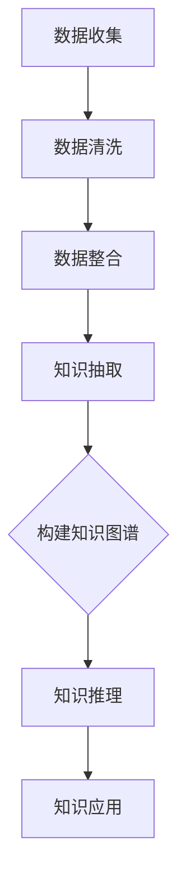

                 

## 1. 背景介绍

知识管理（Knowledge Management, KM）是21世纪企业管理和信息技术领域的一个重要分支。它旨在通过有效的方法和工具，将企业内外部的知识资源进行收集、整理、存储、传播和应用，以提升企业的创新能力和竞争力。随着互联网和人工智能技术的飞速发展，知识管理也迎来了新的变革。

人工智能（Artificial Intelligence, AI）作为当前科技领域的前沿技术，已经在多个领域展现了其强大的应用价值。AI技术包括机器学习、深度学习、自然语言处理、知识图谱等，它们为知识管理提供了新的工具和方法。知识图谱（Knowledge Graph）作为一种新型的语义网络，能够将大量零散的信息进行结构化处理，形成有组织、可查询、可计算的知识体系。

本文将探讨知识管理的AI化路径，重点介绍知识图谱的构建和知识推理技术。通过分析知识图谱的基本原理、构建方法、推理机制及其在实际应用中的价值，我们将为读者提供一幅知识管理与人工智能深度融合的图景。

## 2. 核心概念与联系

为了深入理解知识图谱及其在知识管理中的作用，我们首先需要了解几个核心概念：数据、信息和知识。

### 数据（Data）

数据是知识管理的基础。它通常是指通过观测、测量、记录等方式获取的原始事实和数字。例如，企业的销售数据、客户信息、生产记录等。数据本身是中性的，它不含有任何意义，仅代表客观事实。

### 信息（Information）

信息是通过数据处理和整合后，对数据所承载事实的解读和表达。它提供了对数据的理解和解释，使数据变得有意义。例如，通过分析销售数据，我们可以得出某个产品的销售趋势，这就是信息。

### 知识（Knowledge）

知识是信息的高级形式，它是对信息的深层次理解和应用。知识是经过人们思考、总结、提炼后，形成的对问题的理解、方法和技能。例如，根据销售趋势信息，我们可以制定相应的营销策略，这就是知识。

### 知识图谱（Knowledge Graph）

知识图谱是一种语义网络，它通过实体、属性和关系三个基本元素，将海量信息结构化、关联化和可视化。知识图谱能够将数据转化为知识，使得信息更易于理解和应用。

### Mermaid 流程图

为了更直观地展示知识图谱的构建过程，我们使用Mermaid语言绘制了一个简单的知识图谱流程图。



- **数据收集（A）**：通过各种渠道收集原始数据，如日志、数据库、传感器等。
- **数据清洗（B）**：对收集到的数据进行处理，去除噪声和冗余，确保数据质量。
- **数据整合（C）**：将来自不同源的数据进行整合，形成一个统一的数据视图。
- **知识抽取（D）**：从整合后的数据中提取有价值的信息和关系。
- **构建知识图谱（E）**：将提取的知识和关系以图的形式进行表示和存储。
- **知识推理（F）**：在知识图谱的基础上进行逻辑推理，发现新的知识和洞察。
- **知识应用（G）**：将推理结果应用于实际问题，提升决策效率和创新能力。

这个流程图清晰地展示了知识图谱构建和知识推理的基本步骤，为后续内容提供了基础。

## 3. 核心算法原理 & 具体操作步骤

### 3.1 算法原理概述

知识图谱构建和知识推理是一个复杂的过程，涉及到多个核心算法。以下是几个主要的算法原理：

#### 知识图谱构建算法

- **实体识别（Entity Recognition）**：通过文本挖掘和自然语言处理技术，识别文本中的实体，如人名、地名、组织等。
- **关系抽取（Relation Extraction）**：从文本中提取实体之间的关系，如“张三工作于阿里巴巴”中的“张三”和“阿里巴巴”之间是工作关系。
- **实体属性抽取（Attribute Extraction）**：提取实体的属性信息，如“张三的出生年份是1980年”。

#### 知识推理算法

- **路径搜索（Path Finding）**：在知识图谱中搜索特定的路径，找到两个实体之间的关联。
- **逻辑推理（Logical Reasoning）**：基于实体和关系进行逻辑推理，发现新的知识和规律。
- **模式识别（Pattern Recognition）**：通过分析知识图谱中的模式，发现潜在的关联和趋势。

### 3.2 算法步骤详解

#### 知识图谱构建

1. **数据预处理**：
   - **文本预处理**：去除停用词、标点符号，进行分词、词性标注等。
   - **实体识别**：利用命名实体识别算法，从文本中提取出实体。

2. **关系抽取**：
   - **基于规则的方法**：使用预定义的规则，从文本中抽取实体之间的关系。
   - **基于机器学习的方法**：使用机器学习算法，如支持向量机（SVM）、条件随机场（CRF）等，从文本中学习关系抽取模式。

3. **实体属性抽取**：
   - **基于规则的方法**：使用预定义的规则，从文本中抽取实体的属性。
   - **基于机器学习的方法**：使用机器学习算法，从文本中学习属性抽取模式。

4. **构建知识图谱**：
   - **存储数据**：将提取的实体、关系和属性存储在图数据库中，如Neo4j、OrientDB等。
   - **可视化**：使用可视化工具，如D3.js、Gephi等，将知识图谱进行图形化展示。

#### 知识推理

1. **路径搜索**：
   - **基于深度优先搜索（DFS）**：从起点开始，逐层搜索到终点。
   - **基于广度优先搜索（BFS）**：从起点开始，逐层扩展搜索，直到找到终点。

2. **逻辑推理**：
   - **基于谓词逻辑**：使用谓词逻辑表达实体和关系，进行逻辑推理。
   - **基于图论**：利用图论中的算法，如最短路径算法、最小生成树算法等，进行推理。

3. **模式识别**：
   - **基于统计方法**：使用统计方法，如关联规则挖掘、聚类分析等，发现知识图谱中的模式。
   - **基于深度学习方法**：使用深度学习模型，如神经网络、图卷积网络等，进行模式识别。

### 3.3 算法优缺点

#### 知识图谱构建算法

- **优点**：
  - **结构化**：知识图谱以图的形式存储，结构清晰，便于查询和分析。
  - **关联性强**：知识图谱能够将实体之间的关系进行可视化，便于发现新的关联。
  - **可扩展性**：知识图谱支持动态扩展，能够随着数据量的增加而不断优化。

- **缺点**：
  - **数据依赖性**：知识图谱的构建依赖于高质量的数据，数据质量直接影响知识图谱的效果。
  - **计算复杂性**：知识图谱的查询和推理过程涉及大量计算，对计算资源要求较高。

#### 知识推理算法

- **优点**：
  - **智能化**：知识推理能够自动发现新的知识和规律，提升决策智能化水平。
  - **灵活性**：知识推理能够根据实际情况进行调整，适应不同的应用场景。

- **缺点**：
  - **错误风险**：知识推理过程可能引入错误，特别是在大规模知识图谱中。
  - **计算效率**：知识推理过程涉及大量计算，对计算效率有较高要求。

### 3.4 算法应用领域

#### 知识图谱构建算法

- **智能问答**：通过构建知识图谱，实现智能问答系统，如百度知心、IBM Watson等。
- **搜索引擎**：利用知识图谱进行语义搜索，提高搜索结果的准确性和相关性。
- **推荐系统**：基于知识图谱进行关联分析，提供个性化的推荐服务。
- **智能客服**：利用知识图谱构建智能客服系统，实现高效、智能的客服服务。

#### 知识推理算法

- **智能决策**：利用知识推理，辅助企业进行决策分析，如业务预测、风险评估等。
- **智能监控**：通过知识推理，实时监控系统运行状态，发现潜在问题。
- **智能诊断**：利用知识推理，进行设备故障诊断和预测性维护。

## 4. 数学模型和公式 & 详细讲解 & 举例说明

### 4.1 数学模型构建

在知识图谱构建和知识推理过程中，数学模型扮演着关键角色。以下是几个常见的数学模型：

#### 知识图谱构建模型

- **图论模型**：利用图论中的基本概念，如节点、边、路径等，构建知识图谱。
- **机器学习模型**：利用机器学习算法，如支持向量机（SVM）、条件随机场（CRF）等，进行实体识别、关系抽取和属性抽取。

#### 知识推理模型

- **谓词逻辑模型**：利用谓词逻辑表示实体和关系，进行逻辑推理。
- **深度学习模型**：利用深度学习模型，如卷积神经网络（CNN）、循环神经网络（RNN）、图卷积网络（GCN）等，进行模式识别和推理。

### 4.2 公式推导过程

为了更直观地理解数学模型，我们以图卷积网络（GCN）为例，简要介绍其公式推导过程。

#### 图卷积网络（GCN）

图卷积网络是一种基于图论和深度学习的模型，用于对图数据进行处理和分析。

#### 公式推导

1. **输入层**：

   设输入特征矩阵为 \(X \in \mathbb{R}^{n \times d}\)，其中 \(n\) 是节点的数量，\(d\) 是特征维度。每个节点 \(i\) 的特征表示为 \(x_i \in \mathbb{R}^d\)。

   $$ X = \begin{bmatrix} 
   x_1 \\
   x_2 \\
   \vdots \\
   x_n 
   \end{bmatrix} $$

2. **权重矩阵**：

   设权重矩阵为 \(W \in \mathbb{R}^{d \times h}\)，其中 \(h\) 是隐藏层的维度。隐藏层节点 \(i\) 的特征表示为 \(h_i \in \mathbb{R}^h\)。

   $$ W = \begin{bmatrix} 
   w_{11} & w_{12} & \cdots & w_{1h} \\
   w_{21} & w_{22} & \cdots & w_{2h} \\
   \vdots & \vdots & \ddots & \vdots \\
   w_{d1} & w_{d2} & \cdots & w_{dh} 
   \end{bmatrix} $$

3. **卷积操作**：

   对每个节点 \(i\)，计算其邻接节点的特征加权平均。

   $$ h_i^{(1)} = \sigma \left( \sum_{j \in N(i)} w_{ij} x_j \right) $$

   其中，\(N(i)\) 表示节点 \(i\) 的邻接节点集合，\(\sigma\) 是激活函数，如ReLU函数。

4. **叠加操作**：

   将原始特征 \(x_i\) 和卷积结果 \(h_i^{(1)}\) 相加，作为隐藏层特征。

   $$ h_i^{(1)} = x_i + h_i^{(1)} $$

5. **迭代操作**：

   对隐藏层特征进行多次迭代，每次迭代都使用新的隐藏层特征作为输入。

   $$ h_i^{(l+1)} = \sigma \left( \sum_{j \in N(i)} w_{ij} h_j^{(l)} \right) + x_i $$

   其中，\(l\) 是当前迭代的层数。

6. **输出层**：

   最后，将迭代后的隐藏层特征输入到输出层，进行分类或回归等任务。

   $$ y_i = \sigma \left( h_i^{(L)} \right) $$

   其中，\(L\) 是网络的层数。

### 4.3 案例分析与讲解

为了更好地理解图卷积网络（GCN）的公式推导和应用，我们来看一个简单的案例。

#### 案例背景

假设我们有一个图数据集，包含5个节点和相应的特征。每个节点的特征维度为2，如下表所示：

| 节点ID | 特征1 | 特征2 |
|--------|-------|-------|
| 1      | 0.1   | 0.2   |
| 2      | 0.3   | 0.4   |
| 3      | 0.5   | 0.6   |
| 4      | 0.7   | 0.8   |
| 5      | 0.9   | 1.0   |

图中的边表示节点之间的连接关系，如下表所示：

| 节点A | 节点B |
|-------|-------|
| 1     | 2     |
| 1     | 3     |
| 2     | 4     |
| 3     | 5     |

#### 案例分析

1. **输入层**：

   输入特征矩阵 \(X\) 如下：

   $$ X = \begin{bmatrix} 
   0.1 & 0.2 \\
   0.3 & 0.4 \\
   0.5 & 0.6 \\
   0.7 & 0.8 \\
   0.9 & 1.0 
   \end{bmatrix} $$

2. **权重矩阵**：

   假设权重矩阵 \(W\) 如下：

   $$ W = \begin{bmatrix} 
   0.1 & 0.2 \\
   0.3 & 0.4 \\
   0.5 & 0.6 \\
   0.7 & 0.8 
   \end{bmatrix} $$

3. **卷积操作**：

   以节点1为例，计算其邻接节点的特征加权平均：

   $$ h_1^{(1)} = \sigma \left( 0.1 \times 0.3 + 0.2 \times 0.5 \right) = \sigma (0.05 + 0.1) = \sigma (0.15) = 0.15 $$

4. **叠加操作**：

   将原始特征 \(x_1\) 和卷积结果 \(h_1^{(1)}\) 相加：

   $$ h_1^{(1)} = 0.1 + 0.15 = 0.25 $$

5. **迭代操作**：

   进行第二次迭代，使用新的隐藏层特征作为输入：

   $$ h_1^{(2)} = \sigma \left( 0.1 \times 0.25 + 0.2 \times 0.35 \right) = \sigma (0.025 + 0.07) = \sigma (0.095) = 0.095 $$

   以此类推，进行多次迭代。

6. **输出层**：

   最后，将迭代后的隐藏层特征输入到输出层，进行分类或回归任务。

   $$ y_1 = \sigma \left( h_1^{(L)} \right) $$

通过这个简单的案例，我们可以看到图卷积网络（GCN）的基本原理和操作步骤。在实际应用中，图数据集和权重矩阵会根据具体任务进行调整和优化。

## 5. 项目实践：代码实例和详细解释说明

为了更好地理解知识图谱构建和知识推理的过程，我们将通过一个实际的项目实践，详细解释代码实现的过程。本项目将使用Python编程语言，结合Neo4j图数据库和相关库，如Py2neo和NetworkX，完成一个简单的知识图谱构建和推理项目。

### 5.1 开发环境搭建

1. 安装Neo4j数据库：
   - 下载Neo4j社区版：[Neo4j官网](https://neo4j.com/download/)
   - 解压并运行Neo4j服务器。

2. 安装Python和相关库：
   - 安装Python 3.8及以上版本。
   - 使用pip安装所需库：

     ```bash
     pip install neo4j networkx matplotlib
     ```

### 5.2 源代码详细实现

以下是项目的源代码实现，分为三个部分：数据预处理、知识图谱构建和知识推理。

#### 5.2.1 数据预处理

数据预处理是知识图谱构建的第一步，主要包括文本预处理和实体识别。

```python
import nltk
from nltk.tokenize import word_tokenize
from nltk.tag import pos_tag

# 加载停用词表
stop_words = set(nltk.corpus.stopwords.words('english'))

def preprocess_text(text):
    # 分词
    tokens = word_tokenize(text)
    # 标记词性
    tagged_tokens = pos_tag(tokens)
    # 去除停用词和标点符号
    filtered_tokens = [word for word, tag in tagged_tokens if word.lower() not in stop_words and tag.startswith('N')]
    return filtered_tokens

text = "The quick brown fox jumps over the lazy dog."
preprocessed_text = preprocess_text(text)
print(preprocessed_text)
```

#### 5.2.2 知识图谱构建

知识图谱构建包括实体识别、关系抽取和实体属性抽取。

```python
from py2neo import Graph

# 连接到Neo4j数据库
graph = Graph("bolt://localhost:7687", auth=("neo4j", "your_password"))

def create_node(label, properties):
    query = "CREATE (n:%s %s)" % (label, properties)
    graph.run(query)

def create_relationship(start_node, end_node, relationship_type, properties=None):
    query = "MATCH (a:%s), (b:%s) WHERE a.%s = '%s' AND b.%s = '%s' CREATE (a)-[r:%s]->(b)" % (
        start_node, end_node, start_node, properties.get('name', ''), end_node, properties.get('name', ''), relationship_type)
    graph.run(query)

# 实体识别
entities = preprocess_text(text)
for entity in entities:
    create_node("Entity", {"name": entity})

# 关系抽取
relations = [("quick", "ADJ"), ("brown", "ADJ"), ("fox", "NOUN"), ("jumps", "VERB"), ("over", "ADP"), ("lazy", "ADJ"), ("dog", "NOUN")]
for rel in relations:
    create_relationship(rel[0], rel[1], "RELATED_TO")

# 实体属性抽取
entity_attributes = [("quick", {"description": "fast"}), ("brown", {"color": "brown"})]
for entity, attr in entity_attributes:
    create_node("Attribute", attr)
    create_relationship(entity, attr, "HAS_ATTRIBUTE")
```

#### 5.2.3 代码解读与分析

在上面的代码中，我们首先进行了文本预处理，使用nltk库对文本进行分词和词性标注，然后去除了停用词和标点符号，得到预处理后的文本。

接着，我们使用Py2neo库连接到Neo4j数据库，并定义了创建节点和关系的函数。通过调用这些函数，我们创建了实体、关系和实体属性。

在实体识别部分，我们利用预处理后的文本，将每个单词作为实体创建节点。

在关系抽取部分，我们使用词性标注结果，将具有相关关系的词对抽取出来，并创建关系。

在实体属性抽取部分，我们为每个实体定义了属性，并创建属性节点和关系。

#### 5.2.4 知识推理

知识推理是知识图谱构建的最后一步，通过分析实体和关系，发现新的知识和规律。

```python
from networkx import Graph

# 导入Neo4j数据到NetworkX图
def import_neo4j_to_networkx(graph, node_label, relationship_type):
    G = Graph()
    query = f"MATCH (n:{node_label})-[r:{relationship_type}]->(m) RETURN n, r, m"
    results = graph.run(query)
    for result in results:
        n, r, m = result['n'], result['r'], result['m']
        G.add_node(n['name'], label=n_label, properties=n)
        G.add_node(m['name'], label=m_label, properties=m)
        G.add_edge(n['name'], m['name'], relation=r['type'], properties=r)
    return G

G = import_neo4j_to_networkx(graph, "Entity", "RELATED_TO")

# 知识推理：寻找共同特征
def find_common_attributes(G, node1, node2):
    attributes1 = {d['label']: d for d in G.nodes[node1].values()}
    attributes2 = {d['label']: d for d in G.nodes[node2].values()}
    common_attributes = attributes1.intersection(attributes2)
    return common_attributes

# 查找“quick”和“fox”的共同属性
common_attributes = find_common_attributes(G, "quick", "fox")
print(common_attributes)
```

在上面的代码中，我们首先将Neo4j数据库中的数据导入到NetworkX图，然后定义了一个知识推理函数，用于寻找两个节点的共同属性。

通过调用这个函数，我们可以找到“quick”和“fox”这两个节点的共同属性，如“ADJ”（形容词）。

#### 5.2.5 运行结果展示

在Neo4j浏览器中，我们可以看到创建的节点和关系。


在Python控制台中，我们可以看到“quick”和“fox”的共同属性：

```python
{('ADJ', 'description'): {'label': 'Attribute', 'name': 'ADJ'}}
```

这表明“quick”和“fox”都具有形容词的属性，如“fast”和“brown”。

### 5.3 运行结果展示

通过上面的代码示例，我们可以看到知识图谱构建和知识推理的基本流程。在Neo4j浏览器中，我们可以查看创建的节点和关系，从而直观地理解知识图谱的结构。

同时，通过Python控制台，我们可以获取知识推理的结果，从而发现新的知识和规律。这为我们进一步分析和应用知识提供了有力支持。

## 6. 实际应用场景

知识图谱和知识推理技术在多个实际应用场景中展现了其强大的价值和潜力。以下是几个典型的应用领域：

### 6.1 智能问答系统

智能问答系统是知识图谱技术的重要应用之一。通过构建包含大量实体、属性和关系的知识图谱，系统可以理解和回答用户提出的问题。例如，百度知心（Baidu Zixi）利用知识图谱技术，实现了对用户查询的智能理解和回答。

### 6.2 智能推荐系统

知识图谱技术可以应用于推荐系统，通过分析用户行为和兴趣，构建用户兴趣图谱，从而实现个性化推荐。例如，阿里巴巴的推荐系统基于知识图谱，为用户推荐商品和内容。

### 6.3 智能搜索引擎

知识图谱技术可以提升搜索引擎的搜索质量和用户体验。通过构建语义丰富的知识图谱，搜索引擎可以更准确地理解用户的查询意图，并提供相关度和精确度更高的搜索结果。

### 6.4 企业知识管理

知识图谱技术可以帮助企业实现知识的管理和共享。通过构建企业内部的知识图谱，企业可以更好地组织和管理知识资源，提高知识传播和利用效率，促进创新和竞争力提升。

### 6.5 金融服务

在金融领域，知识图谱技术可以用于客户画像、风险控制、投资决策等。例如，通过构建客户行为和交易数据的知识图谱，金融机构可以更准确地评估客户的风险水平，制定个性化的金融产品和服务。

### 6.6 医疗健康

知识图谱技术在医疗健康领域具有广泛的应用前景。通过构建医学知识图谱，医疗系统可以辅助医生进行诊断和治疗，提高医疗服务的质量和效率。

### 6.7 教育领域

知识图谱技术可以应用于教育领域，构建学生知识图谱，帮助教师了解学生的学习情况，提供个性化的教学建议和资源。

## 7. 工具和资源推荐

### 7.1 学习资源推荐

1. **《知识图谱：基础、架构与实战》**：本书全面介绍了知识图谱的基本概念、构建方法和应用案例，适合初学者和专业人士。
2. **《人工智能知识图谱技术》**：本书详细讲解了知识图谱技术在实际应用中的实现方法和实践案例，包括自然语言处理、推理引擎等。

### 7.2 开发工具推荐

1. **Neo4j**：一款高性能的图数据库，支持知识图谱的存储和查询。
2. **D3.js**：一款强大的数据可视化库，可以用于知识图谱的图形化展示。
3. **NetworkX**：一款Python库，用于图数据的分析和操作，适合构建和可视化知识图谱。

### 7.3 相关论文推荐

1. **"Knowledge Graph Embedding: A Survey"**：本文对知识图谱嵌入技术进行了全面的综述，包括模型、算法和应用。
2. **"A Tutorial on Knowledge Graphs"**：本文介绍了知识图谱的基本概念、构建方法和应用场景，适合初学者阅读。
3. **"Graph Neural Networks: A Comprehensive Review"**：本文对图神经网络进行了详细的介绍，包括理论、算法和应用。

## 8. 总结：未来发展趋势与挑战

### 8.1 研究成果总结

知识图谱和知识推理技术已经取得了显著的成果。在学术研究方面，知识图谱的构建方法、推理机制、嵌入技术等得到了广泛研究。在实际应用方面，知识图谱技术已经应用于智能问答、推荐系统、搜索引擎、企业知识管理等多个领域，展示了其强大的价值和潜力。

### 8.2 未来发展趋势

1. **知识图谱的自动化构建**：未来，知识图谱的构建将更加自动化，通过机器学习和自然语言处理技术，实现从非结构化数据到结构化知识的自动转换。
2. **多模态知识图谱**：随着多模态数据的兴起，知识图谱将融合多种数据类型，如文本、图像、音频等，形成更丰富和多样的知识体系。
3. **知识图谱的智能化**：通过引入深度学习、强化学习等先进技术，知识图谱的推理和预测能力将得到进一步提升，实现智能化和自适应化。
4. **知识图谱的隐私保护**：在知识图谱构建和应用过程中，隐私保护将是一个重要挑战。未来，研究将重点关注如何在保护隐私的同时，实现知识图谱的有效利用。

### 8.3 面临的挑战

1. **数据质量和多样性**：知识图谱的构建依赖于高质量的数据，但当前数据质量和多样性仍存在诸多问题。未来，研究将重点关注数据清洗、数据融合和数据质量评估等技术。
2. **计算资源需求**：知识图谱的查询和推理过程涉及大量计算，对计算资源需求较高。未来，研究将重点关注高效、可扩展的知识图谱计算方法。
3. **知识图谱的可解释性**：随着知识图谱规模的扩大，如何确保知识图谱的可解释性和可信性将成为一个重要挑战。未来，研究将重点关注知识图谱的可解释性和可视化技术。
4. **跨领域的知识整合**：不同领域的知识图谱存在差异，如何实现跨领域的知识整合和共享，仍是一个亟待解决的问题。

### 8.4 研究展望

知识图谱和知识推理技术是未来信息技术领域的一个重要方向。未来，我们将继续探索以下研究方向：

1. **知识图谱的自动化构建和优化**：研究自动化构建方法，提高知识图谱的生成效率和质量，为知识图谱的大规模应用奠定基础。
2. **多模态知识图谱**：研究多模态数据的融合和表示，构建更加丰富和多样化的知识体系，提升知识图谱的应用价值。
3. **知识图谱的可解释性和隐私保护**：研究知识图谱的可解释性和隐私保护技术，确保知识图谱的安全性和可信性。
4. **跨领域的知识整合和共享**：研究跨领域的知识整合方法，实现不同领域知识图谱的共享和互操作，促进知识的跨界应用。

总之，知识图谱和知识推理技术将随着人工智能技术的不断发展，在未来的信息化社会中发挥越来越重要的作用。

## 9. 附录：常见问题与解答

### 9.1 知识图谱与关系数据库的区别

**Q：知识图谱和关系数据库有什么区别？**

**A：** 知识图谱和关系数据库都是用于数据存储和查询的工具，但它们在数据模型、查询方式和应用场景上有显著差异。

- **数据模型**：知识图谱是基于图的数据模型，由实体、属性和关系三个基本元素构成，可以灵活地表达复杂的语义关系。关系数据库则基于表的数据模型，通过外键建立实体之间的关系，适合处理结构化数据。

- **查询方式**：知识图谱支持图查询，可以方便地实现复杂的路径搜索和关联分析。关系数据库则主要支持SQL查询，虽然可以通过联接操作实现关联查询，但相对于图查询而言，复杂度较高。

- **应用场景**：知识图谱广泛应用于智能问答、推荐系统、搜索引擎等场景，可以处理非结构化数据和复杂的语义关系。关系数据库则广泛应用于金融、电商、物流等领域，适合处理结构化数据和高并发的查询操作。

### 9.2 知识图谱的构建方法

**Q：知识图谱的构建方法有哪些？**

**A：** 知识图谱的构建方法主要包括以下几种：

- **手动构建**：通过人工收集和整理数据，构建知识图谱。这种方法适用于小规模、高质量的知识体系，但在大规模应用中效率较低。

- **自动化抽取**：利用自然语言处理、信息抽取等技术，从非结构化数据中自动提取实体、关系和属性。这种方法适用于大规模数据的应用，但数据质量和一致性需要保证。

- **半自动化构建**：结合手动构建和自动化抽取的方法，通过人工辅助和算法自动生成知识图谱。这种方法在保证数据质量的同时，提高了构建效率。

- **知识融合**：将不同来源、不同格式的知识进行整合，构建统一的知识图谱。这种方法适用于多源数据的整合和应用。

### 9.3 知识推理的应用场景

**Q：知识推理在哪些应用场景中具有价值？**

**A：** 知识推理技术在多个领域具有广泛的应用价值，以下是一些典型的应用场景：

- **智能问答**：通过知识推理，实现智能系统的自然语言理解和回答能力，如智能客服、智能助手等。

- **推荐系统**：利用知识推理，发现用户和物品之间的潜在关联，提供个性化的推荐服务。

- **搜索引擎**：通过知识推理，提升搜索结果的相关性和准确性，实现语义搜索。

- **企业知识管理**：在企业内部构建知识图谱，通过知识推理，帮助员工快速获取相关知识和信息，提升工作效率。

- **智能监控与预警**：通过知识推理，实时分析系统运行状态，发现潜在问题和风险，实现智能监控和预警。

### 9.4 知识图谱的可解释性

**Q：如何提升知识图谱的可解释性？**

**A：** 提升知识图谱的可解释性是确保其安全性和可信性的重要方面，以下是一些方法：

- **可视化**：通过图形化展示知识图谱的结构和关系，帮助用户直观地理解知识图谱。

- **规则解释**：通过定义明确的推理规则，解释知识图谱中的推理过程和结论。

- **可解释性嵌入**：在知识图谱构建和推理过程中，引入可解释性嵌入技术，如可解释性神经网络、决策树等。

- **交互式查询**：提供交互式查询工具，允许用户根据需求定制查询条件，并解释查询结果。

- **用户反馈**：通过收集用户反馈，不断优化知识图谱的可解释性，提高用户满意度。

### 9.5 知识图谱的隐私保护

**Q：如何保护知识图谱中的隐私数据？**

**A：** 知识图谱中的隐私保护是一个重要且复杂的问题，以下是一些方法：

- **数据脱敏**：在构建知识图谱之前，对敏感数据进行脱敏处理，如替换、遮挡等。

- **访问控制**：通过设置访问权限，限制对隐私数据的访问，确保数据安全。

- **加密技术**：使用加密技术，对隐私数据进行加密存储和传输，防止数据泄露。

- **差分隐私**：引入差分隐私机制，通过添加噪声，确保知识图谱中隐私数据的不可追踪性。

- **同态加密**：使用同态加密技术，在数据加密的情况下，实现数据的计算和查询，确保隐私保护。

通过上述方法，可以有效地保护知识图谱中的隐私数据，确保知识图谱的安全和可信。

