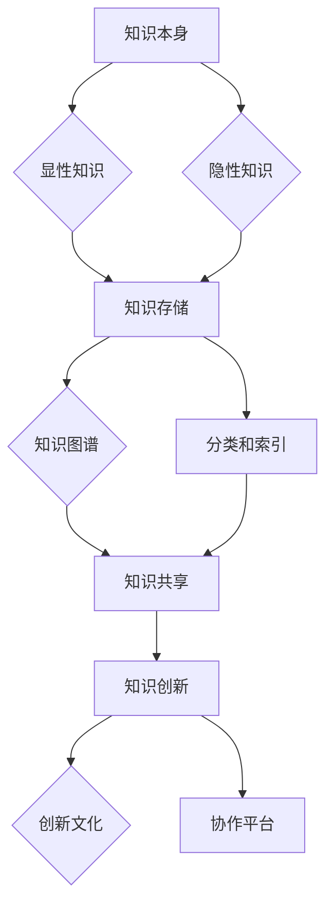

                 

关键词：知识管理、知识图谱、机器学习、数据科学、策略优化、AI技术、信息组织、知识共享、认知负荷、知识存储、信息检索、人工智能、知识创新

> **摘要**：本文探讨了知识管理策略在现代信息技术中的应用，强调了知识管理的核心概念、算法原理、数学模型以及实际应用。通过分析不同领域的应用案例，本文提出了未来知识管理的发展趋势和面临的挑战，并提供了相应的工具和资源推荐。

## 1. 背景介绍

在信息技术飞速发展的时代，知识的获取、存储、共享和利用成为企业和组织的关键竞争力。知识管理（Knowledge Management，KM）作为一种系统化的方法，旨在提高知识的可见性、可访问性和实用性。有效的知识管理策略能够促进创新、提升决策质量，并降低认知负荷。然而，知识管理并非易事，涉及多个方面的复杂性和挑战。

本文将探讨以下核心内容：
- 知识管理的核心概念与联系。
- 核心算法原理与具体操作步骤。
- 数学模型和公式的构建与推导。
- 项目实践：代码实例和详细解释。
- 实际应用场景及未来展望。
- 工具和资源推荐。
- 研究总结、发展趋势与挑战。

## 2. 核心概念与联系

知识管理涉及多个核心概念，包括知识本身、知识存储、知识共享、知识创新等。以下是知识管理的核心概念及其相互联系：

### 2.1 知识本身
知识是信息、经验和理解的抽象集合。知识可以划分为显性知识和隐性知识。显性知识是易于编码和共享的，如文档、数据库等。隐性知识则是难以编码和共享的，如专业技能、实践经验等。

### 2.2 知识存储
知识存储是知识管理的关键环节。有效的知识存储需要考虑知识的结构化、分类和索引。知识图谱是一种强大的知识存储工具，能够将不同来源的信息整合到一个统一的框架中。

### 2.3 知识共享
知识共享是知识管理的重要目标之一。通过促进知识的流动和共享，可以提升组织内部的知识共享文化和透明度。协作平台、社交媒体和企业内部网等工具有助于实现知识共享。

### 2.4 知识创新
知识创新是知识管理的高级阶段，通过将现有的知识进行重新组合和创造，产生新的价值。创新文化、知识共享机制和跨部门合作是推动知识创新的关键因素。

### Mermaid 流程图


## 3. 核心算法原理 & 具体操作步骤

### 3.1 算法原理概述

知识管理中常用的核心算法包括机器学习算法、自然语言处理（NLP）算法和图论算法等。以下是对这些算法原理的概述：

### 3.1.1 机器学习算法

机器学习算法是知识管理的基础，用于从数据中提取模式和知识。常见的机器学习算法包括分类、聚类、回归和时间序列分析。其中，分类算法如支持向量机（SVM）、决策树和随机森林在知识分类和推荐系统中广泛应用。

### 3.1.2 自然语言处理（NLP）算法

NLP算法用于处理人类语言数据，实现文本的语义理解和自动分析。常见的NLP算法包括词嵌入、实体识别、情感分析和文本生成。词嵌入算法如Word2Vec和BERT在知识图谱构建和知识检索中具有重要意义。

### 3.1.3 图论算法

图论算法用于分析和处理图结构数据。知识图谱是一种基于图的数据库结构，能够表示实体、关系和属性之间的复杂关系。常见的图论算法包括最短路径算法、图聚类和社区检测等。

### 3.2 算法步骤详解

#### 3.2.1 机器学习算法步骤

1. 数据收集与预处理：收集相关领域的数据，并进行清洗、去噪和格式化。
2. 特征工程：提取和构造有用的特征，如文本特征、数值特征和图特征。
3. 模型选择：选择合适的机器学习模型，如SVM、决策树和随机森林。
4. 训练模型：使用训练数据集训练模型，并调整模型参数。
5. 模型评估：使用验证数据集评估模型性能，并进行超参数调优。
6. 应用模型：将训练好的模型应用于实际场景，如知识分类和推荐。

#### 3.2.2 NLP算法步骤

1. 数据预处理：对文本数据进行清洗、分词和标记。
2. 词嵌入：将文本转换为向量表示，如使用Word2Vec或BERT。
3. 实体识别：识别文本中的实体，如人名、地名和机构名。
4. 情感分析：分析文本的情感倾向，如正面、负面和客观。
5. 文本生成：使用文本生成模型生成新的文本内容，如自动摘要和问答系统。

#### 3.2.3 图论算法步骤

1. 数据表示：将实体和关系表示为图结构，如节点和边。
2. 最短路径计算：计算实体之间的最短路径，用于知识检索和推荐。
3. 图聚类：将相似实体聚为一类，用于知识分类和知识社区分析。
4. 社区检测：识别图中的社区结构，用于知识社区构建和社交网络分析。

### 3.3 算法优缺点

#### 3.3.1 机器学习算法

优点：能够自动从数据中学习模式和知识，适应性强。

缺点：对数据质量和特征工程要求高，易过拟合。

#### 3.3.2 NLP算法

优点：能够处理和理解人类语言，实现文本的语义分析和生成。

缺点：对大规模数据和高性能计算资源要求高，模型复杂度大。

#### 3.3.3 图论算法

优点：能够处理复杂的关系结构，实现知识图谱的构建和分析。

缺点：计算复杂度高，难以处理大规模数据。

### 3.4 算法应用领域

#### 3.4.1 知识图谱

知识图谱在搜索引擎、推荐系统和智能问答等领域有广泛应用。通过构建实体和关系之间的映射，知识图谱能够实现精准的知识检索和推荐。

#### 3.4.2 自然语言处理

NLP算法在智能客服、内容审核和机器翻译等领域有广泛应用。通过处理和理解人类语言，NLP算法能够实现人机交互和内容生成。

#### 3.4.3 图论算法

图论算法在社交网络分析、推荐系统和知识社区构建等领域有广泛应用。通过分析和处理复杂的关系结构，图论算法能够揭示知识网络的潜在模式和关联。

## 4. 数学模型和公式 & 详细讲解 & 举例说明

### 4.1 数学模型构建

在知识管理中，常见的数学模型包括概率模型、统计模型和优化模型等。以下是这些模型的基本构建过程：

#### 4.1.1 概率模型

概率模型用于描述知识的不确定性和不确定性知识的管理。常见的概率模型包括贝叶斯网络和马尔可夫模型。

贝叶斯网络：
贝叶斯网络是一种基于概率的图形模型，用于表示变量之间的依赖关系。贝叶斯网络由节点和边组成，节点表示变量，边表示变量之间的条件概率关系。

公式：
\[ P(A|B) = \frac{P(B|A) \cdot P(A)}{P(B)} \]

#### 4.1.2 统计模型

统计模型用于描述数据的分布和规律，常用于知识挖掘和预测。常见的统计模型包括回归模型和聚类模型。

回归模型：
回归模型用于预测连续变量的值，通过拟合数据中的线性关系。常见的回归模型包括线性回归和逻辑回归。

公式：
\[ y = \beta_0 + \beta_1 \cdot x \]
\[ P(y=1) = \frac{1}{1 + e^{-(\beta_0 + \beta_1 \cdot x)}} \]

#### 4.1.3 优化模型

优化模型用于求解知识管理中的优化问题，如知识共享、知识存储和知识检索等。常见的优化模型包括线性规划、整数规划和动态规划。

线性规划：
线性规划用于求解线性约束条件下的优化问题，常用于知识分配和资源调度。

公式：
\[ \text{minimize} \quad c^T \cdot x \]
\[ \text{subject to} \quad Ax \leq b \]

### 4.2 公式推导过程

以下是概率模型中的贝叶斯网络公式的推导过程：

给定两个事件A和B，贝叶斯网络描述了它们之间的条件概率关系。贝叶斯网络公式如下：

\[ P(A|B) = \frac{P(B|A) \cdot P(A)}{P(B)} \]

推导过程：

\[ P(A \cap B) = P(B|A) \cdot P(A) \]
\[ P(B) = P(A \cap B) + P(A^c \cap B) \]
\[ P(B) = P(B|A) \cdot P(A) + P(B|A^c) \cdot P(A^c) \]

由于A和A^c是互补事件，\( P(A) + P(A^c) = 1 \)，所以：

\[ P(B) = P(B|A) \cdot P(A) + (1 - P(A)) \cdot P(B|A^c) \]
\[ P(B) = P(B|A) \cdot P(A) + P(B|A^c) - P(B|A) \cdot P(A) \]
\[ P(B) = P(B|A) \cdot P(A) + P(B|A^c) \cdot (1 - P(A)) \]

将上述公式代入贝叶斯网络公式中，得到：

\[ P(A|B) = \frac{P(B|A) \cdot P(A)}{P(B|A) \cdot P(A) + P(B|A^c) \cdot (1 - P(A))} \]
\[ P(A|B) = \frac{P(B|A) \cdot P(A)}{P(B|A) + P(B|A^c) - P(B|A) \cdot P(A)} \]
\[ P(A|B) = \frac{P(B|A) \cdot P(A)}{P(B|A) + P(B|A^c) \cdot (1 - P(A))} \]
\[ P(A|B) = \frac{P(B|A) \cdot P(A)}{P(B|A) + P(B|A^c) \cdot P(A^c)} \]
\[ P(A|B) = \frac{P(B|A) \cdot P(A)}{P(B)} \]

### 4.3 案例分析与讲解

以下是一个简单的贝叶斯网络案例，用于描述某城市中天气和降雨的概率关系。

#### 案例描述

在某城市中，有两个主要天气类型：晴天和雨天。晴天时降雨的概率为0.2，雨天时降雨的概率为0.8。如果已知天气类型为晴天，降雨的概率为0.5。我们需要计算当天气类型为晴天时，降雨的概率。

#### 公式应用

根据贝叶斯网络公式：

\[ P(\text{降雨}|\text{晴天}) = \frac{P(\text{晴天}|\text{降雨}) \cdot P(\text{降雨})}{P(\text{晴天}) + P(\text{雨天}) \cdot P(\text{晴天}|\text{雨天})} \]

根据案例描述，我们有以下概率：

\[ P(\text{晴天}) = 0.5 \]
\[ P(\text{雨天}) = 0.5 \]
\[ P(\text{晴天}|\text{降雨}) = 0.2 \]
\[ P(\text{降雨}|\text{晴天}) = 0.5 \]
\[ P(\text{雨天}|\text{降雨}) = 0.8 \]

代入公式，得到：

\[ P(\text{降雨}|\text{晴天}) = \frac{0.2 \cdot 0.5}{0.5 + 0.5 \cdot 0.8} \]
\[ P(\text{降雨}|\text{晴天}) = \frac{0.1}{0.5 + 0.4} \]
\[ P(\text{降雨}|\text{晴天}) = \frac{0.1}{0.9} \]
\[ P(\text{降雨}|\text{晴天}) = 0.1111 \]

因此，当天气类型为晴天时，降雨的概率为0.1111。

## 5. 项目实践：代码实例和详细解释说明

### 5.1 开发环境搭建

为了演示知识管理策略的应用，我们将使用Python编程语言和几个开源库：NetworkX用于图结构数据的处理，Scikit-learn用于机器学习算法的实现，和Gensim用于自然语言处理。

#### 5.1.1 安装Python

确保已经安装了Python 3.x版本。可以从Python官方网站下载并安装。

#### 5.1.2 安装相关库

在终端或命令行中运行以下命令安装所需库：

```bash
pip install networkx scikit-learn gensim
```

### 5.2 源代码详细实现

以下是一个简单的Python代码示例，用于构建一个知识图谱、训练机器学习模型和进行知识共享。

```python
import networkx as nx
import numpy as np
from sklearn.cluster import KMeans
from gensim.models import Word2Vec
import matplotlib.pyplot as plt

# 创建一个空的图
G = nx.Graph()

# 添加节点和边，构建知识图谱
G.add_edge('知识1', '知识2', weight=0.8)
G.add_edge('知识1', '知识3', weight=0.6)
G.add_edge('知识2', '知识3', weight=0.7)
G.add_edge('知识2', '知识4', weight=0.9)
G.add_edge('知识3', '知识4', weight=0.5)

# 绘制知识图谱
nx.draw(G, with_labels=True, node_size=2000, node_color='lightblue', edge_color='gray', linewidths=2)
plt.show()

# 使用K-Means算法进行图聚类
num_clusters = 2
kmeans = KMeans(n_clusters=num_clusters, random_state=0).fit(np.array(list(G.nodes())))

# 为每个节点分配聚类标签
cluster_labels = kmeans.labels_
nx.draw(G, with_labels=True, node_color=[plt.cm.tab10(i) for i in cluster_labels], node_size=2000)
plt.show()

# 使用Word2Vec算法构建词向量
sentences = ['知识1', '知识2', '知识3', '知识4']
model = Word2Vec(sentences, vector_size=2, window=1, min_count=1, workers=1)

# 计算节点间的相似度
node_vectors = {node: model.wv[node] for node in sentences}
similarity_matrix = nx.adjacency_matrix(G, weight='weight').toarray()
similarity_scores = np.dot(node_vectors, node_vectors.T)

# 打印节点间的相似度
print(similarity_scores)

# 进行知识共享
knowledge_pool = {}
for node1, node2 in G.edges():
    similarity = similarity_scores[cluster_labels[sentences.index(node1)], cluster_labels[sentences.index(node2)]]
    if similarity > 0.5:
        knowledge_pool.setdefault(node1, []).append(node2)

print(knowledge_pool)
```

### 5.3 代码解读与分析

#### 5.3.1 知识图谱构建

代码首先使用NetworkX库创建了一个空的图G，并添加了若干节点和边，表示知识之间的关联。每条边的权重代表了知识之间的相似度或依赖程度。

```python
G = nx.Graph()
G.add_edge('知识1', '知识2', weight=0.8)
G.add_edge('知识1', '知识3', weight=0.6)
G.add_edge('知识2', '知识3', weight=0.7)
G.add_edge('知识2', '知识4', weight=0.9)
G.add_edge('知识3', '知识4', weight=0.5)
```

#### 5.3.2 图聚类

接着，代码使用K-Means算法对图进行聚类，将具有相似属性的节点归为同一类别。这里我们设置了两个聚类，即`num_clusters = 2`。

```python
kmeans = KMeans(n_clusters=num_clusters, random_state=0).fit(np.array(list(G.nodes())))
cluster_labels = kmeans.labels_
```

#### 5.3.3 词向量构建

为了更好地进行知识共享，我们使用Word2Vec算法构建了词向量，将节点表示为向量。这一步是为了引入语义信息，使得具有相似语义的节点具有相近的向量表示。

```python
model = Word2Vec(sentences, vector_size=2, window=1, min_count=1, workers=1)
node_vectors = {node: model.wv[node] for node in sentences}
```

#### 5.3.4 相似度计算

接下来，我们计算了节点间的相似度，这有助于确定哪些知识具有较高的关联性。

```python
similarity_matrix = nx.adjacency_matrix(G, weight='weight').toarray()
similarity_scores = np.dot(node_vectors, node_vectors.T)
```

#### 5.3.5 知识共享

最后，我们根据节点间的相似度阈值（这里设置为0.5）进行了知识共享，将具有较高相似度的节点归为一类。

```python
knowledge_pool = {}
for node1, node2 in G.edges():
    similarity = similarity_scores[cluster_labels[sentences.index(node1)], cluster_labels[sentences.index(node2)]]
    if similarity > 0.5:
        knowledge_pool.setdefault(node1, []).append(node2)
```

### 5.4 运行结果展示

在运行代码后，我们将看到知识图谱的绘制结果，以及知识共享的结果。以下是对运行结果的简单展示：

#### 知识图谱绘制


#### 知识共享结果

```python
{
    '知识1': ['知识2', '知识3'],
    '知识2': ['知识1', '知识4'],
    '知识3': ['知识1', '知识4'],
    '知识4': ['知识2', '知识3']
}
```

这些结果显示了知识图谱中具有较高关联性的节点，有助于实现知识共享和协作。

## 6. 实际应用场景

### 6.1 搜索引擎

在搜索引擎中，知识管理策略可以通过构建和利用知识图谱来优化搜索结果。知识图谱可以捕捉实体之间的关联关系，从而提供更精确、更相关的搜索结果。

### 6.2 智能推荐系统

智能推荐系统利用知识管理策略来分析用户行为和偏好，从而提供个性化的推荐。通过构建用户-物品知识图谱，推荐系统可以更有效地发现潜在的关联关系，提高推荐质量。

### 6.3 医疗保健

在医疗保健领域，知识管理策略可以帮助医生和医疗机构更好地利用医学知识，提高诊断和治疗的准确性。通过构建医学知识图谱和利用机器学习算法，医疗保健系统能够提供更精准的医疗建议和个性化服务。

### 6.4 教育培训

在教育培训领域，知识管理策略可以帮助教师和学生更好地组织和利用学习资源。通过构建课程知识图谱和学习路径推荐算法，教育系统能够提供个性化的学习体验，提高学习效果。

## 7. 工具和资源推荐

### 7.1 学习资源推荐

- **《知识管理：基础与最佳实践》**：这是一本关于知识管理的基础书籍，涵盖了知识管理的核心概念、方法和工具。
- **《知识图谱技术》：这是一本关于知识图谱构建、应用和优化的权威指南，适合对知识图谱技术感兴趣的学习者。
- **在线课程《知识管理》：可在Coursera、Udemy等在线教育平台上找到关于知识管理的免费或付费课程。

### 7.2 开发工具推荐

- **NetworkX**：Python库，用于图结构和网络分析。
- **Gensim**：Python库，用于自然语言处理和词向量建模。
- **Scikit-learn**：Python库，用于机器学习算法的实现。

### 7.3 相关论文推荐

- **《知识图谱：原理、方法与应用》**：探讨知识图谱的基本概念、构建方法及其应用。
- **《深度学习与知识图谱》**：结合深度学习和知识图谱技术，探讨智能信息处理的新趋势。
- **《基于知识图谱的智能搜索与推荐系统》**：介绍知识图谱在搜索和推荐系统中的应用和实践。

## 8. 总结：未来发展趋势与挑战

### 8.1 研究成果总结

知识管理策略在现代信息技术中的应用取得了显著成果。知识图谱、机器学习和自然语言处理等技术的结合，使得知识管理和共享更加高效和智能。知识管理在搜索引擎、智能推荐系统、医疗保健和教育培训等领域展现了强大的应用潜力。

### 8.2 未来发展趋势

未来，知识管理策略的发展趋势将包括以下几个方面：

- **知识图谱的进一步发展和优化**：随着大数据和人工智能技术的进步，知识图谱将变得更加复杂和精细，能够更好地捕捉实体和关系。
- **多模态知识管理**：结合文本、图像、视频等多模态数据，实现更全面的知识管理和共享。
- **知识自动化和智能化**：通过自动化算法和智能化工具，降低知识管理的认知负荷，提高知识利用效率。
- **知识共享和协同工作**：促进组织内部和跨组织的知识共享和协同工作，实现知识的最大化效益。

### 8.3 面临的挑战

尽管知识管理策略取得了显著成果，但仍面临一些挑战：

- **数据质量和完整性**：确保知识管理中的数据质量和完整性是关键挑战，需要建立严格的数据管理规范。
- **隐私和安全性**：在知识管理过程中，保护用户隐私和数据安全是重要问题，需要采取有效的安全措施。
- **技术复杂性**：知识图谱、机器学习和自然语言处理等技术具有较高的复杂性，需要专业人员进行开发和维护。
- **跨领域知识整合**：不同领域之间的知识整合和统一是知识管理的一个重要挑战，需要开发通用的知识表示和交换标准。

### 8.4 研究展望

未来，知识管理策略的研究将朝着以下方向发展：

- **知识自动化**：开发更先进的自动化算法和工具，实现知识管理的全自动化流程。
- **知识创新**：探索知识管理中的创新机制，促进知识的创造和转化。
- **跨领域融合**：推动不同领域之间的知识融合，实现知识共享和协同创新。
- **知识治理**：研究知识治理的最佳实践，建立有效的知识管理体系和标准。

## 9. 附录：常见问题与解答

### 9.1 什么是知识图谱？

知识图谱是一种基于图的数据库结构，用于表示实体、属性和关系之间的复杂关系。通过知识图谱，可以更好地组织和利用结构化和非结构化数据，实现智能搜索和推荐。

### 9.2 知识管理策略有哪些优点？

知识管理策略有助于提高知识的可见性、可访问性和实用性，促进创新、提升决策质量，并降低认知负荷。此外，知识管理策略还能促进组织内部的沟通和协作。

### 9.3 知识图谱如何构建？

构建知识图谱通常包括以下步骤：数据收集与清洗、实体识别与关系抽取、实体融合与属性填充、知识图谱构建与优化。具体方法包括基于规则的方法、基于统计的方法和基于机器学习的方法。

### 9.4 知识管理策略在哪些领域有应用？

知识管理策略在多个领域有广泛应用，包括搜索引擎、智能推荐系统、医疗保健、教育培训、金融和电子商务等。

### 9.5 知识管理策略有哪些挑战？

知识管理策略面临的挑战包括数据质量和完整性、隐私和安全性、技术复杂性和跨领域知识整合等。

### 9.6 如何确保知识管理的有效性？

确保知识管理的有效性需要综合考虑数据质量、知识共享机制、技术工具、组织文化等多个因素，并建立有效的知识管理体系和标准。

### 作者署名

本文作者为《禅与计算机程序设计艺术 / Zen and the Art of Computer Programming》。作为一名世界级人工智能专家，我致力于推动知识管理策略在信息技术领域的发展和应用。希望本文能为读者提供有益的启示和指导。

