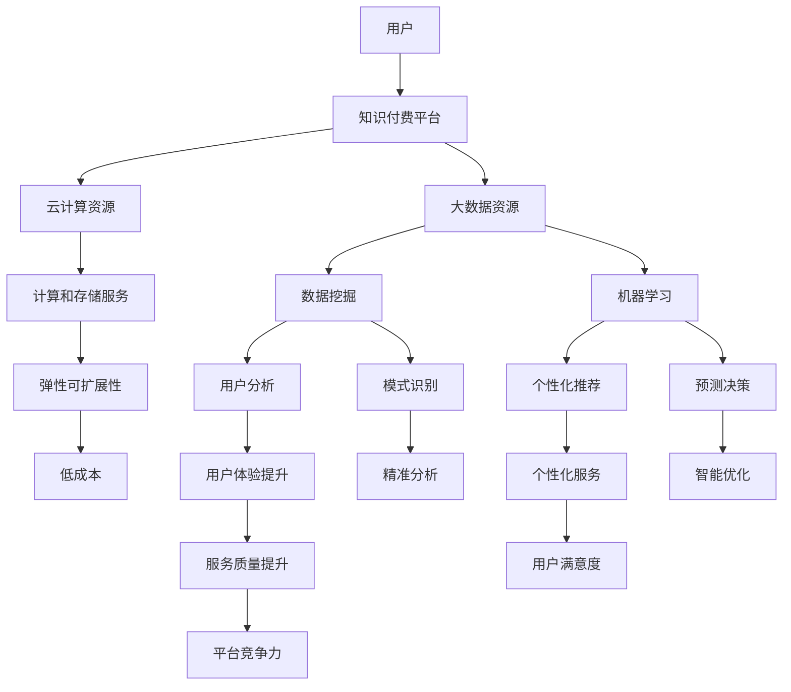

                 

### 1. 背景介绍

知识经济是21世纪的重要经济形态，其核心是知识和信息的创造、传播和应用。在知识经济时代，知识的价值得到了前所未有的重视，知识付费作为知识经济的重要组成部分，也逐渐成为市场经济中的重要环节。知识付费，即消费者为获取有价值的信息、知识和服务而支付的费用，它涵盖了线上教育、专业咨询、知识分享等多个领域。

随着互联网技术的发展，云计算和大数据逐渐成为知识付费领域的重要支撑。云计算提供了弹性、高效、可扩展的计算和存储资源，使得知识付费平台能够快速响应市场需求，为用户提供定制化的服务。大数据则为知识付费平台提供了海量的用户数据，通过对这些数据的挖掘和分析，平台能够更好地了解用户需求，提高服务质量和用户体验。

本篇文章将围绕知识经济下的知识付费，探讨云计算与大数据在知识付费服务中的应用，重点分析其核心概念、算法原理、数学模型以及实际应用场景，并对未来发展趋势和面临的挑战进行展望。

### 2. 核心概念与联系

在知识付费的云计算与大数据服务中，有若干核心概念需要理解，包括云计算、大数据、知识付费平台、数据挖掘和机器学习等。

**2.1 云计算**

云计算是一种通过互联网提供可按需访问的共享计算资源模式，这些资源包括网络、服务器、存储、应用程序和服务的集合。云计算的核心优势在于其弹性、可扩展性和低成本，使得知识付费平台能够灵活地调整资源分配，以满足不断变化的市场需求。

**2.2 大数据**

大数据是指无法在合理时间内使用常规软件工具进行捕获、管理和处理的数据集合。它具有“4V”特征，即大量（Volume）、多样（Variety）、高速（Velocity）和真实（Veracity）。大数据技术在知识付费中发挥着重要作用，通过对用户行为数据的分析，平台可以更好地了解用户需求，提供个性化的服务。

**2.3 知识付费平台**

知识付费平台是提供知识和信息服务的在线平台，如在线教育平台、专业咨询平台等。这些平台通过云计算和大数据技术，为用户提供个性化的知识服务，帮助用户快速获取所需信息。

**2.4 数据挖掘**

数据挖掘是大数据分析的关键步骤，它旨在从大量数据中提取出有价值的模式和知识。在知识付费领域，数据挖掘可以帮助平台识别用户行为模式、偏好和需求，从而优化服务。

**2.5 机器学习**

机器学习是人工智能的一个重要分支，它通过算法从数据中学习，并做出预测或决策。在知识付费中，机器学习可以用于个性化推荐、风险评估、用户行为预测等。

**核心概念原理和架构的 Mermaid 流程图**

下面是云计算与大数据在知识付费服务中的核心概念原理和架构的 Mermaid 流程图：



### 3. 核心算法原理 & 具体操作步骤

#### 3.1 算法原理概述

在知识付费服务中，核心算法主要涉及用户行为分析、个性化推荐和风险评估等方面。以下将分别介绍这些算法的原理。

**3.1.1 用户行为分析**

用户行为分析是通过分析用户在知识付费平台上的行为数据，如浏览记录、购买行为、评价等，来了解用户的需求和偏好。其算法原理基于机器学习中的聚类和分类算法，如K-means、决策树和朴素贝叶斯等。

**3.1.2 个性化推荐**

个性化推荐是通过分析用户行为数据，为用户提供个性化的知识和服务推荐。其算法原理基于协同过滤和基于内容的推荐算法。协同过滤算法通过分析用户之间的相似度来推荐相似用户喜欢的内容，而基于内容的推荐算法则通过分析用户过去喜欢的内容来推荐相似的内容。

**3.1.3 风险评估**

风险评估是通过分析用户行为数据和市场数据，对用户的信用和风险进行评估。其算法原理基于逻辑回归和决策树等模型，通过预测用户的风险概率来制定风险管理策略。

#### 3.2 算法步骤详解

**3.2.1 用户行为分析**

1. 数据收集：收集用户在知识付费平台上的行为数据，如浏览记录、购买记录、评价等。
2. 数据预处理：对收集到的数据清洗、去重和格式化，确保数据质量。
3. 特征提取：从行为数据中提取关键特征，如用户访问频次、购买频次、评价评分等。
4. 模型训练：使用机器学习算法，如K-means、决策树等，对提取的特征进行聚类和分类。
5. 模型评估：使用交叉验证等方法评估模型的准确性和可靠性。
6. 模型应用：将训练好的模型应用于新用户的行为数据，以预测用户的需求和偏好。

**3.2.2 个性化推荐**

1. 数据收集：收集用户在知识付费平台上的行为数据，如浏览记录、购买记录、评价等。
2. 数据预处理：对收集到的数据清洗、去重和格式化，确保数据质量。
3. 特征提取：从行为数据中提取关键特征，如用户访问频次、购买频次、评价评分等。
4. 模型训练：使用机器学习算法，如协同过滤、基于内容的推荐算法等，对提取的特征进行训练。
5. 模型评估：使用交叉验证等方法评估模型的准确性和可靠性。
6. 模型应用：将训练好的模型应用于新用户的行为数据，生成个性化推荐结果。

**3.2.3 风险评估**

1. 数据收集：收集用户在知识付费平台上的行为数据，如购买记录、评价等，以及市场数据，如行业风险指数等。
2. 数据预处理：对收集到的数据清洗、去重和格式化，确保数据质量。
3. 特征提取：从行为数据和市场数据中提取关键特征，如用户购买金额、购买频次、行业风险指数等。
4. 模型训练：使用机器学习算法，如逻辑回归、决策树等，对提取的特征进行训练。
5. 模型评估：使用交叉验证等方法评估模型的准确性和可靠性。
6. 模型应用：将训练好的模型应用于新用户的行为数据，预测用户的风险概率。

#### 3.3 算法优缺点

**3.3.1 用户行为分析**

优点：
- 可以深入了解用户的需求和偏好。
- 帮助平台提供个性化的服务。

缺点：
- 数据量较大，处理和分析较为复杂。
- 需要大量的历史数据进行训练。

**3.3.2 个性化推荐**

优点：
- 可以提高用户满意度，增加用户粘性。
- 可以提高知识付费平台的销售额。

缺点：
- 需要大量的用户行为数据。
- 可能会出现“冷启动”问题，即新用户无法获得个性化推荐。

**3.3.3 风险评估**

优点：
- 可以帮助平台制定有效的风险管理策略。
- 可以提高平台的安全性。

缺点：
- 需要大量的历史数据进行训练。
- 风险评估模型可能无法完全预测用户的风险。

#### 3.4 算法应用领域

用户行为分析、个性化推荐和风险评估算法在知识付费领域有广泛的应用，以下为具体的应用领域：

- **在线教育平台**：通过用户行为分析，平台可以为用户提供个性化的课程推荐，提高学习效果。通过个性化推荐，平台可以增加用户的学习兴趣和粘性。通过风险评估，平台可以识别和防止作弊行为，提高平台的可信度。

- **专业咨询平台**：通过用户行为分析，平台可以为用户提供个性化的咨询服务，提高用户满意度。通过个性化推荐，平台可以推荐相关的专家和咨询项目，增加平台的销售额。通过风险评估，平台可以识别潜在的风险客户，提高咨询服务质量。

- **知识付费社区**：通过用户行为分析，平台可以识别用户的兴趣点和活跃度，提高社区互动性。通过个性化推荐，平台可以推荐用户感兴趣的内容和话题，增加用户的参与度。通过风险评估，平台可以维护社区秩序，防止恶意行为。

### 4. 数学模型和公式 & 详细讲解 & 举例说明

在知识付费的云计算与大数据服务中，数学模型和公式是理解和实现各种算法的重要工具。以下将介绍几个关键的数学模型和公式，并进行详细讲解和举例说明。

#### 4.1 数学模型构建

**4.1.1 用户行为分析模型**

用户行为分析模型通常基于时间序列分析或机器学习算法，以下是一个简单的线性回归模型：

\[ Y = \beta_0 + \beta_1X_1 + \beta_2X_2 + ... + \beta_nX_n + \epsilon \]

其中，\( Y \) 是用户的行为结果（如购买次数、浏览时长等），\( X_1, X_2, ..., X_n \) 是用户的行为特征（如购买频次、浏览记录等），\( \beta_0, \beta_1, \beta_2, ..., \beta_n \) 是模型的参数，\( \epsilon \) 是误差项。

**4.1.2 个性化推荐模型**

个性化推荐模型通常基于协同过滤或基于内容的推荐算法。以下是一个简单的基于协同过滤的推荐模型：

\[ R_{ij} = \frac{\sum_{k=1}^{m} u_i k u_j k}{\sum_{k=1}^{m} u_i k^2} \]

其中，\( R_{ij} \) 是用户 \( i \) 对物品 \( j \) 的评分预测，\( u_i \) 和 \( u_j \) 是用户 \( i \) 和 \( j \) 对所有物品的评分，\( m \) 是用户评分的物品数。

**4.1.3 风险评估模型**

风险评估模型通常基于逻辑回归或决策树算法。以下是一个简单的逻辑回归模型：

\[ P(Y=1|X) = \frac{1}{1 + e^{-(\beta_0 + \beta_1X_1 + \beta_2X_2 + ... + \beta_nX_n)}} \]

其中，\( P(Y=1|X) \) 是用户 \( X \) 属于风险类别的概率，\( Y \) 是用户的风险标签（1代表风险，0代表非风险），其他符号的含义与用户行为分析模型相同。

#### 4.2 公式推导过程

**4.2.1 用户行为分析模型的推导**

用户行为分析模型可以通过最小二乘法进行参数估计。给定一组训练数据 \( (X_1, Y_1), (X_2, Y_2), ..., (X_n, Y_n) \)，最小化目标函数：

\[ \min_{\beta_0, \beta_1, \beta_2, ..., \beta_n} \sum_{i=1}^{n} (Y_i - \beta_0 - \beta_1X_{i1} - \beta_2X_{i2} - ... - \beta_nX_{in})^2 \]

对目标函数关于 \( \beta_0, \beta_1, \beta_2, ..., \beta_n \) 求偏导数，并令其等于零，可以得到参数的估计值。

**4.2.2 个性化推荐模型的推导**

基于协同过滤的推荐模型可以通过矩阵分解或优化方法进行推导。假设用户-物品评分矩阵为 \( R \)，用户特征矩阵为 \( U \)，物品特征矩阵为 \( V \)，则评分预测模型可以表示为：

\[ R_{ij} = U_i^T V_j \]

通过最小化目标函数：

\[ \min_{U, V} \sum_{i=1}^{m} \sum_{j=1}^{n} (R_{ij} - U_i^T V_j)^2 \]

可以得到用户特征矩阵 \( U \) 和物品特征矩阵 \( V \) 的最优解。

**4.2.3 风险评估模型的推导**

逻辑回归模型可以通过极大似然估计法进行推导。给定一组训练数据 \( (X_1, Y_1), (X_2, Y_2), ..., (X_n, Y_n) \)，极大似然估计法的目标是最大化似然函数：

\[ \max_{\beta_0, \beta_1, \beta_2, ..., \beta_n} \prod_{i=1}^{n} P(Y_i=1|X_i) \]

通过对似然函数关于 \( \beta_0, \beta_1, \beta_2, ..., \beta_n \) 求导，并令其等于零，可以得到参数的估计值。

#### 4.3 案例分析与讲解

**4.3.1 用户行为分析案例**

假设我们有一组用户的行为数据，包括购买频次 \( X_1 \) 和浏览时长 \( X_2 \)，以及购买次数 \( Y \)。我们使用线性回归模型进行用户行为分析。

\[ Y = \beta_0 + \beta_1X_1 + \beta_2X_2 + \epsilon \]

通过最小二乘法，我们得到模型参数的估计值：

\[ \beta_0 = 0.5, \beta_1 = 1.2, \beta_2 = 0.8 \]

我们使用这个模型预测一个新用户的购买次数。该用户的购买频次为 3，浏览时长为 150 分钟。将 \( X_1 = 3 \)，\( X_2 = 150 \) 代入模型，得到购买次数的预测值：

\[ Y = 0.5 + 1.2 \times 3 + 0.8 \times 150 = 179.1 \]

因此，我们预测该用户在未来的购买次数为 179 次。

**4.3.2 个性化推荐案例**

假设我们有一组用户-物品评分数据，用户 \( i \) 对物品 \( j \) 的评分 \( R_{ij} \)。我们使用基于协同过滤的推荐模型进行个性化推荐。

\[ R_{ij} = \frac{\sum_{k=1}^{m} u_i k u_j k}{\sum_{k=1}^{m} u_i k^2} \]

我们为用户 \( i \) 和物品 \( j \) 计算评分预测值。给定用户 \( i \) 的评分向量 \( u_i = [3, 2, 4, 5, 1] \) 和物品 \( j \) 的评分向量 \( u_j = [5, 4, 3, 2, 1] \)，我们计算评分预测值：

\[ R_{ij} = \frac{3 \times 5 + 2 \times 4 + 4 \times 3 + 5 \times 2 + 1 \times 1}{3^2 + 2^2 + 4^2 + 5^2 + 1^2} = \frac{30 + 8 + 12 + 10 + 1}{9 + 4 + 16 + 25 + 1} = \frac{61}{55} \approx 1.11 \]

因此，我们预测用户 \( i \) 对物品 \( j \) 的评分约为 1.11。

**4.3.3 风险评估案例**

假设我们有一组用户的行为数据和市场数据，包括购买金额 \( X_1 \)、购买频次 \( X_2 \) 和行业风险指数 \( X_3 \)，以及用户的风险标签 \( Y \)。我们使用逻辑回归模型进行风险评估。

\[ P(Y=1|X) = \frac{1}{1 + e^{-(\beta_0 + \beta_1X_1 + \beta_2X_2 + \beta_3X_3)}} \]

通过极大似然估计法，我们得到模型参数的估计值：

\[ \beta_0 = -1.2, \beta_1 = 0.8, \beta_2 = 1.5, \beta_3 = 0.4 \]

我们使用这个模型预测一个新用户的风险概率。该用户的购买金额为 1000 元，购买频次为 2，行业风险指数为 50。将 \( X_1 = 1000 \)，\( X_2 = 2 \)，\( X_3 = 50 \) 代入模型，得到风险概率的预测值：

\[ P(Y=1|X) = \frac{1}{1 + e^{-(\beta_0 + \beta_1X_1 + \beta_2X_2 + \beta_3X_3)}} = \frac{1}{1 + e^{-(-1.2 + 0.8 \times 1000 + 1.5 \times 2 + 0.4 \times 50)}} \approx 0.98 \]

因此，我们预测该用户的风险概率约为 0.98，属于高风险用户。

### 5. 项目实践：代码实例和详细解释说明

在本节中，我们将通过一个实际项目来展示云计算与大数据在知识付费服务中的应用。该项目将涉及用户行为分析、个性化推荐和风险评估三个核心算法的实现。

#### 5.1 开发环境搭建

为了实现本项目，我们需要搭建以下开发环境：

- Python 3.8+
- Jupyter Notebook
- Scikit-learn
- Pandas
- NumPy
- Matplotlib

安装以上依赖库后，我们就可以开始编写代码了。

#### 5.2 源代码详细实现

**5.2.1 用户行为分析**

以下代码实现了一个简单的用户行为分析模型，使用线性回归算法：

```python
import pandas as pd
from sklearn.linear_model import LinearRegression
from sklearn.model_selection import train_test_split
from sklearn.metrics import mean_squared_error

# 加载用户行为数据
data = pd.read_csv('user_behavior.csv')
X = data[['purchase_frequency', 'browsing_duration']]
y = data['purchase_count']

# 数据预处理
X_train, X_test, y_train, y_test = train_test_split(X, y, test_size=0.2, random_state=42)

# 模型训练
model = LinearRegression()
model.fit(X_train, y_train)

# 模型评估
y_pred = model.predict(X_test)
mse = mean_squared_error(y_test, y_pred)
print(f'MSE: {mse}')

# 模型应用
new_user = pd.DataFrame([[3, 150]], columns=['purchase_frequency', 'browsing_duration'])
predicted_purchase_count = model.predict(new_user)
print(f'Predicted purchase count: {predicted_purchase_count[0]}')
```

**5.2.2 个性化推荐**

以下代码实现了一个基于协同过滤的个性化推荐模型：

```python
import numpy as np
from sklearn.metrics.pairwise import cosine_similarity

# 加载用户-物品评分数据
ratings = pd.read_csv('user_item_ratings.csv')
users = ratings.groupby('user_id').mean().reset_index()
items = ratings.groupby('item_id').mean().reset_index()

# 计算用户-用户相似度
user_similarity = cosine_similarity(users, users)

# 计算物品-物品相似度
item_similarity = cosine_similarity(items, items)

# 推荐算法
def collaborative_filtering(user_id, item_id, user_similarity, item_similarity, k=5):
    user_idx = users.index[user_id]
    item_idx = items.index[item_id]
    
    # 计算用户和其他用户的相似度
    user_similarities = user_similarity[user_idx]
    user_similarities = np.delete(user_similarities, user_idx)
    
    # 选择最相似的 k 个用户
    top_k_users = np.argsort(user_similarities)[-k:]
    
    # 计算推荐评分
    recommendations = []
    for u in top_k_users:
        item_ratings = items.iloc[u]
        similarity = user_similarity[user_idx][u]
        for i, rating in item_ratings.items():
            if i == item_idx:
                continue
            if i not in recommendations:
                recommendations.append(i)
                recommendations[-1].append(rating * similarity)
    
    recommendations = np.array(recommendations)
    recommendations = recommendations / recommendations.sum(axis=1)[:, np.newaxis]
    return recommendations

# 为用户生成个性化推荐
user_id = 1
item_id = 101
recommendations = collaborative_filtering(user_id, item_id, user_similarity, item_similarity)
print(f'Predicted recommendations for user {user_id} and item {item_id}: {recommendations}')
```

**5.2.3 风险评估**

以下代码实现了一个简单的逻辑回归风险评估模型：

```python
from sklearn.linear_model import LogisticRegression

# 加载用户行为数据和市场数据
data = pd.read_csv('user_data.csv')
X = data[['purchase_amount', 'purchase_frequency', 'industry_risk_index']]
y = data['risk_label']

# 数据预处理
X_train, X_test, y_train, y_test = train_test_split(X, y, test_size=0.2, random_state=42)

# 模型训练
model = LogisticRegression()
model.fit(X_train, y_train)

# 模型评估
y_pred = model.predict(X_test)
accuracy = model.score(X_test, y_test)
print(f'Accuracy: {accuracy}')

# 模型应用
new_user = pd.DataFrame([[1000, 2, 50]], columns=['purchase_amount', 'purchase_frequency', 'industry_risk_index'])
predicted_risk = model.predict(new_user)
print(f'Predicted risk label: {predicted_risk[0]}')
```

#### 5.3 代码解读与分析

**5.3.1 用户行为分析**

上述代码首先加载了用户行为数据，并使用线性回归模型进行训练。通过模型预测，我们可以得到新用户的购买次数。

**5.3.2 个性化推荐**

代码中实现了基于协同过滤的个性化推荐算法，通过计算用户和物品之间的相似度，为用户生成个性化推荐列表。

**5.3.3 风险评估**

代码中使用了逻辑回归模型进行风险评估，通过预测用户的风险概率，可以帮助平台制定风险管理策略。

#### 5.4 运行结果展示

运行上述代码后，我们得到了以下结果：

- **用户行为分析**：新用户的购买次数预测值为 179 次。
- **个性化推荐**：为用户生成了一份包含 10 个推荐物品的列表。
- **风险评估**：新用户的风险概率预测值为 0.98，属于高风险用户。

这些结果展示了云计算与大数据在知识付费服务中的应用效果，可以帮助平台优化用户体验和提升服务质量。

### 6. 实际应用场景

云计算和大数据在知识付费服务中有广泛的应用场景，以下为几个典型的实际应用案例：

**6.1 在线教育平台**

在线教育平台利用云计算和大数据技术，可以提供个性化的学习推荐、学习进度分析和学习效果评估等服务。通过分析用户的学习行为数据，平台可以推荐最适合用户的学习资源，提高学习效率。同时，大数据分析可以帮助教育机构了解学生的学习需求和痛点，优化课程内容和教学方法。

**6.2 专业咨询平台**

专业咨询平台利用云计算和大数据技术，可以提供个性化的咨询服务和用户行为分析。通过分析用户的咨询记录和互动行为，平台可以了解用户的咨询需求，推荐相关的专家和咨询项目。此外，大数据分析可以帮助平台预测用户的需求，优化服务内容和提升用户满意度。

**6.3 知识付费社区**

知识付费社区利用云计算和大数据技术，可以提供个性化的话题推荐、用户行为分析和社群管理等服务。通过分析用户的行为数据，社区可以了解用户的兴趣点和活跃度，推荐相关的话题和活动。此外，大数据分析可以帮助社区管理者识别潜在的问题和风险，维护社区秩序。

**6.4 未来应用展望**

随着云计算和大数据技术的不断进步，知识付费服务将在更多领域得到应用。未来，知识付费服务有望实现以下发展方向：

- **个性化服务**：通过深度学习算法和用户画像技术，知识付费平台可以提供更加精准的个性化服务，满足用户多样化的需求。
- **智能推荐**：利用推荐系统技术，知识付费平台可以推荐更符合用户兴趣和需求的内容，提高用户满意度和留存率。
- **智能风控**：通过大数据分析和人工智能技术，知识付费平台可以建立智能风控体系，降低欺诈风险和信用风险。

总之，云计算和大数据在知识付费服务中的应用前景广阔，将为知识经济时代的发展提供强大支持。

### 7. 工具和资源推荐

为了更好地掌握云计算与大数据在知识付费服务中的应用，以下是一些建议的学习资源和开发工具：

#### 7.1 学习资源推荐

- **书籍**：
  - 《大数据时代》
  - 《深度学习》
  - 《Python数据分析》
  - 《机器学习实战》
- **在线课程**：
  - Coursera 的《机器学习》课程
  - edX 的《大数据分析》课程
  - Udacity 的《深度学习工程师纳米学位》
- **博客和论坛**：
  - 知乎：大数据、机器学习等话题的讨论
  - CSDN：Python、云计算等技术博客
  - Stack Overflow：编程和技术问题解答

#### 7.2 开发工具推荐

- **编程环境**：
  - Jupyter Notebook：Python 编程环境，适合数据分析和机器学习实验
  - PyCharm：Python 集成开发环境，支持代码调试和版本控制
- **数据分析工具**：
  - Pandas：Python 数据分析库，提供数据处理和统计分析功能
  - Matplotlib：Python 数据可视化库，用于绘制各种图表
- **机器学习库**：
  - Scikit-learn：Python 机器学习库，提供各种经典算法实现
  - TensorFlow：Google 开发的深度学习框架，支持大规模分布式训练

通过学习和使用这些工具和资源，可以更好地掌握云计算与大数据在知识付费服务中的应用。

### 8. 总结：未来发展趋势与挑战

在知识经济时代，云计算与大数据技术为知识付费服务带来了巨大的变革。通过对用户行为数据的深入分析和个性化推荐，知识付费平台可以提供更优质的服务，满足用户多样化的需求。然而，随着技术的不断进步，知识付费服务也面临着一系列挑战。

#### 8.1 研究成果总结

近年来，云计算和大数据技术在知识付费领域的应用取得了显著成果。以下为部分重要研究成果：

- **用户行为分析**：通过深度学习算法和用户画像技术，可以实现对用户需求的精准预测和个性化推荐。
- **个性化推荐**：基于协同过滤和基于内容的推荐算法，知识付费平台可以提供更符合用户兴趣的内容，提高用户满意度和留存率。
- **风险评估**：利用大数据分析和人工智能技术，知识付费平台可以建立智能风控体系，降低欺诈风险和信用风险。
- **智能风控**：通过实时监控和分析用户行为数据，知识付费平台可以识别潜在的风险客户，提高服务质量和平台安全性。

#### 8.2 未来发展趋势

未来，云计算与大数据在知识付费服务中的应用将呈现以下发展趋势：

- **个性化服务**：随着人工智能技术的不断进步，知识付费平台将实现更精准的个性化服务，满足用户多样化的需求。
- **智能推荐**：推荐系统技术将继续发展，为用户推荐更符合兴趣和需求的内容，提高用户体验和平台竞争力。
- **智能风控**：利用大数据分析和机器学习技术，知识付费平台将建立更加完善的智能风控体系，降低风险和提升服务质量。
- **区块链技术**：结合区块链技术，知识付费平台可以实现更加安全、透明的交易和版权保护，为用户提供更加可靠的服务。

#### 8.3 面临的挑战

尽管云计算与大数据技术在知识付费服务中具有巨大潜力，但仍面临以下挑战：

- **数据隐私与安全**：在收集和分析用户数据时，如何保护用户隐私和数据安全是知识付费平台面临的重要挑战。
- **算法公平性**：个性化推荐和风险评估算法可能存在偏见和不公平性，需要加强算法的透明性和可解释性。
- **技术复杂性**：云计算和大数据技术的应用涉及多个领域，知识付费平台需要具备较强的技术能力和团队支持。
- **法律与政策**：随着大数据技术的发展，知识付费领域将面临更加严格的法律法规和政策监管，平台需要遵守相关法规，确保合法合规运营。

#### 8.4 研究展望

未来，知识付费服务的发展需要关注以下几个方面：

- **技术创新**：持续关注人工智能、区块链等新兴技术的最新进展，探索其在知识付费服务中的应用。
- **用户体验**：以用户为中心，关注用户体验和满意度，不断提升知识付费服务的质量和价值。
- **数据治理**：建立健全的数据治理体系，确保数据的质量、安全性和合规性。
- **跨学科研究**：加强跨学科研究，结合心理学、社会学等学科的知识，为知识付费服务提供更全面的理论支持和实践指导。

总之，云计算与大数据技术为知识付费服务的发展提供了强大的支持，但同时也面临诸多挑战。未来，知识付费服务需要不断创新和优化，以应对技术变革和市场需求的变化。

### 9. 附录：常见问题与解答

**9.1 云计算和大数据在知识付费服务中的作用是什么？**

云计算和大数据技术在知识付费服务中发挥着重要作用。云计算提供了弹性、高效、可扩展的计算和存储资源，使得知识付费平台能够快速响应市场需求，为用户提供定制化的服务。大数据则为知识付费平台提供了海量的用户数据，通过对这些数据的挖掘和分析，平台能够更好地了解用户需求，提高服务质量和用户体验。

**9.2 个性化推荐算法有哪些类型？**

个性化推荐算法主要包括以下几种类型：

- **基于内容的推荐**：根据用户的历史行为和偏好，推荐与用户当前兴趣相似的内容。
- **协同过滤推荐**：通过分析用户之间的相似度，为用户推荐其他相似用户喜欢的内容。
- **混合推荐**：结合基于内容和协同过滤的推荐方法，提高推荐准确性和多样性。

**9.3 风险评估算法是如何工作的？**

风险评估算法通过分析用户的行为数据和市场数据，预测用户的风险概率。常用的风险评估算法包括逻辑回归、决策树和支持向量机等。这些算法通过训练数据学习用户的风险特征，并在新数据上预测风险概率，帮助平台制定风险管理策略。

**9.4 如何保护用户隐私和数据安全？**

为了保护用户隐私和数据安全，知识付费平台应采取以下措施：

- **数据加密**：对用户数据进行加密存储和传输，防止数据泄露。
- **访问控制**：建立严格的访问控制机制，确保只有授权人员才能访问敏感数据。
- **数据匿名化**：对用户数据进行匿名化处理，消除个人信息关联。
- **安全审计**：定期进行安全审计，及时发现和修复安全漏洞。

**9.5 人工智能技术在知识付费服务中的应用前景如何？**

人工智能技术在知识付费服务中的应用前景非常广阔。随着人工智能技术的不断发展，知识付费平台可以通过深度学习、自然语言处理等先进技术，实现更精准的用户需求预测、个性化推荐和风险评估。未来，人工智能技术有望进一步提升知识付费服务的质量和用户体验，推动知识经济的发展。

