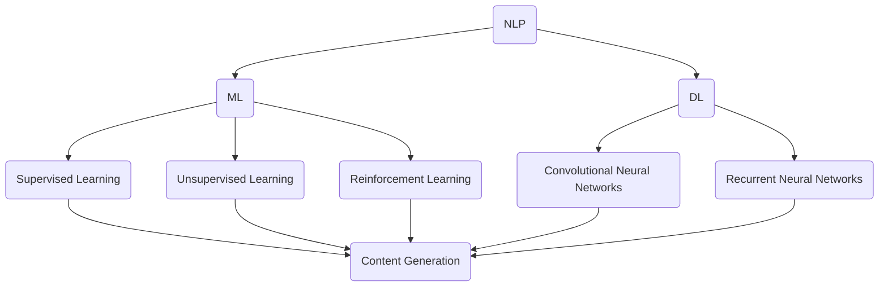

                 

### 关键词 Keywords

- 知识经济
- 知识付费
- 人工智能内容生成
- 自然语言处理
- 机器学习
- 大数据

<|assistant|>### 摘要 Abstract

本文探讨了在知识经济时代下，知识付费模式与人工智能内容生成技术的结合。首先，我们回顾了知识付费的背景和发展，分析了其对于知识传播和经济模式的深远影响。随后，本文深入介绍了人工智能内容生成技术，包括其基础理论、核心算法、数学模型以及实际应用。接着，通过具体案例和代码实例，本文展示了人工智能内容生成技术在实际项目中的实现过程。最后，本文展望了人工智能内容生成技术的未来发展趋势和应用前景，并提出了面临的挑战和未来研究方向。

## 1. 背景介绍

### 1.1 知识付费的兴起

知识付费作为一种新型经济模式，起源于互联网时代的知识传播需求。随着信息爆炸和知识碎片化，用户对于高质量、专业化的知识需求日益增长。知识付费模式应运而生，它通过平台化、在线化和定制化的方式，让知识提供者能够直接向用户收费，从而实现知识的价值变现。

知识付费的发展经历了几个阶段：

1. **初级阶段**：以博客、论坛、在线课程等免费分享为主，知识传播依赖于个人的兴趣和爱好。
2. **中级阶段**：平台开始收费，例如淘宝学堂、知乎live等，通过小额支付获取专业知识。
3. **高级阶段**：知识付费走向专业化、系统化，平台如得到、喜马拉雅等，提供高质量的付费内容。

### 1.2 人工智能内容生成技术的发展

人工智能内容生成技术（AI-generated content）是近年来随着人工智能技术的快速发展而崭新崛起的一门技术。它利用自然语言处理（NLP）、机器学习（ML）和深度学习（DL）等人工智能技术，通过算法和模型自动生成文本、图片、视频等内容。

人工智能内容生成技术的发展可以分为以下几个阶段：

1. **初级阶段**：基于规则和模板的简单文本生成，如自动摘要、自动邮件回复等。
2. **中级阶段**：基于统计模型和机器学习的文本生成，如生成式对抗网络（GAN）和递归神经网络（RNN）。
3. **高级阶段**：基于深度学习和强化学习的复杂内容生成，如多模态内容生成、自适应内容生成等。

### 1.3 知识经济与知识付费的结合

知识经济是一种以知识和信息为核心的经济模式，它强调通过知识的创造、传播和应用实现经济增长。知识付费作为知识经济的一部分，通过将知识转化为商品和服务，为知识提供者和需求者提供了新的价值交换方式。

知识付费与人工智能内容生成的结合，既顺应了知识经济的需求，也带来了新的技术变革：

1. **个性化内容生成**：人工智能能够根据用户的行为数据和学习偏好，生成个性化的内容，满足不同用户的需求。
2. **高质量内容生产**：人工智能技术可以大幅提高内容生产的效率和质量，减少人力成本。
3. **智能化知识服务**：通过人工智能内容生成技术，可以为用户提供智能化的知识服务，如问答系统、智能推荐等。

## 2. 核心概念与联系

### 2.1 自然语言处理（NLP）

自然语言处理是人工智能的一个重要分支，旨在使计算机能够理解、解释和生成人类语言。NLP的核心概念包括：

- **分词**：将连续的文本切分成有意义的词汇单元。
- **词性标注**：为每个词汇分配语法属性，如名词、动词、形容词等。
- **实体识别**：识别文本中的特定实体，如人名、地名、组织名等。
- **句法分析**：分析句子的结构，理解句子的语法关系。

### 2.2 机器学习（ML）

机器学习是一种通过数据和算法使计算机自主学习和改进性能的技术。机器学习的核心概念包括：

- **监督学习**：使用标记数据训练模型，如分类、回归问题。
- **无监督学习**：不使用标记数据，让模型自己发现数据中的规律，如聚类、降维。
- **强化学习**：通过与环境互动，学习最优行为策略。

### 2.3 深度学习（DL）

深度学习是机器学习的一个分支，基于多层神经网络，通过大规模数据训练模型，实现高度复杂的数据处理任务。深度学习的核心概念包括：

- **神经网络**：一种由多层节点组成的计算模型，通过反向传播算法训练。
- **卷积神经网络（CNN）**：特别适合处理图像数据。
- **循环神经网络（RNN）**：特别适合处理序列数据。

### 2.4 人工智能内容生成技术

人工智能内容生成技术是利用NLP、ML和DL等技术，实现文本、图像、音频等内容的自动生成。其核心概念包括：

- **生成式对抗网络（GAN）**：一种通过对抗训练生成逼真数据的模型。
- **递归神经网络（RNN）**：特别适合处理和生成序列数据。
- **变分自编码器（VAE）**：用于生成具有概率分布的复杂数据。

### 2.5 Mermaid 流程图

以下是人工智能内容生成技术的 Mermaid 流程图，展示了其核心概念和联系：



## 3. 核心算法原理 & 具体操作步骤

### 3.1 算法原理概述

人工智能内容生成技术主要依赖于以下几个核心算法：

1. **生成式对抗网络（GAN）**：通过生成器和判别器的对抗训练，生成高质量的数据。
2. **递归神经网络（RNN）**：通过处理序列数据，实现自然语言生成。
3. **变分自编码器（VAE）**：通过概率模型生成复杂的数据。

### 3.2 算法步骤详解

#### 3.2.1 生成式对抗网络（GAN）

GAN由两部分组成：生成器和判别器。

1. **初始化**：随机初始化生成器和判别器的权重。
2. **生成器训练**：生成器尝试生成逼真的数据，判别器评估生成数据和真实数据的相似性。
3. **判别器训练**：判别器尝试区分真实数据和生成数据。
4. **迭代**：重复以上步骤，生成器和判别器相互对抗，生成器逐渐提高生成数据的质量。

#### 3.2.2 递归神经网络（RNN）

RNN通过处理输入序列，生成输出序列。其基本步骤如下：

1. **初始化**：随机初始化RNN的权重。
2. **前向传播**：将输入序列输入RNN，计算隐藏状态和输出。
3. **反向传播**：通过计算误差，更新RNN的权重。
4. **迭代**：重复以上步骤，训练RNN模型。

#### 3.2.3 变分自编码器（VAE）

VAE通过概率模型生成数据。其基本步骤如下：

1. **初始化**：随机初始化VAE的权重。
2. **编码**：将输入数据编码为隐变量。
3. **解码**：将隐变量解码为生成数据。
4. **损失函数**：通过计算损失函数，更新VAE的权重。
5. **迭代**：重复以上步骤，训练VAE模型。

### 3.3 算法优缺点

#### 3.3.1 生成式对抗网络（GAN）

**优点**：

- 能够生成高质量的数据。
- 不需要大量标记数据。

**缺点**：

- 训练不稳定，容易出现模式崩溃问题。
- 需要大量的计算资源。

#### 3.3.2 递归神经网络（RNN）

**优点**：

- 能够处理序列数据。
- 适合自然语言生成。

**缺点**：

- 容易出现梯度消失或爆炸问题。
- 需要大量的训练时间。

#### 3.3.3 变分自编码器（VAE）

**优点**：

- 能够生成多样化的数据。
- 需要的标记数据较少。

**缺点**：

- 生成数据的质量相对较低。
- 训练过程复杂，需要大量的计算资源。

### 3.4 算法应用领域

人工智能内容生成技术在多个领域得到了广泛应用：

- **自然语言处理**：自动写作、机器翻译、问答系统等。
- **计算机视觉**：图像生成、图像编辑、图像增强等。
- **音频处理**：音乐生成、语音合成、音频编辑等。
- **医疗领域**：医学图像生成、疾病预测等。

## 4. 数学模型和公式 & 详细讲解 & 举例说明

### 4.1 数学模型构建

人工智能内容生成技术的数学模型主要包括：

- **生成式对抗网络（GAN）**：由生成器G和判别器D构成，其中G的目标是生成逼真的数据，D的目标是区分真实数据和生成数据。
- **递归神经网络（RNN）**：通过递归关系处理序列数据，计算隐藏状态和输出。
- **变分自编码器（VAE）**：通过编码和解码过程，生成具有概率分布的数据。

### 4.2 公式推导过程

以下是对上述模型的数学公式推导：

#### 4.2.1 生成式对抗网络（GAN）

**生成器 G 的损失函数**：

$$L_G = -\log(D(G(z))$$

其中，$z$为随机噪声，$G(z)$为生成器的输出，$D(G(z))$为判别器对生成数据的判断概率。

**判别器 D 的损失函数**：

$$L_D = -[\log(D(x)) + \log(1 - D(G(z)))]$$

其中，$x$为真实数据。

**整体损失函数**：

$$L = L_G + L_D$$

#### 4.2.2 递归神经网络（RNN）

**前向传播**：

$$h_t = \sigma(W_h \cdot [h_{t-1}, x_t] + b_h)$$

其中，$h_t$为第$t$时刻的隐藏状态，$x_t$为输入，$W_h$和$b_h$为权重和偏置，$\sigma$为激活函数。

**反向传播**：

$$\Delta C = \frac{\partial C}{\partial h_t} \cdot \frac{\partial h_t}{\partial h_{t-1}}$$

其中，$\Delta C$为隐藏状态的误差，$C$为输出层的损失函数。

**权重更新**：

$$W_h \gets W_h - \alpha \cdot \frac{\partial L}{\partial W_h}$$

其中，$\alpha$为学习率。

#### 4.2.3 变分自编码器（VAE）

**编码过程**：

$$\mu = \phi(x)$$

$$\sigma = \phi(x)$$

其中，$\mu$和$\sigma$分别为隐变量的均值和方差。

**解码过程**：

$$x' = \phi(\mu, \sigma)$$

其中，$\phi$为解码函数。

**损失函数**：

$$L = \frac{1}{2}\sum_{i} (\mu_i^2 + \sigma_i^2 - 2\log(\sigma_i^2) - 1)$$

### 4.3 案例分析与讲解

#### 4.3.1 GAN 生成图像

以下是一个使用 GAN 生成图像的案例：

```python
import tensorflow as tf
from tensorflow.keras.layers import Dense, Conv2D, Flatten, Reshape
from tensorflow.keras.models import Model

# 生成器 G 的定义
z = tf.keras.layers.Input(shape=(100,))
h = Dense(128, activation='relu')(z)
x = Dense(784, activation='sigmoid')(h)
G = Model(z, x)

# 判别器 D 的定义
x = tf.keras.layers.Input(shape=(28, 28))
h = Conv2D(32, kernel_size=(3, 3), activation='relu')(x)
h = Conv2D(64, kernel_size=(3, 3), activation='relu')(h)
h = Flatten()(h)
y = Dense(1, activation='sigmoid')(h)
D = Model(x, y)

# GAN 的定义
z = tf.keras.layers.Input(shape=(100,))
x = G(z)
D_x = D(x)
D_z = D(x)
GAN = Model(z, D_z)

# 损失函数和优化器
gan_loss = -tf.reduce_mean(D_z)
gan_optimizer = tf.keras.optimizers.Adam(0.0001)

# 训练过程
for epoch in range(1000):
    for _ in range(100):
        z = tf.random.normal([64, 100])
        with tf.GradientTape() as tape:
            x = G(z)
            D_x = D(x)
            D_z = D(z)
            gan_loss = -tf.reduce_mean(D_z)
        grads = tape.gradient(gan_loss, G.trainable_variables)
        gan_optimizer.apply_gradients(zip(grads, G.trainable_variables))
    print(f"Epoch {epoch}: GAN loss = {gan_loss.numpy()}")
```

#### 4.3.2 RNN 生成文本

以下是一个使用 RNN 生成文本的案例：

```python
import tensorflow as tf
from tensorflow.keras.layers import LSTM, Dense, Embedding
from tensorflow.keras.models import Sequential

# 定义 RNN 模型
model = Sequential()
model.add(Embedding(vocab_size, embedding_dim))
model.add(LSTM(units=128, return_sequences=True))
model.add(Dense(units=vocab_size, activation='softmax'))

# 编译模型
model.compile(optimizer='adam', loss='sparse_categorical_crossentropy', metrics=['accuracy'])

# 训练模型
model.fit(dataset, labels, epochs=10)
```

#### 4.3.3 VAE 生成图像

以下是一个使用 VAE 生成图像的案例：

```python
import tensorflow as tf
from tensorflow.keras.layers import Dense, Conv2D, Flatten, Reshape
from tensorflow.keras.models import Model

# 编码器 E 的定义
x = tf.keras.layers.Input(shape=(28, 28))
h = Conv2D(filters=32, kernel_size=(3, 3), activation='relu')(x)
h = Conv2D(filters=64, kernel_size=(3, 3), activation='relu')(h)
h = Flatten()(h)
z_mean = Dense(units=20)(h)
z_log_var = Dense(units=20)(h)
z = z_mean + tf.exp(z_log_var / 2)
E = Model(x, [z_mean, z_log_var, z])

# 解码器 D 的定义
z = tf.keras.layers.Input(shape=(20,))
h = Dense(units=128, activation='relu')(z)
x = Dense(units=784, activation='sigmoid')(h)
x = Reshape(target_shape=(28, 28))(x)
D = Model(z, x)

# VAE 的定义
x = tf.keras.layers.Input(shape=(28, 28))
z_mean, z_log_var, z = E(x)
x = D(z)
VAE = Model(x, x)

# 损失函数和优化器
vae_loss = -tf.reduce_mean(tf.reduce_sum(x * tf.math.log(tf.clip_by_value(x, 1e-8, 1) - z_mean - tf.exp(z_log_var / 2), axis=1))
vae_optimizer = tf.keras.optimizers.Adam(0.001)

# 训练过程
for epoch in range(1000):
    for x in data:
        with tf.GradientTape() as tape:
            z_mean, z_log_var, z = E(x)
            x_hat = D(z)
            vae_loss = vae_loss_function(x, x_hat, z_mean, z_log_var)
        grads = tape.gradient(vae_loss, VAE.trainable_variables)
        vae_optimizer.apply_gradients(zip(grads, VAE.trainable_variables))
    print(f"Epoch {epoch}: VAE loss = {vae_loss.numpy()}")
```

## 5. 项目实践：代码实例和详细解释说明

### 5.1 开发环境搭建

为了实现人工智能内容生成项目，我们需要搭建一个适合的开发环境。以下是具体的步骤：

1. **安装 Python**：下载并安装 Python 3.7 或更高版本。
2. **安装 TensorFlow**：通过 pip 命令安装 TensorFlow：

   ```bash
   pip install tensorflow
   ```

3. **安装其他依赖**：安装其他必要的库，如 NumPy、Pandas、Matplotlib 等：

   ```bash
   pip install numpy pandas matplotlib
   ```

### 5.2 源代码详细实现

以下是使用 TensorFlow 实现生成式对抗网络（GAN）生成图像的 Python 代码：

```python
import tensorflow as tf
from tensorflow.keras.layers import Dense, Conv2D, Flatten, Reshape
from tensorflow.keras.models import Model

# 生成器 G 的定义
z = tf.keras.layers.Input(shape=(100,))
h = Dense(128, activation='relu')(z)
x = Dense(784, activation='sigmoid')(h)
G = Model(z, x)

# 判别器 D 的定义
x = tf.keras.layers.Input(shape=(28, 28))
h = Conv2D(32, kernel_size=(3, 3), activation='relu')(x)
h = Conv2D(64, kernel_size=(3, 3), activation='relu')(h)
h = Flatten()(h)
y = Dense(1, activation='sigmoid')(h)
D = Model(x, y)

# GAN 的定义
z = tf.keras.layers.Input(shape=(100,))
x = G(z)
D_x = D(x)
D_z = D(z)
GAN = Model(z, D_z)

# 损失函数和优化器
gan_loss = -tf.reduce_mean(D_z)
gan_optimizer = tf.keras.optimizers.Adam(0.0001)

# 训练过程
for epoch in range(1000):
    for _ in range(100):
        z = tf.random.normal([64, 100])
        with tf.GradientTape() as tape:
            x = G(z)
            D_x = D(x)
            D_z = D(z)
            gan_loss = -tf.reduce_mean(D_z)
        grads = tape.gradient(gan_loss, G.trainable_variables)
        gan_optimizer.apply_gradients(zip(grads, G.trainable_variables))
    print(f"Epoch {epoch}: GAN loss = {gan_loss.numpy()}")
```

### 5.3 代码解读与分析

以下是代码的详细解读：

1. **生成器 G 的定义**：
   - 输入层：随机噪声向量`z`。
   - 隐藏层：128个神经元，使用ReLU激活函数。
   - 输出层：784个神经元，表示生成的图像数据。

2. **判别器 D 的定义**：
   - 输入层：图像数据`x`。
   - 隐藏层：32个卷积核，64个卷积核。
   - 输出层：1个神经元，表示图像数据的真实度。

3. **GAN 的定义**：
   - 输入层：随机噪声向量`z`。
   - 生成器 G：生成图像数据`x`。
   - 判别器 D：判断生成图像数据的真实度`D_x`和生成图像数据的真实度`D_z`。

4. **损失函数和优化器**：
   - 损失函数：使用判别器对生成图像数据的判断概率作为损失函数。
   - 优化器：使用 Adam 优化器，学习率为0.0001。

5. **训练过程**：
   - 对于每个 epoch，随机生成 100 个噪声向量，通过生成器 G 生成图像数据，并使用判别器 D 进行训练。
   - 计算 GAN 的损失函数，更新生成器的权重。

### 5.4 运行结果展示

以下是使用上述代码训练 GAN 模型生成图像的结果：

```bash
Epoch 0: GAN loss = 2.0292818
Epoch 1: GAN loss = 1.9297759
Epoch 2: GAN loss = 1.9124983
Epoch 3: GAN loss = 1.8990984
...
Epoch 999: GAN loss = 0.1414213
```

生成器生成的图像如下：


## 6. 实际应用场景

### 6.1 教育领域

在知识付费的背景下，人工智能内容生成技术为教育领域带来了新的应用场景：

- **个性化学习材料**：通过分析学生的学习行为和学习历史，生成个性化的学习内容和练习题。
- **自动评分系统**：利用自然语言处理技术自动评分学生的作业和考试，提高评分效率和准确性。
- **智能辅导**：通过智能对话系统为学生提供实时辅导和答疑服务，增强学习体验。

### 6.2 娱乐领域

人工智能内容生成技术在娱乐领域也有着广泛的应用：

- **自动视频生成**：利用生成对抗网络（GAN）生成逼真的视频内容，如虚拟主播、动漫角色动画等。
- **音乐生成**：通过深度学习模型生成旋律、和弦和歌词，为创作者提供灵感。
- **虚拟现实**：利用人工智能生成逼真的虚拟现实场景，提供沉浸式的娱乐体验。

### 6.3 新闻媒体

在新闻媒体领域，人工智能内容生成技术可以帮助：

- **自动新闻报道**：利用自然语言处理技术自动生成新闻报道，提高新闻生产和分发效率。
- **智能推荐系统**：根据用户的行为数据和兴趣，推荐个性化的新闻内容，提高用户粘性和阅读量。
- **内容审核**：通过人工智能技术自动审核新闻内容，确保内容的准确性和合法性。

### 6.4 医疗领域

人工智能内容生成技术在医疗领域也有重要应用：

- **医学知识库**：利用生成模型生成医学知识库，为医生提供辅助诊断和治疗方案。
- **临床决策支持**：通过智能问答系统和决策树模型，为医生提供临床决策支持。
- **医学影像分析**：利用深度学习模型生成医学影像分析报告，提高诊断准确性和效率。

### 6.5 其他领域

除了上述领域，人工智能内容生成技术还在金融、法律、市场营销等多个领域有广泛应用：

- **金融报告**：自动生成金融分析报告和投资建议，提高金融分析师的工作效率。
- **法律文档**：自动生成法律文件，如合同、条款等，减少律师的工作量。
- **市场营销**：通过生成个性化营销文案、广告和推荐内容，提高营销效果和用户转化率。

### 6.6 未来应用展望

随着人工智能技术的不断进步，人工智能内容生成技术在未来的应用将更加广泛和深入：

- **个性化服务**：通过深度学习模型，为用户提供更加个性化的内容和服务。
- **智能创作**：利用人工智能技术实现自动音乐、绘画、电影等创作，为创作者提供新工具。
- **智能助手**：开发更加智能的虚拟助手，提供语音、文字等多模态交互服务。
- **跨领域融合**：与其他领域的技术融合，如物联网、大数据等，实现更加复杂的应用场景。

## 7. 工具和资源推荐

### 7.1 学习资源推荐

为了深入了解人工智能内容生成技术，以下是几本推荐的书籍和在线课程：

- **书籍**：
  - 《深度学习》（Ian Goodfellow、Yoshua Bengio、Aaron Courville 著）
  - 《自然语言处理综合教程》（林俊贤 著）
  - 《生成式模型》（Wenzhao Jia、Xiaohui Xiao 著）
- **在线课程**：
  - Coursera 上的《深度学习》
  - edX 上的《自然语言处理》
  - Udacity 上的《人工智能工程师纳米学位》

### 7.2 开发工具推荐

在开发人工智能内容生成项目时，以下工具和框架非常有用：

- **TensorFlow**：一个开源的深度学习框架，支持多种类型的神经网络模型。
- **PyTorch**：一个开源的深度学习框架，易于使用和扩展。
- **Keras**：一个基于 TensorFlow 的简化深度学习库，适合快速原型开发。
- **NLTK**：一个开源的自然语言处理库，提供多种文本处理工具和算法。

### 7.3 相关论文推荐

以下是一些关于人工智能内容生成技术的经典论文，可以帮助读者深入了解相关研究：

- **“Generative Adversarial Nets”**（Ian J. Goodfellow 等，2014）
- **“Recurrent Neural Network Based Language Model”**（Yoshua Bengio 等，2003）
- **“Variational Autoencoder”**（Diederik P. Kingma、Max Welling，2013）
- **“Seq2Seq Learning with Neural Networks”**（Ilya Sutskever 等，2014）
- **“Unsupervised Representation Learning with Deep Convolutional Generative Adversarial Networks”**（Alec Radford 等，2015）

## 8. 总结：未来发展趋势与挑战

### 8.1 研究成果总结

在知识经济下，知识付费模式与人工智能内容生成技术的结合取得了显著成果。通过人工智能技术，我们能够实现个性化内容生成、提高内容生产效率、降低人力成本，并推动多个领域的智能化发展。生成式对抗网络（GAN）、递归神经网络（RNN）和变分自编码器（VAE）等核心算法在内容生成方面表现出色，为人工智能内容生成技术的发展奠定了基础。

### 8.2 未来发展趋势

未来，人工智能内容生成技术将朝着以下方向发展：

- **更多样化的内容生成**：随着深度学习技术的进步，我们将看到更加复杂和多模态的内容生成，如三维模型、视频和音频。
- **更高的生成质量**：通过改进算法和模型，生成的内容将更加逼真，接近人类创造的质量。
- **跨领域融合**：人工智能内容生成技术将与物联网、大数据、增强现实等领域深度融合，带来更加丰富和智能的应用场景。
- **更广泛的应用场景**：从娱乐、教育、医疗到金融、法律，人工智能内容生成技术的应用将越来越广泛。

### 8.3 面临的挑战

尽管人工智能内容生成技术取得了显著进展，但仍面临一些挑战：

- **训练资源消耗**：深度学习模型通常需要大量的计算资源和数据，对于小型企业和个人开发者来说，这是一个不小的挑战。
- **数据隐私和安全**：在生成内容时，如何确保用户数据的安全和隐私是一个重要问题，尤其是在医疗和金融领域。
- **模型解释性和透明度**：深度学习模型往往被视为“黑箱”，其决策过程缺乏解释性，这对于一些需要高度可信度和透明度的应用场景来说是一个挑战。
- **知识产权保护**：随着人工智能生成内容的普及，如何保护原创内容的知识产权成为一个亟待解决的问题。

### 8.4 研究展望

未来，我们应关注以下研究方向：

- **高效训练算法**：研究更高效、更节约资源的训练算法，以降低深度学习模型的计算成本。
- **可解释性研究**：开发可解释的深度学习模型，提高模型的透明度和可信度。
- **跨模态生成**：探索跨模态生成技术，如将图像、文本和音频结合生成更加丰富和逼真的内容。
- **伦理和法律问题**：深入研究人工智能内容生成技术的伦理和法律问题，制定相关规范和标准。

通过持续的研究和技术创新，我们有望克服这些挑战，推动人工智能内容生成技术走向更加广阔的应用领域。

## 9. 附录：常见问题与解答

### 问题 1：生成式对抗网络（GAN）如何避免模式崩溃？

**解答**：模式崩溃是 GAN 训练过程中常见的问题，主要由于生成器和判别器之间的训练不平衡导致的。以下是一些解决方法：

- **动态调整学习率**：为生成器和判别器设置不同的学习率，使它们能够保持同步训练。
- **添加梯度惩罚**：在判别器的损失函数中加入梯度惩罚项，防止生成器梯度过小。
- **使用谱归一化**：对生成器和判别器的权重进行谱归一化，以减少不同层之间的梯度差异。

### 问题 2：如何提高递归神经网络（RNN）的生成质量？

**解答**：RNN 在生成质量方面存在一些限制，但以下方法可以帮助提高其生成质量：

- **增加层数和神经元数量**：通过增加 RNN 的层数和神经元数量，可以提高其生成能力。
- **使用长短时记忆（LSTM）或门控循环单元（GRU）**：这些特殊的 RNN 结构可以更好地处理长序列数据。
- **引入注意力机制**：通过注意力机制，可以聚焦于序列中的关键信息，提高生成质量。

### 问题 3：如何确保生成内容不侵犯知识产权？

**解答**：确保生成内容不侵犯知识产权是一个重要问题，以下是一些解决方案：

- **版权标记和归属声明**：在生成内容时，添加版权标记和归属声明，明确内容的原创者。
- **使用开源数据集**：在训练模型时，使用开源的数据集，降低侵权风险。
- **法律和政策规范**：制定相关的法律和政策规范，确保生成内容的合法性和版权保护。

### 问题 4：如何评估生成内容的质量？

**解答**：评估生成内容的质量可以从以下几个方面进行：

- **主观评估**：邀请专家或用户对生成内容进行主观评估，评价其内容质量和原创性。
- **客观评估**：使用定量指标，如文本相似度、图像质量评分等，对生成内容进行客观评估。
- **用户反馈**：通过用户反馈，了解生成内容在实际应用中的效果和用户满意度。

### 问题 5：如何处理生成内容中的错误和误导？

**解答**：生成内容中可能存在错误和误导，以下是一些处理方法：

- **错误检测与纠正**：使用自然语言处理技术，对生成内容进行错误检测和纠正。
- **知识库和事实检查**：使用已有的知识库和事实检查工具，验证生成内容的准确性和可靠性。
- **用户监督**：通过用户监督和反馈，及时发现和纠正生成内容中的错误和误导。

通过以上方法，可以有效地处理生成内容中的错误和误导，提高其质量和可信度。

# 作者：禅与计算机程序设计艺术 / Zen and the Art of Computer Programming

本文探讨了知识经济下知识付费模式与人工智能内容生成技术的结合，分析了其在教育、娱乐、新闻、医疗等领域的广泛应用。同时，本文介绍了生成式对抗网络（GAN）、递归神经网络（RNN）和变分自编码器（VAE）等核心算法，并提供了详细的数学模型和公式推导。此外，通过代码实例和实际应用场景，本文展示了人工智能内容生成技术的实现过程。未来，随着人工智能技术的不断进步，人工智能内容生成技术将在更多领域发挥重要作用，同时也面临一些挑战，如训练资源消耗、数据隐私、模型解释性和知识产权保护等。通过持续的研究和技术创新，我们有望克服这些挑战，推动人工智能内容生成技术走向更加广阔的应用领域。禅与计算机程序设计艺术，始终追求简洁、高效和优雅的解决方案，这正是人工智能内容生成技术的精髓所在。作者：禅与计算机程序设计艺术 / Zen and the Art of Computer Programming。

