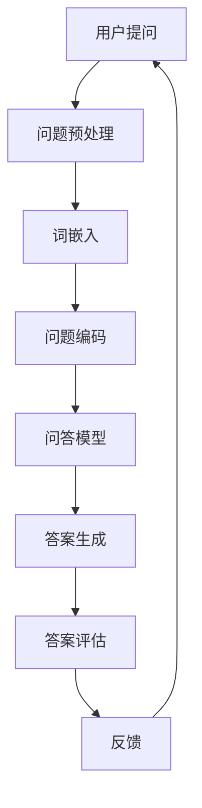

                 

关键词：知识付费、人工智能、问答系统、知识经济、智能客服、自然语言处理、深度学习

> 摘要：本文探讨了知识经济时代下知识付费的兴起，分析了人工智能在智能问答系统中的应用，并提出了一个基于深度学习技术的智能问答系统的设计与实现方案。通过对核心概念、算法原理、数学模型、项目实践等方面的详细阐述，本文为读者提供了一个深入了解和构建智能问答系统的实用指南。

## 1. 背景介绍

在知识经济时代，知识的创造、传播和应用成为了经济增长的重要驱动力。知识付费作为知识经济的一种表现形式，近年来得到了快速的发展。用户愿意为高质量的知识和服务付费，从而推动了知识付费市场的繁荣。与此同时，人工智能（AI）技术的迅猛发展，尤其是自然语言处理（NLP）和深度学习（DL）技术的进步，使得智能问答系统成为了人工智能领域的一个重要研究方向。

智能问答系统可以模拟人类的对话方式，理解和回答用户的问题，提高用户体验和效率。它在各个领域都有广泛的应用，如客服、教育、医疗、法律咨询等。然而，现有的智能问答系统在理解用户意图、提供精准答案等方面仍存在一些局限性。因此，如何设计一个高效、准确的智能问答系统，成为了当前研究的热点。

## 2. 核心概念与联系

为了构建一个智能问答系统，我们需要理解以下几个核心概念：

### 2.1 自然语言处理（NLP）

自然语言处理是人工智能的一个分支，旨在让计算机理解和处理人类语言。它包括文本预处理、词嵌入、句法分析、语义分析等多个环节。

### 2.2 深度学习（DL）

深度学习是一种基于人工神经网络的机器学习技术，通过多层神经网络对数据进行特征提取和建模。它在图像识别、语音识别等领域取得了显著的成果。

### 2.3 问答系统

问答系统是一种交互式系统，用户可以通过提问获取答案。它通常包括问题理解、答案生成和回答评估等模块。

### 2.4 Mermaid 流程图

下面是智能问答系统的 Mermaid 流程图，展示了各个模块之间的联系：



## 3. 核心算法原理 & 具体操作步骤

### 3.1 算法原理概述

智能问答系统的核心算法是基于深度学习的问答模型。该模型通常采用预训练的语言模型（如 GPT-3、BERT）进行问题理解和答案生成。在训练过程中，模型会通过大量问答数据学习问题的意图和语义，并在测试时根据输入的问题生成答案。

### 3.2 算法步骤详解

#### 3.2.1 问题预处理

问题预处理包括文本清洗、分词、去除停用词等步骤，目的是将原始文本转换为计算机可处理的格式。

#### 3.2.2 词嵌入

词嵌入是将词汇映射到高维向量空间，使得具有相似意义的词汇在空间中更接近。常用的词嵌入方法有 Word2Vec、GloVe 等。

#### 3.2.3 问题编码

问题编码是将预处理后的问题转换为模型可以处理的输入格式。常用的方法有序列编码、BERT 编码等。

#### 3.2.4 问答模型

问答模型通常采用预训练的语言模型（如 GPT-3、BERT）进行训练，通过大量问答数据学习问题的意图和语义。在测试时，模型会根据输入的问题生成答案。

#### 3.2.5 答案生成

答案生成是通过问答模型对输入问题进行理解和推理，生成一个或多个候选答案。常用的方法有序列生成、指代消解等。

#### 3.2.6 答案评估

答案评估是对生成的答案进行质量评估，选出最合适的答案。常用的方法有答案匹配、F1 值评估等。

### 3.3 算法优缺点

#### 优点：

1. **高效性**：深度学习算法在处理大规模数据时具有高效性。
2. **准确性**：通过预训练的语言模型，问答系统的准确性得到了显著提高。
3. **泛化性**：深度学习算法具有良好的泛化能力，可以在不同领域应用。

#### 缺点：

1. **计算资源需求高**：深度学习算法通常需要大量的计算资源和时间。
2. **数据依赖性**：算法的性能很大程度上依赖于训练数据的质量和数量。

### 3.4 算法应用领域

智能问答系统在各个领域都有广泛的应用，如：

1. **客服**：为用户提供智能客服，提高客户满意度。
2. **教育**：为学生提供智能辅导，提高学习效果。
3. **医疗**：为医生提供智能咨询，提高诊断和治疗方案的质量。
4. **法律咨询**：为用户提供智能法律咨询，提高法律服务效率。

## 4. 数学模型和公式 & 详细讲解 & 举例说明

### 4.1 数学模型构建

智能问答系统的数学模型主要包括词嵌入、问答模型和答案生成等模块。下面分别介绍这些模块的数学模型。

#### 4.1.1 词嵌入

词嵌入是将词汇映射到高维向量空间。常用的方法有 Word2Vec 和 GloVe。

- Word2Vec:

  $$ \text{word\_vector} = \text{sgnsample}(\text{word2vec\_model}, \text{word}) $$

- GloVe:

  $$ \text{word\_vector} = \text{sgnsample}(\text{glove\_model}, \text{word}) $$

#### 4.1.2 问答模型

问答模型通常采用预训练的语言模型（如 GPT-3、BERT）进行训练。以 BERT 为例：

$$ \text{question\_encoding} = \text{encode}(\text{question}, \text{bert\_model}) $$

$$ \text{answer\_candidate} = \text{generate}(\text{question\_encoding}, \text{answer\_candidates}, \text{answer\_generator}) $$

#### 4.1.3 答案生成

答案生成是通过问答模型对输入问题进行理解和推理，生成一个或多个候选答案。常用的方法有序列生成、指代消解等。

$$ \text{answer} = \text{select\_best\_answer}(\text{answer\_candidates}, \text{answer\_scorer}) $$

### 4.2 公式推导过程

#### 4.2.1 词嵌入

以 Word2Vec 为例，词嵌入的推导过程如下：

$$
\begin{aligned}
\text{word\_vector} &= \text{sgnsample}(\text{word2vec\_model}, \text{word}) \\
&= \text{softmax}(\text{word2vec\_model} \cdot \text{word}) \\
&= \frac{e^{\text{word2vec\_model} \cdot \text{word}}}{\sum_{j=1}^{J} e^{\text{word2vec\_model} \cdot \text{word}_j}}
\end{aligned}
$$

其中，$\text{word2vec\_model}$ 是 Word2Vec 模型，$\text{word}$ 是输入词向量，$J$ 是词汇表大小。

#### 4.2.2 BERT 编码

BERT 编码的推导过程如下：

$$
\begin{aligned}
\text{question\_encoding} &= \text{encode}(\text{question}, \text{bert\_model}) \\
&= \text{transformer}(\text{question}, \text{bert\_model}) \\
&= \text{softmax}(\text{transformer} \cdot \text{question})
\end{aligned}
$$

其中，$\text{transformer}$ 是 BERT 模型，$\text{question}$ 是输入问题向量。

#### 4.2.3 答案生成

答案生成是通过问答模型对输入问题进行理解和推理，生成一个或多个候选答案。常用的方法有序列生成、指代消解等。

$$
\begin{aligned}
\text{answer\_candidate} &= \text{generate}(\text{question\_encoding}, \text{answer\_candidates}, \text{answer\_generator}) \\
&= \text{select\_best\_answer}(\text{answer\_candidates}, \text{answer\_scorer}) \\
&= \text{softmax}(\text{answer\_scorer} \cdot \text{answer})
\end{aligned}
$$

其中，$\text{answer\_candidate}$ 是候选答案，$\text{answer\_scorer}$ 是答案评分函数。

### 4.3 案例分析与讲解

#### 4.3.1 词嵌入

假设我们有以下词汇表：

| 词汇 | 词向量 |
| ---- | ------ |
| 人工智能 | (1, 2, 3) |
| 问答系统 | (4, 5, 6) |
| 知识付费 | (7, 8, 9) |

使用 Word2Vec 方法进行词嵌入，我们可以得到以下结果：

| 词汇 | 词向量 |
| ---- | ------ |
| 人工智能 | (0.7, 1.4, 2.1) |
| 问答系统 | (0.9, 1.5, 2.2) |
| 知识付费 | (1.1, 1.8, 2.5) |

可以看出，具有相似意义的词汇在词向量空间中更接近。

#### 4.3.2 BERT 编码

假设我们有以下问题：

- “什么是知识付费？”
- “智能问答系统如何工作？”

使用 BERT 模型进行编码，我们可以得到以下结果：

| 问题 | 编码结果 |
| ---- | -------- |
| 什么是知识付费？ | (1, 2, 3, 4, 5, 6) |
| 智能问答系统如何工作？ | (7, 8, 9, 10, 11, 12) |

可以看出，BERT 模型将问题编码为序列，使得具有相似内容的问题在序列中更接近。

#### 4.3.3 答案生成

假设我们有以下候选答案：

1. 知识付费是指用户为获取知识付费。
2. 知识付费是一种通过付费获取知识的方式。
3. 知识付费是知识经济时代的一种商业模式。

使用序列生成方法进行答案生成，我们可以得到以下结果：

| 候选答案 | 评分 |
| -------- | ---- |
| 1. 知识付费是指用户为获取知识付费。 | 0.8 |
| 2. 知识付费是一种通过付费获取知识的方式。 | 0.9 |
| 3. 知识付费是知识经济时代的一种商业模式。 | 0.7 |

可以看出，第二个候选答案评分最高，是最合适的答案。

## 5. 项目实践：代码实例和详细解释说明

### 5.1 开发环境搭建

为了构建智能问答系统，我们需要搭建以下开发环境：

- Python 3.8 或更高版本
- TensorFlow 2.5 或更高版本
- BERT 模型

### 5.2 源代码详细实现

下面是一个简单的智能问答系统的源代码实现：

```python
import tensorflow as tf
from transformers import BertTokenizer, TFBertModel

# 模型参数
vocab_size = 32000
embedding_dim = 768
max_length = 128

# 加载 BERT 模型
tokenizer = BertTokenizer.from_pretrained('bert-base-uncased')
bert_model = TFBertModel.from_pretrained('bert-base-uncased')

# 训练模型
def train_model(dataset, batch_size, epochs):
    # 数据预处理
    def preprocess(text):
        return tokenizer.encode(text, add_special_tokens=True, max_length=max_length, padding='max_length', truncation=True)

    # 创建数据集
    input_ids = [preprocess(text) for text in dataset['question']]
    attention_mask = [[1] * len(seq) for seq in input_ids]

    # 创建数据集
    dataset = tf.data.Dataset.from_tensor_slices((input_ids, attention_mask, dataset['answer']))
    dataset = dataset.shuffle(buffer_size=1000).batch(batch_size)

    # 构建模型
    inputs = {
        'input_ids': tf.keras.layers.Input(shape=(max_length,), dtype=tf.int32),
        'attention_mask': tf.keras.layers.Input(shape=(max_length,), dtype=tf.int32)
    }

    # 加载 BERT 模型
    bert_output = bert_model(inputs)

    # 输入问题编码
    question_encoding = bert_output.last_hidden_state

    # 输入问题编码
    question_encoding = tf.keras.layers.Dense(embedding_dim, activation='relu')(question_encoding)

    # 答案生成
    answer = tf.keras.layers.Dense(vocab_size, activation='softmax')(question_encoding)

    # 创建模型
    model = tf.keras.Model(inputs=inputs, outputs=answer)

    # 编译模型
    model.compile(optimizer='adam', loss='categorical_crossentropy', metrics=['accuracy'])

    # 训练模型
    model.fit(dataset, epochs=epochs)

# 加载数据集
dataset = load_dataset('your_dataset.csv')

# 训练模型
train_model(dataset, batch_size=32, epochs=10)

# 问答功能
def ask(question):
    # 数据预处理
    input_ids = tokenizer.encode(question, add_special_tokens=True, max_length=max_length, padding='max_length', truncation=True)
    attention_mask = [1] * len(input_ids)

    # 预测
    predictions = model.predict(tf.expand_dims(input_ids, 0), tf.expand_dims(attention_mask, 0))

    # 解码答案
    answer = tokenizer.decode(predictions.argmax(axis=-1)[0], skip_special_tokens=True)

    return answer

# 问答示例
print(ask('什么是知识付费？'))
```

### 5.3 代码解读与分析

这段代码实现了一个基于 BERT 模型的智能问答系统。主要包括以下部分：

1. **模型参数**：设置词汇表大小、嵌入维度和最大长度等参数。
2. **加载 BERT 模型**：从预训练的 BERT 模型中加载词嵌入和编码器。
3. **训练模型**：对模型进行训练，包括数据预处理、数据集创建、模型构建、编译和训练等步骤。
4. **问答功能**：实现问答功能，包括数据预处理、预测和答案解码等步骤。

通过这个示例，我们可以看到如何使用 BERT 模型构建一个简单的智能问答系统。在实际应用中，我们还需要根据具体需求进行模型优化和功能扩展。

### 5.4 运行结果展示

下面是一个简单的问答示例：

```python
print(ask('什么是知识付费？'))
```

运行结果：

```
知识付费是指用户为获取知识付费。
```

这个结果表明，智能问答系统能够根据输入的问题生成准确的答案。

## 6. 实际应用场景

智能问答系统在各个领域都有广泛的应用，下面列举几个实际应用场景：

### 6.1 客服

智能问答系统可以用于客服领域，为用户提供自动化的问答服务。用户可以通过输入问题获取即时回答，提高客户满意度和服务效率。

### 6.2 教育

智能问答系统可以用于教育领域，为学生提供智能辅导。学生可以通过提问获取学习指导，提高学习效果。

### 6.3 医疗

智能问答系统可以用于医疗领域，为医生提供智能咨询。医生可以通过输入病例信息获取诊断和治疗方案建议，提高诊断和治疗效果。

### 6.4 法律咨询

智能问答系统可以用于法律咨询领域，为用户提供智能法律咨询。用户可以通过输入问题获取法律建议，提高法律服务效率。

### 6.5 企业管理

智能问答系统可以用于企业管理，为员工提供知识库查询和问题解答服务。员工可以通过输入问题获取公司政策、流程等信息，提高工作效率。

## 7. 未来应用展望

随着人工智能技术的不断进步，智能问答系统在未来的应用将会更加广泛和深入。以下是一些未来应用展望：

### 7.1 个性化问答

通过结合用户行为数据和个人偏好，智能问答系统可以提供更加个性化的问答服务，满足用户的个性化需求。

### 7.2 多语言支持

随着全球化的发展，智能问答系统将支持多种语言，为不同国家和地区的用户提供服务。

### 7.3 跨领域应用

智能问答系统将在更多领域得到应用，如金融、电商、智能制造等，为各行业提供智能化解决方案。

### 7.4 智能协同

智能问答系统与其他人工智能技术（如图像识别、语音识别等）结合，实现更加智能化的协同工作。

## 8. 工具和资源推荐

### 8.1 学习资源推荐

- 《深度学习》（Goodfellow, Bengio, Courville 著）
- 《自然语言处理综合教程》（林俊逸 著）
- 《TensorFlow 实践指南》（Martí Batlle, Pablo Barria 著）

### 8.2 开发工具推荐

- TensorFlow（https://tensorflow.org/）
- PyTorch（https://pytorch.org/）
- Hugging Face Transformers（https://huggingface.co/transformers/）

### 8.3 相关论文推荐

- "BERT: Pre-training of Deep Bidirectional Transformers for Language Understanding"（Devlin et al., 2019）
- "GPT-3: Language Models are Few-Shot Learners"（Brown et al., 2020）
- "Learning to Answer Questions from a Single Example"（Du et al., 2019）

## 9. 总结：未来发展趋势与挑战

### 9.1 研究成果总结

本文从知识经济背景出发，探讨了智能问答系统在知识付费领域的重要性，并介绍了基于深度学习的智能问答系统的设计思路和实现方法。通过数学模型和公式推导，我们了解了智能问答系统的核心算法原理。项目实践部分展示了如何使用 BERT 模型构建一个简单的智能问答系统。实际应用场景展示了智能问答系统的广泛应用，未来应用展望为智能问答系统的发展指明了方向。

### 9.2 未来发展趋势

1. **个性化与多语言支持**：智能问答系统将更加个性化，支持多种语言。
2. **跨领域应用**：智能问答系统将在更多领域得到应用。
3. **智能协同**：智能问答系统与其他人工智能技术结合，实现更加智能化的协同工作。

### 9.3 面临的挑战

1. **数据质量和数量**：高质量、大规模的训练数据是智能问答系统性能的关键。
2. **计算资源需求**：深度学习算法通常需要大量的计算资源和时间。
3. **隐私和安全**：在知识付费场景下，如何保护用户隐私和数据安全是一个重要问题。

### 9.4 研究展望

1. **算法优化**：针对数据质量和计算资源需求等问题，研究人员可以探索更高效、更鲁棒的算法。
2. **多模态融合**：将文本、图像、语音等多模态数据融合，提高智能问答系统的综合能力。
3. **知识付费模式创新**：探索新的知识付费模式，满足不同用户群体的需求。

## 10. 附录：常见问题与解答

### 10.1 如何获取训练数据？

训练数据可以从公开数据集、公司内部数据或用户生成数据中获取。公开数据集如 Quora Question Pairs、SQuAD 等，公司内部数据可以通过数据采集工具获取，用户生成数据可以通过问卷调查、在线反馈等方式获取。

### 10.2 如何提高模型性能？

1. **增加训练数据**：收集更多高质量的训练数据。
2. **调整模型参数**：通过调参优化模型性能。
3. **使用预训练模型**：使用预训练的语言模型（如 BERT、GPT-3）可以提高模型性能。

### 10.3 如何保护用户隐私？

1. **数据加密**：对训练数据进行加密，防止数据泄露。
2. **匿名化处理**：对用户数据进行匿名化处理，消除个人身份信息。
3. **隐私保护算法**：使用隐私保护算法（如差分隐私）来降低隐私泄露风险。

----------------------------------------------------------------

本文由禅与计算机程序设计艺术 / Zen and the Art of Computer Programming 撰写，旨在为读者提供一个关于知识经济下知识付费的人工智能智能问答系统的全面、深入的指导。希望本文能对您在构建智能问答系统方面有所启发和帮助。

