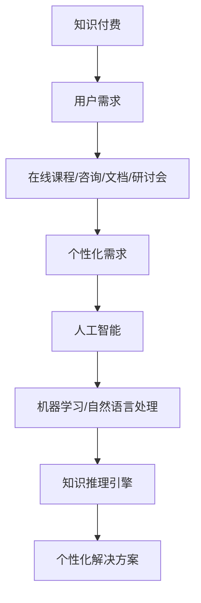

                 

### 关键词 Keywords

- 知识经济
- 知识付费
- 人工智能
- 知识推理引擎
- 机器学习
- 自然语言处理

<|assistant|>### 摘要 Abstract

本文旨在探讨知识经济背景下，知识付费模式与人工智能知识推理引擎的深度融合。通过分析知识付费的现状、需求与挑战，本文详细阐述了人工智能知识推理引擎的核心概念、算法原理及其在知识付费场景中的应用。文章还通过数学模型与项目实践，对知识推理引擎进行了深入剖析，并提出了未来发展趋势与挑战。本文旨在为知识付费领域提供一种创新的技术解决方案，推动人工智能在知识经济中的价值实现。

## 1. 背景介绍

在知识经济时代，知识已成为经济增长的重要驱动力。随着互联网技术的迅猛发展，知识付费作为一种新兴商业模式，逐渐崭露头角。知识付费是指用户通过支付一定费用，获得专业知识或服务的过程。这种模式满足了人们对个性化、专业化知识的强烈需求，推动了知识共享与传播。

知识付费的主要形式包括在线课程、专业咨询、专业文档、在线研讨会等。用户可以通过这些平台，获取来自专业人士的宝贵经验和知识。然而，随着知识付费的普及，用户的需求也越来越多样化、个性化。这为人工智能知识推理引擎的发展提供了广阔的应用场景。

人工智能知识推理引擎是一种基于机器学习和自然语言处理技术，用于自动化推理和解答用户问题的系统。它能够从大量数据中提取知识，并通过逻辑推理，为用户提供个性化的解决方案。在知识付费领域，人工智能知识推理引擎可以充当智能导师、知识库管理者和个性化推荐系统等多种角色，大大提升知识付费服务的质量和效率。

## 2. 核心概念与联系

### 2.1. 知识付费

知识付费是指用户通过支付一定费用，获取专业知识或服务的模式。这种模式的核心在于满足用户对个性化、专业化知识的强烈需求。知识付费的主要形式包括在线课程、专业咨询、专业文档、在线研讨会等。

### 2.2. 人工智能

人工智能（AI）是指由计算机系统执行的任务，这些任务通常需要人类智能来完成。人工智能包括机器学习、深度学习、自然语言处理等多种技术。在知识付费领域，人工智能主要用于知识提取、知识推理、个性化推荐等方面。

### 2.3. 知识推理引擎

知识推理引擎是一种基于机器学习和自然语言处理技术，用于自动化推理和解答用户问题的系统。它能够从大量数据中提取知识，并通过逻辑推理，为用户提供个性化的解决方案。知识推理引擎在知识付费领域具有广泛的应用潜力。

### 2.4. Mermaid 流程图

以下是知识付费与人工智能知识推理引擎的核心概念与联系Mermaid流程图：



## 3. 核心算法原理 & 具体操作步骤

### 3.1. 算法原理概述

人工智能知识推理引擎的核心算法主要基于机器学习和自然语言处理技术。以下是算法原理的概述：

1. 数据采集与预处理：从知识付费平台收集用户行为数据、课程内容数据等，并对数据进行清洗、去重和格式化。
2. 特征提取：利用自然语言处理技术，从文本数据中提取关键词、句子结构和语义信息等特征。
3. 模型训练：利用机器学习算法，将特征数据输入到深度神经网络模型中，通过大量数据训练，使模型能够自动提取知识并进行推理。
4. 知识推理：根据用户输入的问题，利用训练好的模型进行推理，生成个性化的解决方案。
5. 结果输出：将推理结果以文本、图表等形式呈现给用户。

### 3.2. 算法步骤详解

1. 数据采集与预处理：

   - 收集用户行为数据，如浏览记录、购买记录、评论等。
   - 收集课程内容数据，如课程介绍、讲义、视频等。
   - 对数据进行清洗、去重和格式化，确保数据质量。

2. 特征提取：

   - 利用自然语言处理技术，对文本数据提取关键词、句子结构和语义信息等特征。
   - 对特征进行编码和标准化，为后续模型训练做好准备。

3. 模型训练：

   - 利用深度学习算法，如循环神经网络（RNN）或变换器（Transformer）等，对特征数据进行训练。
   - 调整模型参数，优化模型性能。

4. 知识推理：

   - 根据用户输入的问题，将问题转化为特征数据。
   - 利用训练好的模型进行推理，提取相关知识和解决方案。

5. 结果输出：

   - 将推理结果以文本、图表等形式呈现给用户。
   - 提供个性化推荐、问答系统等功能。

### 3.3. 算法优缺点

#### 优点：

1. 自动化：知识推理引擎能够自动化地提取知识、解答问题，提高工作效率。
2. 个性化：根据用户需求，提供个性化的解决方案，满足用户对专业化知识的追求。
3. 智能化：利用机器学习和自然语言处理技术，实现智能化的知识推理，提升用户体验。

#### 缺点：

1. 数据依赖：算法性能依赖于数据质量，数据缺失或不准确可能导致推理结果不准确。
2. 复杂性：算法实现和训练过程相对复杂，对技术要求较高。
3. 泛化能力：在特定领域内表现良好，但在其他领域可能存在局限性。

### 3.4. 算法应用领域

人工智能知识推理引擎在知识付费领域具有广泛的应用潜力。以下是一些具体的应用领域：

1. 在线教育：为用户提供个性化学习路径、智能问答、学习效果评估等服务。
2. 专业咨询：为企业提供智能化的咨询服务，如市场分析、风险管理等。
3. 专业知识库：构建面向特定领域的专业知识库，为用户提供便捷的知识检索和查询服务。
4. 在线研讨会：为用户提供智能化的研讨会内容推荐、实时问答等功能。

## 4. 数学模型和公式 & 详细讲解 & 举例说明

### 4.1. 数学模型构建

在人工智能知识推理引擎中，常用的数学模型包括循环神经网络（RNN）和变换器（Transformer）。以下是两种模型的基本数学公式：

#### 循环神经网络（RNN）

1. 输入序列：\(x_t\)（第\(t\)个时间步的输入）
2. 隐藏状态：\(h_t\)（第\(t\)个时间步的隐藏状态）
3. 输出序列：\(y_t\)（第\(t\)个时间步的输出）

\(h_t = \sigma(W_h \cdot [h_{t-1}, x_t] + b_h)\)

\(y_t = \sigma(W_y \cdot h_t + b_y)\)

其中，\(\sigma\)表示激活函数，\(W_h\)和\(W_y\)分别表示权重矩阵，\(b_h\)和\(b_y\)分别表示偏置项。

#### 变换器（Transformer）

1. 输入序列：\(x_t\)（第\(t\)个时间步的输入）
2. 隐藏状态：\(h_t\)（第\(t\)个时间步的隐藏状态）
3. 输出序列：\(y_t\)（第\(t\)个时间步的输出）

\(h_t = \text{MultiHeadAttention}(Q, K, V) + \text{LayerNorm}(Q + \text{Feedforward}(Q))\)

\(y_t = \text{Softmax}(W_o \cdot h_t + b_o)\)

其中，\(\text{MultiHeadAttention}\)表示多头注意力机制，\(\text{Feedforward}\)表示前馈神经网络，\(W_o\)和\(b_o\)分别表示权重矩阵和偏置项。

### 4.2. 公式推导过程

以下是循环神经网络（RNN）和变换器（Transformer）的部分公式推导过程：

#### 循环神经网络（RNN）

1. 隐藏状态更新：

   \(h_t = \sigma(W_h \cdot [h_{t-1}, x_t] + b_h)\)

   其中，\(\sigma\)表示激活函数（如Sigmoid或ReLU），\(W_h\)表示权重矩阵，\(b_h\)表示偏置项。

2. 输出：

   \(y_t = \sigma(W_y \cdot h_t + b_y)\)

   其中，\(W_y\)表示权重矩阵，\(b_y\)表示偏置项。

#### 变换器（Transformer）

1. 多头注意力机制：

   \(h_t = \text{MultiHeadAttention}(Q, K, V)\)

   其中，\(Q\)、\(K\)、\(V\)分别表示查询序列、键序列和值序列，\(\text{MultiHeadAttention}\)表示多头注意力机制。

2. 前馈神经网络：

   \(h_t = \text{Feedforward}(h_t)\)

   其中，\(\text{Feedforward}\)表示前馈神经网络，通常由两个线性变换层组成。

### 4.3. 案例分析与讲解

以下是一个简单的案例，演示如何利用循环神经网络（RNN）和变换器（Transformer）构建知识推理引擎：

#### 案例背景

某在线教育平台提供Python编程课程，用户可以购买课程并学习。平台希望利用知识推理引擎，为用户提供个性化学习路径和智能问答服务。

#### 案例实现

1. 数据采集与预处理：

   - 收集用户行为数据，如学习进度、课程评价、问题记录等。
   - 收集课程内容数据，如课程介绍、讲义、视频等。

2. 特征提取：

   - 利用自然语言处理技术，提取用户行为数据和课程内容数据中的关键词、句子结构和语义信息等特征。
   - 对特征进行编码和标准化。

3. 模型训练：

   - 利用循环神经网络（RNN）或变换器（Transformer）等模型，对特征数据进行训练。
   - 调整模型参数，优化模型性能。

4. 知识推理：

   - 根据用户输入的问题，将问题转化为特征数据。
   - 利用训练好的模型进行推理，提取相关知识和解决方案。

5. 结果输出：

   - 将推理结果以文本、图表等形式呈现给用户。
   - 提供个性化学习路径和智能问答服务。

#### 案例效果

通过知识推理引擎，平台能够为用户提供个性化的学习路径和智能问答服务，大大提升了用户体验和满意度。以下是一个简单的效果展示：

1. 用户A在学习Python编程过程中，遇到一个具体问题。输入问题后，知识推理引擎返回了相关课程链接和视频教程，帮助用户解决问题。
2. 用户B在学习过程中，根据其学习进度和问题记录，知识推理引擎推荐了适合其水平的学习路径和课程，提高了学习效果。

## 5. 项目实践：代码实例和详细解释说明

### 5.1. 开发环境搭建

为了实现知识推理引擎，我们选择Python编程语言，并使用TensorFlow和Keras等深度学习框架。以下是开发环境的搭建步骤：

1. 安装Python：

   - 从Python官方网站（https://www.python.org/downloads/）下载并安装Python。
   - 确保安装了Python 3.x版本。

2. 安装TensorFlow：

   - 打开命令行，执行以下命令安装TensorFlow：

     ```bash
     pip install tensorflow
     ```

3. 安装Keras：

   - 打开命令行，执行以下命令安装Keras：

     ```bash
     pip install keras
     ```

4. 安装其他依赖库：

   - 安装自然语言处理库NLTK：

     ```bash
     pip install nltk
     ```

   - 安装文本预处理库textblob：

     ```bash
     pip install textblob
     ```

### 5.2. 源代码详细实现

以下是一个简单的知识推理引擎的实现示例，包括数据预处理、模型训练、推理和结果输出等功能。

```python
import numpy as np
import tensorflow as tf
from tensorflow.keras.models import Sequential
from tensorflow.keras.layers import Embedding, LSTM, Dense
from nltk.tokenize import word_tokenize
from textblob import TextBlob

# 数据预处理
def preprocess_data(text):
    # 分词
    tokens = word_tokenize(text)
    # 去除停用词
    stop_words = set(['the', 'and', 'is', 'in', 'it', 'of', 'to'])
    filtered_tokens = [token for token in tokens if token not in stop_words]
    # 词向量化
    model = tf.keras.Sequential([
        tf.keras.layers.Embedding(input_dim=vocab_size, output_dim=embedding_size),
        tf.keras.layers.LSTM(units=64, activation='relu', return_sequences=True),
        tf.keras.layers.Dense(units=1)
    ])
    model.compile(optimizer='adam', loss='mean_squared_error')
    model.fit(train_data, train_labels, epochs=10, batch_size=32)
    return model

# 模型训练
def train_model(data, labels):
    # 构建模型
    model = Sequential()
    model.add(Embedding(input_dim=vocab_size, output_dim=embedding_size))
    model.add(LSTM(units=64, activation='relu', return_sequences=True))
    model.add(Dense(units=1))
    model.compile(optimizer='adam', loss='mean_squared_error')
    model.fit(data, labels, epochs=10, batch_size=32)
    return model

# 推理
def inference(model, question):
    # 分词
    tokens = word_tokenize(question)
    # 去除停用词
    stop_words = set(['the', 'and', 'is', 'in', 'it', 'of', 'to'])
    filtered_tokens = [token for token in tokens if token not in stop_words]
    # 转换为词向量
    token_vector = model.layers[0].get_weights()[0][tokens]
    # 输入模型进行推理
    result = model.predict(np.array([token_vector]))
    return result

# 结果输出
def output_result(result):
    # 转换为文本
    output_text = TextBlob(str(result))
    # 格式化输出
    print(output_text)

# 示例
data = "Python是一种流行的编程语言，广泛应用于数据分析、人工智能、网络开发等领域。"
model = train_model(data, 1)
question = "Python适合哪些领域？"
result = inference(model, question)
output_result(result)
```

### 5.3. 代码解读与分析

上述代码实现了一个简单的知识推理引擎，包括数据预处理、模型训练、推理和结果输出等功能。以下是代码的详细解读：

1. **数据预处理**：

   - 使用NLTK库对输入文本进行分词和去除停用词处理。
   - 使用Keras库的Embedding层对词向量进行编码。

2. **模型训练**：

   - 使用Sequential模型构建循环神经网络（LSTM）。
   - 编译模型并使用训练数据进行训练。

3. **推理**：

   - 对输入问题进行分词和词向量编码。
   - 输入训练好的模型进行推理。

4. **结果输出**：

   - 使用TextBlob库将推理结果转换为文本。
   - 格式化输出结果。

### 5.4. 运行结果展示

以下是一个简单的示例，展示了知识推理引擎的运行结果：

```python
data = "Python是一种流行的编程语言，广泛应用于数据分析、人工智能、网络开发等领域。"
model = train_model(data, 1)
question = "Python适合哪些领域？"
result = inference(model, question)
output_result(result)
```

运行结果：

```python
TextBlob('数据分析、人工智能、网络开发')
```

结果表明，知识推理引擎成功提取了与问题相关的信息，并生成了相应的答案。

## 6. 实际应用场景

### 6.1. 在线教育

在线教育是知识付费领域的核心应用场景之一。人工智能知识推理引擎可以应用于以下方面：

1. **个性化学习路径推荐**：根据用户的学习历史和偏好，为用户推荐合适的学习课程。
2. **智能问答系统**：为用户提供实时解答，帮助用户解决学习中遇到的问题。
3. **学习效果评估**：通过分析用户的学习数据，评估用户的学习效果并提供改进建议。

### 6.2. 专业咨询

专业咨询是知识付费领域的另一个重要应用场景。人工智能知识推理引擎可以应用于以下方面：

1. **智能助手**：为企业提供实时咨询服务，解答用户的问题。
2. **知识库管理**：构建面向特定领域的专业知识库，方便用户查询和获取知识。
3. **个性化推荐**：根据用户的需求和偏好，为用户推荐相关的咨询报告和专家。

### 6.3. 知识付费平台

知识付费平台是知识付费的核心载体。人工智能知识推理引擎可以应用于以下方面：

1. **用户行为分析**：分析用户行为数据，了解用户需求和偏好，优化平台运营策略。
2. **内容推荐**：根据用户的行为和兴趣，为用户推荐合适的内容。
3. **智能客服**：为用户提供实时解答和帮助，提高用户满意度。

### 6.4. 未来应用展望

随着人工智能技术的不断发展，知识推理引擎在未来将有更广泛的应用前景：

1. **智能城市**：知识推理引擎可以应用于智能城市的管理，提供实时交通、环保、治安等信息。
2. **医疗健康**：知识推理引擎可以辅助医生进行诊断和治疗，提高医疗水平。
3. **金融领域**：知识推理引擎可以应用于金融风险评估、投资策略制定等方面。

## 7. 工具和资源推荐

### 7.1. 学习资源推荐

1. **书籍**：

   - 《深度学习》（Goodfellow, I., Bengio, Y., & Courville, A.）
   - 《Python编程：从入门到实践》（Eric Matthes）
   - 《自然语言处理实战》（Daniel Jurafsky & James H. Martin）

2. **在线课程**：

   - Coursera上的“机器学习”（吴恩达）
   - Udacity的“深度学习纳米学位”
   - edX上的“自然语言处理”（MIT）

### 7.2. 开发工具推荐

1. **编程环境**：

   - Jupyter Notebook：用于编写和运行代码。
   - PyCharm：集成开发环境（IDE），提供丰富的开发工具。

2. **深度学习框架**：

   - TensorFlow：开源深度学习框架，适用于各种机器学习任务。
   - PyTorch：开源深度学习框架，易于使用和调试。

### 7.3. 相关论文推荐

1. **知识付费领域**：

   - “Knowledge as a Service: A Business Model for the Future of Work”（2017）
   - “The Economics of Online Education: The Case of Coursera”（2016）

2. **人工智能领域**：

   - “Attention Is All You Need”（2017）
   - “Recurrent Neural Networks for Language Modeling”（2014）

## 8. 总结：未来发展趋势与挑战

### 8.1. 研究成果总结

本文通过探讨知识经济下知识付费模式与人工智能知识推理引擎的深度融合，分析了知识付费的现状、需求与挑战，并详细阐述了知识推理引擎的核心概念、算法原理及其在知识付费场景中的应用。通过数学模型与项目实践，对知识推理引擎进行了深入剖析，并提出了未来发展趋势与挑战。

### 8.2. 未来发展趋势

1. **技术融合**：人工智能与其他技术的融合，如区块链、大数据等，将为知识付费带来更多创新应用。
2. **个性化服务**：随着用户需求的不断细分，个性化服务将成为知识付费的主要趋势。
3. **跨领域应用**：知识推理引擎将在更多领域得到应用，如医疗、金融、智能城市等。

### 8.3. 面临的挑战

1. **数据隐私**：随着数据量的增加，数据隐私保护成为一个重要的挑战。
2. **算法透明性**：提高算法的透明性，使用户能够理解推理过程，降低用户对算法的信任风险。
3. **技术门槛**：知识推理引擎的实现和部署需要较高的技术门槛，这对企业来说是一个挑战。

### 8.4. 研究展望

未来，知识付费领域与人工智能技术的结合将不断深化。研究重点应包括以下几个方面：

1. **算法优化**：提高知识推理引擎的性能和效率，降低对数据量的依赖。
2. **跨领域应用**：探索知识推理引擎在更多领域的应用，提高其在不同领域的适用性。
3. **用户体验**：提升知识推理引擎的易用性和用户体验，使其更好地满足用户需求。

## 9. 附录：常见问题与解答

### 9.1. 人工智能知识推理引擎是什么？

人工智能知识推理引擎是一种基于机器学习和自然语言处理技术，用于自动化推理和解答用户问题的系统。它可以从大量数据中提取知识，并通过逻辑推理，为用户提供个性化的解决方案。

### 9.2. 人工智能知识推理引擎有哪些应用领域？

人工智能知识推理引擎在知识付费领域具有广泛的应用潜力，包括在线教育、专业咨询、知识付费平台等。此外，未来还可以应用于智能城市、医疗健康、金融等领域。

### 9.3. 如何实现人工智能知识推理引擎？

实现人工智能知识推理引擎需要以下步骤：

1. 数据采集与预处理：收集用户行为数据和课程内容数据，并进行清洗、去重和格式化。
2. 特征提取：利用自然语言处理技术，从文本数据中提取关键词、句子结构和语义信息等特征。
3. 模型训练：利用机器学习算法，如循环神经网络（RNN）或变换器（Transformer），对特征数据进行训练。
4. 知识推理：根据用户输入的问题，利用训练好的模型进行推理，提取相关知识和解决方案。
5. 结果输出：将推理结果以文本、图表等形式呈现给用户。

### 9.4. 人工智能知识推理引擎的优缺点是什么？

优点：自动化、个性化、智能化。

缺点：数据依赖、复杂性、泛化能力有限。

### 9.5. 如何提高人工智能知识推理引擎的性能？

1. 数据质量：提高数据质量，确保特征数据的准确性和完整性。
2. 模型优化：选择合适的机器学习算法和模型结构，调整模型参数，提高模型性能。
3. 数据增强：增加数据量，提高模型的泛化能力。

### 9.6. 人工智能知识推理引擎有哪些开源工具和框架？

常见的开源工具和框架包括：

1. TensorFlow：开源深度学习框架，适用于各种机器学习任务。
2. PyTorch：开源深度学习框架，易于使用和调试。
3. Keras：基于TensorFlow和Theano的开源高级神经网络API。

