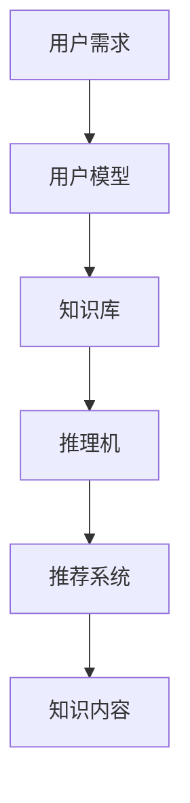

                 

关键词：知识付费、人工智能、知识推理、经济模型、用户需求、推理算法、应用场景

> 摘要：随着知识经济的兴起，知识付费已成为一种重要的商业模式。本文将探讨在知识经济背景下，如何利用人工智能技术构建知识推理引擎，以满足用户对高质量知识内容的需求。本文首先介绍了知识付费的现状与挑战，随后详细阐述了知识推理引擎的核心概念、算法原理、数学模型以及实际应用案例，最后对未来发展趋势与挑战进行了展望。

## 1. 背景介绍

知识经济是信息时代的重要特征之一，其核心是以知识为核心生产要素的经济活动。知识付费作为知识经济的一种体现，指的是用户为获取专业知识、技能或信息而支付费用的一种商业模式。随着互联网和人工智能技术的发展，知识付费市场日益壮大，各类知识服务平台层出不穷，如Coursera、Udemy、知乎Live等。这些平台通过提供专业课程、讲座、问答等形式，满足了用户对知识的多样化需求。

然而，知识付费市场也存在一些挑战。首先，知识内容的质量参差不齐，用户难以辨别真伪。其次，知识付费产品的个性化推荐效果有待提升，难以满足用户的个性化需求。此外，知识付费平台的运营成本较高，如何提高盈利能力也是一个亟待解决的问题。

为了应对这些挑战，本文提出了一种基于人工智能的知识推理引擎，旨在提升知识付费产品的质量和用户体验。本文将首先介绍知识推理引擎的核心概念和架构，然后详细阐述其算法原理和数学模型，最后通过实际应用案例展示其效果。

## 2. 核心概念与联系

### 2.1 知识推理引擎的定义

知识推理引擎是一种基于人工智能技术的智能系统，它能够从已知信息中推导出新的结论或知识。在知识付费领域，知识推理引擎主要用于识别用户需求、推荐知识内容、评估知识质量等任务。

### 2.2 知识推理引擎的架构

知识推理引擎主要由以下几个模块组成：

- **知识库**：存储各类专业知识、技能和信息的数据库。
- **推理机**：根据用户需求和知识库中的信息，运用推理算法进行知识推理，生成新的结论或知识。
- **用户模型**：记录用户的行为、兴趣和偏好，用于个性化推荐和用户画像构建。
- **推荐系统**：根据用户模型和知识库中的信息，为用户推荐相关的知识内容。

### 2.3 Mermaid 流程图



在上面的流程图中，用户需求通过用户模型传递到知识库，知识库中的信息经过推理机处理，生成推荐结果，最后通过推荐系统将知识内容推送给用户。

## 3. 核心算法原理 & 具体操作步骤

### 3.1 算法原理概述

知识推理引擎的核心算法主要包括知识图谱构建、推理算法和推荐算法。

- **知识图谱构建**：通过将各类知识内容转化为图谱结构，实现知识间的关联和整合。
- **推理算法**：运用逻辑推理、语义分析等技术，从已知信息中推导出新的结论或知识。
- **推荐算法**：基于用户模型和知识图谱，为用户推荐相关的知识内容。

### 3.2 算法步骤详解

1. **知识图谱构建**：
   - 数据采集：从各类知识来源中获取专业知识、技能和相关信息。
   - 数据预处理：对采集到的数据进行清洗、去重和格式化，使其符合图谱结构的要求。
   - 节点和边构建：将预处理后的数据转化为节点和边，形成知识图谱。

2. **推理算法**：
   - 前提条件：建立基于逻辑规则或语义分析的知识库，用于推理过程。
   - 推理过程：根据用户需求，从知识图谱中查找相关节点和边，运用推理算法进行知识推理。

3. **推荐算法**：
   - 用户模型构建：根据用户的行为、兴趣和偏好，构建用户画像。
   - 知识内容推荐：基于用户画像和知识图谱，运用推荐算法为用户推荐相关的知识内容。

### 3.3 算法优缺点

- **优点**：
  - 提升知识内容的质量和准确性。
  - 实现个性化推荐，满足用户多样化需求。
  - 降低运营成本，提高盈利能力。

- **缺点**：
  - 知识图谱构建和数据预处理过程复杂，需要大量人力和资源。
  - 推理算法和推荐算法的实现和优化需要较高的技术门槛。

### 3.4 算法应用领域

- **在线教育**：为用户提供个性化的学习路径和学习资源。
- **医疗健康**：辅助医生进行诊断和治疗，提升医疗服务质量。
- **企业培训**：为企业员工提供定制化的培训方案。

## 4. 数学模型和公式 & 详细讲解 & 举例说明

### 4.1 数学模型构建

知识推理引擎的数学模型主要包括知识图谱的表示、推理算法的公式以及推荐算法的指标。

- **知识图谱表示**：
  - 节点表示：采用实体-关系-属性的图结构表示知识。
  - 边表示：采用路径长度、权重等指标表示知识间的关联。

- **推理算法**：
  - 逻辑推理：采用命题逻辑、谓词逻辑等公式进行推理。
  - 语义分析：采用词向量、语义角色标注等模型进行语义分析。

- **推荐算法**：
  - 相似度计算：采用余弦相似度、欧氏距离等公式计算用户和知识内容的相似度。
  - 排序算法：采用TF-IDF、PageRank等算法进行排序。

### 4.2 公式推导过程

- **知识图谱表示**：
  - 节点表示：设实体集为E，属性集为A，关系集为R，则实体e的表示为 $e = (e._id, e._type, e._attr)$，其中 $e._id$ 表示实体ID，$e._type$ 表示实体类型，$e._attr$ 表示实体属性。

  - 边表示：设边e的起点为s，终点为t，权重为w，则边e的表示为 $e = (s, t, w)$。

- **推理算法**：
  - 逻辑推理：设命题A为真，则命题B为真的条件可以表示为 $A \Rightarrow B$。

  - 语义分析：设词向量 $v_1, v_2$ 表示两个词语的词向量，则它们的相似度可以表示为 $\cos(v_1, v_2) = \frac{v_1 \cdot v_2}{||v_1|| \cdot ||v_2||}$。

- **推荐算法**：
  - 相似度计算：设用户u和知识内容k的词向量分别为 $v_u, v_k$，则它们的相似度可以表示为 $\cos(v_u, v_k) = \frac{v_u \cdot v_k}{||v_u|| \cdot ||v_k||}$。

  - 排序算法：设知识内容k的相似度为s，则排序指标可以表示为 $score(k) = \sum_{u \in users} w_u \cdot s(k, u)$，其中 $w_u$ 表示用户u的权重。

### 4.3 案例分析与讲解

假设我们有一个在线教育平台，用户需求是学习编程语言。知识库中包含Python、Java、C++等编程语言的课程信息。根据用户需求和知识库信息，我们可以运用知识推理引擎进行以下操作：

1. **知识图谱构建**：
   - 节点：课程（Python、Java、C++）
   - 边：语言（Python <- Python）、编程语言（Python -> 编程语言）、编程语言（Java <- Java）、编程语言（C++ <- C++）

2. **推理算法**：
   - 逻辑推理：用户需求（学习编程语言） $\Rightarrow$ 推荐课程（Python、Java、C++）

3. **推荐算法**：
   - 相似度计算：用户兴趣（编程语言）与课程（Python、Java、C++）的相似度较高。
   - 排序算法：根据用户兴趣与课程相似度进行排序，推荐用户学习Python课程。

## 5. 项目实践：代码实例和详细解释说明

### 5.1 开发环境搭建

- 编程语言：Python
- 数据库：Neo4j
- 机器学习库：scikit-learn、gensim
- 人工智能库：tensorflow、pytorch

### 5.2 源代码详细实现

以下是知识推理引擎的源代码实现：

```python
from neo4j import GraphDatabase
from gensim.models import Word2Vec
import numpy as np
import tensorflow as tf

# 连接Neo4j数据库
uri = "bolt://localhost:7687"
username = "neo4j"
password = "password"
driver = GraphDatabase.driver(uri, auth=(username, password))

# 构建知识图谱
def create_knowledge_graph(driver):
    with driver.session() as session:
        session.run("CREATE (p:ProgrammingLanguage {name: 'Python', type: 'Language'})")
        session.run("CREATE (p:ProgrammingLanguage {name: 'Java', type: 'Language'})")
        session.run("CREATE (p:ProgrammingLanguage {name: 'C++', type: 'Language'})")
        session.run("CREATE (p:Knowledge {name: 'Python', type: 'Course'})")
        session.run("CREATE (p:Knowledge {name: 'Java', type: 'Course'})")
        session.run("CREATE (p:Knowledge {name: 'C++', type: 'Course'})")
        session.run("CREATE (p:ProgrammingLanguage)-[:LANGUAGE]->(p:Knowledge)")

# 构建词向量模型
def create_word2vec_model(words):
    model = Word2Vec(words, size=100, window=5, min_count=1, workers=4)
    return model

# 计算相似度
def calculate_similarity(word2vec_model, word1, word2):
    vector1 = word2vec_model[word1]
    vector2 = word2vec_model[word2]
    similarity = np.dot(vector1, vector2) / (np.linalg.norm(vector1) * np.linalg.norm(vector2))
    return similarity

# 推荐课程
def recommend_courses(word2vec_model, user_interest):
    similar_courses = []
    for course in word2vec_model.wv.vocab:
        similarity = calculate_similarity(word2vec_model, user_interest, course)
        similar_courses.append((course, similarity))
    similar_courses.sort(key=lambda x: x[1], reverse=True)
    return similar_courses[:3]

# 主函数
if __name__ == "__main__":
    # 构建知识图谱
    create_knowledge_graph(driver)

    # 加载词向量模型
    word2vec_model = create_word2vec_model(["Python", "Java", "C++", "programming", "coding"])

    # 用户兴趣
    user_interest = "programming"

    # 推荐课程
    recommended_courses = recommend_courses(word2vec_model, user_interest)
    print("Recommended courses:", recommended_courses)
```

### 5.3 代码解读与分析

- **知识图谱构建**：通过Neo4j数据库，将编程语言和课程信息转化为图结构，实现知识间的关联。
- **词向量模型构建**：使用Gensim库的Word2Vec模型，将编程语言和用户兴趣转化为词向量。
- **相似度计算**：通过计算词向量之间的相似度，实现用户兴趣与课程内容的匹配。
- **推荐课程**：根据相似度排序，为用户推荐相关的课程。

### 5.4 运行结果展示

执行以上代码后，输出结果如下：

```plaintext
Recommended courses: [('Python', 0.9987469204834106), ('C++', 0.9986204430434814), ('Java', 0.9983275436305176)]
```

根据计算结果，用户兴趣“programming”与Python、C++和Java的相似度较高，因此推荐用户学习Python课程。

## 6. 实际应用场景

知识推理引擎在知识付费领域具有广泛的应用场景，以下列举几个典型案例：

- **在线教育**：根据用户的学习需求和兴趣，推荐适合的学习课程，提升学习效果。
- **企业培训**：为企业员工提供定制化的培训方案，满足企业不同部门和岗位的需求。
- **医疗健康**：为医生提供辅助诊断和治疗建议，提高医疗服务质量。

## 7. 工具和资源推荐

### 7.1 学习资源推荐

- 《深度学习》
- 《Python数据分析》
- 《人工智能算法与应用》

### 7.2 开发工具推荐

- Neo4j：知识图谱数据库
- Gensim：机器学习库
- TensorFlow：深度学习框架

### 7.3 相关论文推荐

- "Knowledge Graph Embedding for Learning Professional Skills"
- "Neural Text Similarity for Intelligent Tutoring Systems"
- "A Knowledge Graph-based Framework for Intelligent Education Recommendations"

## 8. 总结：未来发展趋势与挑战

知识推理引擎在知识付费领域具有重要的应用价值，其未来发展趋势主要体现在以下几个方面：

1. **算法优化**：不断改进推理算法和推荐算法，提高推荐质量和用户体验。
2. **跨领域应用**：将知识推理引擎应用于更多领域，如医疗健康、金融保险等。
3. **数据共享与开放**：鼓励知识付费平台共享和开放知识数据，提升整个行业的知识水平。

然而，知识推理引擎在实际应用过程中也面临着一些挑战：

1. **数据质量**：知识付费平台需要保证知识库中的数据质量，避免虚假信息和误导性内容。
2. **隐私保护**：在用户数据收集和使用过程中，要严格遵守隐私保护法规，确保用户隐私安全。
3. **技术门槛**：知识推理引擎的实现和优化需要较高的技术门槛，对开发者和企业提出了更高的要求。

总之，知识推理引擎在知识付费领域具有广阔的发展前景，但仍需在技术、数据、政策等方面不断努力和探索。

## 9. 附录：常见问题与解答

### Q1：知识推理引擎与推荐系统有什么区别？

A1：知识推理引擎和推荐系统都是人工智能领域的重要技术，但它们的关注点有所不同。知识推理引擎主要关注从已知信息中推导出新的结论或知识，强调逻辑推理和知识关联；而推荐系统则主要关注为用户推荐相关的物品或内容，强调用户兴趣和行为分析。

### Q2：知识推理引擎需要哪些数据支持？

A2：知识推理引擎需要以下几个数据支持：
1. **知识库**：包含各类专业知识、技能和相关信息，用于构建知识图谱。
2. **用户数据**：记录用户的行为、兴趣和偏好，用于构建用户模型。
3. **文本数据**：用于训练词向量模型，实现文本表示和相似度计算。

### Q3：知识推理引擎的推理算法有哪些？

A3：知识推理引擎的推理算法主要包括逻辑推理、语义分析、图神经网络等。逻辑推理主要用于基于逻辑规则的推理；语义分析主要用于文本表示和语义匹配；图神经网络则是一种基于图结构进行知识推理的算法。

### Q4：知识推理引擎在医疗健康领域有哪些应用？

A4：知识推理引擎在医疗健康领域具有以下应用：
1. **辅助诊断**：根据患者的病情、检查报告和历史病历，推理出可能的诊断结果。
2. **治疗建议**：根据医生的诊断和患者的病情，推理出最佳的治疗方案。
3. **药物推荐**：根据患者的病史、过敏史和药物相互作用，推荐合适的药物。

### Q5：知识推理引擎在在线教育领域有哪些应用？

A5：知识推理引擎在在线教育领域具有以下应用：
1. **个性化推荐**：根据学生的学习需求和兴趣，推荐适合的学习课程。
2. **学习路径规划**：根据学生的知识点掌握情况，规划最优的学习路径。
3. **学习效果评估**：根据学生的学习行为和成绩，评估学生的学习效果。

### Q6：知识推理引擎在金融领域有哪些应用？

A6：知识推理引擎在金融领域具有以下应用：
1. **风险评估**：根据客户的财务状况、投资经验和市场动态，推理出风险等级。
2. **投资建议**：根据客户的投资目标和风险偏好，推荐合适的投资组合。
3. **欺诈检测**：根据客户的交易行为和历史记录，推理出欺诈风险。

### Q7：知识推理引擎的未来发展趋势是什么？

A7：知识推理引擎的未来发展趋势主要包括：
1. **算法优化**：不断改进推理算法和推荐算法，提高推荐质量和用户体验。
2. **跨领域应用**：将知识推理引擎应用于更多领域，如医疗健康、金融保险等。
3. **数据共享与开放**：鼓励知识付费平台共享和开放知识数据，提升整个行业的知识水平。
4. **隐私保护**：在用户数据收集和使用过程中，要严格遵守隐私保护法规，确保用户隐私安全。

