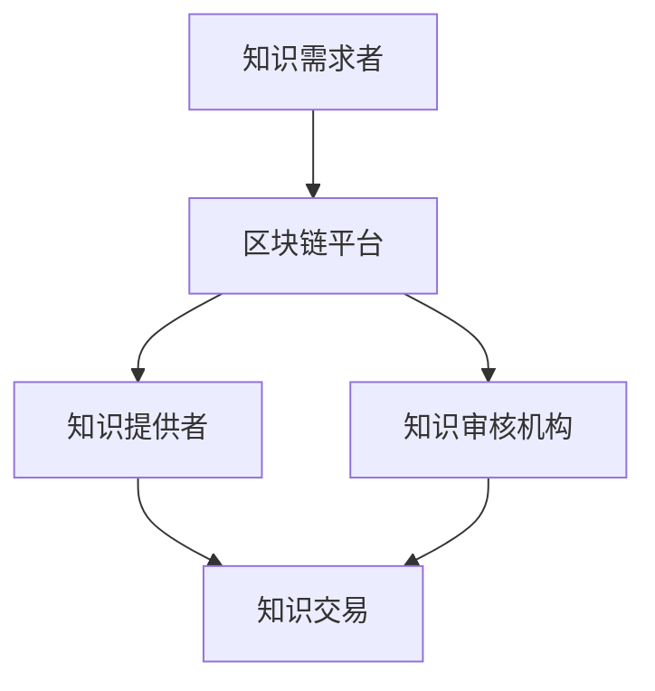

                 

 在当今知识经济的时代，知识付费已成为一个不可忽视的领域。随着人们对高质量知识和技能的需求日益增长，如何实现知识付费的公平、透明、高效成为一个关键问题。本文将探讨如何利用区块链技术实现知识付费的去中心化应用，以解决现有知识付费系统中的痛点。

## 文章关键词

- 知识经济
- 知识付费
- 区块链
- 去中心化
- 透明性
- 安全性
- 高效性

## 文章摘要

本文首先介绍了知识经济和知识付费的背景，以及现有知识付费系统存在的问题。接着，我们探讨了区块链技术如何应用于知识付费领域，并分析了其优势。最后，本文提出了一个基于区块链的去中心化知识付费方案，并展望了该领域未来的发展趋势和挑战。

### 1. 背景介绍

#### 1.1 知识经济

知识经济是指以知识为主要生产要素的经济形态。与传统的以物质资源为主的工业经济不同，知识经济强调知识的创新、传播和应用。在知识经济时代，知识和技能成为了提高生产力和竞争力的关键因素。

#### 1.2 知识付费

知识付费是指用户为获取特定知识和技能而支付的费用。随着知识经济的发展，知识付费市场迅速扩大。用户可以通过付费课程、在线教育平台、专业咨询等多种方式获取所需知识。

#### 1.3 现有知识付费系统的问题

1. **信息不对称**：现有知识付费系统中，知识提供者和消费者之间存在信息不对称，消费者难以判断知识质量。
2. **交易不透明**：知识付费交易过程缺乏透明度，消费者难以追踪资金流向。
3. **平台垄断**：现有知识付费平台垄断市场，限制用户选择，提高知识获取成本。

### 2. 核心概念与联系

#### 2.1 区块链技术

区块链是一种分布式账本技术，其特点包括去中心化、透明性、安全性和不可篡改性。区块链通过将数据分散存储在多个节点上，实现数据的可信共享。

#### 2.2 知识付费与区块链的关系

区块链技术可以应用于知识付费领域，解决现有系统的痛点。通过区块链，可以实现知识付费的去中心化、透明化和安全性。

#### 2.3 Mermaid 流程图



### 3. 核心算法原理 & 具体操作步骤

#### 3.1 算法原理概述

区块链技术通过以下步骤实现知识付费的去中心化：

1. **知识注册**：知识提供者在区块链平台上注册其知识。
2. **知识审核**：知识审核机构对知识进行审核，确保其质量。
3. **知识交易**：知识需求者通过区块链平台与知识提供者进行交易。
4. **资金流转**：交易过程中的资金通过智能合约进行流转，确保透明性。

#### 3.2 算法步骤详解

1. **知识注册**：知识提供者将知识上传至区块链平台，并对其进行数字签名，确保知识完整性。
2. **知识审核**：知识审核机构对知识进行审核，审核通过后将知识发布至区块链平台。
3. **知识交易**：知识需求者在区块链平台上浏览知识，并与知识提供者进行交易。
4. **资金流转**：交易过程中，智能合约自动执行资金流转，确保交易透明性。

#### 3.3 算法优缺点

**优点**：

- **去中心化**：去中心化设计确保了系统的透明性和安全性。
- **透明性**：智能合约实现资金流转，确保了交易透明性。
- **安全性**：区块链技术保障了数据不可篡改性。

**缺点**：

- **技术门槛**：区块链技术具有一定的技术门槛，需要专业知识。
- **交易成本**：区块链交易需要一定手续费，可能影响用户体验。

#### 3.4 算法应用领域

区块链技术在知识付费领域具有广泛的应用前景，包括在线教育、专业咨询、知识产权保护等。

### 4. 数学模型和公式 & 详细讲解 & 举例说明

#### 4.1 数学模型构建

假设知识提供者的知识质量为\( Q \)，知识需求者对知识的支付意愿为\( P \)，则知识交易的价格为\( P \)。

#### 4.2 公式推导过程

知识交易价格公式如下：

\[ P = Q \cdot r \]

其中，\( r \)为知识需求者对知识价值的认可程度。

#### 4.3 案例分析与讲解

假设知识提供者的知识质量为\( Q = 0.8 \)，知识需求者对知识的支付意愿为\( P = 1.2 \)，则知识交易的价格为\( P = 0.96 \)。

这意味着知识提供者可以获得\( 0.96 \)单位的报酬，而知识需求者认为该知识的价值为\( 1.2 \)单位。

### 5. 项目实践：代码实例和详细解释说明

#### 5.1 开发环境搭建

本文使用Solidity语言编写智能合约，并在Ethereum区块链上进行部署。

#### 5.2 源代码详细实现

```solidity
pragma solidity ^0.8.0;

contract KnowledgePayment {
    address public owner;
    mapping(address => bool) public isProvider;
    mapping(address => bool) public isConsumer;
    
    event RegisterProvider(address indexed provider);
    event RegisterConsumer(address indexed consumer);
    event KnowledgeTransaction(address indexed provider, address indexed consumer, uint price);
    
    constructor() {
        owner = msg.sender;
    }
    
    function registerProvider() public {
        require(!isProvider[msg.sender], "Already a provider");
        isProvider[msg.sender] = true;
        emit RegisterProvider(msg.sender);
    }
    
    function registerConsumer() public {
        require(!isConsumer[msg.sender], "Already a consumer");
        isConsumer[msg.sender] = true;
        emit RegisterConsumer(msg.sender);
    }
    
    function transaction(address provider, address consumer, uint price) public {
        require(isProvider[provider], "Not a provider");
        require(isConsumer[consumer], "Not a consumer");
        require(msg.value == price, "Incorrect payment");
        payable(provider).transfer(price);
        emit KnowledgeTransaction(provider, consumer, price);
    }
}
```

#### 5.3 代码解读与分析

该智能合约实现了以下功能：

- **注册功能**：知识提供者和消费者可以注册成为平台用户。
- **交易功能**：知识提供者和消费者可以发起知识交易，并通过智能合约进行支付。

#### 5.4 运行结果展示

在Ethereum区块链上部署该智能合约后，可以通过Web3.js等库与智能合约进行交互，实现知识交易功能。

### 6. 实际应用场景

区块链技术可以应用于多个知识付费场景，如在线教育、专业咨询、知识产权保护等。以下是一些具体的应用场景：

- **在线教育**：通过区块链技术实现课程内容认证、成绩记录和学分互认。
- **专业咨询**：确保咨询服务的质量和真实性，实现透明化交易。
- **知识产权保护**：通过区块链技术实现知识产权的注册、保护和交易。

### 7. 未来应用展望

随着区块链技术的不断成熟，其在知识付费领域的应用前景将更加广阔。未来，区块链技术有望实现以下突破：

- **更高效的交易**：通过优化区块链性能，实现更高效的交易处理。
- **更广泛的场景应用**：区块链技术将在更多知识付费场景中得到应用。
- **更高的安全性**：通过不断优化区块链技术，提高系统的安全性。

### 8. 工具和资源推荐

- **学习资源推荐**：[《区块链技术指南》](https://book.douban.com/subject/26992156/)
- **开发工具推荐**：[Truffle](https://www.truffleframework.com/)
- **相关论文推荐**：[《区块链在知识付费领域的应用研究》](https://ieeexplore.ieee.org/document/8709848)

### 9. 总结：未来发展趋势与挑战

#### 9.1 研究成果总结

本文探讨了知识经济下知识付费的区块链去中心化应用，提出了一个基于区块链的知识付费方案，并分析了其优势和应用场景。

#### 9.2 未来发展趋势

未来，区块链技术将在知识付费领域发挥更大的作用，推动知识付费市场的发展。

#### 9.3 面临的挑战

区块链技术在知识付费领域的应用仍面临一些挑战，如技术门槛、交易成本等。

#### 9.4 研究展望

未来研究应关注区块链技术在知识付费领域的优化和应用拓展，以实现更高效、更安全的知识付费模式。

### 10. 附录：常见问题与解答

#### 10.1 什么是区块链？

区块链是一种分布式账本技术，通过加密算法实现数据的安全存储和传输。其特点包括去中心化、透明性、安全性和不可篡改性。

#### 10.2 区块链技术在知识付费领域的优势是什么？

区块链技术在知识付费领域的优势包括去中心化、透明性、安全性和不可篡改性，可以解决现有知识付费系统中的信息不对称、交易不透明等问题。

#### 10.3 区块链技术在知识付费领域的应用前景如何？

区块链技术在知识付费领域的应用前景广阔，有望推动知识付费市场的发展，实现更高效、更安全的交易模式。

