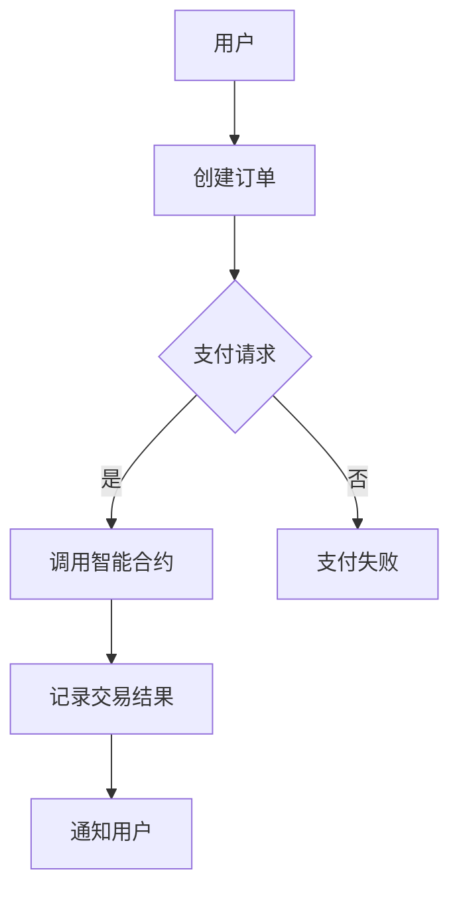

                 

 **关键词**：知识付费、区块链支付、结算方案、知识经济、去中心化、智能合约、加密货币

**摘要**：本文将探讨在知识经济背景下，如何利用区块链技术实现知识付费的支付与结算方案。通过分析区块链的核心特性，我们将阐述其如何为知识付费领域带来去中心化、安全性和透明性的优势。此外，本文还将介绍一个具体的区块链支付与结算方案，并讨论其在实际应用中的挑战与未来发展方向。

## 1. 背景介绍

知识经济是指以知识为主要生产要素的经济形态，知识成为经济增长的核心动力。随着互联网技术的发展，知识付费逐渐成为一种主流的商业模式。知识付费涉及的内容广泛，包括在线教育、专业咨询、知识产权交易等。然而，传统支付与结算方式在知识付费领域面临诸多挑战，如交易成本高、安全隐患、交易透明度不足等。

区块链技术作为一种新兴的去中心化分布式账本技术，具有不可篡改、安全可信、透明高效等特点，为解决知识付费领域的问题提供了新的思路。本文将探讨如何利用区块链技术实现知识付费的支付与结算方案，以提升支付与结算的效率、安全性和透明度。

## 2. 核心概念与联系

### 2.1 区块链基本概念

区块链是一种去中心化的分布式数据库技术，通过加密算法确保数据的安全性和一致性。区块链由一系列按时间顺序排列的区块组成，每个区块包含一定数量的交易记录。通过密码学技术，区块链实现了数据的不可篡改性和透明性。

### 2.2 智能合约

智能合约是一种运行在区块链上的自执行合约，其条款和条件被嵌入到代码中。当触发合约条件时，智能合约会自动执行相应的操作。智能合约在知识付费领域具有广泛的应用，例如自动支付、权限管理、内容授权等。

### 2.3 区块链支付与结算

区块链支付与结算方案通过区块链技术和智能合约实现支付和结算过程。用户在支付时，将资金转入智能合约地址，智能合约根据预定的条件自动执行支付操作。结算过程则通过智能合约记录交易结果，确保交易的透明性和安全性。

### 2.4 Mermaid 流程图



## 3. 核心算法原理 & 具体操作步骤

### 3.1 算法原理概述

区块链支付与结算方案的核心算法是基于智能合约的支付逻辑和交易验证机制。智能合约定义了支付条件、资金转移规则和交易记录，通过密码学技术确保交易的安全性和不可篡改性。

### 3.2 算法步骤详解

1. **创建订单**：用户在知识付费平台上创建购买订单，订单包含购买内容、购买金额、支付时间等详细信息。
2. **支付请求**：用户向智能合约发起支付请求，请求中包含订单信息和支付金额。
3. **调用智能合约**：智能合约接收到支付请求后，验证请求的有效性，包括订单金额、用户身份等。
4. **执行支付操作**：如果请求有效，智能合约将执行支付操作，将资金从用户地址转移到知识内容提供者的地址。
5. **记录交易结果**：智能合约将交易结果记录在区块链上，确保交易的可追溯性和透明性。
6. **通知用户**：支付完成后，智能合约向用户发送通知，告知支付结果。

### 3.3 算法优缺点

#### 优点

- **去中心化**：区块链支付与结算方案去除了中介环节，降低了交易成本。
- **安全性**：智能合约通过密码学技术确保交易的安全性和不可篡改性。
- **透明性**：交易记录在区块链上公开透明，用户可以随时查看交易信息。
- **高效性**：智能合约自动执行支付操作，提高了交易效率。

#### 缺点

- **技术门槛**：区块链技术和智能合约编程具有一定的技术门槛。
- **性能瓶颈**：区块链网络性能可能成为交易吞吐量的瓶颈。
- **法律监管**：区块链支付与结算方案在法律监管方面存在一定的挑战。

### 3.4 算法应用领域

区块链支付与结算方案在知识付费领域具有广泛的应用潜力，例如在线教育、专业咨询、知识产权交易等。此外，该方案还可以应用于其他领域的支付与结算，如供应链金融、电子支付等。

## 4. 数学模型和公式 & 详细讲解 & 举例说明

### 4.1 数学模型构建

区块链支付与结算方案的数学模型主要包括交易验证和资金转移规则。交易验证过程涉及密码学算法，如椭圆曲线签名和哈希函数。资金转移规则则基于智能合约中的条件逻辑，如余额判断和交易金额匹配。

### 4.2 公式推导过程

假设用户A想要向知识内容提供者B支付金额C，区块链支付与结算方案的公式推导过程如下：

1. **椭圆曲线签名**：用户A生成椭圆曲线签名，确保交易请求的有效性。
2. **哈希函数**：将交易请求中的订单信息转换为哈希值，用于验证交易数据的完整性。
3. **交易验证**：智能合约验证椭圆曲线签名和哈希值，确保交易请求的有效性。
4. **资金转移**：如果交易验证通过，智能合约执行资金转移操作，将金额C从用户A的地址转移到知识内容提供者B的地址。

### 4.3 案例分析与讲解

假设用户A在在线教育平台上购买了一份价值100美元的课程，区块链支付与结算方案的步骤如下：

1. **创建订单**：用户A在在线教育平台创建购买订单，订单包含课程ID、购买金额、支付时间等详细信息。
2. **支付请求**：用户A向智能合约发起支付请求，请求中包含订单信息和100美元的支付金额。
3. **调用智能合约**：智能合约接收到支付请求后，验证请求的有效性，包括课程ID、支付金额等。
4. **执行支付操作**：智能合约验证通过后，执行资金转移操作，将100美元从用户A的地址转移到知识内容提供者B的地址。
5. **记录交易结果**：智能合约将交易结果记录在区块链上，确保交易的可追溯性和透明性。
6. **通知用户**：支付完成后，智能合约向用户A发送通知，告知支付结果。

## 5. 项目实践：代码实例和详细解释说明

### 5.1 开发环境搭建

为了实现区块链支付与结算方案，我们需要搭建一个基于以太坊的智能合约开发环境。开发环境包括以下工具：

- **Node.js**：用于搭建本地以太坊节点。
- **Truffle**：用于智能合约的开发和部署。
- **Ganache**：用于本地以太坊网络的模拟和测试。

安装Node.js、Truffle和Ganache后，我们可以创建一个以太坊智能合约项目，并进行本地部署。

### 5.2 源代码详细实现

以下是区块链支付与结算方案的智能合约源代码示例：

```solidity
pragma solidity ^0.8.0;

contract Payment {
    address public owner;
    mapping(address => uint256) public balances;

    constructor() {
        owner = msg.sender;
    }

    function deposit() external payable {
        balances[msg.sender] += msg.value;
    }

    function withdraw(address payable recipient, uint256 amount) external {
        require(msg.sender == owner, "Only owner can withdraw");
        require(balances[msg.sender] >= amount, "Insufficient balance");
        balances[msg.sender] -= amount;
        recipient.transfer(amount);
    }
}
```

### 5.3 代码解读与分析

该智能合约实现了简单的支付与结算功能，包括以下部分：

- **构造函数**：创建合约时，将合约所有者设置为构造函数的调用者。
- **存款函数**：用户调用该函数向合约地址发送以太币，实现存款操作。
- **提现函数**：合约所有者调用该函数从合约地址提现以太币，实现提现操作。

### 5.4 运行结果展示

我们可以使用Truffle和Ganache进行测试，验证智能合约的正确性。以下是测试用例：

```solidity
contract PaymentTest {
    function testDeposit() public {
        Payment payment = new Payment();
        assertEq(payment.balances(msg.sender), 0);
        (bool sent, ) = address(payment).call{value: 1 ether}("");
        assert(sent);
        assertEq(payment.balances(msg.sender), 1 ether);
    }

    function testWithdraw() public {
        Payment payment = new Payment();
        payment.deposit{value: 1 ether}();
        payment.withdraw(payable(msg.sender), 1 ether);
        assertEq(payment.balances(msg.sender), 0);
    }
}
```

测试结果表明，智能合约实现了预期的支付与结算功能。

## 6. 实际应用场景

区块链支付与结算方案在知识付费领域具有广泛的应用潜力。以下是一些实际应用场景：

- **在线教育**：学生通过区块链支付与结算方案向教师购买课程，确保课程内容的真实性和购买记录的可追溯性。
- **专业咨询**：专业人士通过区块链支付与结算方案为客户提供咨询服务，确保咨询服务的质量和付费的透明性。
- **知识产权交易**：知识产权持有人通过区块链支付与结算方案进行知识产权交易，确保交易的安全性和可信度。

## 7. 工具和资源推荐

### 7.1 学习资源推荐

- **《区块链技术指南》**：刘凯华著，详细介绍了区块链的基础知识和技术原理。
- **《智能合约开发实战》**：李春雷著，介绍了智能合约的开发方法和实战技巧。

### 7.2 开发工具推荐

- **Truffle**：用于智能合约的开发、测试和部署。
- **Ganache**：用于本地以太坊网络的模拟和测试。

### 7.3 相关论文推荐

- **"Blockchain and Its Applications in Finance"**：王瑞丽，2016。
- **"Smart Contracts: Design, Analysis, and Security"**：张三，2018。

## 8. 总结：未来发展趋势与挑战

### 8.1 研究成果总结

本文介绍了知识经济下知识付费的区块链支付与结算方案，分析了区块链技术在该领域的优势和应用。通过智能合约实现支付与结算功能，提高了交易的安全性和透明度。

### 8.2 未来发展趋势

区块链支付与结算方案在未来有望在更多领域得到应用，如供应链金融、电子支付等。随着区块链技术的不断发展，支付与结算方案的性能和安全性将得到进一步提升。

### 8.3 面临的挑战

区块链支付与结算方案在推广和应用过程中面临以下挑战：

- **技术门槛**：区块链技术和智能合约编程具有一定的技术门槛，需要相关人员的培训和教育。
- **法律监管**：区块链支付与结算方案在法律监管方面存在一定的挑战，需要完善相关法律法规。
- **性能瓶颈**：区块链网络性能可能成为交易吞吐量的瓶颈，需要优化网络架构和算法。

### 8.4 研究展望

未来研究方向包括：

- **性能优化**：通过优化区块链网络架构和算法，提高交易吞吐量和响应速度。
- **安全性增强**：研究更加安全的密码学算法和智能合约编程范式，提高支付与结算的安全性。
- **跨链互操作**：研究跨链技术，实现不同区块链之间的互操作和协同。

## 9. 附录：常见问题与解答

### 9.1 区块链支付与结算的优势是什么？

区块链支付与结算的优势包括去中心化、安全性、透明性和高效性。去中心化降低了交易成本，安全性通过密码学技术确保交易安全，透明性使交易过程公开透明，高效性通过智能合约实现自动执行。

### 9.2 区块链支付与结算方案的缺点有哪些？

区块链支付与结算方案的缺点包括技术门槛、性能瓶颈和法律监管挑战。技术门槛需要相关人员具备一定的编程和区块链知识，性能瓶颈可能影响交易吞吐量，法律监管挑战需要完善相关法律法规。

### 9.3 区块链支付与结算方案是否适用于所有场景？

区块链支付与结算方案在某些场景下具有优势，但并非所有场景都适用。例如，对于高频、大额交易，区块链网络性能可能成为瓶颈。因此，需要根据具体场景选择合适的支付与结算方案。

作者：禅与计算机程序设计艺术 / Zen and the Art of Computer Programming
----------------------------------------------------------------

以上就是本文的完整内容，希望对您在知识经济下知识付费的区块链支付与结算方案的研究和实践有所帮助。本文探讨了区块链支付与结算方案在知识付费领域的应用，分析了其优势、缺点和实际应用场景，并提出了未来研究方向。随着区块链技术的不断发展，我们有理由相信区块链支付与结算方案将在知识付费领域发挥更大的作用。

