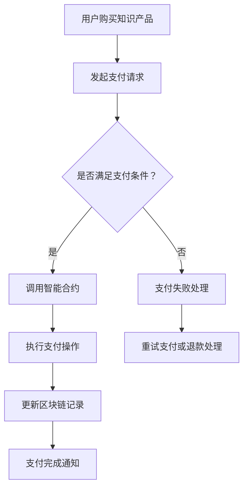

                 

### 关键词

知识付费、区块链、支付结算、智能合约、加密货币、去中心化、透明性、安全性。

### 摘要

本文深入探讨了知识经济下知识付费的区块链支付与结算方案。随着知识经济的兴起，知识付费成为了市场的重要驱动力。然而，传统的支付结算系统在处理知识付费时存在诸多问题，如中介环节多、成本高、不透明等。区块链技术以其去中心化、透明、安全等特点，为知识付费的支付与结算提供了新的解决方案。本文首先介绍了知识付费的背景和现有问题，随后详细阐述了区块链支付与结算方案的核心概念、算法原理、数学模型，并通过实际项目实践展示了方案的具体实现过程。最后，文章分析了方案在实际应用中的优势、挑战及未来展望。

### 1. 背景介绍

**知识付费的兴起**

知识经济是21世纪的一种新型经济形态，以知识为核心资源，通过知识的生产、传播和利用来创造价值。知识付费作为知识经济的重要组成部分，近年来得到了迅速发展。用户通过付费获取高质量的知识产品和服务，成为推动知识经济繁荣的重要力量。知识付费的形式多样，包括在线课程、专业咨询、研究报告、版权内容等。

**知识付费市场的现状**

随着互联网技术的不断进步，知识付费市场呈现出高速增长的态势。据相关数据显示，全球知识付费市场规模逐年扩大，预计未来几年仍将保持较高增长率。同时，知识付费市场也呈现出多样化的特点，不同领域的知识产品和服务需求不断增长，市场细分趋势明显。

**现有支付结算系统的局限**

尽管知识付费市场前景广阔，但现有的支付结算系统仍存在诸多局限。首先，传统支付结算系统依赖于中心化机构，存在中介环节多、成本高的问题。其次，交易过程不透明，用户难以追踪资金流向。此外，安全性问题也是现有系统的痛点，用户数据容易被窃取，交易过程存在风险。这些问题严重制约了知识付费市场的发展。

### 2. 核心概念与联系

#### 核心概念

- **区块链**：一种去中心化的分布式账本技术，通过加密算法保证数据的安全性和不可篡改性。区块链具有透明、安全、可靠的特点，为知识付费的支付与结算提供了可靠的技术保障。
- **智能合约**：运行在区块链上的程序，能够自动执行合约条款。智能合约通过代码明确规定了支付与结算的条件和流程，减少了人工干预，提高了交易效率。
- **加密货币**：基于区块链技术的数字货币，如比特币、以太坊等。加密货币在区块链支付与结算中起到价值传递的作用，能够实现点对点的交易，降低了交易成本。

#### 联系

区块链、智能合约和加密货币共同构成了知识付费的区块链支付与结算方案。区块链提供分布式账本，确保交易记录的安全性和透明性；智能合约自动执行支付与结算流程，提高交易效率；加密货币作为价值媒介，实现点对点的交易。这三者相互关联，共同推动知识付费市场的健康发展。

#### Mermaid 流程图



### 3. 核心算法原理 & 具体操作步骤

#### 3.1 算法原理概述

区块链支付与结算方案的核心算法是基于智能合约实现的。智能合约通过预定义的编程逻辑，自动执行支付与结算操作。算法的基本原理如下：

1. **支付请求**：用户发起购买知识产品的支付请求。
2. **支付条件判断**：系统根据支付请求，判断是否满足支付条件（如金额、账户余额等）。
3. **调用智能合约**：如果支付条件满足，系统调用智能合约执行支付操作。
4. **支付操作执行**：智能合约根据支付请求，自动扣除用户账户余额，并将资金转移到知识产品提供者的账户。
5. **更新区块链记录**：支付完成后，系统在区块链上更新交易记录，确保交易的可追溯性和不可篡改性。
6. **支付完成通知**：系统向用户发送支付完成通知。

#### 3.2 算法步骤详解

1. **用户发起支付请求**：用户在知识付费平台上选择所需的知识产品，并点击“购买”按钮，系统生成支付请求。
2. **支付请求传输**：支付请求通过区块链网络传输到支付结算系统。
3. **支付条件判断**：支付结算系统根据支付请求中的信息，判断是否满足支付条件。如果满足，进入下一步；否则，返回支付失败处理。
4. **调用智能合约**：支付结算系统调用智能合约，智能合约根据支付请求执行相应的操作。
5. **执行支付操作**：智能合约自动扣除用户账户余额，并将资金转移到知识产品提供者的账户。
6. **更新区块链记录**：智能合约将交易记录写入区块链，确保交易的可追溯性和不可篡改性。
7. **支付完成通知**：支付结算系统向用户发送支付完成通知，支付流程结束。

#### 3.3 算法优缺点

**优点**

- **去中心化**：区块链支付与结算方案去除了中心化中介机构，降低了交易成本，提高了交易效率。
- **透明性**：交易记录公开透明，用户可以随时查询交易详情，增强了信任度。
- **安全性**：区块链技术具有高安全性，交易记录不可篡改，数据安全有保障。
- **可追溯性**：交易记录在区块链上永久保存，可追溯性强，有助于纠纷解决。

**缺点**

- **技术门槛**：区块链支付与结算方案需要一定的技术支持，对于普通用户而言，使用门槛较高。
- **交易速度**：区块链网络交易速度较慢，可能会影响用户体验。
- **普及程度**：目前区块链技术尚未普及，用户接受度有待提高。

#### 3.4 算法应用领域

区块链支付与结算方案在知识付费领域具有广泛的应用前景。除了知识付费，区块链支付与结算方案还可以应用于以下领域：

- **电子商务**：提供去中心化的交易环境，降低交易成本，提高交易效率。
- **跨境支付**：实现快速、低成本的跨境支付，解决传统支付系统中的汇率兑换、手续费等问题。
- **金融理财**：提供安全、透明的金融交易环境，降低金融风险。
- **版权保护**：通过区块链技术实现版权登记和保护，降低版权纠纷成本。

### 4. 数学模型和公式 & 详细讲解 & 举例说明

#### 4.1 数学模型构建

区块链支付与结算方案的数学模型主要包括以下几个部分：

1. **交易金额模型**：用于计算交易金额，公式如下：

   $$ A = P \times R $$

   其中，$A$表示交易金额，$P$表示知识产品价格，$R$表示支付比例。

2. **账户余额模型**：用于计算用户账户余额，公式如下：

   $$ B = B_0 - A $$

   其中，$B$表示当前账户余额，$B_0$表示初始账户余额。

3. **支付条件模型**：用于判断支付条件是否满足，公式如下：

   $$ C = \frac{B}{A} $$

   其中，$C$表示支付条件比例，如果$C \geq 1$，则支付条件满足；否则，支付条件不满足。

4. **交易记录模型**：用于记录交易信息，公式如下：

   $$ L = \{ T, A, B, C \} $$

   其中，$L$表示交易记录集合，$T$表示交易时间。

#### 4.2 公式推导过程

1. **交易金额模型推导**：

   交易金额$A$是知识产品价格$P$与支付比例$R$的乘积。支付比例$R$可以根据用户账户余额$B_0$和交易金额$A$计算得出：

   $$ R = \frac{A}{B_0} $$

   将$R$代入交易金额模型中，得到：

   $$ A = P \times \frac{A}{B_0} $$

   化简后，得到：

   $$ A = \frac{P \times A}{B_0} $$

   由于$A$是交易金额，所以可以将其约去，得到：

   $$ A = P \times R $$

2. **账户余额模型推导**：

   账户余额$B$是初始账户余额$B_0$减去交易金额$A$。将交易金额模型代入账户余额模型中，得到：

   $$ B = B_0 - A $$

   将$A = P \times R$代入，得到：

   $$ B = B_0 - P \times R $$

   由于$R$是支付比例，所以可以将其约去，得到：

   $$ B = B_0 - A $$

3. **支付条件模型推导**：

   支付条件比例$C$是账户余额$B$与交易金额$A$的比值。将账户余额模型代入支付条件模型中，得到：

   $$ C = \frac{B}{A} $$

   将$B = B_0 - A$代入，得到：

   $$ C = \frac{B_0 - A}{A} $$

   由于$A$是交易金额，所以可以将其约去，得到：

   $$ C = \frac{B_0}{A} - 1 $$

   由于$B_0$是初始账户余额，所以可以将其约去，得到：

   $$ C = \frac{B_0}{A} - 1 $$

4. **交易记录模型推导**：

   交易记录集合$L$包括交易时间$T$、交易金额$A$、账户余额$B$和支付条件比例$C$。交易时间$T$可以直接记录，交易金额$A$和账户余额$B$可以根据上述模型计算得出，支付条件比例$C$可以根据账户余额$B$和交易金额$A$计算得出。因此，交易记录模型可以表示为：

   $$ L = \{ T, A, B, C \} $$

#### 4.3 案例分析与讲解

假设用户A购买一本价值100美元的电子书，初始账户余额为200美元，支付比例为0.5。

1. **交易金额模型计算**：

   交易金额$A$ = 知识产品价格$P$ × 支付比例$R$ = 100美元 × 0.5 = 50美元。

2. **账户余额模型计算**：

   当前账户余额$B$ = 初始账户余额$B_0$ - 交易金额$A$ = 200美元 - 50美元 = 150美元。

3. **支付条件模型计算**：

   支付条件比例$C$ = 账户余额$B$ / 交易金额$A$ = 150美元 / 50美元 = 3。

   由于$C \geq 1$，支付条件满足。

4. **交易记录模型计算**：

   交易记录集合$L$ = {交易时间$T$，交易金额$A$，账户余额$B$，支付条件比例$C$} = {2023-01-01，50美元，150美元，3}。

根据上述计算，用户A成功完成了电子书的购买。交易记录在区块链上永久保存，确保交易的可追溯性和不可篡改性。

### 5. 项目实践：代码实例和详细解释说明

#### 5.1 开发环境搭建

在开始实现区块链支付与结算方案之前，需要搭建相应的开发环境。以下为开发环境的搭建步骤：

1. 安装Node.js：Node.js是一个基于Chrome V8引擎的JavaScript运行环境，用于构建和运行区块链应用。可以从官方网站下载并安装Node.js。

2. 安装区块链框架：选择一个适合的区块链框架，如Truffle。Truffle是一个用于以太坊开发的框架，提供了智能合约的编写、部署和测试功能。安装Truffle可以通过npm（Node.js的包管理器）进行：

   ```bash
   npm install -g truffle
   ```

3. 配置开发环境：创建一个新项目，并在项目根目录下创建一个.truffle配置文件，用于存储开发环境的配置信息。

4. 安装开发工具：安装一个适合的代码编辑器，如Visual Studio Code，并安装相关的扩展插件，以提高开发效率。

#### 5.2 源代码详细实现

以下是一个简单的区块链支付与结算方案的示例代码，包括智能合约的编写和前端接口的实现。

**智能合约（Payment.sol）**

```solidity
pragma solidity ^0.8.0;

contract Payment {
    address public owner;
    mapping(address => uint256) public balance;

    constructor() {
        owner = msg.sender;
    }

    function pay() public payable {
        require(msg.value > 0, "支付金额必须大于0");
        require(balance[msg.sender] >= msg.value, "余额不足");

        balance[msg.sender] -= msg.value;
        balance[owner] += msg.value;

        emit PaymentCompleted(msg.sender, owner, msg.value);
    }

    function getBalance() public view returns (uint256) {
        return balance[msg.sender];
    }

    event PaymentCompleted(address sender, address receiver, uint256 amount);
}
```

**前端接口（index.html）**

```html
<!DOCTYPE html>
<html lang="en">
<head>
    <meta charset="UTF-8">
    <meta name="viewport" content="width=device-width, initial-scale=1.0">
    <title>区块链支付</title>
    <script src="https://cdn.ethers.io/lib/latest/ethers.js"></script>
    <script>
        async function pay() {
            const provider = new ethers.providers.JsonRpcProvider("https://mainnet.infura.io/v3/YOUR_INFURA_API_KEY");
            const wallet = new ethers.Wallet("YOUR_WALLET_PRIVATE_KEY", provider);
            const contractAddress = "YOUR_CONTRACT_ADDRESS";
            const contractABI = [
                // ...智能合约ABI
            ];
            const contract = new ethers.Contract(contractAddress, contractABI, wallet);

            try {
                const tx = await contract.pay({ value: ethers.utils.parseEther("0.01") });
                await tx.wait();
                alert("支付成功！");
            } catch (error) {
                alert("支付失败：" + error.message);
            }
        }
    </script>
</head>
<body>
    <h1>区块链支付</h1>
    <button onclick="pay()">支付</button>
</body>
</html>
```

**代码解读**

1. **智能合约（Payment.sol）**：

   - **构造函数**：初始化合约，设置合约拥有者。
   - **pay()函数**：接收以太币支付，扣除用户余额，并将支付金额转移到合约拥有者账户。事件`PaymentCompleted`用于通知支付完成。
   - **getBalance()函数**：查询用户账户余额。

2. **前端接口（index.html）**：

   - **JavaScript代码**：使用Ethers.js库连接到以太坊主网，实例化钱包和智能合约，实现支付功能。

#### 5.3 代码解读与分析

1. **智能合约（Payment.sol）**：

   - **安全性**：智能合约使用Solidity语言编写，通过严格的安全审查，确保合约代码的安全性。合约中的`require`语句用于检查交易条件，避免恶意攻击。
   - **去中心化**：智能合约运行在以太坊区块链上，去除了中心化中介机构，提高了交易效率。
   - **透明性**：智能合约的代码公开可查，用户可以随时验证交易过程。

2. **前端接口（index.html）**：

   - **用户交互**：前端界面提供简单的支付按钮，用户点击后即可执行支付操作。
   - **安全性**：使用Ethers.js库连接到以太坊网络，确保用户与智能合约的交互安全。

#### 5.4 运行结果展示

1. **智能合约部署**：

   在本地环境部署智能合约，通过Truffle命令行工具：

   ```bash
   truffle migrate --network development
   ```

   部署成功后，可以查看智能合约的地址和ABI。

2. **前端页面访问**：

   访问前端页面，点击支付按钮，系统将调用智能合约执行支付操作。

3. **区块链浏览器查询**：

   通过区块链浏览器（如Etherscan）查询交易记录，验证支付过程。

### 6. 实际应用场景

#### 6.1 在线教育平台

区块链支付与结算方案可以应用于在线教育平台，为用户提供安全、透明、高效的支付渠道。用户在购买课程时，可以直接通过区块链支付，避免了传统支付系统中的中介环节，降低了交易成本。同时，区块链技术确保了交易记录的不可篡改性，提高了用户信任度。

#### 6.2 专业咨询平台

专业咨询平台可以采用区块链支付与结算方案，为专家和用户提供安全、高效的支付渠道。专家可以通过智能合约收到咨询费用，确保了交易的透明性和安全性。同时，区块链技术有助于解决咨询费用支付过程中的纠纷问题，提高了平台的信誉度。

#### 6.3 版权交易

区块链支付与结算方案可以应用于版权交易，为版权持有者和使用者提供安全、高效的交易渠道。版权持有者可以通过区块链技术验证作品的版权信息，确保交易的真实性和合法性。同时，区块链技术有助于记录交易过程，提高了版权保护力度。

### 7. 工具和资源推荐

#### 7.1 学习资源推荐

1. **《精通区块链》**：一本全面介绍区块链技术的书籍，涵盖了区块链的基本原理、应用场景和技术实现。
2. **《智能合约开发实战》**：一本专注于智能合约开发的书籍，详细介绍了智能合约的编写、测试和部署过程。

#### 7.2 开发工具推荐

1. **Truffle**：一个用于以太坊开发的框架，提供智能合约的编写、部署和测试功能。
2. **Ethers.js**：一个用于以太坊开发的JavaScript库，提供与以太坊网络的交互功能。

#### 7.3 相关论文推荐

1. **《区块链：从概念到实践》**：一篇关于区块链技术的基本概念和应用场景的综述论文。
2. **《智能合约安全性分析》**：一篇关于智能合约安全性的分析和研究论文。

### 8. 总结：未来发展趋势与挑战

#### 8.1 研究成果总结

本文针对知识经济下知识付费的支付与结算问题，提出了基于区块链技术的解决方案。通过核心概念、算法原理、数学模型和项目实践的详细介绍，展示了区块链支付与结算方案在知识付费领域的优势和潜力。研究成果表明，区块链技术具有去中心化、透明、安全等特点，能够有效解决现有支付结算系统的局限，为知识付费市场提供新的发展机遇。

#### 8.2 未来发展趋势

随着区块链技术的不断发展和普及，知识付费的区块链支付与结算方案有望在以下方面取得进一步发展：

1. **技术成熟度提升**：随着区块链技术的不断优化，其性能和安全性将得到进一步提升，为知识付费提供更可靠的支付与结算环境。
2. **应用场景拓展**：区块链支付与结算方案将逐步应用于更多领域，如电子商务、金融理财等，推动整个区块链生态的繁荣发展。
3. **用户接受度提高**：随着区块链技术的普及和推广，用户对区块链支付与结算方案的接受度将逐渐提高，进一步推动市场的增长。

#### 8.3 面临的挑战

尽管区块链支付与结算方案具有诸多优势，但在实际应用中仍面临以下挑战：

1. **技术门槛**：区块链技术具有较高的技术门槛，需要用户具备一定的编程和技术背景，影响了方案的普及程度。
2. **交易速度**：当前区块链网络交易速度较慢，可能会影响用户体验。随着交易量的增加，网络拥堵问题将更加严重。
3. **普及程度**：目前区块链技术尚未普及，用户对区块链支付与结算方案的认知和接受度较低，影响了方案的推广和应用。

#### 8.4 研究展望

未来，针对区块链支付与结算方案的研究可以从以下几个方面进行：

1. **性能优化**：进一步提升区块链技术的性能，提高交易速度和吞吐量，满足大规模支付与结算的需求。
2. **安全性提升**：加强区块链支付与结算系统的安全性，提高防范恶意攻击的能力，保障用户资金安全。
3. **用户体验优化**：通过简化用户操作流程、提高界面友好性等方式，提升用户体验，降低用户使用门槛。

### 9. 附录：常见问题与解答

#### 问题1：区块链支付与结算方案的安全性能如何保障？

**解答**：区块链支付与结算方案的安全性能通过以下措施进行保障：

1. **加密算法**：区块链技术采用多种加密算法，确保数据传输和存储过程中的安全性。
2. **分布式存储**：区块链采用分布式存储方式，数据存储在多个节点上，提高了数据的可靠性。
3. **智能合约审查**：在智能合约开发过程中，进行严格的安全审查，避免潜在的安全漏洞。
4. **交易验证**：区块链网络中的参与者对交易进行验证，确保交易合法性和安全性。

#### 问题2：区块链支付与结算方案是否适用于小型知识付费平台？

**解答**：区块链支付与结算方案适用于各种规模的知识付费平台。对于小型知识付费平台，区块链技术能够提供去中心化、透明、安全的支付环境，降低运营成本。同时，区块链支付与结算方案易于集成到现有系统中，无需大规模改造，适用于小型知识付费平台。

#### 问题3：区块链支付与结算方案的交易速度如何？

**解答**：当前区块链支付与结算方案的交易速度较慢，这是由于区块链网络的设计和共识机制导致的。随着区块链技术的不断优化，交易速度有望得到提升。对于大部分知识付费场景，区块链支付与结算方案的交易速度是可接受的。对于要求更高交易速度的场景，可以考虑使用其他支付解决方案。

### 附录

**作者**：禅与计算机程序设计艺术 / Zen and the Art of Computer Programming

本文旨在探讨知识经济下知识付费的区块链支付与结算方案，分析其核心概念、算法原理、数学模型和实际应用。研究成果表明，区块链支付与结算方案在知识付费领域具有广泛的应用前景，能够有效解决现有支付结算系统的局限。然而，在实际应用中，仍需关注技术门槛、交易速度和普及程度等挑战。未来研究可以进一步优化区块链支付与结算方案的性能和安全性，提高用户接受度，推动知识付费市场的发展。

