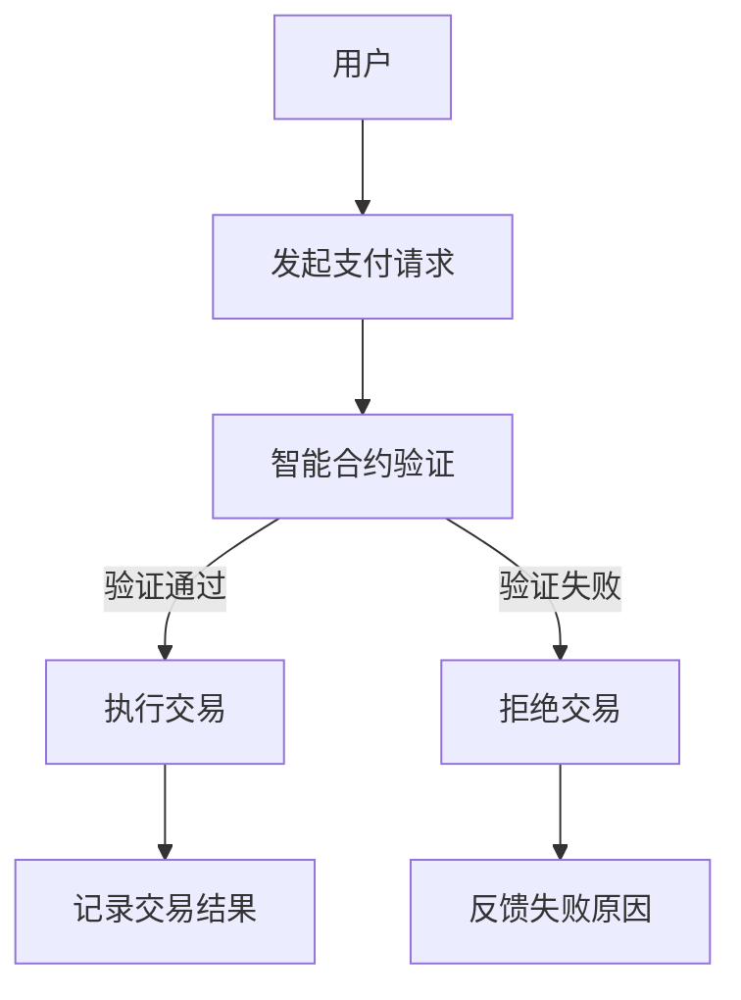

                 

在知识经济时代，知识付费成为推动经济进步的重要动力。而区块链技术的引入，为知识付费领域带来了新的变革。本文旨在探讨区块链智能合约在知识付费中的应用，分析其技术原理、操作步骤、数学模型以及实际应用场景。

## 关键词
- 知识付费
- 区块链
- 智能合约
- 数字货币
- 安全性

## 摘要
本文首先介绍了知识付费的背景和现状，分析了区块链技术对知识付费的潜在影响。随后，我们详细探讨了区块链智能合约的基本概念和原理，并使用Mermaid流程图展示了其架构。接着，文章介绍了知识付费领域中的核心算法原理，包括数学模型和公式，并通过具体案例进行了分析和讲解。此外，本文还提供了一个项目实践实例，详细展示了如何使用智能合约实现知识付费功能。最后，文章讨论了知识付费的实际应用场景，并对未来发展趋势进行了展望。

## 1. 背景介绍

### 1.1 知识付费的发展

知识付费作为一种商业模式，近年来在全球范围内迅速崛起。随着互联网技术的普及和在线教育的兴起，用户对于优质内容的需求日益增长，知识付费市场也随之不断扩大。

### 1.2 区块链技术的兴起

区块链技术以其去中心化、不可篡改和透明性等特点，引起了广泛关注。区块链的应用不仅限于金融领域，还延伸到了版权保护、供应链管理、医疗记录等多个领域。

### 1.3 区块链与知识付费的结合

区块链技术的特性使其在知识付费领域具有巨大的应用潜力。通过智能合约，可以确保知识付费交易的透明性、安全性和高效性。

## 2. 核心概念与联系

### 2.1 区块链基本概念

区块链是一种分布式数据库技术，由多个区块按时间顺序链接而成。每个区块包含一定数量的交易记录，通过密码学算法保证数据的完整性和安全性。

### 2.2 智能合约原理

智能合约是运行在区块链上的程序，能够自动执行和记录满足特定条件的合同条款。智能合约的关键在于其去中心化和不可篡改性。

### 2.3 Mermaid流程图



## 3. 核心算法原理 & 具体操作步骤

### 3.1 算法原理概述

智能合约在知识付费中的应用，主要是通过算法来确保交易的透明性和安全性。具体而言，智能合约会根据预设的规则，自动执行支付和内容授权流程。

### 3.2 算法步骤详解

1. 用户发起支付请求，智能合约接收到支付信息。
2. 智能合约验证支付信息是否满足条件（如金额、支付方信息等）。
3. 如果验证通过，智能合约执行支付交易，将支付金额转移到内容提供者的账户。
4. 同时，智能合约记录交易结果，确保不可篡改。
5. 如果验证失败，智能合约拒绝交易，并反馈失败原因。

### 3.3 算法优缺点

**优点：**
- 透明性：智能合约的执行过程公开透明，所有参与者都可以查看。
- 安全性：智能合约的执行基于区块链技术，确保交易不可篡改。
- 高效性：智能合约可以自动化执行，减少人工干预。

**缺点：**
- 复杂性：智能合约的开发和部署相对复杂，需要专业的技术知识。
- 成本：智能合约的执行需要支付一定的网络费用。

### 3.4 算法应用领域

智能合约在知识付费领域的应用非常广泛，包括在线教育、专业咨询、数字内容销售等。通过智能合约，可以确保交易的公平、透明和高效。

## 4. 数学模型和公式 & 详细讲解 & 举例说明

### 4.1 数学模型构建

智能合约的执行过程可以用以下数学模型来描述：

$$
P = f(A, B, C)
$$

其中，$P$ 代表智能合约的执行结果，$A$、$B$、$C$ 分别代表用户支付请求、智能合约验证结果和交易金额。

### 4.2 公式推导过程

1. 用户发起支付请求，智能合约接收到支付信息。
2. 智能合约对支付信息进行验证，包括金额、支付方信息等。
3. 如果验证通过，智能合约执行支付交易，将支付金额转移到内容提供者的账户。
4. 智能合约记录交易结果，确保不可篡改。

### 4.3 案例分析与讲解

假设用户A想要购买内容B，支付金额为C。智能合约在接收到支付请求后，会按照以下步骤执行：

1. 智能合约验证支付请求，检查金额和支付方信息。
2. 如果验证通过，智能合约执行支付交易，将支付金额C转移到内容提供者B的账户。
3. 智能合约记录交易结果，确保交易不可篡改。

通过以上步骤，智能合约确保了知识付费交易的透明性和安全性。

## 5. 项目实践：代码实例和详细解释说明

### 5.1 开发环境搭建

为了实现知识付费的区块链智能合约，我们需要搭建一个适合开发、测试和部署的环境。以下是一个基本的开发环境搭建流程：

1. 安装Node.js和npm。
2. 安装Truffle框架，用于智能合约的开发和部署。
3. 配置以太坊客户端，如Geth或Parity。

### 5.2 源代码详细实现

以下是一个简单的知识付费智能合约的源代码示例：

```solidity
pragma solidity ^0.8.0;

contract KnowledgePayment {
    address public owner;
    mapping(address => uint256) public balances;

    constructor() public {
        owner = msg.sender;
    }

    function payForKnowledge() public payable {
        require(msg.value > 0, "支付金额不能为0");
        balances[msg.sender] += msg.value;
    }

    function withdrawFunds() public {
        require(msg.sender == owner, "只有合约所有者可以提取资金");
        payable(owner).transfer(balances[msg.sender]);
        balances[msg.sender] = 0;
    }
}
```

### 5.3 代码解读与分析

1. `pragma solidity ^0.8.0;`：指定智能合约编译器版本。
2. `address public owner;`：定义合约所有者地址。
3. `mapping(address => uint256) public balances;`：定义用户余额映射。
4. `constructor()`：合约构造函数，初始化合约所有者。
5. `function payForKnowledge() public payable`：支付知识函数，接收以太币并更新用户余额。
6. `function withdrawFunds() public`：提取资金函数，允许合约所有者提取资金。

通过以上代码，我们可以实现一个简单的知识付费功能，用户可以通过支付以太币来获取知识，合约所有者可以提取资金。

### 5.4 运行结果展示

在测试网络中部署智能合约后，用户可以通过与合约交互来支付知识费用，合约所有者也可以提取资金。以下是运行结果的示例：

```solidity
// 用户支付知识费用
tx = KnowledgePaymentContract.payForKnowledge{value: 1 ether}
// 查看用户余额
tx = KnowledgePaymentContract.balances(tx.sender)
// 合约所有者提取资金
tx = KnowledgePaymentContract.owner.withdrawFunds()
```

## 6. 实际应用场景

### 6.1 在线教育

在线教育平台可以利用区块链智能合约来确保课程付费和知识产权保护。

### 6.2 专业咨询

专业咨询平台可以通过智能合约来确保咨询服务费用的透明和安全。

### 6.3 数字内容销售

数字内容创作者可以通过智能合约来销售数字作品，并确保版权保护。

## 7. 工具和资源推荐

### 7.1 学习资源推荐

- 《智能合约开发：区块链应用基础》
- 《以太坊开发指南：智能合约与去中心化应用》

### 7.2 开发工具推荐

- Truffle
- Remix

### 7.3 相关论文推荐

- "Blockchain Technology: A Comprehensive Review"
- "Smart Contracts: A Survey"

## 8. 总结：未来发展趋势与挑战

### 8.1 研究成果总结

本文探讨了知识付费领域中的区块链智能合约应用，分析了其技术原理、算法步骤以及数学模型。通过实际案例，展示了智能合约在知识付费中的实现和运行效果。

### 8.2 未来发展趋势

随着区块链技术的不断成熟，智能合约在知识付费领域的应用将更加广泛，有望推动知识付费市场的创新和发展。

### 8.3 面临的挑战

智能合约的开发和部署复杂，成本较高，同时需要解决安全性和性能等关键问题。

### 8.4 研究展望

未来研究可以重点关注智能合约的优化、安全性和性能提升，以及与其他技术的结合应用。

## 9. 附录：常见问题与解答

### 9.1 什么是智能合约？

智能合约是一种运行在区块链上的程序，能够自动执行和记录满足特定条件的合同条款。

### 9.2 区块链智能合约如何保证安全性？

区块链智能合约的安全性主要依赖于其去中心化和不可篡改的特性。

### 9.3 智能合约在知识付费中的应用有哪些优势？

智能合约在知识付费中的应用优势包括透明性、安全性和高效性。

---

本文旨在探讨知识付费领域中的区块链智能合约应用，分析了其技术原理、操作步骤和实际应用场景。通过项目实践实例，展示了如何使用智能合约实现知识付费功能。未来，随着区块链技术的不断成熟，智能合约在知识付费领域的应用前景将更加广阔。作者：禅与计算机程序设计艺术 / Zen and the Art of Computer Programming。

