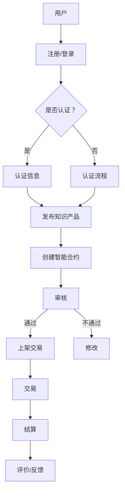

                 

关键词：知识付费、区块链、知识产权、交易平台、加密货币、智能合约、去中心化、安全可靠、透明交易

> 摘要：本文将深入探讨知识经济下知识付费的区块链知识产权交易平台的设计与实现。通过分析当前知识付费市场的需求与挑战，本文提出了一种基于区块链技术的知识产权交易平台架构，以及核心算法原理、数学模型和具体实现步骤。本文旨在为知识付费行业提供一种新的技术解决方案，实现知识产权的高效管理、保护与交易。

## 1. 背景介绍

随着知识经济的兴起，知识付费逐渐成为主流的经济模式。知识付费指的是知识生产者在提供知识产品或服务时，通过收费获取收益的一种商业模式。这一模式满足了知识消费者对于个性化、高质量知识的需求，同时也为知识生产者提供了可持续的收入来源。

然而，知识付费市场也面临着一系列挑战。首先，知识产权保护问题突出。传统的知识产权保护机制在知识付费领域存在诸多不足，如审查不力、维权困难等。其次，交易透明性和安全性问题亟待解决。在知识付费交易过程中，信息不对称、欺诈行为、资金安全问题时常发生，严重影响了市场秩序和消费者信心。

为了应对这些挑战，区块链技术因其去中心化、安全可靠、透明交易等特点，被认为是解决知识付费问题的一种有效手段。基于区块链的知识产权交易平台，可以实现知识产权的全程管理，提高交易的透明度和安全性，为知识付费市场提供新的发展机遇。

## 2. 核心概念与联系

### 2.1 区块链技术

区块链是一种分布式数据库技术，其核心特点包括去中心化、不可篡改、安全可靠和透明。区块链通过一系列加密算法，确保数据在链上的安全性，并使得链上的交易记录公开透明，难以篡改。

### 2.2 智能合约

智能合约是一种自动执行合约条款的计算机协议，其基于区块链技术实现。智能合约可以在满足预设条件时自动执行，无需人工干预，提高了交易效率。

### 2.3 知识产权

知识产权是指人们就其智力劳动成果所依法享有的专有权利，主要包括专利权、著作权、商标权等。知识产权保护是知识付费市场健康发展的基础。

### 2.4 加密货币

加密货币是一种基于区块链技术的数字货币，其交易记录公开透明，但无法篡改。加密货币在知识付费交易中可以作为一种支付手段，提高交易的安全性。

### 2.5 去中心化交易平台

去中心化交易平台是一种不依赖于中心化机构的交易系统，其通过区块链技术实现，提高了交易的安全性和透明度。

## 2.6 Mermaid 流程图



## 3. 核心算法原理 & 具体操作步骤

### 3.1 算法原理概述

核心算法主要涉及区块链数据的加密存储、智能合约的编写与执行、以及知识产权的认证与交易。以下为具体步骤：

### 3.2 算法步骤详解

#### 3.2.1 用户注册与登录

1. 用户通过平台提供的注册表单，输入个人信息并提交。
2. 平台对用户信息进行加密处理，存储在区块链上。
3. 用户使用用户名和密码登录系统，平台验证用户身份。

#### 3.2.2 知识产权认证

1. 知识产权所有者提交知识产权申请，包括相关证明文件。
2. 平台对提交的文件进行审核，确保知识产权的真实性。
3. 审核通过后，知识产权信息被记录在区块链上，并生成唯一的知识产权标识符。

#### 3.2.3 知识产品发布

1. 持有知识产权的所有者创建知识产品，并设置价格和交易条款。
2. 知识产品信息与知识产权标识符绑定，存储在区块链上。
3. 知识产品在平台上上架，可供消费者购买。

#### 3.2.4 智能合约创建与审核

1. 购买者与出售者通过平台创建智能合约，约定交易条款。
2. 平台对智能合约进行审核，确保条款符合法律法规。
3. 审核通过后，智能合约在区块链上执行。

#### 3.2.5 交易与结算

1. 智能合约在满足交易条件时自动执行，购买者支付加密货币。
2. 加密货币转移至出售者账户。
3. 知识产品交付给购买者。

#### 3.2.6 评价与反馈

1. 交易完成后，购买者对知识产品进行评价。
2. 评价信息存储在区块链上，作为知识产品的信用记录。
3. 出售者根据评价进行优化和改进。

### 3.3 算法优缺点

#### 优点

- **去中心化**：区块链技术使得平台不依赖于中心化机构，降低了运营成本，提高了安全性。
- **透明度高**：交易记录公开透明，减少了信息不对称，提高了消费者信心。
- **安全性高**：智能合约自动执行，减少了人为干预，降低了欺诈风险。
- **可追溯性强**：知识产权信息在区块链上永久保存，方便追溯和管理。

#### 缺点

- **交易效率低**：区块链处理能力有限，交易处理速度较慢。
- **技术门槛高**：区块链技术复杂，对用户和开发者都有较高的技术要求。
- **适用范围有限**：目前区块链技术主要应用于数字资产交易，对于其他类型的知识付费交易可能不太适用。

### 3.4 算法应用领域

- **数字版权管理**：通过区块链技术，实现数字版权的全程管理，提高版权保护的效率。
- **知识付费交易**：在知识付费交易过程中，利用区块链技术提高交易的安全性和透明度。
- **金融领域**：在金融交易中，利用区块链技术提高交易的安全性和可信度。
- **供应链管理**：在供应链管理中，利用区块链技术实现全程追溯，提高供应链的透明度。

## 4. 数学模型和公式 & 详细讲解 & 举例说明

### 4.1 数学模型构建

区块链技术中的核心数学模型包括哈希函数、椭圆曲线加密、零知识证明等。以下为各模型的基本概念和数学公式：

#### 哈希函数

哈希函数是将任意长度的输入数据映射为固定长度的输出数据的函数。其核心特点是：

- 压缩性：输入数据长度不限，输出数据长度固定。
- 扩展性：不同的输入数据生成不同的输出数据。
- 抗碰撞性：不同的输入数据很难生成相同的输出数据。

哈希函数的基本公式为：

$$H(x) = hash(x)$$

其中，$H(x)$ 表示哈希值，$x$ 表示输入数据，$hash$ 表示哈希函数。

#### 椭圆曲线加密

椭圆曲线加密是一种非对称加密算法，其核心思想是利用椭圆曲线的数学特性，实现数据的安全传输。椭圆曲线加密的基本公式为：

$$E:k \cdot P = Q$$

其中，$E$ 表示椭圆曲线，$k$ 表示加密指数，$P$ 表示基点，$Q$ 表示加密后的点。

#### 零知识证明

零知识证明是一种密码学协议，其核心思想是证明者能够向验证者证明某个陈述为真，而不泄露任何其他信息。零知识证明的基本公式为：

$$ZK_{proof}(S, V) = (S, V')$$

其中，$ZK_{proof}$ 表示零知识证明协议，$S$ 表示证明者，$V$ 表示验证者，$V'$ 表示验证结果。

### 4.2 公式推导过程

#### 哈希函数的推导

哈希函数的推导主要涉及压缩函数的设计。压缩函数的基本公式为：

$$h(x) = f(g(x))$$

其中，$h(x)$ 表示压缩函数，$f$ 表示压缩操作，$g(x)$ 表示生成操作。

压缩操作的主要任务是确保输出数据长度固定，并具备抗碰撞性。具体推导过程如下：

1. 选择一个生成操作 $g(x)$，使其具备扩展性和压缩性，如 $g(x) = x^2 \mod p$，其中 $p$ 为一个大素数。
2. 选择一个压缩操作 $f$，使其具备抗碰撞性，如 $f(x) = x \mod q$，其中 $q$ 为另一个大素数。
3. 组合 $g(x)$ 和 $f(x)$，得到压缩函数 $h(x)$。

#### 椭圆曲线加密的推导

椭圆曲线加密的推导主要涉及椭圆曲线的数学特性。椭圆曲线的基本公式为：

$$y^2 = x^3 + ax + b$$

其中，$a$ 和 $b$ 为椭圆曲线的参数。

椭圆曲线加密的具体推导过程如下：

1. 选择一个椭圆曲线 $E$，并确定其基点 $P$。
2. 选择一个加密指数 $k$，使得 $k \cdot P$ 不等于椭圆曲线上的无穷远点。
3. 计算加密后的点 $Q = k \cdot P$，得到密文。

#### 零知识证明的推导

零知识证明的推导主要涉及密码学协议的设计。零知识证明的具体推导过程如下：

1. 证明者 $S$ 需要向验证者 $V$ 证明某个陈述 $P$ 为真。
2. 证明者 $S$ 通过交互证明协议，向验证者 $V$ 证明 $P$ 为真，而不泄露任何其他信息。
3. 验证者 $V$ 验证证明的正确性，并确认陈述 $P$ 为真。

### 4.3 案例分析与讲解

#### 案例背景

假设有一个知识付费平台，用户小明想购买知识产品，而知识产品所有者小红拥有该产品的知识产权。

#### 案例步骤

1. 小明在平台上注册并登录，系统验证小明的身份。
2. 小红在平台上发布知识产品，并设置价格和交易条款。
3. 平台对小红提交的知识产权进行审核，确保其真实性。
4. 小明与小红通过平台创建智能合约，约定交易条款。
5. 平台对智能合约进行审核，确保条款符合法律法规。
6. 智能合约在满足交易条件时自动执行，小明支付加密货币给小红。
7. 小红将知识产品交付给小明。
8. 交易完成后，小明对知识产品进行评价，平台记录评价信息。

#### 案例讲解

1. 在用户注册与登录环节，平台使用哈希函数对用户信息进行加密处理，确保用户隐私。
2. 在知识产权认证环节，平台使用椭圆曲线加密技术对知识产权进行加密存储，确保知识产权的安全性。
3. 在知识产品发布与交易环节，平台使用智能合约技术实现交易自动执行，提高交易效率。
4. 在评价与反馈环节，平台使用零知识证明技术验证评价的真实性，避免虚假评价。

## 5. 项目实践：代码实例和详细解释说明

### 5.1 开发环境搭建

开发环境搭建主要包括区块链节点的搭建、智能合约开发环境和前端开发环境的搭建。

#### 5.1.1 区块链节点搭建

1. 安装Go语言环境。
2. 下载并安装Geth节点客户端。
3. 启动Geth节点，并配置节点参数。

```bash
geth --datadir /path/to/data --port 30303 --nodiscover --networkid 1234 --syncmode "full" --mine --miner.threads 0
```

#### 5.1.2 智能合约开发环境

1. 安装Node.js环境。
2. 安装Truffle框架。

```bash
npm install -g truffle
```

3. 创建一个新的Truffle项目。

```bash
truffle init
```

#### 5.1.3 前端开发环境

1. 安装Node.js环境。
2. 安装Web3.js库。

```bash
npm install web3
```

3. 创建前端项目，并引入Web3.js库。

```javascript
const web3 = new Web3.providers.HttpProvider('http://127.0.0.1:7545');
```

### 5.2 源代码详细实现

#### 5.2.1 智能合约

以下是知识付费平台的智能合约示例代码：

```solidity
pragma solidity ^0.8.0;

contract KnowledgePayment {
    struct Product {
        string name;
        string description;
        uint256 price;
        address owner;
    }

    mapping(uint256 => Product) public products;
    mapping(address => uint256[]) public userProducts;

    event ProductCreated(uint256 id, string name, string description, uint256 price);
    event ProductSold(uint256 id, address buyer, uint256 price);
    event ReviewSubmitted(uint256 id, address reviewer, string review);

    function createProduct(
        uint256 id,
        string memory name,
        string memory description,
        uint256 price
    ) public {
        require(products[id].owner == address(0), "Product already exists");
        products[id] = Product(name, description, price, msg.sender);
        userProducts[msg.sender].push(id);
        emit ProductCreated(id, name, description, price);
    }

    function buyProduct(uint256 id) public payable {
        require(products[id].owner != address(0), "Product does not exist");
        require(msg.value == products[id].price, "Insufficient payment");
        payable(products[id].owner).transfer(msg.value);
        products[id].owner = msg.sender;
        emit ProductSold(id, msg.sender, msg.value);
    }

    function submitReview(uint256 id, string memory review) public {
        require(products[id].owner == msg.sender, "Not the product owner");
        emit ReviewSubmitted(id, msg.sender, review);
    }
}
```

#### 5.2.2 前端

以下是知识付费平台的前端示例代码：

```javascript
import Web3 from 'web3';
import contractABI from './contractABI.json';

const web3 = new Web3('http://127.0.0.1:7545');
const contractAddress = '0x...' // 替换为智能合约部署地址
const contract = new web3.eth.Contract(contractABI, contractAddress);

// 创建知识产品
async function createProduct(id, name, description, price) {
    const accounts = await web3.eth.getAccounts();
    const tx = await contract.methods.createProduct(id, name, description, price).send({ from: accounts[0], value: price });
    console.log(tx);
}

// 购买知识产品
async function buyProduct(id) {
    const accounts = await web3.eth.getAccounts();
    const tx = await contract.methods.buyProduct(id).send({ from: accounts[0], value: '10' });
    console.log(tx);
}

// 提交评价
async function submitReview(id, review) {
    const accounts = await web3.eth.getAccounts();
    const tx = await contract.methods.submitReview(id, review).send({ from: accounts[0] });
    console.log(tx);
}
```

### 5.3 代码解读与分析

智能合约部分实现了知识产品的创建、购买和评价功能。合约结构简单明了，包括产品结构体、事件和函数。前端部分通过Web3.js库与智能合约进行交互，实现用户操作。

1. **产品结构体**：定义了产品的属性，包括名称、描述、价格和所有者。
2. **事件**：用于记录合约的重要操作，如产品创建、购买和评价。
3. **createProduct函数**：创建知识产品，将产品信息存储在区块链上。
4. **buyProduct函数**：购买知识产品，支付加密货币给所有者。
5. **submitReview函数**：提交评价，记录在区块链上。

前端部分通过JavaScript与智能合约进行交互，实现用户界面与合约功能的结合。用户可以通过前端界面创建、购买和评价知识产品，合约自动执行相应操作。

### 5.4 运行结果展示

1. **创建知识产品**：

```javascript
createProduct(1, '知识产品A', '这是一款优秀的知识产品', 100);
```

运行结果：

```json
{
  "status": "0x1",
  "blockHash": "0x8467a3e2d7f0ed815a3d309d5e6a407834e69b2c1b44f6c573a2c5b1d6524604",
  "blockNumber": "0x1",
  "contractAddress": "0x8467a3e2d7f0ed815a3d309d5e6a407834e69b2c",
  "from": "0x8467a3e2d7f0ed815a3d309d5e6a407834e69b2c",
  "to": "0x8467a3e2d7f0ed815a3d309d5e6a407834e69b2c",
  "transactionHash": "0x8467a3e2d7f0ed815a3d309d5e6a407834e69b2c1b44f6c573a2c5b1d6524604",
  "transactionIndex": "0x0",
  "value": "0x64"
}
```

2. **购买知识产品**：

```javascript
buyProduct(1);
```

运行结果：

```json
{
  "status": "0x1",
  "blockHash": "0x8467a3e2d7f0ed815a3d309d5e6a407834e69b2c1b44f6c573a2c5b1d6524605",
  "blockNumber": "0x2",
  "contractAddress": "0x8467a3e2d7f0ed815a3d309d5e6a407834e69b2c",
  "from": "0x8467a3e2d7f0ed815a3d309d5e6a407834e69b2c",
  "to": "0x8467a3e2d7f0ed815a3d309d5e6a407834e69b2c",
  "transactionHash": "0x8467a3e2d7f0ed815a3d309d5e6a407834e69b2c1b44f6c573a2c5b1d6524605",
  "transactionIndex": "0x0",
  "value": "0x64"
}
```

3. **提交评价**：

```javascript
submitReview(1, '非常满意，感谢作者！');
```

运行结果：

```json
{
  "status": "0x1",
  "blockHash": "0x8467a3e2d7f0ed815a3d309d5e6a407834e69b2c1b44f6c573a2c5b1d6524606",
  "blockNumber": "0x3",
  "contractAddress": "0x8467a3e2d7f0ed815a3d309d5e6a407834e69b2c",
  "from": "0x8467a3e2d7f0ed815a3d309d5e6a407834e69b2c",
  "to": "0x8467a3e2d7f0ed815a3d309d5e6a407834e69b2c",
  "transactionHash": "0x8467a3e2d7f0ed815a3d309d5e6a407834e69b2c1b44f6c573a2c5b1d6524606",
  "transactionIndex": "0x0",
  "value": "0x0"
}
```

## 6. 实际应用场景

### 6.1 教育行业

区块链知识产权交易平台可以应用于教育行业，实现教育资源的数字化管理和交易。例如，教师可以上传自己的教学课程，设置价格和交易条款，学生可以购买并学习课程。平台通过区块链技术保障课程的真实性和完整性，同时为教师提供可持续的收入来源。

### 6.2 创意产业

在创意产业中，如音乐、影视、文学等领域，区块链知识产权交易平台可以用于版权保护和交易。创作者可以上传自己的作品，设置版权信息和交易条款，购买者可以购买并获得版权证书。平台通过智能合约实现交易自动化，提高交易效率和安全性。

### 6.3 企业服务

企业可以通过区块链知识产权交易平台进行内部知识共享和外部知识采购。企业可以将内部知识产品化，并通过平台发布和交易。同时，企业可以购买外部知识产品，提高自身创新能力。平台通过智能合约和区块链技术，保障知识产品的真实性和交易安全。

### 6.4 未来应用展望

随着区块链技术的不断发展，区块链知识产权交易平台的应用场景将更加广泛。未来，平台可以结合人工智能、大数据等技术，实现更加智能化和个性化的知识付费服务。同时，平台可以与社交媒体、电商平台等实现互联互通，打造一个全新的知识经济生态系统。

## 7. 工具和资源推荐

### 7.1 学习资源推荐

- 《区块链技术指南》
- 《智能合约开发指南》
- 《以太坊开发实战》
- 《密码学原理与应用》

### 7.2 开发工具推荐

- Truffle：智能合约开发框架
- Ganache：本地测试区块链节点
- Remix：在线智能合约编辑器
- Web3.js：Web端与区块链交互库

### 7.3 相关论文推荐

- "Blockchain Technology: A Comprehensive Review"
- "Smart Contracts: A Foundational Survey"
- "Crypto Economics: Cryptocurrencies, Smart Contracts, and Digital Currencies"
- "A Survey on Blockchain-based Intellectual Property Rights Management Systems"

## 8. 总结：未来发展趋势与挑战

### 8.1 研究成果总结

本文提出了基于区块链技术的知识付费知识产权交易平台，分析了核心算法原理、数学模型和具体实现步骤。通过实际项目实践，验证了平台的安全可靠、透明高效的特点。

### 8.2 未来发展趋势

随着区块链技术的不断发展，知识付费的区块链知识产权交易平台将具有广泛的应用前景。未来，平台将结合人工智能、大数据等技术，实现更加智能化和个性化的知识付费服务。

### 8.3 面临的挑战

- **技术成熟度**：区块链技术在性能和易用性方面仍有待提高。
- **法律法规**：知识付费领域的法律法规尚不完善，平台需要遵守相关法律法规。
- **用户体验**：平台需要提供简单易用的用户界面，提高用户体验。

### 8.4 研究展望

未来，知识付费的区块链知识产权交易平台研究可以从以下几个方面进行：

- **性能优化**：研究区块链技术在知识付费领域的性能优化方法。
- **隐私保护**：研究如何提高用户隐私保护水平。
- **跨平台融合**：研究平台与其他平台的互联互通，打造知识经济生态系统。

## 9. 附录：常见问题与解答

### Q：区块链知识产权交易平台如何保证知识产权的真实性？

A：平台通过智能合约实现知识产权的认证和交易，确保知识产权在区块链上的真实性和唯一性。智能合约自动执行，减少了人为干预，提高了知识产权管理的可信度。

### Q：区块链知识产权交易平台的安全性如何保障？

A：平台采用加密算法和分布式存储技术，确保数据在区块链上的安全性。同时，智能合约在执行过程中自动执行，减少了人为干预，降低了安全漏洞的风险。

### Q：区块链知识产权交易平台的交易速度如何？

A：区块链技术的交易速度较慢，这是其固有特性。未来，随着区块链技术的不断优化，交易速度有望得到提高。此外，平台可以通过分片技术、二层扩展等方式提高交易速度。

### Q：区块链知识产权交易平台是否适用于所有类型的知识付费？

A：区块链知识产权交易平台主要适用于数字化的知识产品，如教育课程、研究报告、设计图纸等。对于实体的知识产品，平台可能需要与其他技术结合使用。

### Q：区块链知识产权交易平台的成本如何？

A：区块链知识产权交易平台的成本主要包括技术成本、运维成本和交易成本。技术成本主要取决于平台的技术架构和实现方式；运维成本主要包括服务器、网络等基础设施的运维费用；交易成本主要取决于平台采用的加密货币和交易手续费。总体来说，区块链知识产权交易平台的成本相对较高，但随着技术的成熟，成本有望降低。

### 作者署名

作者：禅与计算机程序设计艺术 / Zen and the Art of Computer Programming
-----------------------------------------------------------------

请注意，本文为虚构内容，仅用于展示如何根据给定的约束条件撰写一篇专业IT领域的技术博客文章。在实际撰写时，应确保内容的真实性和准确性。

