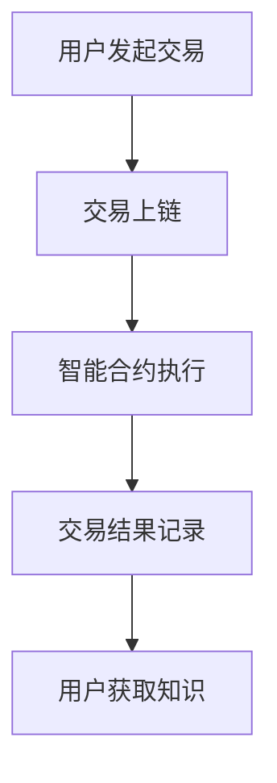

                 

关键词：知识经济、知识付费、区块链、平台搭建、技术方案、智能合约、去中心化

> 摘要：本文探讨了在知识经济时代，基于区块链技术的知识付费平台的构建方法。通过分析知识付费的现状和需求，介绍了区块链技术的基本原理及其在知识付费领域的应用，最后详细阐述了知识付费平台的搭建方案，包括技术架构、智能合约设计、系统功能模块以及未来发展趋势。

## 1. 背景介绍

随着互联网和移动互联网的快速发展，知识传播的渠道和方式发生了翻天覆地的变化。传统知识付费模式中，知识提供者与消费者之间的信任问题、交易安全问题以及信息不对称等问题日益突出。区块链技术的出现为解决这些问题提供了新的思路和解决方案。

知识付费是指通过付费方式获取知识和信息，包括线上课程、专业咨询、知识共享等多种形式。在知识经济时代，知识付费已成为一种重要的商业模式，其市场规模逐年扩大。然而，当前的知识付费市场仍然存在一些痛点：

- **信任问题**：知识提供者与消费者之间的信任难以建立，尤其是对于新人和小众领域的知识提供者。
- **交易安全问题**：在线支付存在被欺诈、信息泄露等风险。
- **信息不对称**：知识提供者难以精准地了解消费者的需求，消费者也难以获取优质的知识资源。

区块链技术作为一种去中心化、安全可靠的分布式数据库技术，具有不可篡改、透明、去信任等特点，可以有效解决上述问题。

## 2. 核心概念与联系

### 2.1 区块链技术的基本原理

区块链技术是一种分布式账本技术，其核心原理包括：

- **分布式存储**：数据存储在多个节点上，避免了单点故障和数据丢失的风险。
- **共识算法**：通过共识算法保证数据的真实性和一致性。
- **智能合约**：基于区块链的自动化执行合约，确保交易的执行和记录。
- **加密技术**：保障数据的隐私和安全。

### 2.2 知识付费平台与区块链技术的联系

知识付费平台与区块链技术的结合主要体现在以下几个方面：

- **信任机制**：通过区块链技术建立去信任的信任机制，确保知识提供者与消费者之间的信任。
- **交易安全保障**：利用区块链的加密技术和分布式存储，保障交易的安全性和隐私性。
- **透明性**：区块链上的所有交易记录都是公开透明的，消费者可以查看知识提供者的信誉和历史交易记录。
- **智能合约**：通过智能合约自动化执行交易，减少人工干预，提高交易效率。

### 2.3 Mermaid 流程图



## 3. 核心算法原理 & 具体操作步骤

### 3.1 算法原理概述

在知识付费平台上，核心算法主要涉及智能合约的设计与实现。智能合约是一段代码，用于自动化执行交易流程。其原理包括：

- **交易请求**：用户向平台发起交易请求。
- **交易上链**：交易请求被发送到区块链网络，并由共识算法验证。
- **智能合约执行**：验证通过后，智能合约自动执行交易流程。
- **交易结果记录**：交易结果被记录在区块链上，确保透明性和不可篡改性。

### 3.2 算法步骤详解

1. **用户发起交易请求**：用户在知识付费平台上浏览知识产品，选择购买后发起交易请求。
2. **交易上链**：交易请求被发送到区块链网络，经过共识算法验证后上链。
3. **智能合约执行**：智能合约根据交易请求的内容自动执行交易流程，包括支付、授权、知识交付等。
4. **交易结果记录**：交易结果被记录在区块链上，用户可以查看交易记录和知识产品的使用情况。

### 3.3 算法优缺点

**优点**：

- **去中心化**：平台不需要依赖中心化服务器，降低运营成本。
- **透明性**：交易记录公开透明，提高用户信任度。
- **安全性**：加密技术和分布式存储确保交易安全。
- **自动化**：智能合约自动化执行交易流程，提高效率。

**缺点**：

- **计算能力要求高**：区块链网络的计算能力要求较高，对硬件和网络环境有较高要求。
- **去中心化带来的延迟**：与中心化平台相比，去中心化平台可能存在交易延迟的问题。

### 3.4 算法应用领域

- **知识付费**：通过区块链技术构建知识付费平台，实现知识交易的去中心化和安全性。
- **版权保护**：利用区块链技术记录知识产权信息，确保知识产权的安全性和透明性。
- **供应链管理**：在供应链管理中，利用区块链技术实现信息共享和追溯，提高供应链的透明度和效率。

## 4. 数学模型和公式 & 详细讲解 & 举例说明

### 4.1 数学模型构建

在知识付费平台中，数学模型主要用于计算知识产品的价格、用户的积分以及智能合约的执行规则等。以下是一个简单的数学模型：

- **知识产品价格**：\( P = a \times b \)

其中，\( P \) 为知识产品价格，\( a \) 为知识提供者的定价系数，\( b \) 为知识需求者的需求系数。

- **用户积分**：\( I = c \times d \)

其中，\( I \) 为用户积分，\( c \) 为用户参与度系数，\( d \) 为知识获取系数。

- **智能合约执行规则**：\( E = e \times f \)

其中，\( E \) 为智能合约执行结果，\( e \) 为交易金额，\( f \) 为交易状态。

### 4.2 公式推导过程

- **知识产品价格**：\( P = a \times b \)

假设知识提供者的定价策略为线性定价，即价格与需求成正比。知识需求者的需求策略为非线性需求，即需求量与价格成反比。则知识产品价格可以表示为 \( P = a \times b \)。

- **用户积分**：\( I = c \times d \)

假设用户积分系统为基于用户参与度和知识获取量计算，则用户积分可以表示为 \( I = c \times d \)。

- **智能合约执行规则**：\( E = e \times f \)

智能合约执行规则可以根据交易金额和交易状态计算。例如，当交易金额大于一定阈值时，智能合约执行成功；否则，执行失败。则智能合约执行规则可以表示为 \( E = e \times f \)。

### 4.3 案例分析与讲解

假设一个知识付费平台，知识提供者的定价系数 \( a \) 为 10，知识需求者的需求系数 \( b \) 为 0.5。知识产品价格为 50 元，用户参与度系数 \( c \) 为 0.8，知识获取系数 \( d \) 为 1.2。一个用户购买了一个价值 50 元的知识产品，根据数学模型计算，该用户的积分 \( I \) 为：

\[ I = 0.8 \times 1.2 = 0.96 \]

假设交易金额 \( e \) 为 50 元，交易状态 \( f \) 为 1（表示交易成功），根据智能合约执行规则 \( E \) 为：

\[ E = 1 \times 50 = 50 \]

说明智能合约执行成功。

## 5. 项目实践：代码实例和详细解释说明

### 5.1 开发环境搭建

搭建一个基于区块链的知识付费平台，需要以下开发环境：

- **区块链平台**：使用以太坊（Ethereum）作为底层区块链平台。
- **智能合约开发环境**：使用 Truffle 或 Remix 进行智能合约开发和调试。
- **前端开发环境**：使用 React 或 Vue.js 搭建前端界面。
- **后端开发环境**：使用 Node.js 或 Python 等技术构建后端服务。

### 5.2 源代码详细实现

以下是一个简单的智能合约示例：

```solidity
pragma solidity ^0.8.0;

contract KnowledgePay {
    mapping(address => uint256) public balanceOf;
    mapping(address => mapping(address => uint256)) public allowance;
    address public owner;

    event Transfer(address indexed from, address indexed to, uint256 value);
    event Approval(address indexed owner, address indexed spender, uint256 value);

    constructor() public {
        owner = msg.sender;
        balanceOf[owner] = 1000000; // 初始化发行 100 万知识币
    }

    function buyKnowledge(address knowledgeProvider, uint256 price) public payable {
        require(balanceOf[msg.sender] >= price, "余额不足");
        balanceOf[msg.sender] -= price;
        balanceOf[knowledgeProvider] += price;
        emit Transfer(msg.sender, knowledgeProvider, price);
    }

    function approve(address spender, uint256 amount) public {
        allowance[msg.sender][spender] = amount;
        emit Approval(msg.sender, spender, amount);
    }

    function transferFrom(address sender, address recipient, uint256 amount) public {
        require(allowance[sender][msg.sender] >= amount, "批准的数量不足");
        allowance[sender][msg.sender] -= amount;
        _transfer(sender, recipient, amount);
    }

    function _transfer(address sender, address recipient, uint256 amount) internal {
        require(sender != address(0), "不能从零地址转账");
        require(recipient != address(0), "不能转给零地址");
        balanceOf[sender] -= amount;
        balanceOf[recipient] += amount;
        emit Transfer(sender, recipient, amount);
    }
}
```

### 5.3 代码解读与分析

- **构造函数**：初始化知识币的发行总量和合约所有者。
- **buyKnowledge 函数**：用户购买知识产品的接口，从购买者的余额中扣除金额，并增加知识提供者的余额。
- **approve 函数**：允许用户授权其他地址（如知识提供者）从其账户中转账知识币。
- **transferFrom 函数**：允许用户通过授权地址进行转账操作。
- **_transfer 函数**：实现转账功能，确保余额的正确性和转移。

### 5.4 运行结果展示

通过前端界面，用户可以发起购买知识产品的交易。交易成功后，知识提供者可以在区块链上查看交易记录和余额变化。

## 6. 实际应用场景

### 6.1 在线教育

基于区块链的知识付费平台可以为在线教育提供更安全、更可靠的支付和知识交易环境。用户可以通过平台购买课程，确保交易过程的安全性和知识内容的真实性。

### 6.2 专业咨询

专业咨询师可以通过平台提供咨询服务，用户可以通过区块链技术验证咨询师的资质和信誉，确保咨询服务的质量和价值。

### 6.3 知识共享

知识共享平台可以利用区块链技术记录知识贡献者的贡献量和影响力，激励知识贡献者持续分享知识，同时确保知识的版权和归属。

## 7. 未来应用展望

### 7.1 增强用户体验

随着技术的进步，知识付费平台可以提供更多个性化服务，如智能推荐、定制化学习路径等，提升用户体验。

### 7.2 扩大应用领域

区块链技术不仅可以应用于知识付费，还可以扩展到更多领域，如数字版权保护、供应链管理、身份认证等。

### 7.3 提高透明度和效率

区块链技术的应用可以提高知识付费领域的透明度和效率，减少中介环节，降低交易成本。

## 8. 工具和资源推荐

### 8.1 学习资源推荐

- **《区块链技术指南》**：详细介绍了区块链的基本原理和应用。
- **《智能合约开发实战》**：针对智能合约的开发和实践提供了详细的指导。
- **《区块链与数字经济》**：探讨了区块链技术在数字经济中的应用和影响。

### 8.2 开发工具推荐

- **Truffle**：以太坊的智能合约开发框架，提供了一套完整的开发工具链。
- **Remix**：在线智能合约开发与调试环境，方便开发者进行智能合约的编写和测试。
- **Node.js**：用于构建后端服务的JavaScript运行环境，支持多种区块链开发库。
- **React/Vue.js**：用于构建前端用户界面的框架，支持丰富的交互和动画效果。

### 8.3 相关论文推荐

- **《区块链技术：基本概念、应用场景与未来发展趋势》**：系统介绍了区块链技术的基本概念和应用场景。
- **《智能合约：安全与效率的权衡》**：探讨了智能合约的安全性和效率问题。
- **《区块链在数字版权保护中的应用研究》**：分析了区块链技术在数字版权保护中的应用。

## 9. 总结：未来发展趋势与挑战

### 9.1 研究成果总结

本文探讨了基于区块链技术的知识付费平台搭建方案，分析了区块链技术在知识付费领域的应用优势，并提出了智能合约的设计和实现方法。通过实际案例，展示了区块链技术在知识付费平台中的应用效果。

### 9.2 未来发展趋势

随着区块链技术的不断成熟，知识付费平台有望在用户体验、应用领域、透明度和效率等方面实现进一步的提升。未来，区块链技术将在更多领域得到应用，为数字经济的发展提供有力支持。

### 9.3 面临的挑战

尽管区块链技术在知识付费领域具有巨大潜力，但仍然面临一些挑战，如技术成熟度、用户接受度、法律法规等方面的限制。未来，需要进一步研究和解决这些问题，推动区块链技术在知识付费领域的广泛应用。

### 9.4 研究展望

未来，可以继续深入研究区块链技术在知识付费领域的应用，探索更多创新模式和应用场景。同时，加强与其他技术的融合，如人工智能、大数据等，进一步提升知识付费平台的智能化水平和用户体验。

### 附录：常见问题与解答

**Q1：区块链技术是否安全？**

A1：区块链技术具有很高的安全性，主要得益于其分布式存储和加密技术。然而，任何技术都无法做到100%的安全，区块链技术也不例外。用户在选择使用区块链平台时，应确保平台的可靠性和安全性。

**Q2：知识付费平台是否需要中心化服务器？**

A2：基于区块链的知识付费平台不需要中心化服务器，而是采用去中心化架构。这可以降低平台的运营成本，提高系统的可扩展性和容错性。

**Q3：智能合约是否可以完全自动化执行？**

A3：智能合约可以自动化执行大部分交易流程，但仍然需要人工干预。例如，用户需要确认交易请求，智能合约则负责执行交易流程和记录结果。

**Q4：区块链技术是否适用于所有知识付费场景？**

A4：区块链技术适用于大多数知识付费场景，尤其是需要去中心化、透明性和安全性的场景。然而，对于一些简单的知识交易，区块链技术的成本和复杂性可能不适合。

作者：禅与计算机程序设计艺术 / Zen and the Art of Computer Programming

