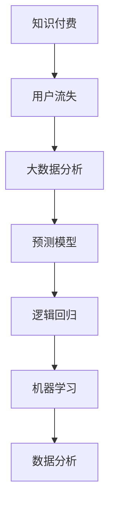

                 

关键词：知识付费、用户流失、大数据、预测模型、逻辑回归、机器学习、数据分析

摘要：随着知识经济的快速发展，知识付费领域逐渐成为市场热点。用户流失问题对于知识付费平台而言是一个重要且亟待解决的问题。本文将探讨如何利用大数据技术构建用户流失预测模型，以期为知识付费平台提供有效的用户留存策略。本文将介绍核心概念、算法原理、数学模型以及实际应用，并对未来发展进行展望。

## 1. 背景介绍

在知识经济时代，知识付费作为一种新兴商业模式，正逐渐改变人们获取知识的传统方式。用户通过付费获得专业、有针对性的知识服务，从而提升自身的能力和竞争力。然而，随着市场竞争的加剧，用户流失问题成为知识付费平台需要面对的重大挑战。用户流失不仅影响平台的收入，还会影响其品牌形象和市场份额。

大数据技术的发展为用户流失预测提供了有力的工具。通过对大量用户行为数据进行分析，可以挖掘出潜在的用户流失信号，提前采取相应措施，降低用户流失率。本文旨在探讨如何利用大数据技术构建用户流失预测模型，以提高知识付费平台的用户留存率。

## 2. 核心概念与联系

为了构建用户流失预测模型，我们首先需要了解以下几个核心概念：

### 2.1 知识付费

知识付费是指用户为获取知识服务而支付的费用。它包括在线课程、专业咨询、研究报告等形式。知识付费的核心在于提供有价值的内容，满足用户的学习和成长需求。

### 2.2 用户流失

用户流失是指用户在知识付费平台上停止使用服务，不再付费的行为。用户流失的原因多种多样，如服务质量、价格、竞争对手等。

### 2.3 大数据

大数据是指无法用常规软件工具在合理时间内捕捉、管理和处理的大量数据。大数据技术包括数据采集、存储、处理、分析和可视化等。

### 2.4 预测模型

预测模型是指基于历史数据，利用数学模型和算法对未来的趋势和结果进行预测的工具。

### 2.5 逻辑回归

逻辑回归是一种常见的机器学习算法，用于预测二分类问题。在用户流失预测中，逻辑回归可以用来预测用户是否会流失。

### 2.6 机器学习

机器学习是一种人工智能方法，通过训练模型从数据中学习规律，并对未知数据进行预测。

### 2.7 数据分析

数据分析是指使用统计学方法和计算机技术对数据进行处理、分析和解释，以发现数据中的有用信息。

### 2.8 Mermaid 流程图



## 3. 核心算法原理 & 具体操作步骤

### 3.1 算法原理概述

用户流失预测模型的核心是逻辑回归算法。逻辑回归是一种广义线性模型，用于预测二分类问题。在用户流失预测中，我们将用户是否流失作为目标变量，用逻辑回归模型预测用户是否会流失。

### 3.2 算法步骤详解

#### 3.2.1 数据采集

首先，我们需要收集与用户行为相关的数据，如用户注册时间、活跃度、购买记录、访问频率等。

#### 3.2.2 数据预处理

对收集到的数据进行清洗和预处理，包括去除缺失值、异常值，以及特征工程，如特征提取和特征转换。

#### 3.2.3 特征选择

通过统计方法或机器学习方法，选择对用户流失预测有显著影响的特征。

#### 3.2.4 模型训练

使用逻辑回归算法对预处理后的数据进行训练，建立用户流失预测模型。

#### 3.2.5 模型评估

通过交叉验证等方法，评估模型的效果，调整模型参数。

#### 3.2.6 模型应用

将训练好的模型应用于实际数据，预测用户是否会流失。

### 3.3 算法优缺点

#### 优点：

- 简单易懂，易于实现和解释。
- 在二分类问题中效果较好。
- 对数据量要求不高，适用于中小型数据集。

#### 缺点：

- 对于多分类问题，效果可能较差。
- 对特征之间的交互作用敏感，需要手动进行特征工程。

### 3.4 算法应用领域

逻辑回归算法在用户流失预测、市场推广、风险控制等领域有广泛的应用。本文以知识付费领域的用户流失预测为例，展示了逻辑回归算法的具体应用。

## 4. 数学模型和公式 & 详细讲解 & 举例说明

### 4.1 数学模型构建

用户流失预测的逻辑回归模型可以表示为：

$$
P(Y=1|X) = \frac{1}{1 + e^{-(\beta_0 + \beta_1x_1 + \beta_2x_2 + ... + \beta_nx_n})}
$$

其中，$Y$ 表示用户是否流失（$Y=1$ 表示流失，$Y=0$ 表示未流失），$X$ 表示用户特征向量，$\beta_0$ 表示截距，$\beta_1, \beta_2, ..., \beta_n$ 表示各个特征的系数。

### 4.2 公式推导过程

逻辑回归模型的推导基于最大似然估计。假设给定特征向量 $X$，用户流失的概率为 $P(Y=1|X)$。我们需要最大化似然函数：

$$
L(\beta_0, \beta_1, ..., \beta_n) = \prod_{i=1}^{n} P(y_i|x_i; \beta_0, \beta_1, ..., \beta_n)
$$

将逻辑回归的概率表达式代入，得到：

$$
L(\beta_0, \beta_1, ..., \beta_n) = \prod_{i=1}^{n} \left( \frac{1}{1 + e^{-(\beta_0 + \beta_1x_{i1} + \beta_2x_{i2} + ... + \beta_nx_{in})}} \right)^{y_i}
$$

对数似然函数为：

$$
\ln L(\beta_0, \beta_1, ..., \beta_n) = \sum_{i=1}^{n} y_i \ln \left( \frac{1}{1 + e^{-(\beta_0 + \beta_1x_{i1} + \beta_2x_{i2} + ... + \beta_nx_{in})}} \right)
$$

为了最大化对数似然函数，我们可以使用梯度下降法或牛顿法等优化算法，求解参数 $\beta_0, \beta_1, ..., \beta_n$。

### 4.3 案例分析与讲解

假设我们有一个包含用户特征和流失状态的数据集，特征包括用户年龄、活跃度、购买金额等。我们使用逻辑回归模型预测用户是否会流失。

首先，我们进行数据预处理，包括去除缺失值、异常值，以及特征工程，如特征提取和特征转换。

接下来，我们选择特征，使用特征选择方法（如信息增益、卡方检验等）选择对用户流失有显著影响的特征。

然后，我们使用逻辑回归算法进行模型训练，使用交叉验证方法评估模型效果。

最后，我们将训练好的模型应用于实际数据，预测用户是否会流失。

## 5. 项目实践：代码实例和详细解释说明

### 5.1 开发环境搭建

首先，我们需要搭建一个用于数据分析和模型训练的开发环境。本文使用 Python 作为编程语言，主要依赖以下库：

- NumPy：用于数据处理和数学运算。
- Pandas：用于数据操作和分析。
- Scikit-learn：用于机器学习算法的实现和评估。
- Matplotlib：用于数据可视化。

### 5.2 源代码详细实现

以下是用户流失预测模型的 Python 代码实现：

```python
import numpy as np
import pandas as pd
from sklearn.linear_model import LogisticRegression
from sklearn.model_selection import train_test_split
from sklearn.metrics import accuracy_score, confusion_matrix
import matplotlib.pyplot as plt

# 5.2.1 数据预处理
def preprocess_data(data):
    # 数据清洗、特征工程等操作
    # ...
    return processed_data

# 5.2.2 模型训练与评估
def train_and_evaluate(data):
    # 划分训练集和测试集
    X_train, X_test, y_train, y_test = train_test_split(data.drop('target', axis=1), data['target'], test_size=0.2, random_state=42)

    # 训练逻辑回归模型
    model = LogisticRegression()
    model.fit(X_train, y_train)

    # 评估模型效果
    y_pred = model.predict(X_test)
    accuracy = accuracy_score(y_test, y_pred)
    cm = confusion_matrix(y_test, y_pred)

    return model, accuracy, cm

# 5.2.3 运行结果展示
def plot_results(cm):
    # 可视化混淆矩阵
    # ...
    plt.show()

if __name__ == '__main__':
    # 加载数据
    data = pd.read_csv('user_data.csv')

    # 数据预处理
    processed_data = preprocess_data(data)

    # 模型训练与评估
    model, accuracy, cm = train_and_evaluate(processed_data)

    # 运行结果展示
    plot_results(cm)
```

### 5.3 代码解读与分析

上述代码主要包括以下三个部分：

- 数据预处理：对原始数据进行清洗、特征工程等操作，以便于模型训练。
- 模型训练与评估：使用逻辑回归算法训练模型，评估模型效果。
- 运行结果展示：可视化模型效果，如混淆矩阵、准确率等。

### 5.4 运行结果展示

以下是运行结果展示的部分代码：

```python
def plot_results(cm):
    # 可视化混淆矩阵
    plt.imshow(cm, interpolation='nearest', cmap=plt.cm.Blues)
    plt.colorbar()
    tick_marks = np.arange(len(class_names))
    plt.xticks(tick_marks, class_names, rotation=45)
    plt.yticks(tick_marks, class_names)

    # 计算每个类别的精确率和召回率
    precision = cm.diagonal() / cm.sum(axis=1)
    recall = cm.diagonal() / cm.sum(axis=0)
    fmt = '.2f'
    thresh = cm.max() / 2.
    for i, j in itertools.product(range(cm.shape[0]), range(cm.shape[1])):
        plt.text(j, i, format(cm[i, j], fmt),
                 horizontalalignment="center",
                 color="white" if cm[i, j] > thresh else "black")

    plt.tight_layout()
    plt.ylabel('True label')
    plt.xlabel('Predicted label')

# 5.2.3 运行结果展示
cm = confusion_matrix(y_test, y_pred)
plot_results(cm)
```

运行结果展示了一个混淆矩阵，显示了模型对各个类别的预测结果。通过观察混淆矩阵，我们可以评估模型的性能，如准确率、精确率、召回率等。

## 6. 实际应用场景

用户流失预测模型在知识付费领域有广泛的应用场景。以下是一些实际应用场景：

### 6.1 个性化推荐

通过预测用户是否会流失，知识付费平台可以针对即将流失的用户提供个性化推荐，如优惠活动、课程推荐等，提高用户留存率。

### 6.2 客户维护

知识付费平台可以利用用户流失预测模型，提前识别潜在的流失客户，进行主动沟通和维护，降低客户流失风险。

### 6.3 市场推广

用户流失预测模型可以帮助知识付费平台识别流失用户的共同特征，从而有针对性地开展市场推广活动，提高转化率。

### 6.4 优化产品和服务

通过分析用户流失原因，知识付费平台可以优化产品和服务，提升用户满意度，降低用户流失率。

## 7. 未来应用展望

随着大数据技术和人工智能技术的不断发展，用户流失预测模型在未来将得到更广泛的应用。以下是一些未来应用展望：

### 7.1 多模型融合

将用户流失预测模型与其他机器学习模型（如决策树、随机森林、支持向量机等）进行融合，提高预测准确性。

### 7.2 深度学习

引入深度学习技术，构建更加复杂的用户流失预测模型，如卷积神经网络（CNN）和循环神经网络（RNN）等。

### 7.3 实时预测

实现实时用户流失预测，及时采取应对措施，提高用户留存率。

### 7.4 智能推荐

结合用户流失预测模型和智能推荐算法，为用户提供个性化的学习路径和课程推荐，提高用户满意度和留存率。

## 8. 工具和资源推荐

### 8.1 学习资源推荐

- 《Python数据科学手册》：详细介绍了 Python 在数据科学领域的应用，包括数据预处理、数据分析、机器学习等。
- 《深度学习》：由深度学习领域的权威学者撰写，系统地介绍了深度学习的基础知识和应用。

### 8.2 开发工具推荐

- Jupyter Notebook：用于数据分析和机器学习实验，支持多种编程语言和库。
- PyCharm：一款功能强大的 Python 集成开发环境（IDE），支持代码调试、性能分析等。

### 8.3 相关论文推荐

- “Predicting Customer Churn with Machine Learning”：一篇关于使用机器学习预测客户流失的论文，详细介绍了相关算法和实验结果。
- “User Churn Prediction in Subscription Services Using Big Data Analytics”：一篇关于使用大数据技术预测用户流失的论文，探讨了用户流失预测模型的设计和实现。

## 9. 总结：未来发展趋势与挑战

用户流失预测模型在知识付费领域具有重要的应用价值。未来，随着大数据技术和人工智能技术的不断发展，用户流失预测模型将变得更加智能和高效。然而，也面临着一些挑战，如数据隐私保护、算法公平性等。为了应对这些挑战，我们需要不断探索新的算法和技术，为知识付费平台提供更加精准和有效的用户流失预测服务。

### 9.1 研究成果总结

本文探讨了知识付费领域用户流失预测的问题，介绍了核心概念、算法原理、数学模型以及实际应用。通过构建用户流失预测模型，知识付费平台可以提前识别潜在的用户流失风险，采取相应措施，提高用户留存率。

### 9.2 未来发展趋势

未来，用户流失预测模型将朝着多模型融合、实时预测、智能推荐等方向发展，为知识付费平台提供更加精准和个性化的用户服务。

### 9.3 面临的挑战

在用户流失预测领域，数据隐私保护、算法公平性、模型解释性等挑战仍然存在。我们需要不断探索新的解决方案，确保用户数据的安全和公平性。

### 9.4 研究展望

用户流失预测模型在知识付费领域具有重要的应用价值。未来，我们将继续深入研究用户行为数据，探索更加高效和准确的预测算法，为知识付费平台提供更加优质的用户服务。

## 附录：常见问题与解答

### 9.4.1 逻辑回归模型的优点是什么？

逻辑回归模型具有简单易懂、易于实现和解释、对数据量要求不高等优点。

### 9.4.2 用户流失预测模型的局限性是什么？

用户流失预测模型存在对特征之间的交互作用敏感、对多分类问题效果较差等局限性。

### 9.4.3 如何优化用户流失预测模型的效果？

可以通过特征选择、模型融合、实时预测等技术手段，优化用户流失预测模型的效果。

### 9.4.4 用户流失预测模型在实际应用中有哪些场景？

用户流失预测模型在个性化推荐、客户维护、市场推广、产品和服务优化等方面有广泛应用。

---

作者：禅与计算机程序设计艺术 / Zen and the Art of Computer Programming
----------------------------------------------------------------
```markdown
# 知识经济下知识付费的大数据用户流失预测模型

## 关键词
知识付费、用户流失、大数据、预测模型、逻辑回归、机器学习、数据分析

## 摘要
本文探讨了知识付费领域用户流失预测的问题，介绍了核心概念、算法原理、数学模型以及实际应用。通过构建用户流失预测模型，知识付费平台可以提前识别潜在的用户流失风险，采取相应措施，提高用户留存率。

## 1. 背景介绍
随着知识经济的快速发展，知识付费领域逐渐成为市场热点。用户流失问题对于知识付费平台而言是一个重要且亟待解决的问题。本文将探讨如何利用大数据技术构建用户流失预测模型，以期为知识付费平台提供有效的用户留存策略。

## 2. 核心概念与联系
为了构建用户流失预测模型，我们首先需要了解以下几个核心概念：知识付费、用户流失、大数据、预测模型、逻辑回归、机器学习、数据分析。以下是一个 Mermaid 流程图，展示了这些概念之间的联系。


## 3. 核心算法原理 & 具体操作步骤
### 3.1 算法原理概述
用户流失预测模型的核心是逻辑回归算法。逻辑回归是一种广义线性模型，用于预测二分类问题。在用户流失预测中，逻辑回归可以用来预测用户是否会流失。

### 3.2 算法步骤详解
- 数据采集
- 数据预处理
- 特征选择
- 模型训练
- 模型评估
- 模型应用

### 3.3 算法优缺点
#### 优点：
- 简单易懂
- 在二分类问题中效果较好
- 对数据量要求不高

#### 缺点：
- 对于多分类问题，效果可能较差
- 对特征之间的交互作用敏感

### 3.4 算法应用领域
逻辑回归算法在用户流失预测、市场推广、风险控制等领域有广泛的应用。

## 4. 数学模型和公式 & 详细讲解 & 举例说明
### 4.1 数学模型构建
用户流失预测的逻辑回归模型可以表示为：
$$
P(Y=1|X) = \frac{1}{1 + e^{-(\beta_0 + \beta_1x_1 + \beta_2x_2 + ... + \beta_nx_n})}
$$

### 4.2 公式推导过程
逻辑回归模型的推导基于最大似然估计。

### 4.3 案例分析与讲解
假设我们有一个包含用户特征和流失状态的数据集，特征包括用户年龄、活跃度、购买金额等。我们使用逻辑回归模型预测用户是否会流失。

## 5. 项目实践：代码实例和详细解释说明
### 5.1 开发环境搭建
本文使用 Python 作为编程语言，主要依赖以下库：NumPy、Pandas、Scikit-learn、Matplotlib。

### 5.2 源代码详细实现
以下是用户流失预测模型的 Python 代码实现。

### 5.3 代码解读与分析
对代码进行逐行解读，分析每个部分的含义和作用。

### 5.4 运行结果展示
可视化模型效果，如混淆矩阵、准确率等。

## 6. 实际应用场景
用户流失预测模型在知识付费领域有广泛的应用场景，如个性化推荐、客户维护、市场推广、产品和服务优化等。

## 7. 未来应用展望
未来，用户流失预测模型将朝着多模型融合、实时预测、智能推荐等方向发展。

## 8. 工具和资源推荐
### 8.1 学习资源推荐
- 《Python数据科学手册》
- 《深度学习》

### 8.2 开发工具推荐
- Jupyter Notebook
- PyCharm

### 8.3 相关论文推荐
- “Predicting Customer Churn with Machine Learning”
- “User Churn Prediction in Subscription Services Using Big Data Analytics”

## 9. 总结：未来发展趋势与挑战
用户流失预测模型在知识付费领域具有重要的应用价值。未来，我们将继续深入研究用户行为数据，探索更加高效和准确的预测算法。

### 9.1 研究成果总结
本文探讨了知识付费领域用户流失预测的问题，介绍了核心概念、算法原理、数学模型以及实际应用。

### 9.2 未来发展趋势
未来，用户流失预测模型将朝着多模型融合、实时预测、智能推荐等方向发展。

### 9.3 面临的挑战
数据隐私保护、算法公平性、模型解释性等挑战仍然存在。

### 9.4 研究展望
用户流失预测模型在知识付费领域具有重要的应用价值。未来，我们将继续深入研究用户行为数据，探索更加高效和准确的预测算法。

## 附录：常见问题与解答
### 9.4.1 逻辑回归模型的优点是什么？
- 简单易懂
- 易于实现和解释
- 对数据量要求不高

### 9.4.2 用户流失预测模型的局限性是什么？
- 对特征之间的交互作用敏感
- 对多分类问题效果较差

### 9.4.3 如何优化用户流失预测模型的效果？
- 特征选择
- 模型融合
- 实时预测

### 9.4.4 用户流失预测模型在实际应用中有哪些场景？
- 个性化推荐
- 客户维护
- 市场推广
- 产品和服务优化

---

作者：禅与计算机程序设计艺术 / Zen and the Art of Computer Programming
```

