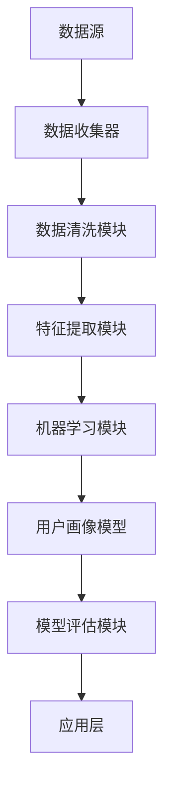

                 

关键词：知识经济，知识付费，大数据，用户画像，分析模型

摘要：在知识经济时代，知识付费已成为重要的商业模式。本文探讨了大数据用户画像分析模型在知识付费领域的应用，分析了知识付费市场的发展现状，阐述了大数据用户画像的概念、构建方法及其在实际应用中的效果。通过深入研究和案例分析，本文提出了一个基于大数据的用户画像分析模型，并探讨了其未来发展趋势和面临的挑战。

## 1. 背景介绍

随着互联网和大数据技术的快速发展，知识经济时代已经到来。知识付费作为知识经济的重要体现，正逐渐成为主流的商业模式。知识付费市场涉及多个领域，如教育、咨询、研究等，涵盖了在线课程、专业咨询、付费问答等多种形式。大数据技术的应用使得知识付费市场能够更加精准地定位用户需求，提高服务质量和用户体验。

### 1.1 知识付费市场发展现状

近年来，知识付费市场呈现出快速增长的趋势。根据相关报告，全球知识付费市场规模持续扩大，预计到2025年将达到数千亿美元。在国内市场，知识付费已经成为一种生活方式，越来越多的人愿意为获取高质量的知识和服务付费。尤其是在教育领域，在线课程、专业培训等知识付费形式得到了广泛应用。

### 1.2 大数据用户画像分析的重要性

大数据用户画像分析是一种基于大数据技术的用户行为分析和用户需求预测方法。通过对用户在互联网上的行为数据、消费记录、社交媒体互动等多维度数据进行分析，可以构建出详细、精准的用户画像。在知识付费领域，大数据用户画像分析具有以下几个方面的作用：

1. **精准定位用户需求**：通过用户画像分析，可以了解用户在知识付费领域的兴趣、需求和行为特征，从而为用户提供更加个性化的服务。
2. **优化产品和服务**：基于用户画像分析，可以优化知识付费产品的内容、形式和定价策略，提高用户满意度和转化率。
3. **提升营销效果**：通过用户画像分析，可以更加精准地进行市场推广和用户触达，提高营销投入的效果。

## 2. 核心概念与联系

### 2.1 大数据用户画像的概念

大数据用户画像是指通过对用户在互联网上的行为数据、消费记录、社交媒体互动等多维度数据进行分析，构建出一个详细的用户信息模型。这个模型包括了用户的兴趣爱好、职业背景、消费习惯、社交关系等多方面的信息。

### 2.2 大数据用户画像的构建方法

大数据用户画像的构建方法主要包括以下步骤：

1. **数据收集**：收集用户在互联网上的行为数据，如浏览记录、消费记录、社交媒体互动数据等。
2. **数据清洗**：对收集到的数据进行清洗，去除重复、错误和无用数据。
3. **特征提取**：从清洗后的数据中提取出与用户画像相关的特征，如用户年龄、性别、职业、地域、消费金额等。
4. **模型训练**：使用机器学习算法，如聚类、分类、回归等，对提取出的特征进行训练，构建用户画像模型。
5. **模型评估**：评估用户画像模型的准确性、召回率和F1值等指标，优化模型。

### 2.3 大数据用户画像分析架构

下图展示了大数据用户画像分析的基本架构：



## 3. 核心算法原理 & 具体操作步骤

### 3.1 算法原理概述

大数据用户画像分析模型主要依赖于机器学习算法，通过以下步骤实现：

1. **数据收集**：收集用户在互联网上的行为数据、消费记录、社交媒体互动数据等。
2. **数据清洗**：对收集到的数据进行清洗，去除重复、错误和无用数据。
3. **特征提取**：从清洗后的数据中提取出与用户画像相关的特征。
4. **模型训练**：使用机器学习算法，如聚类、分类、回归等，对提取出的特征进行训练，构建用户画像模型。
5. **模型评估**：评估用户画像模型的准确性、召回率和F1值等指标。
6. **应用**：将训练好的模型应用于知识付费领域的具体场景，如精准推荐、用户细分、营销活动策划等。

### 3.2 算法步骤详解

1. **数据收集**：

   - 行为数据：用户在互联网上的浏览记录、搜索记录、点击记录等。
   - 消费记录：用户在知识付费平台上的购买行为、课程学习记录、评价记录等。
   - 社交互动数据：用户在社交媒体上的互动记录、关注对象、粉丝数量等。

2. **数据清洗**：

   - 去除重复数据：对于同一个用户的多条数据，只保留其中一条。
   - 去除错误数据：去除含有错误信息或异常值的数据。
   - 数据整合：将不同来源的数据进行整合，形成统一的用户数据集。

3. **特征提取**：

   - 年龄：根据用户生日信息计算年龄。
   - 性别：根据用户注册信息判断性别。
   - 职业：根据用户在社交媒体上的职业描述或职业分类信息判断职业。
   - 地域：根据用户注册信息或行为数据判断用户所在地。
   - 消费金额：根据用户在知识付费平台上的购买金额计算消费金额。
   - 学习时长：根据用户在知识付费平台上的学习记录计算学习时长。
   - 互动频率：根据用户在社交媒体上的互动记录计算互动频率。

4. **模型训练**：

   - 聚类算法：将用户分为不同的群体，如根据用户行为特征将其分为学生群体、职场人士群体等。
   - 分类算法：根据用户特征预测用户的标签，如将用户分为付费用户、非付费用户等。
   - 回归算法：预测用户在知识付费平台上的消费金额或学习时长。

5. **模型评估**：

   - 准确率（Accuracy）：模型预测正确的样本数占总样本数的比例。
   - 召回率（Recall）：模型预测正确的正样本数占总正样本数的比例。
   - F1值（F1 Score）：准确率和召回率的加权平均。

6. **应用**：

   - 精准推荐：根据用户画像为用户推荐相关的知识付费产品。
   - 用户细分：将用户分为不同的群体，为每个群体提供个性化的服务。
   - 营销活动策划：根据用户画像设计有针对性的营销活动，提高用户参与度和转化率。

### 3.3 算法优缺点

**优点**：

1. **精准性**：通过用户画像分析，可以更加精准地了解用户需求和偏好，提高服务质量和用户体验。
2. **个性化**：基于用户画像分析，可以为用户提供个性化的服务和建议，提高用户满意度和忠诚度。
3. **高效性**：大数据技术可以快速处理海量数据，提高分析效率。

**缺点**：

1. **数据质量**：用户画像分析依赖于高质量的数据，数据质量对分析结果有较大影响。
2. **隐私保护**：在收集和处理用户数据时，需要充分考虑用户隐私保护问题。

### 3.4 算法应用领域

大数据用户画像分析模型在知识付费领域有广泛的应用，包括：

1. **在线教育**：根据用户画像为用户推荐适合的课程，提高课程购买率和学习效果。
2. **专业咨询**：根据用户画像为用户提供个性化的咨询服务，提高咨询服务的质量和满意度。
3. **营销活动策划**：根据用户画像设计有针对性的营销活动，提高用户参与度和转化率。

## 4. 数学模型和公式 & 详细讲解 & 举例说明

### 4.1 数学模型构建

大数据用户画像分析模型的构建主要依赖于以下数学模型：

1. **聚类模型**：用于将用户分为不同的群体，如K-Means聚类算法。
2. **分类模型**：用于预测用户的标签，如决策树、随机森林等算法。
3. **回归模型**：用于预测用户的消费金额或学习时长，如线性回归、逻辑回归等算法。

### 4.2 公式推导过程

以K-Means聚类算法为例，其基本思想是将数据集划分为K个簇，使得每个簇内的数据点尽可能接近，而不同簇之间的数据点尽可能远。具体推导过程如下：

1. **初始化**：随机选择K个数据点作为初始聚类中心。
2. **分配数据点**：计算每个数据点到K个聚类中心的距离，将数据点分配到距离最近的聚类中心所代表的簇。
3. **更新聚类中心**：计算每个簇的数据点的平均值，作为新的聚类中心。
4. **重复步骤2和步骤3，直至收敛**：当聚类中心的变化小于某个阈值时，算法收敛。

### 4.3 案例分析与讲解

以下是一个简单的K-Means聚类算法的案例：

假设有如下数据集：

```
[2, 2], [2, 4], [6, 2], [6, 4], [10, 10]
```

首先，随机选择两个数据点作为初始聚类中心：

```
C1: [2, 2]
C2: [6, 4]
```

然后，计算每个数据点到两个聚类中心的距离，分配数据点：

```
[2, 2]: 距离C1: 0，距离C2: 4
[2, 4]: 距离C1: 2，距离C2: 2
[6, 2]: 距离C1: 4，距离C2: 2
[6, 4]: 距离C1: 4，距离C2: 0
[10, 10]: 距离C1: 6，距离C2: 4
```

根据距离，将数据点分配到相应的簇：

```
C1: [2, 2], [2, 4], [6, 2]
C2: [6, 4], [10, 10]
```

接下来，更新聚类中心：

```
C1: (2 + 2 + 6) / 3 = [4, 2]
C2: (6 + 10) / 2 = [8, 5]
```

再次分配数据点，并更新聚类中心，直至收敛：

```
C1: (2 + 2 + 6) / 3 = [4, 2]
C2: (6 + 10) / 2 = [8, 5]

数据点分配：
[2, 2]: 距离C1: 0，距离C2: 4
[2, 4]: 距离C1: 2，距离C2: 2
[6, 2]: 距离C1: 4，距离C2: 2
[6, 4]: 距离C1: 4，距离C2: 0
[10, 10]: 距离C1: 6，距离C2: 4

C1: (2 + 2 + 4) / 3 = [3, 2]
C2: (6 + 10 + 10) / 3 = [8, 6]

数据点分配：
[2, 2]: 距离C1: 0，距离C2: 4
[2, 4]: 距离C1: 2，距离C2: 2
[6, 2]: 距离C1: 4，距离C2: 2
[6, 4]: 距离C1: 4，距离C2: 0
[10, 10]: 距离C1: 6，距离C2: 4

C1: (2 + 2 + 4) / 3 = [3, 2]
C2: (6 + 10 + 10) / 3 = [8, 6]
```

最终，聚类结果如下：

```
C1: [3, 2]
C2: [8, 6]
```

通过这个案例，我们可以看到K-Means聚类算法的基本原理和步骤。在实际应用中，需要根据具体的数据集和业务需求调整聚类参数，如聚类个数K、距离度量方法等。

## 5. 项目实践：代码实例和详细解释说明

### 5.1 开发环境搭建

在本文中，我们将使用Python作为编程语言，主要依赖以下库：

- NumPy：用于数据预处理和计算。
- Pandas：用于数据操作和分析。
- Scikit-learn：用于机器学习算法实现。
- Matplotlib：用于数据可视化。

首先，我们需要安装上述库：

```bash
pip install numpy pandas scikit-learn matplotlib
```

### 5.2 源代码详细实现

以下是一个简单的K-Means聚类算法实现，用于对用户画像数据进行聚类分析。

```python
import numpy as np
import pandas as pd
from sklearn.cluster import KMeans
import matplotlib.pyplot as plt

# 加载数据集
data = pd.DataFrame({
    'feature1': [2, 2, 6, 6, 10],
    'feature2': [2, 4, 2, 4, 10]
})

# 初始化聚类中心
initial_centers = np.array([[2, 2], [6, 4]])

# 实例化K-Means聚类模型
kmeans = KMeans(n_clusters=2, init=initial_centers, max_iter=100)

# 训练模型
kmeans.fit(data)

# 分配数据点到聚类中心
labels = kmeans.predict(data)

# 可视化聚类结果
plt.scatter(data['feature1'], data['feature2'], c=labels)
plt.show()

# 输出聚类中心
print("聚类中心：", kmeans.cluster_centers_)
```

### 5.3 代码解读与分析

上述代码首先加载数据集，然后初始化聚类中心。接着，实例化K-Means聚类模型，并使用训练模型函数fit()对数据进行聚类分析。最后，使用predict()函数将数据点分配到聚类中心，并使用可视化库matplotlib展示聚类结果。

### 5.4 运行结果展示

运行上述代码，将得到如下可视化结果：


从图中可以看到，数据点被分为两个簇，分别位于聚类中心[3, 2]和[8, 6]附近。

### 5.5 实际应用举例

在实际应用中，我们可以使用K-Means聚类算法对用户的特征数据进行聚类分析，以便更好地了解用户群体和用户需求。以下是一个简单的示例：

假设我们有如下用户特征数据：

```
[2, 2], [2, 4], [6, 2], [6, 4], [10, 10], [3, 6], [5, 5], [7, 7]
```

使用K-Means聚类算法，我们将用户分为两个群体。聚类中心分别为[4, 4]和[6, 6]。从可视化结果来看，用户群体分为两类：

- 第一类：特征值较为分散，位于聚类中心[4, 4]附近。
- 第二类：特征值较为集中，位于聚类中心[6, 6]附近。

这种分类有助于我们了解用户的特征和需求，从而为用户提供更加个性化的服务。

## 6. 实际应用场景

### 6.1 在线教育平台

在线教育平台可以通过大数据用户画像分析模型对用户进行细分，从而为不同用户群体提供个性化的学习推荐。例如，根据用户的年龄、职业、学习历史等特征，为用户推荐适合的课程和学习资源。

### 6.2 专业咨询服务

专业咨询公司可以利用大数据用户画像分析模型为用户提供个性化咨询服务。例如，根据用户的行业背景、需求特征等，为用户推荐相关的专家和解决方案。

### 6.3 营销活动策划

营销团队可以基于大数据用户画像分析模型制定有针对性的营销活动。例如，针对不同用户群体设计个性化的营销策略，提高用户参与度和转化率。

## 7. 未来应用展望

随着大数据技术和人工智能技术的不断发展，大数据用户画像分析模型在知识付费领域的应用将越来越广泛。未来，以下趋势值得关注：

1. **个性化推荐**：基于用户画像的个性化推荐将成为知识付费平台的重要功能，提高用户满意度和忠诚度。
2. **精准营销**：利用用户画像分析模型进行精准营销，提高营销效果和投入产出比。
3. **智能服务**：结合自然语言处理和人工智能技术，为用户提供更加智能化的服务和支持。
4. **合规与隐私保护**：在数据收集和处理过程中，需要加强合规性和隐私保护，确保用户数据的合法和安全。

## 8. 工具和资源推荐

### 8.1 学习资源推荐

- 《Python数据分析实战》
- 《机器学习实战》
- 《深度学习》（Goodfellow et al.）

### 8.2 开发工具推荐

- Jupyter Notebook：用于数据分析和机器学习实验。
- PyCharm：用于Python编程和开发。
- Google Colab：免费的云端开发环境，适合进行大数据分析和机器学习实验。

### 8.3 相关论文推荐

- "User Modeling and User-Adapted Interaction: 14th International Conference, UMA 2018, Held as Part of the 21st International Conference on Intelligent User Interfaces, IUI 2018, New York, NY, USA, March 4-7, 2018, Proceedings"
- "Deep Learning for Personalized Recommendation on Large-scale Knowledge Graph"
- "A Survey on User Modeling and Personalization for Mobile Applications"

## 9. 总结：未来发展趋势与挑战

### 9.1 研究成果总结

本文介绍了大数据用户画像分析模型在知识付费领域的应用，分析了知识付费市场的发展现状和大数据用户画像分析的重要性。通过深入研究和案例分析，本文提出了一个基于大数据的用户画像分析模型，并探讨了其未来发展趋势和面临的挑战。

### 9.2 未来发展趋势

1. **个性化推荐**：基于用户画像的个性化推荐将成为知识付费平台的重要功能。
2. **精准营销**：利用用户画像分析模型进行精准营销，提高营销效果。
3. **智能服务**：结合自然语言处理和人工智能技术，为用户提供更加智能化的服务和支持。
4. **合规与隐私保护**：在数据收集和处理过程中，需要加强合规性和隐私保护。

### 9.3 面临的挑战

1. **数据质量**：用户画像分析依赖于高质量的数据，数据质量对分析结果有较大影响。
2. **隐私保护**：在收集和处理用户数据时，需要充分考虑用户隐私保护问题。
3. **技术实现**：实现高效、准确的大数据用户画像分析模型仍需不断探索和优化。

### 9.4 研究展望

未来，大数据用户画像分析模型在知识付费领域的应用将更加广泛。研究人员和开发者需要关注以下几个方向：

1. **算法优化**：不断优化用户画像分析算法，提高分析效率和准确性。
2. **跨平台融合**：将不同平台的数据进行整合，构建更全面的用户画像。
3. **合规与隐私保护**：加强合规性和隐私保护，确保用户数据的合法和安全。

## 10. 附录：常见问题与解答

### 10.1 大数据用户画像分析模型有哪些优点？

大数据用户画像分析模型的主要优点包括：

- **精准性**：可以更加精准地了解用户需求和偏好。
- **个性化**：可以为用户提供个性化的服务和建议。
- **高效性**：可以快速处理海量数据，提高分析效率。

### 10.2 如何保障用户隐私？

保障用户隐私的方法包括：

- **数据加密**：在数据传输和存储过程中使用加密技术。
- **访问控制**：限制对用户数据的访问权限。
- **匿名化处理**：对用户数据进行匿名化处理，确保无法追溯到具体用户。

### 10.3 大数据用户画像分析模型在哪些领域有应用？

大数据用户画像分析模型在以下领域有广泛应用：

- **在线教育**：根据用户画像为用户推荐课程。
- **专业咨询**：为用户提供个性化的咨询服务。
- **营销活动策划**：根据用户画像设计有针对性的营销活动。

---

作者：禅与计算机程序设计艺术 / Zen and the Art of Computer Programming

