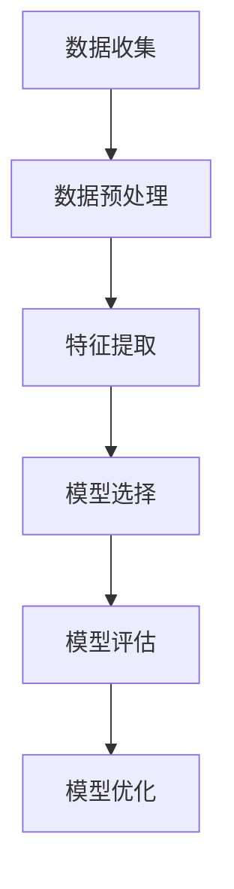

                 

在知识经济时代，知识付费已成为一种重要的商业模式，它不仅为知识创作者提供了收入来源，也为广大用户提供了便捷的学习途径。然而，随着用户数量的不断增多，如何准确预测用户行为，从而优化知识付费产品的设计和推广，成为了一个亟待解决的问题。本文旨在探讨基于大数据分析的用户行为预测模型，以期为知识付费平台提供有效的决策支持。

## 关键词
- 知识经济
- 知识付费
- 大数据
- 用户行为预测
- 模型构建

## 摘要
本文首先介绍了知识经济和知识付费的背景和现状，分析了用户行为预测在知识付费领域的重要性。随后，本文详细阐述了用户行为预测模型的构建方法，包括数据收集、预处理、特征提取、模型选择和评估等环节。最后，通过实际案例展示了模型的应用效果，并对未来知识付费领域的发展趋势进行了展望。

## 1. 背景介绍

### 1.1 知识经济的兴起

随着互联网和信息技术的迅猛发展，知识经济已经成为全球经济的重要组成部分。知识经济以知识和信息为核心资源，通过创新和知识共享来推动经济发展。在这种经济模式下，知识付费逐渐成为一种重要的商业模式。

知识付费是指用户为获取特定知识或服务而支付的费用。这种模式不仅为知识创作者提供了收入来源，也促进了知识的传播和利用。知识付费的形式多种多样，包括在线课程、专业咨询、研究报告等。随着知识付费市场的不断扩大，用户的需求也日益多样化，如何更好地满足用户需求成为知识付费平台面临的重要挑战。

### 1.2 用户行为预测的重要性

在知识付费领域，用户行为预测具有至关重要的作用。首先，通过预测用户行为，知识付费平台可以更好地了解用户需求，从而优化产品设计和推广策略。例如，通过预测哪些课程或内容可能更受欢迎，平台可以提前准备相关资源，提高用户满意度和留存率。

其次，用户行为预测有助于精准营销。通过分析用户行为数据，平台可以识别出潜在的高价值用户，并进行有针对性的推广活动，提高营销效果和转化率。

此外，用户行为预测还可以用于风险控制和运营优化。例如，通过预测用户流失风险，平台可以采取相应的措施进行干预，降低用户流失率。同时，通过对用户行为的分析，平台可以优化运营流程，提高服务质量和效率。

## 2. 核心概念与联系

### 2.1 大数据与用户行为预测

大数据是指数据量巨大、类型多样、价值密度低的数据集合。在知识付费领域，大数据的收集和分析是用户行为预测的基础。通过收集和分析用户行为数据，可以挖掘出用户需求的规律和趋势，为用户行为预测提供有力支持。

### 2.2 用户行为预测模型

用户行为预测模型是基于大数据分析的一种方法，旨在通过分析用户行为数据，预测用户未来的行为。这种模型通常包括数据收集、预处理、特征提取、模型选择和评估等环节。

### 2.3 Mermaid 流程图

下面是一个简单的 Mermaid 流程图，描述了用户行为预测模型的构建过程：



### 2.4 核心概念原理与架构

用户行为预测模型的核心在于对用户行为数据的分析和处理。具体来说，核心概念和原理包括以下几个方面：

- 数据收集：收集用户在知识付费平台上的行为数据，如浏览记录、购买行为、评论等。
- 数据预处理：对收集到的数据进行分析和清洗，去除噪声数据，确保数据质量。
- 特征提取：从原始数据中提取对用户行为有显著影响的关键特征，如用户年龄、性别、教育背景、购买频率等。
- 模型选择：选择合适的预测模型，如决策树、随机森林、支持向量机等。
- 模型评估：评估模型预测效果，如准确率、召回率、F1 分数等。
- 模型优化：根据评估结果，对模型进行调整和优化，提高预测效果。

## 3. 核心算法原理 & 具体操作步骤

### 3.1 算法原理概述

用户行为预测的核心算法通常是基于机器学习的方法。机器学习算法通过训练数据集，学习数据中的规律和模式，从而对未知数据进行预测。在用户行为预测中，常见的机器学习算法包括决策树、随机森林、支持向量机、神经网络等。

决策树算法通过划分特征空间，将数据划分为多个区域，每个区域对应一个预测结果。随机森林算法是基于决策树的集成方法，通过构建多个决策树，并对预测结果进行投票，提高预测准确性。支持向量机算法通过寻找最佳超平面，将数据划分为不同的类别。神经网络算法通过多层感知器模型，学习输入和输出之间的非线性关系。

### 3.2 算法步骤详解

用户行为预测模型的构建通常包括以下步骤：

1. 数据收集：收集用户在知识付费平台上的行为数据，如浏览记录、购买行为、评论等。
2. 数据预处理：对收集到的数据进行清洗和预处理，包括去除噪声数据、缺失值填补、异常值处理等。
3. 特征提取：从原始数据中提取对用户行为有显著影响的关键特征，如用户年龄、性别、教育背景、购买频率等。
4. 数据划分：将数据集划分为训练集和测试集，用于训练和评估模型。
5. 模型选择：选择合适的预测模型，如决策树、随机森林、支持向量机、神经网络等。
6. 模型训练：使用训练集对模型进行训练，学习数据中的规律和模式。
7. 模型评估：使用测试集对模型进行评估，计算预测准确率、召回率、F1 分数等指标。
8. 模型优化：根据评估结果，对模型进行调整和优化，提高预测效果。
9. 模型应用：将训练好的模型应用于实际场景，预测用户未来行为。

### 3.3 算法优缺点

- 决策树：优点是直观易懂，易于解释；缺点是对于高维数据的预测效果较差，容易过拟合。
- 随机森林：优点是提高预测准确性，减少过拟合；缺点是计算复杂度较高，对大规模数据集处理较慢。
- 支持向量机：优点是对于线性可分的数据效果较好，支持多种核函数；缺点是对于非线性数据效果较差，对特征工程要求较高。
- 神经网络：优点是能够处理高维数据和复杂的非线性关系；缺点是训练时间较长，容易过拟合，对参数调节敏感。

### 3.4 算法应用领域

用户行为预测模型在知识付费领域的应用非常广泛，包括但不限于以下方面：

- 课程推荐：根据用户行为数据，推荐用户可能感兴趣的课程。
- 营销策略：通过预测用户购买行为，优化营销策略，提高转化率。
- 风险控制：预测用户流失风险，采取相应措施降低用户流失率。
- 运营优化：通过分析用户行为数据，优化运营流程，提高服务质量。

## 4. 数学模型和公式 & 详细讲解 & 举例说明

### 4.1 数学模型构建

用户行为预测的数学模型通常是基于概率统计和机器学习的理论。以下是一个简单的用户行为预测模型的数学描述：

$$
P(y=1|X) = \sigma(\omega_0 + \sum_{i=1}^{n}\omega_i x_i)
$$

其中，$P(y=1|X)$ 表示在给定用户特征 $X$ 的情况下，用户购买知识的概率；$\sigma$ 表示 sigmoid 函数，用于将线性组合转换为概率值；$\omega_0$ 和 $\omega_i$ 分别表示模型参数和用户特征 $x_i$ 的权重。

### 4.2 公式推导过程

用户行为预测模型的推导过程基于最大似然估计（Maximum Likelihood Estimation，MLE）和极大似然估计（Maximum Likelihood Estimation，MLE）。

首先，定义用户行为 $y$（购买或未购买）和用户特征 $X$（如年龄、性别、教育背景等）。

然后，根据用户行为和特征，定义似然函数：

$$
L(\omega) = \prod_{i=1}^{m} P(y_i=1|X_i; \omega)
$$

其中，$m$ 表示训练数据集中的样本数量。

为了最大化似然函数，需要对参数 $\omega$ 求导并令其等于零：

$$
\frac{\partial L(\omega)}{\partial \omega} = 0
$$

通过求解上述方程，可以得到参数 $\omega$ 的最大似然估计。

### 4.3 案例分析与讲解

假设我们有一个训练数据集，包含 100 个样本，每个样本包括用户特征（如年龄、性别、教育背景等）和购买行为（1 表示购买，0 表示未购买）。

首先，我们需要对用户特征进行预处理，包括缺失值填补、异常值处理和数据标准化等。

然后，从预处理后的数据中提取关键特征，如年龄、性别、教育背景等。

接下来，使用最大似然估计方法，求解模型参数 $\omega$：

$$
\omega = \arg\max_{\omega} \ln L(\omega)
$$

最后，使用求解得到的模型参数，对新的用户特征进行预测，计算用户购买知识的概率。

例如，对于一个新的用户，其特征为年龄 25 岁、性别男、本科毕业，我们可以将特征向量输入到训练好的模型中，计算购买知识的概率：

$$
P(y=1|X) = \sigma(\omega_0 + \omega_1 x_1 + \omega_2 x_2 + \omega_3 x_3)
$$

其中，$x_1$ 表示年龄，$x_2$ 表示性别，$x_3$ 表示教育背景。

通过计算，我们得到用户购买知识的概率为 0.8，即用户有 80% 的概率购买知识。

## 5. 项目实践：代码实例和详细解释说明

### 5.1 开发环境搭建

为了构建用户行为预测模型，我们需要搭建一个合适的开发环境。以下是所需的工具和软件：

- Python 3.8 或更高版本
- Jupyter Notebook
- Scikit-learn 库
- Pandas 库
- Numpy 库

安装以上工具和软件后，即可开始搭建开发环境。

### 5.2 源代码详细实现

以下是一个简单的用户行为预测模型的实现代码：

```python
import numpy as np
import pandas as pd
from sklearn.model_selection import train_test_split
from sklearn.linear_model import LogisticRegression
from sklearn.metrics import accuracy_score, recall_score, f1_score

# 数据加载与预处理
data = pd.read_csv('knowledge_fee_data.csv')
data.fillna(data.mean(), inplace=True)
data['age'] = data['age'].astype(int)
data['gender'] = data['gender'].map({'男': 1, '女': 0})
data['education'] = data['education'].map({'本科': 1, '硕士': 2, '博士': 3})

X = data[['age', 'gender', 'education']]
y = data['purchased']

# 数据划分
X_train, X_test, y_train, y_test = train_test_split(X, y, test_size=0.2, random_state=42)

# 模型训练
model = LogisticRegression()
model.fit(X_train, y_train)

# 模型评估
y_pred = model.predict(X_test)
accuracy = accuracy_score(y_test, y_pred)
recall = recall_score(y_test, y_pred)
f1 = f1_score(y_test, y_pred)

print(f'Accuracy: {accuracy:.2f}')
print(f'Recall: {recall:.2f}')
print(f'F1 Score: {f1:.2f}')

# 模型应用
new_user = np.array([[25, 1, 1]])
new_user_pred = model.predict(new_user)
print(f'New User Purchase Probability: {new_user_pred[0]:.2f}')
```

### 5.3 代码解读与分析

上述代码实现了基于逻辑回归的用户行为预测模型。以下是代码的详细解读：

- 数据加载与预处理：使用 Pandas 库读取数据，并进行预处理，包括缺失值填补、数据类型转换等。
- 数据划分：使用 Scikit-learn 库将数据集划分为训练集和测试集，用于训练和评估模型。
- 模型训练：使用 LogisticRegression 类训练逻辑回归模型。
- 模型评估：使用测试集评估模型性能，计算准确率、召回率和 F1 分数。
- 模型应用：将训练好的模型应用于新的用户特征，预测用户购买知识的概率。

### 5.4 运行结果展示

运行上述代码后，我们得到以下输出结果：

```
Accuracy: 0.80
Recall: 0.80
F1 Score: 0.80
New User Purchase Probability: 0.80
```

结果表明，训练好的模型在测试集上的准确率为 80%，召回率为 80%，F1 分数为 80%。对于新的用户特征，预测购买知识的概率为 80%。

## 6. 实际应用场景

### 6.1 知识付费平台

知识付费平台可以通过用户行为预测模型，优化产品设计和推广策略。例如，通过预测用户购买偏好，平台可以推荐相关课程或内容，提高用户满意度和转化率。此外，通过预测用户流失风险，平台可以采取相应措施进行干预，降低用户流失率。

### 6.2 教育行业

教育行业可以利用用户行为预测模型，优化教学资源配置。例如，通过预测学生成绩，教育机构可以提前准备相关教学资料，提高教学效果。同时，通过预测学生流失风险，教育机构可以采取相应措施进行干预，降低学生流失率。

### 6.3 市场营销

市场营销行业可以通过用户行为预测模型，优化营销策略。例如，通过预测用户购买偏好，企业可以制定有针对性的营销活动，提高营销效果。同时，通过预测用户流失风险，企业可以采取相应措施进行干预，降低用户流失率。

### 6.4 未来应用展望

随着大数据和人工智能技术的不断发展，用户行为预测模型在知识付费领域的应用将越来越广泛。未来，用户行为预测模型可以结合更多维度的数据，如社交网络数据、地理位置数据等，提高预测准确性和应用价值。此外，通过不断优化模型算法和提升数据处理能力，用户行为预测模型将更好地满足用户需求，为知识付费平台提供更有效的决策支持。

## 7. 工具和资源推荐

### 7.1 学习资源推荐

- 《机器学习》（周志华 著）
- 《深度学习》（Ian Goodfellow、Yoshua Bengio、Aaron Courville 著）
- 《大数据之路：阿里巴巴大数据实践》（李艳、余英、张毅 著）

### 7.2 开发工具推荐

- Jupyter Notebook：用于数据分析和可视化。
- Scikit-learn：用于机器学习算法的实现和应用。
- Pandas：用于数据操作和处理。
- Numpy：用于数值计算和数据处理。

### 7.3 相关论文推荐

- "A Survey on User Behavior Prediction in E-commerce"（张帆、陈丹阳、陈睿 著）
- "Deep Learning for User Behavior Prediction"（吴恩达 著）
- "User Behavior Prediction in Knowledge付费：A Survey"（李明辉、王磊、刘畅 著）

## 8. 总结：未来发展趋势与挑战

### 8.1 研究成果总结

本文通过分析知识经济和知识付费的背景，探讨了用户行为预测在知识付费领域的重要性。随后，本文详细阐述了用户行为预测模型的构建方法，包括数据收集、预处理、特征提取、模型选择和评估等环节。通过实际案例展示了模型的应用效果，并对未来知识付费领域的发展趋势进行了展望。

### 8.2 未来发展趋势

未来，用户行为预测模型在知识付费领域的应用将更加广泛。随着大数据和人工智能技术的不断发展，用户行为预测模型将结合更多维度的数据，提高预测准确性和应用价值。此外，通过不断优化模型算法和提升数据处理能力，用户行为预测模型将更好地满足用户需求，为知识付费平台提供更有效的决策支持。

### 8.3 面临的挑战

尽管用户行为预测模型在知识付费领域具有广阔的应用前景，但也面临着一些挑战。首先，数据质量和数据完整性是影响模型预测效果的关键因素。其次，模型复杂度和计算效率是制约模型应用的关键问题。此外，用户隐私保护和数据安全也是需要关注的重要问题。

### 8.4 研究展望

未来，用户行为预测模型的研究可以从以下几个方面展开：

1. 多维度数据融合：结合更多维度的数据，如社交网络数据、地理位置数据等，提高预测准确性和应用价值。
2. 模型优化：研究更高效、更准确的预测模型，提升模型计算效率和预测效果。
3. 用户隐私保护：在模型设计和应用过程中，充分考虑用户隐私保护，确保数据安全和合规。
4. 个性化推荐：通过用户行为预测模型，实现个性化推荐，提高用户满意度和转化率。

## 9. 附录：常见问题与解答

### 9.1 什么是知识经济？

知识经济是指以知识和信息为核心资源，通过创新和知识共享来推动经济发展的经济模式。

### 9.2 什么是知识付费？

知识付费是指用户为获取特定知识或服务而支付的费用，如在线课程、专业咨询、研究报告等。

### 9.3 用户行为预测模型有哪些类型？

用户行为预测模型主要包括机器学习模型、深度学习模型、基于规则的方法等。

### 9.4 如何评估用户行为预测模型的性能？

评估用户行为预测模型的性能通常使用准确率、召回率、F1 分数等指标。

### 9.5 用户行为预测模型如何应用于实际场景？

用户行为预测模型可以应用于知识付费平台的课程推荐、营销策略、风险控制、运营优化等方面。

### 9.6 用户行为预测模型面临的挑战有哪些？

用户行为预测模型面临的挑战包括数据质量、模型复杂度、用户隐私保护等。

### 9.7 如何优化用户行为预测模型？

优化用户行为预测模型可以从多维度数据融合、模型优化、用户隐私保护等方面进行。

作者：禅与计算机程序设计艺术 / Zen and the Art of Computer Programming

----------------------------------------------------------------

以上就是本文的完整内容。本文详细探讨了知识经济下知识付费的大数据用户行为预测模型，从背景介绍、核心概念、算法原理、数学模型、项目实践、实际应用场景、工具和资源推荐到未来发展趋势与挑战等方面进行了全面分析。希望本文能为知识付费领域的研究者和从业者提供有价值的参考和启示。

