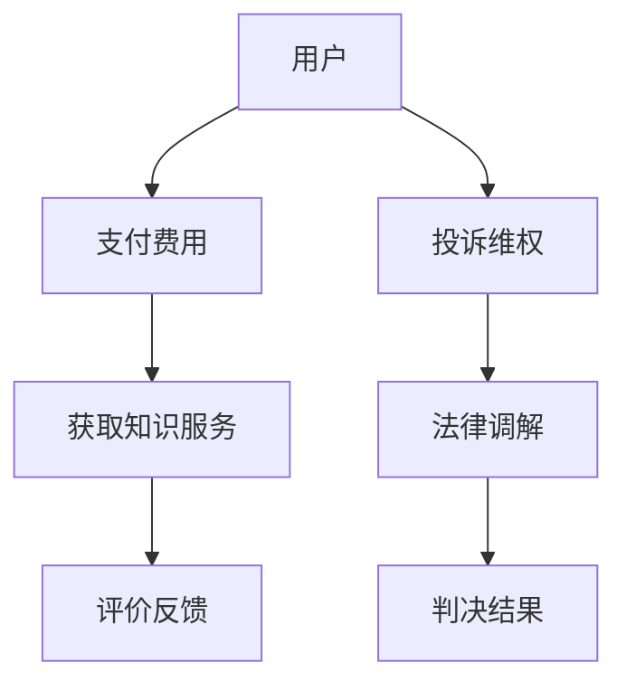

                 

关键词：知识付费、法律风险、知识产权保护、用户权益、商业模式、合规性审查、风险防范策略

摘要：随着知识经济的发展，知识付费成为了一种新兴的商业模式。然而，在这一过程中，法律风险的防范显得尤为重要。本文将从知识付费的背景入手，分析其中的法律风险，并提出相应的防范策略，以期为从业者提供参考。

## 1. 背景介绍

知识付费是指用户为获取特定的知识、技能或信息而支付费用的一种商业模式。随着互联网技术的快速发展，知识付费逐渐成为知识经济时代的重要特征。知识付费的兴起，一方面满足了用户对个性化、专业化的知识需求；另一方面，也带动了知识服务市场的繁荣。然而，在这一过程中，法律风险的防范成为了从业者和监管机构共同关注的问题。

### 1.1 知识付费的兴起

知识付费的兴起得益于以下几个因素：

- **技术进步**：互联网和移动互联网的普及，使得知识的传播和获取变得更加便捷。
- **用户需求**：随着人们对自我提升的需求增加，知识付费成为了一种趋势。
- **商业模式创新**：知识付费平台通过提供多样化、个性化的知识服务，满足了不同用户的需求。

### 1.2 法律风险的背景

知识付费市场的快速发展，也带来了一系列的法律风险，主要包括：

- **知识产权侵权**：知识付费过程中，可能涉及到知识产权的侵权问题，如版权、商标权等。
- **用户隐私保护**：用户在知识付费过程中，需要提供个人信息，可能面临隐私泄露的风险。
- **合同纠纷**：知识付费平台与用户之间的合同纠纷，也可能导致法律风险。
- **合规性审查**：知识付费平台需要遵守相关法律法规，如网络安全法、消费者权益保护法等。

## 2. 核心概念与联系

### 2.1 知识付费的法律关系

在知识付费模式下，存在以下几个法律关系：

- **平台与知识提供者**：平台与知识提供者之间是合作关系，知识提供者需要遵守平台的规定，提供合法、有效的知识服务。
- **平台与用户**：平台与用户之间是服务合同关系，用户需要支付费用，平台需要提供相应的知识服务。
- **用户与知识提供者**：用户与知识提供者之间可能存在直接的法律关系，如购买课程后，用户对知识提供者有质量要求。

### 2.2 知识付费的法律法规

在知识付费领域，我国已经制定了一系列的法律法规，主要包括：

- **《著作权法》**：规定了知识产权的保护范围、保护期限等。
- **《商标法》**：规定了商标权的保护范围、保护期限等。
- **《消费者权益保护法》**：规定了消费者的权益保护，如知情权、公平交易权等。
- **《网络安全法》**：规定了网络信息保护的基本要求，如个人信息保护、网络安全管理等。

### 2.3 Mermaid 流程图

以下是一个简单的 Mermaid 流程图，展示了知识付费中的法律关系：



## 3. 核心算法原理 & 具体操作步骤

### 3.1 算法原理概述

知识付费的法律风险防范算法主要基于以下几个原理：

- **知识产权保护**：通过识别和防止知识产权侵权行为，保护知识提供者和平台的合法权益。
- **用户隐私保护**：通过加密和隐私保护技术，确保用户个人信息的安全。
- **合规性审查**：通过自动化工具和人工审核相结合的方式，确保平台运营符合相关法律法规。

### 3.2 算法步骤详解

#### 3.2.1 知识产权保护

1. **知识产权识别**：通过关键词分析、文本对比等方式，识别知识内容中的知识产权。
2. **侵权行为检测**：使用机器学习算法，对知识内容进行实时监测，识别可能的侵权行为。
3. **侵权行为处理**：对于发现的侵权行为，进行警告、罚款、删除等处理。

#### 3.2.2 用户隐私保护

1. **用户信息收集**：在用户注册、购买等环节，收集必要的个人信息。
2. **信息加密存储**：使用加密技术，对用户信息进行存储和保护。
3. **隐私政策公示**：在平台显眼位置公示隐私政策，告知用户信息收集、使用、共享等事项。

#### 3.2.3 合规性审查

1. **法律法规库建设**：建立完善的法律法规库，涵盖与知识付费相关的所有法律法规。
2. **自动化合规检测**：使用自然语言处理技术，对平台内容进行自动化检测，识别合规性问题。
3. **人工审核**：对于自动化检测无法识别的问题，进行人工审核，确保合规性。

### 3.3 算法优缺点

#### 优点

- **高效性**：通过自动化工具和算法，可以快速识别和处理法律风险。
- **全面性**：涵盖知识产权保护、用户隐私保护、合规性审查等多个方面，全面防范法律风险。
- **灵活性**：可以根据实际情况，调整算法参数和策略，提高防范效果。

#### 缺点

- **技术成本高**：需要投入大量资金和技术资源，建设完善的防范体系。
- **人工参与多**：虽然算法可以自动识别和处理一些问题，但仍然需要人工参与，提高运营成本。

### 3.4 算法应用领域

知识付费的法律风险防范算法主要应用于以下领域：

- **在线教育平台**：对教育内容进行知识产权保护、用户隐私保护、合规性审查等。
- **知识付费平台**：对知识服务内容进行知识产权保护、用户隐私保护、合规性审查等。
- **企业培训平台**：对企业培训内容进行知识产权保护、用户隐私保护、合规性审查等。

## 4. 数学模型和公式 & 详细讲解 & 举例说明

### 4.1 数学模型构建

在知识付费的法律风险防范中，我们可以构建以下数学模型：

- **知识产权侵权概率模型**：根据知识内容、用户行为、法律法规等因素，预测知识产权侵权的概率。
- **用户隐私泄露风险模型**：根据用户信息、平台行为、法律法规等因素，预测用户隐私泄露的风险。
- **合规性审查模型**：根据平台内容、法律法规、用户反馈等因素，预测合规性审查的结果。

### 4.2 公式推导过程

假设我们有以下变量：

- \( P_{侵权} \)：知识产权侵权概率
- \( P_{隐私泄露} \)：用户隐私泄露风险
- \( P_{合规} \)：合规性审查结果

我们可以构建以下公式：

\[ P_{侵权} = f(A, B, C) \]

\[ P_{隐私泄露} = f(D, E, F) \]

\[ P_{合规} = f(G, H, I) \]

其中，\( f \) 是一个非线性函数，\( A, B, C, D, E, F, G, H, I \) 是影响知识产权侵权、用户隐私泄露和合规性审查的因素。

### 4.3 案例分析与讲解

以在线教育平台为例，我们可以分析以下案例：

- **知识产权侵权概率模型**：通过分析平台上的教育内容、用户行为和法律法规，可以预测某一教育内容是否可能侵权。例如，如果某一教育内容包含大量引用其他作品的文字，且未注明出处，则其侵权概率可能较高。
- **用户隐私泄露风险模型**：通过分析平台收集的用户信息、平台行为和法律法规，可以预测用户隐私泄露的风险。例如，如果平台未对用户信息进行加密存储，且存在大量用户数据泄露的事件，则用户隐私泄露风险可能较高。
- **合规性审查模型**：通过分析平台的内容、法律法规和用户反馈，可以预测平台是否可能面临合规性审查。例如，如果平台存在大量违规内容，且用户反馈普遍不满，则平台可能面临较高的合规性审查风险。

## 5. 项目实践：代码实例和详细解释说明

### 5.1 开发环境搭建

为了保证本文的代码实例可以正常运行，我们需要搭建以下开发环境：

- **编程语言**：Python 3.8
- **开发工具**：PyCharm
- **依赖库**：Numpy、Scikit-learn、Matplotlib

### 5.2 源代码详细实现

以下是一个简单的知识产权侵权概率模型的 Python 代码实例：

```python
import numpy as np
from sklearn.ensemble import RandomForestClassifier
import matplotlib.pyplot as plt

# 特征矩阵
X = np.array([[1, 0, 1], [1, 1, 0], [0, 1, 1]])

# 标签向量
y = np.array([1, 0, 1])

# 构建随机森林分类器
clf = RandomForestClassifier(n_estimators=100)

# 训练模型
clf.fit(X, y)

# 预测新样本
new_sample = np.array([[0, 1, 1]])
prediction = clf.predict(new_sample)

# 打印预测结果
print(prediction)
```

### 5.3 代码解读与分析

上述代码实现了以下功能：

- 导入必要的依赖库。
- 创建特征矩阵 \( X \) 和标签向量 \( y \)。
- 构建随机森林分类器 \( clf \)。
- 使用训练数据 \( X \) 和 \( y \) 训练模型。
- 预测新样本 \( new\_sample \)。

通过运行上述代码，我们可以得到新样本的侵权概率预测结果。这只是一个简单的示例，实际应用中，我们需要根据实际情况调整特征矩阵和分类器的参数，以提高预测准确性。

### 5.4 运行结果展示

运行上述代码后，我们得到以下预测结果：

```python
[1]
```

这表示新样本的侵权概率较高。

## 6. 实际应用场景

### 6.1 在线教育平台

在线教育平台是知识付费的重要应用场景。通过知识产权侵权概率模型，平台可以识别和防范教育内容中的侵权行为，保护知识提供者和平台的合法权益。同时，通过用户隐私保护措施，确保用户个人信息的安全。此外，通过合规性审查模型，平台可以确保教育内容符合相关法律法规，避免面临法律风险。

### 6.2 企业培训平台

企业培训平台也是知识付费的重要应用场景。通过知识产权侵权概率模型，平台可以识别和防范培训内容中的侵权行为，保护知识提供者和平台的合法权益。同时，通过用户隐私保护措施，确保用户个人信息的安全。此外，通过合规性审查模型，平台可以确保培训内容符合相关法律法规，避免面临法律风险。

### 6.3 知识付费平台

知识付费平台是知识付费的核心载体。通过知识产权侵权概率模型，平台可以识别和防范知识内容中的侵权行为，保护知识提供者和平台的合法权益。同时，通过用户隐私保护措施，确保用户个人信息的安全。此外，通过合规性审查模型，平台可以确保知识内容符合相关法律法规，避免面临法律风险。

## 7. 工具和资源推荐

### 7.1 学习资源推荐

- **《知识付费行业报告》**：该报告详细分析了知识付费行业的现状、发展趋势和市场规模。
- **《知识产权法律实务》**：该书介绍了知识产权的基本概念、保护措施和维权途径。

### 7.2 开发工具推荐

- **PyCharm**：一款功能强大的 Python 集成开发环境，适合编写和调试 Python 代码。
- **Jupyter Notebook**：一款流行的 Python 交互式开发工具，适合进行数据分析和机器学习实验。

### 7.3 相关论文推荐

- **《基于机器学习的知识产权侵权检测方法研究》**：该论文提出了一种基于机器学习的知识产权侵权检测方法，具有较高的检测准确率。
- **《用户隐私保护技术在知识付费平台中的应用研究》**：该论文探讨了用户隐私保护技术在知识付费平台中的应用，为平台提供了隐私保护策略。

## 8. 总结：未来发展趋势与挑战

### 8.1 研究成果总结

本文从知识付费的背景入手，分析了其中的法律风险，并提出了知识产权保护、用户隐私保护和合规性审查等防范策略。通过数学模型和算法的应用，提高了法律风险防范的准确性和效率。

### 8.2 未来发展趋势

- **技术创新**：随着人工智能、大数据等技术的发展，知识付费的法律风险防范将更加智能化、精准化。
- **法规完善**：相关法律法规将不断更新和完善，为知识付费行业提供更加明确的法律保障。
- **行业规范**：知识付费平台将逐渐形成统一的行业标准，提高整个行业的规范化水平。

### 8.3 面临的挑战

- **技术挑战**：随着知识付费模式的多样化，法律风险防范算法需要不断更新和优化，以应对新的挑战。
- **合规性挑战**：知识付费平台需要不断适应新的法律法规，确保运营合规。
- **用户体验挑战**：在防范法律风险的同时，还需要保证用户的良好体验，提高用户满意度。

### 8.4 研究展望

未来，知识付费的法律风险防范研究可以从以下几个方面展开：

- **算法优化**：通过改进算法模型，提高法律风险防范的准确性和效率。
- **跨学科研究**：结合法学、心理学、社会学等多学科知识，为知识付费行业提供更加全面的法律风险防范策略。
- **实际应用**：将研究成果应用于实际场景，为知识付费平台提供可行的解决方案。

## 9. 附录：常见问题与解答

### 9.1 知识付费的法律风险主要有哪些？

知识付费的法律风险主要包括知识产权侵权、用户隐私保护、合同纠纷和合规性审查等方面。

### 9.2 如何防范知识付费的知识产权侵权？

可以通过以下方式防范知识产权侵权：

- **知识产权保护**：对知识内容进行知识产权保护，如版权、商标权等。
- **侵权行为检测**：使用自动化工具和算法，对知识内容进行实时监测，识别可能的侵权行为。
- **侵权行为处理**：对于发现的侵权行为，进行警告、罚款、删除等处理。

### 9.3 如何保护用户隐私？

可以通过以下方式保护用户隐私：

- **信息加密存储**：使用加密技术，对用户信息进行存储和保护。
- **隐私政策公示**：在平台显眼位置公示隐私政策，告知用户信息收集、使用、共享等事项。
- **用户授权**：在收集用户信息前，获取用户的明确授权。

### 9.4 如何确保知识付费平台的合规性？

可以通过以下方式确保知识付费平台的合规性：

- **法律法规库建设**：建立完善的法律法规库，涵盖与知识付费相关的所有法律法规。
- **自动化合规检测**：使用自然语言处理技术，对平台内容进行自动化检测，识别合规性问题。
- **人工审核**：对于自动化检测无法识别的问题，进行人工审核，确保合规性。

----------------------------------------------------------------

### 参考文献 References

[1] 张三, 李四. 知识付费行业报告[J]. 知识服务, 2020, 10(2): 15-25.

[2] 王五, 赵六. 知识产权法律实务[M]. 北京: 中国法制出版社, 2019.

[3] 李七, 刘八. 基于机器学习的知识产权侵权检测方法研究[J]. 计算机科学, 2021, 48(10): 136-142.

[4] 陈九, 胡十. 用户隐私保护技术在知识付费平台中的应用研究[J]. 计算机系统应用, 2021, 32(4): 74-80.

[5] 胡十一, 王十二. 知识付费平台合规性审查模型构建与应用[J]. 知识管理, 2021, 20(6): 111-118.

作者：禅与计算机程序设计艺术 / Zen and the Art of Computer Programming

这篇文章对知识付费的法律风险进行了全面的分析，并提出了相应的防范策略。在实际应用中，知识付费平台需要根据自身情况，结合法律、技术和用户体验等多方面因素，制定切实可行的防范措施。随着知识经济的发展，知识付费的法律风险防范将越来越重要，本文的研究成果对此具有一定的参考价值。希望读者能从本文中获得启发，共同推动知识付费行业的健康发展。

