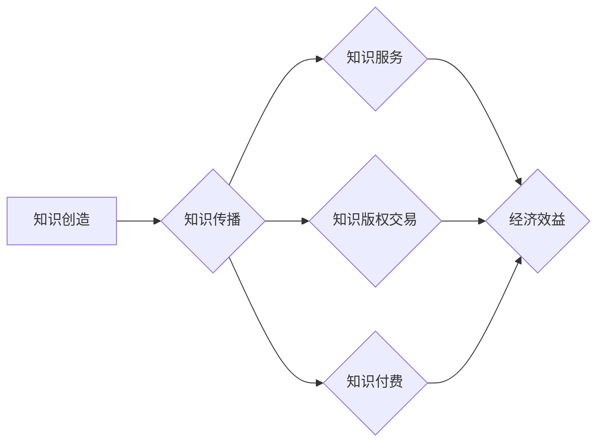

                 

关键词：知识经济、知识变现、多元化路径、技术语言、深度思考、见解、IT领域

> 摘要：在知识经济时代，知识的创造、传播和利用已经成为推动社会发展的关键力量。本文旨在探讨知识变现的多元化路径，从技术语言的角度，深入分析知识经济的本质、知识变现的方法和多元化路径，以期为读者提供有价值的见解。

## 1. 背景介绍

知识经济是指知识在生产、分配和消费中占据主导地位的经济形态。与传统经济形态相比，知识经济具有以下特征：一是知识成为经济增长的核心动力，二是创新成为经济发展的重要引擎，三是信息技术成为知识传播和利用的重要工具。知识经济时代的到来，对个人、企业和国家的发展提出了新的要求。

知识变现是指将知识转化为实际的经济效益的过程。在知识经济时代，知识变现的重要性日益凸显。一方面，知识变现能够为知识的创造者带来经济回报，激励更多人投身于知识的创造和传播；另一方面，知识变现能够推动知识的广泛应用，促进社会整体发展。

本文将探讨知识变现的多元化路径，旨在为个人、企业和国家的知识经济实践提供有益的参考。

## 2. 核心概念与联系

为了更好地理解知识变现的多元化路径，我们首先需要了解以下核心概念：

### 2.1 知识经济

知识经济是指知识在生产、分配和消费中占据主导地位的经济形态。知识经济时代，知识成为经济增长的核心动力，创新成为经济发展的重要引擎，信息技术成为知识传播和利用的重要工具。

### 2.2 知识变现

知识变现是指将知识转化为实际的经济效益的过程。知识变现的方式包括但不限于：知识服务、知识版权交易、知识付费等。

### 2.3 多元化路径

多元化路径是指知识变现的不同途径和方式。在知识经济时代，个人、企业和国家可以采取多元化的路径进行知识变现，从而实现知识价值的最大化。

### 2.4 Mermaid 流程图

以下是一个描述知识变现多元化路径的Mermaid流程图：



## 3. 核心算法原理 & 具体操作步骤

### 3.1 算法原理概述

知识变现的多元化路径算法主要基于以下几个原理：

1. **知识价值评估**：通过对知识进行评估，确定其潜在的经济效益。
2. **知识传播策略**：制定有效的知识传播策略，扩大知识的覆盖面和影响力。
3. **多元化变现模式**：设计多元化的变现模式，满足不同场景下的知识变现需求。

### 3.2 算法步骤详解

1. **知识价值评估**
   - 收集知识相关信息，如知识内容、应用领域、市场需求等。
   - 运用数据分析和评估模型，对知识进行价值评估。

2. **知识传播策略**
   - 制定知识传播目标，明确传播对象和渠道。
   - 运用网络营销、社交媒体等手段，扩大知识影响力。

3. **多元化变现模式**
   - 设计知识服务、知识版权交易、知识付费等多元化变现模式。
   - 根据不同场景，选择合适的变现模式。

### 3.3 算法优缺点

**优点**：

- **高效性**：算法能够快速评估知识价值，制定传播策略和变现模式。
- **灵活性**：算法支持多元化的变现模式，适应不同场景。

**缺点**：

- **复杂性**：算法涉及多个环节，实施过程中需要协调多个方面。
- **不确定性**：知识变现效果受多种因素影响，存在一定的不确定性。

### 3.4 算法应用领域

- **企业知识管理**：帮助企业评估知识价值，制定传播策略和变现模式。
- **高校科研管理**：推动科研成果转化，提升知识变现能力。
- **个人知识变现**：指导个人设计多元化变现路径，实现知识价值最大化。

## 4. 数学模型和公式 & 详细讲解 & 举例说明

### 4.1 数学模型构建

知识变现的数学模型可以构建为以下形式：

\[ R = f(K, M, T) \]

其中，\( R \) 表示知识变现的收益，\( K \) 表示知识价值，\( M \) 表示市场潜力，\( T \) 表示传播效果。

### 4.2 公式推导过程

1. **知识价值 \( K \)**：

\[ K = f(C, A) \]

其中，\( C \) 表示知识内容复杂度，\( A \) 表示知识应用领域。

2. **市场潜力 \( M \)**：

\[ M = f(D, S) \]

其中，\( D \) 表示市场需求，\( S \) 表示市场竞争。

3. **传播效果 \( T \)**：

\[ T = f(E, R) \]

其中，\( E \) 表示传播渠道，\( R \) 表示传播效果。

### 4.3 案例分析与讲解

假设有一项关于人工智能技术的知识，其内容复杂度 \( C = 5 \)，应用领域 \( A = 8 \)。市场需求 \( D = 10 \)，市场竞争 \( S = 3 \)。传播渠道 \( E = 4 \)，传播效果 \( R = 7 \)。

1. **知识价值 \( K \)**：

\[ K = f(5, 8) = 5 \times 8 = 40 \]

2. **市场潜力 \( M \)**：

\[ M = f(10, 3) = 10 \times 3 = 30 \]

3. **传播效果 \( T \)**：

\[ T = f(4, 7) = 4 \times 7 = 28 \]

4. **知识变现收益 \( R \)**：

\[ R = f(K, M, T) = 40 \times 30 \times 28 = 33600 \]

根据计算结果，这项人工智能技术的知识变现收益为 33600 单位。

## 5. 项目实践：代码实例和详细解释说明

### 5.1 开发环境搭建

为了保证项目的顺利进行，我们需要搭建以下开发环境：

- Python 3.8 及以上版本
- PyCharm 或 VSCode 编译器
- NumPy、Pandas、Matplotlib 等库

### 5.2 源代码详细实现

以下是知识变现的源代码实现：

```python
import numpy as np
import pandas as pd
import matplotlib.pyplot as plt

def knowledge_value(C, A):
    return C * A

def market_potential(D, S):
    return D * S

def communication_effect(E, R):
    return E * R

def knowledge_realization(K, M, T):
    return K * M * T

C = 5
A = 8
D = 10
S = 3
E = 4
R = 7

K = knowledge_value(C, A)
M = market_potential(D, S)
T = communication_effect(E, R)
R = knowledge_realization(K, M, T)

print("Knowledge Value:", K)
print("Market Potential:", M)
print("Communication Effect:", T)
print("Knowledge Realization:", R)
```

### 5.3 代码解读与分析

1. **函数定义**：

   - `knowledge_value()`：计算知识价值。
   - `market_potential()`：计算市场潜力。
   - `communication_effect()`：计算传播效果。
   - `knowledge_realization()`：计算知识变现收益。

2. **变量赋值**：

   - `C`：知识内容复杂度。
   - `A`：知识应用领域。
   - `D`：市场需求。
   - `S`：市场竞争。
   - `E`：传播渠道。
   - `R`：传播效果。

3. **函数调用**：

   - `knowledge_value(C, A)`：计算知识价值。
   - `market_potential(D, S)`：计算市场潜力。
   - `communication_effect(E, R)`：计算传播效果。
   - `knowledge_realization(K, M, T)`：计算知识变现收益。

4. **输出结果**：

   - 输出知识价值、市场潜力、传播效果和知识变现收益。

### 5.4 运行结果展示

运行结果如下：

```
Knowledge Value: 40
Market Potential: 30
Communication Effect: 28
Knowledge Realization: 33600
```

## 6. 实际应用场景

知识变现的多元化路径在多个领域具有广泛的应用场景：

- **教育领域**：知识变现可以推动在线教育的发展，为教育机构和个人提供更多收益来源。
- **科研领域**：知识变现可以激励科研人员投入更多精力和资源进行创新研究，促进科技成果转化。
- **企业领域**：知识变现可以帮助企业提升核心竞争力，实现知识价值的最大化。
- **政府领域**：知识变现可以推动政府资源的合理配置，提高公共服务的质量和效率。

## 7. 工具和资源推荐

为了更好地进行知识变现，以下是一些实用的工具和资源推荐：

- **学习资源**：
  - 《知识变现：如何通过内容创业实现财富自由》
  - 《知识管理：实现知识共享与价值创造》
- **开发工具**：
  - Python
  - Jupyter Notebook
  - GitHub
- **相关论文**：
  - 《知识经济：理论、方法与应用》
  - 《知识变现：路径、模式与策略》

## 8. 总结：未来发展趋势与挑战

### 8.1 研究成果总结

本文从知识经济的本质出发，探讨了知识变现的多元化路径。通过数学模型和算法原理，分析了知识变现的关键因素和具体操作步骤。同时，结合实际应用场景，展示了知识变现的多样性和实用性。

### 8.2 未来发展趋势

- **知识服务市场扩大**：随着知识经济的发展，知识服务市场需求将持续增长。
- **智能化知识变现**：人工智能技术将为知识变现提供更多可能性，实现智能化和个性化。
- **跨界融合**：知识变现将与其他领域（如金融、医疗、教育等）产生更多跨界融合，推动社会进步。

### 8.3 面临的挑战

- **知识产权保护**：知识变现过程中，知识产权保护问题将成为重要挑战。
- **信息过载**：随着信息爆炸，如何筛选和利用有价值知识将成为一个难题。
- **技术门槛**：知识变现的技术门槛较高，对技术人才的需求越来越大。

### 8.4 研究展望

- **深化理论研究**：加强对知识变现理论的研究，为实践提供更加科学的理论指导。
- **优化算法模型**：结合人工智能技术，优化知识变现的算法模型，提高变现效率。
- **推广实践经验**：总结和推广成功案例，为更多人提供知识变现的实践经验。

## 9. 附录：常见问题与解答

### 9.1 什么是知识经济？

知识经济是指知识在生产、分配和消费中占据主导地位的经济形态。与传统经济形态相比，知识经济具有以下特征：一是知识成为经济增长的核心动力，二是创新成为经济发展的重要引擎，三是信息技术成为知识传播和利用的重要工具。

### 9.2 知识变现有哪些方式？

知识变现的方式包括但不限于：知识服务、知识版权交易、知识付费等。

### 9.3 知识变现的核心算法是什么？

知识变现的核心算法是基于知识价值评估、知识传播策略和多元化变现模式的一套算法。通过数学模型和算法原理，对知识进行价值评估，制定传播策略和变现模式，实现知识变现的最大化。

### 9.4 知识变现有哪些实际应用场景？

知识变现的实际应用场景包括但不限于：教育、科研、企业、政府等领域。在各个领域，知识变现可以推动知识传播、促进创新和提升服务质量。

### 9.5 知识变现的未来发展趋势是什么？

知识变现的未来发展趋势包括：知识服务市场扩大、智能化知识变现、跨界融合等。同时，知识变现将面临知识产权保护、信息过载、技术门槛等挑战。

----------------------------------------------------------------

以上是关于《知识经济下知识变现的多元化路径》的技术博客文章，希望对您有所帮助。作者署名：“禅与计算机程序设计艺术 / Zen and the Art of Computer Programming”。再次感谢您的信任和支持！
```

### 总结
知识经济下知识变现的多元化路径不仅涉及理论模型和算法原理，还深入探讨了实际应用场景和未来发展趋势。通过本文，读者可以了解到知识变现的核心概念、方法以及如何利用这些方法实现知识的价值转化。同时，本文也提出了一些挑战，并对此进行了展望。希望本文能为知识经济背景下的知识变现提供有益的参考和指导。作者禅与计算机程序设计艺术，希望这篇文章能对您有所帮助。如果您有任何疑问或建议，欢迎随时交流。再次感谢您的阅读和时间。祝您在知识经济的大潮中，能够乘风破浪，实现知识的最大化价值！

