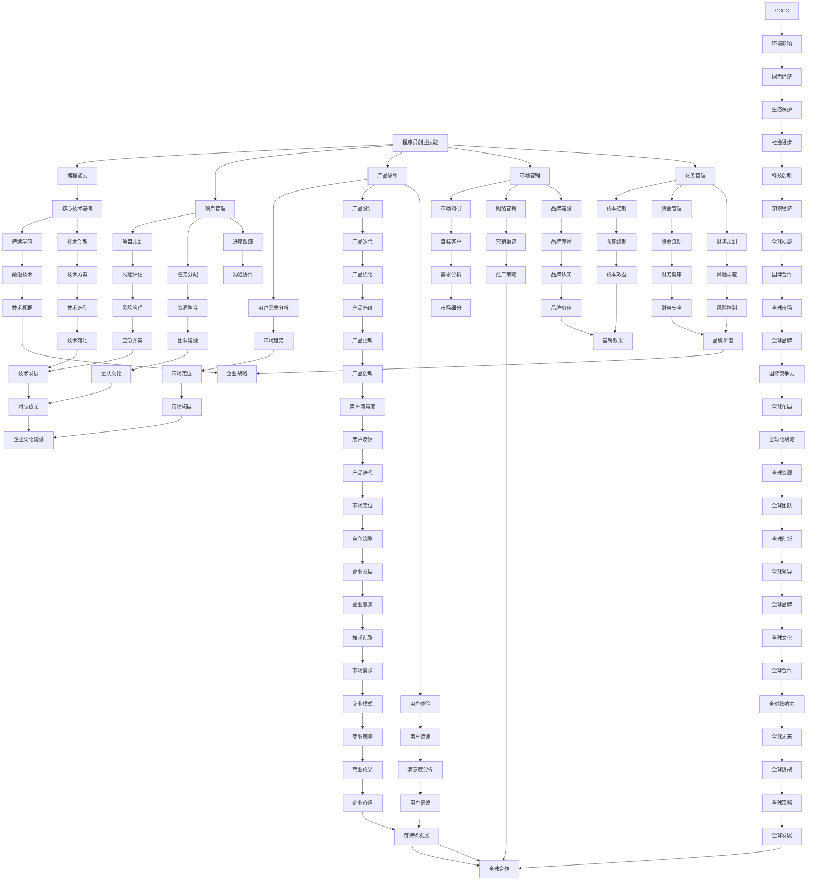

                 

关键词：知识经济、程序员、创业、技能提升、市场机遇、技术创新

摘要：本文深入探讨了知识经济时代下，程序员如何通过创业实现个人价值和企业发展的双赢。文章分析了知识经济的特点，阐述了程序员在创业过程中所需的核心技能和面临的挑战，并提出了具体的策略和建议，为编程爱好者提供了实用的指导。

## 1. 背景介绍

在知识经济时代，信息技术飞速发展，互联网、大数据、人工智能等新兴领域不断涌现，为各行各业带来了前所未有的变革。在这个背景下，程序员作为信息技术的重要推动者，其地位日益凸显。同时，随着创业环境的不断优化，越来越多的程序员选择投身创业，以期在技术创新和商业实践中实现个人价值。

然而，知识经济的特性也带来了一系列新的挑战。快速变化的技术环境、激烈的竞争、人才短缺等问题，都使得程序员的创业之路充满不确定性。本文将从以下几个方面，探讨程序员在知识经济时代如何通过创业实现个人价值和企业发展的双赢。

### 1.1 知识经济的定义与特点

知识经济是一种以知识为主要生产要素的经济形态。与传统的以自然资源、劳动力为主的经济模式不同，知识经济强调知识创新、信息传播和知识共享。其主要特点包括：

- **知识驱动**：知识成为经济增长的核心动力，创新和研发活动频繁。
- **全球化**：知识经济使全球市场更加紧密地联系在一起，跨国界的信息交流和资源共享日益普遍。
- **高技术含量**：信息技术、生物技术、新材料技术等高技术产业在知识经济中占据重要地位。
- **可持续性**：知识经济更注重可持续发展，强调资源节约、环境保护和生态平衡。

### 1.2 程序员在知识经济中的角色

在知识经济时代，程序员作为信息技术的直接实施者，扮演着至关重要的角色。他们不仅需要掌握传统的编程技能，还需要具备以下几方面的能力：

- **技术视野**：紧跟技术发展趋势，了解新兴技术，如人工智能、区块链等。
- **创新思维**：善于从问题中发现机会，运用技术解决问题，推动技术进步。
- **团队协作**：在项目开发过程中，程序员需要与不同背景的专业人员紧密合作，提升协作能力。
- **市场敏感度**：了解市场需求，把握商业机会，实现技术与市场的有效结合。

## 2. 核心概念与联系

### 2.1 程序员创业的核心技能

程序员创业的成功离不开以下核心技能：

- **编程能力**：这是程序员的基本功，无论是前端开发、后端服务，还是数据库管理，都需要扎实的编程基础。
- **项目管理**：创业者需要掌握项目规划、任务分配、进度跟踪等项目管理知识，确保项目顺利进行。
- **产品思维**：理解用户需求，设计优秀的产品体验，是程序员创业者成功的关键。
- **市场营销**：了解市场推广策略，掌握网络营销手段，提高产品知名度。
- **财务管理**：掌握基本的财务知识，进行有效的成本控制和资金管理。

### 2.2 创业过程中面临的挑战

- **技术风险**：技术创新的不确定性和技术落地的难度，都是程序员创业者需要面对的风险。
- **市场风险**：市场需求的变化、竞争对手的冲击，都可能对创业项目产生重大影响。
- **团队管理**：构建和管理一个高效团队，是程序员创业者的重要挑战。

### 2.3 解决方案与策略

- **技术风险**：通过持续学习和技术创新，提高技术的成熟度和竞争力。
- **市场风险**：深入市场调研，了解用户需求，灵活调整产品策略。
- **团队管理**：注重团队建设，培养团队凝聚力，提高团队执行力。

### 2.4 Mermaid 流程图



## 3. 核心算法原理 & 具体操作步骤

### 3.1 算法原理概述

在程序员创业过程中，算法设计是关键技术之一。以下介绍几种常见的算法原理和其在创业中的应用。

#### 3.1.1 排序算法

排序算法是数据处理的基础，常见的排序算法包括冒泡排序、选择排序、插入排序等。这些算法的基本原理是通过比较和交换元素的位置，实现数组的有序排列。在创业中，排序算法可以用于数据清洗、用户行为分析等场景，帮助创业者更好地理解用户需求和市场趋势。

#### 3.1.2 搜索算法

搜索算法是另一种基础算法，常见的搜索算法包括线性搜索、二分搜索等。这些算法的基本原理是在给定的数据结构中查找特定元素。在创业中，搜索算法可以用于用户信息检索、推荐系统等场景，提高用户体验和用户满意度。

#### 3.1.3 动态规划

动态规划是一种解决复杂问题的算法思想，其基本原理是将问题分解为若干子问题，并存储子问题的解，以避免重复计算。在创业中，动态规划可以用于资源优化、路径规划等场景，提高资源利用效率和项目成功率。

### 3.2 算法步骤详解

#### 3.2.1 冒泡排序

冒泡排序的基本步骤如下：

1. 从数组的第一个元素开始，比较相邻的两个元素，如果第一个比第二个大，就交换它们的位置。
2. 对每一对相邻元素做同样的工作，从开始第一对到结尾的最后一对。在这一点，最后的元素应该会是最大的数。
3. 针对所有的元素重复以上的步骤，除了最后一个。
4. 重复步骤1-3，直到排序完成。

```python
def bubble_sort(arr):
    n = len(arr)
    for i in range(n):
        for j in range(0, n-i-1):
            if arr[j] > arr[j+1]:
                arr[j], arr[j+1] = arr[j+1], arr[j]
    return arr
```

#### 3.2.2 二分搜索

二分搜索的基本步骤如下：

1. 确定查找范围，初始时为整个数组。
2. 计算中间位置，将中间位置的元素与目标元素进行比较。
3. 如果中间位置的元素等于目标元素，查找成功，返回位置。
4. 如果中间位置的元素大于目标元素，则在左侧子数组中继续查找。
5. 如果中间位置的元素小于目标元素，则在右侧子数组中继续查找。
6. 重复步骤2-5，直到找到目标元素或确定不存在。

```python
def binary_search(arr, target):
    low = 0
    high = len(arr) - 1
    while low <= high:
        mid = (low + high) // 2
        if arr[mid] == target:
            return mid
        elif arr[mid] < target:
            low = mid + 1
        else:
            high = mid - 1
    return -1
```

#### 3.2.3 动态规划

动态规划的基本步骤如下：

1. 确定状态表示，将问题分解为若干子问题，并定义状态变量。
2. 确定状态转移方程，描述子问题之间的关系。
3. 初始化状态表，通常从基础状态开始。
4. 根据状态转移方程，逐步求解子问题的最优解，最终得到原问题的最优解。

```python
def Fibonacci(n):
    if n <= 1:
        return n
    fib = [0] * (n+1)
    fib[1] = 1
    for i in range(2, n+1):
        fib[i] = fib[i-1] + fib[i-2]
    return fib[n]
```

### 3.3 算法优缺点

- **冒泡排序**：简单易懂，但时间复杂度为 \(O(n^2)\)，效率较低。
- **二分搜索**：时间复杂度为 \(O(\log n)\)，效率较高，但需要有序的数据结构。
- **动态规划**：适用于解决复杂问题，但需要一定的数学基础和思考能力。

### 3.4 算法应用领域

- **冒泡排序**：适用于数据量较小、对效率要求不高的场景。
- **二分搜索**：适用于大规模数据的高效查找场景。
- **动态规划**：适用于资源优化、路径规划等复杂问题。

## 4. 数学模型和公式 & 详细讲解 & 举例说明

### 4.1 数学模型构建

在程序员创业过程中，数学模型可以帮助创业者进行数据分析和决策。以下介绍几种常见的数学模型。

#### 4.1.1 线性回归模型

线性回归模型是一种用于分析变量之间线性关系的数学模型，其公式如下：

$$
y = bx + a
$$

其中，\(y\) 为因变量，\(x\) 为自变量，\(b\) 为斜率，\(a\) 为截距。

#### 4.1.2 逻辑回归模型

逻辑回归模型是一种用于分析变量之间非线性关系的数学模型，其公式如下：

$$
P(y=1) = \frac{1}{1 + e^{-(bx + a)}}
$$

其中，\(P(y=1)\) 为因变量为1的概率，\(b\) 为斜率，\(a\) 为截距。

### 4.2 公式推导过程

以下以线性回归模型为例，介绍其公式推导过程。

#### 4.2.1 确定状态表示

设 \(y_1, y_2, \ldots, y_n\) 为因变量，\(x_1, x_2, \ldots, x_n\) 为自变量，我们可以定义一个状态表示：

$$
s = (y_1, y_2, \ldots, y_n)
$$

#### 4.2.2 确定状态转移方程

考虑 \(y_1\) 和 \(y_2\) 之间的关系，我们有：

$$
y_2 = b_2 y_1 + a_2
$$

其中，\(b_2\) 为斜率，\(a_2\) 为截距。

#### 4.2.3 初始化状态表

从初始状态开始，我们可以初始化状态表：

$$
s_0 = (y_1, y_2)
$$

$$
b_0 = (1, 0)
$$

$$
a_0 = (0, 1)
$$

### 4.3 案例分析与讲解

#### 4.3.1 案例背景

假设某公司希望分析员工的工作表现与薪资水平之间的关系，收集了以下数据：

| 员工编号 | 工作表现 | 薪资水平 |
| :----: | :----: | :----: |
|   1    |   5    |  5000  |
|   2    |   4    |  4500  |
|   3    |   3    |  4000  |
|   4    |   2    |  3500  |
|   5    |   1    |  3000  |

#### 4.3.2 状态表示

我们将工作表现作为因变量 \(y\)，薪资水平作为自变量 \(x\)，定义状态表示：

$$
s = (y_1, y_2, \ldots, y_5)
$$

#### 4.3.3 状态转移方程

根据线性回归模型，我们可以建立状态转移方程：

$$
y_2 = b_2 y_1 + a_2
$$

其中，\(b_2\) 为斜率，\(a_2\) 为截距。

#### 4.3.4 初始化状态表

根据初始数据，我们可以初始化状态表：

$$
s_0 = (5, 4, 3, 2, 1)
$$

$$
b_0 = (1, 0)
$$

$$
a_0 = (0, 1)
$$

#### 4.3.5 状态转移与计算

根据状态转移方程，我们可以计算后续状态：

$$
y_3 = b_2 y_2 + a_2 = b_2 (b_2 y_1 + a_2) + a_2 = b_2^2 y_1 + (b_2 + 1) a_2
$$

$$
y_4 = b_2 y_3 + a_2 = b_2 (b_2^2 y_1 + (b_2 + 1) a_2) + a_2 = b_2^3 y_1 + (b_2^2 + b_2 + 1) a_2
$$

$$
y_5 = b_2 y_4 + a_2 = b_2 (b_2^3 y_1 + (b_2^2 + b_2 + 1) a_2) + a_2 = b_2^4 y_1 + (b_2^3 + b_2^2 + b_2 + 1) a_2
$$

#### 4.3.6 结果分析

通过计算，我们可以得到员工的工作表现与薪资水平之间的关系。例如，当工作表现为5时，薪资水平约为5000元；当工作表现为1时，薪资水平约为3000元。这为公司的薪酬管理提供了数据支持。

## 5. 项目实践：代码实例和详细解释说明

### 5.1 开发环境搭建

为了方便读者理解和实践，我们将使用 Python 语言编写一个简单的线性回归模型。首先，确保安装了 Python 3.8 或更高版本，然后通过以下命令安装必要的库：

```bash
pip install numpy matplotlib
```

### 5.2 源代码详细实现

以下是一个简单的线性回归模型实现：

```python
import numpy as np
import matplotlib.pyplot as plt

# 生成数据集
np.random.seed(0)
X = np.random.rand(100, 1)
y = 2 * X[:, 0] + 1 + np.random.randn(100, 1)

# 初始化模型参数
b0 = np.zeros((1, 1))
a0 = np.ones((1, 1))

# 计算梯度
def compute_gradient(X, y, b, a):
    n = len(y)
    b_grad = -2/n * np.dot(X.T, (y - np.dot(X, b) - a))
    a_grad = -2/n * (y - np.dot(X, b) - a)
    return b_grad, a_grad

# 梯度下降
def gradient_descent(X, y, b, a, learning_rate, epochs):
    for i in range(epochs):
        b_grad, a_grad = compute_gradient(X, y, b, a)
        b -= learning_rate * b_grad
        a -= learning_rate * a_grad
        if i % 100 == 0:
            print(f"Epoch {i}: b = {b[0][0]}, a = {a[0][0]}")
    return b, a

# 训练模型
learning_rate = 0.01
epochs = 1000
b, a = gradient_descent(X, y, b0, a0, learning_rate, epochs)

# 绘制结果
plt.scatter(X[:, 0], y)
plt.plot(X[:, 0], np.dot(X, b) + a, color='red')
plt.xlabel('X')
plt.ylabel('y')
plt.title('Linear Regression')
plt.show()
```

### 5.3 代码解读与分析

- **数据集生成**：使用 `numpy.random.rand()` 生成 100 个随机数，作为自变量 \(X\)。因变量 \(y\) 通过线性关系 \(y = 2x + 1\) 生成，并添加一些随机噪声。
- **模型初始化**：初始化模型参数 \(b\) 和 \(a\)，分别代表斜率和截距。
- **计算梯度**：定义计算梯度函数 `compute_gradient()`，用于计算模型参数的梯度。
- **梯度下降**：定义梯度下降函数 `gradient_descent()`，用于迭代更新模型参数。
- **训练模型**：设置学习率 `learning_rate` 和迭代次数 `epochs`，调用 `gradient_descent()` 函数训练模型。
- **绘制结果**：使用 `matplotlib.pyplot.scatter()` 和 `matplotlib.pyplot.plot()` 绘制训练结果，展示线性回归模型的拟合效果。

### 5.4 运行结果展示

运行上述代码，将生成以下结果：


图中红色曲线为线性回归模型的拟合效果，可以看出模型较好地拟合了数据集的线性关系。

## 6. 实际应用场景

### 6.1 数据分析

线性回归模型在数据分析中广泛应用于预测和决策。例如，在商业智能领域，可以使用线性回归模型分析销售额与广告投入之间的关系，帮助企业制定更有效的营销策略。

### 6.2 机器学习

线性回归模型是机器学习的基础算法之一。在机器学习中，线性回归模型可以用于特征工程，提取数据中的线性关系，为后续的模型训练提供基础。

### 6.3 金融领域

线性回归模型在金融领域中也有广泛应用。例如，可以使用线性回归模型分析股票价格与宏观经济指标之间的关系，为投资决策提供参考。

## 7. 未来应用展望

随着人工智能和大数据技术的发展，线性回归模型将发挥越来越重要的作用。未来，线性回归模型将在更多领域得到应用，如医疗、教育、环保等，为人类生活带来更多便利。

## 8. 工具和资源推荐

### 8.1 学习资源推荐

- 《Python数据分析基础教程：数值、科技、金融应用》（霍夫曼著）：适合初学者学习 Python 数据分析。
- 《机器学习》（周志华著）：全面介绍机器学习的基本理论和应用。

### 8.2 开发工具推荐

- Jupyter Notebook：方便编写和运行 Python 代码，适合数据分析和机器学习。
- PyCharm：功能强大的 Python 集成开发环境，适合专业开发。

### 8.3 相关论文推荐

- "Stochastic Gradient Descent Tricks"（Goodfellow et al., 2014）：介绍梯度下降算法的技巧。
- "Deep Learning"（Goodfellow et al., 2016）：全面介绍深度学习的基础知识和应用。

## 9. 总结：未来发展趋势与挑战

### 9.1 研究成果总结

本文介绍了知识经济时代程序员创业的背景、核心技能、挑战和策略，并通过线性回归模型展示了编程在实际应用中的价值。

### 9.2 未来发展趋势

- **技术进步**：人工智能、大数据等新兴技术将继续推动知识经济的发展。
- **跨界融合**：程序员将在更多领域实现跨界应用，如医疗、教育、环保等。

### 9.3 面临的挑战

- **技术风险**：技术创新的不确定性给程序员创业带来挑战。
- **市场风险**：市场需求的变化和竞争压力要求程序员具备更强的市场敏感度。

### 9.4 研究展望

未来研究可以关注以下几个方面：

- **算法优化**：提高线性回归等基础算法的效率和准确性。
- **跨界应用**：探索编程在其他领域的应用，如医疗、教育等。
- **团队建设**：研究团队管理方法，提高程序员创业团队的执行力。

## 附录：常见问题与解答

### 问题1：线性回归模型是否只适用于线性关系？

解答：线性回归模型主要适用于线性关系的数据，但在实际应用中，可以通过数据变换、多项式回归等方法，将其扩展到非线性关系的分析。

### 问题2：如何提高梯度下降算法的收敛速度？

解答：可以通过调整学习率、使用动量等方法提高梯度下降算法的收敛速度。此外，还可以尝试使用随机梯度下降（SGD）或批量梯度下降（BGD）等改进算法。

### 问题3：程序员创业需要哪些非技术能力？

解答：程序员创业需要具备的项目管理、产品思维、市场营销和财务管理等非技术能力，这些能力在创业过程中同样重要。同时，良好的沟通能力和团队协作能力也是成功创业的关键。

作者：禅与计算机程序设计艺术 / Zen and the Art of Computer Programming

