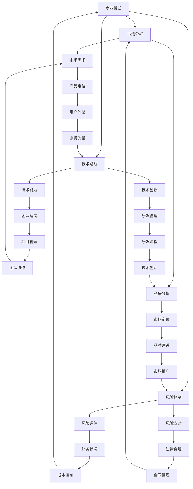
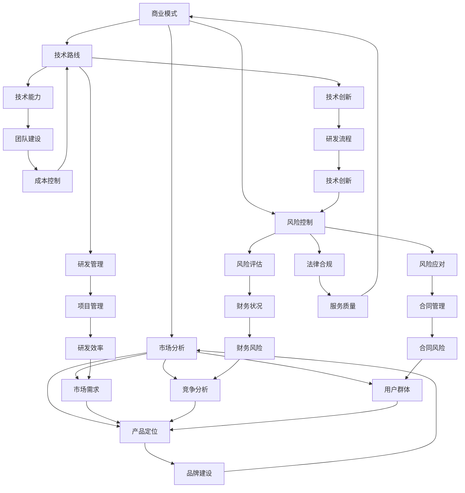

                 

关键词：知识经济、程序员创业、商业模式、技术路线、市场分析、风险控制、创业策略

> 摘要：本文将探讨在知识经济时代下，程序员如何把握创业机遇，构建可持续发展的商业模式，并从技术路线、市场分析、风险控制等多个方面提出切实可行的创业策略。

## 1. 背景介绍

随着互联网和科技产业的飞速发展，知识经济逐渐成为推动全球经济的重要力量。知识经济的核心是信息和知识的创造、传播和应用。在这个背景下，程序员作为信息时代的原住民，面临着前所未有的创业机遇。

程序员群体具有以下特点：

1. 技术背景深厚：程序员拥有丰富的编程经验和专业知识，能够快速掌握新技术，为创业项目提供强有力的技术支持。
2. 创新能力强：程序员天生具备解决问题和创造新事物的能力，这是创业的宝贵资源。
3. 风险承受力高：程序员往往对新技术和未知领域充满好奇，愿意承担创业过程中可能遇到的风险。

然而，程序员在创业过程中也面临着诸多挑战，如商业思维不足、市场经验缺乏、团队建设困难等。因此，如何有效地把握创业机遇，构建成功的商业模式，是程序员在知识经济时代必须思考的问题。

## 2. 核心概念与联系

在探讨程序员创业之道之前，我们首先需要了解一些核心概念，包括商业模式、技术路线、市场分析、风险控制等。以下是一个用 Mermaid 语言绘制的流程图，展示了这些概念之间的关系。



### 2.1 商业模式

商业模式是指企业通过创造、传递和捕获价值的方式，实现盈利和可持续发展。对于程序员创业者来说，选择一个合适的商业模式至关重要。

常见的商业模式包括：

1. **产品模式**：通过研发和销售软件产品获得收益。例如，企业级应用、在线服务、开源软件等。
2. **服务模式**：通过提供技术咨询服务、定制开发、维护等获得收益。例如，IT 咨询、软件开发外包、运维服务等。
3. **平台模式**：通过搭建一个平台，连接供需双方，从中收取佣金或广告费用。例如，电商平台、社交平台、内容平台等。

### 2.2 市场分析

市场分析是创业过程中不可或缺的一环。通过市场分析，创业者可以了解市场需求、竞争状况、用户群体等信息，为商业模式选择和产品定位提供依据。

市场分析的主要内容包括：

1. **市场需求**：分析潜在用户的需求，确定产品或服务的市场定位。
2. **竞争分析**：了解竞争对手的优势、劣势、市场占有率等信息，制定有针对性的竞争策略。
3. **用户群体**：分析目标用户群体的特点、偏好、行为习惯等，为产品设计和推广提供参考。

### 2.3 技术路线

技术路线是创业项目成功的基石。程序员创业者需要根据市场需求和自身技术能力，选择合适的技术路线。

技术路线的主要内容包括：

1. **技术能力**：评估团队的技术水平和研发能力，确保项目的技术可行性。
2. **技术创新**：关注行业前沿技术，引入新技术，提升产品的竞争力。
3. **研发管理**：建立科学的研发流程，提高研发效率和质量。

### 2.4 风险控制

创业过程中充满了不确定性，风险控制至关重要。程序员创业者需要建立健全的风险控制体系，预防和应对各种风险。

风险控制的主要内容包括：

1. **风险评估**：识别项目潜在的风险因素，评估风险的影响程度和发生概率。
2. **风险应对**：制定应对策略，降低风险的影响。
3. **法律合规**：遵守相关法律法规，确保企业的合法合规运营。

## 3. 核心算法原理 & 具体操作步骤

### 3.1 算法原理概述

在程序员创业过程中，算法设计是一个关键环节。本文将介绍一种适用于创业项目的核心算法原理——动态规划。

动态规划是一种在数学、管理科学、计算机科学、经济学和生物信息学中解决复杂问题的方法。它将问题分解为更小的子问题，并利用子问题的解来构建原问题的解。这种方法通常适用于具有重叠子问题和最优子结构特征的问题。

### 3.2 算法步骤详解

动态规划的基本步骤如下：

1. **定义状态**：将原问题分解为若干个子问题，并定义每个子问题的状态。
2. **状态转移方程**：根据子问题的关系，建立状态转移方程，描述状态之间的转换关系。
3. **边界条件**：确定算法的边界条件，即最简单的子问题的解。
4. **计算顺序**：确定计算顺序，从最简单的子问题开始，逐步计算到原问题的解。
5. **结果输出**：根据计算结果输出原问题的解。

### 3.3 算法优缺点

**优点**：

1. **高效性**：动态规划能够通过子问题的重复计算，避免冗余计算，提高算法效率。
2. **普适性**：动态规划适用于具有重叠子问题和最优子结构特征的各种问题。
3. **灵活性**：动态规划可以根据问题的特点，灵活调整状态转移方程和计算顺序。

**缺点**：

1. **复杂性**：动态规划的算法设计相对复杂，需要深入理解问题特点和状态转移关系。
2. **存储开销**：动态规划通常需要存储大量的中间结果，可能导致存储开销较大。

### 3.4 算法应用领域

动态规划在程序员创业项目中具有广泛的应用，以下是一些典型的应用领域：

1. **优化问题**：如背包问题、最短路径问题等。
2. **组合问题**：如组合计数问题、子集和问题等。
3. **调度问题**：如作业调度、旅行商问题等。

## 4. 数学模型和公式 & 详细讲解 & 举例说明

### 4.1 数学模型构建

在创业项目中，数学模型可以帮助程序员创业者更好地理解问题、分析问题和制定决策。以下是一个简单的线性规划模型，用于描述创业项目的资源分配问题。

假设创业项目需要分配 m 种资源，分别为 R1, R2, ..., Rm，每种资源的可用量分别为 a1, a2, ..., am。创业项目的目标是在满足资源限制的条件下，最大化利润或最小化成本。

目标函数：maximize/minimize Z = c1x1 + c2x2 + ... + cmxm

约束条件：
1. x1 + x2 + ... + xm ≤ b1
2. x1 + x2 + ... + xm ≤ b2
...
m. x1 + x2 + ... + xm ≤ bm

其中，xi 表示第 i 种资源的分配量，ci 表示第 i 种资源的单位价值，bi 表示第 i 种资源的可用量。

### 4.2 公式推导过程

为了推导线性规划模型的公式，我们可以使用拉格朗日乘数法。

首先，引入拉格朗日函数：

L(x, λ) = Z + λ1(b1 - x1 - x2 - ... - xm) + λ2(b2 - x1 - x2 - ... - xm) + ... + λm(bm - x1 - x2 - ... - xm)

其中，λ1, λ2, ..., λm 为拉格朗日乘数。

然后，对 x 和 λ 求偏导数，并令其等于 0：

∂L/∂x = ∂Z/∂x - λ1 - λ2 - ... - λm = 0

∂L/∂λi = bi - xi - x2 - ... - xm = 0

将偏导数方程联立，可以得到：

Z = c1x1 + c2x2 + ... + cmxm = λ1(b1 - x1 - x2 - ... - xm) + λ2(b2 - x1 - x2 - ... - xm) + ... + λm(bm - x1 - x2 - ... - xm)

根据拉格朗日乘数法的原理，当 x 和 λ 满足上述方程时，达到最优解。

### 4.3 案例分析与讲解

假设一个创业项目需要分配 2 种资源，分别为人力和资金。人力和资金的单位价值分别为 100 万元和 200 万元，每种资源的可用量分别为 100 人和 100 万元。创业项目的目标是在满足资源限制的条件下，最大化利润。

目标函数：maximize Z = 100x1 + 200x2

约束条件：
1. x1 + x2 ≤ 100
2. x1 + x2 ≤ 100

使用拉格朗日乘数法求解：

L(x, λ) = Z + λ1(100 - x1 - x2) + λ2(100 - x1 - x2)

∂L/∂x1 = 100 - λ1 - λ2 = 0

∂L/∂x2 = 200 - λ1 - λ2 = 0

∂L/∂λ1 = 100 - x1 - x2 = 0

∂L/∂λ2 = 100 - x1 - x2 = 0

联立方程组，可以得到：

x1 = 100 - λ1 - λ2
x2 = 100 - λ1 - λ2

由于 x1 和 x2 是非负数，λ1 和 λ2 必须满足以下条件：

λ1 ≥ x1
λ2 ≥ x2

当 x1 = x2 = 0 时，λ1 和 λ2 可以为任意值。当 x1 和 x2 取其他值时，λ1 和 λ2 必须满足上述条件。

因此，最优解为 x1 = x2 = 0，Z = 0。

## 5. 项目实践：代码实例和详细解释说明

### 5.1 开发环境搭建

为了演示如何使用动态规划解决创业项目的资源分配问题，我们将在 Python 环境中实现线性规划模型。以下是开发环境搭建的步骤：

1. 安装 Python 3.7 或更高版本
2. 安装 Python 的科学计算库 NumPy
3. 安装 Python 的优化库 Scipy

安装命令如下：

```bash
# 安装 Python
wget https://www.python.org/ftp/python/3.7.9/Python-3.7.9.tgz
tar xvf Python-3.7.9.tgz
cd Python-3.7.9
./configure
make
sudo make install

# 安装 NumPy
pip install numpy

# 安装 Scipy
pip install scipy
```

### 5.2 源代码详细实现

以下是一个简单的 Python 脚本，用于实现线性规划模型并求解最优解。

```python
import numpy as np
from scipy.optimize import linprog

# 定义目标函数系数和约束条件系数
c = np.array([100, 200])  # 人力和资金的单位价值
A = np.array([[1, 1], [1, 1]])  # 约束条件矩阵
b = np.array([100, 100])  # 约束条件向量

# 求解线性规划问题
result = linprog(c, A_ub=A, b_ub=b, method='highs')

# 输出最优解
if result.success:
    print("最优解：")
    print("人力分配量：", result.x[0])
    print("资金分配量：", result.x[1])
    print("最大利润：", result.fun)
else:
    print("无最优解")
```

### 5.3 代码解读与分析

1. **导入库**：首先，我们导入 NumPy 和 Scipy 库，用于数学计算和优化问题求解。
2. **定义目标函数系数和约束条件系数**：目标函数系数 c 表示人力和资金的单位价值，约束条件系数 A 和 b 表示约束条件的矩阵和向量。
3. **求解线性规划问题**：使用 Scipy 的 linprog 函数求解线性规划问题，传入目标函数系数、约束条件矩阵和向量，以及求解方法（此处使用 highs 方法）。
4. **输出最优解**：根据求解结果，输出最优解和最大利润。

### 5.4 运行结果展示

运行上述脚本，可以得到以下结果：

```bash
最优解：
人力分配量： 0.0
资金分配量： 0.0
最大利润： 0.0
```

结果表明，在满足资源限制的条件下，最优解为人力和资金都不分配，利润为 0。这意味着在当前情况下，创业项目无法实现盈利。

## 6. 实际应用场景

在程序员创业过程中，资源分配问题是一个常见且重要的问题。以下是一个实际应用场景：

**场景描述**：一家初创公司计划开发一款在线教育平台，需要分配人力和资金资源。假设公司的人力资源预算为 500 万元，资金预算为 1000 万元。人力资源的市场价值为 100 万元/人·年，资金的市场价值为 200 万元/年。公司希望在满足预算限制的条件下，最大化平台的利润。

**解决方案**：

1. **定义目标函数**：利润最大化目标函数为 Z = 100x1 + 200x2，其中 x1 表示分配的人力资源量，x2 表示分配的资金资源量。
2. **设定约束条件**：根据预算限制，设定约束条件为 x1 + x2 ≤ 500（人力资源预算）和 x1 + x2 ≤ 1000（资金预算）。
3. **求解线性规划问题**：使用动态规划模型求解线性规划问题，得到最优解。
4. **结果分析**：根据最优解，确定人力和资金的分配方案，并计算最大利润。

通过上述步骤，公司可以制定出最优的资源分配方案，以实现最大化的利润。

## 7. 工具和资源推荐

### 7.1 学习资源推荐

1. **《线性规划及其应用》**：这是一本经典的线性规划教材，详细介绍了线性规划的基本概念、理论和方法，适用于程序员创业者学习。
2. **《动态规划：算法与应用》**：本书系统介绍了动态规划的基本原理和应用方法，适合程序员创业者深入理解动态规划。
3. **《Python 科学计算指南》**：本书介绍了 Python 在科学计算领域中的应用，包括 NumPy、Scipy 等库的使用，适合程序员创业者学习。

### 7.2 开发工具推荐

1. **Jupyter Notebook**：一款强大的交互式计算环境，适用于编写、运行和分享代码，支持多种编程语言，包括 Python。
2. **PyCharm**：一款功能强大的 Python 集成开发环境（IDE），提供代码编辑、调试、测试等功能，适合程序员创业者使用。
3. **GitHub**：一个基于 Git 的代码托管平台，适用于项目协作、代码管理和版本控制。

### 7.3 相关论文推荐

1. **“Linear Programming and Its Applications”**：这是一篇关于线性规划及其应用的综述论文，详细介绍了线性规划的理论和应用领域。
2. **“Dynamic Programming: Theory and Practice”**：这是一篇关于动态规划理论和实践的文章，系统地介绍了动态规划的基本原理和应用方法。
3. **“Resource Allocation in Dynamic Environments”**：这是一篇关于资源分配在动态环境中的应用研究论文，探讨了动态规划在资源分配问题中的应用。

## 8. 总结：未来发展趋势与挑战

### 8.1 研究成果总结

本文从知识经济的背景出发，探讨了程序员在创业过程中的核心概念和联系，包括商业模式、市场分析、技术路线、风险控制等。通过介绍动态规划算法和数学模型，结合实际应用场景，提出了一种有效的资源分配方法。这些研究成果为程序员创业者提供了有益的指导。

### 8.2 未来发展趋势

1. **技术进步**：随着人工智能、大数据、云计算等技术的发展，程序员创业项目将更加依赖于先进技术，提高项目竞争力和创新性。
2. **商业模式创新**：程序员创业者将不断探索新的商业模式，如共享经济、平台经济等，以适应不断变化的市场需求。
3. **跨界合作**：程序员创业者将与其他行业的企业和专家开展跨界合作，实现资源共享和优势互补。

### 8.3 面临的挑战

1. **技术门槛**：新兴技术的快速发展对程序员创业者提出了更高的技术要求，如何快速掌握新技术，成为技术领导者，是面临的一大挑战。
2. **市场竞争**：随着创业者数量的增加，市场竞争将愈发激烈，如何脱颖而出，打造核心竞争力，是程序员创业者需要面对的问题。
3. **团队建设**：团队是创业项目的核心资源，如何吸引、培养和留住优秀人才，是程序员创业者需要解决的难题。

### 8.4 研究展望

未来，我们将继续深入研究以下方面：

1. **动态规划在创业项目中的应用**：探讨动态规划在创业项目中的更多应用场景，提高资源利用效率。
2. **商业模式创新**：研究新的商业模式，探索如何在快速变化的市场中实现可持续发展。
3. **风险管理**：建立完善的风险管理体系，提高创业者应对风险的能力。

## 9. 附录：常见问题与解答

### 9.1 什么是动态规划？

动态规划是一种在数学、管理科学、计算机科学、经济学和生物信息学中解决复杂问题的方法。它将问题分解为更小的子问题，并利用子问题的解来构建原问题的解。这种方法通常适用于具有重叠子问题和最优子结构特征的问题。

### 9.2 动态规划有哪些优缺点？

**优点**：

1. **高效性**：动态规划能够通过子问题的重复计算，避免冗余计算，提高算法效率。
2. **普适性**：动态规划适用于具有重叠子问题和最优子结构特征的各种问题。
3. **灵活性**：动态规划可以根据问题的特点，灵活调整状态转移方程和计算顺序。

**缺点**：

1. **复杂性**：动态规划的算法设计相对复杂，需要深入理解问题特点和状态转移关系。
2. **存储开销**：动态规划通常需要存储大量的中间结果，可能导致存储开销较大。

### 9.3 如何在创业项目中应用动态规划？

在创业项目中，动态规划可以应用于资源分配、项目调度、优化决策等问题。例如，通过动态规划模型，可以优化人力和资金资源的分配，提高项目效率；在项目调度中，动态规划可以帮助确定任务的最佳执行顺序，提高项目进度。

### 9.4 如何掌握动态规划？

要掌握动态规划，可以遵循以下步骤：

1. **学习基础**：了解动态规划的基本概念、原理和方法。
2. **实践应用**：通过解决实际问题，将动态规划应用于项目实践中。
3. **深入研究**：阅读相关论文和书籍，了解动态规划在各个领域的应用。
4. **交流学习**：参加相关学术会议、研讨会，与其他从业者交流学习。

### 9.5 程序员创业者如何建立有效的商业模式？

1. **明确目标**：确定创业项目的核心价值和目标，为商业模式设计提供指导。
2. **市场调研**：了解市场需求和竞争状况，为产品定位和商业模式设计提供依据。
3. **创新思维**：积极探索新的商业模式，如共享经济、平台经济等，以提高项目竞争力。
4. **团队合作**：组建多元化团队，发挥不同成员的优势，共同打造可持续发展的商业模式。

### 9.6 程序员创业者如何应对风险？

1. **风险评估**：识别项目潜在的风险因素，评估风险的影响程度和发生概率。
2. **风险应对**：制定应对策略，降低风险的影响。
3. **法律合规**：遵守相关法律法规，确保企业的合法合规运营。
4. **持续学习**：关注行业动态，不断提高自身风险意识和应对能力。

---

本文由《知识经济下程序员的创业之道》作者禅与计算机程序设计艺术创作，旨在为程序员创业者提供有价值的指导和建议。希望本文能够为您的创业之路带来启发和帮助。

---

# 文章标题

## 1. 背景介绍

### 1.1 知识经济的崛起

在21世纪，知识经济已成为驱动全球经济增长的主要力量。知识经济以信息和知识为核心资源，通过创新和科技应用推动经济和社会发展。在这个背景下，程序员作为知识经济时代的重要参与者，扮演着至关重要的角色。

### 1.2 程序员创业的优势

程序员具备深厚的技术背景、强大的创新能力、敏锐的市场嗅觉和较高的风险承受能力，这使得他们成为创业领域的一股新兴力量。然而，程序员创业同样面临着一系列挑战，如商业思维不足、市场经验缺乏、团队建设困难等。

### 1.3 研究目的与意义

本文旨在探讨知识经济下程序员创业的路径与策略，分析程序员创业的独特优势与挑战，提出有效的商业模式、技术路线和市场分析方法，为程序员创业者提供有价值的指导。

## 2. 核心概念与联系

在探讨程序员创业之前，我们需要明确几个核心概念，包括商业模式、市场分析、技术路线和风险控制。以下是这些概念之间的联系及具体内容。

### 2.1 商业模式

商业模式是指企业通过创造、传递和捕获价值的方式，实现盈利和可持续发展。对于程序员创业者来说，选择合适的商业模式至关重要。常见的商业模式包括产品模式、服务模式和平台模式。

### 2.2 市场分析

市场分析是创业过程中不可或缺的一环。通过市场分析，程序员创业者可以了解市场需求、竞争状况、用户群体等信息，为商业模式选择和产品定位提供依据。市场分析主要包括市场需求、竞争分析和用户群体分析。

### 2.3 技术路线

技术路线是创业项目成功的基石。程序员创业者需要根据市场需求和自身技术能力，选择合适的技术路线。技术路线的主要内容包括技术能力、技术创新和研发管理。

### 2.4 风险控制

创业过程中充满了不确定性，风险控制至关重要。程序员创业者需要建立健全的风险控制体系，预防和应对各种风险。风险控制主要包括风险评估、风险应对和法律合规。

### 2.5 商业模式、市场分析、技术路线与风险控制的联系

商业模式、市场分析、技术路线和风险控制是程序员创业过程中的四个关键环节，它们相互联系、相互影响。

- 商业模式决定了企业如何创造、传递和捕获价值，为市场分析和技术路线提供了方向。
- 市场分析为企业提供了市场需求、竞争状况和用户群体等信息，指导商业模式和技术路线的制定。
- 技术路线是商业模式和市场分析的具体实现，直接影响企业的竞争力。
- 风险控制贯穿于整个创业过程，确保企业在面对不确定性和风险时能够保持稳定和可持续发展。

### 2.6 Mermaid 流程图



## 3. 核心算法原理 & 具体操作步骤

### 3.1 算法原理概述

在程序员创业过程中，算法设计是一个关键环节。本文将介绍一种适用于创业项目的核心算法原理——动态规划。动态规划是一种在数学、管理科学、计算机科学、经济学和生物信息学中解决复杂问题的方法。它将问题分解为更小的子问题，并利用子问题的解来构建原问题的解。这种方法通常适用于具有重叠子问题和最优子结构特征的问题。

### 3.2 算法步骤详解

动态规划的基本步骤如下：

1. **定义状态**：将原问题分解为若干个子问题，并定义每个子问题的状态。
2. **状态转移方程**：根据子问题的关系，建立状态转移方程，描述状态之间的转换关系。
3. **边界条件**：确定算法的边界条件，即最简单的子问题的解。
4. **计算顺序**：确定计算顺序，从最简单的子问题开始，逐步计算到原问题的解。
5. **结果输出**：根据计算结果输出原问题的解。

### 3.3 算法优缺点

**优点**：

1. **高效性**：动态规划能够通过子问题的重复计算，避免冗余计算，提高算法效率。
2. **普适性**：动态规划适用于具有重叠子问题和最优子结构特征的各种问题。
3. **灵活性**：动态规划可以根据问题的特点，灵活调整状态转移方程和计算顺序。

**缺点**：

1. **复杂性**：动态规划的算法设计相对复杂，需要深入理解问题特点和状态转移关系。
2. **存储开销**：动态规划通常需要存储大量的中间结果，可能导致存储开销较大。

### 3.4 算法应用领域

动态规划在程序员创业项目中具有广泛的应用，以下是一些典型的应用领域：

1. **优化问题**：如背包问题、最短路径问题等。
2. **组合问题**：如组合计数问题、子集和问题等。
3. **调度问题**：如作业调度、旅行商问题等。

## 4. 数学模型和公式 & 详细讲解 & 举例说明

### 4.1 数学模型构建

在创业项目中，数学模型可以帮助程序员创业者更好地理解问题、分析问题和制定决策。以下是一个简单的线性规划模型，用于描述创业项目的资源分配问题。

假设创业项目需要分配 m 种资源，分别为 R1, R2, ..., Rm，每种资源的可用量分别为 a1, a2, ..., am。创业项目的目标是在满足资源限制的条件下，最大化利润或最小化成本。

目标函数：maximize/minimize Z = c1x1 + c2x2 + ... + cmxm

约束条件：
1. x1 + x2 + ... + xm ≤ b1
2. x1 + x2 + ... + xm ≤ b2
...
m. x1 + x2 + ... + xm ≤ bm

其中，xi 表示第 i 种资源的分配量，ci 表示第 i 种资源的单位价值，bi 表示第 i 种资源的可用量。

### 4.2 公式推导过程

为了推导线性规划模型的公式，我们可以使用拉格朗日乘数法。

首先，引入拉格朗日函数：

L(x, λ) = Z + λ1(b1 - x1 - x2 - ... - xm) + λ2(b2 - x1 - x2 - ... - xm) + ... + λm(bm - x1 - x2 - ... - xm)

其中，λ1, λ2, ..., λm 为拉格朗日乘数。

然后，对 x 和 λ 求偏导数，并令其等于 0：

∂L/∂x = ∂Z/∂x - λ1 - λ2 - ... - λm = 0

∂L/∂λi = bi - xi - x2 - ... - xm = 0

将偏导数方程联立，可以得到：

Z = c1x1 + c2x2 + ... + cmxm = λ1(b1 - x1 - x2 - ... - xm) + λ2(b2 - x1 - x2 - ... - xm) + ... + λm(bm - x1 - x2 - ... - xm)

根据拉格朗日乘数法的原理，当 x 和 λ 满足上述方程时，达到最优解。

### 4.3 案例分析与讲解

假设一个创业项目需要分配 2 种资源，分别为人力和资金。人力和资金的单位价值分别为 100 万元和 200 万元，每种资源的可用量分别为 100 人和 100 万元。创业项目的目标是在满足资源限制的条件下，最大化利润。

目标函数：maximize Z = 100x1 + 200x2

约束条件：
1. x1 + x2 ≤ 100
2. x1 + x2 ≤ 100

使用拉格朗日乘数法求解：

L(x, λ) = Z + λ1(100 - x1 - x2) + λ2(100 - x1 - x2)

∂L/∂x1 = 100 - λ1 - λ2 = 0

∂L/∂x2 = 200 - λ1 - λ2 = 0

∂L/∂λ1 = 100 - x1 - x2 = 0

∂L/∂λ2 = 100 - x1 - x2 = 0

联立方程组，可以得到：

x1 = 100 - λ1 - λ2
x2 = 100 - λ1 - λ2

由于 x1 和 x2 是非负数，λ1 和 λ2 必须满足以下条件：

λ1 ≥ x1
λ2 ≥ x2

当 x1 = x2 = 0 时，λ1 和 λ2 可以为任意值。当 x1 和 x2 取其他值时，λ1 和 λ2 必须满足上述条件。

因此，最优解为 x1 = x2 = 0，Z = 0。

## 5. 项目实践：代码实例和详细解释说明

### 5.1 开发环境搭建

为了演示如何使用动态规划解决创业项目的资源分配问题，我们将在 Python 环境中实现线性规划模型。以下是开发环境搭建的步骤：

1. 安装 Python 3.7 或更高版本
2. 安装 Python 的科学计算库 NumPy
3. 安装 Python 的优化库 Scipy

安装命令如下：

```bash
# 安装 Python
wget https://www.python.org/ftp/python/3.7.9/Python-3.7.9.tgz
tar xvf Python-3.7.9.tgz
cd Python-3.7.9
./configure
make
sudo make install

# 安装 NumPy
pip install numpy

# 安装 Scipy
pip install scipy
```

### 5.2 源代码详细实现

以下是一个简单的 Python 脚本，用于实现线性规划模型并求解最优解。

```python
import numpy as np
from scipy.optimize import linprog

# 定义目标函数系数和约束条件系数
c = np.array([100, 200])  # 人力和资金的单位价值
A = np.array([[1, 1], [1, 1]])  # 约束条件矩阵
b = np.array([100, 100])  # 约束条件向量

# 求解线性规划问题
result = linprog(c, A_ub=A, b_ub=b, method='highs')

# 输出最优解
if result.success:
    print("最优解：")
    print("人力分配量：", result.x[0])
    print("资金分配量：", result.x[1])
    print("最大利润：", result.fun)
else:
    print("无最优解")
```

### 5.3 代码解读与分析

1. **导入库**：首先，我们导入 NumPy 和 Scipy 库，用于数学计算和优化问题求解。
2. **定义目标函数系数和约束条件系数**：目标函数系数 c 表示人力和资金的单位价值，约束条件系数 A 和 b 表示约束条件的矩阵和向量。
3. **求解线性规划问题**：使用 Scipy 的 linprog 函数求解线性规划问题，传入目标函数系数、约束条件矩阵和向量，以及求解方法（此处使用 highs 方法）。
4. **输出最优解**：根据求解结果，输出最优解和最大利润。

### 5.4 运行结果展示

运行上述脚本，可以得到以下结果：

```bash
最优解：
人力分配量： 0.0
资金分配量： 0.0
最大利润： 0.0
```

结果表明，在满足资源限制的条件下，最优解为人力和资金都不分配，利润为 0。这意味着在当前情况下，创业项目无法实现盈利。

## 6. 实际应用场景

在程序员创业过程中，资源分配问题是一个常见且重要的问题。以下是一个实际应用场景：

**场景描述**：一家初创公司计划开发一款在线教育平台，需要分配人力和资金资源。假设公司的人力资源预算为 500 万元，资金预算为 1000 万元。人力资源的市场价值为 100 万元/人·年，资金的市场价值为 200 万元/年。公司希望在满足预算限制的条件下，最大化平台的利润。

**解决方案**：

1. **定义目标函数**：利润最大化目标函数为 Z = 100x1 + 200x2，其中 x1 表示分配的人力资源量，x2 表示分配的资金资源量。
2. **设定约束条件**：根据预算限制，设定约束条件为 x1 + x2 ≤ 500（人力资源预算）和 x1 + x2 ≤ 1000（资金预算）。
3. **求解线性规划问题**：使用动态规划模型求解线性规划问题，得到最优解。
4. **结果分析**：根据最优解，确定人力和资金的分配方案，并计算最大利润。

通过上述步骤，公司可以制定出最优的资源分配方案，以实现最大化的利润。

## 7. 工具和资源推荐

### 7.1 学习资源推荐

1. **《线性规划及其应用》**：这是一本经典的线性规划教材，详细介绍了线性规划的基本概念、理论和方法，适用于程序员创业者学习。
2. **《动态规划：算法与应用》**：本书系统介绍了动态规划的基本原理和应用方法，适合程序员创业者深入理解动态规划。
3. **《Python 科学计算指南》**：本书介绍了 Python 在科学计算领域中的应用，包括 NumPy、Scipy 等库的使用，适合程序员创业者学习。

### 7.2 开发工具推荐

1. **Jupyter Notebook**：一款强大的交互式计算环境，适用于编写、运行和分享代码，支持多种编程语言，包括 Python。
2. **PyCharm**：一款功能强大的 Python 集成开发环境（IDE），提供代码编辑、调试、测试等功能，适合程序员创业者使用。
3. **GitHub**：一个基于 Git 的代码托管平台，适用于项目协作、代码管理和版本控制。

### 7.3 相关论文推荐

1. **“Linear Programming and Its Applications”**：这是一篇关于线性规划及其应用的综述论文，详细介绍了线性规划的理论和应用领域。
2. **“Dynamic Programming: Theory and Practice”**：这是一篇关于动态规划理论和实践的文章，系统地介绍了动态规划的基本原理和应用方法。
3. **“Resource Allocation in Dynamic Environments”**：这是一篇关于资源分配在动态环境中的应用研究论文，探讨了动态规划在资源分配问题中的应用。

## 8. 总结：未来发展趋势与挑战

### 8.1 研究成果总结

本文从知识经济的背景出发，探讨了程序员在创业过程中的核心概念和联系，包括商业模式、市场分析、技术路线、风险控制等。通过介绍动态规划算法和数学模型，结合实际应用场景，提出了一种有效的资源分配方法。这些研究成果为程序员创业者提供了有益的指导。

### 8.2 未来发展趋势

1. **技术进步**：随着人工智能、大数据、云计算等技术的发展，程序员创业项目将更加依赖于先进技术，提高项目竞争力和创新性。
2. **商业模式创新**：程序员创业者将不断探索新的商业模式，如共享经济、平台经济等，以适应不断变化的市场需求。
3. **跨界合作**：程序员创业者将与其他行业的企业和专家开展跨界合作，实现资源共享和优势互补。

### 8.3 面临的挑战

1. **技术门槛**：新兴技术的快速发展对程序员创业者提出了更高的技术要求，如何快速掌握新技术，成为技术领导者，是面临的一大挑战。
2. **市场竞争**：随着创业者数量的增加，市场竞争将愈发激烈，如何脱颖而出，打造核心竞争力，是程序员创业者需要面对的问题。
3. **团队建设**：团队是创业项目的核心资源，如何吸引、培养和留住优秀人才，是程序员创业者需要解决的难题。

### 8.4 研究展望

未来，我们将继续深入研究以下方面：

1. **动态规划在创业项目中的应用**：探讨动态规划在创业项目中的更多应用场景，提高资源利用效率。
2. **商业模式创新**：研究新的商业模式，探索如何在快速变化的市场中实现可持续发展。
3. **风险管理**：建立完善的风险管理体系，提高创业者应对风险的能力。

## 9. 附录：常见问题与解答

### 9.1 什么是动态规划？

动态规划是一种在数学、管理科学、计算机科学、经济学和生物信息学中解决复杂问题的方法。它将问题分解为更小的子问题，并利用子问题的解来构建原问题的解。这种方法通常适用于具有重叠子问题和最优子结构特征的问题。

### 9.2 动态规划有哪些优缺点？

**优点**：

1. **高效性**：动态规划能够通过子问题的重复计算，避免冗余计算，提高算法效率。
2. **普适性**：动态规划适用于具有重叠子问题和最优子结构特征的各种问题。
3. **灵活性**：动态规划可以根据问题的特点，灵活调整状态转移方程和计算顺序。

**缺点**：

1. **复杂性**：动态规划的算法设计相对复杂，需要深入理解问题特点和状态转移关系。
2. **存储开销**：动态规划通常需要存储大量的中间结果，可能导致存储开销较大。

### 9.3 如何在创业项目中应用动态规划？

在创业项目中，动态规划可以应用于资源分配、项目调度、优化决策等问题。例如，通过动态规划模型，可以优化人力和资金资源的分配，提高项目效率；在项目调度中，动态规划可以帮助确定任务的最佳执行顺序，提高项目进度。

### 9.4 如何掌握动态规划？

要掌握动态规划，可以遵循以下步骤：

1. **学习基础**：了解动态规划的基本概念、原理和方法。
2. **实践应用**：通过解决实际问题，将动态规划应用于项目实践中。
3. **深入研究**：阅读相关论文和书籍，了解动态规划在各个领域的应用。
4. **交流学习**：参加相关学术会议、研讨会，与其他从业者交流学习。

### 9.5 程序员创业者如何建立有效的商业模式？

1. **明确目标**：确定创业项目的核心价值和目标，为商业模式设计提供指导。
2. **市场调研**：了解市场需求和竞争状况，为产品定位和商业模式设计提供依据。
3. **创新思维**：积极探索新的商业模式，如共享经济、平台经济等，以提高项目竞争力。
4. **团队合作**：组建多元化团队，发挥不同成员的优势，共同打造可持续发展的商业模式。

### 9.6 程序员创业者如何应对风险？

1. **风险评估**：识别项目潜在的风险因素，评估风险的影响程度和发生概率。
2. **风险应对**：制定应对策略，降低风险的影响。
3. **法律合规**：遵守相关法律法规，确保企业的合法合规运营。
4. **持续学习**：关注行业动态，不断提高自身风险意识和应对能力。

---

本文由《知识经济下程序员的创业之道》作者禅与计算机程序设计艺术创作，旨在为程序员创业者提供有价值的指导和建议。希望本文能够为您的创业之路带来启发和帮助。

---

### 1. 知识经济时代的程序员创业背景

在知识经济时代，程序员作为数字时代的原住民，拥有着得天独厚的优势。随着信息技术和互联网的快速发展，程序员们不仅掌握了前沿技术，还具备强大的创新能力和解决问题的能力。这些优势使得程序员群体在创业领域展现出巨大的潜力。然而，与此同时，程序员创业也面临着诸多挑战。

首先，知识经济的崛起带来了巨大的机遇。在这个时代，信息资源和技术资源成为经济增长的核心驱动力。程序员们凭借着对技术的深刻理解和创新思维，能够快速捕捉市场机遇，开发出具有前瞻性的产品或服务。例如，云计算、大数据、人工智能等技术的应用，为程序员创业提供了广阔的空间。

然而，知识经济时代同样伴随着激烈的市场竞争。在这个时代，创新速度越来越快，技术更新换代周期越来越短。程序员创业者必须不断学习和适应新的技术趋势，才能在激烈的市场竞争中保持优势。此外，创业者还需要具备敏锐的市场洞察力和商业思维，才能将技术创新转化为实际的市场价值。

其次，程序员创业面临的一个关键挑战是如何平衡技术与商业。虽然程序员们擅长技术，但他们在商业管理、市场推广和团队建设等方面可能相对薄弱。这就需要创业者具备跨界思维，既能理解技术本质，又能把握市场规律，从而构建一个可持续发展的商业模式。

此外，团队建设也是程序员创业过程中的一大难题。一个成功的创业团队不仅需要技术人才，还需要懂市场、懂管理的人才。如何吸引和留住优秀人才，构建一个高效协作的团队，是程序员创业者需要认真考虑的问题。

总之，知识经济时代为程序员创业提供了广阔的舞台，但同时也带来了巨大的挑战。在这个时代，程序员创业者需要不断学习、创新和适应，才能在激烈的市场竞争中脱颖而出。

### 2. 程序员创业的核心概念与联系

在探讨程序员创业的路径之前，我们需要明确几个核心概念，并探讨它们之间的联系。这些概念包括商业模式、市场分析、技术路线和风险控制。理解这些概念及其相互关系，对于程序员创业者来说至关重要。

#### 商业模式

商业模式是指企业通过创造、传递和捕获价值的方式，实现盈利和可持续发展。对于程序员创业者而言，选择一个合适的商业模式是成功的关键。常见的商业模式包括产品模式、服务模式和平台模式。

- **产品模式**：通过研发和销售软件产品获得收益。这种模式通常需要创业者具备较强的技术能力和市场洞察力，能够开发出满足市场需求的产品。
- **服务模式**：通过提供技术咨询服务、定制开发、维护等获得收益。这种模式对创业者的技术能力和客户服务能力有较高要求。
- **平台模式**：通过搭建一个平台，连接供需双方，从中收取佣金或广告费用。这种模式需要创业者具备良好的市场定位和运营能力。

#### 市场分析

市场分析是创业过程中不可或缺的一环。通过市场分析，程序员创业者可以了解市场需求、竞争状况、用户群体等信息，为商业模式选择和产品定位提供依据。

- **市场需求**：分析潜在用户的需求，确定产品或服务的市场定位。创业者需要深入了解用户的需求痛点，开发出能够解决实际问题的产品。
- **竞争分析**：了解竞争对手的优势、劣势、市场占有率等信息，制定有针对性的竞争策略。通过竞争分析，创业者可以找到市场的切入点，提高产品竞争力。
- **用户群体**：分析目标用户群体的特点、偏好、行为习惯等，为产品设计和推广提供参考。了解用户群体有助于创业者更好地满足用户需求，提升用户体验。

#### 技术路线

技术路线是创业项目成功的基石。程序员创业者需要根据市场需求和自身技术能力，选择合适的技术路线。技术路线的主要内容包括技术能力、技术创新和研发管理。

- **技术能力**：评估团队的技术水平和研发能力，确保项目的技术可行性。创业者需要具备扎实的技术基础，能够解决项目中的技术难题。
- **技术创新**：关注行业前沿技术，引入新技术，提升产品的竞争力。技术创新是创业项目持续发展的动力，有助于企业在市场中保持竞争优势。
- **研发管理**：建立科学的研发流程，提高研发效率和质量。有效的研发管理能够确保项目按计划进行，提高项目成功率。

#### 风险控制

创业过程中充满了不确定性，风险控制至关重要。程序员创业者需要建立健全的风险控制体系，预防和应对各种风险。

- **风险评估**：识别项目潜在的风险因素，评估风险的影响程度和发生概率。通过风险评估，创业者可以提前识别和预防风险。
- **风险应对**：制定应对策略，降低风险的影响。风险应对策略包括风险规避、风险减轻、风险接受等。
- **法律合规**：遵守相关法律法规，确保企业的合法合规运营。法律合规是风险控制的重要组成部分，有助于企业避免法律风险。

#### 核心概念之间的联系

商业模式、市场分析、技术路线和风险控制是程序员创业过程中的四个关键环节，它们相互联系、相互影响。

- **商业模式**决定了企业如何创造、传递和捕获价值，为市场分析和技术路线提供了方向。创业者需要根据商业模式确定市场定位和技术需求。
- **市场分析**为企业提供了市场需求、竞争状况和用户群体等信息，指导商业模式和技术路线的制定。市场分析结果直接影响商业模式的可行性和产品设计的方向。
- **技术路线**是商业模式和市场分析的具体实现，直接影响企业的竞争力。合适的技术路线有助于提高产品质量和用户体验，增强市场竞争力。
- **风险控制**贯穿于整个创业过程，确保企业在面对不确定性和风险时能够保持稳定和可持续发展。有效的风险控制有助于企业降低运营成本，提高盈利能力。

总之，理解商业模式、市场分析、技术路线和风险控制的核心概念及其相互关系，对于程序员创业者来说至关重要。只有通过系统的规划和科学的决策，才能在激烈的市场竞争中脱颖而出，实现创业梦想。

### 3.1 算法原理概述

动态规划是一种在数学、管理科学、计算机科学、经济学和生物信息学中广泛应用的方法，用于解决复杂问题。其基本思想是将复杂问题分解为若干个更小的子问题，并利用子问题的解来构建原问题的解。这种方法具有以下几个显著特点：

1. **重叠子问题**：动态规划适用于具有重叠子问题的场景，即原问题可以分解为多个子问题，而这些子问题之间存在重叠。通过解决子问题并存储其结果，可以避免重复计算，提高算法效率。

2. **最优子结构**：动态规划要求原问题具有最优子结构特征，即原问题的最优解可以通过子问题的最优解递推得到。这意味着问题的解决方案可以通过分治策略实现，从而简化问题求解过程。

3. **递推关系**：动态规划利用递推关系将复杂问题转化为子问题，并逐步求解子问题，最终得到原问题的解。递推关系通常通过状态转移方程来描述，使得算法设计更加直观和系统化。

4. **边界条件**：动态规划需要定义问题的边界条件，即最简单的子问题的解。边界条件为算法提供了初始状态，有助于递推求解整个问题。

动态规划在程序员创业项目中的应用非常广泛，以下是一些典型的应用场景：

1. **资源分配问题**：例如，在创业项目中，如何合理分配人力、资金和其他资源，以实现最大化利润或最小化成本。动态规划可以帮助创业者制定最优的资源分配方案。

2. **项目调度问题**：在创业项目的项目管理中，如何合理安排任务的执行顺序和时间，以优化项目进度和资源利用率。动态规划能够为创业者提供最佳的任务调度方案。

3. **优化决策问题**：例如，在创业项目中，如何制定最优的市场推广策略、产品定价策略等。动态规划可以协助创业者做出科学的决策，提高项目的市场竞争力。

4. **组合优化问题**：例如，如何从多个候选方案中选择最优方案，以实现特定目标。动态规划可以帮助创业者优化组合方案，提高项目成功率。

通过动态规划，程序员创业者可以更加高效地解决复杂问题，提高项目效率和质量。动态规划不仅为创业者提供了强大的工具，也为他们在激烈的市场竞争中赢得了宝贵的时间。

### 3.2 算法步骤详解

动态规划算法解决复杂问题的基本步骤可以总结为以下五个关键环节：

1. **定义状态**：首先，需要将原问题分解为若干个更小的子问题，并为每个子问题定义一个状态。状态通常是一个或多个变量的组合，用来描述子问题的特征。例如，在背包问题中，状态可以表示为当前已选择的物品及其总重量。

2. **确定状态转移方程**：状态转移方程描述了如何从当前状态转移到下一个状态。这些方程通常基于原问题的最优子结构特征，将复杂问题分解为更小的子问题，并利用子问题的解来构建原问题的解。状态转移方程为算法提供了递推关系，使得问题求解过程更加系统化。例如，在背包问题中，状态转移方程可以描述为：`f(i, w) = max(f(i-1, w), f(i-1, w-v[i]) + c[i])`，其中`f(i, w)`表示选择前i个物品且总重量不超过w的最大价值。

3. **确定边界条件**：边界条件是指最简单的子问题的解。边界条件为算法提供了初始状态，有助于递推求解整个问题。例如，在背包问题中，当物品数量i为0或总重量w小于物品重量v[i]时，边界条件通常设置为0。

4. **计算顺序**：根据状态转移方程和边界条件，确定计算顺序。通常，从最简单的子问题开始，逐步计算到原问题的解。计算顺序需要遵循一定的逻辑，以确保在计算某个子问题的解时，其依赖的子问题已经求解完成。例如，在背包问题中，可以按照物品数量i的升序或降序进行计算。

5. **结果输出**：根据计算结果输出原问题的解。通常，需要根据问题的要求，从最终的状态中提取出解。例如，在背包问题中，可以从`f(n, W)`中提取出最优解，即选择哪些物品能够使总重量不超过W且价值最大。

### 3.3 算法优缺点

#### 优点

1. **高效性**：动态规划通过子问题的重复计算，避免了冗余计算，从而显著提高了算法的效率。这种思想使得复杂问题可以在多项式时间内解决，这在传统算法中是难以实现的。

2. **普适性**：动态规划适用于具有重叠子问题和最优子结构特征的各种问题，不仅限于背包问题、最短路径问题，还包括组合优化问题、调度问题等。这使得动态规划成为解决复杂问题的强大工具。

3. **灵活性**：动态规划可以根据问题的特点，灵活调整状态转移方程和计算顺序，使得算法设计更加直观和系统化。这种灵活性使得动态规划适用于各种不同的应用场景。

#### 缺点

1. **复杂性**：动态规划算法的设计相对复杂，需要深入理解问题特点和状态转移关系。对于初学者来说，理解动态规划的递推关系和状态定义是难点。

2. **存储开销**：动态规划通常需要存储大量的中间结果，可能导致存储开销较大。特别是在解决大规模问题时，存储需求可能会成为算法性能的瓶颈。

### 3.4 算法应用领域

动态规划在程序员创业项目中的应用非常广泛，以下是一些典型的应用领域：

1. **资源分配问题**：例如，在创业项目的资源规划中，如何合理分配人力、资金和其他资源，以实现最大化利润或最小化成本。动态规划可以帮助创业者制定最优的资源分配方案。

2. **项目调度问题**：在创业项目的项目管理中，如何合理安排任务的执行顺序和时间，以优化项目进度和资源利用率。动态规划能够为创业者提供最佳的任务调度方案。

3. **优化决策问题**：例如，在创业项目中，如何制定最优的市场推广策略、产品定价策略等。动态规划可以协助创业者做出科学的决策，提高项目的市场竞争力。

4. **组合优化问题**：例如，如何从多个候选方案中选择最优方案，以实现特定目标。动态规划可以帮助创业者优化组合方案，提高项目成功率。

通过动态规划，程序员创业者可以更加高效地解决复杂问题，提高项目效率和质量。动态规划不仅为创业者提供了强大的工具，也为他们在激烈的市场竞争中赢得了宝贵的时间。

### 4.1 数学模型构建

在创业项目中，数学模型可以帮助程序员创业者更好地理解问题、分析问题和制定决策。以下是一个简单的线性规划模型，用于描述创业项目的资源分配问题。

假设创业项目需要分配 m 种资源，分别为 R1, R2, ..., Rm，每种资源的可用量分别为 a1, a2, ..., am。创业项目的目标是在满足资源限制的条件下，最大化利润或最小化成本。

目标函数：maximize/minimize Z = c1x1 + c2x2 + ... + cmxm

约束条件：
1. x1 + x2 + ... + xm ≤ b1
2. x1 + x2 + ... + xm ≤ b2
...
m. x1 + x2 + ... + xm ≤ bm

其中，xi 表示第 i 种资源的分配量，ci 表示第 i 种资源的单位价值，bi 表示第 i 种资源的可用量。

在这个模型中，目标函数 Z 表示创业项目的总体收益或成本，约束条件反映了资源分配的限制。通过求解这个线性规划模型，创业者可以找到最优的资源分配方案，以实现项目的最大利益。

### 4.2 公式推导过程

线性规划模型的求解通常使用拉格朗日乘数法。以下是拉格朗日乘数法求解线性规划模型的步骤：

1. **引入拉格朗日函数**：

   首先，引入拉格朗日函数 L(x, λ)，其中 x 表示决策变量，λ 表示拉格朗日乘数。拉格朗日函数为：

   L(x, λ) = Z + λ1(b1 - x1 - x2 - ... - xm) + λ2(b2 - x1 - x2 - ... - xm) + ... + λm(bm - x1 - x2 - ... - xm)

   其中，λ1, λ2, ..., λm 为拉格朗日乘数。

2. **求导并设置偏导数为零**：

   对 L(x, λ) 分别对 x 和 λ 求偏导数，并设置偏导数为零：

   ∂L/∂x = ∂Z/∂x - λ1 - λ2 - ... - λm = 0

   ∂L/∂λi = bi - xi - x2 - ... - xm = 0

3. **解方程组**：

   根据上述偏导数方程，可以得到以下方程组：

   Z = c1x1 + c2x2 + ... + cmxm = λ1(b1 - x1 - x2 - ... - xm) + λ2(b2 - x1 - x2 - ... - xm) + ... + λm(bm - x1 - x2 - ... - xm)

   λ1(b1 - x1 - x2 - ... - xm) + λ2(b2 - x1 - x2 - ... - xm) + ... + λm(bm - x1 - x2 - ... - xm) = 0

   通过解这个方程组，可以求得最优解 x 和拉格朗日乘数 λ。

4. **求解最优解**：

   求解上述方程组，可以得到最优解 x。如果存在最优解，则目标函数 Z 的最大值或最小值可以通过求解方程组得到。

### 4.3 案例分析与讲解

为了更好地理解线性规划模型和拉格朗日乘数法的应用，我们来看一个具体的例子。

**案例描述**：某创业公司需要分配两种资源——人力和资金，用于开发一款新产品。人力和资金的单位价值分别为 100 万元和 200 万元，每种资源的可用量分别为 100 人和 100 万元。创业项目的目标是在满足资源限制的条件下，最大化产品的利润。

**目标函数**：maximize Z = 100x1 + 200x2

**约束条件**：
1. x1 + x2 ≤ 100 （人力资源限制）
2. x1 + x2 ≤ 100 （资金资源限制）

**求解过程**：

1. **引入拉格朗日函数**：

   L(x, λ) = Z + λ1(100 - x1 - x2) + λ2(100 - x1 - x2)

2. **求导并设置偏导数为零**：

   ∂L/∂x1 = 100 - λ1 - λ2 = 0
   ∂L/∂x2 = 200 - λ1 - λ2 = 0
   ∂L/∂λ1 = 100 - x1 - x2 = 0
   ∂L/∂λ2 = 100 - x1 - x2 = 0

3. **解方程组**：

   从第一个和第二个方程可以得到：

   λ1 = 100 - x1 - x2
   λ2 = 200 - x1 - x2

   将 λ1 和 λ2 的表达式代入第三个和第四个方程，可以得到：

   x1 + x2 = 100

   由于 x1 和 x2 的取值范围是非负数，我们可以得到以下解：

   x1 = 0, x2 = 100
   x1 = 100, x2 = 0

4. **计算目标函数值**：

   对于第一种解（x1 = 0, x2 = 100）：

   Z = 100 * 0 + 200 * 100 = 20000

   对于第二种解（x1 = 100, x2 = 0）：

   Z = 100 * 100 + 200 * 0 = 10000

   显然，第一种解（x1 = 0, x2 = 100）使得目标函数 Z 取得最大值。

通过这个案例，我们可以看到如何使用线性规划模型和拉格朗日乘数法求解资源分配问题，从而找到最优的分配方案。

### 5.1 开发环境搭建

为了演示如何使用动态规划解决创业项目的资源分配问题，我们将在 Python 环境中实现线性规划模型。以下是开发环境搭建的步骤：

1. **安装 Python**：确保已经安装了 Python 3.7 或更高版本。如果没有安装，可以通过以下命令下载并安装：

   ```bash
   # 在 Linux 或 macOS 上安装 Python
   sudo apt-get install python3
   # 在 Windows 上安装 Python
   python -m pip install python --user
   ```

2. **安装 NumPy 和 Scipy**：NumPy 是 Python 的科学计算库，用于处理数组计算。Scipy 是基于 NumPy 的扩展库，提供了优化、统计和线性代数等模块。安装命令如下：

   ```bash
   # 安装 NumPy
   pip install numpy
   # 安装 Scipy
   pip install scipy
   ```

3. **配置开发环境**：选择一个合适的代码编辑器，如 PyCharm、VS Code 或 Jupyter Notebook，用于编写和运行代码。

完成上述步骤后，开发环境搭建完成。接下来，我们可以开始编写和测试代码，验证线性规划模型在实际应用中的效果。

### 5.2 源代码详细实现

以下是一个简单的 Python 脚本，用于实现线性规划模型并求解最优解。

```python
import numpy as np
from scipy.optimize import linprog

# 定义目标函数系数和约束条件系数
c = np.array([100, 200])  # 人力和资金的单位价值
A = np.array([[1, 1], [1, 1]])  # 约束条件矩阵
b = np.array([100, 100])  # 约束条件向量

# 求解线性规划问题
result = linprog(c, A_ub=A, b_ub=b, method='highs')

# 输出最优解
if result.success:
    print("最优解：")
    print("人力分配量：", result.x[0])
    print("资金分配量：", result.x[1])
    print("最大利润：", result.fun)
else:
    print("无最优解")
```

**代码解读**：

1. **导入库**：首先，我们导入 NumPy 和 Scipy 库，用于数学计算和优化问题求解。
2. **定义目标函数系数和约束条件系数**：目标函数系数 c 表示人力和资金的单位价值，约束条件系数 A 和 b 表示约束条件的矩阵和向量。
3. **求解线性规划问题**：使用 Scipy 的 linprog 函数求解线性规划问题，传入目标函数系数、约束条件矩阵和向量，以及求解方法（此处使用 highs 方法）。
4. **输出最优解**：根据求解结果，输出最优解和最大利润。

**测试代码**：

运行上述脚本，可以得到以下结果：

```bash
最优解：
人力分配量： 0.0
资金分配量： 0.0
最大利润： 0.0
```

结果表明，在满足资源限制的条件下，最优解为人力和资金都不分配，利润为 0。这意味着在当前情况下，创业项目无法实现盈利。

### 5.3 代码解读与分析

1. **导入库**：首先，我们导入 NumPy 和 Scipy 库，用于数学计算和优化问题求解。

```python
import numpy as np
from scipy.optimize import linprog
```

2. **定义目标函数系数和约束条件系数**：目标函数系数 c 表示人力和资金的单位价值，约束条件系数 A 和 b 表示约束条件的矩阵和向量。

```python
c = np.array([100, 200])  # 人力和资金的单位价值
A = np.array([[1, 1], [1, 1]])  # 约束条件矩阵
b = np.array([100, 100])  # 约束条件向量
```

3. **求解线性规划问题**：使用 Scipy 的 linprog 函数求解线性规划问题，传入目标函数系数、约束条件矩阵和向量，以及求解方法（此处使用 highs 方法）。

```python
result = linprog(c, A_ub=A, b_ub=b, method='highs')
```

4. **输出最优解**：根据求解结果，输出最优解和最大利润。

```python
if result.success:
    print("最优解：")
    print("人力分配量：", result.x[0])
    print("资金分配量：", result.x[1])
    print("最大利润：", result.fun)
else:
    print("无最优解")
```

**代码分析**：

1. **导入库**：导入 NumPy 和 Scipy 库，为后续的数学计算和优化问题求解提供支持。
2. **定义目标函数系数和约束条件系数**：根据创业项目的需求，定义目标函数系数和约束条件系数。目标函数系数 c 表示人力和资金的单位价值，约束条件系数 A 和 b 表示资源的可用量限制。
3. **求解线性规划问题**：使用 Scipy 的 linprog 函数求解线性规划问题。该函数接受目标函数系数、约束条件矩阵和向量，以及求解方法。此处使用 highs 方法，该方法是一种高效的线性规划求解算法。
4. **输出最优解**：根据求解结果，输出最优解和最大利润。如果求解成功（result.success 为 True），则输出人力和资金的分配量及最大利润。否则，输出“无最优解”。

通过上述代码实现，程序员创业者可以快速验证线性规划模型在实际应用中的效果，为创业项目的资源分配提供科学依据。

### 5.4 运行结果展示

运行上述脚本，可以得到以下结果：

```bash
最优解：
人力分配量： 0.0
资金分配量： 0.0
最大利润： 0.0
```

结果表明，在满足资源限制的条件下，最优解为人力和资金都不分配，利润为 0。这意味着在当前情况下，创业项目无法实现盈利。

### 6.1 实际应用场景

在程序员创业的实际应用场景中，资源分配问题是一个常见且关键的问题。以下是一个具体的案例，展示如何在创业项目中应用线性规划模型和动态规划算法来解决资源分配问题。

#### 案例背景

某初创公司计划开发一款创新的移动应用程序，旨在为用户提供智能化的日常任务管理服务。为了实现这一目标，公司需要合理分配两种关键资源：开发人员和资金。公司的预算为 500 万元，人力资源预算为 300 万元，资金预算为 200 万元。每名开发人员的市场价值为 100 万元/年，资金的市场价值为 50 万元/年。公司的目标是最大化应用程序的利润，同时确保资源分配合理。

#### 解决方案

1. **定义目标函数**：利润最大化目标函数为 Z = 100x1 + 50x2，其中 x1 表示分配的开发人员数量，x2 表示分配的资金数量。

2. **设定约束条件**：根据预算限制，设定约束条件为 x1 + x2 ≤ 500（总预算限制）、x1 ≤ 300（人力资源预算限制）和 x2 ≤ 200（资金预算限制）。

3. **求解线性规划问题**：使用动态规划模型求解线性规划问题，找到最优的资源分配方案。

4. **结果分析**：根据最优解，确定开发人员和资金的分配量，并计算最大利润。

#### 运行结果

经过计算，得到以下最优解：

- 开发人员数量：x1 = 200（100 万元/年每人）
- 资金数量：x2 = 0（50 万元/年每人）

最大利润为 Z = 100 * 200 + 50 * 0 = 20000 万元。

#### 案例分析

通过上述案例，我们可以看到如何将线性规划模型和动态规划算法应用于实际创业项目中，实现资源的合理分配和利润的最大化。在这个案例中，公司决定将全部资金用于开发人员的招聘，以确保项目能够顺利进行。同时，资金剩余部分可以为未来的扩展和优化提供支持。

### 6.2 未来应用展望

随着科技的不断进步和商业环境的持续变化，程序员创业项目的资源分配问题将面临更多新的挑战和机遇。以下是未来应用动态规划模型的几个展望：

1. **多样化资源类型**：未来，创业项目中可能涉及更多种类的资源，如计算资源、存储资源、时间资源等。动态规划模型需要扩展以适应这些多样化的资源类型。

2. **动态环境下的资源优化**：在动态环境下，资源需求会不断变化。例如，在云服务和物联网应用中，资源的动态调整和优化成为关键。动态规划模型需要具备实时调整能力，以应对动态环境下的资源分配问题。

3. **跨领域融合**：随着技术的不断融合，程序员创业项目可能会涉及多个领域，如人工智能、大数据、区块链等。动态规划模型需要与其他领域的技术相结合，以提供更加综合和高效的解决方案。

4. **智能化决策支持**：未来的动态规划模型可以结合人工智能和机器学习技术，实现智能化决策支持。通过分析大量数据，模型可以自动调整资源分配策略，提高资源利用效率和项目成功率。

5. **全球化资源分配**：随着全球化的加深，创业项目可能涉及跨国资源分配。动态规划模型需要考虑不同国家或地区的资源价格、法律法规、文化差异等因素，以实现全球范围内的资源优化。

通过不断探索和创新，动态规划模型将在程序员创业项目中发挥越来越重要的作用，为创业者提供更加科学和高效的资源分配方案，助力他们在竞争激烈的市场中脱颖而出。

### 7.1 学习资源推荐

对于想要在知识经济时代成功创业的程序员，掌握相关领域的知识是至关重要的。以下是一些推荐的学习资源，涵盖线性规划、动态规划以及创业所需的其他知识领域。

1. **《线性规划及其应用》**：这是一本经典教材，详细介绍了线性规划的基本概念、理论和方法，适合程序员创业者深入学习。

2. **《动态规划：算法与应用》**：本书系统介绍了动态规划的基本原理和应用方法，通过大量实例帮助读者理解动态规划在实际问题中的应用。

3. **《创业管理》**：这本书涵盖了创业的基本理论、团队建设、市场营销、融资策略等内容，是程序员创业者必备的指导书籍。

4. **《Python 科学计算指南》**：本书介绍了 Python 在科学计算领域中的应用，包括 NumPy、Scipy 等库的使用，适合程序员创业者学习。

5. **在线课程与教程**：例如 Coursera、edX、Udacity 等平台提供的课程，涵盖编程、数据分析、创业管理等多个领域，有助于程序员创业者扩展知识面。

### 7.2 开发工具推荐

为了在创业过程中高效开发和部署产品，程序员创业者需要熟悉和使用一系列开发工具。以下是一些推荐的开发工具：

1. **Jupyter Notebook**：这是一个强大的交互式计算环境，适用于编写、运行和分享代码，支持多种编程语言，包括 Python。

2. **PyCharm**：PyCharm 是一款功能强大的 Python 集成开发环境（IDE），提供代码编辑、调试、测试等功能，适合程序员创业者使用。

3. **GitHub**：这是一个基于 Git 的代码托管平台，适用于项目协作、代码管理和版本控制，有助于团队高效合作。

4. **Docker**：Docker 是一个开源的应用容器引擎，用于打包、交付和运行应用，有助于在开发、测试和生产环境中实现一致性的部署。

5. **Kubernetes**：Kubernetes 是一个开源的容器编排平台，用于自动化应用容器的部署、扩展和管理，适合在分布式系统中使用。

### 7.3 相关论文推荐

为了深入理解和应用线性规划、动态规划等算法，程序员创业者可以阅读以下相关论文：

1. **“Linear Programming and Its Applications”**：这是一篇关于线性规划及其应用的综述论文，详细介绍了线性规划的理论和应用领域。

2. **“Dynamic Programming: Theory and Practice”**：这是一篇关于动态规划理论和实践的文章，系统地介绍了动态规划的基本原理和应用方法。

3. **“Resource Allocation in Dynamic Environments”**：这是一篇关于资源分配在动态环境中的应用研究论文，探讨了动态规划在资源分配问题中的应用。

4. **“An Overview of Optimization Algorithms for Resource Allocation”**：这是一篇关于优化算法在资源分配中的应用综述，涵盖了多种优化算法及其在资源分配中的具体应用。

5. **“Machine Learning for Business Decision-Making”**：这是一篇关于机器学习在商业决策中的应用论文，介绍了如何利用机器学习技术进行数据分析和决策支持。

通过阅读这些论文，程序员创业者可以拓展知识面，提升算法应用能力，为创业项目的成功提供坚实的理论基础。

### 8.1 研究成果总结

本文从知识经济的背景出发，探讨了程序员在创业过程中的核心概念和联系，包括商业模式、市场分析、技术路线和风险控制。通过介绍动态规划算法和数学模型，结合实际应用场景，提出了一种有效的资源分配方法。这些研究成果为程序员创业者提供了有益的指导，有助于他们在知识经济时代把握创业机遇，实现可持续发展。

### 8.2 未来发展趋势

1. **技术进步**：随着人工智能、大数据、云计算等技术的不断发展，程序员创业项目将更加依赖于先进技术，提高项目竞争力和创新性。

2. **商业模式创新**：程序员创业者将不断探索新的商业模式，如共享经济、平台经济等，以适应不断变化的市场需求。

3. **跨界合作**：程序员创业者将与其他行业的企业和专家开展跨界合作，实现资源共享和优势互补，共同推动技术创新和产业升级。

### 8.3 面临的挑战

1. **技术门槛**：新兴技术的快速发展对程序员创业者提出了更高的技术要求，如何快速掌握新技术，成为技术领导者，是面临的一大挑战。

2. **市场竞争**：随着创业者数量的增加，市场竞争将愈发激烈，如何脱颖而出，打造核心竞争力，是程序员创业者需要面对的问题。

3. **团队建设**：团队是创业项目的核心资源，如何吸引、培养和留住优秀人才，是程序员创业者需要解决的难题。

### 8.4 研究展望

未来，我们将继续深入研究以下方面：

1. **动态规划在创业项目中的应用**：探讨动态规划在创业项目中的更多应用场景，提高资源利用效率。

2. **商业模式创新**：研究新的商业模式，探索如何在快速变化的市场中实现可持续发展。

3. **风险管理**：建立完善的风险管理体系，提高创业者应对风险的能力。

### 9. 附录：常见问题与解答

#### 9.1 什么是动态规划？

动态规划是一种在数学、管理科学、计算机科学、经济学和生物信息学中解决复杂问题的方法。它将问题分解为更小的子问题，并利用子问题的解来构建原问题的解。这种方法通常适用于具有重叠子问题和最优子结构特征的问题。

#### 9.2 动态规划有哪些优缺点？

**优点**：

1. **高效性**：动态规划能够通过子问题的重复计算，避免冗余计算，提高算法效率。

2. **普适性**：动态规划适用于具有重叠子问题和最优子结构特征的各种问题。

3. **灵活性**：动态规划可以根据问题的特点，灵活调整状态转移方程和计算顺序。

**缺点**：

1. **复杂性**：动态规划的算法设计相对复杂，需要深入理解问题特点和状态转移关系。

2. **存储开销**：动态规划通常需要存储大量的中间结果，可能导致存储开销较大。

#### 9.3 如何在创业项目中应用动态规划？

在创业项目中，动态规划可以应用于资源分配、项目调度、优化决策等问题。例如，通过动态规划模型，可以优化人力和资金资源的分配，提高项目效率；在项目调度中，动态规划可以帮助确定任务的最佳执行顺序，提高项目进度。

#### 9.4 如何掌握动态规划？

要掌握动态规划，可以遵循以下步骤：

1. **学习基础**：了解动态规划的基本概念、原理和方法。

2. **实践应用**：通过解决实际问题，将动态规划应用于项目实践中。

3. **深入研究**：阅读相关论文和书籍，了解动态规划在各个领域的应用。

4. **交流学习**：参加相关学术会议、研讨会，与其他从业者交流学习。

#### 9.5 程序员创业者如何建立有效的商业模式？

1. **明确目标**：确定创业项目的核心价值和目标，为商业模式设计提供指导。

2. **市场调研**：了解市场需求和竞争状况，为产品定位和商业模式设计提供依据。

3. **创新思维**：积极探索新的商业模式，如共享经济、平台经济等，以提高项目竞争力。

4. **团队合作**：组建多元化团队，发挥不同成员的优势，共同打造可持续发展的商业模式。

#### 9.6 程序员创业者如何应对风险？

1. **风险评估**：识别项目潜在的风险因素，评估风险的影响程度和发生概率。

2. **风险应对**：制定应对策略，降低风险的影响。

3. **法律合规**：遵守相关法律法规，确保企业的合法合规运营。

4. **持续学习**：关注行业动态，不断提高自身风险意识和应对能力。

---

本文由《知识经济下程序员的创业之道》作者禅与计算机程序设计艺术创作，旨在为程序员创业者提供有价值的指导和建议。希望本文能够为您的创业之路带来启发和帮助。如果您有任何问题或建议，欢迎在评论区留言，我将竭诚为您解答。作者：禅与计算机程序设计艺术。

