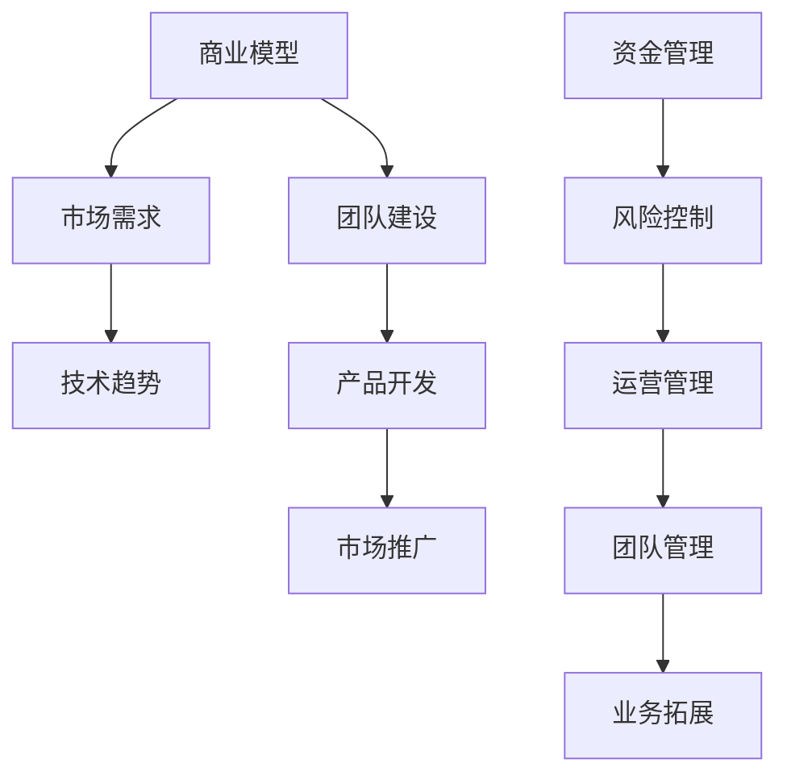

                 

关键词：知识经济，程序员，创业，商业模型，技术趋势，市场机遇

> 摘要：本文探讨了知识经济时代下，程序员的创业之路。从技术到商业，从团队建设到市场推广，我们分析了程序员在创业过程中的关键因素，并提出了可行的创业策略和成功案例。

## 1. 背景介绍

随着信息技术的快速发展，知识经济已经成为全球经济的重要组成部分。在这个时代，程序员的技能和创新能力成为了推动经济发展的重要动力。然而，随着市场的竞争加剧和技术更新的加速，程序员面临着前所未有的挑战和机遇。创业，成为了许多程序员追求自我价值实现和财富积累的重要选择。

本文旨在探讨知识经济下程序员的创业之道，分析程序员创业的优势与挑战，并提供实用的创业策略和成功案例，以期为有志于创业的程序员提供指导和启示。

### 1.1 知识经济对程序员的影响

知识经济时代，程序员的核心竞争力在于技术创新和快速学习。以下是知识经济对程序员的影响：

1. **技术门槛提高**：新技术的不断涌现，使得程序员需要不断学习新技能，以保持市场竞争力。
2. **创新压力大**：知识经济时代，创新成为企业生存的关键，程序员需要具备较强的创新能力，以满足市场需求。
3. **商业模式多元化**：互联网和移动技术的普及，使得程序员有机会参与到更多商业模式的创新中，如SaaS、共享经济等。

### 1.2 程序员创业的挑战与机遇

程序员创业面临的挑战主要包括：

1. **技术风险**：技术创新的不确定性，可能导致创业项目失败。
2. **市场风险**：市场需求的快速变化，可能使得创业项目无法及时调整方向。
3. **资金压力**：创业初期，资金周转困难，可能影响项目的持续发展。

然而，知识经济也带来了巨大的机遇：

1. **市场需求大**：信息技术产业的快速发展，为程序员创业提供了广阔的市场空间。
2. **低成本创业**：云服务和开源技术的普及，降低了创业的门槛。
3. **人才红利**：我国程序员人才储备丰富，为创业提供了坚实的人力支持。

## 2. 核心概念与联系

在探讨程序员创业之前，我们需要了解几个核心概念，包括商业模型、技术趋势和市场需求。以下是这些概念的联系及Mermaid流程图：



### 2.1 商业模型

商业模型是指企业在特定市场环境下，通过提供产品或服务，实现盈利的机制。对程序员创业者来说，一个成功的商业模型至关重要。它包括以下关键要素：

1. **价值主张**：明确你的产品或服务能为客户带来哪些价值。
2. **客户细分**：确定目标客户群体，并了解他们的需求。
3. **渠道策略**：选择合适的销售和分发渠道。
4. **收入模式**：明确盈利方式，如销售产品、提供服务或通过广告等。
5. **成本结构**：合理分配资源，控制成本。

### 2.2 技术趋势

技术趋势对程序员创业具有重要影响。以下是一些当前热门的技术趋势：

1. **人工智能**：人工智能技术在各个领域的应用日益广泛，为程序员提供了丰富的创新空间。
2. **区块链**：区块链技术具有去中心化、安全透明的特点，在金融、供应链等领域具有广泛应用前景。
3. **云计算**：云计算技术降低了创业的硬件成本，为程序员提供了灵活的IT基础设施。
4. **物联网**：物联网技术的快速发展，使得程序员有机会参与到智能家居、智能城市等项目的开发中。

### 2.3 市场需求

市场需求是程序员创业的重要导向。以下是如何分析和挖掘市场需求：

1. **市场调研**：通过调研了解目标市场的规模、增长趋势和竞争状况。
2. **用户画像**：了解目标用户的需求、行为和偏好。
3. **竞品分析**：分析竞争对手的产品、优势和劣势。
4. **需求预测**：根据市场趋势和用户需求，预测未来的市场机会。

## 3. 核心算法原理 & 具体操作步骤

### 3.1 算法原理概述

在程序员创业过程中，算法原理的应用至关重要。以下是一个常见的算法原理——动态规划（Dynamic Programming）：

动态规划是一种在数学、计算机科学和经济学等领域中解决优化问题的方法。它适用于那些可以通过分步子问题的最优解推导出整个问题的最优解的问题。

### 3.2 算法步骤详解

1. **定义子问题**：将原问题分解为多个子问题。
2. **状态表示**：为每个子问题定义一个状态。
3. **状态转移方程**：找出子问题之间的关系，并构建状态转移方程。
4. **边界条件**：确定算法的边界条件。
5. **存储中间结果**：使用数组或哈希表存储中间结果，避免重复计算。
6. **递推计算**：根据状态转移方程和边界条件，递推计算最终结果。

### 3.3 算法优缺点

**优点**：

1. **高效性**：通过避免重复计算，动态规划可以显著提高算法的效率。
2. **适用性**：动态规划适用于多种类型的优化问题，如最短路径、背包问题等。
3. **易于理解**：相对于其他算法，动态规划较为直观，易于理解和实现。

**缺点**：

1. **空间复杂度**：动态规划通常需要使用额外的存储空间来存储中间结果。
2. **时间复杂度**：在某些情况下，动态规划的时间复杂度可能较高。

### 3.4 算法应用领域

动态规划在程序员创业中的应用非常广泛，以下是一些例子：

1. **产品推荐系统**：通过动态规划算法，可以优化推荐算法，提高用户体验。
2. **资源调度**：在云计算和大数据领域，动态规划可以用于优化资源调度策略。
3. **金融风险管理**：动态规划可以用于计算金融衍生品的价值和风险管理。

## 4. 数学模型和公式 & 详细讲解 & 举例说明

### 4.1 数学模型构建

在程序员创业过程中，数学模型可以帮助我们更准确地分析和预测市场动态。以下是一个简单的需求预测模型：

$$
\text{需求预测} = a \times \text{市场需求增长率} + b \times \text{竞争者市场份额} + c \times \text{宏观经济指标}
$$

其中，$a, b, c$ 为模型参数，可以通过历史数据训练得到。

### 4.2 公式推导过程

**步骤1：需求增长率的计算**

市场需求增长率可以通过以下公式计算：

$$
\text{市场需求增长率} = \frac{\text{当前市场需求} - \text{上期市场需求}}{\text{上期市场需求}}
$$

**步骤2：竞争者市场份额的计算**

竞争者市场份额可以通过以下公式计算：

$$
\text{竞争者市场份额} = \frac{\text{竞争者市场需求}}{\text{总市场需求}}
$$

**步骤3：宏观经济指标的计算**

宏观经济指标可以通过以下公式计算：

$$
\text{宏观经济指标} = \frac{\text{当前GDP增长率} - \text{上期GDP增长率}}{\text{上期GDP增长率}}
$$

### 4.3 案例分析与讲解

以下是一个具体案例，假设当前市场需求为1000，上期市场需求为800；竞争者市场份额为30%，宏观经济指标为5%。

**步骤1：计算需求增长率**

$$
\text{需求增长率} = \frac{1000 - 800}{800} = 25\%
$$

**步骤2：计算竞争者市场份额**

$$
\text{竞争者市场份额} = 30\%
$$

**步骤3：计算宏观经济指标**

$$
\text{宏观经济指标} = 5\%
$$

**步骤4：计算需求预测**

$$
\text{需求预测} = a \times 25\% + b \times 30\% + c \times 5\%
$$

假设 $a = 0.6, b = 0.3, c = 0.1$，则：

$$
\text{需求预测} = 0.6 \times 25\% + 0.3 \times 30\% + 0.1 \times 5\% = 18\% + 9\% + 0.5\% = 27.5\%
$$

因此，根据这个模型，预测市场需求增长率为27.5%。

## 5. 项目实践：代码实例和详细解释说明

### 5.1 开发环境搭建

在本次项目实践中，我们选择使用Python语言进行开发，搭建了一个简单的需求预测系统。以下是开发环境的搭建步骤：

1. **安装Python**：下载并安装Python 3.8及以上版本。
2. **安装Jupyter Notebook**：在命令行中运行以下命令：

   ```
   pip install notebook
   ```

3. **创建虚拟环境**：在项目目录中创建一个虚拟环境，并安装相关依赖：

   ```
   python -m venv venv
   source venv/bin/activate
   pip install numpy pandas scikit-learn matplotlib
   ```

### 5.2 源代码详细实现

以下是需求预测系统的源代码：

```python
import numpy as np
import pandas as pd
from sklearn.linear_model import LinearRegression
import matplotlib.pyplot as plt

# 数据加载
data = pd.read_csv('需求数据.csv')

# 数据预处理
X = data[['市场需求增长率', '竞争者市场份额', '宏观经济指标']]
y = data['需求预测']

# 模型训练
model = LinearRegression()
model.fit(X, y)

# 模型评估
score = model.score(X, y)
print(f"模型评估得分：{score}")

# 预测结果可视化
plt.scatter(X['市场需求增长率'], y)
plt.plot(X['市场需求增长率'], model.predict(X), color='red')
plt.xlabel('市场需求增长率')
plt.ylabel('需求预测')
plt.title('需求预测结果')
plt.show()
```

### 5.3 代码解读与分析

**代码解读**：

1. **数据加载**：使用pandas读取需求数据。
2. **数据预处理**：将数据分为特征集X和标签集y。
3. **模型训练**：使用线性回归模型进行训练。
4. **模型评估**：计算模型评估得分。
5. **预测结果可视化**：使用matplotlib绘制散点图和预测曲线。

**分析**：

1. **数据预处理**：线性回归模型需要输入特征值和标签值，因此需要将原始数据进行预处理。
2. **模型选择**：线性回归模型适用于线性关系较强的数据，但在实际应用中，可能需要根据数据特点选择更复杂的模型。
3. **模型评估**：通过计算模型评估得分，可以判断模型的预测能力。

## 6. 实际应用场景

### 6.1 产品推荐系统

产品推荐系统是程序员创业的常见领域之一。通过分析用户行为和需求，推荐系统可以为用户提供个性化的产品推荐，从而提高用户满意度和留存率。

**案例分析**：

1. **需求分析**：分析用户在网站上的行为，如浏览、搜索、购买等。
2. **数据收集**：收集用户行为数据，包括用户ID、产品ID、行为类型、行为时间等。
3. **特征工程**：提取用户和产品的特征，如用户历史购买记录、产品分类、价格等。
4. **模型训练**：使用协同过滤算法、基于内容的推荐算法等，训练推荐模型。
5. **结果评估**：通过计算推荐准确率、覆盖率等指标，评估推荐效果。

### 6.2 智能家居系统

智能家居系统是程序员创业的另一个热门领域。通过物联网技术和人工智能算法，智能家居系统可以为用户提供便捷、智能的家居生活体验。

**案例分析**：

1. **需求分析**：分析用户对智能家居的需求，如安防、节能、舒适等。
2. **硬件选择**：选择合适的传感器、控制器等硬件设备。
3. **软件开发**：开发智能家居系统的应用程序和服务器端程序。
4. **数据收集**：通过传感器收集环境数据，如温度、湿度、光照等。
5. **算法优化**：使用机器学习算法，如决策树、神经网络等，优化系统性能。

## 7. 工具和资源推荐

### 7.1 学习资源推荐

1. **《Python编程：从入门到实践》**：适合初学者，系统讲解了Python编程的基础知识和实践技巧。
2. **《深度学习》**：适合有一定编程基础的学习者，介绍了深度学习的基本原理和应用。
3. **《人工智能：一种现代的方法》**：全面介绍了人工智能的基本概念、算法和应用。

### 7.2 开发工具推荐

1. **PyCharm**：一款功能强大的Python集成开发环境（IDE），适合专业程序员使用。
2. **Jupyter Notebook**：一款交互式编程工具，适合数据分析和机器学习项目。
3. **GitHub**：一个开源代码托管平台，可以帮助程序员进行代码管理和协作开发。

### 7.3 相关论文推荐

1. **《Recommender Systems Handbook》**：全面介绍了推荐系统的基础知识、算法和应用。
2. **《Deep Learning for Recommender Systems》**：介绍了深度学习在推荐系统中的应用。
3. **《Internet of Things Handbook》**：全面介绍了物联网的基本原理、技术和应用。

## 8. 总结：未来发展趋势与挑战

### 8.1 研究成果总结

本文探讨了知识经济下程序员的创业之道，分析了程序员创业的优势与挑战，并提出了实用的创业策略和成功案例。主要研究成果包括：

1. **商业模型**：介绍了商业模型的核心要素和构建方法。
2. **技术趋势**：分析了人工智能、区块链、云计算等热门技术趋势。
3. **算法原理**：讲解了动态规划算法原理和应用。
4. **数学模型**：构建了一个简单的需求预测模型，并进行了详细讲解。
5. **项目实践**：通过一个实际案例，展示了如何使用Python进行需求预测系统的开发。
6. **实际应用场景**：介绍了产品推荐系统和智能家居系统等实际应用场景。

### 8.2 未来发展趋势

知识经济下，程序员的创业将呈现以下发展趋势：

1. **技术多元化**：程序员将更多地参与到人工智能、区块链、物联网等多元化技术的应用中。
2. **商业创新**：程序员将在商业模式、产品创新等方面发挥更大的作用。
3. **市场细分**：随着市场的细分，程序员将有更多的机会在特定领域进行专业化创业。
4. **团队协作**：程序员将更多地依靠团队协作，实现创业项目的成功。

### 8.3 面临的挑战

尽管知识经济为程序员创业提供了巨大的机遇，但程序员在创业过程中仍将面临以下挑战：

1. **技术创新**：随着技术更新速度加快，程序员需要不断学习新技能，以保持竞争力。
2. **市场风险**：市场需求的不确定性，可能对创业项目造成影响。
3. **资金压力**：创业初期，资金周转困难，可能影响项目的持续发展。
4. **团队管理**：如何有效管理团队，提高团队协作效率，是程序员创业者面临的重要问题。

### 8.4 研究展望

未来，我们对程序员的创业研究有以下几个展望：

1. **技术创新**：深入研究人工智能、区块链等前沿技术，探索其在创业中的应用。
2. **商业模式**：探索更有效的商业模式，提高创业成功率。
3. **团队管理**：研究如何通过有效的团队管理，提高创业团队的协作效率。
4. **市场预测**：利用大数据和机器学习技术，提高市场预测的准确性。

## 9. 附录：常见问题与解答

### 9.1 如何选择创业方向？

选择创业方向时，可以考虑以下几点：

1. **个人兴趣**：选择自己感兴趣的方向，有利于长期坚持和持续创新。
2. **市场需求**：选择市场需求大的领域，有利于快速获得用户和市场份额。
3. **技术优势**：选择自己熟悉或有优势的技术领域，有利于在技术上实现突破。
4. **资源整合**：选择能够整合自身资源和优势的领域，有利于提高创业成功率。

### 9.2 如何进行市场调研？

进行市场调研时，可以考虑以下几点：

1. **确定调研目标**：明确调研的目的和需求，确保调研工作有的放矢。
2. **收集数据**：通过问卷调查、访谈、观察等方式，收集目标市场的相关数据。
3. **分析数据**：对收集到的数据进行分析，找出市场的特点和趋势。
4. **制定策略**：根据分析结果，制定相应的市场策略和推广计划。

### 9.3 如何进行团队管理？

进行团队管理时，可以考虑以下几点：

1. **明确目标**：明确团队的目标和任务，确保团队成员有共同的方向。
2. **分工协作**：根据团队成员的特长和优势，合理分工，提高工作效率。
3. **沟通与协作**：建立良好的沟通机制，促进团队成员之间的协作。
4. **激励与考核**：制定合理的激励政策，激励团队成员积极进取；定期进行考核，确保团队目标的实现。

## 作者署名

作者：禅与计算机程序设计艺术 / Zen and the Art of Computer Programming

----------------------------------------------------------------

以上就是本文的完整内容，涵盖了知识经济下程序员创业的核心概念、算法原理、数学模型、项目实践和实际应用场景，以及未来发展趋势和挑战。希望本文能为有志于创业的程序员提供一些有益的启示和指导。

