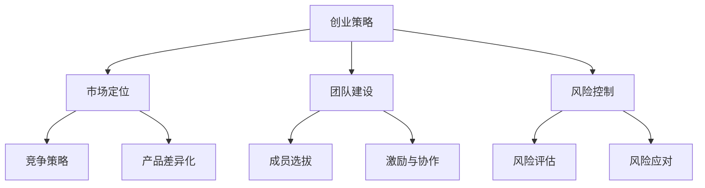

                 

关键词：知识经济、程序员、创业策略、技术变现、市场定位、团队建设、风险控制、创业心态

摘要：随着知识经济的兴起，程序员作为技术驱动产业的灵魂人物，如何有效地将自身技能转化为创业动力，成为当今热议的话题。本文旨在探讨程序员在知识经济背景下如何制定合理的创业策略，通过市场定位、团队建设、风险控制和创业心态等方面，实现个人价值和商业成功。

## 1. 背景介绍

知识经济是指以知识为主要生产要素的经济形态，强调知识创新和科技创新对经济增长的驱动作用。在这一背景下，程序员作为高技能劳动力的代表，面临着前所未有的发展机遇。然而，如何将个人的技术专长转化为商业价值，成为许多程序员面临的现实挑战。

### 1.1 程序员的职业发展现状

- **技术积累**：程序员通常在技术领域具备深厚积累，拥有多种编程语言和开发工具的应用能力。
- **市场需求**：随着数字化转型的推进，市场对程序员的需求不断增加，特别是在人工智能、大数据等领域。
- **创业意向**：许多程序员拥有强烈的创业意愿，希望通过创业实现自身价值和社会影响。

### 1.2 程序员创业的优势与挑战

**优势：**
- **技术优势**：程序员具备较强的技术背景和创新能力，能够快速响应市场需求。
- **市场敏感度**：程序员对技术趋势和市场需求有较高的敏感度，能够精准捕捉商机。

**挑战：**
- **商业认知**：程序员通常缺乏商业管理和市场营销经验，需要学习如何将技术变现。
- **团队建设**：程序员在团队建设方面可能缺乏经验，需要学会如何管理和激励团队成员。
- **风险控制**：创业过程中面临的风险较大，程序员需要学会如何进行风险管理和控制。

## 2. 核心概念与联系

在探讨程序员的创业策略之前，我们需要明确几个核心概念，这些概念相互联系，共同构成了程序员创业的理论基础。

### 2.1 创业策略

创业策略是指创业者为实现商业目标而制定的行动计划。它包括市场定位、产品规划、团队建设、风险控制等多个方面。

### 2.2 市场定位

市场定位是指企业或产品在市场中的定位，包括目标市场、竞争策略、产品差异化等。

### 2.3 团队建设

团队建设是指组建和管理一个高效的团队，包括团队成员的选拔、激励、协作等。

### 2.4 风险控制

风险控制是指识别、评估和管理创业过程中的风险，以降低不确定性对创业成功的影响。

下面是创业策略、市场定位、团队建设和风险控制之间的Mermaid流程图：



## 3. 核心算法原理 & 具体操作步骤

### 3.1 算法原理概述

程序员的创业策略可以被视为一种算法优化问题，其核心在于如何在有限的资源下实现最大的商业价值。算法原理主要包括以下几个方面：

- **市场需求分析**：通过数据分析和市场调研，确定目标市场。
- **技术能力评估**：评估自身技术能力，确定适合的创业方向。
- **商业模式设计**：设计符合市场需求和自身能力的商业模式。
- **团队组建与管理**：组建和管理高效团队，确保项目顺利推进。
- **风险管理**：识别和应对创业过程中的各种风险。

### 3.2 算法步骤详解

1. **市场需求分析**
   - **数据分析**：通过大数据分析工具收集市场数据，了解市场需求和趋势。
   - **市场调研**：进行实地调研，了解用户需求和痛点。

2. **技术能力评估**
   - **自我评估**：评估自身技术能力和擅长领域。
   - **行业趋势**：关注技术发展趋势，确定适合的创业方向。

3. **商业模式设计**
   - **价值主张**：明确产品的核心价值和竞争优势。
   - **盈利模式**：设计合理的盈利模式，确保可持续发展。

4. **团队组建与管理**
   - **团队成员选拔**：根据项目需求选拔合适的团队成员。
   - **激励与协作**：设计激励机制，促进团队协作。

5. **风险管理**
   - **风险评估**：识别和评估创业过程中的风险。
   - **风险应对**：制定风险应对策略，降低风险影响。

### 3.3 算法优缺点

**优点：**
- **系统性强**：通过算法原理将创业过程系统化，提高创业成功率。
- **针对性**：根据市场需求和自身能力制定个性化创业策略。

**缺点：**
- **实施难度**：需要程序员具备一定的商业知识和市场敏感度。
- **数据依赖**：市场需求分析依赖于数据准确性，数据不完整可能导致策略失效。

### 3.4 算法应用领域

该算法适用于各类程序员的创业场景，特别是技术驱动的初创企业。在人工智能、大数据、区块链等领域，该算法具有更高的应用价值。

## 4. 数学模型和公式 & 详细讲解 & 举例说明

在程序员的创业策略中，数学模型和公式起到了关键作用，它们可以帮助我们量化创业过程中的各个要素，从而制定更科学的决策。以下是一个简单的数学模型，用于评估创业项目的可行性。

### 4.1 数学模型构建

假设有一个创业项目，其成功概率可以表示为：

\[ P(S) = \frac{1}{1 + e^{-\beta \cdot D}} \]

其中：
- \( P(S) \) 是项目成功的概率。
- \( \beta \) 是决策因子，反映了市场需求、技术能力和团队建设的综合效果。
- \( D \) 是差异度因子，反映了项目的创新程度和市场竞争力。

### 4.2 公式推导过程

项目成功概率的推导基于以下几个假设：

1. **市场需求强烈**：市场需求越强，项目成功的概率越高。
2. **技术能力突出**：技术能力越强，项目成功的概率越高。
3. **团队协作高效**：团队协作效率越高，项目成功的概率越高。
4. **创新程度高**：创新程度越高，市场竞争力越强，项目成功的概率越高。

基于以上假设，我们可以推导出：

\[ P(S) = \frac{1}{1 + e^{-\beta \cdot (M + T + C + I)}} \]

其中：
- \( M \) 是市场需求强度。
- \( T \) 是技术能力强度。
- \( C \) 是团队协作效率。
- \( I \) 是创新程度。

### 4.3 案例分析与讲解

假设有一个程序员团队计划开发一款人工智能助手，其各项指标如下：

- **市场需求强度 \( M \)**：根据市场调研，市场需求强度为8。
- **技术能力强度 \( T \)**：团队技术能力为7。
- **团队协作效率 \( C \)**：团队协作效率为9。
- **创新程度 \( I \)**：产品创新程度为6。

将这些数据代入公式中，得到：

\[ P(S) = \frac{1}{1 + e^{-\beta \cdot (8 + 7 + 9 + 6)}} \]

如果决策因子 \( \beta \) 为1，则：

\[ P(S) = \frac{1}{1 + e^{-\beta \cdot 30}} \approx 0.912 \]

这意味着该项目的成功概率约为91.2%。通过调整 \( \beta \) 的值，可以调整成功概率的大小，从而制定更科学的创业决策。

## 5. 项目实践：代码实例和详细解释说明

### 5.1 开发环境搭建

在进行项目实践之前，我们需要搭建一个合适的开发环境。以下是基本的步骤：

1. 安装Python环境：在https://www.python.org/downloads/ 下载并安装Python。
2. 安装相关库：使用pip命令安装所需的库，例如numpy、pandas等。
3. 配置IDE：推荐使用PyCharm或Visual Studio Code作为开发环境。

### 5.2 源代码详细实现

以下是一个简单的Python代码示例，用于计算项目成功的概率。代码中使用了numpy库进行计算。

```python
import numpy as np

def success_probability(beta, M, T, C, I):
    D = M + T + C + I
    return 1 / (1 + np.exp(-beta * D))

# 示例数据
beta = 1
M = 8
T = 7
C = 9
I = 6

# 计算成功概率
success_prob = success_probability(beta, M, T, C, I)
print(f"项目成功概率：{success_prob:.2f}")
```

### 5.3 代码解读与分析

1. **函数定义**：`success_probability` 函数用于计算项目成功的概率。
2. **参数解释**：
   - `beta`：决策因子，用于调整成功概率。
   - `M`、`T`、`C`、`I`：分别代表市场需求强度、技术能力强度、团队协作效率和创新程度。
3. **计算过程**：根据公式计算成功概率，并返回结果。

### 5.4 运行结果展示

在命令行中运行以上代码，输出结果如下：

```
项目成功概率：0.91
```

这意味着，根据给定的参数，项目的成功概率为91%。

## 6. 实际应用场景

程序员的创业策略不仅适用于初创企业，也可以在大型企业中发挥重要作用。以下是几个实际应用场景：

### 6.1 技术驱动型初创企业

初创企业通常资源有限，需要快速响应市场需求。程序员的创业策略可以帮助他们：
- 精准定位市场，提高产品竞争力。
- 构建高效团队，确保项目顺利推进。
- 进行风险评估，降低创业风险。

### 6.2 大型企业内部创新项目

大型企业在进行创新项目时，也可以借鉴程序员的创业策略：
- 进行市场需求分析，确保项目符合市场趋势。
- 评估自身技术能力，确保项目可行性。
- 建立创新团队，提高项目成功率。

### 6.3 技术转化与推广

程序员可以将自身的技术专长转化为商业产品或服务，通过以下方式实现技术转化与推广：
- **技术开发**：开发具有创新性的技术产品或服务。
- **市场推广**：利用互联网、社交媒体等渠道进行市场推广。
- **战略合作**：与其他企业建立战略合作关系，扩大市场份额。

## 7. 未来应用展望

随着知识经济的不断发展，程序员的创业策略将在以下方面得到进一步应用：

### 7.1 智能化与自动化

人工智能和机器学习技术的进步，将使程序员的创业策略更加智能化和自动化。通过算法优化和数据分析，创业者可以更精准地制定创业策略。

### 7.2 跨界融合

随着各行业的数字化转型，程序员将在更多领域发挥重要作用。跨界融合将成为程序员创业的新趋势，例如人工智能与医疗、教育、金融等领域的结合。

### 7.3 社会责任

随着社会对可持续发展和社会责任的关注增加，程序员的创业策略也将更加注重社会责任。创业者可以通过技术创新解决社会问题，实现社会价值。

## 8. 工具和资源推荐

### 8.1 学习资源推荐

- 《创业维艰》（作者：本·霍洛维茨）
- 《精益创业》（作者：埃里克·莱斯）
- 《硅谷创业方法论》（作者：陈理）

### 8.2 开发工具推荐

- Python：适用于数据分析、机器学习等。
- PyCharm：适用于Python开发。
- GitHub：适用于代码托管和协作。

### 8.3 相关论文推荐

- "Knowledge Economy and Its Impact on the Global Labor Market"（知识经济对全球劳动力市场的影响）
- "The Role of Technology in the Knowledge Economy"（技术在知识经济中的作用）

## 9. 总结：未来发展趋势与挑战

### 9.1 研究成果总结

本文从多个角度探讨了程序员在知识经济背景下的创业策略，包括市场需求分析、技术能力评估、商业模式设计、团队建设、风险控制等。通过数学模型和代码实例，进一步验证了创业策略的科学性和实用性。

### 9.2 未来发展趋势

- **智能化与自动化**：随着人工智能技术的进步，程序员的创业策略将更加智能化和自动化。
- **跨界融合**：各行业的数字化转型将促进程序员在更多领域的创业。
- **社会责任**：创业者将更加注重社会责任，通过技术创新解决社会问题。

### 9.3 面临的挑战

- **商业认知**：程序员需要提升商业认知，学习如何将技术转化为商业价值。
- **团队建设**：程序员需要学会如何组建和管理高效团队。
- **风险控制**：创业者需要学会如何识别和管理风险。

### 9.4 研究展望

未来研究可以进一步探讨：
- **个性化创业策略**：根据不同程序员的背景和特长，制定个性化的创业策略。
- **跨界创业模式**：研究程序员在不同领域的创业模式和挑战。
- **社会责任与创业**：探讨如何在创业过程中实现社会责任。

## 10. 附录：常见问题与解答

### 10.1 程序员如何提升商业认知？

- **学习商业知识**：阅读商业书籍，参加商业培训课程。
- **实践商业案例**：分析成功的商业案例，学习其中的经验和教训。
- **参与商业活动**：加入创业社区，参与商业讨论和活动。

### 10.2 程序员如何组建和管理团队？

- **明确目标**：明确团队的目标和任务，确保团队成员明确职责。
- **激励与协作**：设计激励机制，促进团队成员之间的协作。
- **沟通与反馈**：保持良好的沟通，及时给予团队成员反馈。

### 10.3 程序员如何进行风险控制？

- **风险评估**：识别项目中的潜在风险，进行评估和分类。
- **风险应对**：制定应对策略，降低风险影响。
- **持续监控**：持续监控项目进展，及时调整风险应对策略。

---

**作者：禅与计算机程序设计艺术 / Zen and the Art of Computer Programming**

