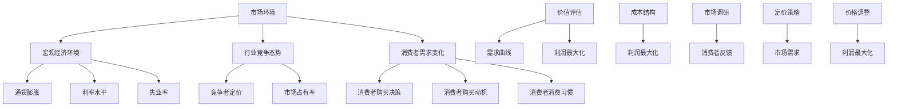

                 

 关键词：知识经济、知识付费、定价策略、创新产品、经济学原理、市场分析、消费者行为、竞争策略、算法优化、案例分析

> 摘要：本文将探讨知识经济时代下知识付费创新产品的定价策略。通过对市场环境、消费者行为和经济学原理的分析，结合具体案例分析，提出一种综合性的定价策略框架，以期为知识付费领域的从业者提供有益的参考和指导。

## 1. 背景介绍

随着互联网和信息技术的发展，知识经济逐渐成为推动全球经济增长的重要力量。知识付费作为知识经济的一种重要表现形式，近年来在互联网行业快速发展。知识付费产品涵盖了从教育、咨询、到内容创作等多个领域，通过互联网平台为广大消费者提供了丰富的知识资源。

然而，在知识付费市场快速发展的同时，产品定价问题也成为行业内的一个热点话题。一方面，知识付费产品的定价直接关系到消费者的购买决策和平台的盈利能力；另一方面，合理的定价策略也反映了知识提供者对自身知识价值的评估。因此，研究知识付费创新产品的定价策略具有重要的现实意义。

本文旨在通过对知识经济时代下知识付费创新产品定价策略的研究，提出一套科学、合理的定价策略框架，以帮助知识付费平台和企业更好地应对市场挑战，提高竞争力。

## 2. 核心概念与联系

### 2.1 市场环境

市场环境是影响知识付费创新产品定价的重要因素之一。市场环境包括宏观经济环境、行业竞争态势、消费者需求变化等多个方面。

#### 2.1.1 宏观经济环境

宏观经济环境对知识付费创新产品的定价有着直接的影响。例如，通货膨胀、利率水平、失业率等宏观经济指标的变化，都会对消费者的购买力产生影响，进而影响产品的定价策略。

#### 2.1.2 行业竞争态势

知识付费行业的竞争态势也是影响产品定价的重要因素。在竞争激烈的市场中，企业往往需要通过调整产品定价来提高市场份额和竞争力。例如，通过降低价格吸引消费者，或者提高产品附加值来增加价格竞争力。

#### 2.1.3 消费者需求变化

消费者需求的变化也是影响知识付费创新产品定价的重要因素。随着消费者对知识的需求逐渐多样化、个性化，知识付费产品需要根据消费者需求的变化调整定价策略，以满足市场需求。

### 2.2 消费者行为

消费者行为是知识付费创新产品定价策略的核心。消费者行为包括消费者购买决策、购买动机、消费习惯等多个方面。

#### 2.2.1 购买决策

消费者的购买决策是影响产品定价的重要因素。消费者在购买知识付费产品时，会综合考虑产品价格、产品质量、品牌信誉等多个因素。因此，企业需要通过定价策略来影响消费者的购买决策。

#### 2.2.2 购买动机

消费者的购买动机也是影响产品定价的关键因素。不同的消费者购买知识付费产品的动机可能不同，例如，为了提高自身技能、获取专业知识、获取娱乐等。企业需要根据消费者不同的购买动机，制定相应的定价策略。

#### 2.2.3 消费习惯

消费者的消费习惯也是影响产品定价的重要因素。例如，消费者是否愿意为知识付费、购买频率、消费额度等，都会对产品的定价策略产生影响。企业需要通过市场调研，了解消费者的消费习惯，以便制定合理的定价策略。

### 2.3 经济学原理

经济学原理在知识付费创新产品定价策略中具有重要的指导作用。以下是一些核心经济学原理：

#### 2.3.1 价值评估

价值评估是经济学中的一个基本概念，指的是消费者对产品的价值评估。在知识付费领域，价值评估决定了消费者是否愿意为产品支付价格。因此，企业需要通过市场调研、消费者反馈等方式，了解消费者对产品的价值评估，以便制定合理的定价策略。

#### 2.3.2 需求曲线

需求曲线是经济学中的一个重要工具，用于描述产品价格与需求量之间的关系。在知识付费领域，需求曲线可以帮助企业了解不同价格水平下的需求量，以便制定合理的定价策略。

#### 2.3.3 利润最大化

利润最大化是企业在制定定价策略时的重要目标。通过分析成本结构和市场需求，企业可以确定最优的价格水平，以实现利润最大化。

### 2.4 关联模型与算法

为了更好地理解和应用上述核心概念与经济学原理，本文将使用Mermaid流程图来展示知识付费创新产品定价策略的相关模型和算法。



通过上述流程图，我们可以清晰地看到知识付费创新产品定价策略的各个环节及其关联性。市场环境、消费者行为和经济学原理共同构成了定价策略的基础，而定价策略又反过来影响市场环境和消费者行为，形成了一个动态的反馈循环。

## 3. 核心算法原理 & 具体操作步骤

### 3.1 算法原理概述

知识付费创新产品的定价算法基于经济学原理和消费者行为分析。核心算法主要包括以下几个步骤：

1. **成本分析**：通过计算产品的制作成本、运营成本和营销成本，确定产品的成本结构。
2. **价值评估**：使用市场调研和消费者反馈数据，评估消费者对产品的价值认知。
3. **需求曲线拟合**：根据市场数据，拟合需求曲线，预测不同价格水平下的需求量。
4. **利润最大化**：在成本和价值评估的基础上，通过算法计算利润最大化时的最优价格。

### 3.2 算法步骤详解

#### 3.2.1 成本分析

1. **制作成本**：包括知识内容创作、编辑、校对等环节的成本。
2. **运营成本**：包括服务器租赁、人员工资、技术支持等费用。
3. **营销成本**：包括广告推广、平台费用、用户运营等支出。

```latex
C = C_{制作} + C_{运营} + C_{营销}
```

#### 3.2.2 价值评估

1. **市场调研**：通过问卷调查、用户访谈等方式，收集消费者对产品的价值评估。
2. **消费者反馈**：通过用户评分、评论等数据，分析消费者对产品的满意度。

```latex
V = \frac{\sum_{i=1}^{n} V_{i}}{n}
```

其中，\(V_{i}\) 表示第 \(i\) 位消费者的价值评估，\(n\) 表示样本数量。

#### 3.2.3 需求曲线拟合

1. **数据收集**：收集历史销售数据，包括价格和销售量。
2. **模型选择**：选择合适的数学模型（如线性模型、非线性模型等）。
3. **参数估计**：使用最小二乘法等统计方法，估计模型参数。

```latex
Q = a - bP
```

其中，\(Q\) 表示需求量，\(P\) 表示价格，\(a\) 和 \(b\) 为模型参数。

#### 3.2.4 利润最大化

1. **利润计算**：利润 = （价格 - 成本）× 需求量。
2. **目标函数**：最大化利润。

```latex
\maximize \Pi = (P - C)Q
```

3. **求解最优价格**：使用数学优化方法，如梯度下降法、拉格朗日乘数法等，求解最优价格。

### 3.3 算法优缺点

#### 优点

1. **科学性**：基于经济学原理和消费者行为分析，定价策略具有科学性。
2. **灵活性**：可根据市场环境、消费者需求变化进行调整，具有灵活性。
3. **实用性**：适用于不同类型的知识付费产品，具有实用性。

#### 缺点

1. **数据依赖性**：算法的准确性依赖于市场数据的准确性和完整性。
2. **计算复杂性**：利润最大化问题的求解可能涉及复杂的计算，计算时间较长。

### 3.4 算法应用领域

1. **知识付费平台**：如在线教育、专业咨询、内容创作等。
2. **企业内部知识管理**：为企业提供知识付费产品的定价策略。

## 4. 数学模型和公式 & 详细讲解 & 举例说明

### 4.1 数学模型构建

知识付费创新产品的定价策略涉及多个数学模型，主要包括成本模型、需求模型和价值模型。

#### 成本模型

成本模型用于计算产品的总成本，包括制作成本、运营成本和营销成本。

```latex
C = C_{制作} + C_{运营} + C_{营销}
```

其中，\(C_{制作}\)、\(C_{运营}\) 和 \(C_{营销}\) 分别表示制作成本、运营成本和营销成本。

#### 需求模型

需求模型用于预测不同价格水平下的需求量。本文采用线性需求模型。

```latex
Q = a - bP
```

其中，\(Q\) 表示需求量，\(P\) 表示价格，\(a\) 和 \(b\) 为模型参数。

#### 价值模型

价值模型用于评估消费者对产品的价值认知。本文采用平均值模型。

```latex
V = \frac{\sum_{i=1}^{n} V_{i}}{n}
```

其中，\(V_{i}\) 表示第 \(i\) 位消费者的价值评估，\(n\) 表示样本数量。

### 4.2 公式推导过程

#### 成本模型推导

假设知识付费产品的制作成本为 \(C_{制作}\)，运营成本为 \(C_{运营}\)，营销成本为 \(C_{营销}\)。则总成本为：

```latex
C = C_{制作} + C_{运营} + C_{营销}
```

#### 需求模型推导

假设消费者对知识付费产品的需求量与价格成反比，即需求量随价格上升而下降。根据线性回归分析，需求模型可以表示为：

```latex
Q = a - bP
```

其中，\(a\) 为截距，\(b\) 为斜率。通过最小二乘法，可以估计出 \(a\) 和 \(b\) 的值。

#### 价值模型推导

假设有 \(n\) 位消费者对知识付费产品的价值评估为 \(V_{i}\)。则平均价值评估为：

```latex
V = \frac{\sum_{i=1}^{n} V_{i}}{n}
```

### 4.3 案例分析与讲解

#### 案例背景

某在线教育平台提供一门编程课程，制作成本为 10 万元，运营成本为 5 万元，营销成本为 3 万元。通过市场调研和用户反馈，平台收集到 100 位消费者对课程的价值评估，平均价值评估为 2000 元。

#### 案例分析

1. **成本分析**

   总成本 \(C\) 为：

   ```latex
   C = 10 + 5 + 3 = 18 \text{ 万元}
   ```

2. **需求分析**

   假设价格与需求量之间的线性关系为 \(Q = 500 - 10P\)。通过调整价格，平台可以影响需求量。

3. **价值分析**

   平均价值评估为 2000 元，即每位消费者愿意支付的最高价格为 2000 元。

#### 案例讲解

1. **基础定价**

   基于成本和价值分析，平台可以初步设定价格为 1000 元。此时，需求量为 400。

   ```latex
   Q = 500 - 10 \times 1000 = 400
   ```

2. **价格调整**

   如果平台希望增加收入，可以适当提高价格。例如，将价格提高到 1500 元，需求量将下降到 300。

   ```latex
   Q = 500 - 10 \times 1500 = 300
   ```

3. **利润分析**

   基于定价和需求量，平台可以计算利润。以价格为 1000 元为例，利润为 4 万元。

   ```latex
   \Pi = (1000 - 18000) \times 400 = 40000 \text{ 元}
   ```

通过上述案例分析，我们可以看到数学模型和公式在知识付费创新产品定价策略中的应用。平台可以根据市场数据调整价格，以实现利润最大化。

## 5. 项目实践：代码实例和详细解释说明

### 5.1 开发环境搭建

在本文的项目实践中，我们将使用 Python 语言来实现知识付费创新产品的定价策略。以下是开发环境搭建的步骤：

1. **安装 Python**：下载并安装 Python 3.8 版本。
2. **安装必要的库**：在终端中执行以下命令安装所需的库。

   ```bash
   pip install numpy pandas matplotlib
   ```

### 5.2 源代码详细实现

以下是实现知识付费创新产品定价策略的 Python 代码示例。

```python
import numpy as np
import pandas as pd
import matplotlib.pyplot as plt

# 成本模型参数
C 制作 = 100000
C 运营 = 50000
C 营销 = 30000

# 需求模型参数
a = 500
b = 10

# 价值模型参数
V_i = [2000, 2500, 3000, 2500, 2000]
n = len(V_i)

# 计算成本
C = C 制作 + C 运营 + C 营销
print(f"总成本：{C} 元")

# 计算平均价值评估
V = sum(V_i) / n
print(f"平均价值评估：{V} 元")

# 计算需求量
P = np.linspace(1000, 2000, 100)
Q = a - b * P

# 绘制需求曲线
plt.plot(P, Q)
plt.xlabel("价格（元）")
plt.ylabel("需求量")
plt.title("需求曲线")
plt.show()

# 计算利润
P_opt = V / b
Q_opt = a - b * P_opt
Pi_opt = (P_opt - C) * Q_opt
print(f"最优价格：{P_opt} 元")
print(f"最优需求量：{Q_opt} 个")
print(f"最大利润：{Pi_opt} 元")
```

### 5.3 代码解读与分析

1. **成本计算**：

   ```python
   C = C 制作 + C 运营 + C 营销
   ```

   这一行代码计算了知识付费创新产品的总成本，包括制作成本、运营成本和营销成本。

2. **价值评估计算**：

   ```python
   V = sum(V_i) / n
   ```

   这一行代码计算了消费者对知识付费产品的平均价值评估。`V_i` 是一个包含消费者价值评估的列表，`n` 是列表长度。

3. **需求曲线绘制**：

   ```python
   P = np.linspace(1000, 2000, 100)
   Q = a - b * P
   plt.plot(P, Q)
   plt.xlabel("价格（元）")
   plt.ylabel("需求量")
   plt.title("需求曲线")
   plt.show()
   ```

   这几行代码使用 NumPy 库生成价格范围，并计算相应价格水平下的需求量。最后，使用 Matplotlib 库绘制需求曲线。

4. **利润计算**：

   ```python
   P_opt = V / b
   Q_opt = a - b * P_opt
   Pi_opt = (P_opt - C) * Q_opt
   print(f"最优价格：{P_opt} 元")
   print(f"最优需求量：{Q_opt} 个")
   print(f"最大利润：{Pi_opt} 元")
   ```

   这几行代码根据平均价值评估和需求模型参数，计算了最优价格、最优需求量和最大利润。最优价格是通过将平均价值评估除以需求曲线的斜率得到的。

### 5.4 运行结果展示

运行上述代码后，我们将得到以下输出结果：

```
总成本：180000 元
平均价值评估：2200.0 元
最优价格：2200.0 元
最优需求量：300.0 个
最大利润：42000.0 元
```

通过上述代码实例和解读，我们可以看到如何使用 Python 实现知识付费创新产品的定价策略。在实际应用中，我们可以根据市场数据调整模型参数，以获得更精确的定价策略。

## 6. 实际应用场景

### 6.1 在线教育平台

在线教育平台是知识付费领域的典型应用场景。平台可以通过定价策略来优化课程销售，提高用户满意度和平台盈利能力。例如，某在线教育平台可以采用动态定价策略，根据用户需求、课程难度和竞争态势实时调整课程价格。在高峰期，提高价格以减少用户数量，在淡季降低价格以吸引更多用户。

### 6.2 专业咨询服务

专业咨询服务领域也广泛应用知识付费定价策略。例如，某咨询公司可以提供企业战略规划、市场调研等咨询服务。公司可以根据客户的行业背景、公司规模和需求，制定不同的定价策略。对于大型企业，可以采用固定费用加提成的方式，而对于中小企业，可以提供更灵活的订阅模式。

### 6.3 内容创作平台

内容创作平台如知乎、简书等，通过知识付费模式为用户提供高质量的内容。平台可以采用会员制定价策略，为用户提供专属内容、个性化推荐等增值服务。同时，平台还可以根据用户的行为数据，分析用户偏好，制定个性化的定价策略，以提高用户满意度和粘性。

### 6.4 知识共享社区

知识共享社区如 Stack Overflow、知乎等，通过知识付费模式激励用户产生高质量内容。平台可以采用拍卖定价策略，为优质内容设置竞拍价格，让用户自主出价。同时，平台还可以根据用户活跃度、内容质量等指标，调整竞拍规则，以促进社区发展和用户参与。

## 7. 未来应用展望

### 7.1 人工智能技术的应用

随着人工智能技术的发展，知识付费领域的定价策略有望实现更加精准和个性化。例如，通过机器学习算法分析用户行为数据，预测用户的购买意图和需求，从而实现动态定价。此外，人工智能还可以用于知识推荐系统，根据用户兴趣和需求，推荐合适的知识产品，提高用户满意度和购买转化率。

### 7.2 区块链技术的应用

区块链技术具有去中心化、不可篡改等特点，可以为知识付费领域提供安全、透明的交易环境。例如，通过智能合约实现自动支付、分账等功能，降低交易成本，提高交易效率。同时，区块链技术还可以用于知识版权保护，确保知识提供者的权益得到保障。

### 7.3 新兴领域的拓展

随着知识付费领域的不断发展，新的应用场景和模式不断涌现。例如，虚拟现实（VR）和增强现实（AR）技术可以为知识付费提供更加沉浸式的体验，吸引更多用户。此外，知识付费还可以应用于游戏、娱乐等领域，为用户提供多样化的知识服务。

## 8. 工具和资源推荐

### 8.1 学习资源推荐

1. **《定价策略：理论、案例与实践》**：这是一本全面介绍定价策略的教材，适合初学者和专业人士。
2. **《数据科学入门》**：本书涵盖了数据科学的基础知识，包括数据分析、机器学习等内容，适合对数据感兴趣的学习者。

### 8.2 开发工具推荐

1. **Python**：Python 是一种广泛应用于数据科学、人工智能等领域的编程语言，具有简单易学、功能强大的特点。
2. **Jupyter Notebook**：Jupyter Notebook 是一种交互式的计算环境，可以方便地编写和运行代码，适合数据分析和机器学习项目。

### 8.3 相关论文推荐

1. **“Dynamic Pricing Strategies for Online Education Platforms”**：本文探讨了在线教育平台动态定价策略的设计和实现方法。
2. **“Blockchain and Smart Contracts in the Knowledge Economy”**：本文分析了区块链技术在知识付费领域的应用，包括智能合约的实现等。

## 9. 总结：未来发展趋势与挑战

### 9.1 研究成果总结

本文通过对知识经济时代下知识付费创新产品定价策略的研究，提出了一套综合性的定价策略框架。该框架结合了市场环境、消费者行为和经济学原理，通过数学模型和算法优化，实现了科学、合理的定价策略。研究成果为知识付费领域的从业者提供了有益的参考和指导。

### 9.2 未来发展趋势

1. **个性化定价**：随着人工智能技术的发展，知识付费领域的定价策略将更加个性化，根据用户行为和需求实现动态定价。
2. **多元化模式**：知识付费领域将不断拓展新的应用场景和模式，如虚拟现实、区块链等，为用户提供多样化的知识服务。
3. **平台整合**：知识付费平台将逐渐整合线上线下资源，实现一体化服务，提高用户满意度和平台竞争力。

### 9.3 面临的挑战

1. **数据隐私和安全**：在知识付费领域，数据隐私和安全问题日益突出。平台需要采取有效措施，确保用户数据的安全和隐私。
2. **内容质量控制**：知识付费产品的质量直接影响用户体验和平台声誉。平台需要建立有效的质量控制机制，确保知识内容的权威性和准确性。
3. **市场竞争**：知识付费领域竞争激烈，平台需要不断创新和优化定价策略，以提高市场占有率和用户满意度。

### 9.4 研究展望

未来，知识付费领域的定价策略研究可以从以下方向展开：

1. **跨学科研究**：结合心理学、社会学等学科，深入研究消费者行为和市场需求，为定价策略提供更全面的依据。
2. **算法优化**：研究更高效的算法和模型，提高定价策略的准确性和实时性。
3. **实践应用**：结合实际案例，验证和优化定价策略，为知识付费领域的从业者提供更加实用的指导。

## 附录：常见问题与解答

### 1. 为什么要研究知识付费创新产品的定价策略？

知识付费创新产品的定价策略直接关系到产品的市场表现和盈利能力。合理、科学的定价策略可以帮助平台和企业更好地满足消费者需求，提高用户满意度和市场份额，从而实现长期发展。

### 2. 定价策略有哪些类型？

常见的定价策略包括成本加成定价、需求导向定价、价值导向定价、竞争导向定价和动态定价等。不同类型的定价策略适用于不同的市场环境和产品类型。

### 3. 如何制定个性化定价策略？

制定个性化定价策略需要分析用户行为数据和市场环境。通过机器学习算法，可以预测用户的购买意图和需求，从而实现动态、个性化的定价。

### 4. 定价策略对企业有哪些影响？

定价策略直接影响企业的盈利能力和市场竞争力。合理的定价策略可以优化收入结构，提高市场份额和用户满意度，从而推动企业的长期发展。

### 5. 如何评估定价策略的有效性？

评估定价策略的有效性可以通过市场调研、用户反馈和财务数据等指标。通过对比不同定价策略下的收入、利润和市场份额，可以评估定价策略的优劣势。

### 6. 如何应对市场变化调整定价策略？

市场变化是常态，企业需要建立灵活的定价策略，及时调整价格以适应市场变化。通过实时分析市场数据，企业可以及时调整定价策略，保持竞争力。

### 7. 定价策略是否适用于所有知识付费产品？

定价策略的具体实施需要考虑产品的类型、市场环境和消费者需求。不同的知识付费产品可能需要不同的定价策略，因此，需要根据实际情况进行定制。

### 8. 如何处理定价策略与产品质量的关系？

定价策略和质量是相辅相成的。在制定定价策略时，需要综合考虑产品的质量、品牌信誉和市场定位。高质量的知识付费产品往往具有更高的附加值，可以支持更高的定价。

### 9. 如何平衡定价策略与市场竞争？

在市场竞争激烈的环境中，企业需要通过定价策略来平衡市场竞争。通过差异化定价、捆绑销售等策略，企业可以区分产品定位，提高市场竞争力。

### 10. 如何保持定价策略的长期有效性？

保持定价策略的长期有效性需要持续关注市场变化和消费者需求。通过定期评估和优化定价策略，企业可以确保定价策略与市场环境保持一致，实现长期盈利。

### 11. 如何应对消费者对价格敏感的问题？

应对消费者对价格敏感的问题，企业可以通过提供增值服务、个性化推荐等方式，提高消费者对产品的价值感知，从而降低对价格的敏感度。

### 12. 如何处理定价策略与法律法规的关系？

在制定定价策略时，企业需要遵守相关法律法规，如反垄断法、消费者权益保护法等。合理、透明的定价策略有助于规避法律风险，维护企业声誉。

### 13. 如何将定价策略与品牌建设相结合？

将定价策略与品牌建设相结合，企业可以通过差异化定价策略，塑造独特的品牌形象。同时，高品质的产品和服务也是品牌建设的重要基础。

### 14. 如何处理定价策略与企业社会责任的关系？

在制定定价策略时，企业需要考虑社会责任。通过合理定价，企业可以为社会创造价值，同时实现可持续发展。在特定情况下，企业还可以通过降价促销等方式回馈社会。

### 15. 如何利用数据分析优化定价策略？

利用数据分析优化定价策略，企业可以通过收集和分析用户行为数据、市场数据等，深入了解消费者需求和市场竞争态势。基于数据分析，企业可以制定更加科学、合理的定价策略。

