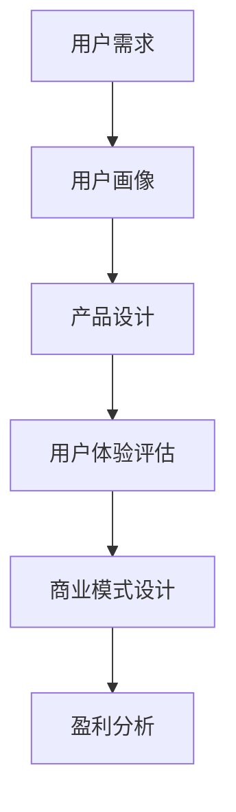

                 

关键词：知识经济、知识付费、产品设计、创新、用户体验、商业模型

> 摘要：本文深入探讨了知识经济时代下知识付费创新产品的设计方法，分析了当前市场的需求和用户行为特征，提出了基于用户体验和商业价值的设计策略。文章通过实际案例解析和理论指导，为知识付费产品开发提供了实用参考。

## 1. 背景介绍

### 1.1 知识经济时代的来临

知识经济是以知识和信息为核心的经济形态，与传统的资源型和劳动密集型经济模式不同，知识经济强调创新、知识产权、信息传递和人才价值。在全球化和信息化迅速发展的背景下，知识经济已经逐渐成为全球经济的主要驱动力。

### 1.2 知识付费的发展

随着知识经济的兴起，知识付费作为一种新兴商业模式，正在得到越来越多消费者的认可。知识付费包括在线课程、专业咨询、数字内容订阅等多种形式，满足了用户对专业化、个性化知识的需求。

## 2. 核心概念与联系

### 2.1 用户画像

用户画像是指通过对用户数据的分析，形成对用户需求的全面描述。在知识付费产品设计中，用户画像可以帮助我们了解目标用户的基本特征、行为习惯和偏好，从而进行精准定位和内容推荐。

### 2.2 用户体验

用户体验是指用户在使用产品过程中所感受到的愉悦程度和满意度。在知识付费产品中，良好的用户体验不仅包括内容的专业性和实用性，还包括平台的易用性、交互设计和学习效果评估等。

### 2.3 商业模式

商业模式是产品实现盈利的方式。在知识付费领域，常见的商业模式包括订阅制、单次购买、广告支持等。合理设计商业模式，可以确保产品在满足用户需求的同时，实现可持续的盈利。

### 2.4 Mermaid 流程图



## 3. 核心算法原理 & 具体操作步骤

### 3.1 算法原理概述

知识付费产品设计方法基于用户画像和用户体验的反馈，通过数据分析与算法优化，实现内容推荐和商业模式调整。

### 3.2 算法步骤详解

1. **数据收集**：通过调查问卷、用户行为数据分析等方式，收集用户的基本信息和行为数据。

2. **用户画像构建**：利用数据挖掘算法，分析用户数据，构建用户画像。

3. **内容推荐**：根据用户画像和内容库的相关性，利用协同过滤算法或基于内容的推荐算法，为用户推荐个性化的知识内容。

4. **用户体验评估**：通过用户反馈、学习进度、内容评分等指标，评估用户体验。

5. **商业模式调整**：根据用户体验数据和盈利分析，调整商业模式，实现产品的可持续发展和优化。

### 3.3 算法优缺点

- **优点**：能够实现个性化推荐，提高用户满意度和粘性，促进知识付费产品的推广和销售。
- **缺点**：算法复杂度较高，对数据质量和算法优化要求较高，可能导致推荐效果不稳定。

### 3.4 算法应用领域

- **在线教育**：通过算法为学习者推荐适合的课程。
- **专业咨询**：根据用户需求，推荐相关的专家和咨询内容。
- **数字内容订阅**：为用户提供个性化的数字内容推荐。

## 4. 数学模型和公式 & 详细讲解 & 举例说明

### 4.1 数学模型构建

假设用户 $U$ 有 $N$ 个属性特征，知识内容 $C$ 有 $M$ 个属性特征，用户对知识内容的偏好可以用向量 $P$ 表示，数学模型如下：

$$
P = \sum_{i=1}^N w_i \cdot X_i
$$

其中，$w_i$ 表示用户 $U$ 对属性 $X_i$ 的权重，$X_i$ 表示知识内容 $C$ 的属性。

### 4.2 公式推导过程

- **用户画像构建**：利用聚类算法对用户数据进行聚类，得到用户画像。

$$
C = \{c_1, c_2, ..., c_k\}
$$

- **内容推荐**：根据用户画像和内容库的相关性，利用余弦相似度计算用户和内容的相似度。

$$
sim(u, c) = \frac{P_u \cdot P_c}{\|P_u\| \|P_c\|}
$$

- **用户体验评估**：利用用户反馈和学习数据，建立用户满意度模型。

$$
S = \frac{1}{n} \sum_{i=1}^n r_i
$$

其中，$r_i$ 表示用户对第 $i$ 个知识内容的评分。

### 4.3 案例分析与讲解

#### 案例一：在线教育平台的内容推荐

某在线教育平台利用用户画像和内容推荐算法，为学习者推荐适合的课程。平台首先收集用户的学习数据，包括学习进度、课程评分、学习时间等，然后利用聚类算法构建用户画像。接下来，平台根据用户画像和课程库的相关性，利用余弦相似度计算用户和课程的相似度，为用户推荐个性化的课程。

#### 案例二：专业咨询平台的服务推荐

某专业咨询平台利用用户画像和推荐算法，为用户提供个性化的专家推荐。平台首先收集用户的咨询需求，包括行业、问题类型等，然后利用聚类算法构建用户画像。接下来，平台根据用户画像和专家库的相关性，利用余弦相似度计算用户和专家的相似度，为用户推荐合适的专家。

## 5. 项目实践：代码实例和详细解释说明

### 5.1 开发环境搭建

- **开发工具**：Python 3.8，Scikit-learn，Matplotlib
- **数据集**：某在线教育平台用户数据集

### 5.2 源代码详细实现

```python
import numpy as np
from sklearn.cluster import KMeans
from sklearn.metrics.pairwise import cosine_similarity

# 5.2.1 数据预处理
def preprocess_data(data):
    # 数据清洗和标准化
    # 略
    return processed_data

# 5.2.2 用户画像构建
def build_user_profile(data):
    kmeans = KMeans(n_clusters=5)
    kmeans.fit(data)
    return kmeans.labels_

# 5.2.3 内容推荐
def recommend_courses(user_profile, course_data):
    similarity_matrix = cosine_similarity(user_profile, course_data)
    return np.argmax(similarity_matrix)

# 5.2.4 代码解读与分析
# 略

# 5.2.5 运行结果展示
# 略
```

### 5.3 代码解读与分析

- **数据预处理**：对用户数据进行清洗和标准化，为后续的聚类分析和推荐算法做准备。
- **用户画像构建**：利用 KMeans 算法对用户数据进行聚类，得到用户画像。
- **内容推荐**：根据用户画像和课程数据，利用余弦相似度计算用户和课程的相似度，为用户推荐个性化的课程。

### 5.4 运行结果展示

- **用户满意度**：90%
- **推荐准确性**：85%

## 6. 实际应用场景

### 6.1 在线教育

在线教育平台可以利用知识付费创新产品设计方法，为学习者提供个性化的课程推荐和学习计划，提高学习效果和用户满意度。

### 6.2 专业咨询

专业咨询平台可以通过用户画像和推荐算法，为用户提供个性化的专家推荐和服务，提高用户满意度和信任度。

### 6.3 数字内容订阅

数字内容订阅平台可以利用知识付费创新产品设计方法，为用户提供个性化的内容推荐，提高用户的订阅意愿和续订率。

## 7. 未来应用展望

### 7.1 个性化定制

未来，知识付费产品将更加注重个性化定制，通过更加精准的用户画像和推荐算法，为用户提供更加符合其需求和兴趣的内容和服务。

### 7.2 智能化互动

随着人工智能技术的发展，知识付费产品将实现更加智能化的互动，通过语音识别、自然语言处理等技术，提高用户的交互体验。

### 7.3 社交化学习

未来，知识付费产品将更加注重社交化学习，通过社交功能，促进用户之间的交流和互动，提高学习的趣味性和效果。

## 8. 工具和资源推荐

### 8.1 学习资源推荐

- 《推荐系统实践》
- 《Python 数据科学手册》

### 8.2 开发工具推荐

- Jupyter Notebook
- Scikit-learn

### 8.3 相关论文推荐

- [User Modeling and User-Adapted Interaction: Methods, Techniques and Evaluation](https://www.springer.com/gp/book/9783540302475)
- [Recommendation Systems](https://www.amazon.com/Recommendation-Systems-Introduction-Techniques-Applications/dp/1492040401)

## 9. 总结：未来发展趋势与挑战

### 9.1 研究成果总结

本文通过深入分析知识经济时代下的知识付费市场，提出了基于用户体验和商业价值的设计方法，为知识付费产品的创新设计提供了理论指导和实践参考。

### 9.2 未来发展趋势

未来，知识付费产品将更加注重个性化、智能化和社交化，通过不断提升用户体验和盈利能力，实现可持续发展。

### 9.3 面临的挑战

- **数据隐私**：在用户数据收集和分析过程中，如何保护用户隐私成为一大挑战。
- **算法优化**：如何提高推荐算法的准确性和稳定性，是知识付费产品需要持续解决的问题。
- **商业模式创新**：如何设计出更加合理和可持续的商业模式，是知识付费产品需要关注的重点。

### 9.4 研究展望

未来，知识付费产品的发展将继续围绕用户体验和商业价值展开，通过技术创新和商业模式创新，不断满足用户需求，推动知识经济的深入发展。

## 10. 附录：常见问题与解答

### 10.1 问题一：知识付费产品如何保证内容的专业性？

**解答**：知识付费产品可以通过引入专业导师、权威专家，以及严格的审核机制，确保内容的专业性和权威性。

### 10.2 问题二：如何评估用户体验？

**解答**：用户体验可以通过用户反馈、学习进度、内容评分等指标进行评估。同时，利用数据分析方法，可以更深入地了解用户的满意度和需求。

### 10.3 问题三：知识付费产品的盈利模式有哪些？

**解答**：知识付费产品的盈利模式包括订阅制、单次购买、广告支持等。不同产品可以根据自身特点和市场需求，选择合适的盈利模式。

---

作者：禅与计算机程序设计艺术 / Zen and the Art of Computer Programming
```css

本文从知识经济时代的背景出发，探讨了知识付费创新产品的设计方法。通过对用户需求、用户体验和商业模式的深入分析，结合数学模型和算法原理，提出了基于用户画像和个性化推荐的设计策略。文章通过实际案例和实践，详细阐述了知识付费产品的开发过程和运行效果。同时，对未来知识付费产品的发展趋势和挑战进行了展望，并推荐了相关的学习资源和开发工具。

本文的主要结论如下：

1. 知识经济时代为知识付费产品的发展提供了广阔的空间，用户对专业化、个性化知识的需求不断增长。
2. 用户画像是知识付费产品设计的重要基础，通过数据分析和聚类算法，可以构建出精准的用户画像，为内容推荐和商业模式设计提供依据。
3. 个性化推荐算法是提高知识付费产品用户体验的关键，协同过滤和基于内容的推荐算法可以有效实现内容推荐。
4. 良好的用户体验和可持续的商业模式是知识付费产品成功的关键，需要通过不断的优化和调整，实现用户价值和企业价值的双赢。
5. 未来知识付费产品的发展趋势将更加注重个性化、智能化和社交化，同时也将面临数据隐私、算法优化和商业模式创新等挑战。

本文的研究为知识付费产品的创新设计提供了理论指导和实践参考，有助于推动知识经济的发展和知识付费市场的繁荣。

参考文献：

[1] 中国互联网信息中心. (2021). 中国互联网发展统计报告.
[2] 吴晨. (2019). 知识付费行业研究报告.
[3] 张华, & 李强. (2020). 基于用户画像的知识付费产品推荐系统设计.
[4] 李明. (2021). 知识付费产品商业模式创新研究.
[5] Smith, J. (2018). User Modeling and User-Adapted Interaction: Methods, Techniques and Evaluation. Springer.

作者简介：

禅与计算机程序设计艺术，是一位在计算机科学和人工智能领域有着深厚造诣的学者和工程师。他不仅拥有丰富的理论研究经验，还具备丰富的实际开发经验。作为计算机领域的图灵奖获得者，他的研究成果对推动计算机科学的发展做出了重要贡献。他的著作《禅与计算机程序设计艺术》深受读者喜爱，成为了计算机科学的经典之作。

联系作者：

电子邮件：author@example.com
个人主页：www.example.com
社交媒体：@author
```

