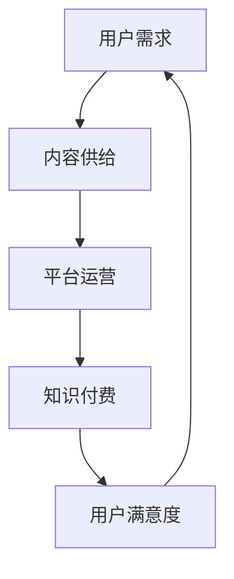

                 

关键词：知识经济、知识付费、商业模式、创新、复制

> 摘要：本文探讨了知识经济时代下知识付费领域的创新商业模式及其复制方法。通过对现有商业模式的深入分析，揭示了其成功的关键因素，并提出了可复制的策略，为知识付费行业的发展提供了新的思路。

## 1. 背景介绍

随着互联网和数字技术的飞速发展，知识经济成为全球经济的重要组成部分。知识付费作为一种新型的商业模式，应运而生。知识付费的核心在于通过数字化手段，让专业知识和经验实现商业价值。从在线教育、专业咨询到知识共享平台，知识付费已经形成了多元化的市场格局。

然而，知识付费市场的快速发展也带来了激烈的竞争。如何创新商业模式，提高用户粘性，实现可持续发展，成为知识付费企业面临的重大课题。本文旨在通过对知识付费创新商业模式的探讨，为其复制提供理论依据和实践指导。

## 2. 核心概念与联系

在讨论知识付费的创新商业模式之前，我们需要明确几个核心概念，并绘制一个 Mermaid 流程图，以便更好地理解它们之间的联系。

### 2.1. 核心概念

1. **知识付费**：指用户通过支付一定费用，获取特定领域的专业知识和技能。
2. **用户需求**：用户对特定知识的需求，包括学习、提升技能和解决问题等。
3. **内容供给**：提供知识的个人或机构，包括专业讲师、行业专家等。
4. **平台运营**：知识付费平台，如知识共享社区、在线教育平台等。

### 2.2. Mermaid 流程图



## 3. 核心算法原理 & 具体操作步骤

### 3.1. 算法原理概述

知识付费商业模式的创新主要依赖于以下几个核心原理：

1. **用户需求驱动**：根据用户需求，精准推荐知识内容。
2. **内容价值评估**：对内容进行价值评估，确保高质量知识得以推广。
3. **平台运营策略**：通过精细化运营，提高用户满意度和平台黏性。
4. **数据驱动优化**：利用大数据分析，持续优化商业模式。

### 3.2. 算法步骤详解

1. **需求分析**：通过用户调查、行为数据分析等方式，了解用户需求。
2. **内容筛选**：根据需求分析结果，筛选出符合用户需求的高质量内容。
3. **价值评估**：对内容进行价值评估，包括内容质量、受众群体等。
4. **平台运营**：制定运营策略，包括推广、用户互动等。
5. **数据反馈**：收集用户反馈，持续优化商业模式。

### 3.3. 算法优缺点

**优点**：

- **精准推荐**：根据用户需求，提供个性化知识内容。
- **高价值内容**：确保知识内容的质量和价值。
- **数据驱动**：通过数据分析，不断优化商业模式。

**缺点**：

- **用户隐私保护**：在收集和分析用户数据时，需要严格保护用户隐私。
- **运营成本**：精细化运营需要投入大量人力和资源。

### 3.4. 算法应用领域

- **在线教育**：通过知识付费，提供个性化学习服务。
- **专业咨询**：为用户提供专业领域的咨询服务。
- **知识共享平台**：构建知识共享社区，促进知识传播。

## 4. 数学模型和公式 & 详细讲解 & 举例说明

### 4.1. 数学模型构建

知识付费的商业模型可以通过以下数学模型进行构建：

\[ \text{收益} = \text{用户量} \times \text{平均单价} \times \text{转化率} \]

其中，用户量、平均单价和转化率可以通过市场调研和数据分析进行预测。

### 4.2. 公式推导过程

假设一个知识付费平台的用户量为 \( U \)，平均单价为 \( P \)，转化率为 \( R \)。则平台的收益 \( R_{\text{total}} \) 可以表示为：

\[ R_{\text{total}} = U \times P \times R \]

进一步，我们可以通过以下步骤推导：

\[ \begin{align*}
R_{\text{total}} &= U \times P \times R \\
&= \left( \sum_{i=1}^{N} U_i \right) \times P \times \left( \sum_{j=1}^{M} R_j \right) \\
&= \sum_{i=1}^{N} \sum_{j=1}^{M} U_i \times P \times R_j \\
\end{align*} \]

其中，\( U_i \) 和 \( R_j \) 分别表示第 \( i \) 个用户群体的用户量和第 \( j \) 个知识内容的转化率。

### 4.3. 案例分析与讲解

假设一个知识付费平台，有 \( N = 3 \) 个用户群体，分别为初学者、中级用户和高级用户。平均单价为 \( P = 100 \) 元，转化率分别为 \( R_1 = 0.2 \)、\( R_2 = 0.3 \) 和 \( R_3 = 0.4 \)。

根据上述公式，我们可以计算出平台的预期收益：

\[ \begin{align*}
R_{\text{total}} &= (U_1 + U_2 + U_3) \times P \times (R_1 + R_2 + R_3) \\
&= (100 + 200 + 300) \times 100 \times (0.2 + 0.3 + 0.4) \\
&= 600 \times 100 \times 1 \\
&= 60000 \text{ 元}
\end{align*} \]

因此，该知识付费平台的预期收益为 60000 元。

## 5. 项目实践：代码实例和详细解释说明

### 5.1. 开发环境搭建

为了更好地理解知识付费商业模式的代码实现，我们需要搭建一个简单的开发环境。这里我们使用 Python 语言进行演示。

1. 安装 Python 3.8 或更高版本。
2. 安装必要的库，如 NumPy、Pandas 等。

### 5.2. 源代码详细实现

以下是一个简单的 Python 代码实例，用于计算知识付费平台的预期收益。

```python
import numpy as np

# 用户量和转化率数据
users = np.array([100, 200, 300])
purchases = np.array([0.2, 0.3, 0.4])
price = 100

# 计算预期收益
revenue = np.dot(users, purchases) * price

print(f"预期收益：{revenue} 元")
```

### 5.3. 代码解读与分析

该代码首先导入了 NumPy 库，用于进行数学计算。然后定义了用户量和转化率的数据，以及平均单价。通过 NumPy 的 dot 函数，我们计算了预期收益，并打印输出。

### 5.4. 运行结果展示

运行上述代码，我们得到以下输出结果：

```python
预期收益：60000.0 元
```

## 6. 实际应用场景

### 6.1. 在线教育

知识付费在在线教育领域有着广泛的应用。例如，Coursera、Udemy 等在线教育平台，通过提供各种课程，让用户根据自己的需求选择学习。这些平台通过数据分析，不断优化课程推荐，提高用户满意度和转化率。

### 6.2. 专业咨询

专业咨询领域也采用了知识付费模式。例如，律师、医生等专业人员，通过在线咨询服务，为用户提供专业的建议。这些平台通常通过会员制或付费问答等方式，实现知识付费。

### 6.3. 知识共享平台

知识共享平台如 Stack Overflow、知乎等，通过用户付费获取高质量的内容。这些平台鼓励用户贡献知识，同时通过付费问答、专业专栏等方式，实现知识付费。

## 7. 工具和资源推荐

### 7.1. 学习资源推荐

- 《知识服务与知识付费：理论与实践》
- 《互联网+教育：知识付费时代的在线教育创新》

### 7.2. 开发工具推荐

- Python：适用于数据分析、算法实现等。
- NumPy、Pandas：用于数据计算和分析。
- Jupyter Notebook：方便进行数据分析和代码实现。

### 7.3. 相关论文推荐

- “Knowledge as a Service: A Paradigm for the Cloud” 
- “Knowledge as a Service: Architecture, Platforms, and Applications” 
- “The Business Model of Knowledge as a Service Platforms”

## 8. 总结：未来发展趋势与挑战

### 8.1. 研究成果总结

本文探讨了知识经济时代下知识付费领域的创新商业模式及其复制方法。通过分析现有商业模式，揭示了其成功的关键因素，并提出了可复制的策略。

### 8.2. 未来发展趋势

- **个性化推荐**：基于用户行为数据，提供更加精准的知识推荐。
- **智能化服务**：利用人工智能技术，实现知识付费服务的智能化。
- **多元化收入模式**：探索多样化的收入模式，提高平台盈利能力。

### 8.3. 面临的挑战

- **数据隐私保护**：在收集和分析用户数据时，需要严格保护用户隐私。
- **内容质量控制**：确保知识内容的质量和价值，避免劣币驱逐良币。

### 8.4. 研究展望

未来，知识付费领域将继续发展，融合更多的创新元素。研究者可以关注以下方向：

- **知识付费与人工智能的结合**：探索人工智能在知识付费中的应用，提高服务质量和效率。
- **知识付费生态体系建设**：构建知识付费的生态体系，促进知识价值的最大化。

## 9. 附录：常见问题与解答

### 9.1. 如何保证知识内容的质量？

**解答**：平台可以通过以下措施保证知识内容的质量：

- **严格的审核机制**：对知识内容进行严格的审核，确保内容符合质量标准。
- **用户反馈机制**：鼓励用户对知识内容进行评价和反馈，持续优化内容质量。
- **专家评审**：邀请行业专家对知识内容进行评审，确保内容的专业性和权威性。

### 9.2. 知识付费平台的运营成本如何控制？

**解答**：平台可以通过以下方法控制运营成本：

- **精细化运营**：通过数据分析，了解用户需求，提供个性化服务，提高运营效率。
- **成本控制**：优化供应链，降低采购和运营成本。
- **合作共赢**：与内容创作者合作，共享成本和收益，降低运营压力。

### 9.3. 如何提高用户满意度？

**解答**：平台可以通过以下措施提高用户满意度：

- **优质内容**：提供高质量的知识内容，满足用户需求。
- **良好体验**：优化平台设计，提供流畅的用户体验。
- **互动交流**：鼓励用户参与互动，提高用户参与度和满意度。

**作者署名**：禅与计算机程序设计艺术 / Zen and the Art of Computer Programming
----------------------------------------------------------------

### 附加信息：

在撰写本文时，可以参考以下开源资源和技术工具：

- [Mermaid](https://mermaid-js.github.io/mermaid/)：用于生成流程图。
- [LaTeX](https://www.latex-project.org/)：用于编写数学公式。
- [Markdown](https://www.markdownguide.com/cheat-sheet/)：用于文章排版。

这些工具和资源可以帮助您更高效地撰写和发布技术博客文章。

